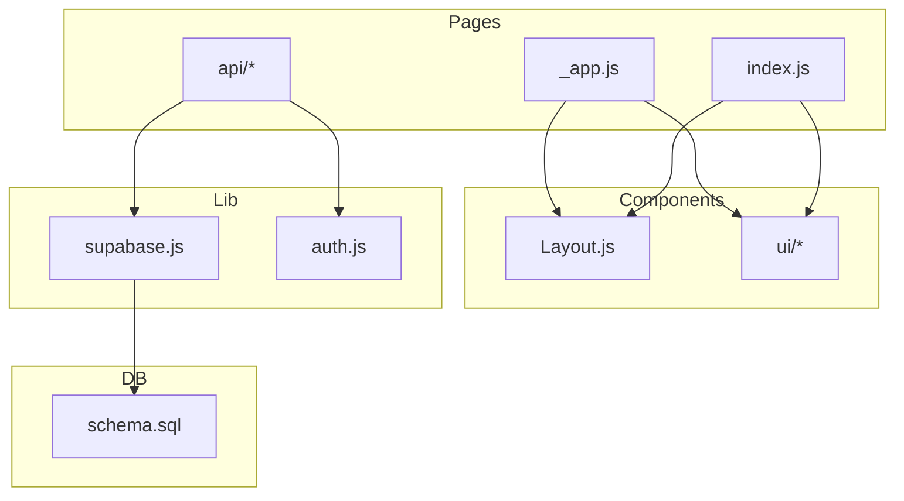
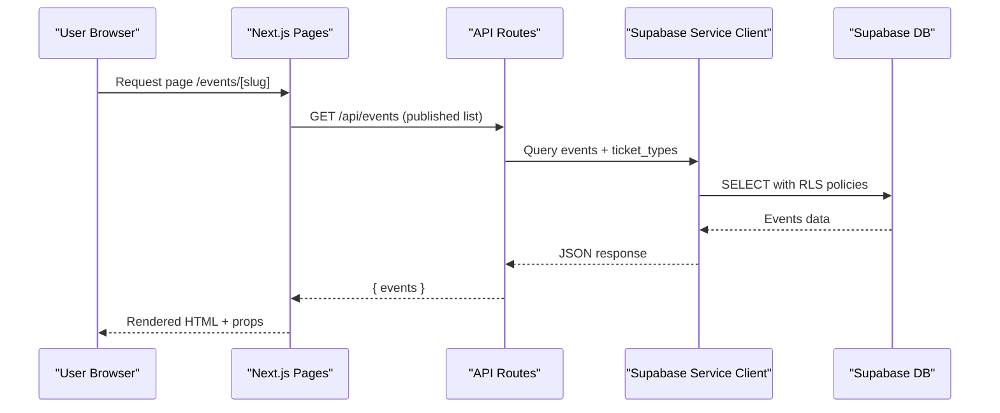
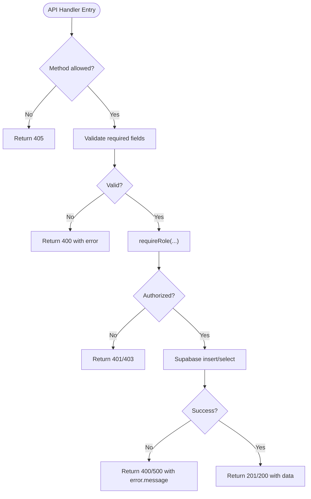
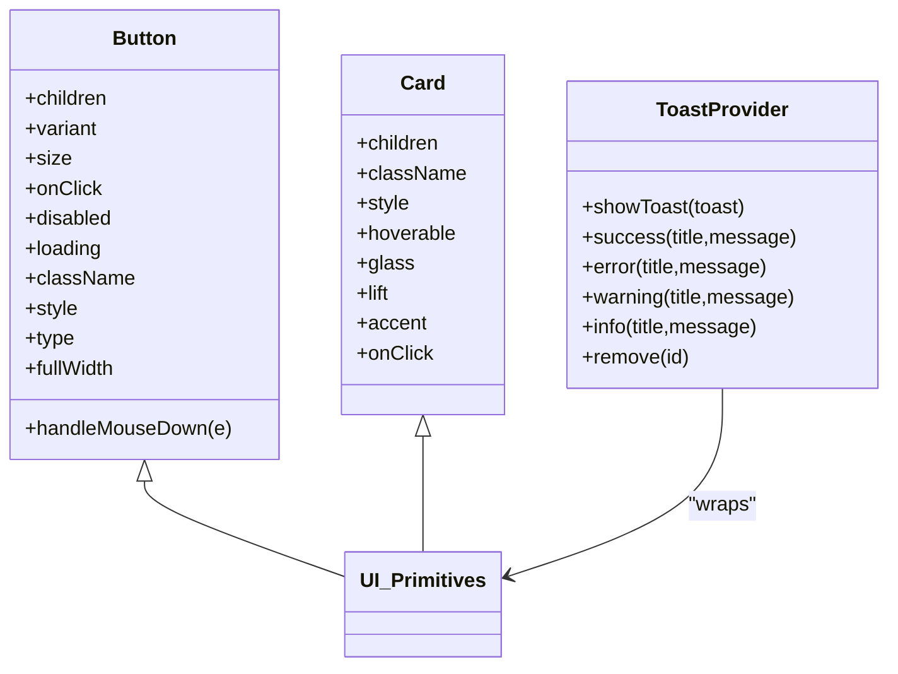
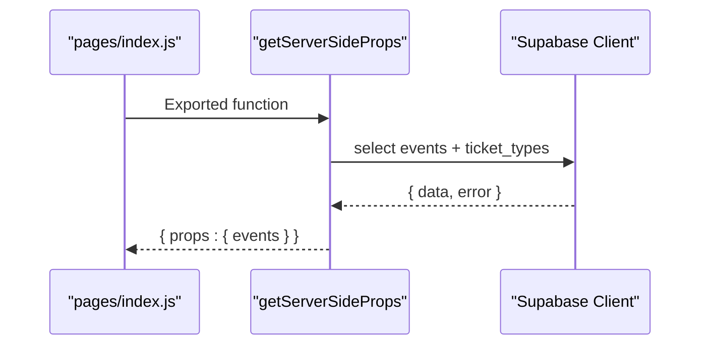
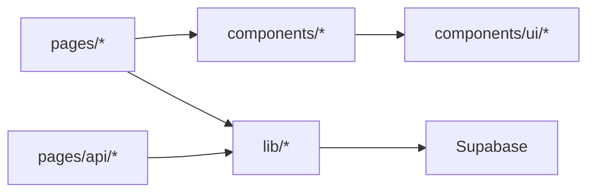
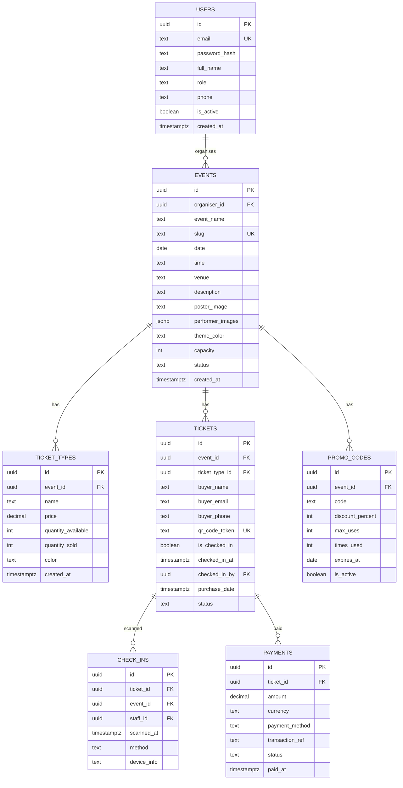

# Coding Standards & Conventions

<cite>
**Referenced Files in This Document**
- [package.json](file://package.json)
- [next.config.js](file://next.config.js)
- [pages/_app.js](file://pages/_app.js)
- [components/Layout.js](file://components/Layout.js)
- [components/ui/index.js](file://components/ui/index.js)
- [components/ui/Button.js](file://components/ui/Button.js)
- [components/ui/Card.js](file://components/ui/Card.js)
- [components/ui/Toast.js](file://components/ui/Toast.js)
- [lib/supabase.js](file://lib/supabase.js)
- [lib/auth.js](file://lib/auth.js)
- [pages/api/auth/login.js](file://pages/api/auth/login.js)
- [pages/api/events/index.js](file://pages/api/events/index.js)
- [pages/index.js](file://pages/index.js)
- [supabase/schema.sql](file://supabase/schema.sql)
- [vercel.json](file://vercel.json)
</cite>

## Table of Contents
1. Introduction
2. Project Structure
3. Core Components
4. Architecture Overview
5. Detailed Component Analysis
6. Dependency Analysis
7. Performance Considerations
8. Troubleshooting Guide
9. Conclusion
10. Appendices

## Introduction
This document defines the coding standards and conventions for TicketFlow development. It covers JavaScript/React style, ES6+ usage, React component patterns, Next.js best practices, naming conventions, code organization, import/export patterns, error handling, logging, security, linting/formatting guidance, and examples of well-structured components, API routes, and utilities. The goal is to ensure consistency, maintainability, and performance across the codebase.

## Project Structure
TicketFlow follows a feature-based layout with clear separation between UI components, pages, API routes, and shared libraries:
- components/: Reusable UI components and layouts
- lib/: Shared utilities (auth, Stripe, Supabase client)
- pages/: Next.js pages and API routes
- supabase/: Database schema and migrations
- Configuration files at root (Next.js, Vercel, package scripts)

**Diagram sources**
- [pages/_app.js:1-13](file://pages/_app.js#L1-L13)
- [components/Layout.js:1-281](file://components/Layout.js#L1-L281)
- [components/ui/index.js:1-10](file://components/ui/index.js#L1-L10)
- [lib/supabase.js:1-23](file://lib/supabase.js#L1-L23)
- [lib/auth.js:1-47](file://lib/auth.js#L1-L47)
- [supabase/schema.sql:1-166](file://supabase/schema.sql#L1-L166)

**Section sources**
- [package.json:1-24](file://package.json#L1-L24)
- [next.config.js:1-14](file://next.config.js#L1-L14)
- [pages/_app.js:1-13](file://pages/_app.js#L1-L13)

## Core Components
- Layout: Global shell with theme switching, navigation, and footer. Uses Next Head and router.
- UI primitives: Button, Card, Badge, Input, Progress, Skeleton, Toast, StepIndicator, CountdownTimer.
- Providers: ToastProvider wraps app-level notifications.
- Data access: Supabase client with public and service-role clients.
- Auth: Password hashing, session token creation/parsing, role enforcement.

Key patterns:
- Functional components with default exports
- Props-driven styling via className and style objects
- Context for global state (toasts)
- Server-side data fetching via getServerSideProps or API routes

**Section sources**
- [components/Layout.js:1-281](file://components/Layout.js#L1-L281)
- [components/ui/Button.js:1-74](file://components/ui/Button.js#L1-L74)
- [components/ui/Card.js:1-33](file://components/ui/Card.js#L1-L33)
- [components/ui/Toast.js:1-43](file://components/ui/Toast.js#L1-L43)
- [lib/supabase.js:1-23](file://lib/supabase.js#L1-L23)
- [lib/auth.js:1-47](file://lib/auth.js#L1-L47)

## Architecture Overview
The application uses Next.js App Router pattern with file-based routing. Client components render UI; server functions fetch data from Supabase using service-role keys. Authentication is cookie-based with simple session tokens. Security policies are enforced at the database layer.

**Diagram sources**
- [pages/index.js:726-750](file://pages/index.js#L726-L750)
- [pages/api/events/index.js:1-42](file://pages/api/events/index.js#L1-L42)
- [lib/supabase.js:1-23](file://lib/supabase.js#L1-L23)
- [supabase/schema.sql:120-154](file://supabase/schema.sql#L120-L154)

## Detailed Component Analysis

### Naming Conventions
- Files and folders: kebab-case for pages and features (e.g., api/auth/login.js), PascalCase for components (e.g., Button.js).
- Components: PascalCase function names, default export.
- Variables and functions: camelCase.
- Constants: UPPER_SNAKE_CASE when appropriate.
- Database tables: snake_case (users, events, tickets, check_ins, payments, promo_codes).
- Environment variables: NEXT_PUBLIC_* for client, others server-only.

Examples in code:
- Component default exports and prop destructuring
- API route handlers with method checks and validation
- Supabase client initialization with env variables

**Section sources**
- [components/ui/Button.js:1-74](file://components/ui/Button.js#L1-L74)
- [pages/api/auth/login.js:1-31](file://pages/api/auth/login.js#L1-L31)
- [lib/supabase.js:1-23](file://lib/supabase.js#L1-L23)
- [supabase/schema.sql:10-117](file://supabase/schema.sql#L10-L117)

### JavaScript/ES6+ Style
- Use const/let, arrow functions, destructuring, optional chaining, template literals.
- Avoid var; prefer modules with import/export.
- Keep logic in small, focused functions; avoid large inline blocks.
- Prefer functional composition over imperative loops where readable.

Patterns observed:
- Destructuring in API handlers and components
- Optional chaining for safe property access
- Template literals for URLs and messages

**Section sources**
- [pages/api/events/index.js:1-42](file://pages/api/events/index.js#L1-L42)
- [pages/index.js:1-120](file://pages/index.js#L1-L120)

### React Component Patterns
- Functional components with hooks (useState, useEffect, useMemo, useRef).
- Prop validation via defaults and conditional rendering.
- Composition with children and context providers.
- Styling via className and style props; CSS variables for theming.

Example patterns:
- Button variant/size mapping
- Card glass/lift/accent toggles
- Toast provider with context

**Section sources**
- [components/ui/Button.js:1-74](file://components/ui/Button.js#L1-L74)
- [components/ui/Card.js:1-33](file://components/ui/Card.js#L1-L33)
- [components/ui/Toast.js:1-43](file://components/ui/Toast.js#L1-L43)

### Next.js Best Practices
- File-based routing under pages/
- getServerSideProps for server-side data fetching on pages
- API routes for backend logic
- Strict mode enabled in Next config
- Image optimization configured with remotePatterns

Observed usage:
- getServerSideProps querying Supabase
- next.config.js enabling reactStrictMode and image domains
- _app.js wrapping with providers and layout

**Section sources**
- [pages/index.js:726-750](file://pages/index.js#L726-L750)
- [next.config.js:1-14](file://next.config.js#L1-L14)
- [pages/_app.js:1-13](file://pages/_app.js#L1-L13)

### Import/Export Patterns
- Named exports for utility functions (hashPassword, verifyPassword, requireRole)
- Default exports for components and pages
- Barrel index.js re-exports for UI components

**Section sources**
- [lib/auth.js:1-47](file://lib/auth.js#L1-L47)
- [components/ui/index.js:1-10](file://components/ui/index.js#L1-L10)

### Error Handling Strategies
- API routes validate input and return consistent JSON errors with status codes.
- try/catch around async operations; log errors and respond with 500.
- Role-based authorization throws structured errors with status and message.

Patterns:
- Method checks and early returns
- Centralized error responses
- Structured auth exceptions

**Section sources**
- [pages/api/auth/login.js:1-31](file://pages/api/auth/login.js#L1-L31)
- [pages/api/events/index.js:1-42](file://pages/api/events/index.js#L1-L42)
- [lib/auth.js:38-47](file://lib/auth.js#L38-L47)

### Logging Conventions
- Use console.error for server-side errors in API routes.
- Avoid excessive logging in client components; use toast for user feedback.
- Log only necessary details; never log secrets.

**Section sources**
- [pages/api/auth/login.js:26-29](file://pages/api/auth/login.js#L26-L29)

### Security Best Practices
- Use service-role client only in API routes/server functions.
- Enforce RLS policies in Supabase; restrict public reads to published events.
- Validate and sanitize inputs; normalize slugs and emails.
- Set secure cookies (HttpOnly, SameSite=Lax).
- Configure security headers via Vercel.

Observed:
- getServiceClient() used in API routes
- RLS policies defined in schema
- Cookie flags set on login
- Vercel headers for API routes

**Section sources**
- [lib/supabase.js:15-23](file://lib/supabase.js#L15-L23)
- [supabase/schema.sql:120-154](file://supabase/schema.sql#L120-L154)
- [pages/api/auth/login.js:24-25](file://pages/api/auth/login.js#L24-L25)
- [vercel.json:7-16](file://vercel.json#L7-L16)

### TypeScript Usage
- Current codebase is JavaScript; no TypeScript configuration found.
- Recommendation: Introduce tsconfig, .eslintrc with TS rules, and migrate incrementally.

[No sources needed since this section provides general guidance]

### Linting and Formatting
- Recommended tools: ESLint with Airbnb or StandardJS preset, Prettier, Husky pre-commit hooks.
- Rules: enforce semicolons, quotes, indentation, no-unused-vars, consistent imports.
- Formatter: Prettier with single quotes, trailing commas, 2-space indent.

[No sources needed since this section provides general guidance]

### Examples of Well-Structured Code

#### Example: API Route Pattern
- Validate method and payload
- Authenticate and authorize
- Perform DB operation with service client
- Return standardized JSON responses

**Diagram sources**
- [pages/api/events/index.js:1-42](file://pages/api/events/index.js#L1-L42)
- [lib/auth.js:38-47](file://lib/auth.js#L38-L47)

#### Example: Component Pattern
- Props with defaults
- Controlled state with hooks
- Event handlers with refs and accessibility attributes

**Diagram sources**
- [components/ui/Button.js:1-74](file://components/ui/Button.js#L1-L74)
- [components/ui/Card.js:1-33](file://components/ui/Card.js#L1-L33)
- [components/ui/Toast.js:1-43](file://components/ui/Toast.js#L1-L43)

#### Example: Server-Side Data Fetching
- getServerSideProps constructs Supabase client with env vars
- Queries related tables with joins
- Returns normalized props to page component

**Diagram sources**
- [pages/index.js:726-750](file://pages/index.js#L726-L750)
- [lib/supabase.js:1-23](file://lib/supabase.js#L1-L23)

## Dependency Analysis
External dependencies include Next.js, React, Supabase, Stripe, bcryptjs, QR code generation, and email sending. Internal dependencies follow a layered approach: pages depend on components and lib; API routes depend on lib/auth and lib/supabase.

**Diagram sources**
- [package.json:10-22](file://package.json#L10-L22)
- [pages/_app.js:1-13](file://pages/_app.js#L1-L13)
- [lib/supabase.js:1-23](file://lib/supabase.js#L1-L23)

**Section sources**
- [package.json:10-22](file://package.json#L10-L22)

## Performance Considerations
- Enable React Strict Mode for development-time checks.
- Optimize images with Next.js and allow-list remote domains.
- Use getServerSideProps for initial data to reduce client load.
- Memoize expensive computations with useMemo where appropriate.
- Avoid heavy client-side processing; offload to API routes.

**Section sources**
- [next.config.js:1-14](file://next.config.js#L1-L14)
- [pages/index.js:217-220](file://pages/index.js#L217-L220)

## Troubleshooting Guide
Common issues and resolutions:
- Missing environment variables: Ensure NEXT_PUBLIC_SUPABASE_URL, NEXT_PUBLIC_SUPABASE_ANON_KEY, SUPABASE_SERVICE_ROLE_KEY are set.
- API authentication failures: Verify cookie tf_session exists and is valid; check requireRole behavior.
- Database permission errors: Confirm RLS policies allow intended operations; use service-role client in API routes.
- Image loading blocked: Add remotePatterns for new domains in next.config.js.

**Section sources**
- [lib/supabase.js:6-8](file://lib/supabase.js#L6-L8)
- [lib/auth.js:31-47](file://lib/auth.js#L31-L47)
- [supabase/schema.sql:120-154](file://supabase/schema.sql#L120-L154)
- [next.config.js:4-10](file://next.config.js#L4-L10)

## Conclusion
Adhering to these standards ensures a consistent, secure, and performant TicketFlow codebase. Embrace functional components, clear API patterns, robust error handling, and strong security practices. As the project evolves, consider introducing TypeScript, comprehensive linting/formatting, and automated testing to further improve quality.

## Appendices

### Database Schema Reference
Core entities and relationships:
- users: id, email, password_hash, full_name, role, phone, is_active, created_at
- events: id, organiser_id, event_name, slug, date, time, venue, description, poster_image, performer_images, theme_color, capacity, status, created_at
- ticket_types: id, event_id, name, price, quantity_available, quantity_sold, color, created_at
- tickets: id, event_id, ticket_type_id, buyer_name, buyer_email, buyer_phone, qr_code_token, is_checked_in, checked_in_at, checked_in_by, purchase_date, status
- check_ins: id, ticket_id, event_id, staff_id, scanned_at, method, device_info
- payments: id, ticket_id, amount, currency, payment_method, transaction_ref, status, paid_at
- promo_codes: id, event_id, code, discount_percent, max_uses, times_used, expires_at, is_active

Indexes and policies:
- Indexes on slug, status, qr_code_token, buyer_email, event_id, event_id for check-ins, ticket_id for payments
- RLS policies for public read of published events and ticket types; service role has full access

**Diagram sources**
- [supabase/schema.sql:10-117](file://supabase/schema.sql#L10-L117)