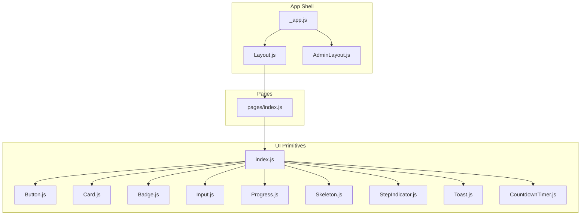
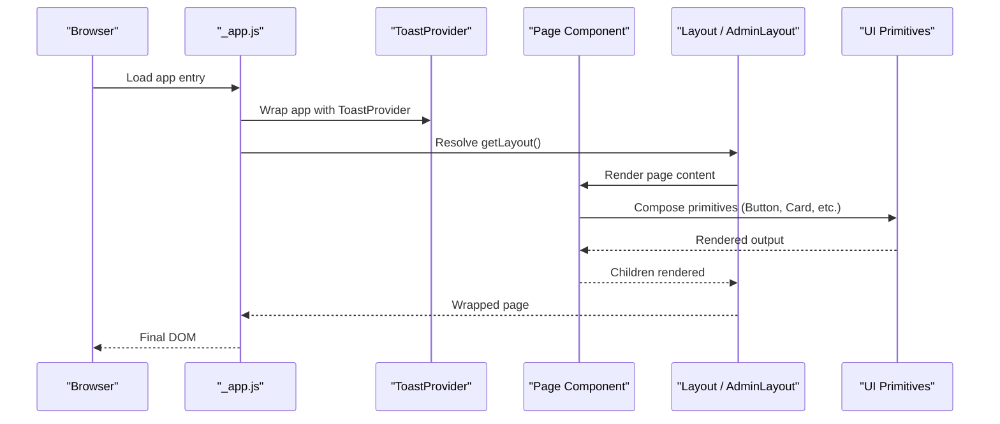
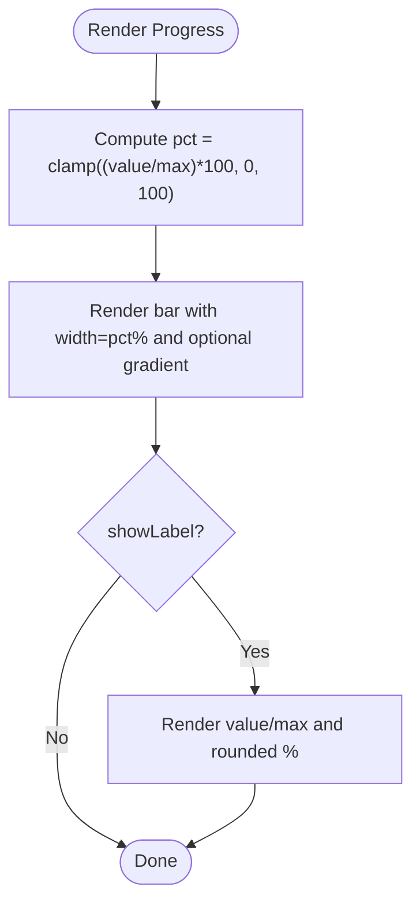
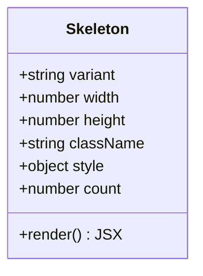
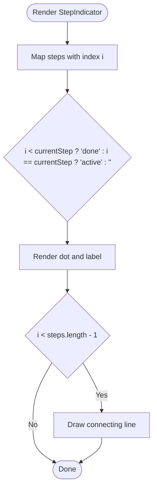
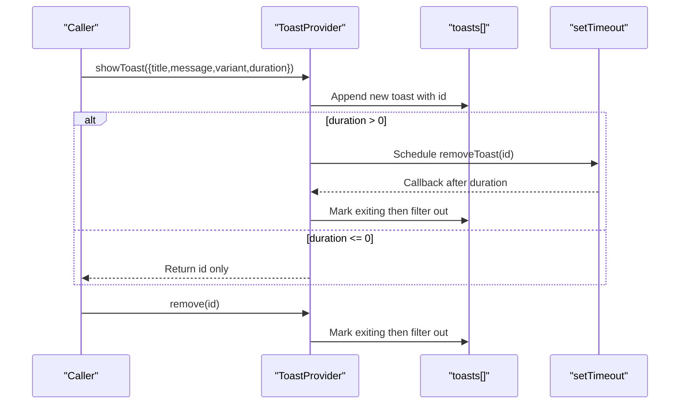
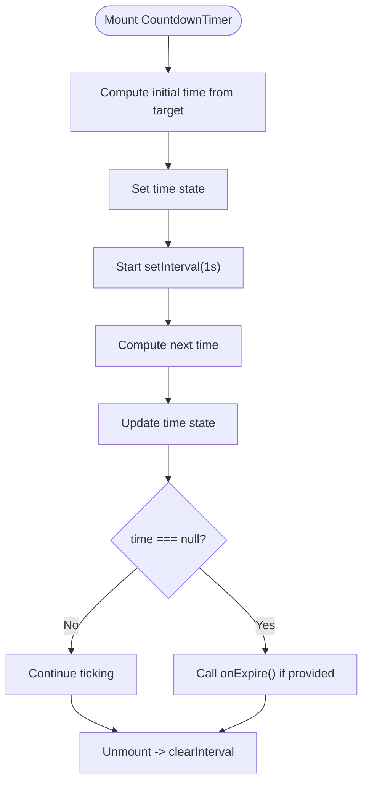
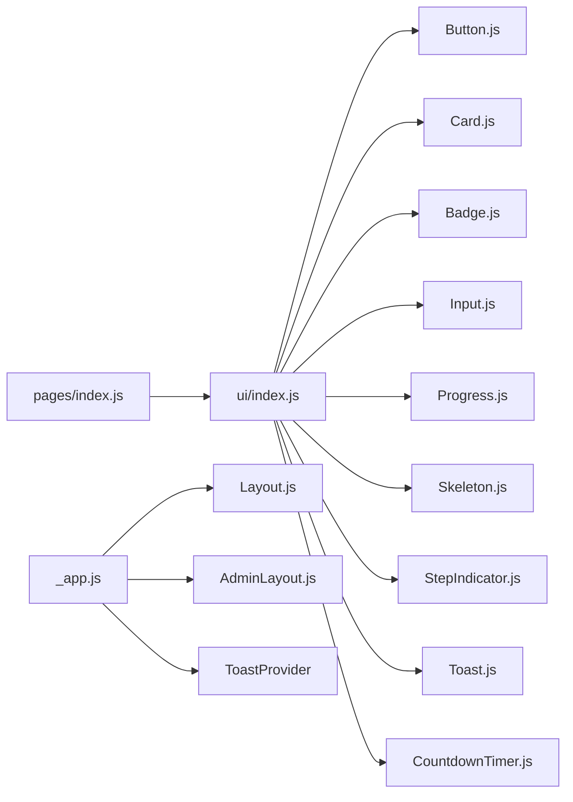

# Component Architecture Patterns

<cite>
**Referenced Files in This Document**
- [components/ui/Progress.js](file://components/ui/Progress.js)
- [components/ui/Skeleton.js](file://components/ui/Skeleton.js)
- [components/ui/StepIndicator.js](file://components/ui/StepIndicator.js)
- [components/ui/Toast.js](file://components/ui/Toast.js)
- [components/ui/CountdownTimer.js](file://components/ui/CountdownTimer.js)
- [components/ui/Button.js](file://components/ui/Button.js)
- [components/ui/Card.js](file://components/ui/Card.js)
- [components/ui/Badge.js](file://components/ui/Badge.js)
- [components/ui/Input.js](file://components/ui/Input.js)
- [components/ui/index.js](file://components/ui/index.js)
- [components/Layout.js](file://components/Layout.js)
- [components/AdminLayout.js](file://components/AdminLayout.js)
- [pages/_app.js](file://pages/_app.js)
- [pages/index.js](file://pages/index.js)
</cite>

## Table of Contents
1. [Introduction](#introduction)
2. [Project Structure](#project-structure)
3. [Core Components](#core-components)
4. [Architecture Overview](#architecture-overview)
5. [Detailed Component Analysis](#detailed-component-analysis)
6. [Dependency Analysis](#dependency-analysis)
7. [Performance Considerations](#performance-considerations)
8. [Troubleshooting Guide](#troubleshooting-guide)
9. [Conclusion](#conclusion)
10. [Appendices](#appendices)

## Introduction
This document explains the component architecture patterns used across TicketFlow, focusing on presentational vs container components, composition patterns, and state management strategies. It provides an in-depth analysis of complex interactive components such as Progress, Skeleton, StepIndicator, Toast, and CountdownTimer, including their internal state management, event handling, and lifecycle methods. Guidelines for testing, error boundaries, and performance optimization (memoization and lazy loading) are also included to help maintain a scalable and performant UI layer.

## Project Structure
TicketFlow organizes UI primitives under components/ui with a centralized barrel export. Layouts encapsulate application chrome and routing context, while pages compose these components to build feature screens. The root app wraps the entire tree with a global provider for shared state (e.g., Toast).

**Diagram sources**
- [pages/_app.js:1-14](file://pages/_app.js#L1-L14)
- [components/Layout.js:1-281](file://components/Layout.js#L1-L281)
- [components/AdminLayout.js:1-194](file://components/AdminLayout.js#L1-L194)
- [components/ui/index.js:1-10](file://components/ui/index.js#L1-L10)
- [pages/index.js:1-753](file://pages/index.js#L1-L753)

**Section sources**
- [components/ui/index.js:1-10](file://components/ui/index.js#L1-L10)
- [pages/_app.js:1-14](file://pages/_app.js#L1-L14)
- [components/Layout.js:1-281](file://components/Layout.js#L1-L281)
- [components/AdminLayout.js:1-194](file://components/AdminLayout.js#L1-L194)

## Core Components
The UI library exposes small, focused, and composable primitives that follow a consistent prop-driven interface. Most are presentational, accepting props and rendering output without side effects. A few manage local or global state (e.g., Toast).

Key characteristics:
- Presentational primitives: Button, Card, Badge, Input, Progress, Skeleton, StepIndicator, CountdownTimer
- Global state via Context: ToastProvider and useToast hook
- Barrel exports for clean imports: index.js

Examples of usage patterns:
- Composition: Cards wrap content; Buttons accept children and variants; Inputs expose label/error/helper
- Stateful providers: ToastProvider manages notification queue and lifecycle

**Section sources**
- [components/ui/Button.js:1-74](file://components/ui/Button.js#L1-L74)
- [components/ui/Card.js:1-33](file://components/ui/Card.js#L1-L33)
- [components/ui/Badge.js:1-30](file://components/ui/Badge.js#L1-L30)
- [components/ui/Input.js:1-49](file://components/ui/Input.js#L1-L49)
- [components/ui/Progress.js:1-39](file://components/ui/Progress.js#L1-L39)
- [components/ui/Skeleton.js:1-48](file://components/ui/Skeleton.js#L1-L48)
- [components/ui/StepIndicator.js:1-24](file://components/ui/StepIndicator.js#L1-L24)
- [components/ui/CountdownTimer.js:1-109](file://components/ui/CountdownTimer.js#L1-L109)
- [components/ui/Toast.js:1-84](file://components/ui/Toast.js#L1-L84)
- [components/ui/index.js:1-10](file://components/ui/index.js#L1-L10)

## Architecture Overview
TicketFlow follows a clear separation between layout containers and page-level composition:
- _app.js wraps every page with a default Layout and a global ToastProvider
- Layout.js and AdminLayout.js provide chrome, navigation, and role-based behavior
- Pages import UI primitives from the barrel and compose them into feature sections

**Diagram sources**
- [pages/_app.js:1-14](file://pages/_app.js#L1-L14)
- [components/Layout.js:1-281](file://components/Layout.js#L1-L281)
- [components/AdminLayout.js:1-194](file://components/AdminLayout.js#L1-L194)

**Section sources**
- [pages/_app.js:1-14](file://pages/_app.js#L1-L14)
- [components/Layout.js:1-281](file://components/Layout.js#L1-L281)
- [components/AdminLayout.js:1-194](file://components/AdminLayout.js#L1-L194)

## Detailed Component Analysis

### Presentational vs Container Components
- Presentational components focus on rendering based on props and minimal local state: Button, Card, Badge, Input, Progress, Skeleton, StepIndicator, CountdownTimer
- Container components orchestrate data and behavior: Layout.js, AdminLayout.js, and page-level components like pages/index.js
- Global state is provided via ToastProvider, consumed through useToast

Guidelines:
- Keep UI primitives pure and prop-driven
- Lift state to container layers when cross-component coordination is needed
- Use Context sparingly for truly global concerns (e.g., notifications)

**Section sources**
- [components/Layout.js:1-281](file://components/Layout.js#L1-L281)
- [components/AdminLayout.js:1-194](file://components/AdminLayout.js#L1-L194)
- [pages/index.js:1-753](file://pages/index.js#L1-L753)
- [components/ui/Toast.js:1-84](file://components/ui/Toast.js#L1-L84)

### Composition Patterns
- Card wraps arbitrary children and applies visual styles conditionally (glass, lift, accent)
- Button accepts children and renders optional loading indicator
- Skeleton supports count prop to render multiple instances recursively
- StepIndicator maps over steps array to render a stepper UI

Best practices:
- Favor composition over configuration where possible
- Use className/style props to allow consumers to override appearance
- Expose simple, predictable props for common behaviors

**Section sources**
- [components/ui/Card.js:1-33](file://components/ui/Card.js#L1-L33)
- [components/ui/Button.js:1-74](file://components/ui/Button.js#L1-L74)
- [components/ui/Skeleton.js:1-48](file://components/ui/Skeleton.js#L1-L48)
- [components/ui/StepIndicator.js:1-24](file://components/ui/StepIndicator.js#L1-L24)

### State Management Strategies
- Local state: CountdownTimer uses useState and useEffect to compute and update time
- Global state: ToastProvider maintains a toast queue and exposes actions via Context
- Event-driven updates: Buttons handle mouse interactions; Inputs propagate events via rest props

Recommendations:
- Prefer local state for isolated concerns
- Use Context for cross-cutting features like notifications
- Avoid unnecessary re-renders by memoizing derived values and stable callbacks

**Section sources**
- [components/ui/CountdownTimer.js:1-109](file://components/ui/CountdownTimer.js#L1-L109)
- [components/ui/Toast.js:1-84](file://components/ui/Toast.js#L1-L84)
- [components/ui/Button.js:1-74](file://components/ui/Button.js#L1-L74)
- [components/ui/Input.js:1-49](file://components/ui/Input.js#L1-L49)

### Complex Interactive Components

#### Progress
- Purpose: Visual progress bar with percentage calculation and optional label
- Props: value, max, color, showLabel, className, style, height
- Behavior: Clamps percentage between 0 and 100; renders gradient background if color provided
- Usage: Used in pages to indicate ticket sales progress

**Diagram sources**
- [components/ui/Progress.js:1-39](file://components/ui/Progress.js#L1-L39)

**Section sources**
- [components/ui/Progress.js:1-39](file://components/ui/Progress.js#L1-L39)
- [pages/index.js:1-753](file://pages/index.js#L1-L753)

#### Skeleton
- Purpose: Placeholder UI for loading states with multiple variants
- Props: variant, width, height, className, style, count
- Behavior: Supports recursive rendering for count > 1; applies default sizes per variant
- Usage: Ideal for list items and cards during async data fetch

**Diagram sources**
- [components/ui/Skeleton.js:1-48](file://components/ui/Skeleton.js#L1-L48)

**Section sources**
- [components/ui/Skeleton.js:1-48](file://components/ui/Skeleton.js#L1-L48)

#### StepIndicator
- Purpose: Displays a multi-step process with active/done states
- Props: steps (array), currentStep (number)
- Behavior: Computes state per step; renders dot with checkmark for done steps and labels
- Usage: Guides users through workflows like checkout or form flows

**Diagram sources**
- [components/ui/StepIndicator.js:1-24](file://components/ui/StepIndicator.js#L1-L24)

**Section sources**
- [components/ui/StepIndicator.js:1-24](file://components/ui/StepIndicator.js#L1-L24)

#### Toast
- Purpose: Global notification system with auto-dismiss and exit animations
- State: toasts array managed in ToastProvider
- API: showToast, success, error, warning, info, remove
- Lifecycle: Adds toast with unique id; schedules removal after duration; marks exiting before cleanup
- Consumer: useToast hook throws if used outside provider

**Diagram sources**
- [components/ui/Toast.js:1-84](file://components/ui/Toast.js#L1-L84)

**Section sources**
- [components/ui/Toast.js:1-84](file://components/ui/Toast.js#L1-L84)

#### CountdownTimer
- Purpose: Live countdown to a target date/time with compact and full modes
- State: time object computed from target; interval updated every second
- Lifecycle: Initializes time; sets interval; clears on unmount; calls onExpire when expired
- Output: Compact badge or detailed breakdown with labeled units

**Diagram sources**
- [components/ui/CountdownTimer.js:1-109](file://components/ui/CountdownTimer.js#L1-L109)

**Section sources**
- [components/ui/CountdownTimer.js:1-109](file://components/ui/CountdownTimer.js#L1-L109)

### Error Boundaries
- Current codebase does not include React error boundaries
- Recommendation: Wrap critical trees (e.g., page content) with an error boundary component to catch rendering errors and display fallback UI
- For Toast, ensure useToast is always called within ToastProvider; otherwise it throws an explicit error

**Section sources**
- [components/ui/Toast.js:1-84](file://components/ui/Toast.js#L1-L84)

## Dependency Analysis
Components have minimal coupling:
- UI primitives are self-contained and rely on CSS classes and variables
- Layouts depend on Next.js router and basic state
- Pages compose UI primitives and may call APIs directly or via server-side data fetching

**Diagram sources**
- [components/ui/index.js:1-10](file://components/ui/index.js#L1-L10)
- [pages/_app.js:1-14](file://pages/_app.js#L1-L14)
- [components/Layout.js:1-281](file://components/Layout.js#L1-L281)
- [components/AdminLayout.js:1-194](file://components/AdminLayout.js#L1-L194)
- [pages/index.js:1-753](file://pages/index.js#L1-L753)

**Section sources**
- [components/ui/index.js:1-10](file://components/ui/index.js#L1-L10)
- [pages/_app.js:1-14](file://pages/_app.js#L1-L14)
- [components/Layout.js:1-281](file://components/Layout.js#L1-L281)
- [components/AdminLayout.js:1-194](file://components/AdminLayout.js#L1-L194)
- [pages/index.js:1-753](file://pages/index.js#L1-L753)

## Performance Considerations
- Memoization:
  - Use useMemo for expensive computations in pages (e.g., sorting/filtering lists)
  - Stabilize callbacks passed to presentational components using useCallback
- Lazy Loading:
  - Defer heavy imports or non-critical UI behind user interaction or route-based dynamic imports
- Rendering Optimization:
  - Keep presentational components pure and avoid unnecessary re-renders
  - Use keys effectively for lists (e.g., unique ids in Toast and Skeleton)
- Interval Management:
  - Ensure intervals are cleared on unmount to prevent memory leaks (as implemented in CountdownTimer)

[No sources needed since this section provides general guidance]

## Troubleshooting Guide
Common issues and resolutions:
- useToast outside provider: Throws an error; ensure ToastProvider wraps the app (already done in _app.js)
- Toast not disappearing: Verify duration > 0 and that removeToast is invoked; check for missing timers due to unmounted components
- CountdownTimer not updating: Confirm target prop changes trigger re-computation; ensure interval cleanup occurs
- Skeleton not rendering correctly: Check variant mapping and ensure count prop is handled; verify CSS classes exist

**Section sources**
- [components/ui/Toast.js:1-84](file://components/ui/Toast.js#L1-L84)
- [components/ui/CountdownTimer.js:1-109](file://components/ui/CountdownTimer.js#L1-L109)
- [components/ui/Skeleton.js:1-48](file://components/ui/Skeleton.js#L1-L48)
- [pages/_app.js:1-14](file://pages/_app.js#L1-L14)

## Conclusion
TicketFlow’s component architecture emphasizes simplicity, composability, and clear separation of concerns. Presentational UI primitives remain lightweight and predictable, while container components manage state and orchestration. Global state is centralized via Context for notifications, and complex interactive components implement robust lifecycle and event handling. Following the guidelines for testing, error boundaries, and performance optimization will further strengthen scalability and reliability.

[No sources needed since this section summarizes without analyzing specific files]

## Appendices

### Testing Guidelines
- Unit tests:
  - Assert rendered output for given props (e.g., Progress percentage, Skeleton variants)
  - Simulate user interactions (e.g., Button clicks, Input changes)
  - Validate Toast behavior (add/remove, auto-dismiss)
- Integration tests:
  - Verify ToastProvider integration in _app.js and consumption via useToast
  - Ensure CountdownTimer updates and expiration callback triggers
- Accessibility:
  - Test aria attributes (e.g., Input aria-invalid, Toast roles)
  - Keyboard navigation for interactive elements

[No sources needed since this section provides general guidance]

### Error Boundary Implementation Tips
- Create a reusable ErrorBoundary component that catches render errors and shows a friendly fallback
- Wrap high-risk sections (e.g., third-party widgets) with ErrorBoundary
- Log errors for observability and debugging

[No sources needed since this section provides general guidance]

### Performance Checklist
- Identify heavy computations and memoize results
- Stabilize function references with useCallback
- Use lazy loading for non-critical modules
- Monitor re-renders and optimize key dependencies

[No sources needed since this section provides general guidance]