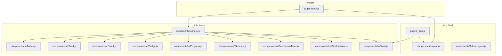
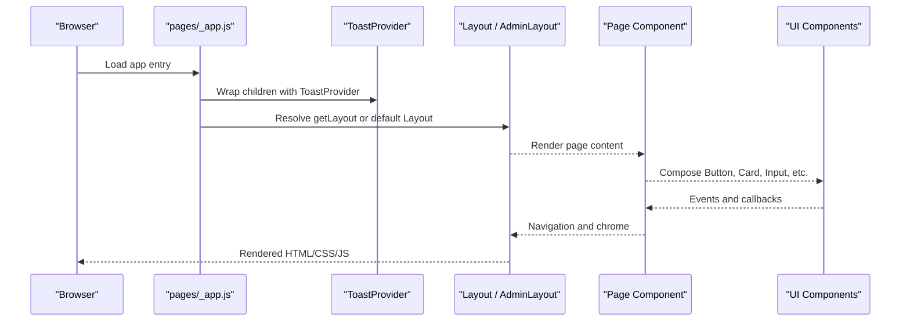
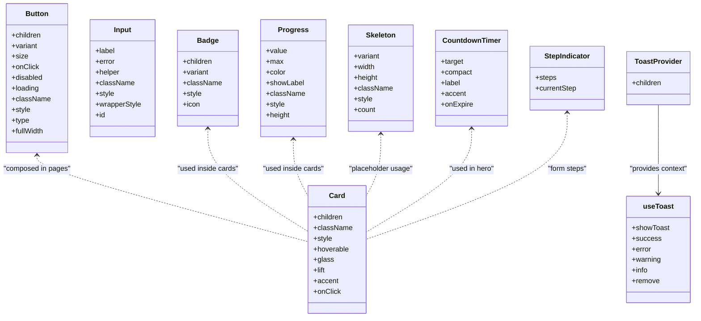
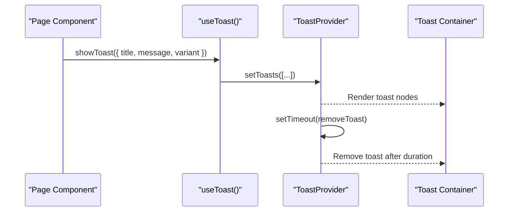
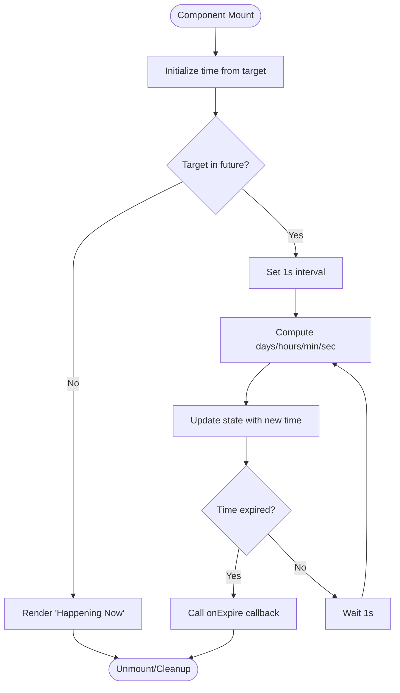
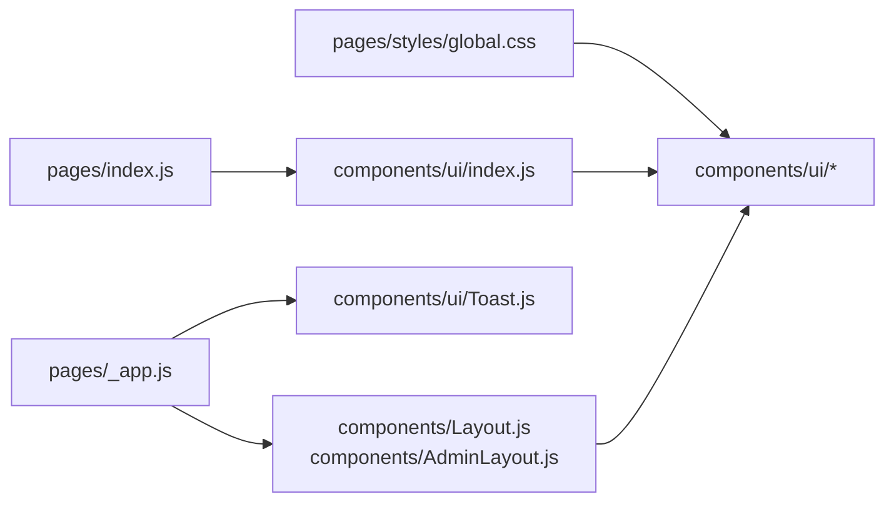

# Component Development Patterns

<cite>
**Referenced Files in This Document**
- [components/ui/index.js](file://components/ui/index.js)
- [components/Layout.js](file://components/Layout.js)
- [components/AdminLayout.js](file://components/AdminLayout.js)
- [pages/_app.js](file://pages/_app.js)
- [components/ui/Button.js](file://components/ui/Button.js)
- [components/ui/Card.js](file://components/ui/Card.js)
- [components/ui/Input.js](file://components/ui/Input.js)
- [components/ui/Toast.js](file://components/ui/Toast.js)
- [components/ui/Badge.js](file://components/ui/Badge.js)
- [components/ui/Progress.js](file://components/ui/Progress.js)
- [components/ui/Skeleton.js](file://components/ui/Skeleton.js)
- [components/ui/CountdownTimer.js](file://components/ui/CountdownTimer.js)
- [components/ui/StepIndicator.js](file://components/ui/StepIndicator.js)
- [pages/index.js](file://pages/index.js)
- [pages/styles/global.css](file://pages/styles/global.css)
</cite>

## Table of Contents
1. Introduction
2. Project Structure
3. Core Components
4. Architecture Overview
5. Detailed Component Analysis
6. Dependency Analysis
7. Performance Considerations
8. Troubleshooting Guide
9. Conclusion
10. Appendices

## Introduction
This document explains component development patterns in TicketFlow with a focus on the UI library, composition strategies, and styling approaches. It covers presentational vs container components, prop design, event handling, state management within components, accessibility, and performance optimization techniques such as memoization and efficient re-renders. The goal is to provide practical guidance for creating new UI components, extending existing ones, and implementing complex interactive features consistently across the application.

## Project Structure
TicketFlow organizes reusable UI elements under components/ui and exposes them via an index barrel. Layouts encapsulate page-level chrome (navigation, footer, theme switching), while pages compose these layouts and UI primitives to build feature screens. Global styles are centralized in a single CSS file that defines the design system tokens and themes.

**Diagram sources**
- [pages/_app.js:1-14](file://pages/_app.js#L1-L14)
- [components/Layout.js:1-281](file://components/Layout.js#L1-L281)
- [components/AdminLayout.js:1-194](file://components/AdminLayout.js#L1-L194)
- [components/ui/index.js:1-10](file://components/ui/index.js#L1-L10)
- [components/ui/Button.js:1-74](file://components/ui/Button.js#L1-L74)
- [components/ui/Card.js:1-33](file://components/ui/Card.js#L1-L33)
- [components/ui/Input.js:1-49](file://components/ui/Input.js#L1-L49)
- [components/ui/Badge.js:1-30](file://components/ui/Badge.js#L1-L30)
- [components/ui/Progress.js:1-39](file://components/ui/Progress.js#L1-L39)
- [components/ui/Skeleton.js:1-48](file://components/ui/Skeleton.js#L1-L48)
- [components/ui/CountdownTimer.js:1-109](file://components/ui/CountdownTimer.js#L1-L109)
- [components/ui/StepIndicator.js:1-24](file://components/ui/StepIndicator.js#L1-L24)
- [pages/index.js:1-753](file://pages/index.js#L1-L753)

**Section sources**
- [components/ui/index.js:1-10](file://components/ui/index.js#L1-L10)
- [pages/_app.js:1-14](file://pages/_app.js#L1-L14)
- [components/Layout.js:1-281](file://components/Layout.js#L1-L281)
- [components/AdminLayout.js:1-194](file://components/AdminLayout.js#L1-L194)
- [pages/index.js:1-753](file://pages/index.js#L1-L753)
- [pages/styles/global.css:1-200](file://pages/styles/global.css#L1-L200)

## Core Components
The UI library provides small, focused, composable primitives:
- Button: variant-driven styling, size variants, loading state, and pointer interaction effects.
- Card: glass or solid card shells with hover/lift/accent options and click behavior.
- Input: accessible form field with label, helper text, error state, and aria attributes.
- Badge: semantic labels with variants and optional icon slot.
- Progress: percentage-based progress bar with optional label and color customization.
- Skeleton: placeholder shapes for loading states with multiple variants and count support.
- CountdownTimer: live countdown with compact mode and expiration callback.
- StepIndicator: visual stepper for multi-step flows.
- Toast: global notifications via context provider and hook.

These components follow consistent prop contracts, use className/style composition, and expose accessible semantics.

**Section sources**
- [components/ui/Button.js:1-74](file://components/ui/Button.js#L1-L74)
- [components/ui/Card.js:1-33](file://components/ui/Card.js#L1-L33)
- [components/ui/Input.js:1-49](file://components/ui/Input.js#L1-L49)
- [components/ui/Badge.js:1-30](file://components/ui/Badge.js#L1-L30)
- [components/ui/Progress.js:1-39](file://components/ui/Progress.js#L1-L39)
- [components/ui/Skeleton.js:1-48](file://components/ui/Skeleton.js#L1-L48)
- [components/ui/CountdownTimer.js:1-109](file://components/ui/CountdownTimer.js#L1-L109)
- [components/ui/StepIndicator.js:1-24](file://components/ui/StepIndicator.js#L1-L24)
- [components/ui/Toast.js:1-84](file://components/ui/Toast.js#L1-L84)

## Architecture Overview
TicketFlow uses a thin app shell that wraps every page with a layout and a toast provider. Pages act as containers that orchestrate data and state, while UI components remain presentational and stateless where possible.

**Diagram sources**
- [pages/_app.js:1-14](file://pages/_app.js#L1-L14)
- [components/Layout.js:1-281](file://components/Layout.js#L1-L281)
- [components/AdminLayout.js:1-194](file://components/AdminLayout.js#L1-L194)
- [components/ui/Toast.js:1-84](file://components/ui/Toast.js#L1-L84)
- [components/ui/index.js:1-10](file://components/ui/index.js#L1-L10)

**Section sources**
- [pages/_app.js:1-14](file://pages/_app.js#L1-L14)
- [components/Layout.js:1-281](file://components/Layout.js#L1-L281)
- [components/AdminLayout.js:1-194](file://components/AdminLayout.js#L1-L194)

## Detailed Component Analysis

### Presentational vs Container Components
- Presentational components: Button, Card, Input, Badge, Progress, Skeleton, CountdownTimer, StepIndicator. They render UI based on props and emit events via callbacks.
- Container components: Layout, AdminLayout, and page components like the home page. They manage routing, authentication checks, global state, and orchestrate child components.

Guidelines:
- Keep UI components free of side effects; pass data and handlers via props.
- Use layouts to wrap pages and inject global behaviors (theme, navigation).
- Prefer composition over inheritance; combine small primitives to build complex views.

**Section sources**
- [components/ui/Button.js:1-74](file://components/ui/Button.js#L1-L74)
- [components/ui/Card.js:1-33](file://components/ui/Card.js#L1-L33)
- [components/ui/Input.js:1-49](file://components/ui/Input.js#L1-L49)
- [components/ui/Badge.js:1-30](file://components/ui/Badge.js#L1-L30)
- [components/ui/Progress.js:1-39](file://components/ui/Progress.js#L1-L39)
- [components/ui/Skeleton.js:1-48](file://components/ui/Skeleton.js#L1-L48)
- [components/ui/CountdownTimer.js:1-109](file://components/ui/CountdownTimer.js#L1-L109)
- [components/ui/StepIndicator.js:1-24](file://components/ui/StepIndicator.js#L1-L24)
- [components/Layout.js:1-281](file://components/Layout.js#L1-L281)
- [components/AdminLayout.js:1-194](file://components/AdminLayout.js#L1-L194)
- [pages/index.js:1-753](file://pages/index.js#L1-L753)

### Composition Patterns and Prop Drilling Alternatives
- Composition: Build complex UI by composing primitives (e.g., Card + Badge + Progress).
- Context for cross-cutting concerns: ToastProvider centralizes notification state and exposes a hook to any descendant.
- Avoid deep prop drilling by lifting minimal state to the nearest common ancestor and passing only what’s needed.

Example pattern:
- Provide global notifications via context and consume with a hook.
- Use layout wrappers to avoid repeating navigation and theme logic.

**Section sources**
- [components/ui/Toast.js:1-84](file://components/ui/Toast.js#L1-L84)
- [pages/_app.js:1-14](file://pages/_app.js#L1-L14)
- [components/Layout.js:1-281](file://components/Layout.js#L1-L281)

### Styling Approaches
- CSS variables and classes: All UI components rely on CSS classes and CSS custom properties defined in the global stylesheet.
- Theme system: Multiple themes are applied via data-theme attribute on the root element, enabling runtime theme switching.
- Inline styles: Used sparingly for dynamic values (e.g., width, colors) while keeping most styling declarative via className.

Recommendations:
- Prefer className composition for predictable, testable styles.
- Use CSS variables for design tokens (colors, spacing, radii, shadows).
- Reserve inline styles for per-instance overrides.

**Section sources**
- [pages/styles/global.css:1-200](file://pages/styles/global.css#L1-L200)
- [components/Layout.js:1-281](file://components/Layout.js#L1-L281)
- [components/ui/Button.js:1-74](file://components/ui/Button.js#L1-L74)
- [components/ui/Card.js:1-33](file://components/ui/Card.js#L1-L33)
- [components/ui/Progress.js:1-39](file://components/ui/Progress.js#L1-L39)

### Props Design Guidelines
- Keep props minimal and explicit; prefer boolean flags for toggles (e.g., disabled, fullWidth, showLabel).
- Use stable enums for variants and sizes to constrain options.
- Separate style concerns: className for class composition, style for dynamic values.
- Expose accessibility attributes when necessary (e.g., aria-invalid on inputs).

Examples:
- Button supports variant, size, disabled, loading, fullWidth, and standard button attributes.
- Input supports label, helper, error, id, and forwards remaining props to the underlying input.
- Progress accepts value, max, color, height, and label toggle.

**Section sources**
- [components/ui/Button.js:1-74](file://components/ui/Button.js#L1-L74)
- [components/ui/Input.js:1-49](file://components/ui/Input.js#L1-L49)
- [components/ui/Progress.js:1-39](file://components/ui/Progress.js#L1-L39)

### Event Handling Patterns
- Pass event handlers down as props; keep handlers close to state owners.
- Prevent default behavior and stop propagation where needed (e.g., share/favorite actions).
- Debounce or throttle expensive operations at the handler boundary if necessary.

Patterns observed:
- Click handlers navigate using router utilities.
- Mouse interactions update local refs for dynamic effects (e.g., ripple coordinates).

**Section sources**
- [components/ui/Button.js:1-74](file://components/ui/Button.js#L1-L74)
- [pages/index.js:1-753](file://pages/index.js#L1-L753)

### State Management Within Components
- Local state for ephemeral UI (open menus, active tabs, counters).
- Derived state computed from props (e.g., percentages, formatting).
- Effects for timers and subscriptions with proper cleanup.

Examples:
- CountdownTimer maintains a timer interval and computes time deltas.
- Layout manages scroll position and theme selection.
- AdminLayout fetches user session and enforces role-based access.

**Section sources**
- [components/ui/CountdownTimer.js:1-109](file://components/ui/CountdownTimer.js#L1-L109)
- [components/Layout.js:1-281](file://components/Layout.js#L1-L281)
- [components/AdminLayout.js:1-194](file://components/AdminLayout.js#L1-L194)

### Accessibility Compliance
- Use semantic elements (button, input, span) with appropriate roles and labels.
- Provide aria attributes for state and validation (e.g., aria-invalid).
- Ensure keyboard operability and visible focus states.
- Associate labels with inputs via htmlFor/id.

Examples:
- Input sets aria-invalid based on error state and associates label with id.
- Toast region uses role="region" and aria-label for screen readers.
- Buttons include aria-label for icon-only actions.

**Section sources**
- [components/ui/Input.js:1-49](file://components/ui/Input.js#L1-L49)
- [components/ui/Toast.js:1-84](file://components/ui/Toast.js#L1-L84)
- [components/ui/Badge.js:1-30](file://components/ui/Badge.js#L1-L30)

### Creating New UI Components
Steps:
- Define a clear prop interface with defaults and constraints.
- Compose className from variants/sizes and merge with external className.
- Apply CSS variables for colors and spacing; avoid hardcoding values.
- Include accessibility attributes and keyboard behavior.
- Export through the UI barrel for consistent imports.

Reference patterns:
- Badge and Progress demonstrate variant mapping and simple rendering.
- Skeleton shows count-based rendering and variant-specific dimensions.

**Section sources**
- [components/ui/Badge.js:1-30](file://components/ui/Badge.js#L1-L30)
- [components/ui/Progress.js:1-39](file://components/ui/Progress.js#L1-L39)
- [components/ui/Skeleton.js:1-48](file://components/ui/Skeleton.js#L1-L48)
- [components/ui/index.js:1-10](file://components/ui/index.js#L1-L10)

### Extending Existing Components
Approaches:
- Wrap a primitive to add domain-specific behavior (e.g., themed buttons, form-aware inputs).
- Compose primitives to create higher-order components (e.g., Card + Badge + Progress).
- Use context to inject shared behavior without prop drilling.

Examples:
- A “ThemedButton” could extend Button with preset variants and analytics hooks.
- A “FormInput” could extend Input with validation and submission integration.

**Section sources**
- [components/ui/Card.js:1-33](file://components/ui/Card.js#L1-L33)
- [components/ui/Input.js:1-49](file://components/ui/Input.js#L1-L49)
- [components/ui/Toast.js:1-84](file://components/ui/Toast.js#L1-L84)

### Implementing Complex Interactive Components
Pattern:
- Manage internal state for animations and timers.
- Use intervals with cleanup to prevent memory leaks.
- Provide callbacks for lifecycle events (e.g., expiration).

Example:
- CountdownTimer updates every second, computes remaining time, and triggers onExpire when finished.

**Section sources**
- [components/ui/CountdownTimer.js:1-109](file://components/ui/CountdownTimer.js#L1-L109)

### Class Diagram: UI Components

**Diagram sources**
- [components/ui/Button.js:1-74](file://components/ui/Button.js#L1-L74)
- [components/ui/Card.js:1-33](file://components/ui/Card.js#L1-L33)
- [components/ui/Input.js:1-49](file://components/ui/Input.js#L1-L49)
- [components/ui/Badge.js:1-30](file://components/ui/Badge.js#L1-L30)
- [components/ui/Progress.js:1-39](file://components/ui/Progress.js#L1-L39)
- [components/ui/Skeleton.js:1-48](file://components/ui/Skeleton.js#L1-L48)
- [components/ui/CountdownTimer.js:1-109](file://components/ui/CountdownTimer.js#L1-L109)
- [components/ui/StepIndicator.js:1-24](file://components/ui/StepIndicator.js#L1-L24)
- [components/ui/Toast.js:1-84](file://components/ui/Toast.js#L1-L84)

### Sequence Diagram: Toast Notification Flow

**Diagram sources**
- [components/ui/Toast.js:1-84](file://components/ui/Toast.js#L1-L84)

### Flowchart: Countdown Timer Algorithm

**Diagram sources**
- [components/ui/CountdownTimer.js:1-109](file://components/ui/CountdownTimer.js#L1-L109)

## Dependency Analysis
The UI library is decoupled from pages and layouts, which import from the barrel index. The app shell provides global providers (ToastProvider) and layout wrappers. Global styles define the design system consumed by all components.

**Diagram sources**
- [pages/styles/global.css:1-200](file://pages/styles/global.css#L1-L200)
- [pages/_app.js:1-14](file://pages/_app.js#L1-L14)
- [components/Layout.js:1-281](file://components/Layout.js#L1-L281)
- [components/AdminLayout.js:1-194](file://components/AdminLayout.js#L1-L194)
- [components/ui/index.js:1-10](file://components/ui/index.js#L1-L10)
- [pages/index.js:1-753](file://pages/index.js#L1-L753)

**Section sources**
- [components/ui/index.js:1-10](file://components/ui/index.js#L1-L10)
- [pages/_app.js:1-14](file://pages/_app.js#L1-L14)
- [pages/index.js:1-753](file://pages/index.js#L1-L753)
- [pages/styles/global.css:1-200](file://pages/styles/global.css#L1-L200)

## Performance Considerations
- Memoization:
  - Use useMemo for derived lists and computations (e.g., filtered/trending events).
  - Use useCallback for stable function references passed to children to prevent unnecessary re-renders.
- Efficient Re-rendering:
  - Keep UI components pure and stateless where possible.
  - Split large pages into smaller components to limit re-render scope.
- Lazy Loading:
  - Defer heavy imports or third-party libraries using dynamic imports where feasible.
- Timers and Effects:
  - Always clean up intervals and event listeners in useEffect.
- Rendering Optimization:
  - Avoid inline object creation in render paths; hoist constants outside render loops.
  - Use key props appropriately for lists to minimize diffing overhead.

Observed examples:
- Home page uses useMemo for sorted and sliced event lists.
- CountdownTimer uses setInterval with cleanup.
- Layout attaches passive scroll listeners and cleans up on unmount.

**Section sources**
- [pages/index.js:1-753](file://pages/index.js#L1-L753)
- [components/ui/CountdownTimer.js:1-109](file://components/ui/CountdownTimer.js#L1-L109)
- [components/Layout.js:1-281](file://components/Layout.js#L1-L281)

## Troubleshooting Guide
Common issues and resolutions:
- Toast not available:
  - Ensure useToast is called within a component tree wrapped by ToastProvider.
- Theme not applying:
  - Verify data-theme is set on the root element and CSS variables are correctly referenced.
- Input validation not reflected:
  - Confirm aria-invalid and error className are updated based on state.
- Memory leaks:
  - Check that intervals and event listeners are cleared in effect cleanup functions.
- Navigation errors:
  - Validate route paths and ensure router methods are used instead of direct hrefs where needed.

**Section sources**
- [components/ui/Toast.js:1-84](file://components/ui/Toast.js#L1-L84)
- [components/Layout.js:1-281](file://components/Layout.js#L1-L281)
- [components/ui/Input.js:1-49](file://components/ui/Input.js#L1-L49)
- [components/ui/CountdownTimer.js:1-109](file://components/ui/CountdownTimer.js#L1-L109)

## Conclusion
TicketFlow’s component architecture emphasizes simplicity, composition, and consistency. UI primitives are small, accessible, and styled via a robust CSS variable system. Containers handle state and orchestration, while layouts encapsulate chrome and global behaviors. Following the guidelines in this document will help you create scalable, maintainable, and performant components that integrate seamlessly with the existing design system.

## Appendices
- Best practices checklist:
  - Define clear props with defaults and constraints.
  - Use className composition and CSS variables for styling.
  - Add accessibility attributes and keyboard support.
  - Memoize derived data and stabilize callbacks.
  - Clean up side effects in useEffect.
  - Test components in isolation and with realistic data.

[No sources needed since this section summarizes without analyzing specific files]