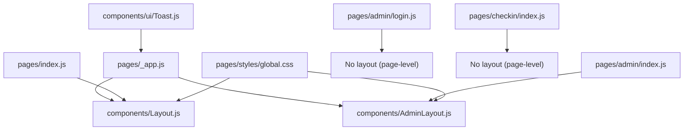
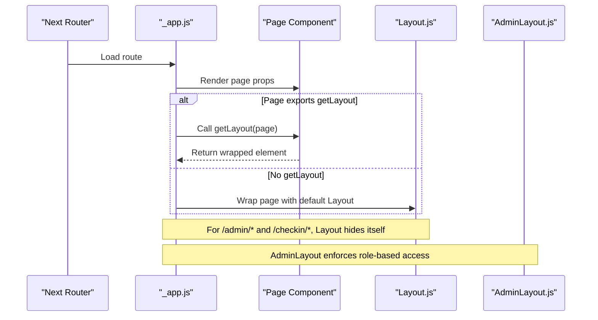
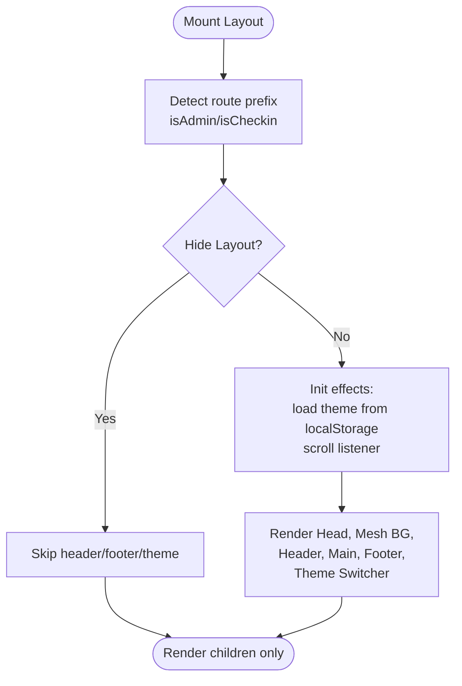
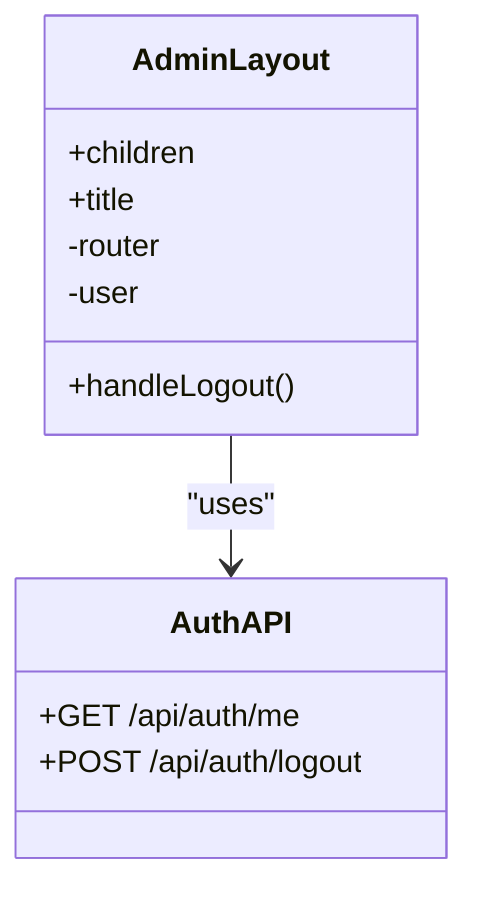
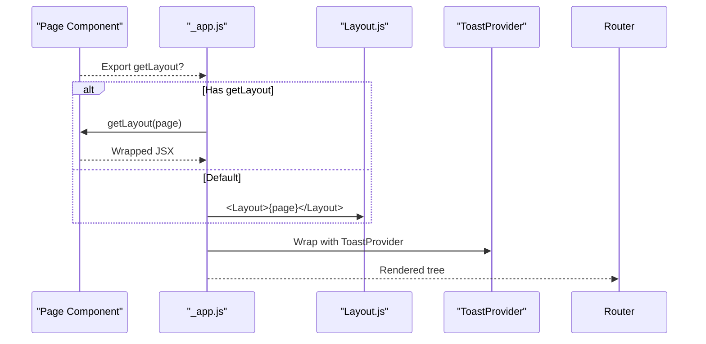
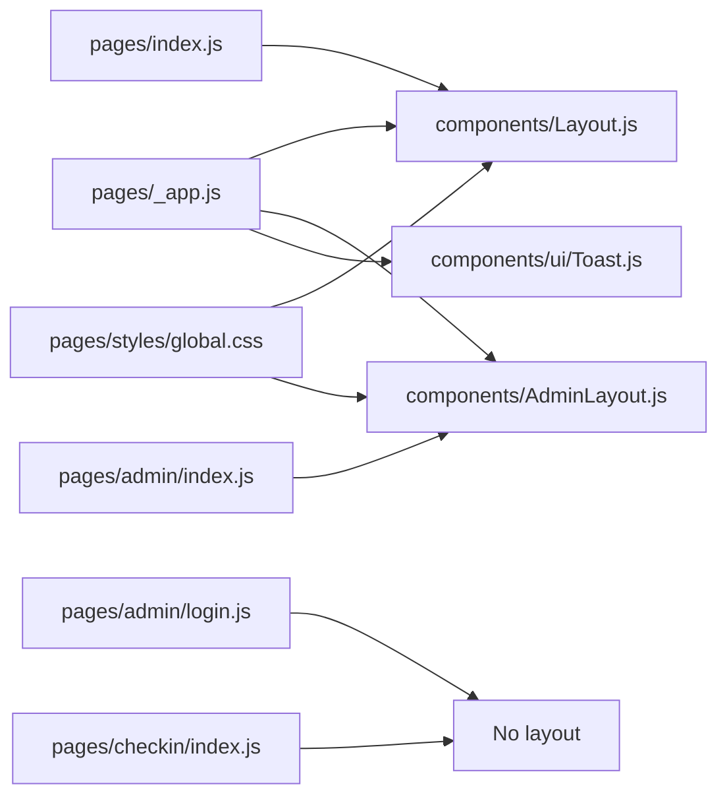

# Layout Components

<cite>
**Referenced Files in This Document**
- [components/Layout.js](file://components/Layout.js)
- [components/AdminLayout.js](file://components/AdminLayout.js)
- [pages/_app.js](file://pages/_app.js)
- [pages/index.js](file://pages/index.js)
- [pages/admin/index.js](file://pages/admin/index.js)
- [pages/admin/login.js](file://pages/admin/login.js)
- [pages/checkin/index.js](file://pages/checkin/index.js)
- [components/ui/Toast.js](file://components/ui/Toast.js)
- [pages/styles/global.css](file://pages/styles/global.css)
</cite>

## Table of Contents
1. [Introduction](#introduction)
2. [Project Structure](#project-structure)
3. [Core Components](#core-components)
4. [Architecture Overview](#architecture-overview)
5. [Detailed Component Analysis](#detailed-component-analysis)
6. [Dependency Analysis](#dependency-analysis)
7. [Performance Considerations](#performance-considerations)
8. [Troubleshooting Guide](#troubleshooting-guide)
9. [Conclusion](#conclusion)
10. [Appendices](#appendices)

## Introduction
This document explains the layout architecture in TicketFlow, focusing on how global application structure is provided by Layout.js and how AdminLayout.js handles admin-specific layouts. It covers navigation patterns, sidebar management, header configurations, responsive behavior, creating custom layouts, managing page transitions, implementing role-based layout variations, and performance best practices for layout composition.

## Project Structure
TicketFlow uses Next.js with a centralized app wrapper that applies a default layout to all pages unless overridden. Public-facing pages use a rich Layout component with theme switching, animated background, sticky header, and footer. Admin pages use a dedicated AdminLayout with a fixed sidebar, authentication gating, and logout flow. Specialized flows like check-in and admin login opt out of these layouts using per-page getLayout overrides.

**Diagram sources**
- [pages/_app.js:1-14](file://pages/_app.js#L1-L14)
- [components/Layout.js:1-281](file://components/Layout.js#L1-L281)
- [components/AdminLayout.js:1-194](file://components/AdminLayout.js#L1-L194)
- [pages/index.js:1-753](file://pages/index.js#L1-L753)
- [pages/admin/index.js:1-585](file://pages/admin/index.js#L1-L585)
- [pages/admin/login.js:1-67](file://pages/admin/login.js#L1-L67)
- [pages/checkin/index.js:1-65](file://pages/checkin/index.js#L1-L65)
- [components/ui/Toast.js:1-84](file://components/ui/Toast.js#L1-L84)
- [pages/styles/global.css:1-800](file://pages/styles/global.css#L1-L800)

**Section sources**
- [pages/_app.js:1-14](file://pages/_app.js#L1-L14)
- [components/Layout.js:1-281](file://components/Layout.js#L1-L281)
- [components/AdminLayout.js:1-194](file://components/AdminLayout.js#L1-L194)
- [pages/index.js:1-753](file://pages/index.js#L1-L753)
- [pages/admin/index.js:1-585](file://pages/admin/index.js#L1-L585)
- [pages/admin/login.js:1-67](file://pages/admin/login.js#L1-L67)
- [pages/checkin/index.js:1-65](file://pages/checkin/index.js#L1-L65)
- [components/ui/Toast.js:1-84](file://components/ui/Toast.js#L1-L84)
- [pages/styles/global.css:1-800](file://pages/styles/global.css#L1-L800)

## Core Components
- Layout.js: Global public site shell with head metadata, animated mesh background, sticky header, mobile menu toggle, footer, and floating theme switcher. It hides itself for admin and check-in routes.
- AdminLayout.js: Admin shell with a persistent sidebar, user session validation, and logout functionality. It renders a title via Head and wraps content in a flex layout.
- _app.js: Central entry point that injects ToastProvider and resolves per-page getLayout or falls back to Layout.

Key responsibilities:
- Routing-aware visibility: Layout hides for /admin and /checkin paths.
- Theme persistence: Selected theme stored in localStorage and applied via data-theme attribute.
- Scroll-aware header: Adds scrolled class when user scrolls past a threshold.
- Admin auth gate: AdminLayout checks current user role and redirects to login if unauthorized.

**Section sources**
- [components/Layout.js:1-281](file://components/Layout.js#L1-L281)
- [components/AdminLayout.js:1-194](file://components/AdminLayout.js#L1-L194)
- [pages/_app.js:1-14](file://pages/_app.js#L1-L14)

## Architecture Overview
The layout system follows a layered approach:
- App layer (_app.js) provides global providers and layout resolution.
- Public layout (Layout.js) encapsulates shared UI chrome for non-admin/non-checkin routes.
- Admin layout (AdminLayout.js) encapsulates admin chrome and access control.
- Pages opt into layouts via getLayout; some pages bypass layouts entirely.

**Diagram sources**
- [pages/_app.js:1-14](file://pages/_app.js#L1-L14)
- [components/Layout.js:1-281](file://components/Layout.js#L1-L281)
- [components/AdminLayout.js:1-194](file://components/AdminLayout.js#L1-L194)
- [pages/index.js:1-753](file://pages/index.js#L1-L753)
- [pages/admin/index.js:1-585](file://pages/admin/index.js#L1-L585)

## Detailed Component Analysis

### Layout.js: Global Application Shell
Responsibilities:
- Sets document head (title, description, viewport, favicon).
- Renders an animated background mesh for non-admin/non-checkin routes.
- Provides a sticky header with logo, links, and mobile menu toggle.
- Renders a comprehensive footer with brand, categories, organizers, and resources.
- Implements a floating theme switcher with multiple themes persisted to localStorage.
- Applies scroll-aware styling to the header.

Navigation patterns:
- Header links navigate to events, dashboard, admin, and check-in.
- Mobile menu toggles a glass-morphic dropdown panel.

Responsive behavior:
- Mobile menu appears conditionally based on state.
- Header becomes translucent and adds shadow on scroll.

Theme system:
- Themes are defined as objects with id, name, and color.
- Active theme is stored in localStorage and applied via data-theme attribute on the root element.
- CSS variables define full theme palettes for backgrounds, text, accents, borders, and shadows.

Accessibility:
- Uses aria-label attributes for interactive elements.
- Semantic HTML for nav, main, footer.

Performance considerations:
- Scroll listener uses passive option.
- Conditional rendering avoids unnecessary DOM for admin/checkin routes.

**Diagram sources**
- [components/Layout.js:1-281](file://components/Layout.js#L1-L281)
- [pages/styles/global.css:1-800](file://pages/styles/global.css#L1-L800)

**Section sources**
- [components/Layout.js:1-281](file://components/Layout.js#L1-L281)
- [pages/styles/global.css:1-800](file://pages/styles/global.css#L1-L800)

### AdminLayout.js: Admin Panel Shell
Responsibilities:
- Enforces authentication and role checks by calling /api/auth/me.
- Redirects unauthorized users to /admin/login.
- Displays a sticky sidebar with navigation items and active state detection.
- Shows user info and a sign-out action that calls /api/auth/logout.
- Wraps page content in a flex container with overflow handling.

Sidebar management:
- Navigation array defines links and icons.
- Active link highlighting based on router.pathname matching.
- Sticky positioning ensures sidebar remains visible while scrolling content.

Role-based layout variations:
- Only super_admin and organiser roles are allowed; others are redirected.
- User details (full_name, role) are displayed in the sidebar footer.

Logout flow:
- POST to /api/auth/logout then redirect to /admin/login.

**Diagram sources**
- [components/AdminLayout.js:1-194](file://components/AdminLayout.js#L1-L194)

**Section sources**
- [components/AdminLayout.js:1-194](file://components/AdminLayout.js#L1-L194)

### _app.js: Layout Resolution and Providers
- Imports global styles and ToastProvider.
- Resolves getLayout from the page component; defaults to wrapping with Layout.
- Ensures ToastProvider is always available across the app.

**Diagram sources**
- [pages/_app.js:1-14](file://pages/_app.js#L1-L14)
- [components/Layout.js:1-281](file://components/Layout.js#L1-L281)
- [components/ui/Toast.js:1-84](file://components/ui/Toast.js#L1-L84)

**Section sources**
- [pages/_app.js:1-14](file://pages/_app.js#L1-L14)

### Page-Level Layout Overrides
- Home page (index.js) sets getLayout to wrap with Layout and passes title/description.
- Admin dashboard (admin/index.js) sets getLayout to return page directly, bypassing AdminLayout.
- Admin login (admin/login.js) and check-in index (checkin/index.js) also bypass layouts with page-level getLayout returning the page unchanged.

Implications:
- These pages render without Layout’s header/footer/theme switcher.
- Admin login and check-in have their own minimal shells styled inline.

**Section sources**
- [pages/index.js:1-753](file://pages/index.js#L1-L753)
- [pages/admin/index.js:1-585](file://pages/admin/index.js#L1-L585)
- [pages/admin/login.js:1-67](file://pages/admin/login.js#L1-L67)
- [pages/checkin/index.js:1-65](file://pages/checkin/index.js#L1-L65)

### Toast System Integration
- ToastProvider is mounted at the app level, enabling toast notifications throughout the app.
- Provides methods for success, error, warning, and info toasts with auto-dismissal.

Usage pattern:
- Any component can call useToast() to trigger toasts.
- Toasts are rendered in a container managed by ToastProvider.

**Section sources**
- [components/ui/Toast.js:1-84](file://components/ui/Toast.js#L1-L84)
- [pages/_app.js:1-14](file://pages/_app.js#L1-L14)

## Dependency Analysis
- _app.js depends on Layout, ToastProvider, and global styles.
- Layout depends on Next Head, useRouter, and CSS variables/themes.
- AdminLayout depends on Next Head, useRouter, and API endpoints for auth.
- Pages depend on their respective layouts via getLayout.

**Diagram sources**
- [pages/_app.js:1-14](file://pages/_app.js#L1-L14)
- [components/Layout.js:1-281](file://components/Layout.js#L1-L281)
- [components/AdminLayout.js:1-194](file://components/AdminLayout.js#L1-L194)
- [components/ui/Toast.js:1-84](file://components/ui/Toast.js#L1-L84)
- [pages/index.js:1-753](file://pages/index.js#L1-L753)
- [pages/admin/index.js:1-585](file://pages/admin/index.js#L1-L585)
- [pages/admin/login.js:1-67](file://pages/admin/login.js#L1-L67)
- [pages/checkin/index.js:1-65](file://pages/checkin/index.js#L1-L65)
- [pages/styles/global.css:1-800](file://pages/styles/global.css#L1-L800)

**Section sources**
- [pages/_app.js:1-14](file://pages/_app.js#L1-L14)
- [components/Layout.js:1-281](file://components/Layout.js#L1-L281)
- [components/AdminLayout.js:1-194](file://components/AdminLayout.js#L1-L194)
- [components/ui/Toast.js:1-84](file://components/ui/Toast.js#L1-L84)
- [pages/index.js:1-753](file://pages/index.js#L1-L753)
- [pages/admin/index.js:1-585](file://pages/admin/index.js#L1-L585)
- [pages/admin/login.js:1-67](file://pages/admin/login.js#L1-L67)
- [pages/checkin/index.js:1-65](file://pages/checkin/index.js#L1-L65)
- [pages/styles/global.css:1-800](file://pages/styles/global.css#L1-L800)

## Performance Considerations
- Passive scroll listeners: Layout attaches scroll listener with passive option to avoid blocking main thread.
- Conditional rendering: Layout hides header/footer/theme for admin/checkin routes to reduce DOM.
- Theme persistence: localStorage read/write occurs once on mount; CSS variables update efficiently via data-theme attribute.
- Avoid heavy re-renders: Keep layout components lightweight; defer heavy logic to page components.
- Use memoization where appropriate in pages to prevent unnecessary recalculations.
- Prefer CSS animations and transforms for smooth interactions; avoid layout thrashing.

[No sources needed since this section provides general guidance]

## Troubleshooting Guide
Common issues and resolutions:
- Admin pages redirect unexpectedly: Ensure /api/auth/me returns a valid user with allowed roles; otherwise AdminLayout redirects to /admin/login.
- Layout not appearing: Verify page does not override getLayout; if it does, ensure it returns the expected wrapper.
- Theme not persisting: Check localStorage availability and ensure data-theme attribute is set on root element.
- Toast not showing: Confirm ToastProvider is mounted in _app.js and useToast is used within its context.

**Section sources**
- [components/AdminLayout.js:1-194](file://components/AdminLayout.js#L1-L194)
- [pages/_app.js:1-14](file://pages/_app.js#L1-L14)
- [components/ui/Toast.js:1-84](file://components/ui/Toast.js#L1-L84)

## Conclusion
TicketFlow’s layout architecture separates public and admin experiences cleanly through Layout.js and AdminLayout.js, with _app.js orchestrating layout resolution and provider injection. Pages can opt into layouts via getLayout or bypass them for specialized flows. The system supports robust theme switching, responsive navigation, and role-based access control. Following the outlined best practices ensures maintainable, performant, and accessible layout composition.

[No sources needed since this section summarizes without analyzing specific files]

## Appendices

### Creating Custom Layouts
Steps:
- Create a new layout component (e.g., CustomLayout.js) that accepts children and optional props like title.
- In the target page, export getLayout that wraps the page with your custom layout.
- If you need to bypass all layouts, export getLayout returning the page directly.

Example references:
- Home page demonstrates wrapping with Layout and passing title.
- Admin dashboard demonstrates bypassing AdminLayout by returning page directly.

**Section sources**
- [pages/index.js:1-753](file://pages/index.js#L1-L753)
- [pages/admin/index.js:1-585](file://pages/admin/index.js#L1-L585)

### Managing Page Transitions
Patterns:
- Use Next.js router for client-side navigation within Layout and AdminLayout.
- Avoid full page reloads; prefer programmatic navigation for smoother UX.
- For complex transitions, consider adding CSS animations triggered by route changes.

References:
- Layout uses router.push for internal navigation.
- AdminLayout uses router.push for logout and navigation.

**Section sources**
- [components/Layout.js:1-281](file://components/Layout.js#L1-L281)
- [components/AdminLayout.js:1-194](file://components/AdminLayout.js#L1-L194)

### Implementing Role-Based Layout Variations
Approach:
- Fetch user role in layout (as done in AdminLayout) and conditionally render sections or redirect unauthorized users.
- Extend AdminLayout to support additional roles or permissions if needed.

Reference:
- AdminLayout checks roles ['super_admin', 'organiser'] and redirects if not authorized.

**Section sources**
- [components/AdminLayout.js:1-194](file://components/AdminLayout.js#L1-L194)

### Responsive Behavior Guidelines
- Use CSS variables and media queries in global styles for consistent breakpoints.
- Ensure headers and sidebars adapt gracefully on smaller screens.
- Test mobile menus and touch interactions thoroughly.

Reference:
- global.css defines spacing, typography, and animation utilities used across layouts.

**Section sources**
- [pages/styles/global.css:1-800](file://pages/styles/global.css#L1-L800)