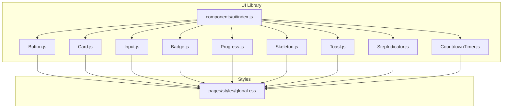
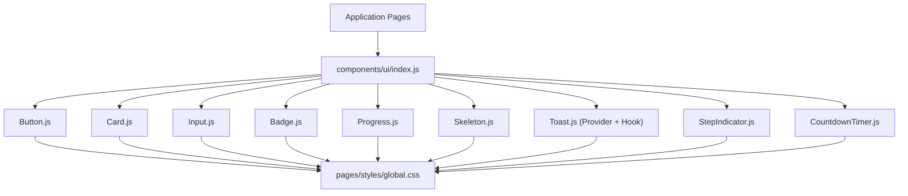
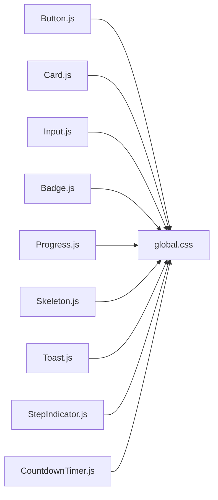

# UI Components

<cite>
**Referenced Files in This Document**
- [components/ui/index.js](file://components/ui/index.js)
- [components/ui/Button.js](file://components/ui/Button.js)
- [components/ui/Card.js](file://components/ui/Card.js)
- [components/ui/Input.js](file://components/ui/Input.js)
- [components/ui/Badge.js](file://components/ui/Badge.js)
- [components/ui/Progress.js](file://components/ui/Progress.js)
- [components/ui/Skeleton.js](file://components/ui/Skeleton.js)
- [components/ui/Toast.js](file://components/ui/Toast.js)
- [components/ui/StepIndicator.js](file://components/ui/StepIndicator.js)
- [components/ui/CountdownTimer.js](file://components/ui/CountdownTimer.js)
- [pages/styles/global.css](file://pages/styles/global.css)
</cite>

## Table of Contents
1. Introduction
2. Project Structure
3. Core Components
4. Architecture Overview
5. Detailed Component Analysis
6. Dependency Analysis
7. Performance Considerations
8. Troubleshooting Guide
9. Conclusion
10. Appendices

## Introduction
This document explains the UI component architecture in TicketFlow, focusing on prop design patterns, variant systems, and styling approaches. It documents the core components Button, Card, Input, and Badge with their props, variants, sizes, and usage guidance. It also provides guidelines for creating consistent UI components, handling accessibility, implementing responsive designs, extending existing components, and building new ones following established patterns.

## Project Structure
TicketFlow’s UI is organized under a single components/ui directory with an index barrel that re-exports all public components. Global styles are centralized in pages/styles/global.css, which defines the design tokens, themes, and component-specific CSS classes used by the UI components.

**Diagram sources**
- [components/ui/index.js:1-10](file://components/ui/index.js#L1-L10)
- [pages/styles/global.css:444-800](file://pages/styles/global.css#L444-L800)

**Section sources**
- [components/ui/index.js:1-10](file://components/ui/index.js#L1-L10)
- [pages/styles/global.css:1-214](file://pages/styles/global.css#L1-L214)

## Core Components
The UI library exposes a curated set of primitives through a central index file. Each component follows consistent prop conventions:
- children for content
- className and style for customization
- semantic props like variant, size, disabled, loading, etc., where applicable
- Accessibility attributes (e.g., aria-invalid) when relevant

Key components:
- Button: interactive action with variants, sizes, and loading state
- Card: container with glass/lift/accent options
- Input: form field with label, helper text, and error states
- Badge: inline status or label with multiple variants
- Progress: linear progress bar with optional label
- Skeleton: placeholder shapes for loading states
- Toast: global notifications via context provider and hook
- StepIndicator: multi-step process visualization
- CountdownTimer: time-based display with compact mode

**Section sources**
- [components/ui/index.js:1-10](file://components/ui/index.js#L1-L10)
- [components/ui/Button.js:1-74](file://components/ui/Button.js#L1-L74)
- [components/ui/Card.js:1-33](file://components/ui/Card.js#L1-L33)
- [components/ui/Input.js:1-49](file://components/ui/Input.js#L1-L49)
- [components/ui/Badge.js:1-30](file://components/ui/Badge.js#L1-L30)
- [components/ui/Progress.js:1-39](file://components/ui/Progress.js#L1-L39)
- [components/ui/Skeleton.js:1-48](file://components/ui/Skeleton.js#L1-L48)
- [components/ui/Toast.js:1-84](file://components/ui/Toast.js#L1-L84)
- [components/ui/StepIndicator.js:1-24](file://components/ui/StepIndicator.js#L1-L24)
- [components/ui/CountdownTimer.js:1-109](file://components/ui/CountdownTimer.js#L1-L109)

## Architecture Overview
TicketFlow’s UI architecture separates concerns between:
- Component logic (React functions)
- Styling (CSS classes and design tokens)
- State management (local state and React Context for Toast)

Styling approach:
- CSS class names follow a tf-* prefix convention
- Variants map to specific modifier classes (e.g., tf-btn-primary, tf-badge-success)
- Sizes map to modifier classes (e.g., tf-btn-sm, tf-btn-lg, tf-btn-icon)
- Design tokens (colors, spacing, radius, shadows) are defined as CSS variables in global.css

State and interactivity:
- Button uses mouse tracking for visual effects and supports loading/disabled states
- Toast uses React Context for global notification management
- CountdownTimer manages interval-based updates and expiration callbacks

**Diagram sources**
- [components/ui/index.js:1-10](file://components/ui/index.js#L1-L10)
- [pages/styles/global.css:444-800](file://pages/styles/global.css#L444-L800)

## Detailed Component Analysis

### Button
Purpose: Primary interactive element with variant and size system, loading indicator, and full-width support.

Props:
- children: Node content
- variant: one of primary, secondary, ghost, danger, success
- size: one of sm, md, lg, icon
- onClick: event handler
- disabled: boolean
- loading: boolean; shows spinner and disables button
- className: string
- style: object
- type: HTML button type
- fullWidth: boolean; sets width to 100%

Behavior:
- Applies base class tf-btn plus variant and size modifiers
- Sets disabled state when disabled or loading
- Injects inline styles for width and opacity based on props
- Adds a small spinner when loading

Accessibility:
- Uses native <button> semantics
- Disables interaction when loading or disabled

Styling:
- Base class tf-btn with hover effects
- Variant classes: tf-btn-primary, tf-btn-secondary, tf-btn-ghost, tf-btn-danger, tf-btn-success
- Size classes: tf-btn-sm, tf-btn-lg, tf-btn-icon

Usage examples:
- Basic primary button
- Secondary button with custom className
- Full-width large button
- Icon-only button
- Loading button

**Section sources**
- [components/ui/Button.js:1-74](file://components/ui/Button.js#L1-L74)
- [pages/styles/global.css:444-524](file://pages/styles/global.css#L444-L524)

### Card
Purpose: Container for grouping content with optional glassmorphism, lift effect, and accent border.

Props:
- children: Node content
- className: string
- style: object
- hoverable: boolean; default true
- glass: boolean; default true; applies glass-card class
- lift: boolean; default true; adds card-lift class
- accent: boolean; adds card-accent-border class
- onClick: event handler

Behavior:
- Composes classes based on glass, lift, and accent flags
- Sets cursor pointer when onClick is provided

Styling:
- glass-card with backdrop blur and border
- card-lift for hover elevation
- card-accent-border for accent highlight

Usage examples:
- Glass card with lift
- Non-glass card without lift
- Accent-bordered card with click handler

**Section sources**
- [components/ui/Card.js:1-33](file://components/ui/Card.js#L1-L33)
- [pages/styles/global.css:349-362](file://pages/styles/global.css#L349-L362)
- [pages/styles/global.css:528-540](file://pages/styles/global.css#L528-L540)

### Input
Purpose: Form input field with label, helper text, and error state.

Props:
- label: string; renders a <label> above the input
- error: string; displays error message and applies error styling
- helper: string; displays helper text below the input
- className: string
- style: object
- wrapperStyle: object; styles the outer field wrapper
- id: string; associates label with input via htmlFor

Behavior:
- Renders label if provided
- Applies tf-input-error class and red border when error is present
- Shows error or helper text below the input
- Sets aria-invalid when error is present

Accessibility:
- Associates label with input using htmlFor and id
- Provides aria-invalid for screen readers

Styling:
- Base class tf-input with focus ring
- Error state uses tf-input-error and error color variable

Usage examples:
- Simple input with label
- Input with helper text
- Input with error state

**Section sources**
- [components/ui/Input.js:1-49](file://components/ui/Input.js#L1-L49)
- [pages/styles/global.css:773-799](file://pages/styles/global.css#L773-L799)

### Badge
Purpose: Inline status or label with multiple variants and optional icon slot.

Props:
- children: Node content
- variant: one of primary, success, warning, danger, info, glass, ghost
- className: string
- style: object
- icon: Node; rendered before children

Behavior:
- Maps variant to corresponding CSS class
- Renders optional icon span before children

Styling:
- Base class tf-badge
- Variant classes: tf-badge-primary, tf-badge-success, tf-badge-warning, tf-badge-error, tf-badge-glass

Usage examples:
- Primary badge
- Success badge
- Glass badge with icon

**Section sources**
- [components/ui/Badge.js:1-30](file://components/ui/Badge.js#L1-L30)
- [pages/styles/global.css:728-768](file://pages/styles/global.css#L728-L768)

### Progress
Purpose: Linear progress bar with optional label and customizable height/color.

Props:
- value: number; current progress
- max: number; maximum value
- color: string; gradient background color
- showLabel: boolean; displays value/max and percentage
- className: string
- style: object
- height: number; bar height in pixels

Behavior:
- Calculates percentage clamped between 0 and 100
- Applies width style to inner bar
- Optionally renders label with value and percentage

Styling:
- Base class tf-progress container
- Inner bar uses tf-progress-bar

Usage examples:
- Basic progress with default height
- Custom color progress
- Progress with label

**Section sources**
- [components/ui/Progress.js:1-39](file://components/ui/Progress.js#L1-L39)

### Skeleton
Purpose: Placeholder shapes for loading states with multiple variants.

Props:
- variant: one of text, title, card, circle, btn, custom
- width: string/number
- height: string/number
- className: string
- style: object
- count: number; renders multiple skeletons with spacing

Behavior:
- If count > 1, recursively renders multiple Skeleton instances
- Applies default minHeight and borderRadius based on variant
- Supports custom variant with no extra classes

Styling:
- Base class tf-skeleton
- Variant classes: skeleton-text, skeleton-title, skeleton-card, skeleton-circle, skeleton-btn

Usage examples:
- Text skeleton
- Title skeleton
- Card skeleton
- Circle skeleton
- Multiple skeletons

**Section sources**
- [components/ui/Skeleton.js:1-48](file://components/ui/Skeleton.js#L1-L48)

### Toast
Purpose: Global notification system with context provider and hook.

Exports:
- ToastProvider: wraps app to provide toast functionality
- useToast: hook to access showToast and convenience methods

Props (for showToast):
- title: string
- message: string
- variant: one of success, error, warning, info
- duration: number; auto-dismiss after milliseconds
- icon: Node; null hides icon

Behavior:
- Generates unique IDs and manages toast list
- Auto-removes toasts after duration
- Supports explicit removal by ID
- Renders accessible roles and labels

Accessibility:
- Uses role="alert" for errors and role="status" for others
- Provides aria-label on close button

Usage examples:
- Show success toast
- Show error toast
- Show custom toast with icon and duration

**Section sources**
- [components/ui/Toast.js:1-84](file://components/ui/Toast.js#L1-L84)

### StepIndicator
Purpose: Visualizes multi-step processes with done/active states.

Props:
- steps: array of strings; labels for each step
- currentStep: number; index of active step

Behavior:
- Marks steps before currentStep as done
- Marks currentStep as active
- Renders checkmark for done steps and numbers otherwise
- Draws connecting lines between steps

Styling:
- Base class tf-stepper
- Step class tf-stepper-step with state modifiers
- Dot class tf-stepper-dot and line class tf-stepper-line

Usage examples:
- Three-step flow
- Active step highlighting

**Section sources**
- [components/ui/StepIndicator.js:1-24](file://components/ui/StepIndicator.js#L1-L24)

### CountdownTimer
Purpose: Displays remaining time until a target date with compact mode and urgency indicators.

Props:
- target: Date string or timestamp
- compact: boolean; switches to compact layout
- label: string; displayed when expired
- accent: string; color override for values
- onExpire: callback invoked when countdown reaches zero

Behavior:
- Computes days/hours/minutes/seconds from target
- Updates every second via interval
- Returns null when expired; renders “Happening Now” or label
- Compact mode shows abbreviated time and urgency styling

Styling:
- Uses tf-countdown-item and tf-countdown-value classes
- Applies urgent styling when less than three days remain

Usage examples:
- Full countdown with labels
- Compact countdown with accent color
- Expired state with custom label

**Section sources**
- [components/ui/CountdownTimer.js:1-109](file://components/ui/CountdownTimer.js#L1-L109)
- [pages/styles/global.css:701-723](file://pages/styles/global.css#L701-L723)

## Dependency Analysis
Components rely on:
- CSS classes defined in global.css for visual presentation
- React APIs for state and context (useState, useEffect, createContext, useContext)
- Native HTML elements for semantics and accessibility

Coupling:
- Low coupling between components; most are self-contained
- Toast introduces shared state via Context
- All components depend on global CSS classes for styling

Potential circular dependencies:
- None observed; components are flat and exported via index barrel

External dependencies:
- No third-party libraries within components; relies on React and browser APIs

**Diagram sources**
- [components/ui/Button.js:1-74](file://components/ui/Button.js#L1-L74)
- [components/ui/Card.js:1-33](file://components/ui/Card.js#L1-L33)
- [components/ui/Input.js:1-49](file://components/ui/Input.js#L1-L49)
- [components/ui/Badge.js:1-30](file://components/ui/Badge.js#L1-L30)
- [components/ui/Progress.js:1-39](file://components/ui/Progress.js#L1-L39)
- [components/ui/Skeleton.js:1-48](file://components/ui/Skeleton.js#L1-L48)
- [components/ui/Toast.js:1-84](file://components/ui/Toast.js#L1-L84)
- [components/ui/StepIndicator.js:1-24](file://components/ui/StepIndicator.js#L1-L24)
- [components/ui/CountdownTimer.js:1-109](file://components/ui/CountdownTimer.js#L1-L109)
- [pages/styles/global.css:444-800](file://pages/styles/global.css#L444-L800)

**Section sources**
- [components/ui/index.js:1-10](file://components/ui/index.js#L1-L10)
- [pages/styles/global.css:1-214](file://pages/styles/global.css#L1-L214)

## Performance Considerations
- Avoid unnecessary re-renders by memoizing expensive computations outside components where possible
- Use loading states judiciously; disable interactions during async operations to prevent redundant calls
- For Toast, prefer concise durations and avoid stacking too many toasts simultaneously
- Skeleton components can be batched via count prop to reduce DOM nodes
- Prefer CSS transitions over JS animations for smoother performance

[No sources needed since this section provides general guidance]

## Troubleshooting Guide
Common issues and resolutions:
- Button not responding: Ensure onClick is provided and not overridden; verify disabled/loading props
- Input error not visible: Confirm error prop is a non-empty string; check aria-invalid attribute presence
- Toast not appearing: Wrap application with ToastProvider; ensure useToast is called inside provider scope
- CountdownTimer not updating: Verify target prop is a valid date string; check interval cleanup on unmount
- Skeleton not rendering: Ensure variant is one of supported values; pass width/height for custom variants

**Section sources**
- [components/ui/Button.js:1-74](file://components/ui/Button.js#L1-L74)
- [components/ui/Input.js:1-49](file://components/ui/Input.js#L1-L49)
- [components/ui/Toast.js:1-84](file://components/ui/Toast.js#L1-L84)
- [components/ui/CountdownTimer.js:1-109](file://components/ui/CountdownTimer.js#L1-L109)
- [components/ui/Skeleton.js:1-48](file://components/ui/Skeleton.js#L1-L48)

## Conclusion
TicketFlow’s UI components follow a consistent pattern: clear prop interfaces, variant-driven styling via CSS classes, and strong accessibility foundations. The design system centralizes tokens and styles in global.css, enabling cohesive theming and responsive behavior. By adhering to these patterns, developers can extend existing components and build new ones that integrate seamlessly with the ecosystem.

[No sources needed since this section summarizes without analyzing specific files]

## Appendices

### Prop Design Patterns
- Content: children
- Styling: className, style
- Behavior: onClick, disabled, loading
- Semantics: type, aria-invalid
- Layout: fullWidth, height, width

### Variant Systems
- Button variants: primary, secondary, ghost, danger, success
- Badge variants: primary, success, warning, danger, info, glass, ghost
- Skeleton variants: text, title, card, circle, btn, custom

### Styling Approaches
- Prefix convention: tf-* for base classes
- Modifier classes: tf-btn-primary, tf-badge-success, skeleton-text
- Design tokens: CSS variables for colors, spacing, radius, shadows

### Accessibility Guidelines
- Use semantic HTML elements (<button>, <input>, )
- Associate labels with inputs via htmlFor/id
- Provide aria-invalid for error states
- Use appropriate ARIA roles for dynamic content (Toast)

### Responsive Design Tips
- Use relative units and CSS variables for scalability
- Leverage flexbox and grid for flexible layouts
- Test components across breakpoints with varying content lengths

### Extending Existing Components
- Add new variants by mapping to CSS classes
- Introduce new props while preserving defaults
- Maintain backward compatibility by keeping existing class names

### Creating New Components
- Define a clear prop interface with sensible defaults
- Map variants and sizes to CSS classes
- Include accessibility attributes where applicable
- Export via index barrel for consistent imports

[No sources needed since this section provides general guidance]