# Debugging & Performance Profiling

<cite>
**Referenced Files in This Document**
- [package.json](file://package.json)
- [next.config.js](file://next.config.js)
- [lib/supabase.js](file://lib/supabase.js)
- [lib/stripe.js](file://lib/stripe.js)
- [lib/auth.js](file://lib/auth.js)
- [pages/_app.js](file://pages/_app.js)
- [components/Layout.js](file://components/Layout.js)
- [components/ui/Toast.js](file://components/ui/Toast.js)
- [pages/api/auth/login.js](file://pages/api/auth/login.js)
- [pages/api/tickets/purchase.js](file://pages/api/tickets/purchase.js)
- [pages/api/tickets/stripe-success.js](file://pages/api/tickets/stripe-success.js)
- [pages/api/checkin/scan.js](file://pages/api/checkin/scan.js)
- [pages/api/admin/stats.js](file://pages/api/admin/stats.js)
- [supabase/schema.sql](file://supabase/schema.sql)
</cite>

## Table of Contents
1. Introduction
2. Project Structure
3. Core Components
4. Architecture Overview
5. Detailed Component Analysis
6. Dependency Analysis
7. Performance Considerations
8. Troubleshooting Guide
9. Conclusion

## Introduction
This document provides comprehensive debugging and performance profiling guidelines for TicketFlow development. It covers browser-side debugging with Chrome DevTools and React Developer Tools, server-side debugging for Next.js API routes, Supabase queries, and Stripe integrations. It also includes strategies for logging, error tracking (e.g., Sentry), monitoring key metrics, troubleshooting common issues (authentication, payments, database connectivity), and optimizing performance through bundle analysis, code splitting, and query optimization.

## Project Structure
TicketFlow is a Next.js application with:
- Client components under components/
- API routes under pages/api/
- Shared libraries under lib/
- Database schema under supabase/schema.sql
- App shell and providers under pages/_app.js and components/Layout.js

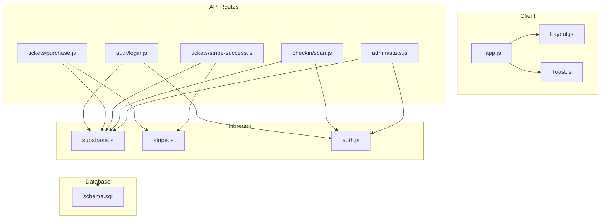

**Diagram sources**
- [pages/_app.js:1-14](file://pages/_app.js#L1-L14)
- [components/Layout.js:1-281](file://components/Layout.js#L1-L281)
- [components/ui/Toast.js:1-84](file://components/ui/Toast.js#L1-L84)
- [pages/api/auth/login.js:1-31](file://pages/api/auth/login.js#L1-L31)
- [pages/api/tickets/purchase.js:1-123](file://pages/api/tickets/purchase.js#L1-L123)
- [pages/api/tickets/stripe-success.js:1-55](file://pages/api/tickets/stripe-success.js#L1-L55)
- [pages/api/checkin/scan.js:1-44](file://pages/api/checkin/scan.js#L1-L44)
- [pages/api/admin/stats.js:1-41](file://pages/api/admin/stats.js#L1-L41)
- [lib/supabase.js:1-23](file://lib/supabase.js#L1-L23)
- [lib/stripe.js:1-6](file://lib/stripe.js#L1-L6)
- [lib/auth.js:1-47](file://lib/auth.js#L1-L47)
- [supabase/schema.sql:1-166](file://supabase/schema.sql#L1-L166)

**Section sources**
- [package.json:1-24](file://package.json#L1-L24)
- [next.config.js:1-14](file://next.config.js#L1-L14)

## Core Components
- Authentication flow: login route validates credentials via Supabase and sets a session cookie using helpers from the auth library.
- Ticket purchase: purchase route validates inputs, checks availability, applies promo codes, creates Stripe Checkout sessions or records tickets directly, and returns results.
- Stripe success handler: verifies payment status, persists tickets and payments, updates sold counts, and redirects to ticket view.
- Check-in scanning: enforces role-based access, validates tickets, prevents double-check-ins, and records check-ins.
- Admin stats: aggregates revenue and ticket sales per event with role-based scoping.
- Supabase client: exposes anon and service-role clients; warns when environment variables are missing.
- Stripe client: initializes SDK with API version and secret key.
- UI shell: wraps app with Layout and ToastProvider for global notifications.

**Section sources**
- [pages/api/auth/login.js:1-31](file://pages/api/auth/login.js#L1-L31)
- [lib/auth.js:1-47](file://lib/auth.js#L1-L47)
- [pages/api/tickets/purchase.js:1-123](file://pages/api/tickets/purchase.js#L1-L123)
- [pages/api/tickets/stripe-success.js:1-55](file://pages/api/tickets/stripe-success.js#L1-L55)
- [pages/api/checkin/scan.js:1-44](file://pages/api/checkin/scan.js#L1-L44)
- [pages/api/admin/stats.js:1-41](file://pages/api/admin/stats.js#L1-L41)
- [lib/supabase.js:1-23](file://lib/supabase.js#L1-L23)
- [lib/stripe.js:1-6](file://lib/stripe.js#L1-L6)
- [pages/_app.js:1-14](file://pages/_app.js#L1-L14)
- [components/Layout.js:1-281](file://components/Layout.js#L1-L281)
- [components/ui/Toast.js:1-84](file://components/ui/Toast.js#L1-L84)

## Architecture Overview
The system integrates Next.js API routes with Supabase for data persistence and Stripe for payments. The client renders pages wrapped by a shared layout and toast provider. Role-based authorization protects sensitive endpoints.

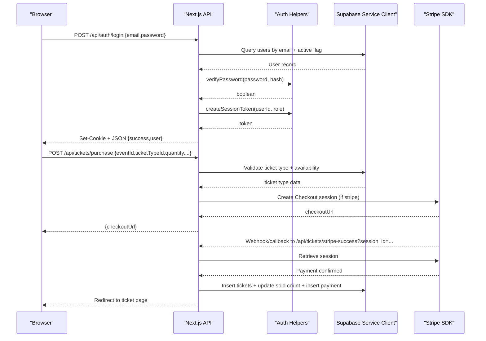

**Diagram sources**
- [pages/api/auth/login.js:1-31](file://pages/api/auth/login.js#L1-L31)
- [lib/auth.js:1-47](file://lib/auth.js#L1-L47)
- [pages/api/tickets/purchase.js:1-123](file://pages/api/tickets/purchase.js#L1-L123)
- [pages/api/tickets/stripe-success.js:1-55](file://pages/api/tickets/stripe-success.js#L1-L55)
- [lib/supabase.js:1-23](file://lib/supabase.js#L1-L23)
- [lib/stripe.js:1-6](file://lib/stripe.js#L1-L6)

## Detailed Component Analysis

### Authentication Flow (Login)
- Validates request method and payload.
- Queries Supabase for an active user by email.
- Verifies password using bcrypt helper.
- Issues a session token and sets an HttpOnly cookie.
- Returns user profile data on success.

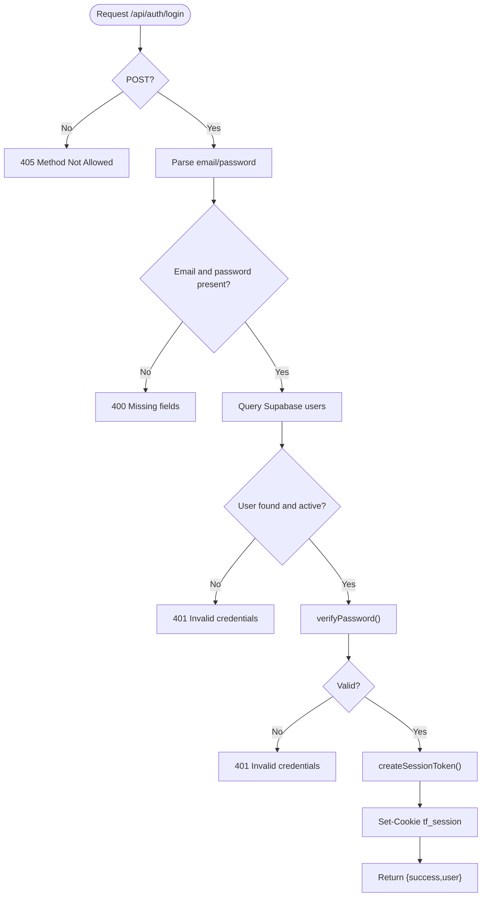

**Diagram sources**
- [pages/api/auth/login.js:1-31](file://pages/api/auth/login.js#L1-L31)
- [lib/auth.js:1-47](file://lib/auth.js#L1-L47)

**Section sources**
- [pages/api/auth/login.js:1-31](file://pages/api/auth/login.js#L1-L31)
- [lib/auth.js:1-47](file://lib/auth.js#L1-L47)

### Ticket Purchase Flow
- Validates required fields and availability.
- Applies promo code if provided and increments usage.
- For Stripe: creates a Checkout session with metadata containing tokens and buyer info.
- For other methods: inserts tickets immediately, updates sold counts, and records payment.

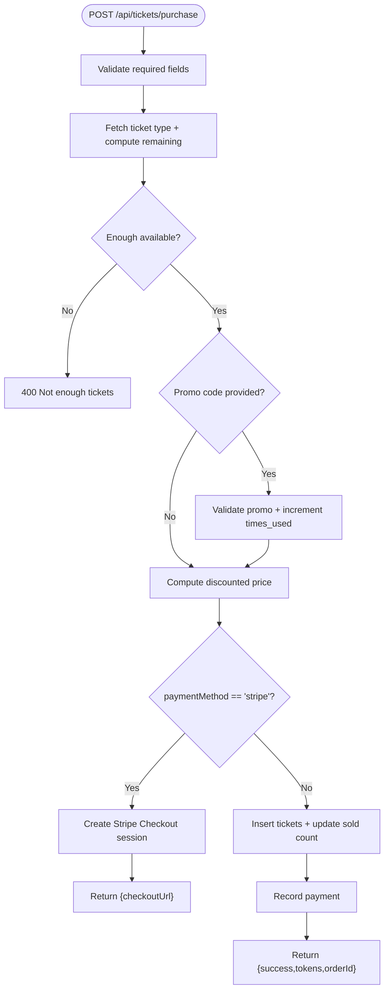

**Diagram sources**
- [pages/api/tickets/purchase.js:1-123](file://pages/api/tickets/purchase.js#L1-L123)

**Section sources**
- [pages/api/tickets/purchase.js:1-123](file://pages/api/tickets/purchase.js#L1-L123)

### Stripe Success Handler
- Retrieves Stripe session by ID.
- Confirms payment status.
- Parses metadata to create tickets, update sold counts, and record payment.
- Redirects to the first ticket’s page.

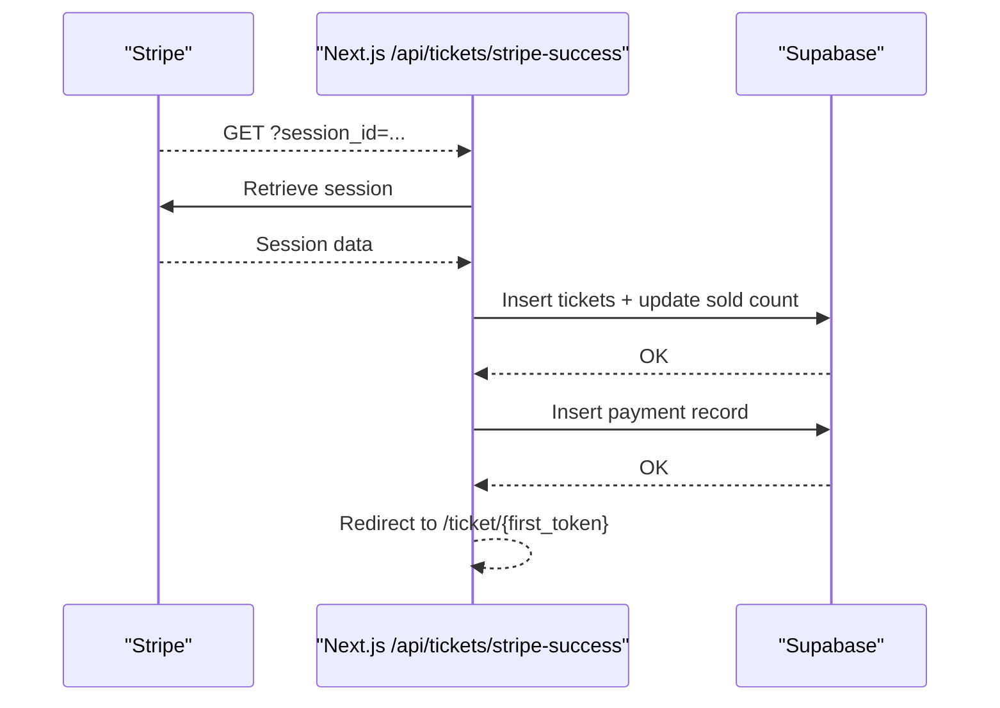

**Diagram sources**
- [pages/api/tickets/stripe-success.js:1-55](file://pages/api/tickets/stripe-success.js#L1-L55)

**Section sources**
- [pages/api/tickets/stripe-success.js:1-55](file://pages/api/tickets/stripe-success.js#L1-L55)

### Check-In Scanning
- Enforces role-based access for staff.
- Validates token and event association.
- Prevents invalid/cancelled/refunded/duplicate check-ins.
- Marks ticket as used and records check-in details.

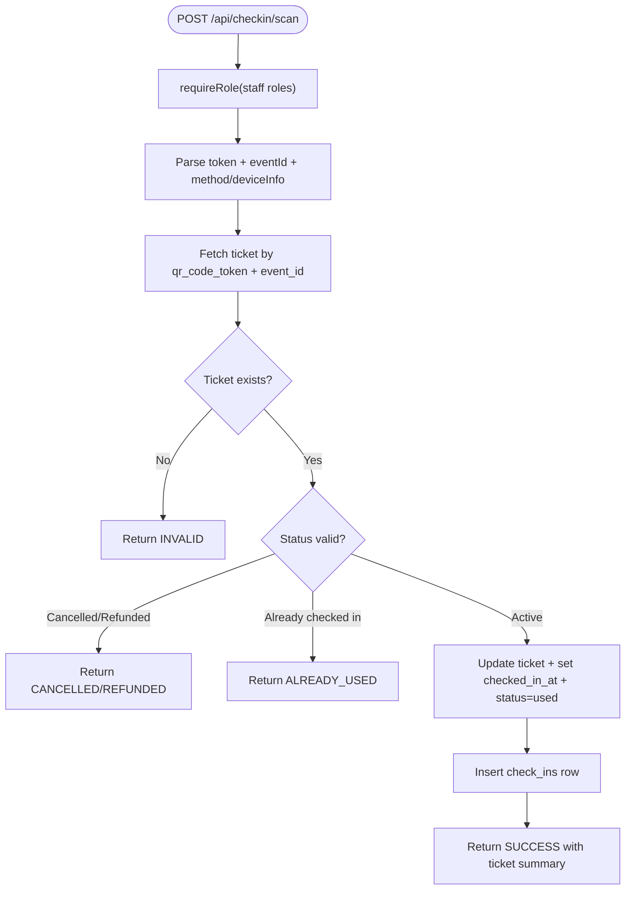

**Diagram sources**
- [pages/api/checkin/scan.js:1-44](file://pages/api/checkin/scan.js#L1-L44)

**Section sources**
- [pages/api/checkin/scan.js:1-44](file://pages/api/checkin/scan.js#L1-L44)

### Admin Stats Aggregation
- Requires appropriate roles.
- Fetches events scoped by user role.
- Aggregates payments and tickets to compute total revenue and sold counts.
- Provides per-event breakdown including sold and checked-in counts.

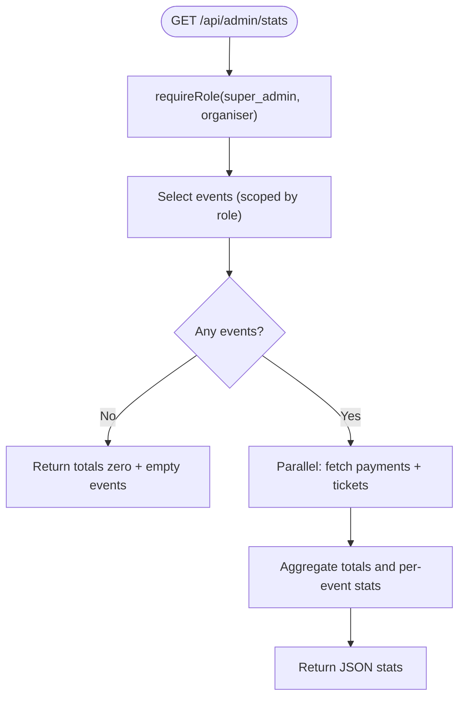

**Diagram sources**
- [pages/api/admin/stats.js:1-41](file://pages/api/admin/stats.js#L1-L41)

**Section sources**
- [pages/api/admin/stats.js:1-41](file://pages/api/admin/stats.js#L1-L41)

### Supabase Client Configuration
- Exposes anon client for public reads where allowed by policies.
- Exposes service-role client for server-side operations bypassing RLS.
- Warns when environment variables are missing.

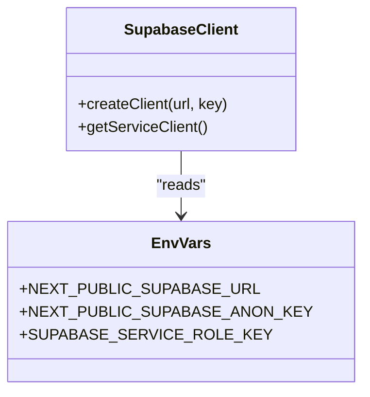

**Diagram sources**
- [lib/supabase.js:1-23](file://lib/supabase.js#L1-L23)

**Section sources**
- [lib/supabase.js:1-23](file://lib/supabase.js#L1-L23)

### Stripe Client Initialization
- Initializes Stripe SDK with secret key and API version.

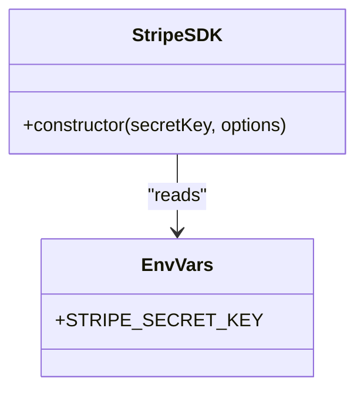

**Diagram sources**
- [lib/stripe.js:1-6](file://lib/stripe.js#L1-L6)

**Section sources**
- [lib/stripe.js:1-6](file://lib/stripe.js#L1-L6)

### Application Shell and Notifications
- _app.js wraps all pages with Layout and ToastProvider.
- Layout manages theme, navigation, and footer.
- ToastProvider provides global notifications with variants and auto-dismiss.

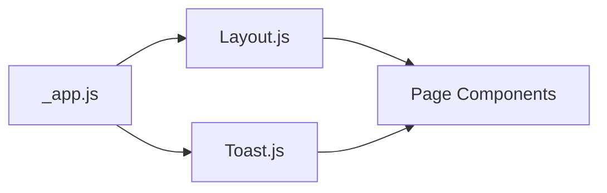

**Diagram sources**
- [pages/_app.js:1-14](file://pages/_app.js#L1-L14)
- [components/Layout.js:1-281](file://components/Layout.js#L1-L281)
- [components/ui/Toast.js:1-84](file://components/ui/Toast.js#L1-L84)

**Section sources**
- [pages/_app.js:1-14](file://pages/_app.js#L1-L14)
- [components/Layout.js:1-281](file://components/Layout.js#L1-L281)
- [components/ui/Toast.js:1-84](file://components/ui/Toast.js#L1-L84)

## Dependency Analysis
- Next.js runtime orchestrates routing and API handlers.
- Supabase clients depend on environment configuration for both anon and service roles.
- Stripe SDK depends on secret keys and API version.
- Auth helpers encapsulate password hashing and session token creation.
- API routes compose these dependencies to enforce business logic and security.

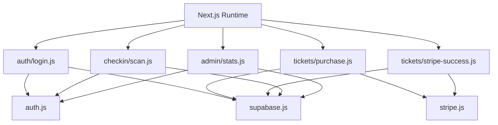

**Diagram sources**
- [pages/api/auth/login.js:1-31](file://pages/api/auth/login.js#L1-L31)
- [pages/api/tickets/purchase.js:1-123](file://pages/api/tickets/purchase.js#L1-L123)
- [pages/api/tickets/stripe-success.js:1-55](file://pages/api/tickets/stripe-success.js#L1-L55)
- [pages/api/checkin/scan.js:1-44](file://pages/api/checkin/scan.js#L1-L44)
- [pages/api/admin/stats.js:1-41](file://pages/api/admin/stats.js#L1-L41)
- [lib/auth.js:1-47](file://lib/auth.js#L1-L47)
- [lib/supabase.js:1-23](file://lib/supabase.js#L1-L23)
- [lib/stripe.js:1-6](file://lib/stripe.js#L1-L6)

**Section sources**
- [package.json:1-24](file://package.json#L1-L24)

## Performance Considerations
- Bundle analysis:
  - Use Next.js built-in bundle analyzer or third-party tools to identify large dependencies.
  - Prefer dynamic imports for heavy libraries like Stripe SDK where feasible.
- Code splitting:
  - Ensure route-level splitting is enabled by default in Next.js.
  - Avoid importing heavy modules at the top level of shared components.
- Rendering optimization:
  - Memoize expensive computations with useMemo/useCallback.
  - Minimize re-renders by keeping state local and lifting only necessary state up.
- Database query optimization:
  - Leverage indexes defined in schema.sql (e.g., qr_code_token, event_id, buyer_email).
  - Select only needed columns and avoid N+1 queries by batching or using joins where supported.
- Network efficiency:
  - Cache static assets and images; configure remotePatterns for image domains.
  - Use pagination for large datasets in admin views.
- Memory leaks:
  - Clean up event listeners and timers in useEffect.
  - Avoid storing large objects in global context without eviction strategies.

[No sources needed since this section provides general guidance]

## Troubleshooting Guide

### Browser Debugging Techniques
- Chrome DevTools:
  - Sources: Set breakpoints in Next.js API routes and client components to inspect execution flow.
  - Network: Inspect request payloads, responses, cookies, and timing for API calls and Stripe redirects.
  - Performance: Use Performance tab to capture timelines, identify long tasks, and measure Time to Interactive.
  - Memory: Take heap snapshots to detect retained objects and potential leaks.
- React Developer Tools:
  - Components: Inspect component tree, props, and state changes.
  - Profiler: Record render durations to find slow components and unnecessary re-renders.
  - Hooks: Verify correct usage of useState, useEffect, and custom hooks.
- Network inspection:
  - Verify CORS and headers for API routes.
  - Confirm cookie attributes (HttpOnly, SameSite) for session handling.

**Section sources**
- [pages/_app.js:1-14](file://pages/_app.js#L1-L14)
- [components/Layout.js:1-281](file://components/Layout.js#L1-L281)
- [components/ui/Toast.js:1-84](file://components/ui/Toast.js#L1-L84)

### Server-Side Debugging
- Next.js API routes:
  - Add structured logging around critical steps (validation, DB calls, external APIs).
  - Capture error stacks and contextual metadata (user id, event id, token).
- Supabase queries:
  - Log query parameters and results; ensure service-role key is configured for server-only operations.
  - Validate Row Level Security policies and indexes for performance.
- Stripe webhooks:
  - Verify webhook signatures and payload integrity.
  - Handle idempotency to prevent duplicate ticket creation.

**Section sources**
- [lib/supabase.js:1-23](file://lib/supabase.js#L1-L23)
- [lib/stripe.js:1-6](file://lib/stripe.js#L1-L6)
- [pages/api/tickets/stripe-success.js:1-55](file://pages/api/tickets/stripe-success.js#L1-L55)

### Logging Strategies and Error Tracking
- Centralized logging:
  - Implement a logging utility that formats messages with timestamps, levels, and correlation IDs.
  - Route logs to file or external services (e.g., Sentry, Datadog).
- Error tracking:
  - Integrate Sentry to capture unhandled exceptions and user context.
  - Tag errors with environment, route, and user role for faster triage.
- Monitoring key metrics:
  - Track API latency, error rates, and throughput for critical endpoints (login, purchase, check-in).
  - Monitor Stripe payment success/failure rates and Supabase query latency.

[No sources needed since this section provides general guidance]

### Common Issues and Resolutions
- Authentication problems:
  - Symptoms: 401 Unauthorized, missing cookies, expired sessions.
  - Checks: Email normalization, password hashing, cookie attributes, session expiration.
  - Resolution: Ensure .env.local has correct Supabase keys; verify bcrypt hashes; confirm Max-Age and SameSite settings.
- Payment failures:
  - Symptoms: Stripe redirect loops, unpaid sessions, missing tickets.
  - Checks: Checkout session metadata, payment_status, webhook delivery, idempotency.
  - Resolution: Validate session retrieval; ensure ticket insertion and payment recording occur atomically; handle retries gracefully.
- Database connection errors:
  - Symptoms: Supabase timeouts, permission denied, placeholder URLs.
  - Checks: Environment variables, service-role key, RLS policies, network egress.
  - Resolution: Configure NEXT_PUBLIC_SUPABASE_URL, ANON_KEY, and SERVICE_ROLE_KEY; review schema policies and indexes.

**Section sources**
- [pages/api/auth/login.js:1-31](file://pages/api/auth/login.js#L1-L31)
- [lib/auth.js:1-47](file://lib/auth.js#L1-L47)
- [pages/api/tickets/purchase.js:1-123](file://pages/api/tickets/purchase.js#L1-L123)
- [pages/api/tickets/stripe-success.js:1-55](file://pages/api/tickets/stripe-success.js#L1-L55)
- [lib/supabase.js:1-23](file://lib/supabase.js#L1-L23)
- [supabase/schema.sql:1-166](file://supabase/schema.sql#L1-L166)

### Performance Optimization Techniques
- Bundle analysis:
  - Identify heavy dependencies and lazy-load them.
  - Remove unused code paths and dead imports.
- Code splitting:
  - Split large components and route-specific features.
  - Use dynamic imports for Stripe SDK and QR generation libraries.
- Database query optimization:
  - Use selective selects and filter early.
  - Leverage existing indexes (qr_code_token, event_id, buyer_email) and add composite indexes where beneficial.
- Frontend rendering:
  - Debounce search inputs and throttle scroll handlers.
  - Virtualize lists for large datasets in admin dashboards.

[No sources needed since this section provides general guidance]

## Conclusion
This guide consolidates debugging and performance profiling practices tailored to TicketFlow’s architecture. By leveraging browser tools, server-side logging, error tracking, and monitoring, teams can quickly diagnose issues across authentication, payments, and database interactions. Applying the outlined optimization techniques ensures responsive user experiences and reliable backend operations.