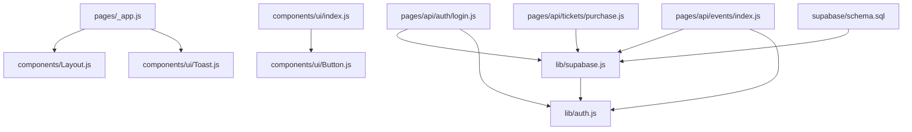
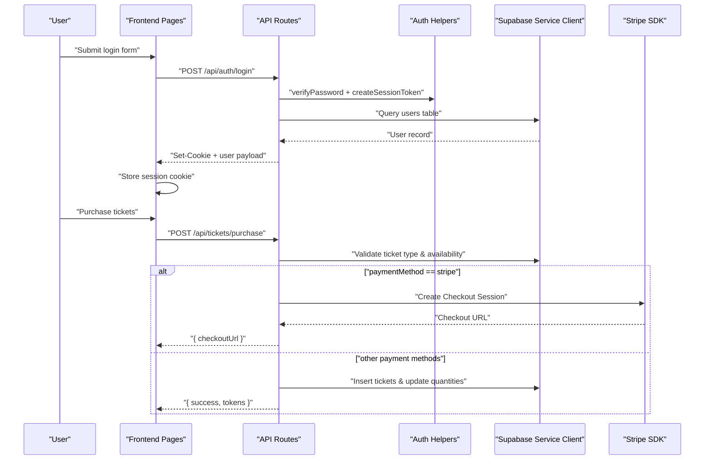
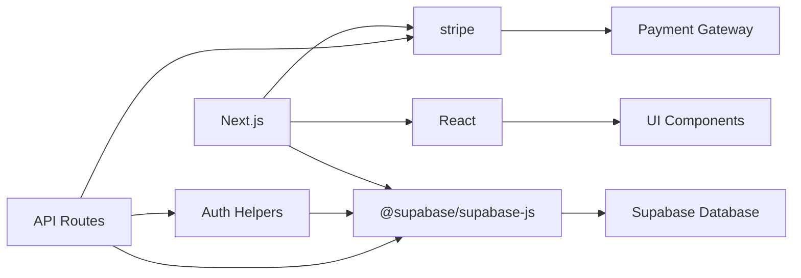

# Development Guidelines

<cite>
**Referenced Files in This Document**
- [package.json](file://package.json)
- [next.config.js](file://next.config.js)
- [vercel.json](file://vercel.json)
- [.gitignore](file://.gitignore)
- [pages/_app.js](file://pages/_app.js)
- [components/Layout.js](file://components/Layout.js)
- [components/ui/index.js](file://components/ui/index.js)
- [components/ui/Button.js](file://components/ui/Button.js)
- [components/ui/Toast.js](file://components/ui/Toast.js)
- [lib/supabase.js](file://lib/supabase.js)
- [lib/auth.js](file://lib/auth.js)
- [supabase/schema.sql](file://supabase/schema.sql)
- [pages/index.js](file://pages/index.js)
- [pages/api/auth/login.js](file://pages/api/auth/login.js)
- [pages/api/events/index.js](file://pages/api/events/index.js)
- [pages/api/tickets/purchase.js](file://pages/api/tickets/purchase.js)
</cite>

## Table of Contents
1. Introduction
2. Project Structure
3. Core Components
4. Architecture Overview
5. Detailed Component Analysis
6. Dependency Analysis
7. Performance Considerations
8. Troubleshooting Guide
9. Conclusion
10. Appendices

## Introduction
This document provides comprehensive development guidelines for TicketFlow contributors. It covers coding standards, naming conventions, project structure best practices, component patterns, state management approaches, API route development, error handling, input validation, testing strategies, debugging techniques, performance profiling, code review processes, commit message conventions, version control workflows, and productivity tips. The goal is to help contributors build features efficiently while maintaining backward compatibility and high quality.

## Project Structure
TicketFlow follows a Next.js App Router-style file-based routing with pages and API routes organized by feature:
- pages: UI pages and API endpoints
- components: reusable UI components and layout wrappers
- lib: shared utilities (Supabase client, auth helpers)
- supabase: database schema and migrations
- Configuration files at the root (Next.js, Vercel, package scripts)

**Diagram sources**
- [pages/_app.js:1-14](file://pages/_app.js#L1-L14)
- [components/Layout.js:1-281](file://components/Layout.js#L1-L281)
- [components/ui/Toast.js:1-84](file://components/ui/Toast.js#L1-L84)
- [components/ui/index.js:1-10](file://components/ui/index.js#L1-L10)
- [components/ui/Button.js:1-74](file://components/ui/Button.js#L1-L74)
- [lib/supabase.js:1-23](file://lib/supabase.js#L1-L23)
- [lib/auth.js:1-47](file://lib/auth.js#L1-L47)
- [pages/api/auth/login.js:1-31](file://pages/api/auth/login.js#L1-L31)
- [pages/api/events/index.js:1-42](file://pages/api/events/index.js#L1-L42)
- [pages/api/tickets/purchase.js:1-123](file://pages/api/tickets/purchase.js#L1-L123)
- [supabase/schema.sql:1-166](file://supabase/schema.sql#L1-L166)

**Section sources**
- [package.json:1-24](file://package.json#L1-L24)
- [next.config.js:1-14](file://next.config.js#L1-L14)
- [vercel.json:1-18](file://vercel.json#L1-L18)
- [.gitignore:1-33](file://.gitignore#L1-L33)

## Core Components
- Layout: Provides global navigation, theme switching, and page shell. Uses router detection to hide chrome on admin/checkin paths.
- Toast: Global notification system via React Context; exposes showToast and convenience methods (success, error, warning, info).
- Button: Reusable button with variants, sizes, loading state, and ripple effect via CSS custom properties.
- Supabase Client: Exposes anonymous and service-role clients; warns if environment variables are missing.
- Auth Helpers: Password hashing/verification, session token creation/parsing, and role enforcement middleware.

Best practices:
- Keep components small and focused; prefer composition over inheritance.
- Use TypeScript-like prop validation through PropTypes or runtime checks where needed.
- Centralize styling via Tailwind-like utility classes defined in global CSS.
- Avoid prop drilling by using context providers (e.g., ToastProvider) or higher-order components.

**Section sources**
- [components/Layout.js:1-281](file://components/Layout.js#L1-L281)
- [components/ui/Toast.js:1-84](file://components/ui/Toast.js#L1-L84)
- [components/ui/Button.js:1-74](file://components/ui/Button.js#L1-L74)
- [lib/supabase.js:1-23](file://lib/supabase.js#L1-L23)
- [lib/auth.js:1-47](file://lib/auth.js#L1-L47)

## Architecture Overview
TicketFlow uses a Next.js frontend with serverless API routes backed by Supabase. Authentication is handled via cookies and simple session tokens. Payments integrate Stripe for card payments and support other payment methods.

**Diagram sources**
- [pages/api/auth/login.js:1-31](file://pages/api/auth/login.js#L1-L31)
- [lib/auth.js:1-47](file://lib/auth.js#L1-L47)
- [lib/supabase.js:1-23](file://lib/supabase.js#L1-L23)
- [pages/api/tickets/purchase.js:1-123](file://pages/api/tickets/purchase.js#L1-L123)

## Detailed Component Analysis

### Layout Component
Responsibilities:
- Global head metadata and viewport configuration
- Navigation and footer rendering based on route segments
- Theme persistence via localStorage and CSS attributes
- Conditional visibility for admin/checkin sections

Patterns:
- Route-based conditional rendering using useRouter
- Local storage for theme preference
- Scroll listener with passive event listeners

Recommendations:
- Extract theme list into a config module for easy extension
- Consider adding accessibility improvements (ARIA labels, keyboard navigation)

**Section sources**
- [components/Layout.js:1-281](file://components/Layout.js#L1-L281)

### Toast Provider and Hook
Responsibilities:
- Manage toast queue and lifecycle
- Provide typed convenience methods for different toast types
- Auto-dismiss with configurable duration

Patterns:
- React Context for global state
- useCallback for stable function references
- Timers for auto-dismiss and exit animations

Recommendations:
- Add max concurrent toasts limit
- Support stacking behavior and positioning customization

**Section sources**
- [components/ui/Toast.js:1-84](file://components/ui/Toast.js#L1-L84)
- [pages/_app.js:1-14](file://pages/_app.js#L1-L14)

### Button Component
Responsibilities:
- Unified button styles across variants and sizes
- Loading indicator and disabled states
- Ripple effect via mouse position tracking

Patterns:
- Prop-driven class composition
- useRef for DOM interaction
- Spread props for flexibility

Recommendations:
- Add keyboard focus ring customization
- Integrate with design tokens for consistent spacing

**Section sources**
- [components/ui/Button.js:1-74](file://components/ui/Button.js#L1-L74)

### Supabase Client
Responsibilities:
- Initialize anonymous and service-role clients
- Warn when environment variables are missing
- Provide helper to get service client for server-side operations

Patterns:
- Environment variable fallbacks
- Separate clients for public vs privileged operations

Recommendations:
- Add request logging for debugging
- Implement retry logic for transient failures

**Section sources**
- [lib/supabase.js:1-23](file://lib/supabase.js#L1-L23)

### Auth Helpers
Responsibilities:
- Password hashing and verification
- Session token creation and parsing
- Role-based access control middleware

Patterns:
- Cookie-based session management
- Base64-encoded JSON payloads with expiration
- Middleware-style requireRole function

Recommendations:
- Migrate to JWT or Supabase Auth for production
- Add refresh token rotation and secure cookie flags

**Section sources**
- [lib/auth.js:1-47](file://lib/auth.js#L1-L47)

### API Routes

#### Login Endpoint
Flow:
- Validate POST method and required fields
- Query user by email and active status
- Verify password hash
- Set session cookie and return user data

Error Handling:
- Return 400 for missing fields
- Return 401 for invalid credentials
- Catch and log unexpected errors

**Section sources**
- [pages/api/auth/login.js:1-31](file://pages/api/auth/login.js#L1-L31)

#### Events API
Flow:
- GET: List published events with ticket types
- POST: Create new event with role validation

Validation:
- Require event_name, slug, date, venue
- Normalize slug to lowercase with hyphens

Authorization:
- Enforce super_admin or organiser roles

**Section sources**
- [pages/api/events/index.js:1-42](file://pages/api/events/index.js#L1-L42)

#### Ticket Purchase Endpoint
Flow:
- Validate required fields
- Check ticket type availability
- Apply promo codes if provided
- Handle Stripe checkout sessions or direct ticket creation
- Record payments and update quantities

Error Handling:
- Return appropriate HTTP status codes
- Log errors and provide user-friendly messages

Security:
- Use service-role client for server-side operations
- Validate all inputs before database writes

**Section sources**
- [pages/api/tickets/purchase.js:1-123](file://pages/api/tickets/purchase.js#L1-L123)

### Database Schema
The schema defines core entities: users, events, ticket_types, tickets, check_ins, payments, promo_codes. It includes:
- UUID primary keys with defaults
- Foreign key relationships with cascade behaviors
- Row-level security policies for public read access
- Indexes for performance optimization
- Seed data for default super admin

Best Practices:
- Use enums via CHECK constraints for data integrity
- Enable RLS for all tables
- Add indexes on frequently queried columns

**Section sources**
- [supabase/schema.sql:1-166](file://supabase/schema.sql#L1-L166)

## Dependency Analysis
Key dependencies and their roles:
- Next.js: Framework for SSR, routing, and API routes
- Supabase: Database and authentication backend
- Stripe: Payment processing integration
- React: UI library with hooks and context
- bcryptjs: Password hashing
- uuid: Unique identifier generation

**Diagram sources**
- [package.json:1-24](file://package.json#L1-L24)
- [lib/supabase.js:1-23](file://lib/supabase.js#L1-L23)
- [lib/auth.js:1-47](file://lib/auth.js#L1-L47)
- [pages/api/tickets/purchase.js:1-123](file://pages/api/tickets/purchase.js#L1-L123)

**Section sources**
- [package.json:1-24](file://package.json#L1-L24)

## Performance Considerations
- Use Next.js built-in optimizations: image optimization, code splitting, and SSR where appropriate
- Implement lazy loading for heavy components and images
- Cache API responses using Supabase caching strategies or CDN headers
- Optimize database queries with proper indexing and selective field selection
- Monitor bundle size and remove unused dependencies
- Use React.memo and useMemo for expensive computations
- Implement pagination for large datasets

[No sources needed since this section provides general guidance]

## Troubleshooting Guide
Common issues and solutions:
- Missing environment variables: Check .env.local and ensure all required variables are set
- Supabase connection errors: Verify URLs and keys, check network connectivity
- Authentication failures: Validate password hashes and session token expiration
- Payment processing errors: Check Stripe API keys and webhook configurations
- CORS issues: Configure allowed origins in Supabase and Next.js headers

Debugging techniques:
- Use console.log strategically in API routes
- Enable Supabase debug mode for query logging
- Use browser DevTools Network tab to inspect API calls
- Implement structured logging with timestamps and correlation IDs

**Section sources**
- [lib/supabase.js:1-23](file://lib/supabase.js#L1-L23)
- [lib/auth.js:1-47](file://lib/auth.js#L1-L47)
- [pages/api/auth/login.js:1-31](file://pages/api/auth/login.js#L1-L31)

## Conclusion
This guide establishes clear standards and patterns for developing TicketFlow features. By following these guidelines, contributors can maintain code quality, improve collaboration, and deliver reliable features efficiently. Focus on component reusability, proper error handling, and performance optimization while ensuring backward compatibility.

[No sources needed since this section summarizes without analyzing specific files]

## Appendices

### Development Environment Setup
Prerequisites:
- Node.js 18+ and npm/yarn
- Supabase account and project setup
- Stripe account for payment testing

Setup steps:
1. Clone repository and install dependencies
2. Configure environment variables in .env.local
3. Run database schema migration in Supabase SQL editor
4. Start development server with hot reload

Environment variables:
- NEXT_PUBLIC_SUPABASE_URL: Supabase project URL
- NEXT_PUBLIC_SUPABASE_ANON_KEY: Anonymous client key
- SUPABASE_SERVICE_ROLE_KEY: Service role key for server operations
- STRIPE_SECRET_KEY: Stripe secret key for payment processing
- NEXT_PUBLIC_SITE_URL: Application base URL

**Section sources**
- [package.json:1-24](file://package.json#L1-L24)
- [next.config.js:1-14](file://next.config.js#L1-L14)
- [vercel.json:1-18](file://vercel.json#L1-L18)
- [.gitignore:1-33](file://.gitignore#L1-L33)

### Coding Standards and Naming Conventions
File naming:
- PascalCase for components (Button.js, Layout.js)
- camelCase for utilities and hooks (auth.js, supabase.js)
- kebab-case not used in this codebase

Component patterns:
- Functional components with React hooks
- Default exports for components
- Named exports for utilities and constants

State management:
- Local state with useState for component-specific data
- Context for global state (ToastProvider)
- Server state with Supabase queries

Error handling:
- Consistent error response format with status codes
- User-friendly error messages
- Proper logging for debugging

**Section sources**
- [components/ui/index.js:1-10](file://components/ui/index.js#L1-L10)
- [components/ui/Button.js:1-74](file://components/ui/Button.js#L1-L74)
- [lib/auth.js:1-47](file://lib/auth.js#L1-L47)

### Testing Strategies
Recommended approach:
- Unit tests for utility functions and business logic
- Integration tests for API routes
- End-to-end tests for critical user flows
- Mock external services (Supabase, Stripe) in tests

Testing tools:
- Jest for unit and integration testing
- React Testing Library for component testing
- Cypress or Playwright for E2E testing

Test organization:
- Group tests by feature/module
- Use descriptive test names
- Mock external dependencies consistently

[No sources needed since this section provides general guidance]

### Debugging Techniques
Browser debugging:
- Use React DevTools for component inspection
- Network tab for API call analysis
- Console for logging and error tracking

Server-side debugging:
- Structured logging in API routes
- Error boundaries for graceful degradation
- Health check endpoints for monitoring

Performance profiling:
- Chrome DevTools Performance tab
- React Profiler for component rendering
- Database query analysis in Supabase dashboard

[No sources needed since this section provides general guidance]

### Code Review Process
Review checklist:
- Code follows established patterns and conventions
- Proper error handling and edge cases covered
- Security considerations addressed
- Performance implications considered
- Tests included for new functionality
- Documentation updated if needed

Review workflow:
- Create feature branches from main
- Submit pull requests with detailed descriptions
- Request reviews from team members
- Address feedback and merge after approval

**Section sources**
- [.gitignore:1-33](file://.gitignore#L1-L33)

### Commit Message Conventions
Format:
- Type: description (scope)
- Types: feat, fix, docs, style, refactor, test, chore
- Scope: affected module or feature
- Description: concise summary of changes

Examples:
- feat(auth): add password reset functionality
- fix(api): resolve ticket purchase race condition
- docs(readme): update installation instructions

[No sources needed since this section provides general guidance]

### Version Control Workflow
Branch strategy:
- main: production-ready code
- develop: integration branch for features
- feature/*: individual feature branches
- hotfix/*: urgent production fixes

Release process:
- Tag releases with semantic versioning
- Create release notes documenting changes
- Deploy to staging for QA testing
- Promote to production after approval

**Section sources**
- [.gitignore:1-33](file://.gitignore#L1-L33)

### Adding New Features
Step-by-step process:
1. Create feature branch from main
2. Implement feature with proper error handling
3. Add tests for new functionality
4. Update documentation if needed
5. Submit pull request for review
6. Merge after approval and CI passes

Backward compatibility:
- Maintain existing API contracts
- Use feature flags for breaking changes
- Deprecate old features gradually
- Test against existing integrations

**Section sources**
- [pages/api/events/index.js:1-42](file://pages/api/events/index.js#L1-L42)
- [pages/api/tickets/purchase.js:1-123](file://pages/api/tickets/purchase.js#L1-L123)

### Productivity Tips
Development efficiency:
- Use VS Code extensions for React and Next.js
- Configure ESLint and Prettier for code formatting
- Utilize Next.js dev server hot reload
- Leverage Supabase dashboard for database management

Code organization:
- Follow feature-based folder structure
- Reuse common components and utilities
- Document complex business logic inline
- Keep files focused and manageable

Collaboration:
- Write clear commit messages
- Document API changes in comments
- Share knowledge through code reviews
- Maintain up-to-date README and documentation

[No sources needed since this section provides general guidance]