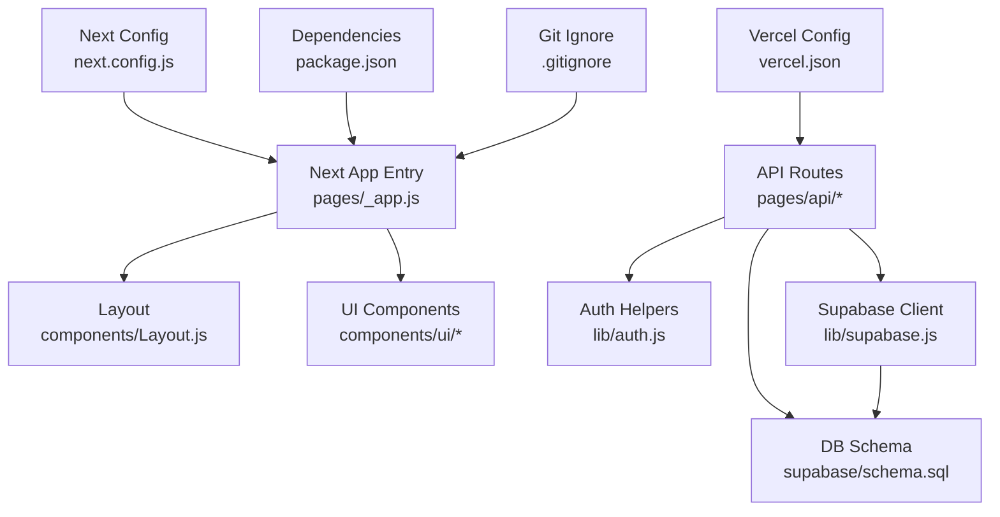
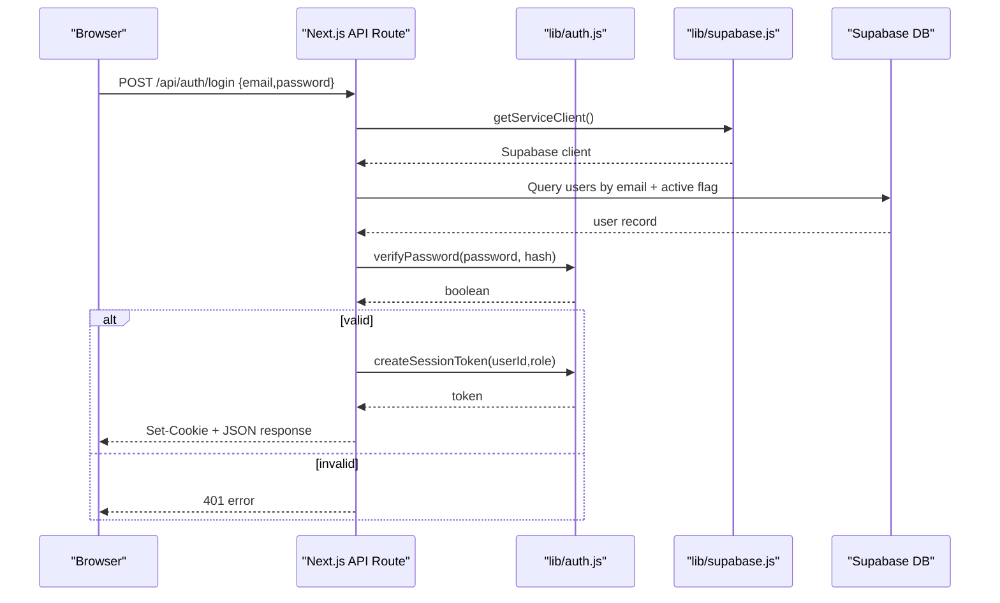
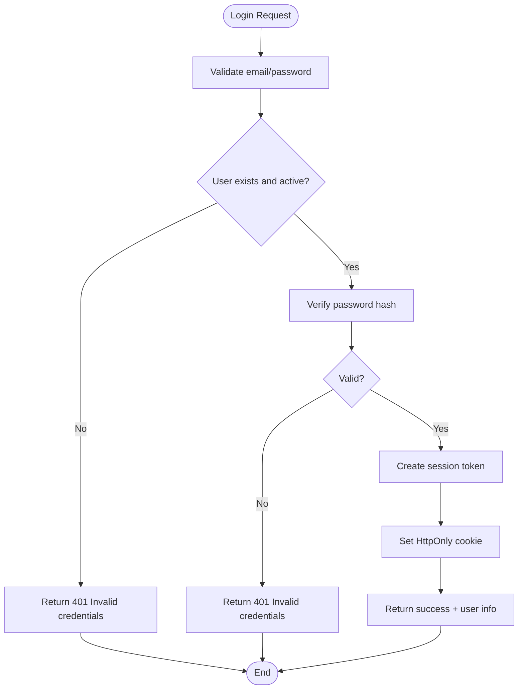
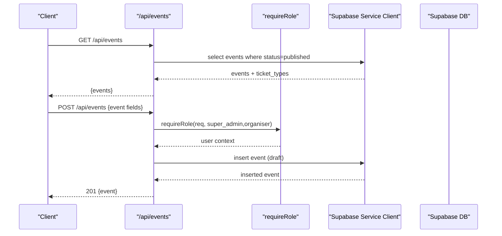
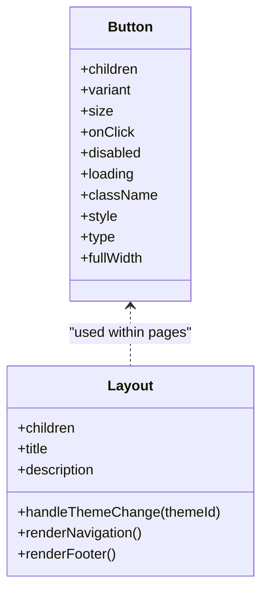
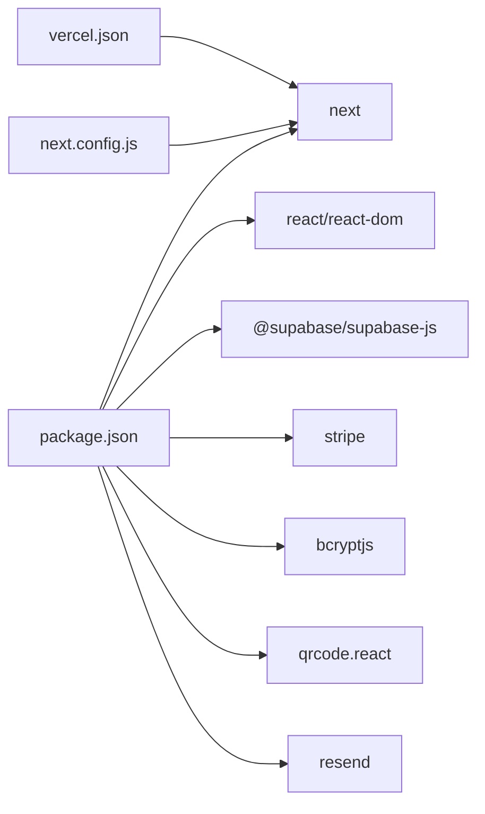

# Development Workflow & Collaboration

<cite>
**Referenced Files in This Document**
- [package.json](file://package.json)
- [next.config.js](file://next.config.js)
- [vercel.json](file://vercel.json)
- [.gitignore](file://.gitignore)
- [supabase/schema.sql](file://supabase/schema.sql)
- [lib/supabase.js](file://lib/supabase.js)
- [lib/auth.js](file://lib/auth.js)
- [pages/_app.js](file://pages/_app.js)
- [pages/api/auth/login.js](file://pages/api/auth/login.js)
- [pages/api/events/index.js](file://pages/api/events/index.js)
- [components/Layout.js](file://components/Layout.js)
- [components/ui/Button.js](file://components/ui/Button.js)
</cite>

## Table of Contents
1. Introduction
2. Project Structure
3. Core Components
4. Architecture Overview
5. Detailed Component Analysis
6. Dependency Analysis
7. Performance Considerations
8. Troubleshooting Guide
9. Conclusion
10. Appendices

## Introduction
This document establishes the development workflow and collaboration guidelines for TicketFlow contributors. It covers Git branching strategies, commit message conventions, pull request processes, environment setup, dependency management, local configuration, code review practices, automated checks, deployment workflows, staging and production releases, collaboration tools, issue tracking, contribution guidelines, backward compatibility, onboarding, and knowledge sharing. The guidance is grounded in the repository’s configuration and implementation details to ensure consistency across the team.

## Project Structure
TicketFlow is a Next.js application with:
- Pages and API routes under pages/
- Shared UI components under components/
- Library modules (Supabase client, auth helpers, Stripe client) under lib/
- Database schema under supabase/schema.sql
- Deployment configuration via vercel.json
- Environment variable handling and strict mode via next.config.js
- Dependency scripts and versions in package.json
- Ignored files and directories via .gitignore

**Diagram sources**
- [pages/_app.js:1-14](file://pages/_app.js#L1-L14)
- [components/Layout.js:1-281](file://components/Layout.js#L1-L281)
- [components/ui/Button.js:1-74](file://components/ui/Button.js#L1-L74)
- [pages/api/auth/login.js:1-31](file://pages/api/auth/login.js#L1-L31)
- [pages/api/events/index.js:1-42](file://pages/api/events/index.js#L1-L42)
- [lib/auth.js:1-47](file://lib/auth.js#L1-L47)
- [lib/supabase.js:1-23](file://lib/supabase.js#L1-L23)
- [supabase/schema.sql:1-166](file://supabase/schema.sql#L1-L166)
- [vercel.json:1-18](file://vercel.json#L1-L18)
- [next.config.js:1-14](file://next.config.js#L1-L14)
- [package.json:1-24](file://package.json#L1-L24)
- [.gitignore:1-33](file://.gitignore#L1-L33)

**Section sources**
- [package.json:1-24](file://package.json#L1-L24)
- [next.config.js:1-14](file://next.config.js#L1-L14)
- [vercel.json:1-18](file://vercel.json#L1-L18)
- [.gitignore:1-33](file://.gitignore#L1-L33)
- [supabase/schema.sql:1-166](file://supabase/schema.sql#L1-L166)
- [lib/supabase.js:1-23](file://lib/supabase.js#L1-L23)
- [lib/auth.js:1-47](file://lib/auth.js#L1-L47)
- [pages/_app.js:1-14](file://pages/_app.js#L1-L14)
- [components/Layout.js:1-281](file://components/Layout.js#L1-L281)
- [components/ui/Button.js:1-74](file://components/ui/Button.js#L1-L74)

## Core Components
- Application entry and layout:
  - pages/_app.js initializes global providers and default layout.
  - components/Layout.js provides navigation, theme switching, and footer.
- API layer:
  - pages/api/auth/login.js handles authentication using Supabase service client and session cookies.
  - pages/api/events/index.js exposes public read and protected write endpoints for events.
- Libraries:
  - lib/supabase.js configures Supabase clients (anon and service role).
  - lib/auth.js implements password hashing, verification, session token creation/parsing, and role enforcement.
- UI primitives:
  - components/ui/Button.js offers consistent button variants and sizes.

**Section sources**
- [pages/_app.js:1-14](file://pages/_app.js#L1-L14)
- [components/Layout.js:1-281](file://components/Layout.js#L1-L281)
- [pages/api/auth/login.js:1-31](file://pages/api/auth/login.js#L1-L31)
- [pages/api/events/index.js:1-42](file://pages/api/events/index.js#L1-L42)
- [lib/supabase.js:1-23](file://lib/supabase.js#L1-L23)
- [lib/auth.js:1-47](file://lib/auth.js#L1-L47)
- [components/ui/Button.js:1-74](file://components/ui/Button.js#L1-L74)

## Architecture Overview
The system follows a Next.js app with serverless API routes that interact with Supabase for data and optional external services like Stripe. Security is enforced through Supabase policies and server-side role checks.

**Diagram sources**
- [pages/api/auth/login.js:1-31](file://pages/api/auth/login.js#L1-L31)
- [lib/auth.js:1-47](file://lib/auth.js#L1-L47)
- [lib/supabase.js:1-23](file://lib/supabase.js#L1-L23)
- [supabase/schema.sql:1-166](file://supabase/schema.sql#L1-L166)

## Detailed Component Analysis

### Authentication Flow
- Login endpoint validates credentials, creates a session cookie, and returns user metadata.
- Role-based access is enforced via requireRole helper used in protected endpoints.

**Diagram sources**
- [pages/api/auth/login.js:1-31](file://pages/api/auth/login.js#L1-L31)
- [lib/auth.js:1-47](file://lib/auth.js#L1-L47)

**Section sources**
- [pages/api/auth/login.js:1-31](file://pages/api/auth/login.js#L1-L31)
- [lib/auth.js:1-47](file://lib/auth.js#L1-L47)

### Events API
- GET lists published events with ticket types.
- POST requires super_admin or organiser role; inserts event as draft.

**Diagram sources**
- [pages/api/events/index.js:1-42](file://pages/api/events/index.js#L1-L42)
- [lib/auth.js:1-47](file://lib/auth.js#L1-L47)
- [lib/supabase.js:1-23](file://lib/supabase.js#L1-L23)

**Section sources**
- [pages/api/events/index.js:1-42](file://pages/api/events/index.js#L1-L42)
- [lib/auth.js:1-47](file://lib/auth.js#L1-L47)
- [lib/supabase.js:1-23](file://lib/supabase.js#L1-L23)

### UI Components
- Button component standardizes variants, sizes, loading state, and accessibility attributes.
- Layout component centralizes navigation, theme persistence, and responsive behavior.

**Diagram sources**
- [components/ui/Button.js:1-74](file://components/ui/Button.js#L1-L74)
- [components/Layout.js:1-281](file://components/Layout.js#L1-L281)

**Section sources**
- [components/ui/Button.js:1-74](file://components/ui/Button.js#L1-L74)
- [components/Layout.js:1-281](file://components/Layout.js#L1-L281)

## Dependency Analysis
- Runtime dependencies include Next.js, React, Supabase client, Stripe SDK, bcryptjs, QR code generator, and email utilities.
- Build and dev scripts are defined for development, build, and start commands.
- Vercel configuration sets framework, build/install/dev commands, regions, and security headers for API routes.
- Next configuration enables strict mode and restricts remote image domains.

**Diagram sources**
- [package.json:1-24](file://package.json#L1-L24)
- [vercel.json:1-18](file://vercel.json#L1-L18)
- [next.config.js:1-14](file://next.config.js#L1-L14)

**Section sources**
- [package.json:1-24](file://package.json#L1-L24)
- [vercel.json:1-18](file://vercel.json#L1-L18)
- [next.config.js:1-14](file://next.config.js#L1-L14)

## Performance Considerations
- Use Supabase indexes already defined in the schema for frequent queries (e.g., tickets by token/email/event_id, check-ins by event_id, payments by ticket_id).
- Keep API responses minimal and avoid N+1 queries by leveraging Supabase joins where appropriate.
- Enable Next.js strict mode and leverage React best practices to prevent unnecessary re-renders.
- Cache static assets and images via CDN; configure allowed remote image patterns in Next config.
- Monitor region selection in Vercel to reduce latency for target audiences.

[No sources needed since this section provides general guidance]

## Troubleshooting Guide
- Missing environment variables:
  - Ensure NEXT_PUBLIC_SUPABASE_URL and NEXT_PUBLIC_SUPABASE_ANON_KEY are set locally and in Vercel.
  - For server-only operations, set SUPABASE_SERVICE_ROLE_KEY.
  - For Stripe, set STRIPE_SECRET_KEY.
- Supabase connection warnings:
  - The Supabase client logs a warning when environment variables are missing; verify .env.local and Vercel environment settings.
- Authentication failures:
  - Confirm user is active and password hash matches; check login endpoint error paths.
- API route errors:
  - Inspect error responses from Supabase client calls and handle non-2xx statuses appropriately.
- Image loading issues:
  - Add required hostnames to next.config.js remotePatterns if new image sources are introduced.

**Section sources**
- [lib/supabase.js:1-23](file://lib/supabase.js#L1-L23)
- [pages/api/auth/login.js:1-31](file://pages/api/auth/login.js#L1-L31)
- [next.config.js:1-14](file://next.config.js#L1-L14)

## Conclusion
By following the outlined Git workflow, environment setup, code review practices, and deployment procedures, contributors can collaborate effectively and maintain high quality in TicketFlow. Adhering to the established patterns ensures secure, performant, and scalable development.

[No sources needed since this section summarizes without analyzing specific files]

## Appendices

### Git Workflow and Branching Strategy
- Main branch protection:
  - Protect main/master; require PR reviews and passing checks before merge.
- Branch naming:
  - feature/<short-description>, fix/<short-description>, chore/<task>, docs/<topic>.
- Commit messages:
  - Conventional commits: type(scope): description (e.g., feat(auth): add login endpoint).
- Pull requests:
  - Small, focused changes; link related issues; include screenshots for UI changes.
  - Required reviewers: at least one maintainer.
  - Squash and merge to keep history clean.

[No sources needed since this section provides general guidance]

### Environment Setup and Local Development
- Prerequisites:
  - Node.js LTS recommended; npm or yarn.
- Install dependencies:
  - Run install command specified in package.json.
- Start development server:
  - Use dev script from package.json.
- Environment variables:
  - Create .env.local with Supabase keys and Stripe secret key.
  - Do not commit secrets; .gitignore excludes .env* files.
- Database schema:
  - Apply supabase/schema.sql in Supabase SQL editor to initialize tables and policies.

**Section sources**
- [package.json:1-24](file://package.json#L1-L24)
- [.gitignore:1-33](file://.gitignore#L1-L33)
- [supabase/schema.sql:1-166](file://supabase/schema.sql#L1-L166)

### Code Review and Quality Gates
- Automated checks:
  - Linting and formatting should be integrated into pre-commit hooks or CI.
  - Build must pass on PRs.
- Review checklist:
  - Correctness, security, performance, readability, tests (if applicable), documentation updates.
- Backward compatibility:
  - Avoid breaking API contracts; use versioning or deprecation notices for changes.

[No sources needed since this section provides general guidance]

### Deployment Workflows and Environments
- Staging:
  - Use Vercel preview deployments per PR for testing.
- Production:
  - Merge to protected main triggers production deploy via Vercel.
- Configuration:
  - vercel.json defines build/install/dev commands and security headers.
- Regions:
  - Configure regions based on audience location.

**Section sources**
- [vercel.json:1-18](file://vercel.json#L1-L18)

### Collaboration Tools and Communication
- Issue tracking:
  - Use GitHub Issues for bugs, features, and tasks; link PRs to issues.
- Communication channels:
  - Slack/Discord for real-time discussions; pinned channels for announcements.
- Documentation:
  - Keep README updated; store runbooks and SOPs in repo docs folder.

[No sources needed since this section provides general guidance]

### Contribution Guidelines
- New features:
  - Open an issue first; implement in a feature branch; submit PR with clear description.
- Bug fixes:
  - Reproduce locally; add regression tests if possible; reference the issue in PR.
- Backward compatibility:
  - Maintain existing API shapes; introduce migrations cautiously; provide rollback plans.

[No sources needed since this section provides general guidance]

### Onboarding and Knowledge Sharing
- Onboarding steps:
  - Clone repo, install dependencies, set up .env.local, apply schema.sql, run dev server.
  - Walkthrough of core flows: login, event creation, ticket purchase, check-in.
- Knowledge sharing:
  - Weekly tech talks; pair programming sessions; documented decisions in ADRs.

[No sources needed since this section provides general guidance]