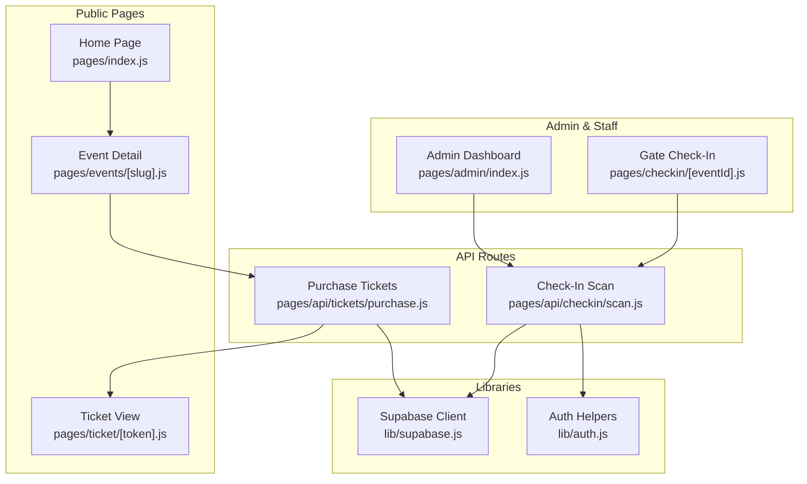
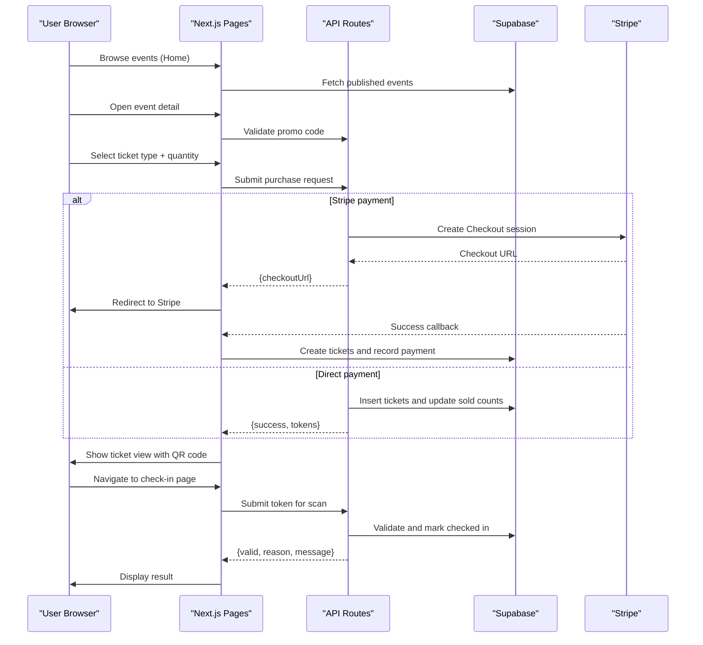
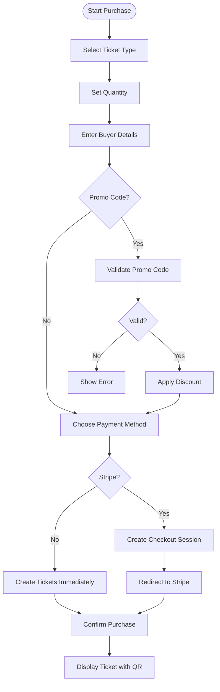
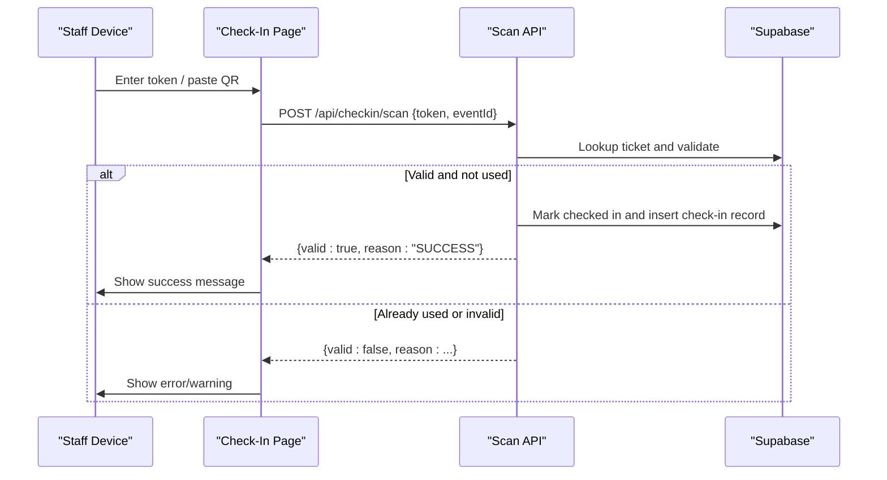
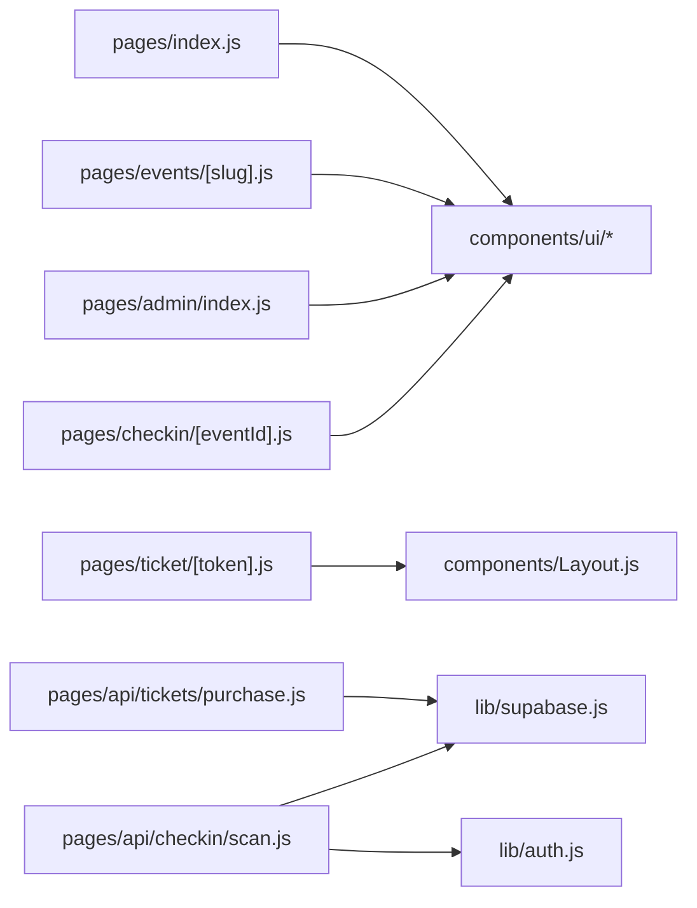

# End-to-End Testing

<cite>
**Referenced Files in This Document**
- [package.json](file://package.json)
- [pages/_app.js](file://pages/_app.js)
- [components/Layout.js](file://components/Layout.js)
- [pages/index.js](file://pages/index.js)
- [pages/events/[slug].js](file://pages/events/[slug].js)
- [pages/ticket/[token].js](file://pages/ticket/[token].js)
- [pages/admin/index.js](file://pages/admin/index.js)
- [pages/checkin/[eventId].js](file://pages/checkin/[eventId].js)
- [pages/api/tickets/purchase.js](file://pages/api/tickets/purchase.js)
- [pages/api/checkin/scan.js](file://pages/api/checkin/scan.js)
- [lib/supabase.js](file://lib/supabase.js)
- [lib/auth.js](file://lib/auth.js)
</cite>

## Table of Contents
1. [Introduction](#introduction)
2. [Project Structure](#project-structure)
3. [Core Components](#core-components)
4. [Architecture Overview](#architecture-overview)
5. [Detailed Component Analysis](#detailed-component-analysis)
6. [Dependency Analysis](#dependency-analysis)
7. [Performance Considerations](#performance-considerations)
8. [Troubleshooting Guide](#troubleshooting-guide)
9. [Conclusion](#conclusion)
10. [Appendices](#appendices)

## Introduction
This document provides end-to-end (E2E) testing guidance for TicketFlow using Cypress or Playwright. It covers the full user journey from browsing events to purchasing tickets and checking in at the gate, including multi-step interactions, form submissions, navigation flows, admin workflows, staff check-in processes, test data management, cross-browser compatibility, performance testing, visual regression testing, and continuous integration setup.

## Project Structure
TicketFlow is a Next.js application with public pages, an admin dashboard, a gate check-in interface, and API routes for ticket purchase and check-in. The E2E tests should target:
- Public event browsing and filtering on the home page
- Event detail page with ticket selection, promo code validation, and checkout
- Payment flow via Stripe Checkout or direct payment methods
- Ticket confirmation and QR code display
- Admin dashboard and quick actions
- Gate check-in scanning and manual search

**Diagram sources**
- [pages/index.js:1-753](file://pages/index.js#L1-L753)
- [pages/events/[slug].js](file://pages/events/[slug].js#L1-L800)
- [pages/ticket/[token].js](file://pages/ticket/[token].js#L1-L257)
- [pages/admin/index.js:1-585](file://pages/admin/index.js#L1-L585)
- [pages/checkin/[eventId].js](file://pages/checkin/[eventId].js#L1-L800)
- [pages/api/tickets/purchase.js:1-123](file://pages/api/tickets/purchase.js#L1-L123)
- [pages/api/checkin/scan.js:1-44](file://pages/api/checkin/scan.js#L1-L44)
- [lib/supabase.js:1-23](file://lib/supabase.js#L1-L23)
- [lib/auth.js:1-47](file://lib/auth.js#L1-L47)

**Section sources**
- [package.json:1-24](file://package.json#L1-L24)
- [pages/_app.js:1-14](file://pages/_app.js#L1-L14)
- [components/Layout.js:1-281](file://components/Layout.js#L1-L281)

## Core Components
Key UI components used across pages include Badge, Button, Card, Progress, CountdownTimer, StepIndicator, Toast, Input, Skeleton, and others. These are imported from the shared UI module and used extensively in the home page and event detail page.

- Shared UI components: [components/ui/*](file://components/ui/index.js)
- Layout wrapper and theme switching: [components/Layout.js:1-281](file://components/Layout.js#L1-L281)
- App-level providers: [pages/_app.js:1-14](file://pages/_app.js#L1-L14)

**Section sources**
- [components/Layout.js:1-281](file://components/Layout.js#L1-L281)
- [pages/_app.js:1-14](file://pages/_app.js#L1-L14)

## Architecture Overview
The E2E flows span multiple layers:
- Frontend pages orchestrate user interactions and state
- API routes handle business logic and database operations
- External services (Stripe) manage payments
- Supabase stores events, tickets, payments, and check-ins

**Diagram sources**
- [pages/index.js:1-753](file://pages/index.js#L1-L753)
- [pages/events/[slug].js](file://pages/events/[slug].js#L1-L800)
- [pages/api/tickets/purchase.js:1-123](file://pages/api/tickets/purchase.js#L1-L123)
- [pages/api/checkin/scan.js:1-44](file://pages/api/checkin/scan.js#L1-L44)
- [lib/supabase.js:1-23](file://lib/supabase.js#L1-L23)

## Detailed Component Analysis

### Public Event Browsing (Home Page)
- Search by event name, venue, date
- Category filters and tabs (trending, upcoming, all)
- Featured event section and stats
- Navigation to event details

E2E test scenarios:
- Verify search input filters results
- Click category buttons and assert filtered list
- Click trending/upcoming/all tabs and assert content changes
- Click featured event card and navigate to event detail

**Section sources**
- [pages/index.js:1-753](file://pages/index.js#L1-L753)

### Event Detail and Purchase Flow
- Multi-step checkout: select tickets, enter buyer details, apply promo code, choose payment method
- Validation for card number and phone formats
- Promo code validation via API
- Stripe Checkout redirect or immediate ticket creation for other methods

E2E test scenarios:
- Select a ticket type and adjust quantity
- Enter buyer details and validate required fields
- Apply valid promo code and assert discount applied
- For Stripe: submit purchase and assert redirect to checkout URL
- For non-Stripe: submit purchase and assert success response with tokens
- Navigate to ticket view and verify QR code and details

**Diagram sources**
- [pages/events/[slug].js](file://pages/events/[slug].js#L1-L800)
- [pages/api/tickets/purchase.js:1-123](file://pages/api/tickets/purchase.js#L1-L123)

**Section sources**
- [pages/events/[slug].js](file://pages/events/[slug].js#L1-L800)
- [pages/api/tickets/purchase.js:1-123](file://pages/api/tickets/purchase.js#L1-L123)

### Ticket View
- Displays QR code, token, barcode lines, and ticket details
- Copy link, print, and share options
- Status indicators (active, used)

E2E test scenarios:
- Assert QR code renders and contains correct URL
- Verify ticket details match purchased event and ticket type
- Test copy link button feedback
- Print dialog trigger

**Section sources**
- [pages/ticket/[token].js](file://pages/ticket/[token].js#L1-L257)

### Admin Dashboard
- Stats overview, quick actions, top performing events, recent activity
- Links to create event, reports, staff management, promo codes

E2E test scenarios:
- Load dashboard and assert stats loaded
- Click quick action cards and verify navigation
- Interact with event rows and navigate to event management

**Section sources**
- [pages/admin/index.js:1-585](file://pages/admin/index.js#L1-L585)

### Gate Check-In
- Tabs: scan, manual search, recent scans
- Token input and verification via API
- Search attendees by name/email/phone and check-in manually
- Real-time stats refresh

E2E test scenarios:
- Enter token and submit; assert success/error messages
- Search attendees and click check-in button; assert status change
- Verify stats update after successful scan

**Diagram sources**
- [pages/checkin/[eventId].js](file://pages/checkin/[eventId].js#L1-L800)
- [pages/api/checkin/scan.js:1-44](file://pages/api/checkin/scan.js#L1-L44)
- [lib/supabase.js:1-23](file://lib/supabase.js#L1-L23)
- [lib/auth.js:1-47](file://lib/auth.js#L1-L47)

**Section sources**
- [pages/checkin/[eventId].js](file://pages/checkin/[eventId].js#L1-L800)
- [pages/api/checkin/scan.js:1-44](file://pages/api/checkin/scan.js#L1-L44)

## Dependency Analysis
- Pages depend on shared UI components and layout wrappers
- API routes use Supabase client for data access and auth helpers for role checks
- Purchase flow integrates Stripe for secure payments
- Check-in flow enforces authentication and role requirements

**Diagram sources**
- [pages/index.js:1-753](file://pages/index.js#L1-L753)
- [pages/events/[slug].js](file://pages/events/[slug].js#L1-L800)
- [pages/ticket/[token].js](file://pages/ticket/[token].js#L1-L257)
- [pages/admin/index.js:1-585](file://pages/admin/index.js#L1-L585)
- [pages/checkin/[eventId].js](file://pages/checkin/[eventId].js#L1-L800)
- [pages/api/tickets/purchase.js:1-123](file://pages/api/tickets/purchase.js#L1-L123)
- [pages/api/checkin/scan.js:1-44](file://pages/api/checkin/scan.js#L1-L44)
- [lib/supabase.js:1-23](file://lib/supabase.js#L1-L23)
- [lib/auth.js:1-47](file://lib/auth.js#L1-L47)

**Section sources**
- [lib/supabase.js:1-23](file://lib/supabase.js#L1-L23)
- [lib/auth.js:1-47](file://lib/auth.js#L1-L47)

## Performance Considerations
- Use headless mode for CI runs to reduce overhead
- Mock external services (Stripe) where possible to avoid network latency
- Cache static assets and pre-render pages when feasible
- Avoid heavy animations during critical paths in tests
- Measure page load times and API response times with browser performance APIs

[No sources needed since this section provides general guidance]

## Troubleshooting Guide
Common issues and resolutions:
- Missing environment variables: Ensure Supabase URLs and keys are set for both client and service roles
- Authentication failures: Verify session cookies and roles for protected endpoints
- Stripe integration: Confirm secret key and checkout URL configuration
- Database constraints: Validate availability of tickets and correct event IDs

**Section sources**
- [lib/supabase.js:1-23](file://lib/supabase.js#L1-L23)
- [lib/auth.js:1-47](file://lib/auth.js#L1-L47)
- [pages/api/tickets/purchase.js:1-123](file://pages/api/tickets/purchase.js#L1-L123)
- [pages/api/checkin/scan.js:1-44](file://pages/api/checkin/scan.js#L1-L44)

## Conclusion
This guide outlines how to build robust E2E tests for TicketFlow covering public browsing, purchase, ticket viewing, admin workflows, and staff check-in. By leveraging Cypress or Playwright, you can automate multi-step interactions, validate forms and navigation, and ensure reliability across browsers and environments. Incorporate performance and visual regression testing into your CI pipeline for comprehensive coverage.

[No sources needed since this section summarizes without analyzing specific files]

## Appendices

### Test Data Management
- Seed events, ticket types, and users via Supabase before running tests
- Use unique identifiers for each test run to avoid conflicts
- Reset state between tests by clearing tickets and check-ins

### Cross-Browser Compatibility
- Run tests on Chrome, Firefox, Safari, and Edge
- Use consistent viewport sizes and device emulation
- Validate responsive layouts and touch interactions

### Continuous Integration Setup
- Install dependencies and build the app in CI
- Start local server or deploy to staging environment
- Execute tests with headless browsers and collect artifacts/screenshots
- Report failures and visualize results

### Visual Regression Testing
- Capture baseline screenshots for key pages
- Compare screenshots after changes and flag regressions
- Use tools like Percy or Playwright snapshot comparisons

### Performance Testing
- Record metrics for page load, API latency, and interaction times
- Set thresholds and fail builds if performance degrades
- Monitor memory usage and resource consumption

[No sources needed since this section provides general guidance]