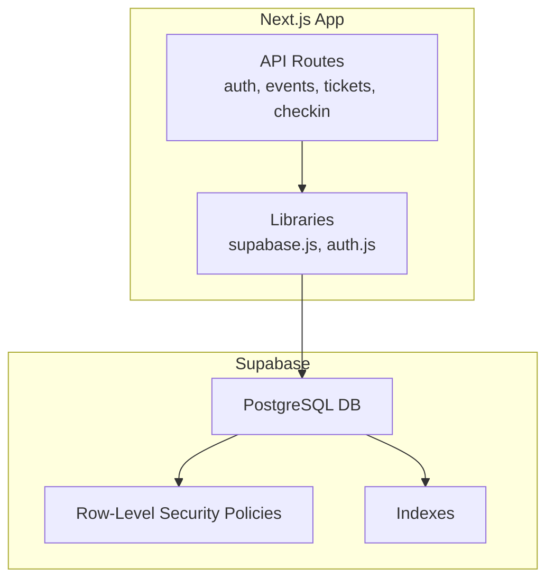
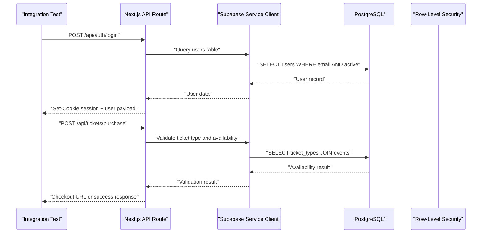
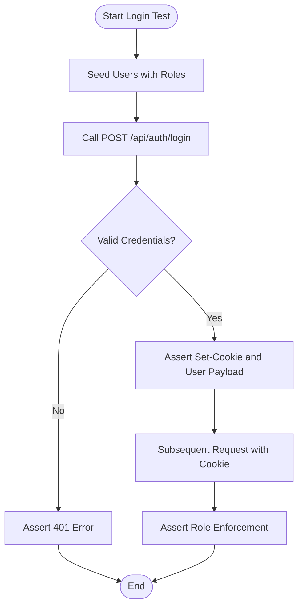
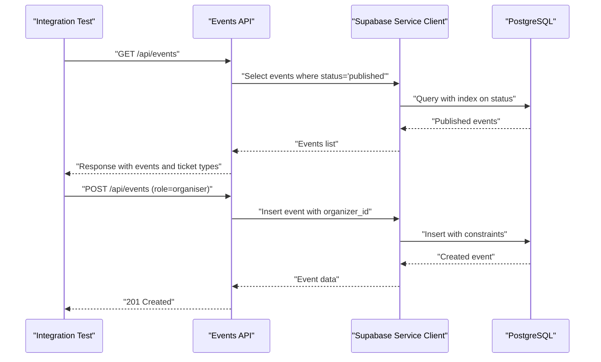
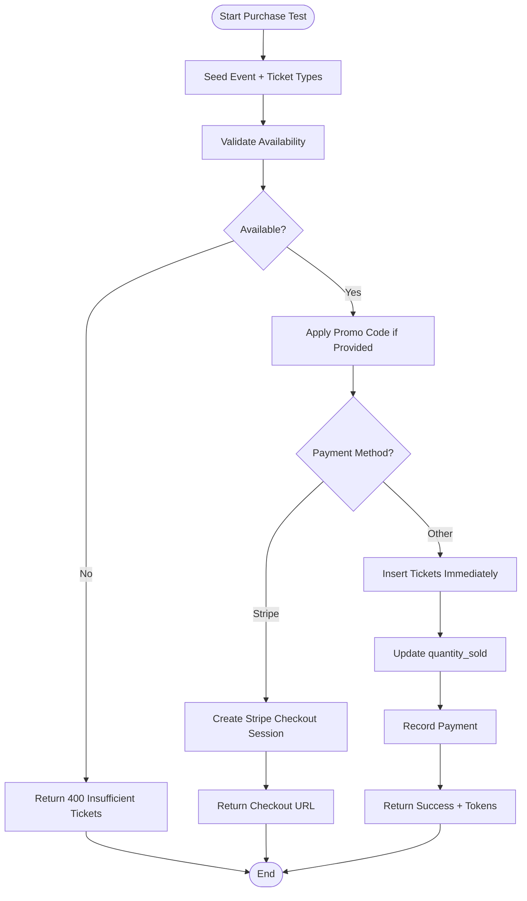
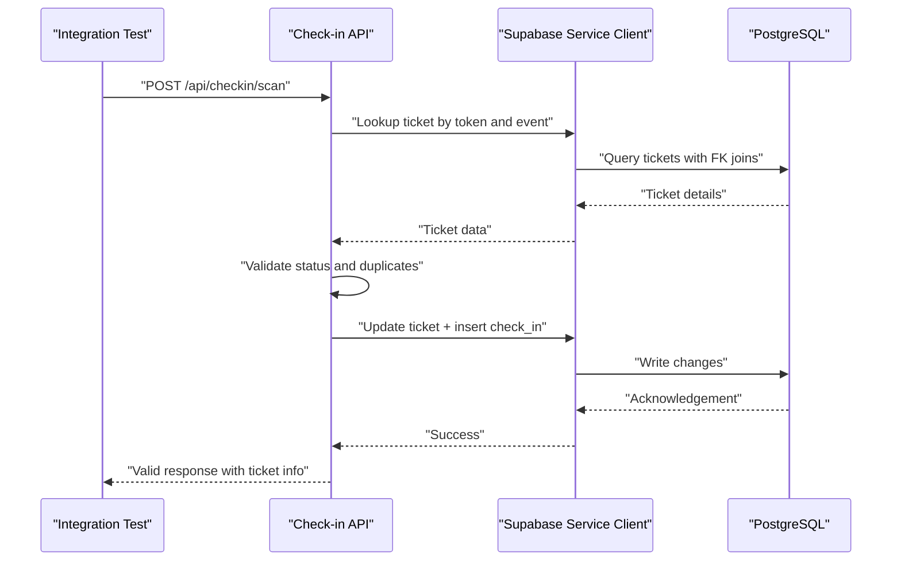
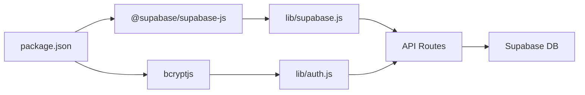

# Database Integration Testing

<cite>
**Referenced Files in This Document**
- [schema.sql](file://supabase/schema.sql)
- [supabase.js](file://lib/supabase.js)
- [auth.js](file://lib/auth.js)
- [login.js](file://pages/api/auth/login.js)
- [events_index.js](file://pages/api/events/index.js)
- [purchase.js](file://pages/api/tickets/purchase.js)
- [scan.js](file://pages/api/checkin/scan.js)
- [staff.js](file://pages/api/admin/staff.js)
- [package.json](file://package.json)
</cite>

## Table of Contents
1. [Introduction](#introduction)
2. [Project Structure](#project-structure)
3. [Core Components](#core-components)
4. [Architecture Overview](#architecture-overview)
5. [Detailed Component Analysis](#detailed-component-analysis)
6. [Dependency Analysis](#dependency-analysis)
7. [Performance Considerations](#performance-considerations)
8. [Troubleshooting Guide](#troubleshooting-guide)
9. [Conclusion](#conclusion)
10. [Appendices](#appendices)

## Introduction
This document provides a comprehensive guide to database integration testing for TicketFlow’s Supabase integration. It explains how to set up isolated test databases, create deterministic fixtures, and manage the lifecycle of test data across authentication flows, event CRUD operations, ticket purchase transactions, and check-in workflows. It also covers strategies for validating row-level security policies, enforcing database constraints, optimizing complex queries and joins, handling transaction rollbacks, cleaning up test data, and running migrations in test environments.

## Project Structure
TicketFlow is a Next.js application that uses Supabase as its database backend. The schema, client configuration, and API routes are organized as follows:
- Schema and RLS policies are defined in the SQL file under the supabase directory.
- Supabase clients (anonymous and service role) are configured in the lib layer.
- Authentication utilities and session token helpers live in the auth module.
- API routes implement business logic for authentication, events, tickets, and check-ins.

**Diagram sources**
- [schema.sql:1-166](file://supabase/schema.sql#L1-L166)
- [supabase.js:1-23](file://lib/supabase.js#L1-L23)
- [auth.js:1-47](file://lib/auth.js#L1-L47)
- [login.js:1-31](file://pages/api/auth/login.js#L1-L31)
- [events_index.js:1-42](file://pages/api/events/index.js#L1-L42)
- [purchase.js:1-123](file://pages/api/tickets/purchase.js#L1-L123)
- [scan.js:1-44](file://pages/api/checkin/scan.js#L1-L44)

**Section sources**
- [schema.sql:1-166](file://supabase/schema.sql#L1-L166)
- [supabase.js:1-23](file://lib/supabase.js#L1-L23)
- [auth.js:1-47](file://lib/auth.js#L1-L47)
- [login.js:1-31](file://pages/api/auth/login.js#L1-L31)
- [events_index.js:1-42](file://pages/api/events/index.js#L1-L42)
- [purchase.js:1-123](file://pages/api/tickets/purchase.js#L1-L123)
- [scan.js:1-44](file://pages/api/checkin/scan.js#L1-L44)

## Core Components
- Database schema and constraints:
  - Tables: users, events, ticket_types, tickets, check_ins, payments, promo_codes.
  - Constraints include unique keys, foreign keys, CHECK constraints, and default values.
  - Row-Level Security (RLS) is enabled on all tables with specific policies.
  - Indexes optimize lookups by slug, status, qr_code_token, buyer_email, event_id, and more.
- Supabase clients:
  - Anonymous client for browser usage.
  - Service role client for server-side privileged operations via environment variables.
- Authentication:
  - Password hashing and verification using bcrypt.
  - Session tokens stored in cookies; role-based access control enforced in API routes.
- API endpoints:
  - Authentication login flow returns a session cookie and user payload.
  - Events CRUD supports listing published events and creating/updating/deleting events with role checks.
  - Ticket purchases validate availability, apply promo codes, integrate Stripe for checkout, or create tickets immediately for other payment methods.
  - Check-in scanning validates tickets, prevents duplicate scans, and records check-in events.

**Section sources**
- [schema.sql:10-117](file://supabase/schema.sql#L10-L117)
- [schema.sql:120-154](file://supabase/schema.sql#L120-L154)
- [supabase.js:1-23](file://lib/supabase.js#L1-L23)
- [auth.js:1-47](file://lib/auth.js#L1-L47)
- [login.js:1-31](file://pages/api/auth/login.js#L1-L31)
- [events_index.js:1-42](file://pages/api/events/index.js#L1-L42)
- [purchase.js:1-123](file://pages/api/tickets/purchase.js#L1-L123)
- [scan.js:1-44](file://pages/api/checkin/scan.js#L1-L44)

## Architecture Overview
The integration testing architecture centers around isolated Supabase instances per test run, deterministic fixtures, and controlled API interactions through the service role client where necessary. Tests should exercise both authenticated and unauthenticated paths, enforce RLS behavior, and validate constraints and indexes.

**Diagram sources**
- [login.js:1-31](file://pages/api/auth/login.js#L1-L31)
- [purchase.js:1-123](file://pages/api/tickets/purchase.js#L1-L123)
- [supabase.js:1-23](file://lib/supabase.js#L1-L23)
- [schema.sql:10-117](file://supabase/schema.sql#L10-L117)

## Detailed Component Analysis

### Authentication Flow Testing
- Objectives:
  - Validate successful login with correct credentials and inactive user rejection.
  - Ensure session cookie is set and subsequent requests carry valid session context.
  - Confirm role-based authorization in protected endpoints.
- Strategy:
  - Create test users with known roles and password hashes.
  - Call the login endpoint and assert cookie presence and user payload.
  - Use the session cookie in subsequent requests to verify requireRole enforcement.
- Data setup:
  - Insert users with different roles and active flags.
  - Optionally seed a super admin for admin-only tests.

**Diagram sources**
- [login.js:1-31](file://pages/api/auth/login.js#L1-L31)
- [auth.js:1-47](file://lib/auth.js#L1-L47)
- [schema.sql:10-19](file://supabase/schema.sql#L10-L19)

**Section sources**
- [login.js:1-31](file://pages/api/auth/login.js#L1-L31)
- [auth.js:1-47](file://lib/auth.js#L1-L47)
- [schema.sql:10-19](file://supabase/schema.sql#L10-L19)

### Event CRUD Operations Testing
- Objectives:
  - Verify public read access to published events.
  - Validate creation, update, and deletion with role checks.
  - Ensure slug normalization and constraint enforcement.
- Strategy:
  - Create events with various statuses and assert visibility based on RLS policies.
  - Perform CRUD operations with appropriate roles and assert responses.
  - Validate unique constraints on slugs and foreign key relationships.

**Diagram sources**
- [events_index.js:1-42](file://pages/api/events/index.js#L1-L42)
- [schema.sql:24-40](file://supabase/schema.sql#L24-L40)
- [schema.sql:147-154](file://supabase/schema.sql#L147-L154)

**Section sources**
- [events_index.js:1-42](file://pages/api/events/index.js#L1-L42)
- [schema.sql:24-40](file://supabase/schema.sql#L24-L40)
- [schema.sql:147-154](file://supabase/schema.sql#L147-L154)

### Ticket Purchase Transactions Testing
- Objectives:
  - Validate ticket availability checks and quantity limits.
  - Test promo code application and usage counters.
  - Cover Stripe checkout flow and immediate ticket creation for other payment methods.
  - Ensure payment records are created and ticket counts updated atomically.
- Strategy:
  - Seed events and ticket types with known capacities and prices.
  - Execute purchase requests with varying quantities and promo codes.
  - Assert inventory updates, payment records, and returned tokens.
  - For Stripe, assert checkout session creation and metadata correctness.

**Diagram sources**
- [purchase.js:1-123](file://pages/api/tickets/purchase.js#L1-L123)
- [schema.sql:45-73](file://supabase/schema.sql#L45-L73)
- [schema.sql:89-117](file://supabase/schema.sql#L89-L117)

**Section sources**
- [purchase.js:1-123](file://pages/api/tickets/purchase.js#L1-L123)
- [schema.sql:45-73](file://supabase/schema.sql#L45-L73)
- [schema.sql:89-117](file://supabase/schema.sql#L89-L117)

### Check-in Scanning Testing
- Objectives:
  - Validate ticket existence and event association.
  - Prevent duplicate check-ins and handle cancelled/refunded states.
  - Record check-in events and update ticket status.
- Strategy:
  - Create tickets with known tokens and associate them with events.
  - Attempt check-in with valid and invalid scenarios.
  - Assert ticket state transitions and check-in records.

**Diagram sources**
- [scan.js:1-44](file://pages/api/checkin/scan.js#L1-L44)
- [schema.sql:59-86](file://supabase/schema.sql#L59-L86)

**Section sources**
- [scan.js:1-44](file://pages/api/checkin/scan.js#L1-L44)
- [schema.sql:59-86](file://supabase/schema.sql#L59-L86)

### Admin Staff Management Testing
- Objectives:
  - Validate staff listing and creation with role checks.
  - Ensure password hashing and user insertion.
- Strategy:
  - Authenticate as super_admin or organiser.
  - Create gate_staff users and assert hashed passwords and fields.
  - List staff filtered by role and order.

**Section sources**
- [staff.js:1-28](file://pages/api/admin/staff.js#L1-L28)
- [auth.js:1-47](file://lib/auth.js#L1-L47)
- [schema.sql:10-19](file://supabase/schema.sql#L10-L19)

## Dependency Analysis
Key dependencies and their roles in integration testing:
- Supabase client configuration:
  - Environment variables drive connection and privileges.
  - Service role client bypasses RLS for administrative operations in tests.
- Authentication utilities:
  - Password hashing and session token parsing are critical for consistent test setup.
- API routes:
  - Each route depends on Supabase clients and auth middleware for authorization.

**Diagram sources**
- [package.json:1-24](file://package.json#L1-L24)
- [supabase.js:1-23](file://lib/supabase.js#L1-L23)
- [auth.js:1-47](file://lib/auth.js#L1-L47)

**Section sources**
- [package.json:1-24](file://package.json#L1-L24)
- [supabase.js:1-23](file://lib/supabase.js#L1-L23)
- [auth.js:1-47](file://lib/auth.js#L1-L47)

## Performance Considerations
- Index usage:
  - Queries on events.slug, events.status, tickets.qr_code_token, tickets.buyer_email, tickets.event_id, check_ins.event_id, and payments.ticket_id benefit from existing indexes.
- Join complexity:
  - Events listing includes ticket_types joins; ensure joins are selective and use indexed columns.
- Transactional integrity:
  - For purchase flows, consider wrapping multi-step updates in database transactions to prevent partial state changes.
- Query optimization:
  - Prefer single-row selects with explicit filters to avoid full table scans.
  - Use pagination for large lists of events or tickets.

[No sources needed since this section provides general guidance]

## Troubleshooting Guide
Common issues and resolutions:
- Missing environment variables:
  - Ensure NEXT_PUBLIC_SUPABASE_URL, NEXT_PUBLIC_SUPABASE_ANON_KEY, and SUPABASE_SERVICE_ROLE_KEY are set for tests.
- RLS policy violations:
  - When using anonymous client in tests, confirm policies allow expected reads/writes; prefer service role client for privileged operations.
- Constraint failures:
  - Unique constraints on emails and slugs can cause insert errors; seed unique test data.
- Duplicate check-ins:
  - Validate ticket.is_checked_in before marking checked in; assert error responses for duplicates.
- Payment method differences:
  - Stripe flow returns a checkout URL; other methods create tickets immediately; assert correct branches in tests.

**Section sources**
- [supabase.js:1-23](file://lib/supabase.js#L1-L23)
- [schema.sql:120-154](file://supabase/schema.sql#L120-L154)
- [scan.js:1-44](file://pages/api/checkin/scan.js#L1-L44)
- [purchase.js:1-123](file://pages/api/tickets/purchase.js#L1-L123)

## Conclusion
Effective integration testing for TicketFlow’s Supabase integration requires isolated test databases, deterministic fixtures, and careful handling of authentication, RLS policies, and constraints. By leveraging the service role client for privileged operations and structuring tests around API endpoints, you can validate complex workflows such as ticket purchases and check-ins while ensuring performance and correctness.

[No sources needed since this section summarizes without analyzing specific files]

## Appendices

### Test Database Setup
- Provision a dedicated Supabase project or instance for tests.
- Run the schema migration to create tables, constraints, indexes, and RLS policies.
- Configure environment variables for test clients.

**Section sources**
- [schema.sql:1-166](file://supabase/schema.sql#L1-L166)
- [supabase.js:1-23](file://lib/supabase.js#L1-L23)

### Fixture Creation Strategies
- Seed users with known roles and hashed passwords.
- Create events with varied statuses and capacities.
- Define ticket types with prices and available quantities.
- Generate promo codes with expiration and usage limits.

**Section sources**
- [schema.sql:10-117](file://supabase/schema.sql#L10-L117)
- [auth.js:1-47](file://lib/auth.js#L1-L47)

### Test Data Lifecycle Management
- Begin each test with a clean state or transactional snapshot.
- Roll back changes after assertions to maintain isolation.
- Clean up any residual data post-test to prevent cross-test interference.

[No sources needed since this section provides general guidance]

### Handling Migrations in Test Environments
- Apply schema migrations at test suite initialization.
- Re-run migrations when schema changes occur.
- Validate that RLS policies and indexes are present.

**Section sources**
- [schema.sql:120-154](file://supabase/schema.sql#L120-L154)

### Testing Complex Queries and Joins
- Validate events listing with ticket_types join.
- Assert check-in scanning queries that join tickets, ticket_types, and events.
- Measure query performance using explain plans where possible.

**Section sources**
- [events_index.js:1-42](file://pages/api/events/index.js#L1-L42)
- [scan.js:1-44](file://pages/api/checkin/scan.js#L1-L44)
- [schema.sql:147-154](file://supabase/schema.sql#L147-L154)