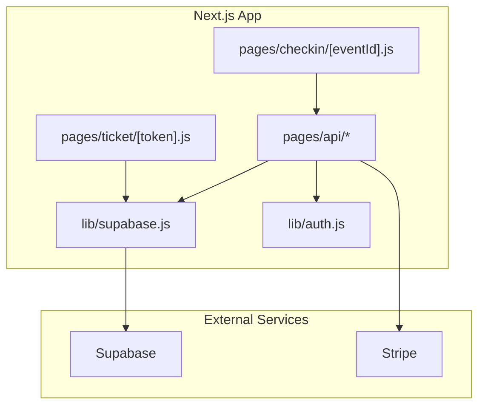
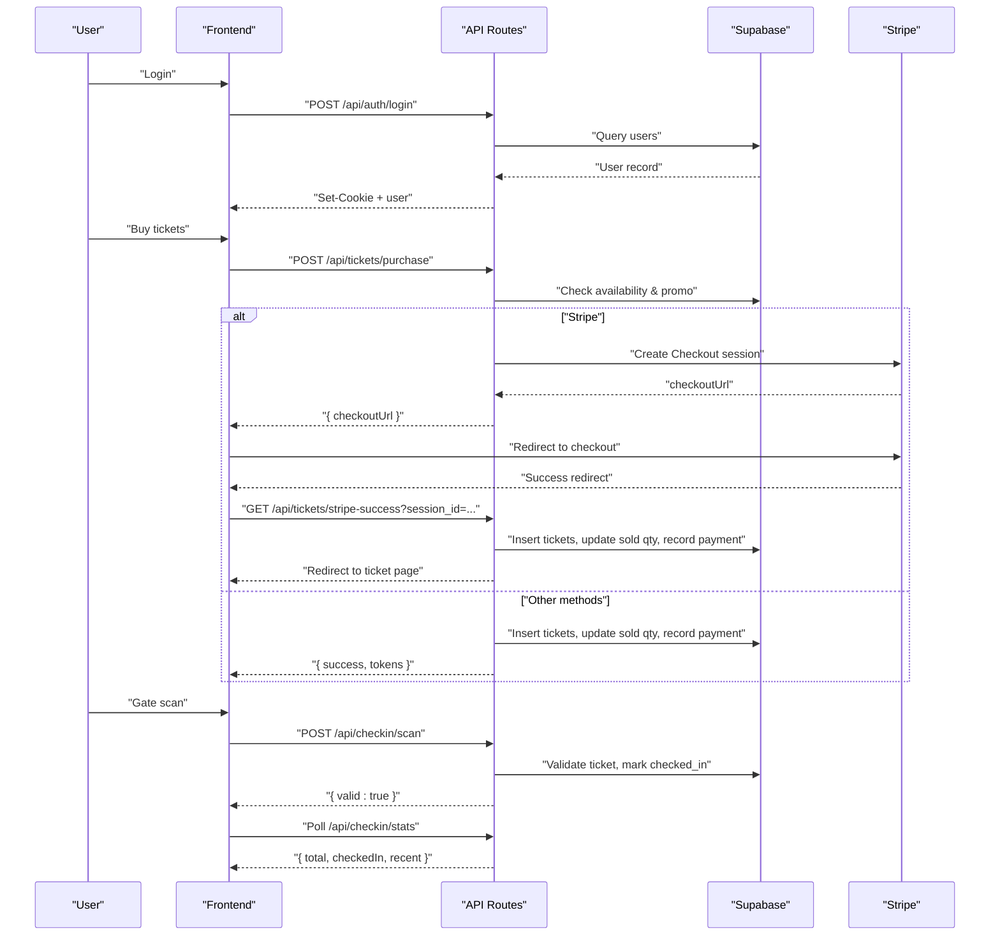
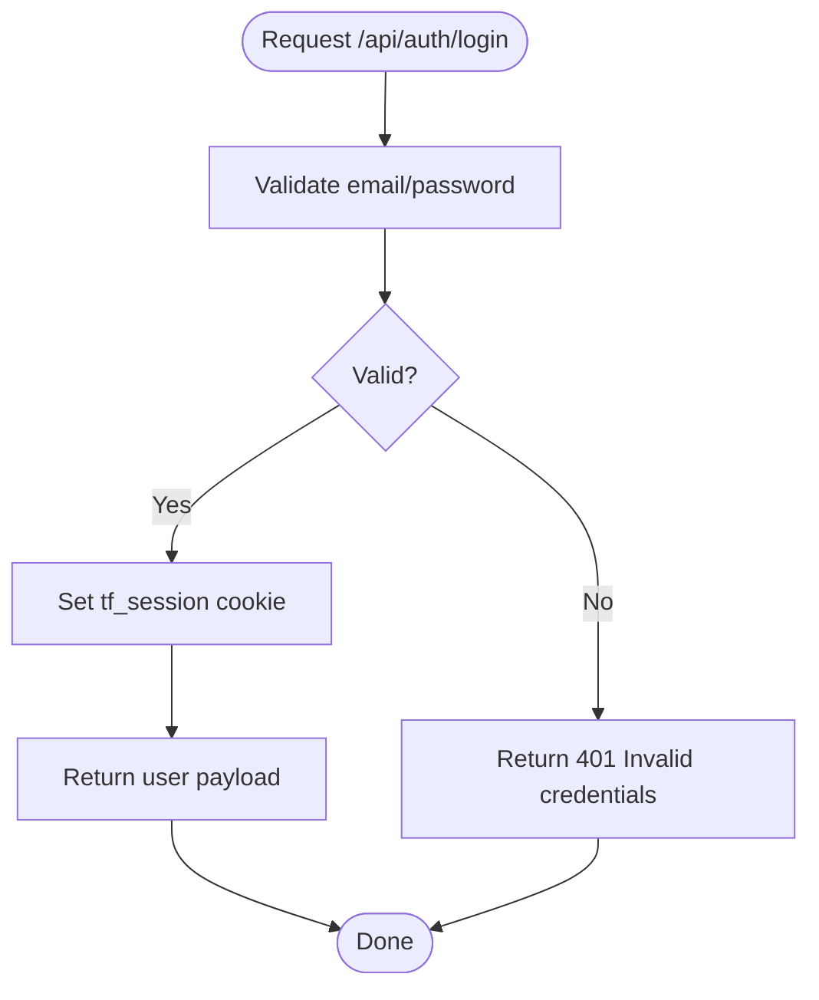
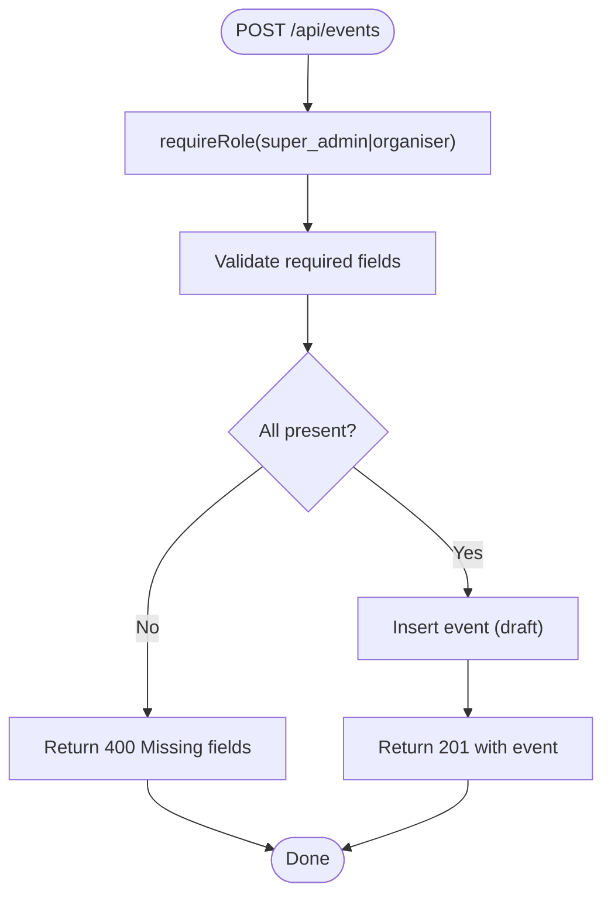
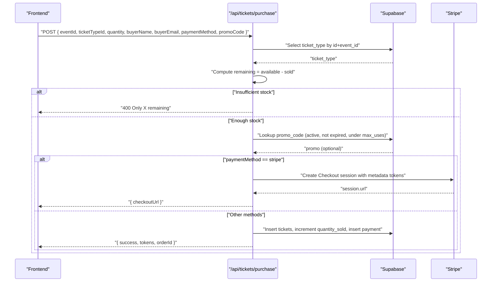
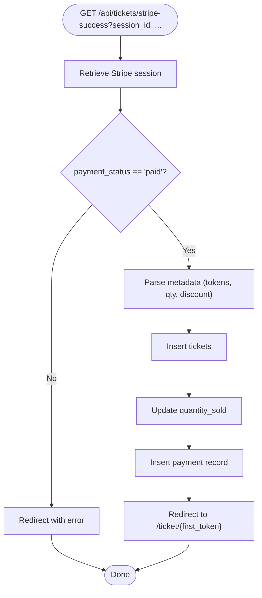
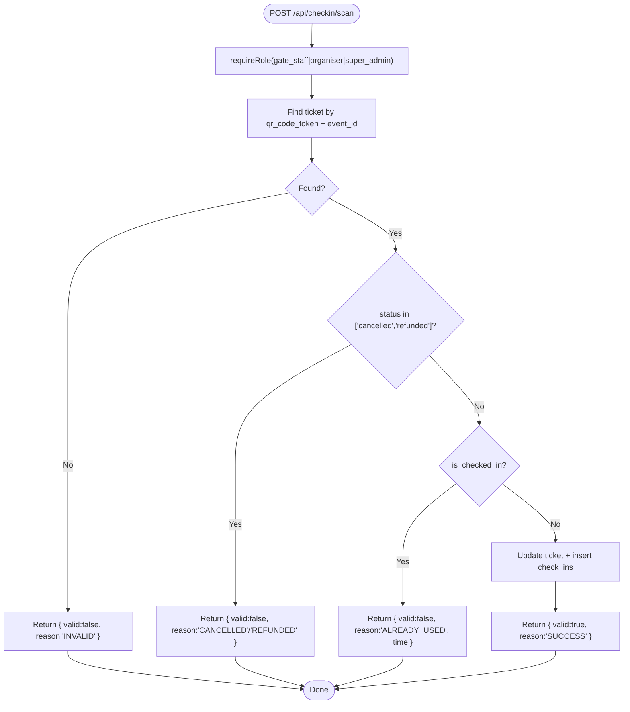
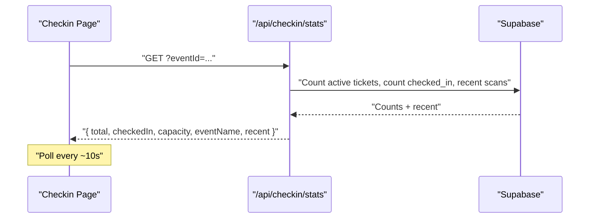
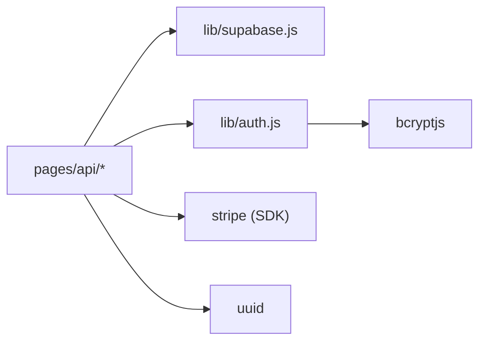
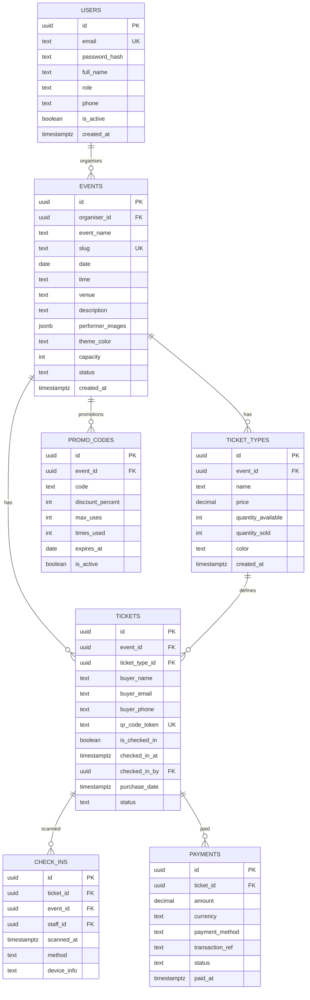

# End-to-End Workflow Testing

<cite>
**Referenced Files in This Document**
- [pages/api/auth/login.js](file://pages/api/auth/login.js)
- [lib/auth.js](file://lib/auth.js)
- [pages/api/events/index.js](file://pages/api/events/index.js)
- [pages/api/tickets/purchase.js](file://pages/api/tickets/purchase.js)
- [pages/api/tickets/stripe-success.js](file://pages/api/tickets/stripe-success.js)
- [pages/api/checkin/scan.js](file://pages/api/checkin/scan.js)
- [pages/api/checkin/stats.js](file://pages/api/checkin/stats.js)
- [pages/api/admin/attendees.js](file://pages/api/admin/attendees.js)
- [pages/api/promo/validate.js](file://pages/api/promo/validate.js)
- [lib/supabase.js](file://lib/supabase.js)
- [supabase/schema.sql](file://supabase/schema.sql)
- [pages/checkin/[eventId].js](file://pages/checkin/[eventId].js)
- [pages/ticket/[token].js](file://pages/ticket/[token].js)
- [package.json](file://package.json)
</cite>

## Table of Contents
1. Introduction
2. Project Structure
3. Core Components
4. Architecture Overview
5. Detailed Component Analysis
6. Dependency Analysis
7. Performance Considerations
8. Troubleshooting Guide
9. Conclusion
10. Appendices

## Introduction
This document provides end-to-end workflow testing guidance for TicketFlow’s critical user journeys: event creation, ticket purchase (including Stripe checkout), and check-in validation. It explains how to simulate multi-step interactions across API endpoints, test authentication-dependent flows, handle concurrent users, validate real-time updates at the gate, and cover edge cases such as race conditions, inventory conflicts, and service degradation. It also addresses asynchronous operations, email notifications, and third-party integrations in realistic scenarios.

## Project Structure
TicketFlow is a Next.js application with serverless API routes under pages/api, a Supabase-backed data layer, and UI pages for admin, check-in, and ticket display. The database schema defines core entities: users, events, ticket_types, tickets, check_ins, payments, and promo_codes.

**Diagram sources**
- [lib/supabase.js:1-23](file://lib/supabase.js#L1-L23)
- [lib/auth.js:1-47](file://lib/auth.js#L1-L47)
- [pages/checkin/[eventId].js](file://pages/checkin/[eventId].js#L1-L800)
- [pages/ticket/[token].js](file://pages/ticket/[token].js#L1-L257)

**Section sources**
- [package.json:1-24](file://package.json#L1-L24)
- [supabase/schema.sql:1-166](file://supabase/schema.sql#L1-L166)

## Core Components
- Authentication: Login sets an HttpOnly session cookie; role-based middleware protects endpoints.
- Event Creation: Admin-only POST creates events in draft status.
- Ticket Purchase: Validates availability, applies promo codes, integrates Stripe or creates tickets immediately for other methods.
- Check-in: Validates token, prevents reuse, records scan, and updates stats.
- Real-time Stats: Polling endpoint aggregates counts and recent scans.

Key responsibilities and entry points are implemented in the following files:
- Authentication and roles: [lib/auth.js:1-47](file://lib/auth.js#L1-L47), [pages/api/auth/login.js:1-31](file://pages/api/auth/login.js#L1-L31)
- Events: [pages/api/events/index.js:1-42](file://pages/api/events/index.js#L1-L42)
- Tickets: [pages/api/tickets/purchase.js:1-123](file://pages/api/tickets/purchase.js#L1-L123), [pages/api/tickets/stripe-success.js:1-55](file://pages/api/tickets/stripe-success.js#L1-L55)
- Check-in: [pages/api/checkin/scan.js:1-44](file://pages/api/checkin/scan.js#L1-L44), [pages/api/checkin/stats.js:1-31](file://pages/api/checkin/stats.js#L1-L31)
- Admin attendees search: [pages/api/admin/attendees.js:1-29](file://pages/api/admin/attendees.js#L1-L29)
- Promo validation: [pages/api/promo/validate.js:1-27](file://pages/api/promo/validate.js#L1-L27)
- Data client: [lib/supabase.js:1-23](file://lib/supabase.js#L1-L23)

**Section sources**
- [lib/auth.js:1-47](file://lib/auth.js#L1-L47)
- [pages/api/auth/login.js:1-31](file://pages/api/auth/login.js#L1-L31)
- [pages/api/events/index.js:1-42](file://pages/api/events/index.js#L1-L42)
- [pages/api/tickets/purchase.js:1-123](file://pages/api/tickets/purchase.js#L1-L123)
- [pages/api/tickets/stripe-success.js:1-55](file://pages/api/tickets/stripe-success.js#L1-L55)
- [pages/api/checkin/scan.js:1-44](file://pages/api/checkin/scan.js#L1-L44)
- [pages/api/checkin/stats.js:1-31](file://pages/api/checkin/stats.js#L1-L31)
- [pages/api/admin/attendees.js:1-29](file://pages/api/admin/attendees.js#L1-L29)
- [pages/api/promo/validate.js:1-27](file://pages/api/promo/validate.js#L1-L27)
- [lib/supabase.js:1-23](file://lib/supabase.js#L1-L23)

## Architecture Overview
The system follows a typical serverless API architecture:
- Client calls API routes that enforce auth and business rules.
- API routes use a Supabase service client to read/write data.
- External services (Stripe) are invoked for payment flows.
- Gate staff UI polls stats and triggers check-ins.

**Diagram sources**
- [pages/api/auth/login.js:1-31](file://pages/api/auth/login.js#L1-L31)
- [pages/api/tickets/purchase.js:1-123](file://pages/api/tickets/purchase.js#L1-L123)
- [pages/api/tickets/stripe-success.js:1-55](file://pages/api/tickets/stripe-success.js#L1-L55)
- [pages/api/checkin/scan.js:1-44](file://pages/api/checkin/scan.js#L1-L44)
- [pages/api/checkin/stats.js:1-31](file://pages/api/checkin/stats.js#L1-L31)

## Detailed Component Analysis

### Authentication Flow
- Login validates credentials, sets an HttpOnly session cookie, and returns user metadata.
- Role enforcement uses a shared utility to parse cookies and require specific roles.

Testing strategy:
- Validate successful login with correct credentials and role propagation.
- Verify cookie attributes (Path=/, HttpOnly, SameSite=Lax, Max-Age).
- Test invalid credentials and inactive accounts.
- Confirm protected endpoints reject unauthenticated requests and unauthorized roles.

**Diagram sources**
- [pages/api/auth/login.js:1-31](file://pages/api/auth/login.js#L1-L31)
- [lib/auth.js:1-47](file://lib/auth.js#L1-L47)

**Section sources**
- [pages/api/auth/login.js:1-31](file://pages/api/auth/login.js#L1-L31)
- [lib/auth.js:1-47](file://lib/auth.js#L1-L47)

### Event Creation Workflow
- Requires super_admin or organiser role.
- Creates event in draft status with normalized slug and defaults.

Testing strategy:
- Create event with minimal required fields and verify response and DB state.
- Test missing fields return 400.
- Ensure slug normalization and default theme color/capacity behavior.
- Validate role gating by attempting with insufficient roles.

**Diagram sources**
- [pages/api/events/index.js:1-42](file://pages/api/events/index.js#L1-L42)
- [lib/auth.js:1-47](file://lib/auth.js#L1-L47)

**Section sources**
- [pages/api/events/index.js:1-42](file://pages/api/events/index.js#L1-L42)

### Ticket Purchase Workflow
- Validates ticket type and availability.
- Applies promo code if provided and within limits/expiry.
- For Stripe: creates a Checkout session with pre-generated tokens embedded in metadata.
- For other methods: inserts tickets immediately, increments quantity_sold, records payment.

Testing strategy:
- Inventory checks: request more than available, expect error.
- Promo code flow: valid active promo reduces price and increments times_used; expired or exhausted codes rejected.
- Stripe path: verify checkout URL returned; simulate success callback to ensure tickets created and payment recorded.
- Non-Stripe path: verify immediate ticket creation and payment status logic.

**Diagram sources**
- [pages/api/tickets/purchase.js:1-123](file://pages/api/tickets/purchase.js#L1-L123)
- [pages/api/promo/validate.js:1-27](file://pages/api/promo/validate.js#L1-L27)

**Section sources**
- [pages/api/tickets/purchase.js:1-123](file://pages/api/tickets/purchase.js#L1-L123)
- [pages/api/promo/validate.js:1-27](file://pages/api/promo/validate.js#L1-L27)

### Stripe Success Callback
- Retrieves Stripe session, verifies paid status.
- Parses metadata to create tickets, update sold quantities, and record payment.
- Redirects to first ticket page.

Testing strategy:
- Simulate success callback with valid session_id and paid status.
- Verify tickets inserted, quantity_sold incremented, and payment recorded.
- Handle invalid session_id and non-paid states gracefully.

**Diagram sources**
- [pages/api/tickets/stripe-success.js:1-55](file://pages/api/tickets/stripe-success.js#L1-L55)

**Section sources**
- [pages/api/tickets/stripe-success.js:1-55](file://pages/api/tickets/stripe-success.js#L1-L55)

### Check-in Validation Sequence
- Requires authenticated staff role.
- Validates token against event, rejects cancelled/refunded/already used.
- Marks ticket as checked_in, records check-in, returns success details.

Testing strategy:
- Successful scan: verify response includes buyer info and success message.
- Already used: ensure timestamp and reason returned.
- Invalid token or wrong event: ensure INVALID reason.
- Concurrent scans: assert only one succeeds and subsequent attempts report ALREADY_USED.

**Diagram sources**
- [pages/api/checkin/scan.js:1-44](file://pages/api/checkin/scan.js#L1-L44)

**Section sources**
- [pages/api/checkin/scan.js:1-44](file://pages/api/checkin/scan.js#L1-L44)

### Gate Staff UI and Real-time Stats
- Polls /api/checkin/stats every few seconds to refresh totals and recent scans.
- Supports scanning via camera or manual input; triggers scan API and updates UI.

Testing strategy:
- Verify stats aggregation: total tickets, checked-in count, capacity, recent scans.
- Confirm polling frequency and UI updates after successful scan.
- Validate search functionality for attendees by name/email/phone/token.

**Diagram sources**
- [pages/checkin/[eventId].js](file://pages/checkin/[eventId].js#L1-L800)
- [pages/api/checkin/stats.js:1-31](file://pages/api/checkin/stats.js#L1-L31)

**Section sources**
- [pages/checkin/[eventId].js](file://pages/checkin/[eventId].js#L1-L800)
- [pages/api/checkin/stats.js:1-31](file://pages/api/checkin/stats.js#L1-L31)

### Attendee Search (Admin)
- Requires appropriate role and eventId; supports fuzzy search across multiple fields.

Testing strategy:
- Validate role gating and query parameters.
- Test search patterns and result ordering.
- Ensure empty results handled gracefully.

**Section sources**
- [pages/api/admin/attendees.js:1-29](file://pages/api/admin/attendees.js#L1-L29)

### Ticket Display Page
- Server-side props fetch ticket by token and related event/ticket type.
- Renders QR code and ticket details; handles not found/server errors.

Testing strategy:
- Verify SSR data fetching and rendering for valid tokens.
- Confirm error handling for missing tokens and server errors.
- Validate generated QR value and share links.

**Section sources**
- [pages/ticket/[token].js](file://pages/ticket/[token].js#L1-L257)

## Dependency Analysis
Key dependencies and integration points:
- Supabase client for all data operations.
- Stripe SDK for checkout sessions and payment verification.
- bcryptjs for password hashing and verification.
- UUID generation for ticket tokens.

**Diagram sources**
- [lib/supabase.js:1-23](file://lib/supabase.js#L1-L23)
- [lib/auth.js:1-47](file://lib/auth.js#L1-L47)
- [package.json:1-24](file://package.json#L1-L24)

**Section sources**
- [lib/supabase.js:1-23](file://lib/supabase.js#L1-L23)
- [lib/auth.js:1-47](file://lib/auth.js#L1-L47)
- [package.json:1-24](file://package.json#L1-L24)

## Performance Considerations
- Use Supabase service role client in API routes to bypass RLS where necessary and reduce overhead.
- Batch operations where possible (e.g., inserting multiple tickets in one call).
- Avoid unnecessary re-renders on the gate UI; debounce or throttle polling if needed.
- Index usage: ensure queries leverage indexes defined in schema (e.g., qr_code_token, event_id).

[No sources needed since this section provides general guidance]

## Troubleshooting Guide
Common issues and diagnostics:
- Authentication failures: verify cookie presence and expiration; ensure role matches required roles.
- Payment failures: inspect Stripe session retrieval and payment_status; confirm environment variables for keys.
- Inventory conflicts: check quantity_available vs quantity_sold; ensure atomic updates and proper error responses.
- Check-in anomalies: review ticket status transitions and duplicate scan prevention.

Relevant implementation references:
- Auth utilities and session parsing: [lib/auth.js:1-47](file://lib/auth.js#L1-L47)
- Login handler: [pages/api/auth/login.js:1-31](file://pages/api/auth/login.js#L1-L31)
- Ticket purchase error paths: [pages/api/tickets/purchase.js:1-123](file://pages/api/tickets/purchase.js#L1-L123)
- Stripe success error handling: [pages/api/tickets/stripe-success.js:1-55](file://pages/api/tickets/stripe-success.js#L1-L55)
- Check-in validation and error responses: [pages/api/checkin/scan.js:1-44](file://pages/api/checkin/scan.js#L1-L44)

**Section sources**
- [lib/auth.js:1-47](file://lib/auth.js#L1-L47)
- [pages/api/auth/login.js:1-31](file://pages/api/auth/login.js#L1-L31)
- [pages/api/tickets/purchase.js:1-123](file://pages/api/tickets/purchase.js#L1-L123)
- [pages/api/tickets/stripe-success.js:1-55](file://pages/api/tickets/stripe-success.js#L1-L55)
- [pages/api/checkin/scan.js:1-44](file://pages/api/checkin/scan.js#L1-L44)

## Conclusion
This guide outlines robust end-to-end testing strategies for TicketFlow’s core workflows. By simulating complete user journeys across authentication, event creation, ticket purchases (Stripe and alternative methods), and check-in validation, testers can uncover issues related to concurrency, inventory integrity, and external integrations. Incorporating realistic edge cases and monitoring real-time updates ensures reliability under production-like conditions.

[No sources needed since this section summarizes without analyzing specific files]

## Appendices

### Database Schema Overview
Core tables and relationships relevant to workflows:
- users: authentication and roles
- events: event metadata and status
- ticket_types: pricing and availability
- tickets: individual tickets with QR tokens and check-in state
- check_ins: audit trail of scans
- payments: transaction records
- promo_codes: discounts and usage limits

**Diagram sources**
- [supabase/schema.sql:1-166](file://supabase/schema.sql#L1-L166)

**Section sources**
- [supabase/schema.sql:1-166](file://supabase/schema.sql#L1-L166)

### End-to-End Test Scenarios

#### Scenario 1: Complete Event Creation and Publication
- Steps:
  - Authenticate as organiser/super_admin.
  - Create event via POST /api/events with required fields.
  - Publish event (if applicable through admin UI or additional endpoint).
  - Verify event appears in public listing.
- Edge cases:
  - Duplicate slugs, missing fields, unauthorized roles.

#### Scenario 2: Ticket Purchase with Stripe
- Steps:
  - Authenticate user (optional depending on flow).
  - Call POST /api/tickets/purchase with paymentMethod='stripe'.
  - Redirect to Stripe checkout; simulate success callback.
  - Verify tickets created, quantity_sold updated, payment recorded.
  - Access /ticket/{token} to view ticket.
- Edge cases:
  - Insufficient stock, expired promo, failed payment, invalid session_id.

#### Scenario 3: Ticket Purchase with Alternative Payment Method
- Steps:
  - Call POST /api/tickets/purchase with paymentMethod != 'stripe'.
  - Verify immediate ticket creation and payment status logic.
- Edge cases:
  - Partial failures, incorrect buyer info, promo misuse.

#### Scenario 4: Check-in Validation and Real-time Updates
- Steps:
  - Authenticate gate staff.
  - Scan ticket via POST /api/checkin/scan.
  - Poll GET /api/checkin/stats to confirm updated counts and recent scans.
- Edge cases:
  - Already used, cancelled/refunded tickets, wrong event, concurrent scans.

#### Scenario 5: Promo Code Validation and Application
- Steps:
  - Validate promo via POST /api/promo/validate.
  - Apply discount during purchase and verify times_used increment.
- Edge cases:
  - Expired codes, exceeded max_uses, inactive codes.

#### Scenario 6: Concurrent User Scenarios
- Steps:
  - Simulate multiple simultaneous purchase requests for limited stock.
  - Assert only allowed quantity succeeds; others receive appropriate errors.
  - Validate no double-check-in occurs under concurrent scans.
- Tools:
  - Load testing tools (e.g., k6, Artillery) to generate concurrent requests.

#### Scenario 7: Service Degradation and Third-party Failures
- Steps:
  - Mock Stripe failures (network errors, declined payments).
  - Simulate Supabase downtime or rate limiting.
  - Verify graceful error responses and retries/backoff strategies.

#### Scenario 8: Email Notifications and Asynchronous Operations
- Steps:
  - After successful purchase, trigger email notification (external service like Resend).
  - Verify delivery and content accuracy.
  - Handle async failures and retries.

[No sources needed since this section provides conceptual scenarios]