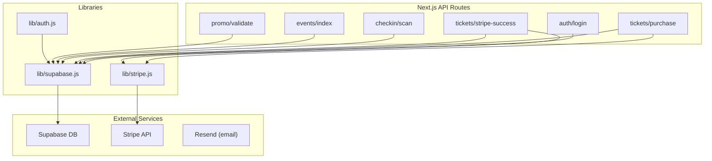
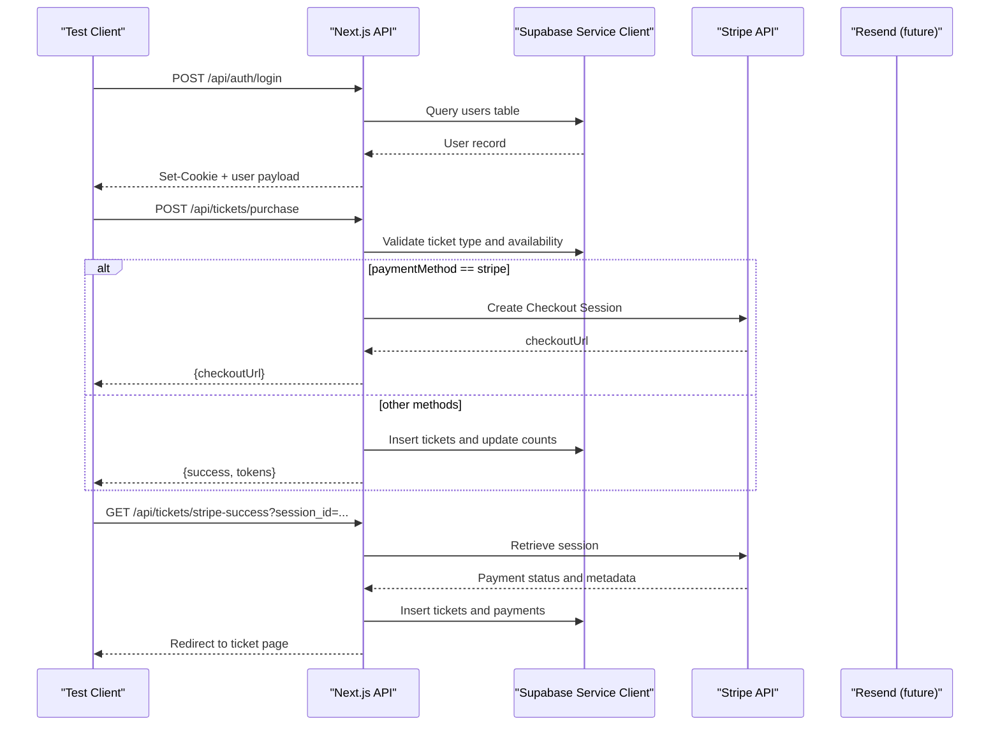
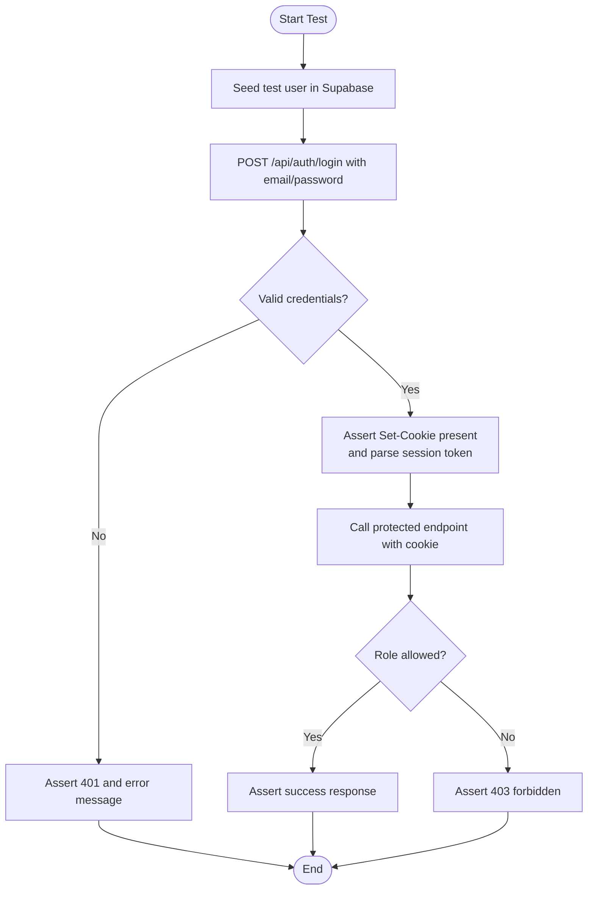
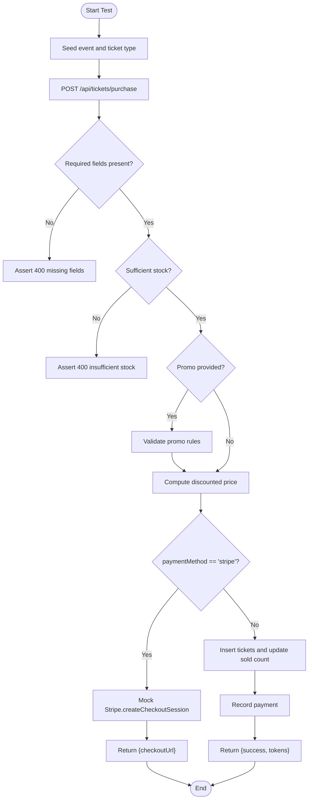
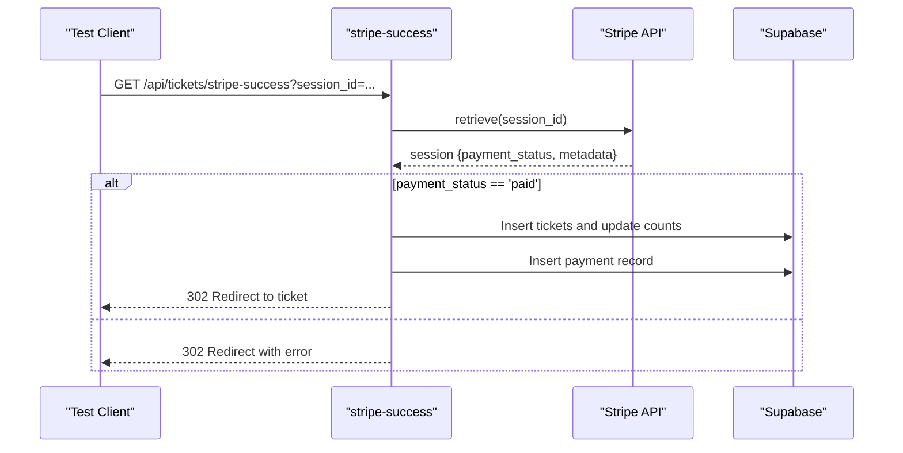
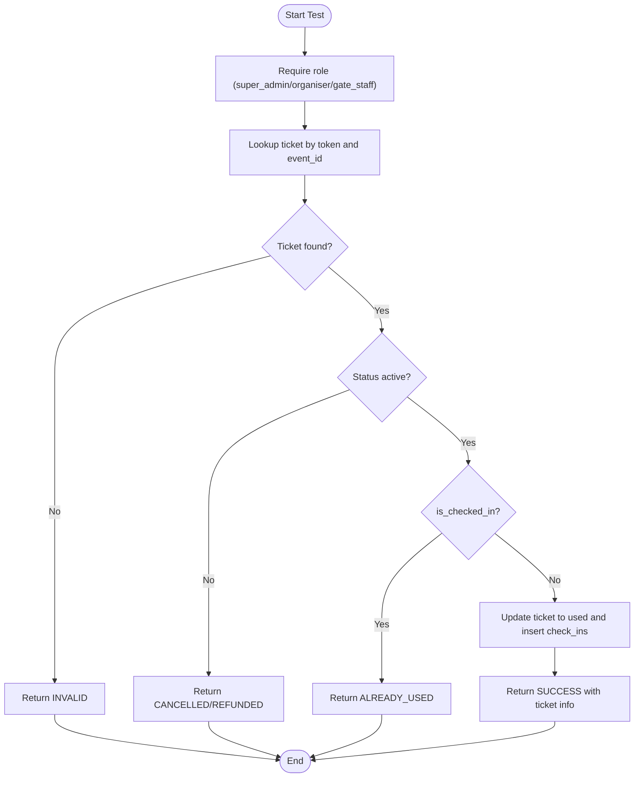
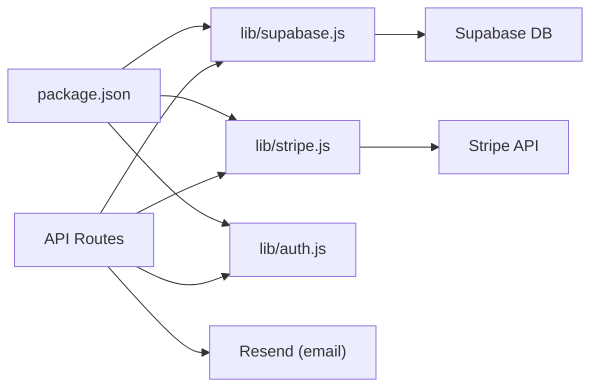

# Integration Testing

<cite>
**Referenced Files in This Document**
- [package.json](file://package.json)
- [lib/supabase.js](file://lib/supabase.js)
- [lib/stripe.js](file://lib/stripe.js)
- [supabase/schema.sql](file://supabase/schema.sql)
- [pages/api/auth/login.js](file://pages/api/auth/login.js)
- [lib/auth.js](file://lib/auth.js)
- [pages/api/tickets/purchase.js](file://pages/api/tickets/purchase.js)
- [pages/api/tickets/stripe-success.js](file://pages/api/tickets/stripe-success.js)
- [pages/api/checkin/scan.js](file://pages/api/checkin/scan.js)
- [pages/api/events/index.js](file://pages/api/events/index.js)
- [pages/api/promo/validate.js](file://pages/api/promo/validate.js)
</cite>

## Table of Contents
1. Introduction
2. Project Structure
3. Core Components
4. Architecture Overview
5. Detailed Component Analysis
6. Dependency Analysis
7. Performance Considerations
8. Troubleshooting Guide
9. Conclusion

## Introduction
This document defines integration testing strategies for TicketFlow’s API endpoints and external service integrations. It focuses on:
- Database operations using Supabase
- Payment processing with Stripe
- Email delivery through Resend (planned extension)

It explains how to set up test databases, mock external APIs, simulate real-world scenarios, and cover authentication flows, ticket purchase workflows, check-in processes, transaction management, data cleanup, asynchronous handling, error scenarios, network failures, and third-party unavailability.

## Project Structure
TicketFlow is a Next.js application with serverless API routes under pages/api. External services are integrated via libraries:
- Supabase client for database access
- Stripe SDK for payments
- Resend library available as a dependency for email

Key areas relevant to integration tests:
- Authentication: login flow and session token handling
- Ticket purchase: creation of checkout sessions or direct ticket issuance
- Stripe success webhook handler: finalization after payment
- Check-in: validation and marking tickets as used
- Events and promo code validation endpoints

**Diagram sources**
- [pages/api/auth/login.js:1-31](file://pages/api/auth/login.js#L1-L31)
- [pages/api/tickets/purchase.js:1-123](file://pages/api/tickets/purchase.js#L1-L123)
- [pages/api/tickets/stripe-success.js:1-55](file://pages/api/tickets/stripe-success.js#L1-L55)
- [pages/api/checkin/scan.js:1-44](file://pages/api/checkin/scan.js#L1-L44)
- [pages/api/events/index.js:1-42](file://pages/api/events/index.js#L1-L42)
- [pages/api/promo/validate.js:1-27](file://pages/api/promo/validate.js#L1-L27)
- [lib/supabase.js:1-23](file://lib/supabase.js#L1-L23)
- [lib/stripe.js:1-6](file://lib/stripe.js#L1-L6)
- [lib/auth.js:1-47](file://lib/auth.js#L1-L47)

**Section sources**
- [package.json:1-24](file://package.json#L1-L24)
- [lib/supabase.js:1-23](file://lib/supabase.js#L1-L23)
- [lib/stripe.js:1-6](file://lib/stripe.js#L1-L6)
- [supabase/schema.sql:1-166](file://supabase/schema.sql#L1-L166)

## Core Components
- Supabase client: Provides both anonymous and service-role clients for server-side operations. Tests should use the service-role client for deterministic writes and reads without RLS interference.
- Stripe client: Initialized with secret key; tests must isolate calls from production by mocking or using Stripe test mode.
- Auth utilities: Password hashing/verification and simple session token helpers used by login endpoint.
- API routes:
  - Login: authenticates user and sets session cookie
  - Purchase: validates availability, applies promo codes, creates Stripe checkout or issues tickets directly
  - Stripe success: finalizes purchase after payment confirmation
  - Check-in scan: validates ticket state and records check-in
  - Events list/create: admin-only event creation
  - Promo validation: checks validity and limits

**Section sources**
- [lib/supabase.js:1-23](file://lib/supabase.js#L1-L23)
- [lib/stripe.js:1-6](file://lib/stripe.js#L1-L6)
- [lib/auth.js:1-47](file://lib/auth.js#L1-L47)
- [pages/api/auth/login.js:1-31](file://pages/api/auth/login.js#L1-L31)
- [pages/api/tickets/purchase.js:1-123](file://pages/api/tickets/purchase.js#L1-L123)
- [pages/api/tickets/stripe-success.js:1-55](file://pages/api/tickets/stripe-success.js#L1-L55)
- [pages/api/checkin/scan.js:1-44](file://pages/api/checkin/scan.js#L1-L44)
- [pages/api/events/index.js:1-42](file://pages/api/events/index.js#L1-L42)
- [pages/api/promo/validate.js:1-27](file://pages/api/promo/validate.js#L1-L27)

## Architecture Overview
The system integrates three primary layers:
- API layer: Next.js serverless functions handle HTTP requests
- Data layer: Supabase provides relational storage and row-level security policies
- External integrations: Stripe for payments and Resend for email (to be wired into post-purchase flow)

**Diagram sources**
- [pages/api/auth/login.js:1-31](file://pages/api/auth/login.js#L1-L31)
- [pages/api/tickets/purchase.js:1-123](file://pages/api/tickets/purchase.js#L1-L123)
- [pages/api/tickets/stripe-success.js:1-55](file://pages/api/tickets/stripe-success.js#L1-L55)
- [lib/supabase.js:1-23](file://lib/supabase.js#L1-L23)
- [lib/stripe.js:1-6](file://lib/stripe.js#L1-L6)

## Detailed Component Analysis

### Authentication Flow Testing
Objectives:
- Verify successful login with valid credentials
- Reject invalid credentials and inactive accounts
- Assert session cookie is set correctly
- Ensure role-based middleware behavior for protected endpoints

Approach:
- Use Supabase service-role client to seed test users with known password hashes
- Call login endpoint with correct and incorrect payloads
- Validate response structure and cookie headers
- For protected endpoints, include the session cookie and assert authorization outcomes

**Diagram sources**
- [pages/api/auth/login.js:1-31](file://pages/api/auth/login.js#L1-L31)
- [lib/auth.js:1-47](file://lib/auth.js#L1-L47)

**Section sources**
- [pages/api/auth/login.js:1-31](file://pages/api/auth/login.js#L1-L31)
- [lib/auth.js:1-47](file://lib/auth.js#L1-L47)

### Ticket Purchase Workflow Testing
Objectives:
- Validate ticket availability and quantity constraints
- Apply promo codes correctly and verify discount calculations
- Create Stripe checkout session when payment method is Stripe
- Issue tickets immediately for non-Stripe payment methods
- Record payments appropriately

Approach:
- Seed events and ticket types with known quantities and prices
- Call purchase endpoint with various payloads:
  - Missing fields (assert 400)
  - Insufficient stock (assert 400)
  - Valid promo code within limits (assert discount applied)
  - Expired or max-used promo (assert invalid)
- For Stripe path:
  - Mock Stripe client to return a predictable checkout URL
  - Assert response contains checkoutUrl
- For non-Stripe path:
  - Assert tickets inserted and ticket_types.quantity_sold incremented
  - Assert payments recorded with expected status

**Diagram sources**
- [pages/api/tickets/purchase.js:1-123](file://pages/api/tickets/purchase.js#L1-L123)
- [pages/api/promo/validate.js:1-27](file://pages/api/promo/validate.js#L1-L27)

**Section sources**
- [pages/api/tickets/purchase.js:1-123](file://pages/api/tickets/purchase.js#L1-L123)
- [pages/api/promo/validate.js:1-27](file://pages/api/promo/validate.js#L1-L27)

### Stripe Success Finalization Testing
Objectives:
- Confirm that only paid sessions finalize purchases
- Validate metadata parsing and ticket creation
- Ensure payments are recorded with correct amounts and references
- Handle errors gracefully with redirects

Approach:
- Mock Stripe.retrieve to return a session with payment_status 'paid' and expected metadata
- Call stripe-success endpoint with session_id
- Assert tickets created and ticket_types.quantity_sold updated
- Assert payments inserted with transaction_ref and completed status
- Assert redirect to ticket page
- Cover failure paths: unpaid session, missing metadata, DB errors

**Diagram sources**
- [pages/api/tickets/stripe-success.js:1-55](file://pages/api/tickets/stripe-success.js#L1-L55)

**Section sources**
- [pages/api/tickets/stripe-success.js:1-55](file://pages/api/tickets/stripe-success.js#L1-L55)

### Check-in Process Testing
Objectives:
- Validate staff authentication and role requirements
- Ensure ticket exists for the event and is not cancelled/refunded
- Prevent double-check-in and record check-in details
- Return appropriate responses for each scenario

Approach:
- Seed a ticket with known token and event_id
- Call check-in scan with valid staff cookie and token
- Assert success response and ticket status updated to used
- Assert check_ins record inserted
- Cover error cases: invalid token, already checked in, cancelled/refunded, unauthorized

**Diagram sources**
- [pages/api/checkin/scan.js:1-44](file://pages/api/checkin/scan.js#L1-L44)
- [lib/auth.js:1-47](file://lib/auth.js#L1-L47)

**Section sources**
- [pages/api/checkin/scan.js:1-44](file://pages/api/checkin/scan.js#L1-L44)
- [lib/auth.js:1-47](file://lib/auth.js#L1-L47)

### Events and Promo Validation Testing
Objectives:
- Ensure public listing returns published events only
- Protect event creation with role checks
- Validate promo codes against event scope, usage limits, and expiration

Approach:
- Seed events with different statuses and call GET /api/events
- Assert only published events returned
- Call POST /api/events with and without proper role cookie
- Seed promo codes and call validate endpoint with various conditions
- Assert valid/invalid responses based on rules

**Section sources**
- [pages/api/events/index.js:1-42](file://pages/api/events/index.js#L1-L42)
- [pages/api/promo/validate.js:1-27](file://pages/api/promo/validate.js#L1-L27)

## Dependency Analysis
External dependencies relevant to integration tests:
- Supabase JS client for database operations
- Stripe SDK for payment flows
- Resend library available for email (not yet wired in current routes)

**Diagram sources**
- [package.json:1-24](file://package.json#L1-L24)
- [lib/supabase.js:1-23](file://lib/supabase.js#L1-L23)
- [lib/stripe.js:1-6](file://lib/stripe.js#L1-L6)
- [lib/auth.js:1-47](file://lib/auth.js#L1-L47)

**Section sources**
- [package.json:1-24](file://package.json#L1-L24)

## Performance Considerations
- Use Supabase service-role client in tests to bypass Row Level Security and reduce overhead
- Batch inserts where possible (e.g., multiple tickets) to minimize round trips
- Mock external APIs (Stripe, Resend) to avoid network latency and rate limits
- Keep test datasets minimal and focused on assertions
- Avoid heavy seeding; pre-seed once per test suite and reset state between tests

[No sources needed since this section provides general guidance]

## Troubleshooting Guide
Common issues and resolutions:
- Missing environment variables:
  - Supabase URL and keys, Stripe secret key, site URL for success URLs
  - Ensure .env.local or CI environment includes these values
- Stripe test mode vs live:
  - Always use Stripe test keys in tests; mock create/retrieve calls
- Duplicate check-ins:
  - Assertions should confirm idempotency and prevent re-use
- Promo code edge cases:
  - Expiration dates, max uses, case sensitivity
- Network failures:
  - Simulate timeouts and connection errors for robustness
- Third-party unavailability:
  - Fail fast with clear error messages and retry/backoff strategies if applicable

**Section sources**
- [lib/supabase.js:1-23](file://lib/supabase.js#L1-L23)
- [lib/stripe.js:1-6](file://lib/stripe.js#L1-L6)
- [pages/api/tickets/purchase.js:1-123](file://pages/api/tickets/purchase.js#L1-L123)
- [pages/api/tickets/stripe-success.js:1-55](file://pages/api/tickets/stripe-success.js#L1-L55)
- [pages/api/checkin/scan.js:1-44](file://pages/api/checkin/scan.js#L1-L44)

## Conclusion
This guide outlines comprehensive integration testing strategies for TicketFlow’s core flows: authentication, ticket purchasing (Stripe and non-Stripe), Stripe success finalization, and check-in validation. By leveraging Supabase service-role clients, mocking Stripe and future Resend integrations, and carefully managing test data and transactions, you can achieve reliable, fast, and maintainable tests that reflect real-world scenarios while covering error paths and edge cases.

[No sources needed since this section summarizes without analyzing specific files]