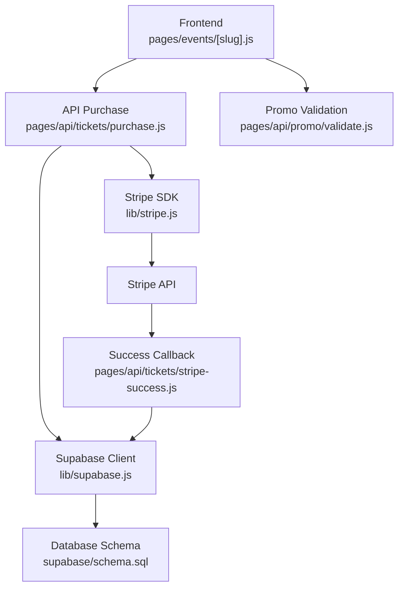
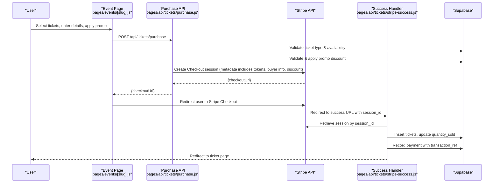
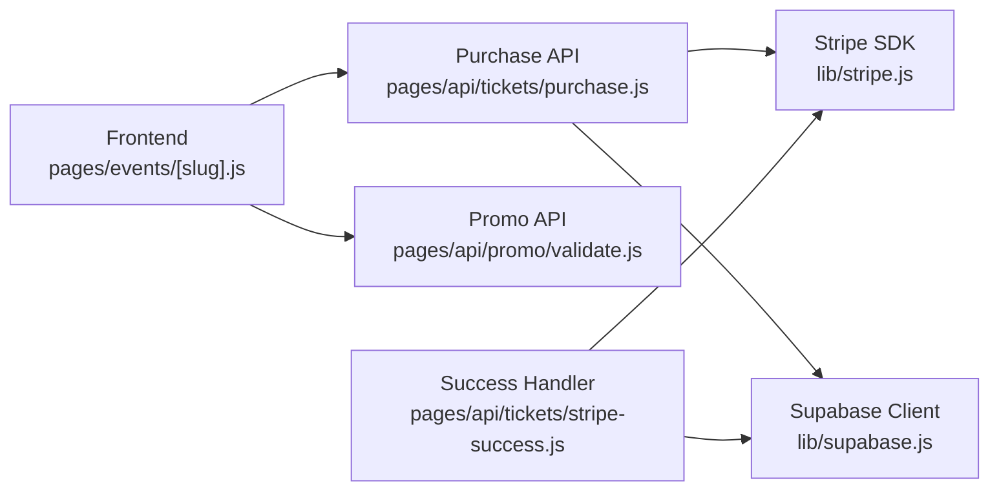
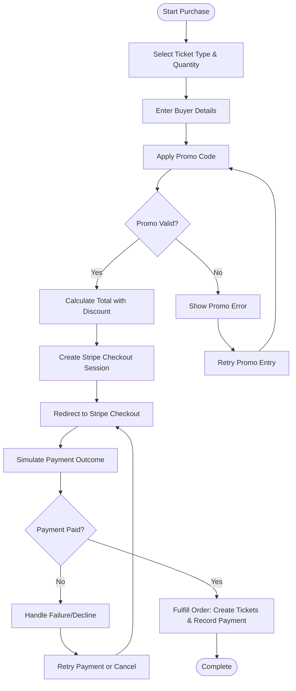

# Payment Integration Testing

<cite>
**Referenced Files in This Document**
- [lib/stripe.js](file://lib/stripe.js)
- [pages/api/tickets/purchase.js](file://pages/api/tickets/purchase.js)
- [pages/api/tickets/stripe-success.js](file://pages/api/tickets/stripe-success.js)
- [pages/api/promo/validate.js](file://pages/api/promo/validate.js)
- [lib/supabase.js](file://lib/supabase.js)
- [supabase/schema.sql](file://supabase/schema.sql)
- [package.json](file://package.json)
- [pages/events/[slug].js](file://pages/events/[slug].js)
</cite>

## Table of Contents
1. Introduction
2. Project Structure
3. Core Components
4. Architecture Overview
5. Detailed Component Analysis
6. Dependency Analysis
7. Performance Considerations
8. Troubleshooting Guide
9. Conclusion
10. Appendices

## Introduction
This document provides comprehensive testing guidance for the Stripe payment integration in TicketFlow. It covers setting up Stripe test mode, creating test scenarios, simulating outcomes (success, failure, declined), and validating the end-to-end ticket purchase workflow. It also includes testing promo code validation, price calculations, webhook handling considerations, error scenarios, state management, retry logic, and idempotency requirements.

## Project Structure
TicketFlow uses a Next.js API routes approach to handle payments:
- Frontend initiates purchases and validates promo codes
- Server-side API creates Stripe Checkout sessions and finalizes tickets after successful payment
- Supabase stores tickets, payments, and promo codes with row-level security policies

**Diagram sources**
- [pages/events/[slug].js](file://pages/events/[slug].js)
- [pages/api/tickets/purchase.js](file://pages/api/tickets/purchase.js)
- [lib/stripe.js](file://lib/stripe.js)
- [lib/supabase.js](file://lib/supabase.js)
- [pages/api/promo/validate.js](file://pages/api/promo/validate.js)
- [pages/api/tickets/stripe-success.js](file://pages/api/tickets/stripe-success.js)
- [supabase/schema.sql](file://supabase/schema.sql)

**Section sources**
- [package.json](file://package.json)
- [lib/stripe.js](file://lib/stripe.js)
- [lib/supabase.js](file://lib/supabase.js)
- [supabase/schema.sql](file://supabase/schema.sql)

## Core Components
- Stripe client initialization and configuration
- Ticket purchase API that creates Stripe Checkout sessions
- Stripe success handler that persists tickets and records payments
- Promo code validation endpoint
- Database schema for events, ticket types, tickets, payments, and promo codes
- Frontend event page orchestrating the purchase flow

Key responsibilities:
- Validate inputs and availability before checkout
- Apply promo discounts deterministically on the server
- Create a Stripe Checkout session with metadata for idempotent fulfillment
- Finalize orders only when payment is confirmed
- Record payments and update inventory atomically

**Section sources**
- [lib/stripe.js](file://lib/stripe.js)
- [pages/api/tickets/purchase.js](file://pages/api/tickets/purchase.js)
- [pages/api/tickets/stripe-success.js](file://pages/api/tickets/stripe-success.js)
- [pages/api/promo/validate.js](file://pages/api/promo/validate.js)
- [supabase/schema.sql](file://supabase/schema.sql)
- [pages/events/[slug].js](file://pages/events/[slug].js)

## Architecture Overview
The payment flow uses Stripe Checkout for secure card processing and redirects back to a success handler to finalize the order.

**Diagram sources**
- [pages/events/[slug].js](file://pages/events/[slug].js)
- [pages/api/tickets/purchase.js](file://pages/api/tickets/purchase.js)
- [pages/api/tickets/stripe-success.js](file://pages/api/tickets/stripe-success.js)
- [lib/supabase.js](file://lib/supabase.js)

## Detailed Component Analysis

### Stripe Client Configuration
- The Stripe client is initialized with an API version and secret key from environment variables.
- For local development, a placeholder test key is used if no secret is provided.

Testing implications:
- Ensure STRIPE_SECRET_KEY points to a valid test secret key during tests.
- Confirm apiVersion matches your Stripe integration expectations.

**Section sources**
- [lib/stripe.js](file://lib/stripe.js)

### Ticket Purchase API (/api/tickets/purchase)
Responsibilities:
- Validates required fields and ticket availability
- Applies promo codes and updates usage counters
- Creates a Stripe Checkout session with line items and metadata
- Returns a checkout URL for redirection

Idempotency considerations:
- Pre-generates unique tokens per ticket and embeds them in session metadata
- Avoids duplicate ticket creation by relying on the success handler to persist only upon confirmed payment

Error handling:
- Returns appropriate status codes for missing fields, insufficient stock, and server errors

**Section sources**
- [pages/api/tickets/purchase.js](file://pages/api/tickets/purchase.js)

### Stripe Success Handler (/api/tickets/stripe-success)
Responsibilities:
- Retrieves the Stripe session using session_id
- Confirms payment_status is paid before fulfilling
- Parses metadata to create tickets and record payments
- Updates ticket type sold quantities
- Redirects to the first ticket page

Idempotency and reliability:
- Uses the retrieved session to ensure correctness even if multiple redirects occur
- Records payment with transaction reference for traceability

Error handling:
- Redirects to root with error query parameters on failures or invalid states

**Section sources**
- [pages/api/tickets/stripe-success.js](file://pages/api/tickets/stripe-success.js)

### Promo Code Validation (/api/promo/validate)
Responsibilities:
- Validates promo code existence, activity, expiration, and usage limits
- Returns discount percentage if valid

Testing focus:
- Verify behavior for expired codes, max usage reached, inactive codes, and malformed requests

**Section sources**
- [pages/api/promo/validate.js](file://pages/api/promo/validate.js)

### Frontend Event Page (pages/events/[slug].js)
Responsibilities:
- Manages multi-step purchase flow (select tickets, details, payment, confirmation)
- Calls promo validation and purchase APIs
- Handles Stripe redirect and displays confirmation

Price calculation:
- Computes base total, discount amount, service fee, and final total
- Ensures consistent totals sent to backend via metadata

**Section sources**
- [pages/events/[slug].js](file://pages/events/[slug].js)

### Database Schema (supabase/schema.sql)
Key tables relevant to payments:
- ticket_types: tracks price and availability
- tickets: stores issued tickets with unique QR tokens
- payments: records transactions linked to tickets
- promo_codes: manages discount rules and usage

Row-level security policies:
- Restrict public reads to published events and their ticket types
- Service role used by API routes has full access

Indexes:
- Optimized queries for tickets by token, email, event
- Payments indexed by ticket_id

**Section sources**
- [supabase/schema.sql](file://supabase/schema.sql)

### Supabase Client (lib/supabase.js)
- Provides both anonymous and service role clients
- Service role client is used in API routes for privileged operations

Testing implications:
- Ensure SUPABASE_SERVICE_ROLE_KEY is set for server-side operations
- Validate RLS policies allow expected writes during tests

**Section sources**
- [lib/supabase.js](file://lib/supabase.js)

## Dependency Analysis
External dependencies:
- Stripe SDK for creating and retrieving Checkout sessions
- Supabase JS client for database operations
- UUID generation for unique ticket tokens

Internal coupling:
- Frontend depends on promo and purchase APIs
- Purchase API depends on Supabase and Stripe
- Success handler depends on Stripe and Supabase

Potential circular dependencies:
- None detected; flows are unidirectional from frontend to APIs to external services and database

**Diagram sources**
- [pages/events/[slug].js](file://pages/events/[slug].js)
- [pages/api/tickets/purchase.js](file://pages/api/tickets/purchase.js)
- [pages/api/promo/validate.js](file://pages/api/promo/validate.js)
- [lib/stripe.js](file://lib/stripe.js)
- [lib/supabase.js](file://lib/supabase.js)
- [pages/api/tickets/stripe-success.js](file://pages/api/tickets/stripe-success.js)

**Section sources**
- [package.json](file://package.json)

## Performance Considerations
- Minimize redundant database queries by batching inserts where possible
- Use indexes defined in schema for fast lookups on tickets and payments
- Keep metadata minimal but sufficient for fulfillment
- Avoid heavy computations in success handlers; rely on deterministic pricing from stored ticket type data

[No sources needed since this section provides general guidance]

## Troubleshooting Guide
Common issues and resolutions:
- Missing environment variables:
  - Ensure STRIPE_SECRET_KEY and Supabase keys are configured
- Invalid promo codes:
  - Check activation, expiration, and usage limits
- Insufficient stock:
  - Verify ticket_type availability and concurrent purchase handling
- Payment not marked paid:
  - Confirm Stripe Checkout completed successfully and session retrieval returns paid status
- Network timeouts:
  - Implement retries with exponential backoff for transient errors
- Duplicate tickets:
  - Ensure success handler runs once per session and relies on session state

Error paths:
- Purchase API returns 4xx for validation and availability errors
- Success handler redirects with error query parameters on failures

**Section sources**
- [pages/api/tickets/purchase.js](file://pages/api/tickets/purchase.js)
- [pages/api/tickets/stripe-success.js](file://pages/api/tickets/stripe-success.js)
- [pages/api/promo/validate.js](file://pages/api/promo/validate.js)

## Conclusion
TicketFlow’s Stripe integration follows a robust pattern: validate and prepare on the server, delegate payment to Stripe Checkout, and fulfill orders only upon confirmed payment. Testing should cover promo validation, price consistency, success and failure flows, error handling, and idempotency. With proper environment setup and careful scenario design, you can reliably verify the entire purchase lifecycle.

[No sources needed since this section summarizes without analyzing specific files]

## Appendices

### Setting Up Stripe Test Mode
- Obtain a Stripe test secret key from the Stripe dashboard
- Configure STRIPE_SECRET_KEY in your environment
- Use Stripe test cards to simulate various outcomes

Test card examples (use in Stripe Dashboard documentation):
- Successful payment: standard test card number
- Declined payment: card explicitly set to decline
- Insufficient funds: card indicating insufficient funds
- Network timeout: use Stripe CLI or network simulation tools

[No sources needed since this section provides general guidance]

### End-to-End Purchase Workflow Testing
Steps:
- Select a ticket type and quantity
- Enter buyer details and optional phone
- Apply a promo code and verify discount
- Initiate purchase and confirm redirect to Stripe Checkout
- Simulate payment success and verify tickets created
- Validate payment record and updated inventory

**Diagram sources**
- [pages/events/[slug].js](file://pages/events/[slug].js)
- [pages/api/tickets/purchase.js](file://pages/api/tickets/purchase.js)
- [pages/api/tickets/stripe-success.js](file://pages/api/tickets/stripe-success.js)

### Testing Promo Code Validation
Scenarios:
- Valid active promo within usage limit
- Expired promo code
- Inactive promo code
- Promo code at max usage
- Malformed request (missing fields)

Expected behaviors:
- Return valid flag and discount percent for valid promos
- Return valid false with descriptive errors otherwise

**Section sources**
- [pages/api/promo/validate.js](file://pages/api/promo/validate.js)

### Price Calculation Verification
Ensure consistency between frontend display and backend computation:
- Base total equals unit price times quantity
- Discount applied as percentage off base total
- Service fee added consistently
- Final total equals base minus discount plus service fee

Verification steps:
- Assert promo discount reduces total correctly
- Confirm service fee is calculated on base total
- Validate currency and rounding behavior

**Section sources**
- [pages/events/[slug].js](file://pages/events/[slug].js)
- [pages/api/tickets/purchase.js](file://pages/api/tickets/purchase.js)

### Webhook Handling Considerations
Current implementation relies on redirect-based success handling. If webhooks are introduced:
- Implement a webhook endpoint to verify signatures
- Use event types like checkout.session.completed to finalize orders
- Ensure idempotency by checking existing payment records before creating tickets
- Maintain consistency with redirect-based fulfillment to avoid duplicates

[No sources needed since this section provides general guidance]

### State Management, Retry Logic, and Idempotency
State management:
- Track purchase step state in frontend
- Persist tokens and order identifiers for post-payment confirmation

Retry logic:
- Implement retries for network failures with exponential backoff
- Limit retries to prevent infinite loops

Idempotency:
- Use unique tokens per ticket and store them in metadata
- Prevent duplicate ticket creation by verifying session state and existing records
- Ensure success handler is safe to call multiple times for the same session

**Section sources**
- [pages/events/[slug].js](file://pages/events/[slug].js)
- [pages/api/tickets/purchase.js](file://pages/api/tickets/purchase.js)
- [pages/api/tickets/stripe-success.js](file://pages/api/tickets/stripe-success.js)

### Error Scenarios and Outcomes
- Insufficient funds: simulate with Stripe test card; expect failure path and user feedback
- Network timeouts: simulate latency; expect retry behavior and eventual success or failure
- Invalid card details: expect immediate validation error and prompt correction
- Declined payments: handle gracefully with clear messaging and option to retry

**Section sources**
- [pages/events/[slug].js](file://pages/events/[slug].js)
- [pages/api/tickets/purchase.js](file://pages/api/tickets/purchase.js)
- [pages/api/tickets/stripe-success.js](file://pages/api/tickets/stripe-success.js)