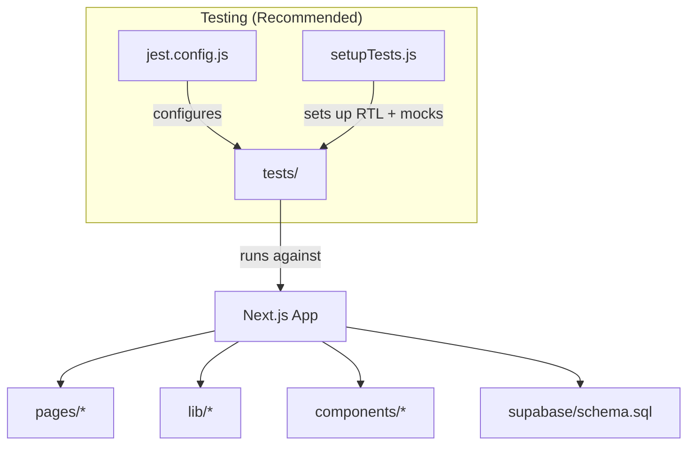
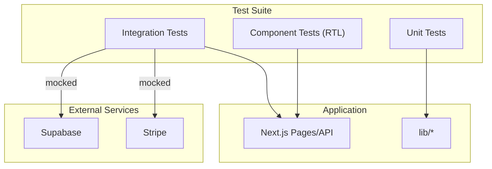
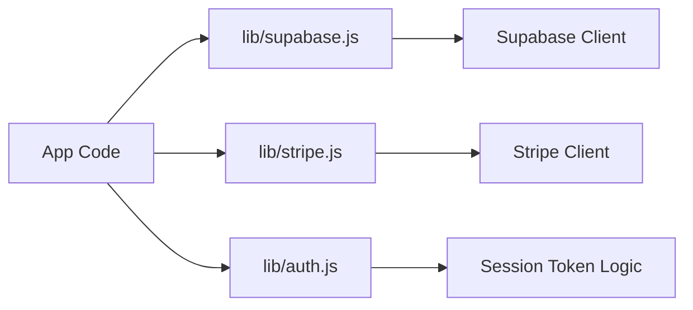

# Test Configuration & Setup

<cite>
**Referenced Files in This Document**
- [package.json](file://package.json)
- [next.config.js](file://next.config.js)
- [vercel.json](file://vercel.json)
- [.gitignore](file://.gitignore)
- [lib/supabase.js](file://lib/supabase.js)
- [lib/stripe.js](file://lib/stripe.js)
- [lib/auth.js](file://lib/auth.js)
</cite>

## Table of Contents
1. [Introduction](#introduction)
2. [Project Structure](#project-structure)
3. [Core Components](#core-components)
4. [Architecture Overview](#architecture-overview)
5. [Detailed Component Analysis](#detailed-component-analysis)
6. [Dependency Analysis](#dependency-analysis)
7. [Performance Considerations](#performance-considerations)
8. [Troubleshooting Guide](#troubleshooting-guide)
9. [Conclusion](#conclusion)
10. [Appendices](#appendices)

## Introduction
This document explains how to configure and run the test environment for TicketFlow, a Next.js application. It covers Jest configuration, React Testing Library setup, test runner options, test database setup, environment variables for testing, mocking strategies, test file organization and naming conventions, CI/CD integration, code coverage reporting, result visualization, performance optimization, and debugging techniques. The current repository does not include a dedicated test framework or configuration files; therefore, this guide provides recommended configurations and steps to add them safely without altering existing functionality.

## Project Structure
TicketFlow is a Next.js app with pages, API routes, shared libraries, and Supabase/Stripe integrations. There are no existing test directories or configuration files in the repository. A standard approach is to create a tests directory at the project root and co-locate unit tests near their modules when appropriate.

[No sources needed since this diagram shows conceptual workflow, not actual code structure]

## Core Components
- Test Runner: Jest is recommended for unit and integration tests in Next.js projects.
- UI Testing: React Testing Library (RTL) is recommended for component tests.
- Environment Variables: Use .env.test.local for test-only variables.
- External Services: Mock Stripe and Supabase clients during tests.
- Database: Use an isolated Supabase instance or local mock data for deterministic tests.

Key observations from the codebase:
- Next.js is configured with strict mode and image remote patterns.
- Supabase client initialization reads environment variables and warns if missing.
- Stripe client initializes with a fallback placeholder key.
- Authentication utilities rely on cookies and session tokens.

**Section sources**
- [next.config.js:1-14](file://next.config.js#L1-L14)
- [lib/supabase.js:1-23](file://lib/supabase.js#L1-L23)
- [lib/stripe.js:1-6](file://lib/stripe.js#L1-L6)
- [lib/auth.js:1-47](file://lib/auth.js#L1-L47)

## Architecture Overview
The test architecture should isolate external dependencies and provide deterministic behavior:
- Unit tests validate pure functions and module logic.
- Integration tests exercise API routes with mocked services.
- Component tests render UI using RTL and assert interactions.
- End-to-end tests can be added later with Playwright if desired.

[No sources needed since this diagram shows conceptual workflow, not actual code structure]

## Detailed Component Analysis

### Jest Configuration
- Add Jest via devDependencies and define scripts in package.json.
- Configure Jest to work with Next.js and React Testing Library.
- Set up a global setup file for environment variables and common mocks.
- Ensure Node version compatibility and module resolution.

Recommendations:
- Use ts-jest only if TypeScript is introduced; otherwise, use babel-jest.
- Map module paths for cleaner imports in tests.
- Enable coverage collection and threshold checks.

**Section sources**
- [package.json:1-24](file://package.json#L1-L24)

### React Testing Library Setup
- Install React Testing Library and its DOM testing utilities.
- Create a setup file to configure RTL globals and custom matchers.
- Provide wrappers for providers (e.g., Supabase client wrapper) as needed.
- Use fireEvent and userEvent for realistic interactions.

**Section sources**
- [next.config.js:1-14](file://next.config.js#L1-L14)

### Test Runner Options
- Parallel execution: enable workers and limit concurrency for speed.
- Watch mode: use watchman or polling for faster feedback.
- Snapshot testing: enable selectively for stable UI components.
- Time control: use timers to advance time deterministically.

**Section sources**
- [package.json:1-24](file://package.json#L1-L24)

### Setting Up Test Databases
- Use a separate Supabase project or a local Dockerized instance for tests.
- Seed deterministic data before each test suite.
- Reset state between tests to avoid cross-test pollution.
- For API route tests, mock Supabase calls to avoid real network requests.

**Section sources**
- [lib/supabase.js:1-23](file://lib/supabase.js#L1-L23)

### Environment Variables for Testing
- Store test-specific values in .env.test.local.
- Required variables include Supabase URL and anon key, Stripe secret key, and any service role keys used by server-side code.
- Ensure Next.js loads these variables during tests.

**Section sources**
- [.gitignore:1-33](file://.gitignore#L1-L33)
- [lib/supabase.js:1-23](file://lib/supabase.js#L1-L23)
- [lib/stripe.js:1-6](file://lib/stripe.js#L1-L6)

### Mocking Strategies
- Mock Stripe client methods for payment flows.
- Mock Supabase client methods for queries and mutations.
- Mock authentication helpers that parse cookies and session tokens.
- Use jest.mock for module-level mocks and manual mocks for complex modules.

**Section sources**
- [lib/stripe.js:1-6](file://lib/stripe.js#L1-L6)
- [lib/supabase.js:1-23](file://lib/supabase.js#L1-L23)
- [lib/auth.js:1-47](file://lib/auth.js#L1-L47)

### Test File Organization and Naming Conventions
- Place unit tests under tests/unit, integration tests under tests/integration, and component tests under tests/components.
- Co-locate small component tests next to components when appropriate.
- Name files with .test.js suffix and follow feature-based grouping.

[No sources needed since this section doesn't analyze specific files]

### CI/CD Pipeline Integration
- Use Vercel’s build and install commands to set up the environment.
- Run Jest in CI with headless mode and collect coverage reports.
- Cache node_modules and Next.js build artifacts for faster runs.
- Publish test results and coverage to dashboards.

**Section sources**
- [vercel.json:1-18](file://vercel.json#L1-L18)

### Code Coverage Reporting
- Configure Jest to generate coverage reports (JSON, HTML).
- Enforce minimum thresholds for line, branch, function, and statement coverage.
- Integrate coverage badges into documentation.

**Section sources**
- [package.json:1-24](file://package.json#L1-L24)

### Test Result Visualization
- Use Jest reporters to output JUnit XML for CI systems.
- Visualize coverage with tools like codecov.io or GitHub Actions artifacts.
- Display component snapshots in PR comments for review.

[No sources needed since this section doesn't analyze specific files]

### Performance Optimization for Test Suites
- Split large suites into smaller units to reduce runtime.
- Use selective mocking to avoid heavy dependencies.
- Leverage Jest’s worker pool and memory limits appropriately.
- Avoid unnecessary re-renders in component tests.

[No sources needed since this section doesn't analyze specific files]

### Debugging Techniques for Failing Tests
- Use console logs sparingly and structured logging for clarity.
- Inspect network mocks and ensure they reflect expected responses.
- Step through tests with IDE debuggers and breakpoints.
- Isolate failing tests with focused runners.

[No sources needed since this section doesn't analyze specific files]

## Dependency Analysis
The application depends on Supabase and Stripe clients initialized via environment variables. Tests must mock these dependencies to avoid external calls and ensure deterministic outcomes.

**Diagram sources**
- [lib/supabase.js:1-23](file://lib/supabase.js#L1-L23)
- [lib/stripe.js:1-6](file://lib/stripe.js#L1-L6)
- [lib/auth.js:1-47](file://lib/auth.js#L1-L47)

**Section sources**
- [lib/supabase.js:1-23](file://lib/supabase.js#L1-L23)
- [lib/stripe.js:1-6](file://lib/stripe.js#L1-L6)
- [lib/auth.js:1-47](file://lib/auth.js#L1-L47)

## Performance Considerations
- Prefer unit tests over integration tests where possible for speed.
- Mock expensive operations (bcrypt hashing, network calls).
- Use shallow rendering judiciously; prefer full rendering with RTL for realism.
- Limit snapshot usage to stable UI elements.

[No sources needed since this section provides general guidance]

## Troubleshooting Guide
Common issues and resolutions:
- Missing environment variables: Ensure .env.test.local contains required keys for Supabase and Stripe.
- Supabase client warnings: Confirm NEXT_PUBLIC_SUPABASE_URL and NEXT_PUBLIC_SUPABASE_ANON_KEY are set.
- Stripe placeholder key: Replace sk_test_placeholder with a valid test key in CI environments.
- Cookie parsing failures: Validate cookie format in auth tests.

**Section sources**
- [lib/supabase.js:1-23](file://lib/supabase.js#L1-L23)
- [lib/stripe.js:1-6](file://lib/stripe.js#L1-L6)
- [lib/auth.js:1-47](file://lib/auth.js#L1-L47)

## Conclusion
To establish a robust test environment for TicketFlow, introduce Jest and React Testing Library, configure environment variables for testing, and mock external services like Supabase and Stripe. Organize tests logically, integrate CI/CD pipelines for automated runs and coverage reporting, and optimize for performance and reliability. This approach ensures consistent, fast, and maintainable tests aligned with the application’s architecture.

## Appendices
- Recommended scripts to add to package.json for running tests and generating coverage.
- Example .env.test.local contents for Supabase and Stripe.
- Sample jest.config.js and setupTests.js structures.

[No sources needed since this section provides general guidance]