# Testing Strategies & Implementation

<cite>
**Referenced Files in This Document**
- [package.json](file://package.json)
- [pages/_app.js](file://pages/_app.js)
- [lib/auth.js](file://lib/auth.js)
- [lib/stripe.js](file://lib/stripe.js)
- [lib/supabase.js](file://lib/supabase.js)
- [pages/api/auth/login.js](file://pages/api/auth/login.js)
- [pages/api/tickets/purchase.js](file://pages/api/tickets/purchase.js)
- [pages/api/tickets/stripe-success.js](file://pages/api/tickets/stripe-success.js)
- [pages/api/checkin/scan.js](file://pages/api/checkin/scan.js)
- [components/ui/Button.js](file://components/ui/Button.js)
- [components/ui/Toast.js](file://components/ui/Toast.js)
- [components/ui/CountdownTimer.js](file://components/ui/CountdownTimer.js)
- [supabase/schema.sql](file://supabase/schema.sql)
</cite>

## Table of Contents
1. [Introduction](#introduction)
2. [Project Structure](#project-structure)
3. [Core Components](#core-components)
4. [Architecture Overview](#architecture-overview)
5. [Detailed Component Analysis](#detailed-component-analysis)
6. [Dependency Analysis](#dependency-analysis)
7. [Performance Considerations](#performance-considerations)
8. [Troubleshooting Guide](#troubleshooting-guide)
9. [Conclusion](#conclusion)
10. [Appendices](#appendices)

## Introduction
This document defines comprehensive testing strategies for the TicketFlow application, covering unit tests for React components and utility functions, integration tests for API routes with Supabase and Stripe, and end-to-end tests using Cypress or Playwright. It includes guidance on test organization, mocking external dependencies, managing test data, and examples for authentication flows, payment processing, and real-time check-in. It also addresses code coverage requirements, continuous integration setup, and performance testing approaches.

## Project Structure
TicketFlow is a Next.js application with:
- UI components under components/ui
- API routes under pages/api
- Shared libraries for auth, Stripe, and Supabase under lib
- Database schema under supabase/schema.sql

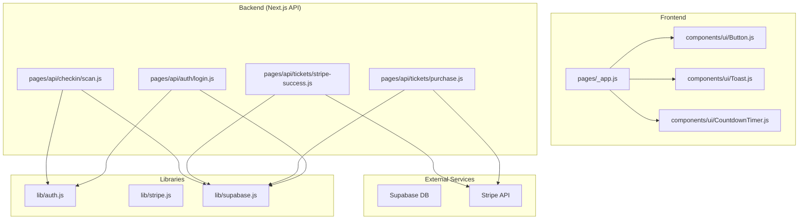

**Diagram sources**
- [pages/_app.js:1-14](file://pages/_app.js#L1-L14)
- [components/ui/Button.js:1-74](file://components/ui/Button.js#L1-L74)
- [components/ui/Toast.js:1-84](file://components/ui/Toast.js#L1-L84)
- [components/ui/CountdownTimer.js:1-109](file://components/ui/CountdownTimer.js#L1-L109)
- [pages/api/auth/login.js:1-31](file://pages/api/auth/login.js#L1-L31)
- [pages/api/tickets/purchase.js:1-123](file://pages/api/tickets/purchase.js#L1-L123)
- [pages/api/tickets/stripe-success.js:1-55](file://pages/api/tickets/stripe-success.js#L1-L55)
- [pages/api/checkin/scan.js:1-44](file://pages/api/checkin/scan.js#L1-L44)
- [lib/auth.js:1-47](file://lib/auth.js#L1-L47)
- [lib/stripe.js:1-6](file://lib/stripe.js#L1-L6)
- [lib/supabase.js:1-23](file://lib/supabase.js#L1-L23)

**Section sources**
- [package.json:1-24](file://package.json#L1-L24)
- [pages/_app.js:1-14](file://pages/_app.js#L1-L14)

## Core Components
Key areas to test:
- Authentication utilities and session handling
- Stripe integration for payments
- Supabase client usage for database operations
- UI components that render state and handle user interactions
- API endpoints for login, ticket purchase, Stripe success callback, and check-in scanning

Testing priorities:
- Unit tests for pure logic (auth helpers, price calculations)
- Component tests for interactive UI (Button, Toast, CountdownTimer)
- Integration tests for API routes against mocked Supabase and Stripe
- E2E tests for full user journeys (login, purchase, check-in)

**Section sources**
- [lib/auth.js:1-47](file://lib/auth.js#L1-L47)
- [lib/stripe.js:1-6](file://lib/stripe.js#L1-L6)
- [lib/supabase.js:1-23](file://lib/supabase.js#L1-L23)
- [components/ui/Button.js:1-74](file://components/ui/Button.js#L1-L74)
- [components/ui/Toast.js:1-84](file://components/ui/Toast.js#L1-L84)
- [components/ui/CountdownTimer.js:1-109](file://components/ui/CountdownTimer.js#L1-L109)

## Architecture Overview
The system integrates frontend components with serverless API routes that call Supabase and Stripe. The app wraps all pages with a Toast provider and default Layout.

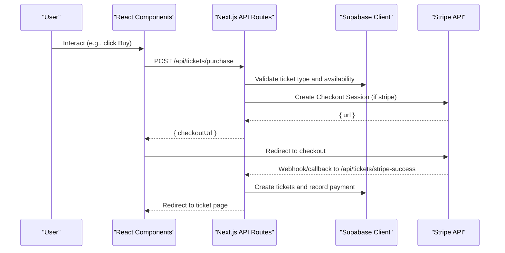

**Diagram sources**
- [pages/api/tickets/purchase.js:1-123](file://pages/api/tickets/purchase.js#L1-L123)
- [pages/api/tickets/stripe-success.js:1-55](file://pages/api/tickets/stripe-success.js#L1-L55)
- [lib/supabase.js:1-23](file://lib/supabase.js#L1-L23)
- [lib/stripe.js:1-6](file://lib/stripe.js#L1-L6)

## Detailed Component Analysis

### Authentication Utilities (lib/auth.js)
Responsibilities:
- Password hashing and verification
- Session token creation and parsing
- Extracting user from request cookies
- Role-based authorization guard

Testing strategy:
- Unit tests for hashPassword and verifyPassword behavior
- Unit tests for createSessionToken and parseSessionToken edge cases (expired tokens, malformed base64)
- Unit tests for getUserFromRequest with various cookie formats
- Unit tests for requireRole with missing user and insufficient roles

Mocking:
- No external dependencies; can be tested directly without mocks

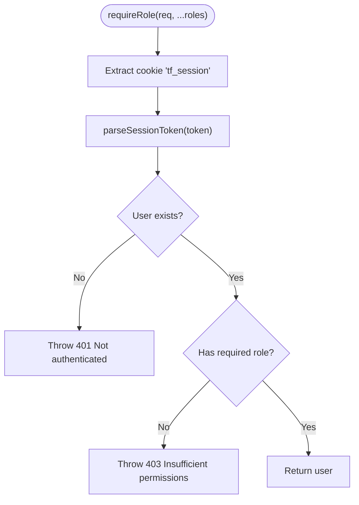

**Diagram sources**
- [lib/auth.js:15-46](file://lib/auth.js#L15-L46)

**Section sources**
- [lib/auth.js:1-47](file://lib/auth.js#L1-L47)

### Supabase Client (lib/supabase.js)
Responsibilities:
- Initialize public client with environment variables
- Provide service-role client for server-side privileged operations

Testing strategy:
- Unit tests to ensure getServiceClient returns a client configured with service role key when available
- Verify fallback behavior when environment variables are missing (console warning)

Mocking:
- Mock process.env for NEXT_PUBLIC_SUPABASE_URL, NEXT_PUBLIC_SUPABASE_ANON_KEY, SUPABASE_SERVICE_ROLE_KEY

**Section sources**
- [lib/supabase.js:1-23](file://lib/supabase.js#L1-L23)

### Stripe Client (lib/stripe.js)
Responsibilities:
- Initialize Stripe instance with secret key and apiVersion

Testing strategy:
- Unit tests to confirm Stripe instance initialization with correct apiVersion
- Ensure placeholder key is used when env var is missing

Mocking:
- Mock process.env.STRIPE_SECRET_KEY

**Section sources**
- [lib/stripe.js:1-6](file://lib/stripe.js#L1-L6)

### Login API Route (pages/api/auth/login.js)
Responsibilities:
- Validate request method and payload
- Fetch user by email and active status
- Verify password
- Set session cookie and return user info

Testing strategy:
- Integration tests for valid login flow
- Negative tests for invalid credentials, inactive users, missing fields
- Cookie header validation and response shape assertions

Mocking:
- Mock Supabase client methods (from().select().eq().single())
- Mock bcrypt.compare via lib/auth.js if needed

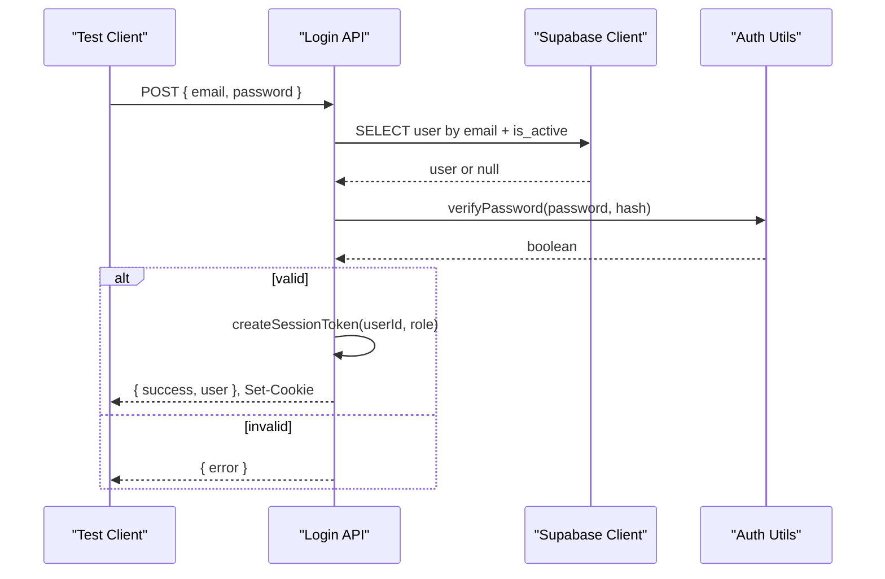

**Diagram sources**
- [pages/api/auth/login.js:1-31](file://pages/api/auth/login.js#L1-L31)
- [lib/auth.js:1-47](file://lib/auth.js#L1-L47)
- [lib/supabase.js:1-23](file://lib/supabase.js#L1-L23)

**Section sources**
- [pages/api/auth/login.js:1-31](file://pages/api/auth/login.js#L1-L31)

### Ticket Purchase API Route (pages/api/tickets/purchase.js)
Responsibilities:
- Validate inputs
- Check ticket type availability
- Apply promo codes
- Create Stripe Checkout session or create tickets immediately for other methods
- Record payments and update sold quantities

Testing strategy:
- Integration tests for Stripe path: mock stripe.checkout.sessions.create and assert returned checkoutUrl
- Integration tests for non-Stripe path: assert ticket inserts and payment records
- Promo code discount logic tests
- Availability checks and error responses

Mocking:
- Mock Supabase client queries and updates
- Mock Stripe SDK dynamically imported within route

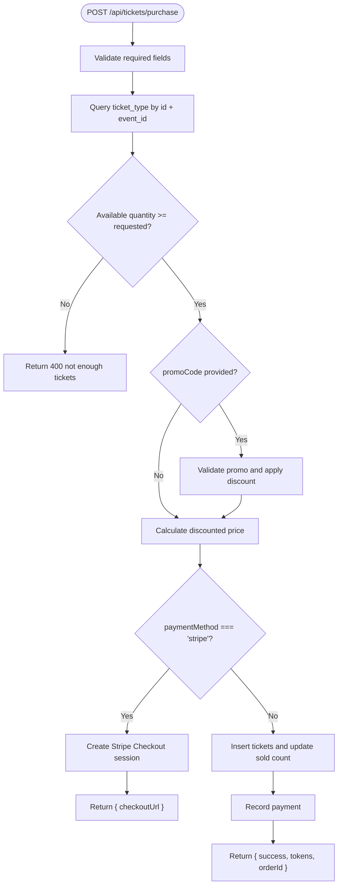

**Diagram sources**
- [pages/api/tickets/purchase.js:1-123](file://pages/api/tickets/purchase.js#L1-L123)

**Section sources**
- [pages/api/tickets/purchase.js:1-123](file://pages/api/tickets/purchase.js#L1-L123)

### Stripe Success Callback (pages/api/tickets/stripe-success.js)
Responsibilities:
- Retrieve Stripe session and validate payment status
- Create tickets based on metadata
- Update ticket type sold counts
- Record payment and redirect to first ticket page

Testing strategy:
- Integration tests for successful payment flow
- Tests for invalid session_id and failed payment redirects
- Assertions on ticket creation and payment recording

Mocking:
- Mock Stripe SDK retrieve()
- Mock Supabase client insert/update/select

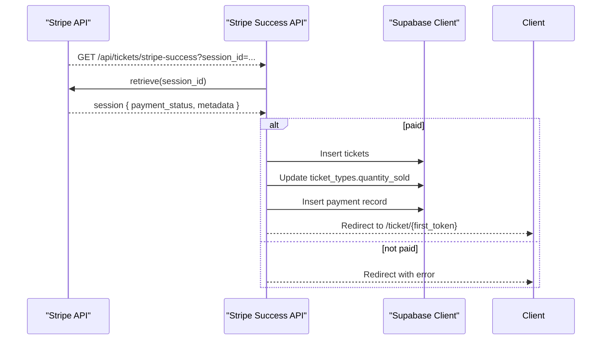

**Diagram sources**
- [pages/api/tickets/stripe-success.js:1-55](file://pages/api/tickets/stripe-success.js#L1-L55)

**Section sources**
- [pages/api/tickets/stripe-success.js:1-55](file://pages/api/tickets/stripe-success.js#L1-L55)

### Check-in Scan API Route (pages/api/checkin/scan.js)
Responsibilities:
- Enforce role-based access
- Validate token and eventId
- Determine ticket validity and prevent duplicate check-ins
- Mark ticket as checked in and log check-in event

Testing strategy:
- Integration tests for valid scan flow
- Negative tests for invalid token, cancelled/refunded tickets, already used
- Role enforcement tests for unauthorized staff

Mocking:
- Mock Supabase client queries and updates
- Mock requireRole to simulate different roles

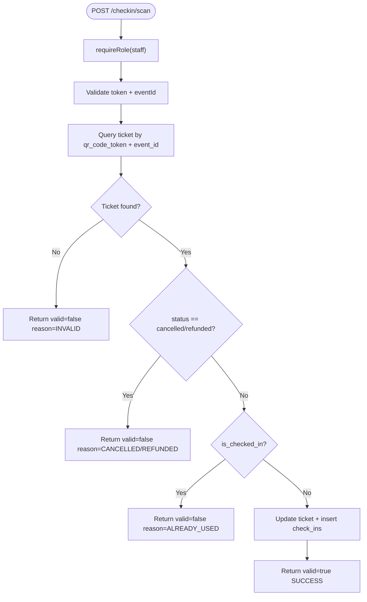

**Diagram sources**
- [pages/api/checkin/scan.js:1-44](file://pages/api/checkin/scan.js#L1-L44)
- [lib/auth.js:39-46](file://lib/auth.js#L39-L46)

**Section sources**
- [pages/api/checkin/scan.js:1-44](file://pages/api/checkin/scan.js#L1-L44)

### UI Components

#### Button (components/ui/Button.js)
Responsibilities:
- Render button with variants, sizes, disabled/loading states
- Handle mouse-down ripple effect via CSS custom properties
- Support fullWidth and style overrides

Testing strategy:
- Render tests to assert classes and attributes
- Interaction tests for onClick and disabled state
- Loading state rendering assertions

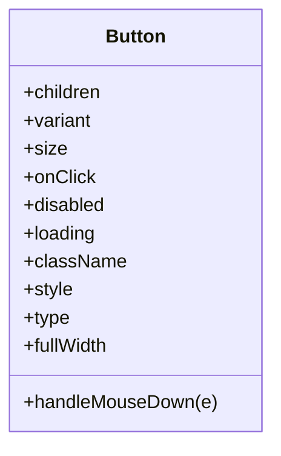

**Diagram sources**
- [components/ui/Button.js:1-74](file://components/ui/Button.js#L1-L74)

**Section sources**
- [components/ui/Button.js:1-74](file://components/ui/Button.js#L1-L74)

#### Toast Provider and Hook (components/ui/Toast.js)
Responsibilities:
- Manage toast notifications via context
- Auto-dismiss with configurable duration
- Provide convenience methods (success, error, warning, info)

Testing strategy:
- Context provider tests to assert toast list updates
- Hook usage tests to verify showToast and remove behaviors
- Accessibility assertions for roles and aria-labels

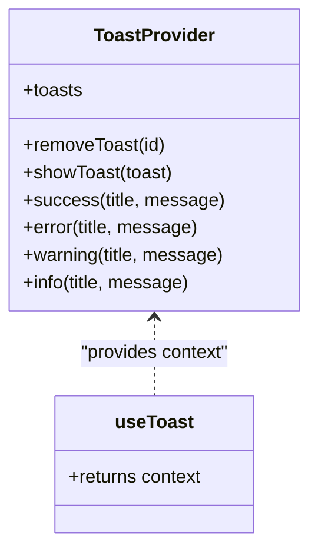

**Diagram sources**
- [components/ui/Toast.js:1-84](file://components/ui/Toast.js#L1-L84)

**Section sources**
- [components/ui/Toast.js:1-84](file://components/ui/Toast.js#L1-L84)

#### CountdownTimer (components/ui/CountdownTimer.js)
Responsibilities:
- Compute time remaining until target
- Update every second and trigger onExpire callback
- Render compact or detailed views

Testing strategy:
- Unit tests for compute function boundary conditions
- Integration tests for interval updates and expiration callback
- Snapshot tests for rendered output in both modes

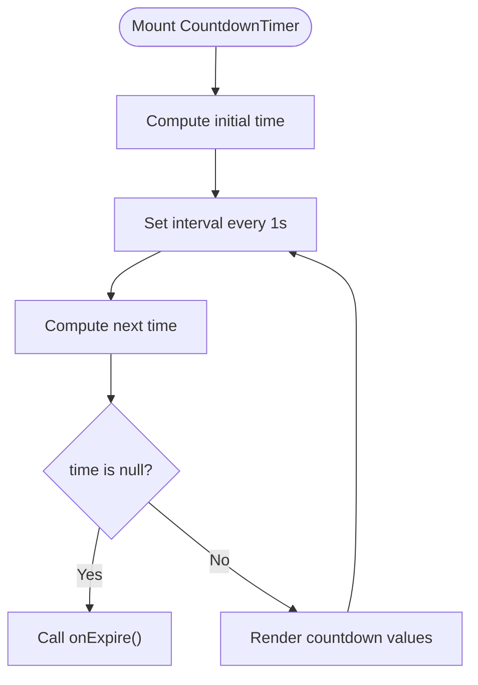

**Diagram sources**
- [components/ui/CountdownTimer.js:1-109](file://components/ui/CountdownTimer.js#L1-L109)

**Section sources**
- [components/ui/CountdownTimer.js:1-109](file://components/ui/CountdownTimer.js#L1-L109)

## Dependency Analysis
External dependencies relevant to testing:
- Supabase client for database operations
- Stripe SDK for payment processing
- bcryptjs for password hashing
- uuid for generating unique tokens

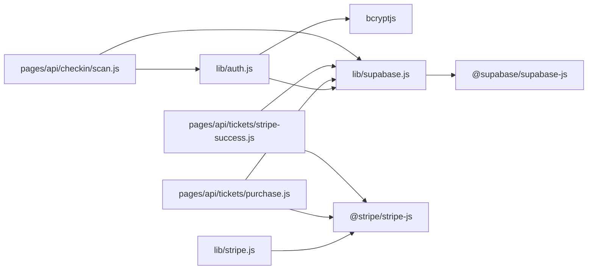

**Diagram sources**
- [lib/auth.js:1-47](file://lib/auth.js#L1-L47)
- [lib/supabase.js:1-23](file://lib/supabase.js#L1-L23)
- [lib/stripe.js:1-6](file://lib/stripe.js#L1-L6)
- [pages/api/tickets/purchase.js:1-123](file://pages/api/tickets/purchase.js#L1-L123)
- [pages/api/tickets/stripe-success.js:1-55](file://pages/api/tickets/stripe-success.js#L1-L55)
- [pages/api/checkin/scan.js:1-44](file://pages/api/checkin/scan.js#L1-L44)

**Section sources**
- [package.json:1-24](file://package.json#L1-L24)

## Performance Considerations
- Avoid heavy computations in component renders; memoize expensive results where appropriate.
- Debounce or throttle frequent events (e.g., search inputs).
- For API routes, batch database operations and minimize round-trips.
- Use Supabase indexes defined in schema to optimize queries during tests and production.
- In E2E tests, avoid unnecessary waits; rely on assertions and network stubs.

[No sources needed since this section provides general guidance]

## Troubleshooting Guide
Common issues and resolutions:
- Missing environment variables: Ensure .env.local contains Supabase and Stripe keys; tests should mock these explicitly.
- Supabase RLS policies: Confirm service role client bypasses policies in tests; otherwise, configure permissive policies for test environments.
- Stripe test mode: Use Stripe test keys and fixtures; mock webhook payloads for success scenarios.
- Cookie parsing: Validate cookie format in tests for tf_session; ensure proper encoding/decoding.
- Duplicate check-ins: Assert idempotency and proper state transitions in check-in tests.

**Section sources**
- [lib/supabase.js:6-8](file://lib/supabase.js#L6-L8)
- [supabase/schema.sql:120-143](file://supabase/schema.sql#L120-L143)
- [pages/api/checkin/scan.js:24-28](file://pages/api/checkin/scan.js#L24-L28)

## Conclusion
A robust testing strategy for TicketFlow combines unit tests for utilities and components, integration tests for API routes with mocked external services, and end-to-end tests for critical user journeys. By organizing tests cohesively, mocking dependencies effectively, and enforcing coverage thresholds, the team can maintain reliability across authentication, payments, and check-in workflows.

[No sources needed since this section summarizes without analyzing specific files]

## Appendices

### Test Organization
Recommended structure:
- tests/unit: Pure functions and small utilities (auth helpers, price calculations)
- tests/components: React component tests using React Testing Library
- tests/integration: API route tests using Jest + Supertest or Next.js testing utilities
- tests/e2e: Cypress or Playwright tests for full flows

### Mocking Strategies
- Supabase: Mock client methods like from().select().eq().single(), insert(), update()
- Stripe: Mock stripe.checkout.sessions.create/retrieve and webhook payloads
- Environment: Mock process.env for all required keys
- Time: Use jest.useFakeTimers() for timers in CountdownTimer tests

### Test Data Management
- Seed minimal data for each test scenario
- Use unique identifiers to avoid collisions
- Clean up after tests or use transaction rollback where possible

### Code Coverage Requirements
- Enforce minimum thresholds for lines, branches, functions, and statements
- Exclude generated files and configuration
- Report coverage in CI pipelines

### Continuous Integration Setup
- Run unit and integration tests on pull requests
- Execute E2E tests on main branch deployments
- Cache dependencies and browser binaries
- Upload coverage reports

### Performance Testing Approaches
- Load test API routes with tools like k6 or Artillery
- Measure Supabase query latency and Stripe API response times
- Profile React components with React DevTools Profiler

### Example Scenarios

#### Authentication Flow
- Valid login: assert success response and Set-Cookie header
- Invalid credentials: assert 401 and error message
- Inactive user: assert 401 and error message
- Missing fields: assert 400 and validation error

#### Payment Processing
- Stripe path: assert checkoutUrl returned and Stripe session created
- Non-Stripe path: assert tickets inserted and payment recorded
- Promo code applied: assert discounted price and updated promo usage
- Insufficient availability: assert 400 error

#### Real-time Check-in
- Valid scan: assert ticket marked used and check-in logged
- Already used: assert ALREADY_USED response with timestamp
- Cancelled/refunded: assert appropriate reasons
- Unauthorized staff: assert 401/403

**Section sources**
- [pages/api/auth/login.js:1-31](file://pages/api/auth/login.js#L1-L31)
- [pages/api/tickets/purchase.js:1-123](file://pages/api/tickets/purchase.js#L1-L123)
- [pages/api/tickets/stripe-success.js:1-55](file://pages/api/tickets/stripe-success.js#L1-L55)
- [pages/api/checkin/scan.js:1-44](file://pages/api/checkin/scan.js#L1-L44)
- [supabase/schema.sql:1-166](file://supabase/schema.sql#L1-L166)