# Component Testing

<cite>
**Referenced Files in This Document**
- [Button.js](file://components/ui/Button.js)
- [Card.js](file://components/ui/Card.js)
- [Input.js](file://components/ui/Input.js)
- [Badge.js](file://components/ui/Badge.js)
- [Progress.js](file://components/ui/Progress.js)
- [Skeleton.js](file://components/ui/Skeleton.js)
- [Toast.js](file://components/ui/Toast.js)
- [StepIndicator.js](file://components/ui/StepIndicator.js)
- [CountdownTimer.js](file://components/ui/CountdownTimer.js)
- [index.js](file://components/ui/index.js)
- [Layout.js](file://components/Layout.js)
- [AdminLayout.js](file://components/AdminLayout.js)
- [package.json](file://package.json)
</cite>

## Table of Contents
1. [Introduction](#introduction)
2. [Project Structure](#project-structure)
3. [Core Components](#core-components)
4. [Architecture Overview](#architecture-overview)
5. [Detailed Component Analysis](#detailed-component-analysis)
6. [Dependency Analysis](#dependency-analysis)
7. [Performance Considerations](#performance-considerations)
8. [Troubleshooting Guide](#troubleshooting-guide)
9. [Conclusion](#conclusion)
10. [Appendices](#appendices)

## Introduction
This document provides a comprehensive guide to testing TicketFlow’s UI components using Jest and React Testing Library. It covers prop validation, event handling simulation, state management, conditional rendering, accessibility verification, snapshot strategies, component composition patterns, and responsive design testing. The focus is on the Button, Card, Input, Badge, and layout components (Layout and AdminLayout), along with other supporting UI primitives such as Progress, Skeleton, Toast, StepIndicator, and CountdownTimer.

## Project Structure
TicketFlow organizes UI primitives under components/ui with a central index for exports. Layouts live at the root of components. There are no existing test files in the repository; this guide shows how to structure tests alongside the components.

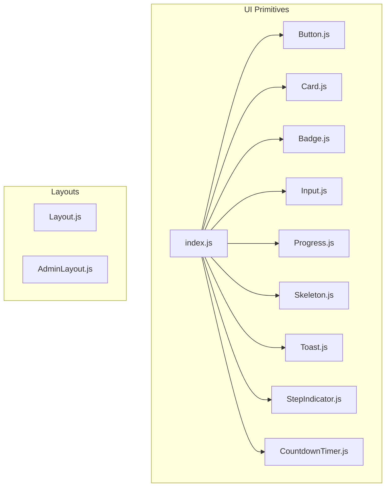

**Diagram sources**
- [index.js:1-10](file://components/ui/index.js#L1-L10)
- [Button.js:1-74](file://components/ui/Button.js#L1-L74)
- [Card.js:1-33](file://components/ui/Card.js#L1-L33)
- [Input.js:1-49](file://components/ui/Input.js#L1-L49)
- [Badge.js:1-30](file://components/ui/Badge.js#L1-L30)
- [Progress.js:1-39](file://components/ui/Progress.js#L1-L39)
- [Skeleton.js:1-48](file://components/ui/Skeleton.js#L1-L48)
- [Toast.js:1-84](file://components/ui/Toast.js#L1-L84)
- [StepIndicator.js:1-24](file://components/ui/StepIndicator.js#L1-L24)
- [CountdownTimer.js:1-109](file://components/ui/CountdownTimer.js#L1-L109)

**Section sources**
- [index.js:1-10](file://components/ui/index.js#L1-L10)
- [package.json:1-24](file://package.json#L1-L24)

## Core Components
This section outlines the key props, behaviors, and testing considerations for each core UI primitive.

- Button
  - Props: children, variant, size, onClick, disabled, loading, className, style, type, fullWidth, ...rest
  - Behaviors: renders a native button, applies classes based on variant/size, disables when loading or disabled, shows spinner when loading, supports mouseDown for visual ripple via CSS variables
  - Test focus: click handlers, disabled/loading states, class application, aria attributes if added, full-width behavior

- Card
  - Props: children, className, style, hoverable, glass, lift, accent, onClick, ...rest
  - Behaviors: renders a div with conditional classes based on glass/lift/accent; pointer cursor when onClick provided
  - Test focus: conditional classes, click propagation, custom styles and className merging

- Input
  - Props: label, error, helper, className, style, wrapperStyle, id, ...rest
  - Behaviors: renders label, input with error styling and aria-invalid, helper text or error message below
  - Test focus: label association via htmlFor/id, error vs helper visibility, aria-invalid attribute, forwarded props

- Badge
  - Props: children, variant, className, style, icon, ...rest
  - Behaviors: renders span with variant-based class; optional icon slot
  - Test focus: variant mapping to classes, icon rendering, content projection

- Progress
  - Props: value, max, color, showLabel, className, style, height
  - Behaviors: clamps percentage between 0–100, updates bar width, optionally shows label with value/max and percentage
  - Test focus: percentage calculation, label visibility, style/class merging

- Skeleton
  - Props: variant, width, height, className, style, count
  - Behaviors: renders one or multiple skeletons; sets default dimensions per variant; applies variant-specific classes
  - Test focus: count rendering, variant defaults, style/class merging

- Toast (Provider + hook)
  - Provides showToast, success, error, warning, info, remove
  - Renders toast list with roles and accessible labels; auto-dismiss by duration
  - Test focus: context availability, toast lifecycle, role/aria attributes, removal after duration

- StepIndicator
  - Props: steps array, currentStep number
  - Behaviors: marks steps as done/active; renders labels and connectors
  - Test focus: step states, labels, connector presence

- CountdownTimer
  - Props: target date string, compact, label, accent, onExpire
  - Behaviors: computes time parts, updates every second, calls onExpire when expired, renders different layouts based on compact
  - Test focus: timer updates, expiration callback, compact vs expanded rendering

**Section sources**
- [Button.js:1-74](file://components/ui/Button.js#L1-L74)
- [Card.js:1-33](file://components/ui/Card.js#L1-L33)
- [Input.js:1-49](file://components/ui/Input.js#L1-L49)
- [Badge.js:1-30](file://components/ui/Badge.js#L1-L30)
- [Progress.js:1-39](file://components/ui/Progress.js#L1-L39)
- [Skeleton.js:1-48](file://components/ui/Skeleton.js#L1-L48)
- [Toast.js:1-84](file://components/ui/Toast.js#L1-L84)
- [StepIndicator.js:1-24](file://components/ui/StepIndicator.js#L1-L24)
- [CountdownTimer.js:1-109](file://components/ui/CountdownTimer.js#L1-L109)

## Architecture Overview
The UI layer is composed of small, focused primitives that can be combined into higher-level pages and layouts. Layouts manage global concerns like navigation, theme switching, and authentication gating.

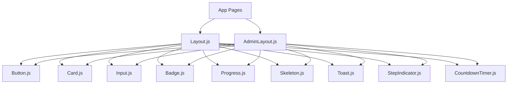

**Diagram sources**
- [Layout.js:1-281](file://components/Layout.js#L1-L281)
- [AdminLayout.js:1-194](file://components/AdminLayout.js#L1-L194)
- [index.js:1-10](file://components/ui/index.js#L1-L10)

## Detailed Component Analysis

### Button Component Testing
Key aspects to verify:
- Prop-driven classes: variant and size map to specific CSS classes
- Disabled and loading states: disabled attribute applied when either prop is true; spinner visible only when loading
- Event handling: onClick invoked on click; mouseDown handler sets CSS variables for ripple effect
- Accessibility: ensure semantic button element and proper type attribute

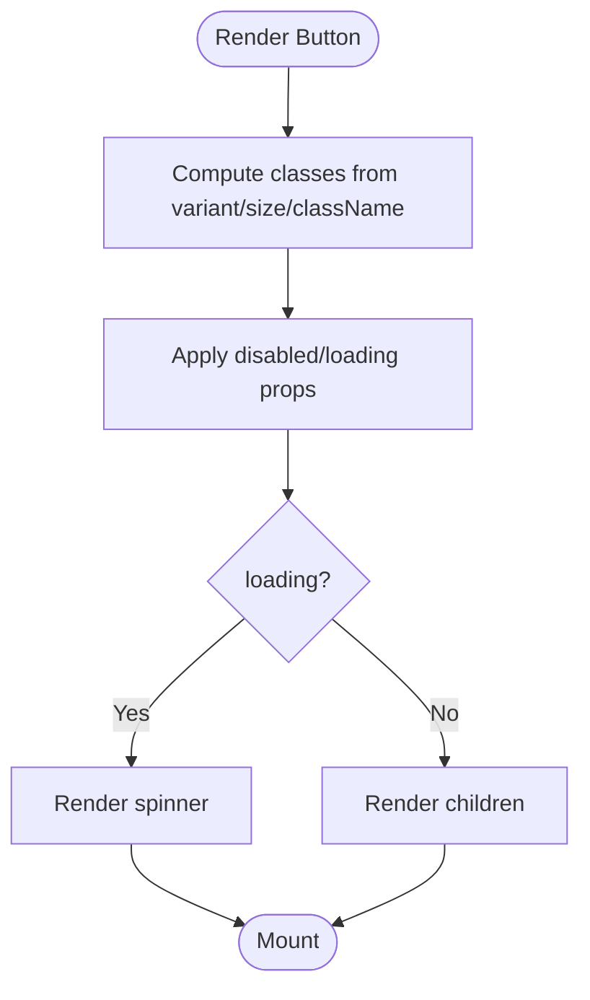

**Diagram sources**
- [Button.js:18-73](file://components/ui/Button.js#L18-L73)

Testing checklist:
- Verify rendered tag is a button with correct type
- Assert classes include expected variant and size tokens
- Confirm disabled attribute when disabled or loading
- Simulate click and assert onClick called once
- Simulate mouseDown and assert CSS variables set on ref element
- Snapshot render for default and variant variations

**Section sources**
- [Button.js:1-74](file://components/ui/Button.js#L1-L74)

### Card Component Testing
Key aspects to verify:
- Conditional classes based on glass, lift, accent
- Pointer cursor when onClick provided
- Forwarding rest props and merging styles

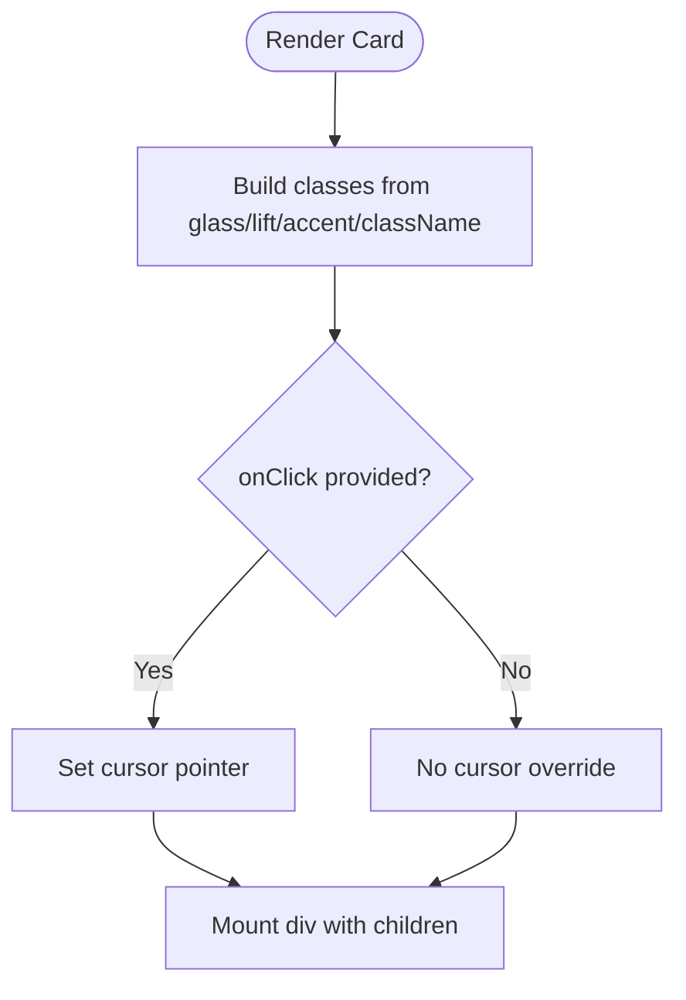

**Diagram sources**
- [Card.js:1-32](file://components/ui/Card.js#L1-L32)

Testing checklist:
- Assert presence of base card class and conditional modifiers
- Check cursor style when onClick exists
- Validate style merging and className concatenation
- Click simulation to ensure onClick fires

**Section sources**
- [Card.js:1-33](file://components/ui/Card.js#L1-L33)

### Input Component Testing
Key aspects to verify:
- Label association via htmlFor/id
- Error vs helper text visibility
- aria-invalid attribute when error present
- Forwarded props to input element

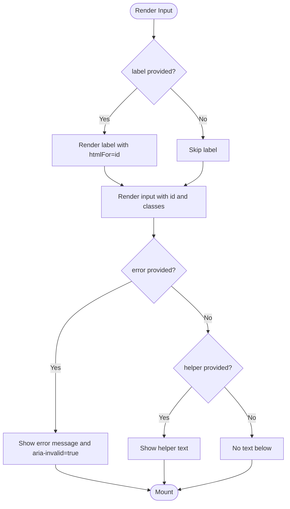

**Diagram sources**
- [Input.js:1-48](file://components/ui/Input.js#L1-L48)

Testing checklist:
- Assert label exists and htmlFor matches input id
- When error is set, verify error paragraph and aria-invalid
- When helper is set without error, verify helper paragraph
- Ensure input receives forwarded props (e.g., placeholder, name)

**Section sources**
- [Input.js:1-49](file://components/ui/Input.js#L1-L49)

### Badge Component Testing
Key aspects to verify:
- Variant-to-class mapping
- Optional icon slot
- Content projection

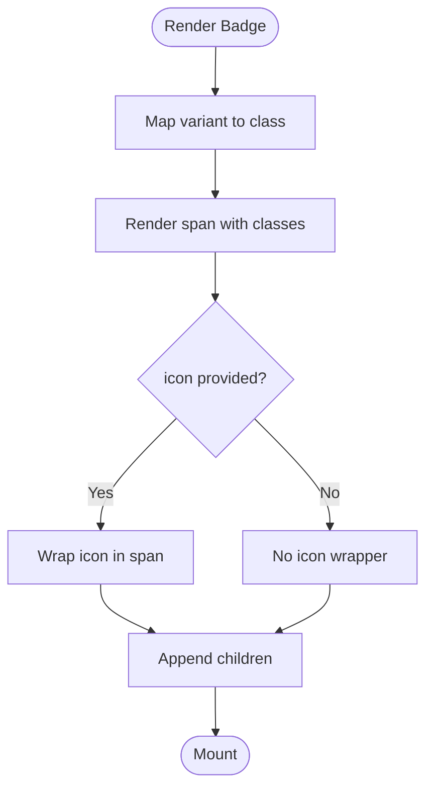

**Diagram sources**
- [Badge.js:1-29](file://components/ui/Badge.js#L1-L29)

Testing checklist:
- Assert variant class presence
- Verify icon slot renders when provided
- Snapshot for different variants and content

**Section sources**
- [Badge.js:1-30](file://components/ui/Badge.js#L1-L30)

### Progress Component Testing
Key aspects to verify:
- Percentage clamping between 0 and 100
- Bar width reflects percentage
- Label visibility toggled by showLabel

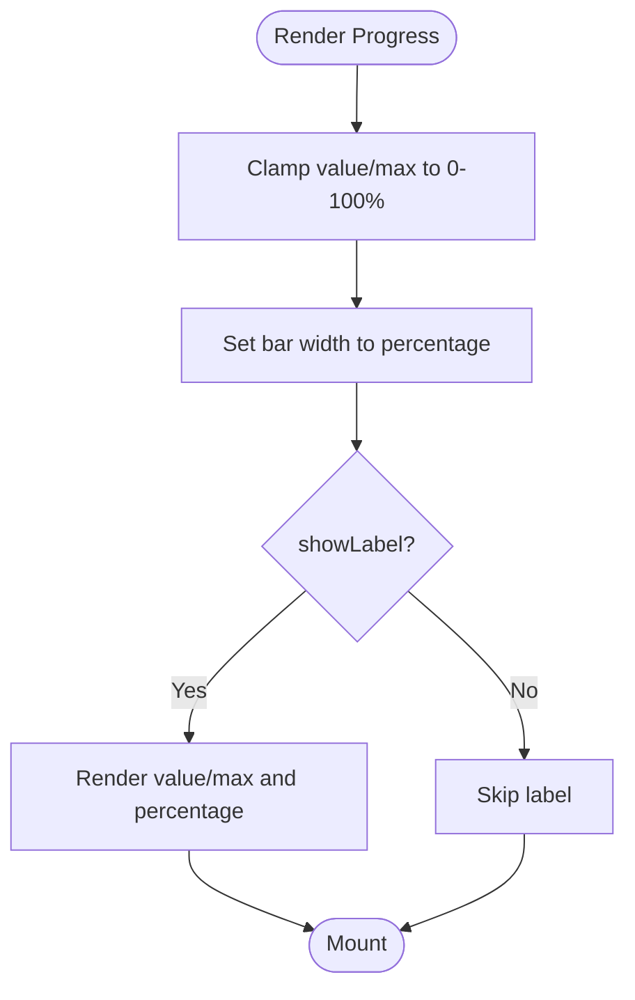

**Diagram sources**
- [Progress.js:1-38](file://components/ui/Progress.js#L1-L38)

Testing checklist:
- Assert bar width style equals computed percentage
- Verify label content when showLabel is true
- Test edge cases: value < 0, value > max

**Section sources**
- [Progress.js:1-39](file://components/ui/Progress.js#L1-L39)

### Skeleton Component Testing
Key aspects to verify:
- Default dimensions per variant
- Multiple skeleton rendering via count
- Style and class merging

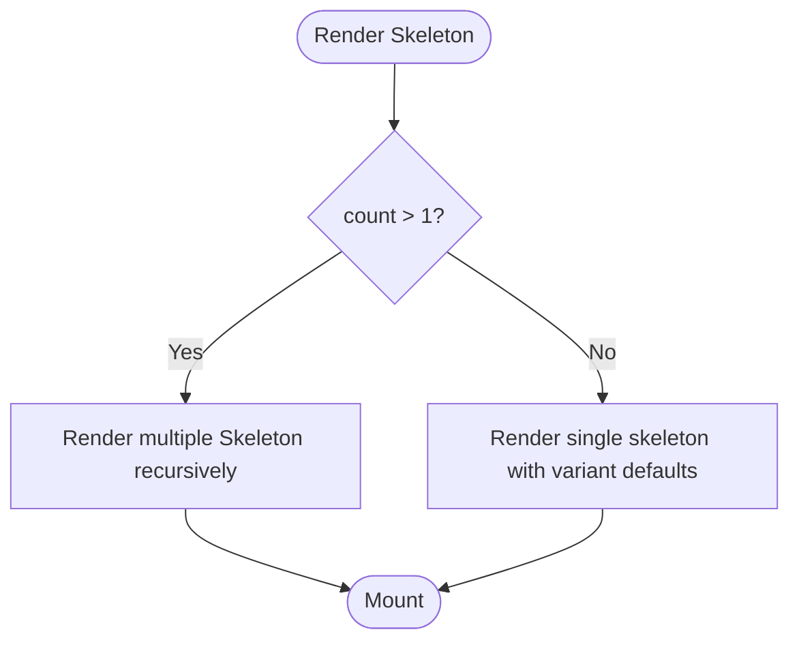

**Diagram sources**
- [Skeleton.js:1-47](file://components/ui/Skeleton.js#L1-L47)

Testing checklist:
- Assert default minHeight and borderRadius per variant
- Verify count renders multiple items
- Validate style and className merging

**Section sources**
- [Skeleton.js:1-48](file://components/ui/Skeleton.js#L1-L48)

### Toast Provider and Hook Testing
Key aspects to verify:
- Context availability and error when used outside provider
- Toast lifecycle: add, auto-remove after duration, manual remove
- Roles and accessible labels for screen readers

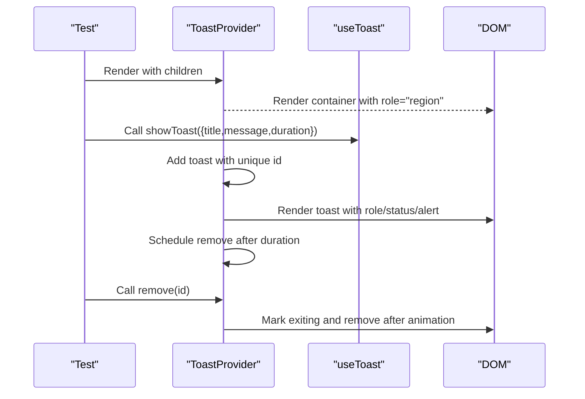

**Diagram sources**
- [Toast.js:1-84](file://components/ui/Toast.js#L1-L84)

Testing checklist:
- Assert container has role and aria-label
- Verify toasts appear with correct variant classes and roles
- Auto-dismiss after duration; manual dismiss works
- Error thrown when useToast used outside provider

**Section sources**
- [Toast.js:1-84](file://components/ui/Toast.js#L1-L84)

### StepIndicator Component Testing
Key aspects to verify:
- Step states: done, active, default
- Labels and connector lines

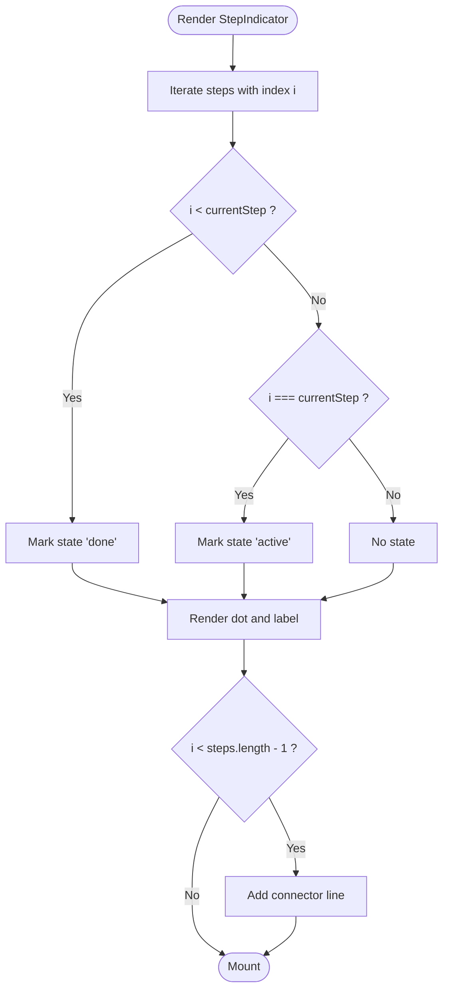

**Diagram sources**
- [StepIndicator.js:1-23](file://components/ui/StepIndicator.js#L1-L23)

Testing checklist:
- Assert step dots show checkmark for done steps
- Active step highlights appropriately
- Connector lines present between steps

**Section sources**
- [StepIndicator.js:1-24](file://components/ui/StepIndicator.js#L1-L24)

### CountdownTimer Component Testing
Key aspects to verify:
- Time computation and interval updates
- Expiration callback invocation
- Compact vs expanded rendering

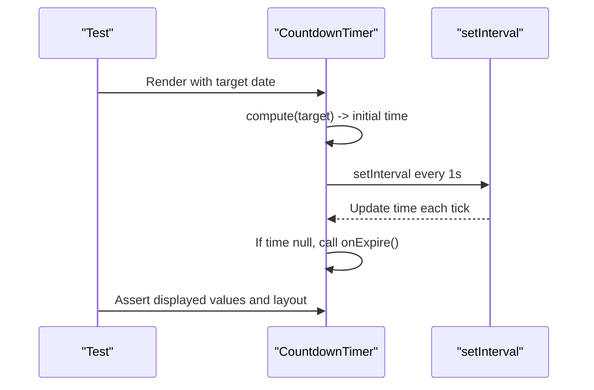

**Diagram sources**
- [CountdownTimer.js:1-109](file://components/ui/CountdownTimer.js#L1-L109)

Testing checklist:
- Mock Date.now or use timers to control time progression
- Verify countdown values update correctly
- Assert onExpire called when time expires
- Snapshot compact and expanded modes

**Section sources**
- [CountdownTimer.js:1-109](file://components/ui/CountdownTimer.js#L1-L109)

### Layout Components Testing

#### Layout
Responsibilities:
- Head metadata
- Navigation with mobile menu toggle
- Theme switcher persisted to localStorage
- Scroll detection affecting nav appearance

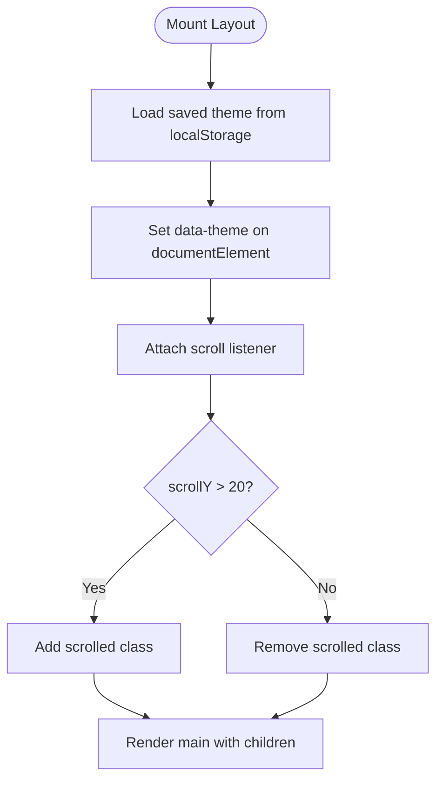

**Diagram sources**
- [Layout.js:1-281](file://components/Layout.js#L1-L281)

Testing checklist:
- Assert head tags contain title and description
- Verify theme persistence and data-theme attribute
- Simulate scroll events and assert nav class changes
- Mobile menu toggle visibility and interactions

**Section sources**
- [Layout.js:1-281](file://components/Layout.js#L1-L281)

#### AdminLayout
Responsibilities:
- Authentication check via API
- Sidebar navigation with active state
- Logout action and redirection

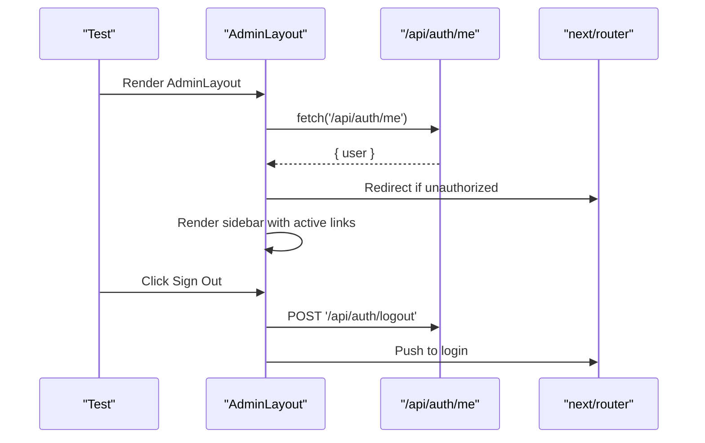

**Diagram sources**
- [AdminLayout.js:1-194](file://components/AdminLayout.js#L1-L194)

Testing checklist:
- Mock fetch and router to simulate auth flows
- Assert redirect behavior for unauthorized users
- Verify sidebar active link highlighting
- Logout triggers API call and navigation

**Section sources**
- [AdminLayout.js:1-194](file://components/AdminLayout.js#L1-L194)

## Dependency Analysis
Components primarily depend on React APIs and Next.js router where applicable. The UI index re-exports primitives for consistent imports.

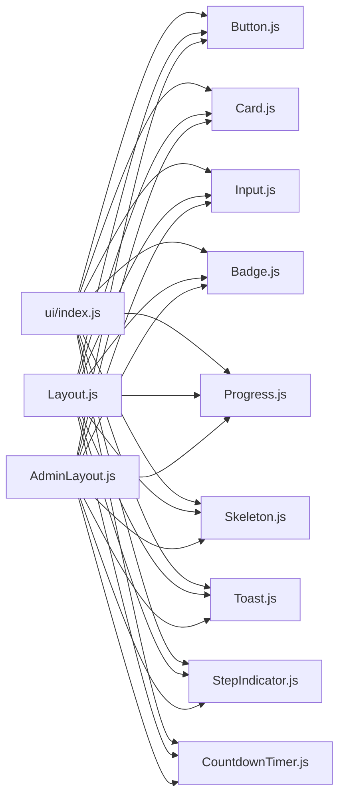

**Diagram sources**
- [index.js:1-10](file://components/ui/index.js#L1-L10)
- [Layout.js:1-281](file://components/Layout.js#L1-L281)
- [AdminLayout.js:1-194](file://components/AdminLayout.js#L1-L194)

**Section sources**
- [index.js:1-10](file://components/ui/index.js#L1-L10)

## Performance Considerations
- Prefer functional assertions over snapshots for dynamic content (e.g., countdown values).
- Use jest.useFakeTimers() to control time-sensitive components like CountdownTimer.
- Avoid heavy snapshot usage for components with frequent state changes; prefer targeted queries and assertions.
- Debounce scroll listeners in tests if necessary; mock window scroll events efficiently.
- Keep test fixtures minimal; reuse shared mocks for fetch and router.

[No sources needed since this section provides general guidance]

## Troubleshooting Guide
Common issues and resolutions:
- Missing dependencies: Ensure Jest and React Testing Library are installed; configure setup files for Next.js environment if needed.
- Router mocking: next/router must be mocked to avoid hydration errors in tests.
- Fetch mocking: Use jest.fn() or MSW to mock API calls for AdminLayout authentication checks.
- Timers: For CountdownTimer, advance timers manually to avoid long-running tests.
- Context errors: Wrap components using useToast within ToastProvider in tests.

**Section sources**
- [AdminLayout.js:17-28](file://components/AdminLayout.js#L17-L28)
- [Toast.js:79-83](file://components/ui/Toast.js#L79-L83)
- [CountdownTimer.js:24-32](file://components/ui/CountdownTimer.js#L24-L32)

## Conclusion
By following the testing strategies outlined here, you can build robust, maintainable tests for TicketFlow’s UI components. Focus on prop validation, event simulation, state transitions, accessibility, and composition patterns. Use snapshots judiciously and prioritize deterministic assertions for reliability across environments.

[No sources needed since this section summarizes without analyzing specific files]

## Appendices

### Recommended Test Setup
- Install Jest and React Testing Library
- Configure Next.js testing utilities if required
- Create a setup file to mock next/router and fetch
- Organize tests alongside components (e.g., Button.test.js)

[No sources needed since this section provides general guidance]