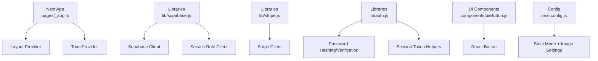
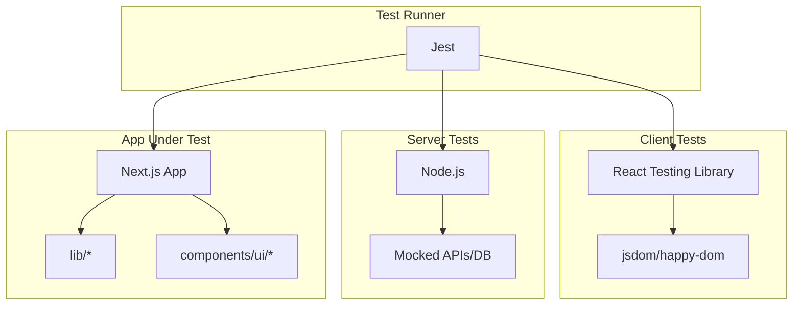
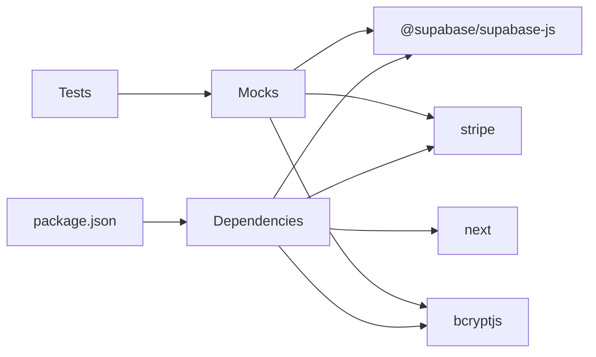
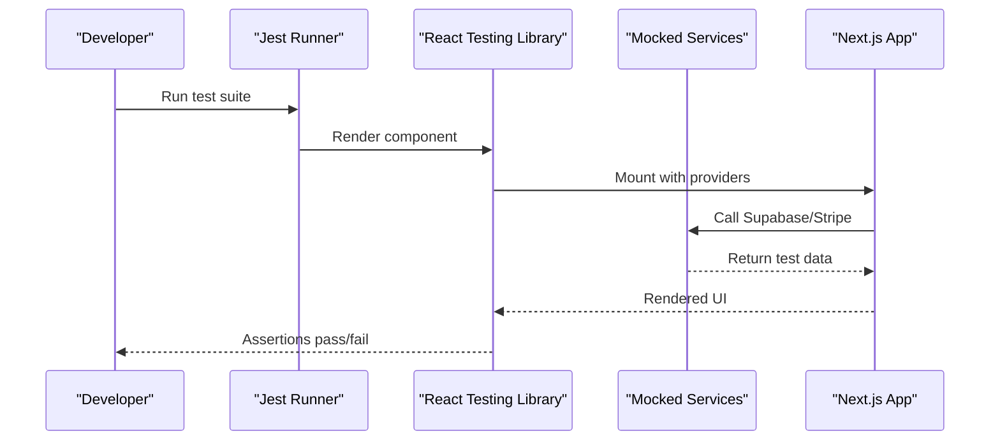
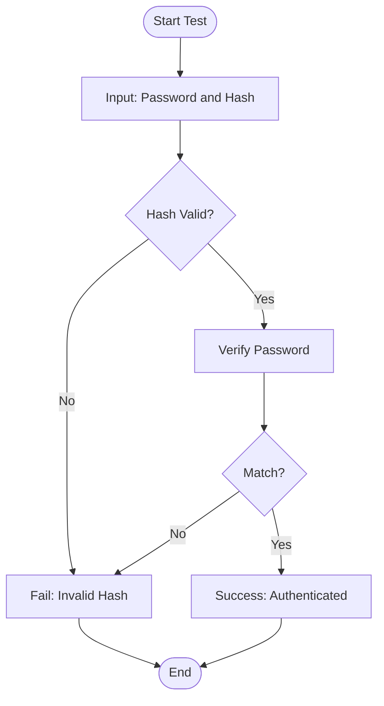

# Test Configuration & Setup

<cite>
**Referenced Files in This Document**
- [package.json](file://package.json)
- [next.config.js](file://next.config.js)
- [.gitignore](file://.gitignore)
- [pages/_app.js](file://pages/_app.js)
- [lib/supabase.js](file://lib/supabase.js)
- [lib/auth.js](file://lib/auth.js)
- [lib/stripe.js](file://lib/stripe.js)
- [components/ui/Button.js](file://components/ui/Button.js)
</cite>

## Table of Contents
1. [Introduction](#introduction)
2. [Project Structure](#project-structure)
3. [Core Components](#core-components)
4. [Architecture Overview](#architecture-overview)
5. [Detailed Component Analysis](#detailed-component-analysis)
6. [Dependency Analysis](#dependency-analysis)
7. [Performance Considerations](#performance-considerations)
8. [Troubleshooting Guide](#troubleshooting-guide)
9. [Conclusion](#conclusion)
10. [Appendices](#appendices)

## Introduction
This document defines the testing configuration and setup for TicketFlow, a Next.js application. It explains how to configure Jest with React Testing Library, set up custom matchers and global test utilities, and manage separate environments for server-side and client-side code. It also covers environment variables, test database connections, test file organization, naming conventions, CI/CD integration, performance optimization, parallel execution, and debugging strategies.

## Project Structure
TicketFlow is a Next.js app with:
- Pages and API routes under pages/
- Shared libraries under lib/ (Supabase client, Stripe client, auth helpers)
- Reusable UI components under components/ui/
- Global app wrapper in pages/_app.js
- Next.js configuration in next.config.js
- Environment variable handling via .env files (ignored by .gitignore)

**Diagram sources**
- [pages/_app.js:1-14](file://pages/_app.js#L1-L14)
- [lib/supabase.js:1-23](file://lib/supabase.js#L1-L23)
- [lib/stripe.js:1-5](file://lib/stripe.js#L1-L5)
- [lib/auth.js:1-47](file://lib/auth.js#L1-L47)
- [components/ui/Button.js:1-74](file://components/ui/Button.js#L1-L74)
- [next.config.js:1-14](file://next.config.js#L1-L14)

**Section sources**
- [package.json:1-24](file://package.json#L1-L24)
- [next.config.js:1-14](file://next.config.js#L1-L14)
- [.gitignore:1-32](file://.gitignore#L1-L32)
- [pages/_app.js:1-14](file://pages/_app.js#L1-L14)

## Core Components
- Supabase client initialization and service role client for server-side operations
- Stripe client initialization for payment flows
- Authentication helpers for password hashing, verification, session token creation/parsing, and role enforcement
- UI component library including a reusable Button component
- Next.js app wrapper that provides layout and toast context

These modules are central to both runtime behavior and testing strategy because they interact with external services and environment variables.

**Section sources**
- [lib/supabase.js:1-23](file://lib/supabase.js#L1-L23)
- [lib/stripe.js:1-5](file://lib/stripe.js#L1-L5)
- [lib/auth.js:1-47](file://lib/auth.js#L1-L47)
- [components/ui/Button.js:1-74](file://components/ui/Button.js#L1-L74)
- [pages/_app.js:1-14](file://pages/_app.js#L1-L14)

## Architecture Overview
The testing architecture separates concerns between client and server code:
- Client tests run in a browser-like environment using jsdom or happy-dom
- Server tests run in Node.js against mocked APIs and databases
- External services (Supabase, Stripe) are mocked in tests
- Environment variables are isolated per test suite

[No sources needed since this diagram shows conceptual workflow, not actual code structure]

## Detailed Component Analysis

### Jest and React Testing Library Setup
- Install Jest and React Testing Library as dev dependencies
- Configure Jest to work with Next.js and React
- Use React Testing Library for rendering and assertions
- Set up custom matchers for domain-specific assertions
- Provide global test utilities for common patterns (e.g., creating mock users, events, tokens)

Key considerations:
- Ensure Next.js strict mode is respected in tests
- Mock external clients (Supabase, Stripe) consistently across suites
- Isolate environment variables per test file or suite

**Section sources**
- [package.json:1-24](file://package.json#L1-L24)
- [next.config.js:1-14](file://next.config.js#L1-L14)

### Client-Side Testing Configuration
- Use a browser-like environment (jsdom or happy-dom) for React components
- Wrap tests with providers used in pages/_app.js (e.g., ToastProvider)
- Render components using React Testing Library
- Assert interactions and state changes

Example focus areas:
- Button component behavior (clicks, loading states, disabled states)
- Layout provider behavior
- Toast notifications

**Section sources**
- [pages/_app.js:1-14](file://pages/_app.js#L1-L14)
- [components/ui/Button.js:1-74](file://components/ui/Button.js#L1-L74)

### Server-Side Testing Configuration
- Run tests in Node.js environment
- Mock API routes and database calls
- Use Supabase service role client mocks for admin operations
- Validate authentication and authorization logic

Focus areas:
- Password hashing and verification
- Session token creation and parsing
- Role enforcement middleware

**Section sources**
- [lib/auth.js:1-47](file://lib/auth.js#L1-L47)
- [lib/supabase.js:1-23](file://lib/supabase.js#L1-L23)

### Environment Variables and Secrets Management
- Define environment variables for Supabase, Stripe, and other services
- Use .env.test.local for test-specific values
- Never commit secrets; rely on .gitignore
- Provide placeholder values for non-critical paths during development

Relevant variables:
- NEXT_PUBLIC_SUPABASE_URL
- NEXT_PUBLIC_SUPABASE_ANON_KEY
- SUPABASE_SERVICE_ROLE_KEY
- STRIPE_SECRET_KEY

**Section sources**
- [.gitignore:1-32](file://.gitignore#L1-L32)
- [lib/supabase.js:1-23](file://lib/supabase.js#L1-L23)
- [lib/stripe.js:1-5](file://lib/stripe.js#L1-L5)

### Test Database Connections
- Use an isolated test database instance
- Seed data before running tests
- Reset or truncate tables after each test
- Mock Supabase client methods for deterministic tests

Best practices:
- Separate test credentials from production
- Use transactional rollback where possible
- Ensure consistent schema across environments

[No sources needed since this section provides general guidance]

### Custom Matchers and Global Utilities
- Create custom matchers for domain-specific assertions (e.g., ticket validity, promo codes)
- Provide global utilities for generating test fixtures (users, events, tickets)
- Centralize mocking strategies for external services

Implementation tips:
- Extend Jest's expect interface
- Use beforeEach/afterEach for setup and teardown
- Keep utilities small and focused

[No sources needed since this section provides general guidance]

### Test File Organization and Naming Conventions
- Place tests adjacent to source files or in dedicated test directories
- Use .test.js or .spec.js suffixes
- Group related tests into suites
- Mirror feature structure in test organization

Recommended structure:
- components/ui/Button.test.js
- lib/auth.test.js
- lib/supabase.test.js
- lib/stripe.test.js

**Section sources**
- [components/ui/Button.js:1-74](file://components/ui/Button.js#L1-L74)
- [lib/auth.js:1-47](file://lib/auth.js#L1-L47)
- [lib/supabase.js:1-23](file://lib/supabase.js#L1-L23)
- [lib/stripe.js:1-5](file://lib/stripe.js#L1-L5)

### CI/CD Pipeline Integration
- Add test scripts to package.json
- Configure CI to install dependencies and run tests
- Cache node_modules for faster builds
- Parallelize test suites for speed
- Collect coverage reports

Pipeline steps:
- Install dependencies
- Build Next.js app
- Run unit and integration tests
- Generate and upload coverage

**Section sources**
- [package.json:1-24](file://package.json#L1-L24)

## Dependency Analysis
External dependencies relevant to testing:
- Supabase client for database operations
- Stripe client for payment processing
- bcryptjs for password hashing
- Next.js framework features

Testing implications:
- Mock Supabase and Stripe clients
- Stub bcrypt functions for deterministic results
- Respect Next.js strict mode in tests

**Diagram sources**
- [package.json:1-24](file://package.json#L1-L24)
- [lib/supabase.js:1-23](file://lib/supabase.js#L1-L23)
- [lib/stripe.js:1-5](file://lib/stripe.js#L1-L5)
- [lib/auth.js:1-47](file://lib/auth.js#L1-L47)

**Section sources**
- [package.json:1-24](file://package.json#L1-L24)

## Performance Considerations
- Enable parallel test execution with Jest workers
- Use lightweight mocks for external services
- Avoid heavy setup in every test; use shared fixtures
- Leverage React Testing Library’s efficient rendering
- Minimize network calls by mocking responses

Optimization techniques:
- Split large test suites into smaller, focused suites
- Use test isolation to prevent interference
- Profile slow tests and refactor accordingly

[No sources needed since this section provides general guidance]

## Troubleshooting Guide
Common issues and resolutions:
- Missing environment variables: ensure .env.test.local is configured
- Supabase client warnings: verify URL and keys in test environment
- Stripe client errors: use test secret key and mock webhooks
- Auth failures: validate session token format and expiration
- Component rendering issues: wrap with necessary providers

Debugging strategies:
- Use console logs sparingly; prefer structured logging
- Inspect mock call arguments and return values
- Run tests with verbose output
- Isolate failing tests and reproduce locally

**Section sources**
- [lib/supabase.js:1-23](file://lib/supabase.js#L1-L23)
- [lib/stripe.js:1-5](file://lib/stripe.js#L1-L5)
- [lib/auth.js:1-47](file://lib/auth.js#L1-L47)

## Conclusion
This document outlines a comprehensive testing strategy for TicketFlow, covering Jest setup, React Testing Library integration, environment management, and performance optimization. By following these guidelines, you can build reliable, maintainable tests that ensure the stability and correctness of your Next.js application.

[No sources needed since this section summarizes without analyzing specific files]

## Appendices

### Example Test Workflow Sequence

**Diagram sources**
- [pages/_app.js:1-14](file://pages/_app.js#L1-L14)
- [lib/supabase.js:1-23](file://lib/supabase.js#L1-L23)
- [lib/stripe.js:1-5](file://lib/stripe.js#L1-L5)

### Flowchart for Authentication Testing

**Diagram sources**
- [lib/auth.js:1-47](file://lib/auth.js#L1-L47)