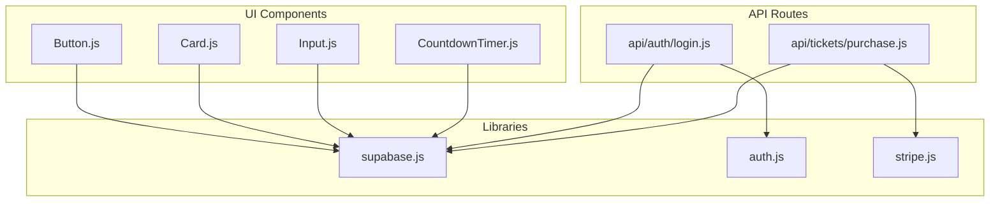
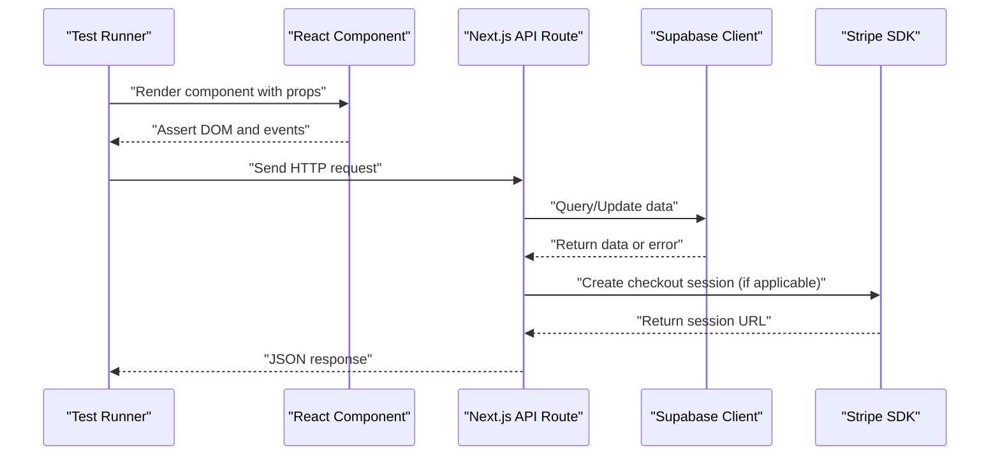
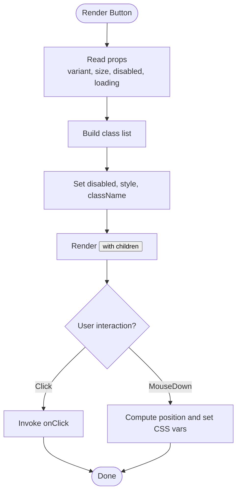
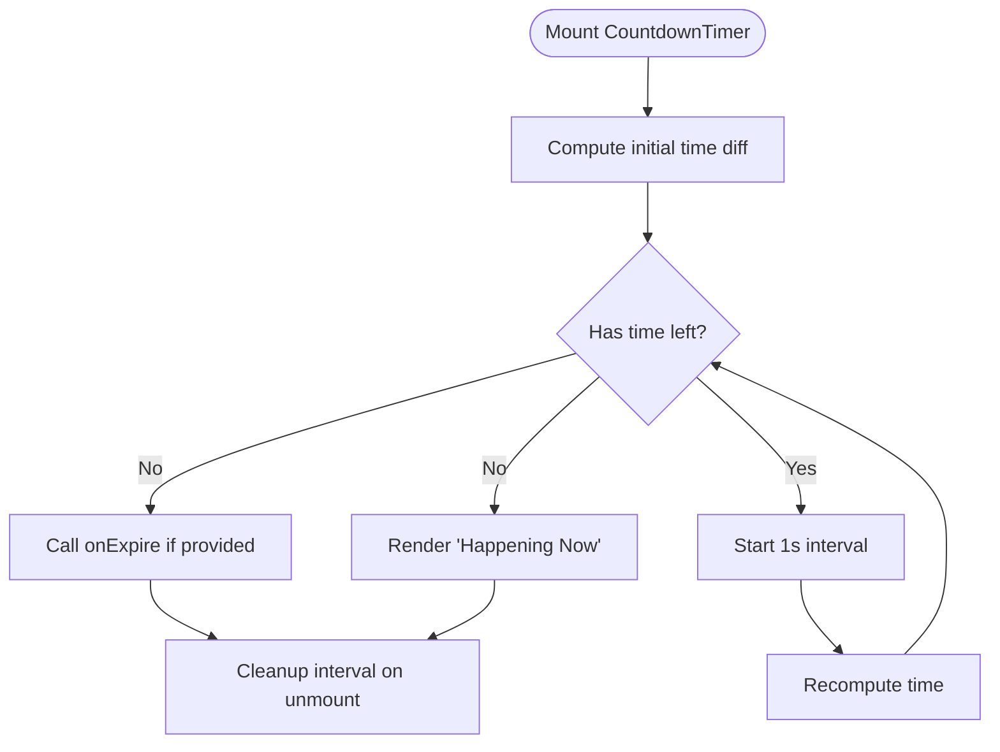
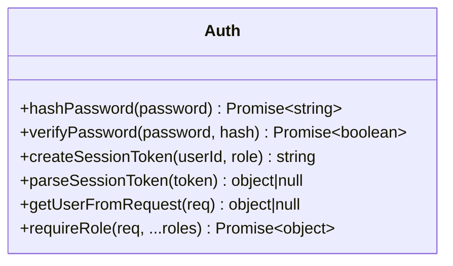
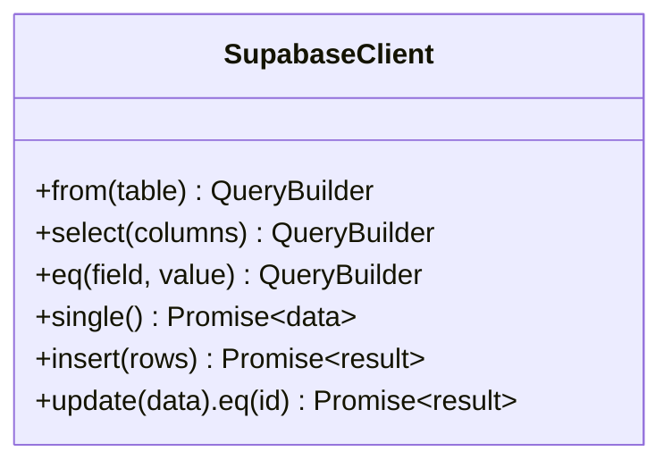
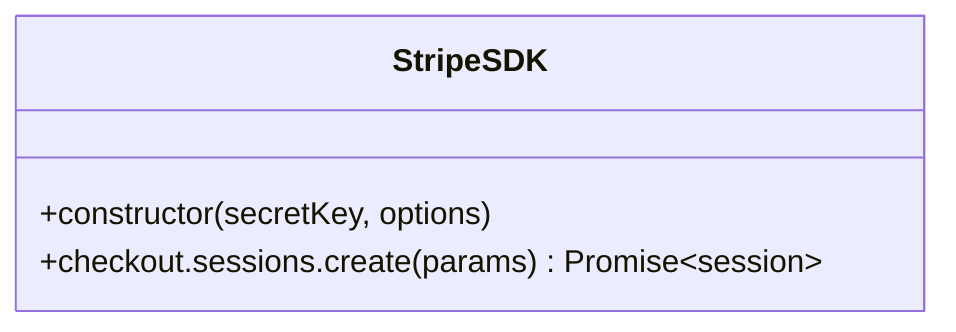
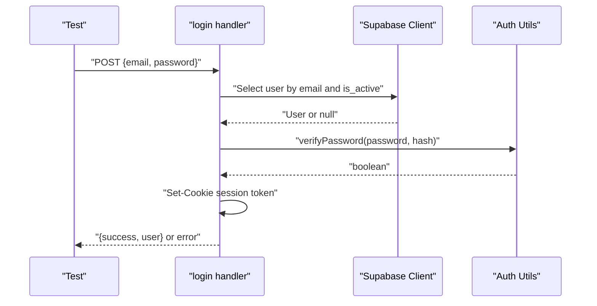
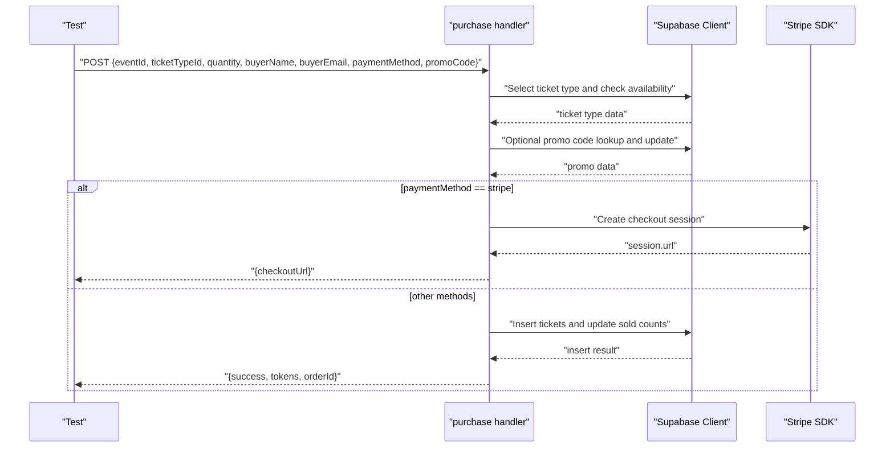
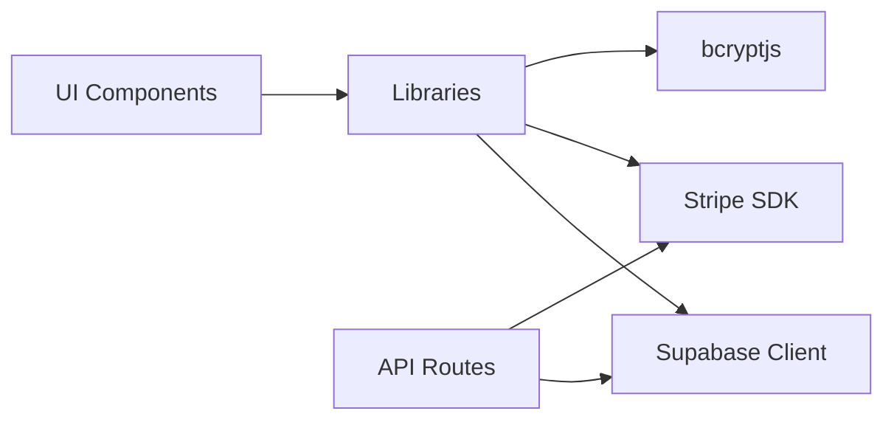

# Unit Testing

<cite>
**Referenced Files in This Document**
- [package.json](file://package.json)
- [next.config.js](file://next.config.js)
- [lib/supabase.js](file://lib/supabase.js)
- [lib/auth.js](file://lib/auth.js)
- [lib/stripe.js](file://lib/stripe.js)
- [components/ui/Button.js](file://components/ui/Button.js)
- [components/ui/Card.js](file://components/ui/Card.js)
- [components/ui/CountdownTimer.js](file://components/ui/CountdownTimer.js)
- [components/ui/Input.js](file://components/ui/Input.js)
- [pages/api/auth/login.js](file://pages/api/auth/login.js)
- [pages/api/tickets/purchase.js](file://pages/api/tickets/purchase.js)
</cite>

## Table of Contents
1. [Introduction](#introduction)
2. [Project Structure](#project-structure)
3. [Core Components](#core-components)
4. [Architecture Overview](#architecture-overview)
5. [Detailed Component Analysis](#detailed-component-analysis)
6. [Dependency Analysis](#dependency-analysis)
7. [Performance Considerations](#performance-considerations)
8. [Troubleshooting Guide](#troubleshooting-guide)
9. [Conclusion](#conclusion)
10. [Appendices](#appendices)

## Introduction
This document provides a comprehensive unit testing guide for TicketFlow’s React components, API routes, and utility libraries. It explains how to set up Jest with React Testing Library, how to test UI interactions, state management, authentication logic, Supabase client usage, and Stripe integration utilities. It also covers mocking external dependencies, testing asynchronous operations, verifying rendering, and establishing maintainable test organization and naming conventions.

## Project Structure
TicketFlow is a Next.js application with:
- UI components under components/ui
- Shared libraries for auth, Supabase client, and Stripe under lib
- API routes under pages/api
- Configuration via next.config.js and package.json scripts

**Diagram sources**
- [components/ui/Button.js:1-74](file://components/ui/Button.js#L1-L74)
- [components/ui/Card.js:1-33](file://components/ui/Card.js#L1-L33)
- [components/ui/Input.js:1-49](file://components/ui/Input.js#L1-L49)
- [components/ui/CountdownTimer.js:1-109](file://components/ui/CountdownTimer.js#L1-L109)
- [lib/supabase.js:1-23](file://lib/supabase.js#L1-L23)
- [lib/auth.js:1-47](file://lib/auth.js#L1-L47)
- [lib/stripe.js:1-6](file://lib/stripe.js#L1-L6)
- [pages/api/auth/login.js:1-31](file://pages/api/auth/login.js#L1-L31)
- [pages/api/tickets/purchase.js:1-123](file://pages/api/tickets/purchase.js#L1-L123)

**Section sources**
- [package.json:1-24](file://package.json#L1-L24)
- [next.config.js:1-14](file://next.config.js#L1-L14)

## Core Components
Key areas to focus on when writing tests:
- UI components: Button, Card, Input, CountdownTimer
- Authentication utilities: hashPassword, verifyPassword, session token helpers, requireRole
- Data clients: Supabase client (public and service role)
- Payment integration: Stripe client initialization and usage in purchase flow

Testing priorities:
- Render correctness and prop-driven behavior
- Event handling and user interactions
- State changes over time (timers, async updates)
- External dependency isolation via mocks
- API route request/response validation and error paths

**Section sources**
- [components/ui/Button.js:1-74](file://components/ui/Button.js#L1-L74)
- [components/ui/Card.js:1-33](file://components/ui/Card.js#L1-L33)
- [components/ui/Input.js:1-49](file://components/ui/Input.js#L1-L49)
- [components/ui/CountdownTimer.js:1-109](file://components/ui/CountdownTimer.js#L1-L109)
- [lib/auth.js:1-47](file://lib/auth.js#L1-L47)
- [lib/supabase.js:1-23](file://lib/supabase.js#L1-L23)
- [lib/stripe.js:1-6](file://lib/stripe.js#L1-L6)
- [pages/api/auth/login.js:1-31](file://pages/api/auth/login.js#L1-L31)
- [pages/api/tickets/purchase.js:1-123](file://pages/api/tickets/purchase.js#L1-L123)

## Architecture Overview
The system integrates UI components with backend APIs that interact with Supabase and Stripe. For testing:
- Isolate UI from network calls by mocking fetch or API responses
- Mock Supabase client methods used by API routes and any client-side queries
- Mock Stripe SDK to avoid real charges during tests
- Use environment variables for test configuration where needed

[No sources needed since this diagram shows conceptual workflow, not actual code structure]

## Detailed Component Analysis

### UI Components: Button
Responsibilities:
- Renders a button with variants, sizes, disabled/loading states
- Handles mouse-down ripple effect via refs
- Passes through standard button attributes

Testing guidance:
- Verify rendered classes based on variant and size props
- Assert disabled attribute when loading or disabled prop is true
- Simulate click and assert onClick callback invocation
- Validate aria attributes if added later

**Diagram sources**
- [components/ui/Button.js:1-74](file://components/ui/Button.js#L1-L74)

**Section sources**
- [components/ui/Button.js:1-74](file://components/ui/Button.js#L1-L74)

### UI Components: Card
Responsibilities:
- Renders a div with conditional styling based on glass, lift, accent, hoverable
- Supports onClick and passes through other attributes

Testing guidance:
- Assert presence of expected classes based on props
- Ensure cursor becomes pointer when onClick is provided
- Validate style overrides are applied

**Section sources**
- [components/ui/Card.js:1-33](file://components/ui/Card.js#L1-L33)

### UI Components: Input
Responsibilities:
- Renders label, input, and optional helper/error text
- Applies error styles and aria-invalid when error is present

Testing guidance:
- Assert label text and htmlFor association
- Validate error message visibility and styling
- Confirm aria-invalid reflects error prop

**Section sources**
- [components/ui/Input.js:1-49](file://components/ui/Input.js#L1-L49)

### UI Components: CountdownTimer
Responsibilities:
- Computes remaining time until target date
- Updates every second and triggers onExpire when expired
- Renders compact or full view based on props

Testing guidance:
- Mock Date.now to control time progression
- Assert initial computed values
- Advance timers and verify state updates
- Validate onExpire callback invocation after expiration

**Diagram sources**
- [components/ui/CountdownTimer.js:1-109](file://components/ui/CountdownTimer.js#L1-L109)

**Section sources**
- [components/ui/CountdownTimer.js:1-109](file://components/ui/CountdownTimer.js#L1-L109)

### Authentication Utilities
Responsibilities:
- Hashing and password verification using bcryptjs
- Session token creation and parsing
- Role-based authorization middleware function

Testing guidance:
- Verify hashing produces different hashes for same input
- Confirm verifyPassword returns correct boolean results
- Validate session token payload structure and expiration behavior
- Test requireRole with valid and invalid roles, missing cookies, and malformed tokens

**Diagram sources**
- [lib/auth.js:1-47](file://lib/auth.js#L1-L47)

**Section sources**
- [lib/auth.js:1-47](file://lib/auth.js#L1-L47)

### Supabase Client
Responsibilities:
- Exposes public client created from env variables
- Provides service role client for server-side privileged operations

Testing guidance:
- Mock createClient to return a fake Supabase instance
- Stub table queries and mutations used by API routes
- Ensure environment variables are set in test fixtures

**Diagram sources**
- [lib/supabase.js:1-23](file://lib/supabase.js#L1-L23)

**Section sources**
- [lib/supabase.js:1-23](file://lib/supabase.js#L1-L23)

### Stripe Integration
Responsibilities:
- Initializes Stripe SDK with secret key and apiVersion
- Used in purchase flow to create checkout sessions

Testing guidance:
- Mock Stripe constructor and checkout.sessions.create
- Validate parameters passed to create session
- Assert success_url and metadata fields

**Diagram sources**
- [lib/stripe.js:1-6](file://lib/stripe.js#L1-L6)

**Section sources**
- [lib/stripe.js:1-6](file://lib/stripe.js#L1-L6)

### API Route: Login
Responsibilities:
- Validates POST method and body fields
- Queries Supabase for active user
- Verifies password and sets session cookie
- Returns user info or error responses

Testing guidance:
- Send POST requests with valid and invalid payloads
- Mock Supabase query to simulate user found/not found
- Verify cookie header and JSON response shape
- Assert error status codes for missing fields and invalid credentials

**Diagram sources**
- [pages/api/auth/login.js:1-31](file://pages/api/auth/login.js#L1-L31)
- [lib/supabase.js:1-23](file://lib/supabase.js#L1-L23)
- [lib/auth.js:1-47](file://lib/auth.js#L1-L47)

**Section sources**
- [pages/api/auth/login.js:1-31](file://pages/api/auth/login.js#L1-L31)

### API Route: Ticket Purchase
Responsibilities:
- Validates required fields and availability
- Optionally applies promo code discount
- Creates Stripe checkout session or inserts tickets directly
- Records payments and updates sold quantities

Testing guidance:
- Mock Supabase queries for ticket types, promo codes, and inserts
- Mock Stripe session creation for paymentMethod === 'stripe'
- Assert returned tokens, orderId, and success flags
- Cover error paths: missing fields, insufficient stock, DB errors

**Diagram sources**
- [pages/api/tickets/purchase.js:1-123](file://pages/api/tickets/purchase.js#L1-L123)
- [lib/supabase.js:1-23](file://lib/supabase.js#L1-L23)
- [lib/stripe.js:1-6](file://lib/stripe.js#L1-L6)

**Section sources**
- [pages/api/tickets/purchase.js:1-123](file://pages/api/tickets/purchase.js#L1-L123)

## Dependency Analysis
External dependencies relevant to testing:
- Supabase client for database operations
- Stripe SDK for payment processing
- bcryptjs for password hashing
- React and ReactDOM for UI rendering

Mocking strategy:
- Replace Supabase client with a stubbed module that returns predictable results
- Replace Stripe SDK with a mock that returns deterministic session URLs
- Mock bcrypt functions to avoid slow hashing in tests
- Use React Testing Library to render and interact with components without browser dependencies

**Diagram sources**
- [lib/supabase.js:1-23](file://lib/supabase.js#L1-L23)
- [lib/stripe.js:1-6](file://lib/stripe.js#L1-L6)
- [lib/auth.js:1-47](file://lib/auth.js#L1-L47)
- [components/ui/Button.js:1-74](file://components/ui/Button.js#L1-L74)
- [pages/api/auth/login.js:1-31](file://pages/api/auth/login.js#L1-L31)
- [pages/api/tickets/purchase.js:1-123](file://pages/api/tickets/purchase.js#L1-L123)

**Section sources**
- [package.json:1-24](file://package.json#L1-L24)

## Performance Considerations
- Avoid real network calls in unit tests; always mock Supabase and Stripe
- Use jest.useFakeTimers() for timer-dependent components like CountdownTimer
- Keep test fixtures minimal and deterministic
- Prefer shallow renders only when necessary; use full renders for interaction tests
- Batch assertions per test case to reduce overhead

[No sources needed since this section provides general guidance]

## Troubleshooting Guide
Common issues and resolutions:
- Missing environment variables: Ensure NEXT_PUBLIC_SUPABASE_URL, NEXT_PUBLIC_SUPABASE_ANON_KEY, SUPABASE_SERVICE_ROLE_KEY, and STRIPE_SECRET_KEY are set in test environments or mocked appropriately
- Supabase client warnings: Provide placeholder values in tests to prevent console warnings
- Stripe initialization failures: Mock the Stripe constructor to avoid real API calls
- Async timing problems: Use flushPromises or advance timers to resolve promises and intervals

**Section sources**
- [lib/supabase.js:1-23](file://lib/supabase.js#L1-L23)
- [lib/stripe.js:1-6](file://lib/stripe.js#L1-L6)
- [components/ui/CountdownTimer.js:1-109](file://components/ui/CountdownTimer.js#L1-L109)

## Conclusion
By isolating external dependencies, focusing on prop-driven behavior, event handling, and state transitions, you can build robust unit tests for TicketFlow’s components and APIs. Organize tests cohesively, follow consistent naming conventions, and leverage mocking strategies to ensure fast, reliable, and maintainable test suites.

[No sources needed since this section summarizes without analyzing specific files]

## Appendices

### Jest Configuration and Setup Recommendations
- Install Jest and React Testing Library packages
- Configure Jest to run in Node environment with jsdom for DOM APIs
- Set up module name mapper for path aliases if used
- Create global setup files for environment variables and common mocks

[No sources needed since this section provides general guidance]

### Test Organization Patterns and Naming Conventions
- Group tests by feature or component directory
- Use descriptive test names indicating behavior and expected outcome
- Separate unit tests from integration tests
- Maintain clear separation between mocks, fixtures, and test cases

[No sources needed since this section provides general guidance]

### Example Scenarios Checklist
- Button: render variants, handle clicks, disabled state
- Card: conditional classes, pointer cursor on click
- Input: label association, error display, aria-invalid
- CountdownTimer: initial time, interval updates, expiration callback
- Auth utilities: hashing, verification, session token parsing, role checks
- Supabase client: query stubbing, mutation stubbing
- Stripe integration: session creation parameters and response
- API routes: request validation, error responses, success flows

[No sources needed since this section provides general guidance]