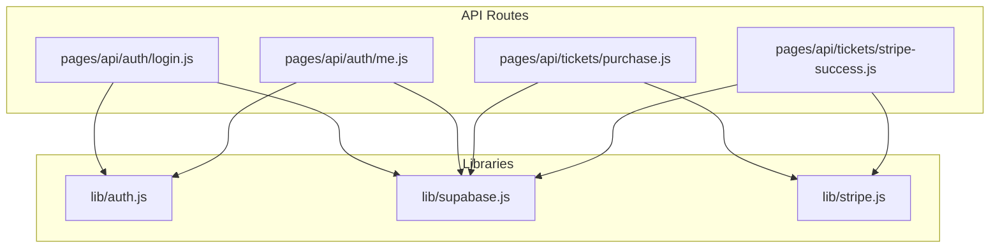
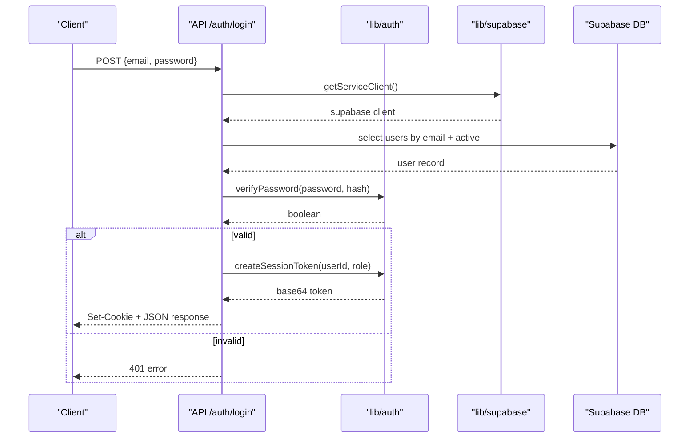
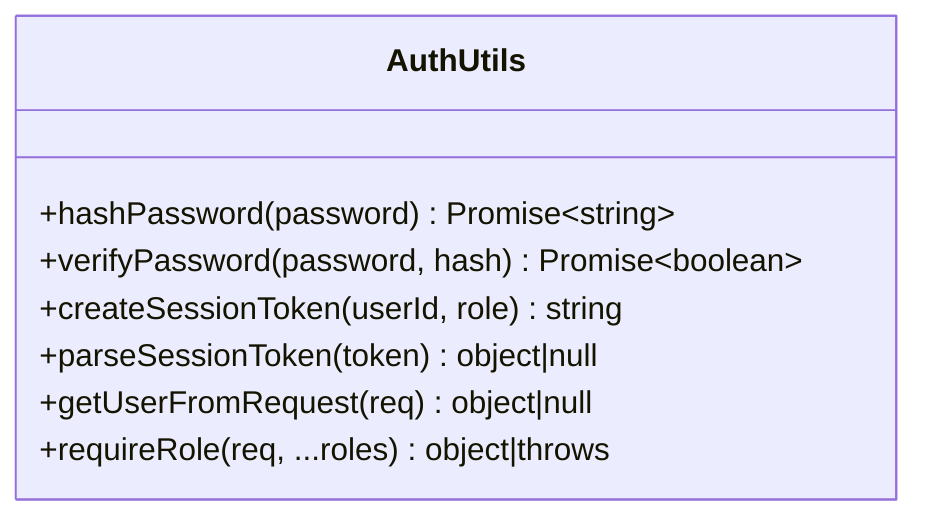
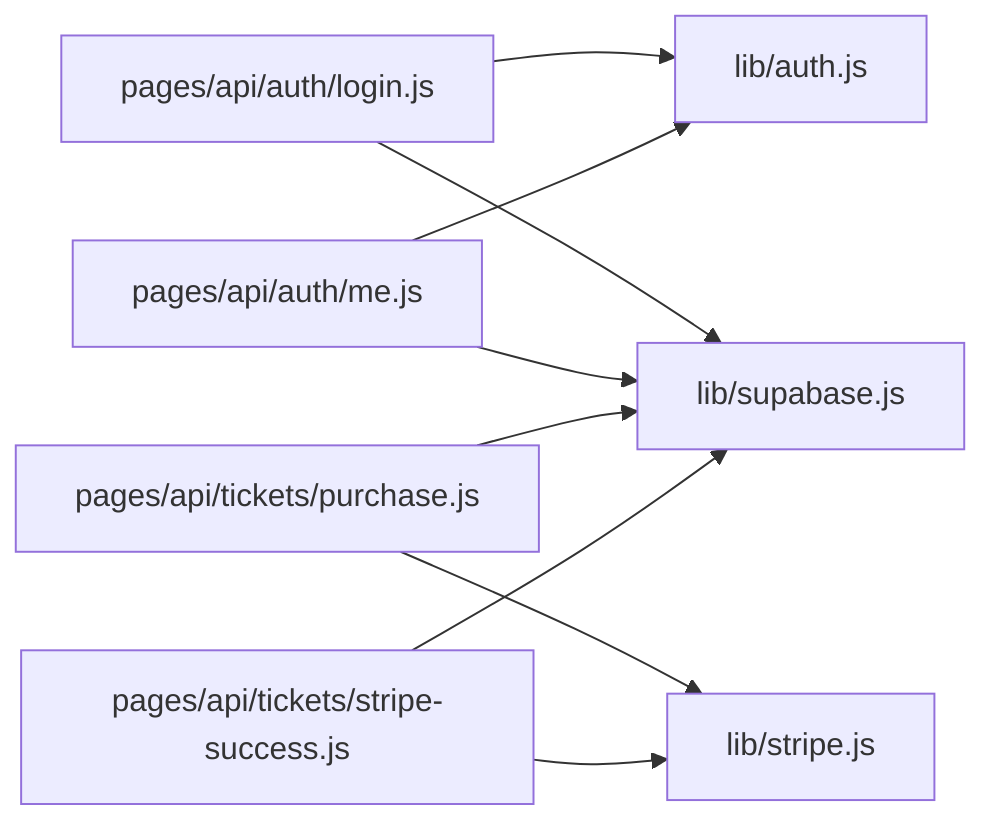

# Utility Function Testing

<cite>
**Referenced Files in This Document**
- [auth.js](file://lib/auth.js)
- [supabase.js](file://lib/supabase.js)
- [stripe.js](file://lib/stripe.js)
- [login.js](file://pages/api/auth/login.js)
- [me.js](file://pages/api/auth/me.js)
- [purchase.js](file://pages/api/tickets/purchase.js)
- [stripe-success.js](file://pages/api/tickets/stripe-success.js)
</cite>

## Table of Contents
1. [Introduction](#introduction)
2. [Project Structure](#project-structure)
3. [Core Components](#core-components)
4. [Architecture Overview](#architecture-overview)
5. [Detailed Component Analysis](#detailed-component-analysis)
6. [Dependency Analysis](#dependency-analysis)
7. [Performance Considerations](#performance-considerations)
8. [Troubleshooting Guide](#troubleshooting-guide)
9. [Conclusion](#conclusion)

## Introduction
This document provides a comprehensive testing strategy for TicketFlow’s core utility libraries: authentication logic, Supabase client interactions, and Stripe integration utilities. It focuses on unit and integration testing approaches for functions that handle password hashing/verification, session token creation/parsing, database query wrappers, and payment processing flows. The guide includes strategies for mocking external dependencies (Supabase and Stripe), testing asynchronous operations, validating error handling paths, and ensuring data transformation correctness with proper isolation.

## Project Structure
The relevant code under test is organized into three library modules and several API routes that consume them:
- lib/auth.js: Password hashing/verification, session token generation/parsing, request-based user extraction, and role enforcement.
- lib/supabase.js: Supabase client initialization and service-role client factory.
- lib/stripe.js: Stripe SDK instance initialization.
- pages/api/auth/login.js and pages/api/auth/me.js: Authentication endpoints using auth and supabase utilities.
- pages/api/tickets/purchase.js and pages/api/tickets/stripe-success.js: Payment flow endpoints using supabase and stripe utilities.

**Diagram sources**
- [auth.js:1-47](file://lib/auth.js#L1-L47)
- [supabase.js:1-23](file://lib/supabase.js#L1-L23)
- [stripe.js:1-6](file://lib/stripe.js#L1-L6)
- [login.js:1-31](file://pages/api/auth/login.js#L1-L31)
- [me.js:1-19](file://pages/api/auth/me.js#L1-L19)
- [purchase.js:1-123](file://pages/api/tickets/purchase.js#L1-L123)
- [stripe-success.js:1-55](file://pages/api/tickets/stripe-success.js#L1-L55)

**Section sources**
- [auth.js:1-47](file://lib/auth.js#L1-L47)
- [supabase.js:1-23](file://lib/supabase.js#L1-L23)
- [stripe.js:1-6](file://lib/stripe.js#L1-L6)
- [login.js:1-31](file://pages/api/auth/login.js#L1-L31)
- [me.js:1-19](file://pages/api/auth/me.js#L1-L19)
- [purchase.js:1-123](file://pages/api/tickets/purchase.js#L1-L123)
- [stripe-success.js:1-55](file://pages/api/tickets/stripe-success.js#L1-L55)

## Core Components
This section outlines the key functions to test and their responsibilities:
- Authentication (lib/auth.js): hashPassword, verifyPassword, createSessionToken, parseSessionToken, getUserFromRequest, requireRole.
- Supabase client (lib/supabase.js): supabase singleton and getServiceClient factory.
- Stripe client (lib/stripe.js): stripe singleton.

Testing priorities:
- Isolate pure functions (password hashing/verification, token parsing).
- Mock external clients (Supabase, Stripe) to avoid network calls.
- Validate async flows and error propagation in API routes.
- Ensure environment variable usage does not break tests via defaults or mocks.

**Section sources**
- [auth.js:1-47](file://lib/auth.js#L1-L47)
- [supabase.js:1-23](file://lib/supabase.js#L1-L23)
- [stripe.js:1-6](file://lib/stripe.js#L1-L6)

## Architecture Overview
The system uses Next.js API routes as entry points that call utility libraries:
- Authentication endpoints use auth helpers and Supabase service client to validate credentials and set cookies.
- Purchase endpoints orchestrate ticket availability checks, optional promo codes, and payment via Stripe or direct DB writes.
- Stripe success endpoint reconciles payment confirmation with ticket issuance and payment recording.

**Diagram sources**
- [login.js:1-31](file://pages/api/auth/login.js#L1-L31)
- [auth.js:1-47](file://lib/auth.js#L1-L47)
- [supabase.js:1-23](file://lib/supabase.js#L1-L23)

## Detailed Component Analysis

### Authentication Utilities (lib/auth.js)
Functions to test:
- hashPassword(password): returns bcrypt hash asynchronously.
- verifyPassword(password, hash): returns boolean asynchronously.
- createSessionToken(userId, role): creates a base64-encoded payload with expiration.
- parseSessionToken(token): decodes and validates expiration; returns null if invalid/expired.
- getUserFromRequest(req): extracts cookie and parses session token.
- requireRole(req, ...roles): enforces roles, throws structured errors.

Testing strategies:
- Pure function tests:
  - Verify hashPassword produces non-plaintext output and verifyPassword returns true for matching pairs and false otherwise.
  - Validate createSessionToken encodes expected fields and parseSessionToken decodes correctly, including expiration behavior.
  - Confirm getUserFromRequest handles missing cookies, malformed tokens, and expired tokens.
  - Check requireRole returns user when authenticated and allowed, and throws correct status/message for unauthenticated or insufficient permissions.
- Async considerations:
  - Use async test patterns for hashPassword and verifyPassword.
- Error handling:
  - Ensure parseSessionToken returns null on malformed input without throwing.
  - Ensure requireRole throws objects with status and message fields.

Mocking guidance:
- No external dependencies inside these functions except bcryptjs; mock bcryptjs methods if needed to control timing or outputs.

Example test scenarios:
- Valid login flow: create token, parse it, assert payload fields and expiration.
- Expired token: set past expiration, assert parseSessionToken returns null.
- Missing cookie: assert getUserFromRequest returns null.
- Role enforcement: pass admin role but require editor, assert thrown error.

**Section sources**
- [auth.js:1-47](file://lib/auth.js#L1-L47)

#### Class-like structure of auth utilities

[No diagram sources since this is a conceptual representation of module exports]

### Supabase Client Utilities (lib/supabase.js)
Exports:
- supabase: default client created from environment variables with fallbacks.
- getServiceClient(): server-side client using service role key.

Testing strategies:
- Unit-level:
  - Verify getServiceClient returns a client instance.
  - Ensure environment variable absence triggers console warning (if applicable in your test harness).
- Integration-level:
  - Mock Supabase client methods used by API routes (e.g., .from(...).select(...).eq(...).single()).
  - Provide controlled responses for success and error cases.
- Environment isolation:
  - Set process.env values per test to simulate configured vs placeholder environments.

Mocking guidance:
- Replace the entire module or its exported members using your test framework’s module mocking capabilities.
- For Supabase, mock the client returned by getServiceClient() to return predictable results for queries.

Example test scenarios:
- getServiceClient returns a client object.
- Query success path: mock select().eq().single() to return data.
- Query failure path: mock error to assert route returns 500.

**Section sources**
- [supabase.js:1-23](file://lib/supabase.js#L1-L23)

### Stripe Integration Utilities (lib/stripe.js)
Exports:
- stripe: Stripe SDK instance initialized with secret key and apiVersion.

Testing strategies:
- Unit-level:
  - Verify stripe instance exists and has expected configuration (apiVersion).
- Integration-level:
  - Mock stripe.checkout.sessions.create and retrieve to control payment flows.
  - Assert correct parameters passed during checkout session creation.

Mocking guidance:
- Mock the Stripe constructor or the stripe instance methods used in purchase and stripe-success endpoints.
- Ensure environment variable STRIPE_SECRET_KEY is mocked or provided in test environment.

Example test scenarios:
- Create checkout session with expected line items and metadata.
- Retrieve session and assert payment_status check.

**Section sources**
- [stripe.js:1-6](file://lib/stripe.js#L1-L6)

### Authentication Endpoints (pages/api/auth/login.js, pages/api/auth/me.js)
Key behaviors:
- login.js: Validates input, fetches user via Supabase, verifies password, sets session cookie, returns user info.
- me.js: Extracts user from request cookie, fetches profile via Supabase, returns user or null.

Testing strategies:
- Input validation:
  - Test missing fields return 400.
  - Test wrong HTTP method returns 405.
- Database interactions:
  - Mock Supabase client to return user or error.
  - Assert correct SQL-like query composition (table name, filters).
- Authentication flow:
  - Verify cookie setting and JSON response shape.
  - For me.js, ensure unauthorized returns 401 when no session.

Error handling:
- Catch blocks should return appropriate status codes and messages.

**Section sources**
- [login.js:1-31](file://pages/api/auth/login.js#L1-L31)
- [me.js:1-19](file://pages/api/auth/me.js#L1-L19)

### Payment Processing Endpoints (pages/api/tickets/purchase.js, pages/api/tickets/stripe-success.js)
Key behaviors:
- purchase.js:
  - Validates required fields.
  - Checks ticket type availability and applies promo codes.
  - If paymentMethod is 'stripe', creates Stripe checkout session with metadata and returns URL.
  - Otherwise, inserts tickets, updates sold quantity, records payment, returns tokens.
- stripe-success.js:
  - Retrieves Stripe session, validates paid status.
  - Creates tickets, updates sold quantity, records payment, redirects to ticket page.

Testing strategies:
- Validation:
  - Test missing fields return 400.
- Availability and promo:
  - Mock Supabase to return ticket types and promo codes; assert discount calculation and times_used increment.
- Stripe flow:
  - Mock stripe.checkout.sessions.create to return session.url.
  - Assert metadata includes eventId, ticketTypeId, quantity, buyer details, tokens, discount.
- Non-Stripe flow:
  - Mock Supabase insert/update/select; assert ticket creation and payment recording.
- Success callback:
  - Mock stripe.retrieve; assert payment_status check and subsequent DB operations.

Error handling:
- Assert 404 for missing ticket type.
- Assert 500 for DB insertion failures.
- Redirects on failed payment or invalid event.

**Section sources**
- [purchase.js:1-123](file://pages/api/tickets/purchase.js#L1-L123)
- [stripe-success.js:1-55](file://pages/api/tickets/stripe-success.js#L1-L55)

## Dependency Analysis
The following diagram maps how API routes depend on library modules:

**Diagram sources**
- [login.js:1-31](file://pages/api/auth/login.js#L1-L31)
- [me.js:1-19](file://pages/api/auth/me.js#L1-L19)
- [purchase.js:1-123](file://pages/api/tickets/purchase.js#L1-L123)
- [stripe-success.js:1-55](file://pages/api/tickets/stripe-success.js#L1-L55)
- [auth.js:1-47](file://lib/auth.js#L1-L47)
- [supabase.js:1-23](file://lib/supabase.js#L1-L23)
- [stripe.js:1-6](file://lib/stripe.js#L1-L6)

**Section sources**
- [login.js:1-31](file://pages/api/auth/login.js#L1-L31)
- [me.js:1-19](file://pages/api/auth/me.js#L1-L19)
- [purchase.js:1-123](file://pages/api/tickets/purchase.js#L1-L123)
- [stripe-success.js:1-55](file://pages/api/tickets/stripe-success.js#L1-L55)
- [auth.js:1-47](file://lib/auth.js#L1-L47)
- [supabase.js:1-23](file://lib/supabase.js#L1-L23)
- [stripe.js:1-6](file://lib/stripe.js#L1-L6)

## Performance Considerations
- Avoid real network calls in unit tests; always mock Supabase and Stripe.
- Keep bcrypt salt rounds consistent in tests to reduce runtime; consider mocking hash/compare for deterministic speed.
- Minimize DB mock setup by returning only necessary fields for assertions.
- Batch operations where possible in tests (e.g., mock multiple inserts at once).

[No sources needed since this section provides general guidance]

## Troubleshooting Guide
Common issues and resolutions:
- Missing environment variables:
  - Ensure NEXT_PUBLIC_SUPABASE_URL, NEXT_PUBLIC_SUPABASE_ANON_KEY, SUPABASE_SERVICE_ROLE_KEY, and STRIPE_SECRET_KEY are set in test environment or mocked.
- Supabase client warnings:
  - When env vars are absent, a console warning is logged; tests should either provide values or assert warning behavior if needed.
- Stripe API version mismatch:
  - Ensure mocked Stripe instances use the same apiVersion as production code.
- Cookie parsing edge cases:
  - Handle malformed or URL-encoded cookies in getUserFromRequest; assert null returns for invalid inputs.
- Expiration logic:
  - Control Date.now() or mock time to test token expiration accurately.

**Section sources**
- [supabase.js:1-23](file://lib/supabase.js#L1-L23)
- [auth.js:1-47](file://lib/auth.js#L1-L47)

## Conclusion
This testing guide covers robust strategies for validating TicketFlow’s core utility libraries and their usage in API routes. By isolating pure functions, mocking external dependencies, and asserting both happy paths and error conditions, you can ensure reliability and security across authentication, database interactions, and payment processing flows. Adopt consistent mocking practices for Supabase and Stripe, validate environment configurations, and maintain clear separation between unit and integration tests to keep the suite fast and dependable.