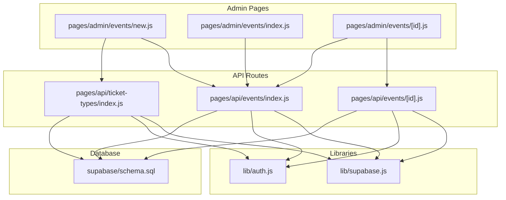
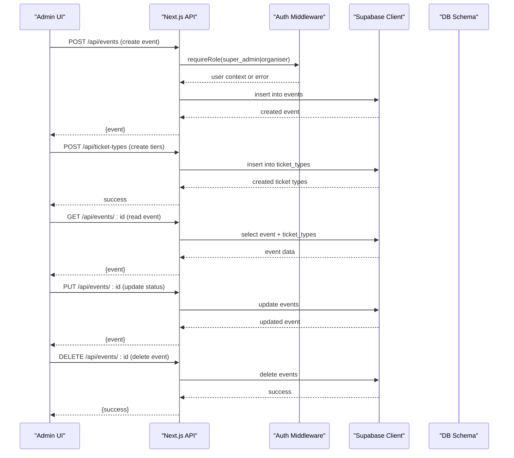
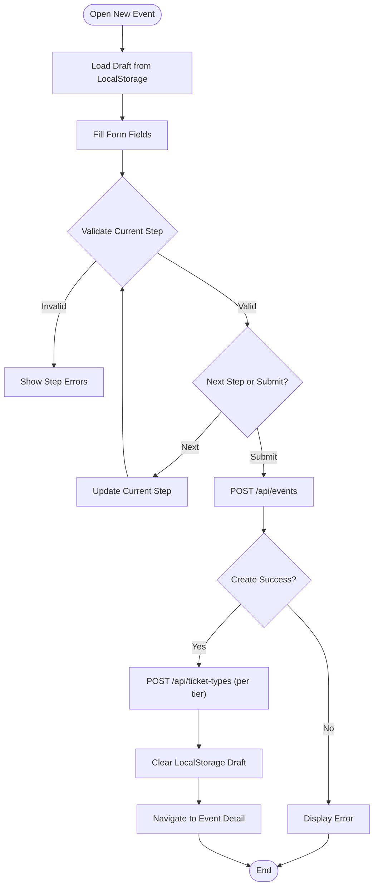
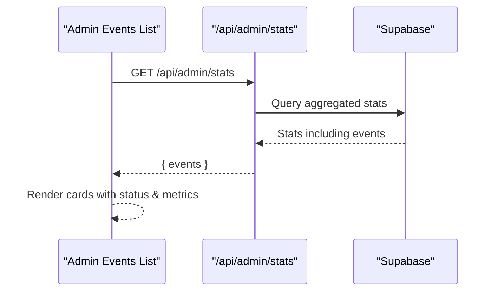
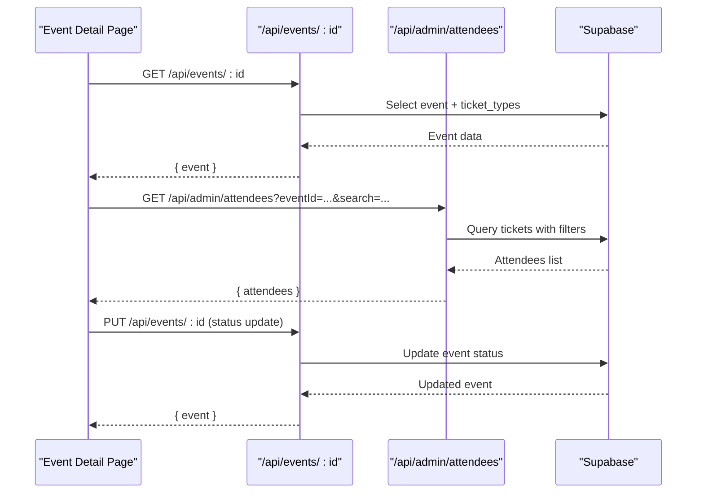
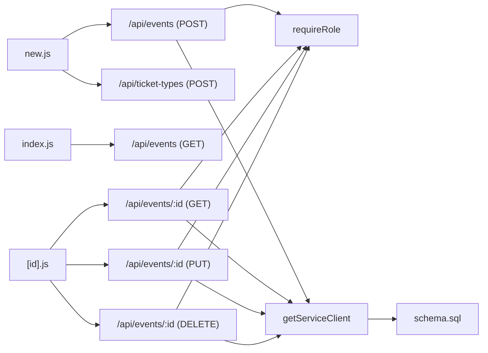

# Event CRUD Operations

<cite>
**Referenced Files in This Document**
- [new.js](file://pages/admin/events/new.js)
- [index.js (Admin Events)](file://pages/admin/events/index.js)
- [id.js (Event Detail)](file://pages/admin/events/[id].js)
- [events index API](file://pages/api/events/index.js)
- [events id API](file://pages/api/events/[id].js)
- [ticket-types index API](file://pages/api/ticket-types/index.js)
- [auth.js](file://lib/auth.js)
- [supabase.js](file://lib/supabase.js)
- [schema.sql](file://supabase/schema.sql)
</cite>

## Table of Contents
1. Introduction
2. Project Structure
3. Core Components
4. Architecture Overview
5. Detailed Component Analysis
6. Dependency Analysis
7. Performance Considerations
8. Troubleshooting Guide
9. Conclusion

## Introduction
This document explains the complete lifecycle of Event CRUD operations through the admin interface, including creation via a multi-step wizard, listing and management from the admin dashboard, and detailed event editing and status updates. It covers the event data model, form handling and validation rules, API endpoints for creating, reading, updating, and deleting events, and how frontend components interact with backend routes. Error handling patterns and user feedback mechanisms are also documented to help both developers and non-technical users understand the system behavior.

## Project Structure
The Event CRUD feature spans several pages and API routes:
- Admin UI pages for managing events:
  - New event creation wizard
  - Events listing page
  - Event detail page with tabs for overview, ticket types, and attendees
- Backend API routes for events and ticket types
- Shared libraries for authentication and database client configuration
- Database schema defining the event-related tables and relationships

**Diagram sources**
- [new.js](file://pages/admin/events/new.js)
- [index.js (Admin Events)](file://pages/admin/events/index.js)
- [id.js (Event Detail)](file://pages/admin/events/[id].js)
- [events index API](file://pages/api/events/index.js)
- [events id API](file://pages/api/events/[id].js)
- [ticket-types index API](file://pages/api/ticket-types/index.js)
- [auth.js](file://lib/auth.js)
- [supabase.js](file://lib/supabase.js)
- [schema.sql](file://supabase/schema.sql)

**Section sources**
- [new.js](file://pages/admin/events/new.js)
- [index.js (Admin Events)](file://pages/admin/events/index.js)
- [id.js (Event Detail)](file://pages/admin/events/[id].js)
- [events index API](file://pages/api/events/index.js)
- [events id API](file://pages/api/events/[id].js)
- [ticket-types index API](file://pages/api/ticket-types/index.js)
- [auth.js](file://lib/auth.js)
- [supabase.js](file://lib/supabase.js)
- [schema.sql](file://supabase/schema.sql)

## Core Components
- Event Creation Wizard (new.js): Multi-step form collecting event details, branding, ticket types, venue info, schedule, payments, and publishing status. Includes autosave to local storage, step-wise validation, and submission flow that creates an event and its ticket types.
- Events Listing (index.js): Displays all events fetched from the admin stats endpoint, showing key metrics like tickets sold and checked-in counts. Clicking an event navigates to the detail page.
- Event Detail (id.js): Shows event overview, ticket type performance, and attendee list with search capabilities. Supports status updates via PUT request.

Key fields involved in the event data model include:
- event_name, slug, date, time, venue, description, poster_image, theme_color, capacity, status
- Ticket types: name, price, quantity_available, quantity_sold, color

**Section sources**
- [new.js](file://pages/admin/events/new.js)
- [index.js (Admin Events)](file://pages/admin/events/index.js)
- [id.js (Event Detail)](file://pages/admin/events/[id].js)
- [schema.sql](file://supabase/schema.sql)

## Architecture Overview
The Event CRUD architecture follows a clear separation between UI and API layers:
- Frontend components call Next.js API routes using fetch.
- API routes enforce role-based access control and use Supabase service client for database operations.
- The database schema defines constraints and relationships for events, ticket types, and related entities.

**Diagram sources**
- [events index API](file://pages/api/events/index.js)
- [events id API](file://pages/api/events/[id].js)
- [ticket-types index API](file://pages/api/ticket-types/index.js)
- [auth.js](file://lib/auth.js)
- [supabase.js](file://lib/supabase.js)
- [schema.sql](file://supabase/schema.sql)

## Detailed Component Analysis

### Event Creation Wizard (new.js)
- Form state includes event fields such as event_name, slug, date, time, venue, description, poster_image, theme_color, capacity, status, and ticket types array.
- Autosave persists draft data to localStorage with a debounce timer.
- Step-wise validation ensures required fields per step:
  - Basic Info: event_name, slug, date, venue
  - Branding: capacity must be positive
  - Tickets: at least one valid tier with name, price, and quantity
- Submission constructs a payload for event creation and posts to /api/events. On success, it creates ticket types via /api/ticket-types and navigates to the event detail page.
- User feedback includes loading states, error messages, and autosave status indicators.

**Diagram sources**
- [new.js](file://pages/admin/events/new.js)
- [events index API](file://pages/api/events/index.js)
- [ticket-types index API](file://pages/api/ticket-types/index.js)

**Section sources**
- [new.js](file://pages/admin/events/new.js)

### Events Listing Page (index.js)
- Fetches events from /api/admin/stats and renders them as cards with status badges and metrics.
- Provides navigation to create new events and to individual event detail pages.
- Real-time updates are achieved by re-fetching on mount; additional polling could be added for live updates.

**Diagram sources**
- [index.js (Admin Events)](file://pages/admin/events/index.js)

**Section sources**
- [index.js (Admin Events)](file://pages/admin/events/index.js)

### Event Detail Page (id.js)
- Loads event details via GET /api/events/:id and displays overview, ticket types, and attendees tab.
- Attendees tab supports search queries against buyer name, email, phone, and QR token via /api/admin/attendees.
- Status updates are performed via PUT /api/events/:id with immediate UI refresh.

**Diagram sources**
- [id.js (Event Detail)](file://pages/admin/events/[id].js)
- [events id API](file://pages/api/events/[id].js)

**Section sources**
- [id.js (Event Detail)](file://pages/admin/events/[id].js)

### API Endpoints for Event CRUD
- Create Event:
  - Method: POST
  - Endpoint: /api/events
  - Body: event_name, slug, date, time, venue, description, poster_image, theme_color, capacity
  - Response: Created event object
- Read Event:
  - Method: GET
  - Endpoint: /api/events/:id
  - Response: Event object with ticket_types
- Update Event:
  - Method: PUT
  - Endpoint: /api/events/:id
  - Body: Fields to update (e.g., status)
  - Response: Updated event object
- Delete Event:
  - Method: DELETE
  - Endpoint: /api/events/:id
  - Response: Success indicator

- Create Ticket Types:
  - Method: POST
  - Endpoint: /api/ticket-types
  - Body: event_id, name, price, quantity_available, color
  - Response: Created ticket type object

All endpoints enforce role-based access control via requireRole and use Supabase service client for database operations.

**Section sources**
- [events index API](file://pages/api/events/index.js)
- [events id API](file://pages/api/events/[id].js)
- [ticket-types index API](file://pages/api/ticket-types/index.js)
- [auth.js](file://lib/auth.js)
- [supabase.js](file://lib/supabase.js)

### Data Model and Relationships
The database schema defines the following core tables relevant to Event CRUD:
- events: id, organiser_id, event_name, slug, date, time, venue, description, poster_image, performer_images, theme_color, capacity, status, created_at
- ticket_types: id, event_id, name, price, quantity_available, quantity_sold, color, created_at
- tickets: id, event_id, ticket_type_id, buyer_name, buyer_email, buyer_phone, qr_code_token, is_checked_in, checked_in_at, checked_in_by, purchase_date, status
- check_ins: id, ticket_id, event_id, staff_id, scanned_at, method, device_info
- payments: id, ticket_id, amount, currency, payment_method, transaction_ref, status, paid_at
- promo_codes: id, event_id, code, discount_percent, max_uses, times_used, expires_at, is_active

Relationships:
- events has many ticket_types
- events has many tickets
- tickets belong to ticket_types
- tickets have many check_ins
- tickets have many payments

Indexes and policies ensure efficient querying and secure access for public and authenticated roles.

**Section sources**
- [schema.sql](file://supabase/schema.sql)

## Dependency Analysis
The Event CRUD feature depends on:
- Authentication middleware for role checks
- Supabase client for database interactions
- Database schema for data integrity and relationships

**Diagram sources**
- [new.js](file://pages/admin/events/new.js)
- [index.js (Admin Events)](file://pages/admin/events/index.js)
- [id.js (Event Detail)](file://pages/admin/events/[id].js)
- [events index API](file://pages/api/events/index.js)
- [events id API](file://pages/api/events/[id].js)
- [ticket-types index API](file://pages/api/ticket-types/index.js)
- [auth.js](file://lib/auth.js)
- [supabase.js](file://lib/supabase.js)
- [schema.sql](file://supabase/schema.sql)

**Section sources**
- [auth.js](file://lib/auth.js)
- [supabase.js](file://lib/supabase.js)
- [schema.sql](file://supabase/schema.sql)

## Performance Considerations
- Use debounced autosave to avoid excessive writes to localStorage during form input.
- Batch ticket type creation requests where possible to reduce network overhead.
- Leverage Supabase indexes defined in the schema for faster queries on frequently filtered fields (slug, status, event_id).
- Implement pagination for large datasets (e.g., attendees list) to improve rendering performance.
- Avoid unnecessary re-renders by memoizing derived data and minimizing state updates.

[No sources needed since this section provides general guidance]

## Troubleshooting Guide
Common issues and resolutions:
- Missing required fields during event creation: Ensure event_name, slug, date, and venue are provided. The API returns a 400 error with a descriptive message.
- Authentication failures: Verify session cookies and roles. The requireRole function enforces super_admin or organiser roles for write operations.
- Database errors: Check Supabase environment variables and service role key configuration. Errors are returned as JSON objects with error messages.
- Form validation errors: Review step-specific validation rules and display inline errors to guide users.

**Section sources**
- [events index API](file://pages/api/events/index.js)
- [events id API](file://pages/api/events/[id].js)
- [auth.js](file://lib/auth.js)
- [supabase.js](file://lib/supabase.js)

## Conclusion
The Event CRUD operations in TicketFlow provide a robust and user-friendly experience for managing events through the admin interface. The multi-step wizard simplifies event creation, while the listing and detail pages offer comprehensive management capabilities. The API layer enforces security and integrates seamlessly with Supabase for reliable data operations. By following the documented patterns and best practices, developers can extend and maintain the system effectively.

[No sources needed since this section summarizes without analyzing specific files]