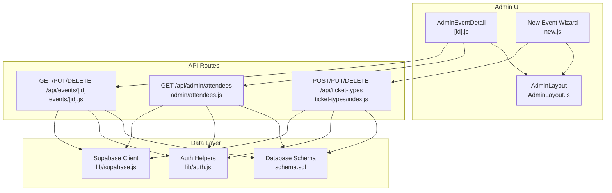
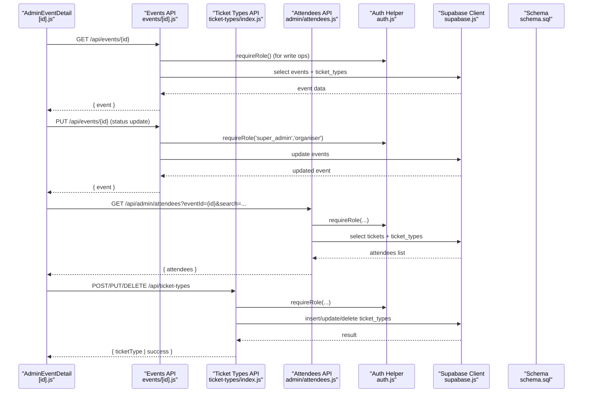
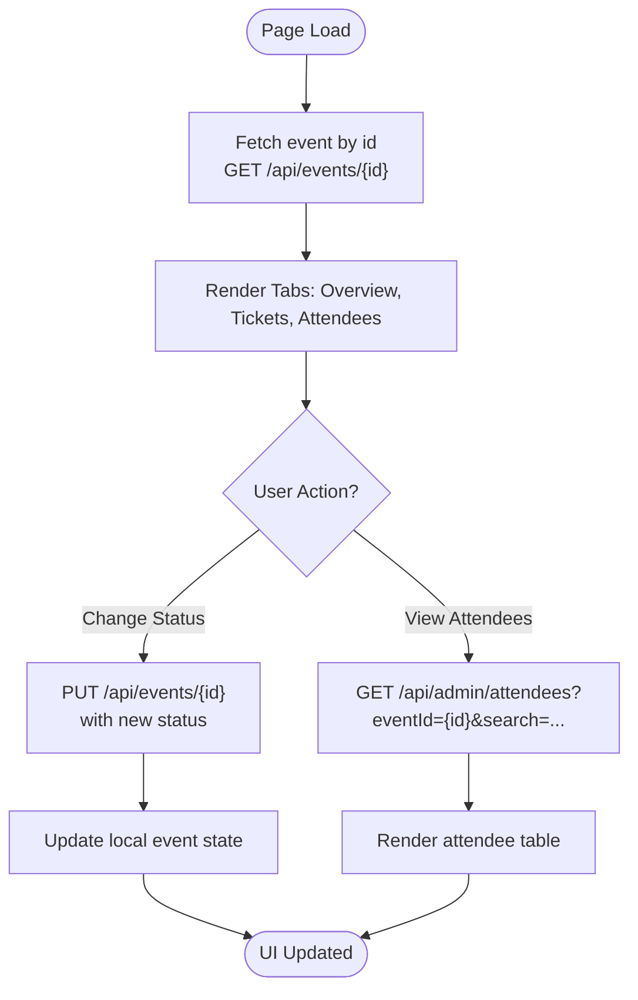
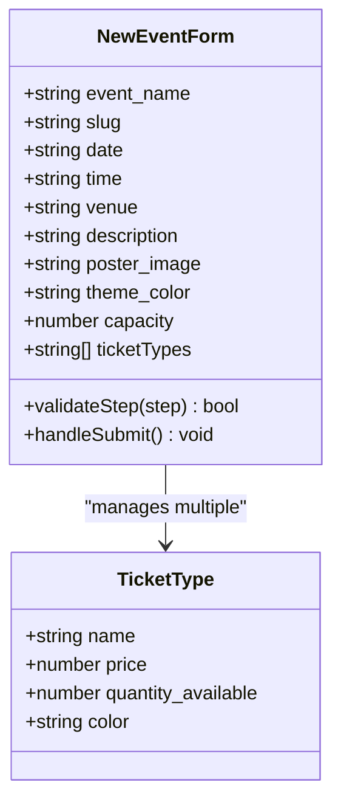
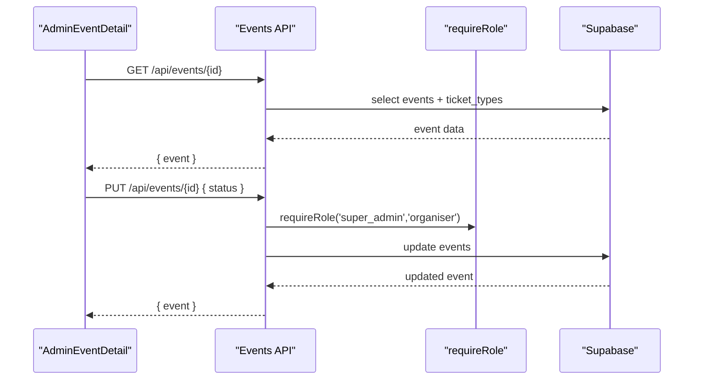
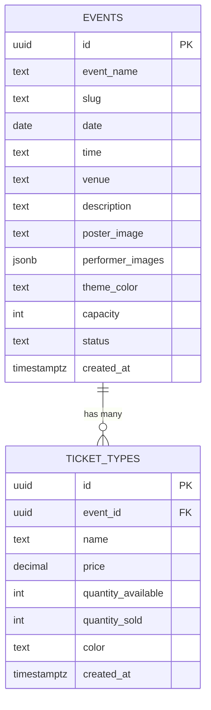
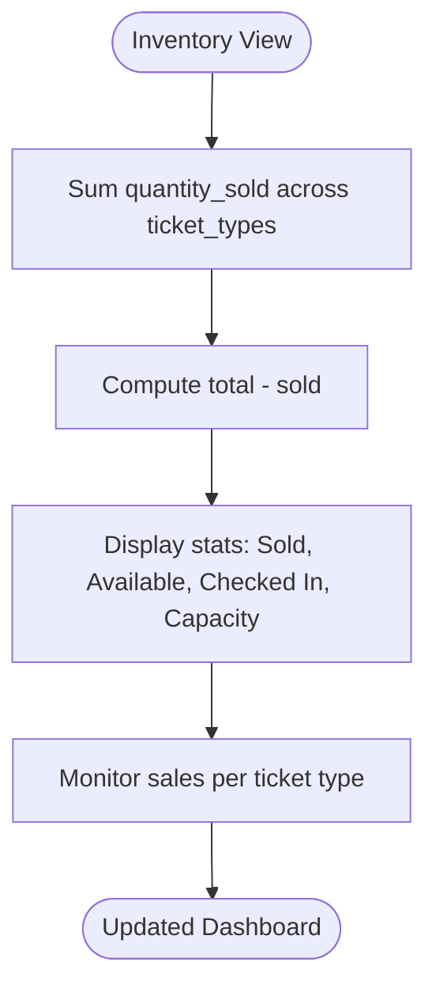
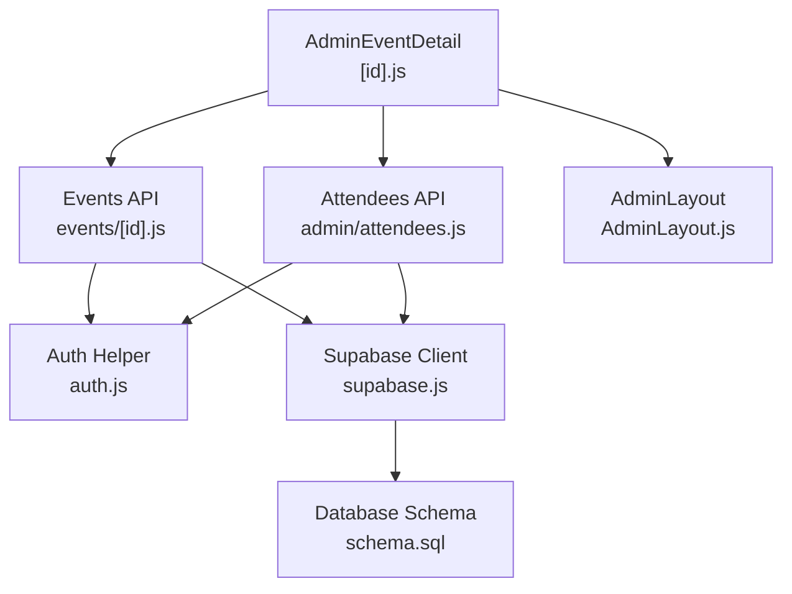

# Event Detail Management

<cite>
**Referenced Files in This Document**
- [pages/admin/events/[id].js](file://pages/admin/events/[id].js)
- [pages/api/events/[id].js](file://pages/api/events/[id].js)
- [pages/api/ticket-types/index.js](file://pages/api/ticket-types/index.js)
- [pages/api/admin/attendees.js](file://pages/api/admin/attendees.js)
- [supabase/schema.sql](file://supabase/schema.sql)
- [lib/supabase.js](file://lib/supabase.js)
- [lib/auth.js](file://lib/auth.js)
- [components/AdminLayout.js](file://components/AdminLayout.js)
- [pages/admin/events/new.js](file://pages/admin/events/new.js)
</cite>

## Table of Contents
1. [Introduction](#introduction)
2. [Project Structure](#project-structure)
3. [Core Components](#core-components)
4. [Architecture Overview](#architecture-overview)
5. [Detailed Component Analysis](#detailed-component-analysis)
6. [Dependency Analysis](#dependency-analysis)
7. [Performance Considerations](#performance-considerations)
8. [Troubleshooting Guide](#troubleshooting-guide)
9. [Conclusion](#conclusion)
10. [Appendices](#appendices)

## Introduction
This document explains the event detail management functionality for TicketFlow, focusing on how individual events are edited and managed through dynamic routes, the admin interface for viewing and updating event details, ticket type configuration, capacity settings, status management, and data synchronization with the database. It also covers the API endpoints used to fetch and update event data, form state management and validation logic, and the relationships between events, ticket types, inventory tracking, and sales monitoring.

## Project Structure
The event detail management spans several key files:
- Admin UI for viewing and managing a specific event by ID (dynamic route).
- API endpoints for fetching/updating an event and managing ticket types.
- Database schema defining events, ticket types, tickets, and related tables.
- Authentication and Supabase client utilities.
- Admin layout component providing navigation and authentication checks.
- New event creation wizard that demonstrates form state management and ticket type configuration.

**Diagram sources**
- [pages/admin/events/[id].js](file://pages/admin/events/[id].js)
- [pages/api/events/[id].js](file://pages/api/events/[id].js)
- [pages/api/ticket-types/index.js](file://pages/api/ticket-types/index.js)
- [pages/api/admin/attendees.js](file://pages/api/admin/attendees.js)
- [lib/supabase.js](file://lib/supabase.js)
- [lib/auth.js](file://lib/auth.js)
- [supabase/schema.sql](file://supabase/schema.sql)
- [components/AdminLayout.js](file://components/AdminLayout.js)
- [pages/admin/events/new.js](file://pages/admin/events/new.js)

**Section sources**
- [pages/admin/events/[id].js](file://pages/admin/events/[id].js)
- [pages/api/events/[id].js](file://pages/api/events/[id].js)
- [pages/api/ticket-types/index.js](file://pages/api/ticket-types/index.js)
- [pages/api/admin/attendees.js](file://pages/api/admin/attendees.js)
- [supabase/schema.sql](file://supabase/schema.sql)
- [lib/supabase.js](file://lib/supabase.js)
- [lib/auth.js](file://lib/auth.js)
- [components/AdminLayout.js](file://components/AdminLayout.js)
- [pages/admin/events/new.js](file://pages/admin/events/new.js)

## Core Components
- Dynamic Route Page: The admin event detail page loads event data via a GET request to the API endpoint, displays overview, ticket types, and attendees tabs, and allows status updates via PUT requests.
- API Endpoint for Events: Handles GET (fetch single event with ticket types), PUT (update event fields with role checks), and DELETE (remove event with role checks).
- Ticket Types API: Supports creating, updating, and deleting ticket types associated with an event, enforcing role-based access.
- Attendees API: Retrieves tickets for an event with optional search across buyer name, email, phone, or QR token.
- Database Schema: Defines events, ticket_types, tickets, check_ins, payments, promo_codes, and enforces constraints and indexes.
- Auth and Supabase Utilities: Provide service role client for server-side DB access and role enforcement middleware.

**Section sources**
- [pages/admin/events/[id].js](file://pages/admin/events/[id].js)
- [pages/api/events/[id].js](file://pages/api/events/[id].js)
- [pages/api/ticket-types/index.js](file://pages/api/ticket-types/index.js)
- [pages/api/admin/attendees.js](file://pages/api/admin/attendees.js)
- [supabase/schema.sql](file://supabase/schema.sql)
- [lib/supabase.js](file://lib/supabase.js)
- [lib/auth.js](file://lib/auth.js)

## Architecture Overview
The event detail management workflow involves:
- Frontend state management in the admin event detail page for displaying and editing event information.
- API routes handling CRUD operations with role-based authorization.
- Supabase service client performing database queries and mutations.
- Database schema ensuring data integrity and relationships.

**Diagram sources**
- [pages/admin/events/[id].js](file://pages/admin/events/[id].js)
- [pages/api/events/[id].js](file://pages/api/events/[id].js)
- [pages/api/ticket-types/index.js](file://pages/api/ticket-types/index.js)
- [pages/api/admin/attendees.js](file://pages/api/admin/attendees.js)
- [lib/auth.js](file://lib/auth.js)
- [lib/supabase.js](file://lib/supabase.js)
- [supabase/schema.sql](file://supabase/schema.sql)

## Detailed Component Analysis

### Dynamic Route Handling for Individual Event Editing and Management
- The admin event detail page uses Next.js dynamic routing with [id] to load a specific event.
- On mount, it fetches event data from the API endpoint and renders tabs for overview, ticket types, and attendees.
- Status changes trigger a PUT request to update the event’s status field, then update local state immediately.

**Diagram sources**
- [pages/admin/events/[id].js](file://pages/admin/events/[id].js)
- [pages/api/events/[id].js](file://pages/api/events/[id].js)
- [pages/api/admin/attendees.js](file://pages/api/admin/attendees.js)

**Section sources**
- [pages/admin/events/[id].js](file://pages/admin/events/[id].js)
- [pages/api/events/[id].js](file://pages/api/events/[id].js)
- [pages/api/admin/attendees.js](file://pages/api/admin/attendees.js)

### Event Editing Interface: Form Fields, Ticket Types, Capacity, and Status
- The admin event detail page shows event metadata, stats (tickets sold, available, checked-in, capacity), and tabs for detailed views.
- The new event wizard includes comprehensive form fields for basic info, branding, ticket types, venue, schedule, payments, and publish steps.
- Validation ensures required fields like event name, slug, date, venue, and at least one valid ticket type before submission.
- Autosave drafts to localStorage during creation to prevent data loss.

**Diagram sources**
- [pages/admin/events/new.js](file://pages/admin/events/new.js)

**Section sources**
- [pages/admin/events/new.js](file://pages/admin/events/new.js)
- [pages/admin/events/[id].js](file://pages/admin/events/[id].js)

### API Endpoint for Fetching and Updating Specific Event Data
- GET /api/events/{id}: Returns a single event with its ticket types.
- PUT /api/events/{id}: Updates event fields after role verification; normalizes slug to lowercase and hyphenated.
- DELETE /api/events/{id}: Deletes an event after role verification.

**Diagram sources**
- [pages/api/events/[id].js](file://pages/api/events/[id].js)
- [lib/auth.js](file://lib/auth.js)
- [lib/supabase.js](file://lib/supabase.js)

**Section sources**
- [pages/api/events/[id].js](file://pages/api/events/[id].js)
- [lib/auth.js](file://lib/auth.js)
- [lib/supabase.js](file://lib/supabase.js)

### Relationship Between Event Details and Associated Ticket Types
- Events have a one-to-many relationship with ticket types.
- The API endpoint for events includes nested ticket types in the response.
- Ticket types can be created, updated, and deleted independently via their own API endpoint.

**Diagram sources**
- [supabase/schema.sql](file://supabase/schema.sql)

**Section sources**
- [supabase/schema.sql](file://supabase/schema.sql)
- [pages/api/events/[id].js](file://pages/api/events/[id].js)
- [pages/api/ticket-types/index.js](file://pages/api/ticket-types/index.js)

### Inventory Tracking and Sales Monitoring
- Ticket types track quantity_available and quantity_sold to manage inventory.
- The admin event detail page calculates total sold and available across all ticket types.
- Attendees tab lists tickets with status and check-in timestamps for performance monitoring.

**Diagram sources**
- [pages/admin/events/[id].js](file://pages/admin/events/[id].js)
- [supabase/schema.sql](file://supabase/schema.sql)

**Section sources**
- [pages/admin/events/[id].js](file://pages/admin/events/[id].js)
- [supabase/schema.sql](file://supabase/schema.sql)

### Common Workflows
- Updating Event Information: Use the edit button to navigate to the edit page (if implemented) or update status directly from the detail page.
- Managing Availability: Adjust ticket type quantities via the ticket types API.
- Monitoring Performance: Use the attendees tab to view ticket sales and check-ins.

**Section sources**
- [pages/admin/events/[id].js](file://pages/admin/events/[id].js)
- [pages/api/ticket-types/index.js](file://pages/api/ticket-types/index.js)
- [pages/api/admin/attendees.js](file://pages/api/admin/attendees.js)

## Dependency Analysis
The event detail management depends on:
- Next.js routing for dynamic pages.
- Supabase client for database operations.
- Role-based authentication middleware.
- Database schema constraints and indexes.

**Diagram sources**
- [pages/admin/events/[id].js](file://pages/admin/events/[id].js)
- [pages/api/events/[id].js](file://pages/api/events/[id].js)
- [pages/api/admin/attendees.js](file://pages/api/admin/attendees.js)
- [components/AdminLayout.js](file://components/AdminLayout.js)
- [lib/auth.js](file://lib/auth.js)
- [lib/supabase.js](file://lib/supabase.js)
- [supabase/schema.sql](file://supabase/schema.sql)

**Section sources**
- [pages/admin/events/[id].js](file://pages/admin/events/[id].js)
- [pages/api/events/[id].js](file://pages/api/events/[id].js)
- [pages/api/admin/attendees.js](file://pages/api/admin/attendees.js)
- [components/AdminLayout.js](file://components/AdminLayout.js)
- [lib/auth.js](file://lib/auth.js)
- [lib/supabase.js](file://lib/supabase.js)
- [supabase/schema.sql](file://supabase/schema.sql)

## Performance Considerations
- Minimize re-renders by using React state efficiently for event data and attendees list.
- Use Supabase indexes defined in the schema for faster queries on slug, status, and ticket-related fields.
- Implement pagination for large attendee lists if needed.
- Cache frequently accessed event data on the client side to reduce API calls.

[No sources needed since this section provides general guidance]

## Troubleshooting Guide
- Authentication Errors: Ensure proper session cookies and roles are set; use requireRole middleware to enforce permissions.
- API Errors: Check error responses from Supabase and validate input payloads.
- Data Not Found: Verify event IDs and ensure events are published if public access is required.
- Invalid State Changes: Validate status values against allowed enums in the schema.

**Section sources**
- [lib/auth.js](file://lib/auth.js)
- [pages/api/events/[id].js](file://pages/api/events/[id].js)
- [supabase/schema.sql](file://supabase/schema.sql)

## Conclusion
The event detail management system provides a robust interface for organizing and monitoring events, including dynamic routing, comprehensive form handling, ticket type configuration, and real-time sales tracking. The architecture leverages Next.js, Supabase, and role-based authentication to deliver a secure and scalable solution for event organizers.

[No sources needed since this section summarizes without analyzing specific files]

## Appendices
- Additional references to components and utilities used throughout the event management workflow.

[No sources needed since this section doesn't analyze specific files]