# Event Management System

<cite>
**Referenced Files in This Document**
- [schema.sql](file://supabase/schema.sql)
- [events/index.js](file://pages/api/events/index.js)
- [events/[id].js](file://pages/api/events/[id].js)
- [ticket-types/index.js](file://pages/api/ticket-types/index.js)
- [tickets/purchase.js](file://pages/api/tickets/purchase.js)
- [admin/events/index.js](file://pages/admin/events/index.js)
- [admin/events/new.js](file://pages/admin/events/new.js)
- [admin/events/[id].js](file://pages/admin/events/[id].js)
- [checkin/[eventId].js](file://pages/checkin/[eventId].js)
- [supabase.js](file://lib/supabase.js)
- [auth.js](file://lib/auth.js)
</cite>

## Table of Contents
1. [Introduction](#introduction)
2. [Project Structure](#project-structure)
3. [Core Components](#core-components)
4. [Architecture Overview](#architecture-overview)
5. [Detailed Component Analysis](#detailed-component-analysis)
6. [Dependency Analysis](#dependency-analysis)
7. [Performance Considerations](#performance-considerations)
8. [Troubleshooting Guide](#troubleshooting-guide)
9. [Conclusion](#conclusion)

## Introduction
This document explains the Event Management System sub-feature, focusing on how events are created, edited, and managed through their lifecycle (draft → published → sold_out → completed → cancelled). It covers the data model for events and ticket types, capacity management, pricing controls, inventory tracking, and availability enforcement. It also documents the admin interface components and API endpoints used to perform CRUD operations, handle forms, validate inputs, and manage status transitions.

## Project Structure
The Event Management System spans:
- Database schema defining events, ticket types, tickets, payments, promo codes, and check-ins
- Admin UI pages for listing, creating, editing, and managing event details
- API routes for event CRUD, ticket type management, and ticket purchase flows
- Check-in flow that updates attendance and supports gate operations

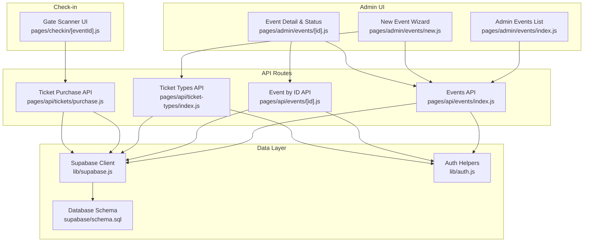

**Diagram sources**
- [events/index.js](file://pages/api/events/index.js)
- [events/[id].js](file://pages/api/events/[id].js)
- [ticket-types/index.js](file://pages/api/ticket-types/index.js)
- [tickets/purchase.js](file://pages/api/tickets/purchase.js)
- [admin/events/index.js](file://pages/admin/events/index.js)
- [admin/events/new.js](file://pages/admin/events/new.js)
- [admin/events/[id].js](file://pages/admin/events/[id].js)
- [checkin/[eventId].js](file://pages/checkin/[eventId].js)
- [supabase.js](file://lib/supabase.js)
- [auth.js](file://lib/auth.js)
- [schema.sql](file://supabase/schema.sql)

**Section sources**
- [schema.sql](file://supabase/schema.sql)
- [events/index.js](file://pages/api/events/index.js)
- [events/[id].js](file://pages/api/events/[id].js)
- [ticket-types/index.js](file://pages/api/ticket-types/index.js)
- [tickets/purchase.js](file://pages/api/tickets/purchase.js)
- [admin/events/index.js](file://pages/admin/events/index.js)
- [admin/events/new.js](file://pages/admin/events/new.js)
- [admin/events/[id].js](file://pages/admin/events/[id].js)
- [checkin/[eventId].js](file://pages/checkin/[eventId].js)
- [supabase.js](file://lib/supabase.js)
- [auth.js](file://lib/auth.js)

## Core Components
- Data Model:
  - events: core event metadata, capacity, and status
  - ticket_types: per-event ticket tiers with price and quantity tracking
  - tickets: individual ticket records with QR token and status
  - payments: payment records linked to tickets
  - promo_codes: discount codes scoped to events
  - check_ins: gate entry logs
- Admin Interfaces:
  - Events list page
  - New event wizard with multi-step form and autosave
  - Event detail page with tabs for overview, ticket types, and attendees
- APIs:
  - Event CRUD endpoints
  - Ticket type CRUD endpoints
  - Ticket purchase endpoint enforcing availability and applying promos
- Gate/Check-in:
  - Real-time scanning and manual search for attendee verification

**Section sources**
- [schema.sql](file://supabase/schema.sql)
- [admin/events/index.js](file://pages/admin/events/index.js)
- [admin/events/new.js](file://pages/admin/events/new.js)
- [admin/events/[id].js](file://pages/admin/events/[id].js)
- [events/index.js](file://pages/api/events/index.js)
- [events/[id].js](file://pages/api/events/[id].js)
- [ticket-types/index.js](file://pages/api/ticket-types/index.js)
- [tickets/purchase.js](file://pages/api/tickets/purchase.js)
- [checkin/[eventId].js](file://pages/checkin/[eventId].js)

## Architecture Overview
The system follows a Next.js serverless API pattern backed by Supabase. Admin UI pages call API routes which enforce role-based access and interact with Supabase using a service role client. The database enforces constraints and RLS policies for public read access to published events and related ticket types.

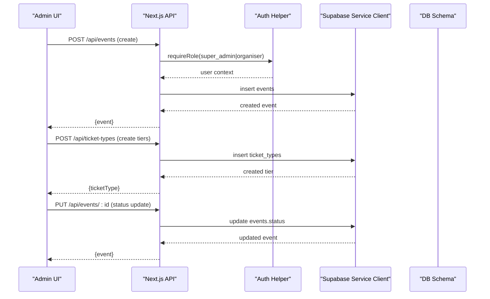

**Diagram sources**
- [events/index.js](file://pages/api/events/index.js)
- [events/[id].js](file://pages/api/events/[id].js)
- [ticket-types/index.js](file://pages/api/ticket-types/index.js)
- [auth.js](file://lib/auth.js)
- [supabase.js](file://lib/supabase.js)
- [schema.sql](file://supabase/schema.sql)

## Detailed Component Analysis

### Data Model and Relationships
The schema defines the following key entities and relationships:
- events: id, organiser_id, event_name, slug, date, time, venue, description, poster_image, performer_images, theme_color, capacity, status
- ticket_types: id, event_id (FK), name, price, quantity_available, quantity_sold, color
- tickets: id, event_id (FK), ticket_type_id (FK), buyer info, qr_code_token, is_checked_in, checked_in_at, purchase_date, status
- payments: id, ticket_id (FK), amount, currency, payment_method, transaction_ref, status, paid_at
- promo_codes: id, event_id (FK), code, discount_percent, max_uses, times_used, expires_at, is_active
- check_ins: id, ticket_id (FK), event_id (FK), staff_id, scanned_at, method, device_info

Relationships:
- One event has many ticket types
- One ticket type belongs to one event
- One event has many tickets
- One ticket belongs to one ticket type and one event
- Payments link to tickets
- Promo codes scope to events
- Check-ins link tickets and events

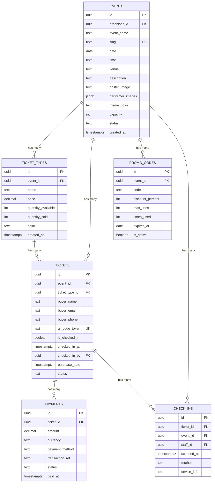

**Diagram sources**
- [schema.sql](file://supabase/schema.sql)

**Section sources**
- [schema.sql](file://supabase/schema.sql)

### Event Creation Workflow (Wizard)
The new event wizard collects basic info, branding, ticket types, venue, schedule, payments, and publish settings. It validates step-by-step, autosaves to localStorage, creates the event via API, then creates associated ticket types.

Key behaviors:
- Auto-generates slug from event name
- Validates required fields per step
- Persists draft state locally
- Submits event creation and multiple ticket type creations concurrently
- Redirects to event detail after success

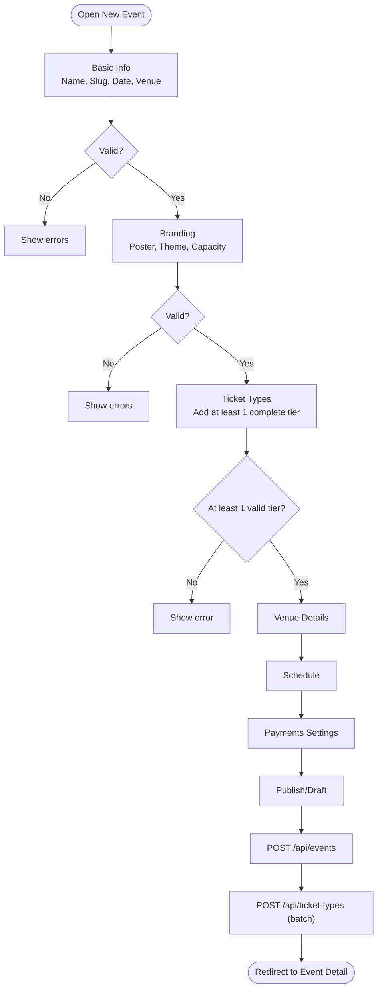

**Diagram sources**
- [admin/events/new.js](file://pages/admin/events/new.js)
- [events/index.js](file://pages/api/events/index.js)
- [ticket-types/index.js](file://pages/api/ticket-types/index.js)

**Section sources**
- [admin/events/new.js](file://pages/admin/events/new.js)
- [events/index.js](file://pages/api/events/index.js)
- [ticket-types/index.js](file://pages/api/ticket-types/index.js)

### Event Editing and Status Transitions
The event detail page allows updating the event’s status directly from a dropdown. The API route accepts PUT requests to update event fields, including status.

Status values enforced by schema:
- draft
- published
- sold_out
- completed
- cancelled

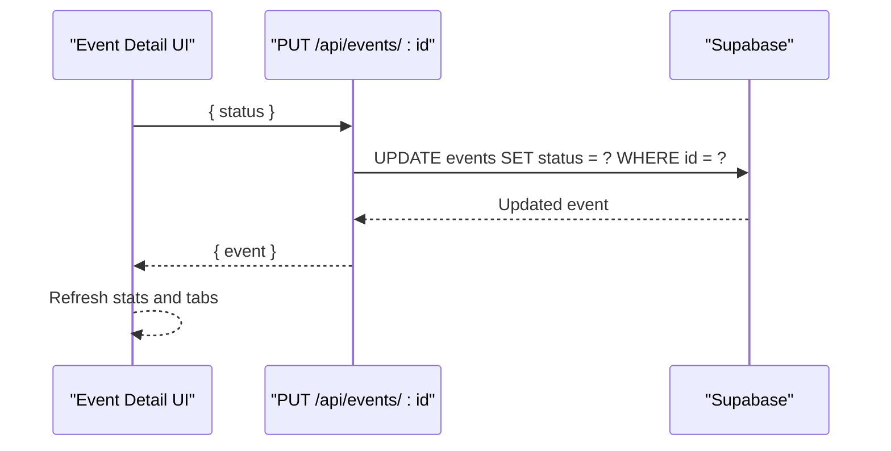

**Diagram sources**
- [admin/events/[id].js](file://pages/admin/events/[id].js)
- [events/[id].js](file://pages/api/events/[id].js)
- [schema.sql](file://supabase/schema.sql)

**Section sources**
- [admin/events/[id].js](file://pages/admin/events/[id].js)
- [events/[id].js](file://pages/api/events/[id].js)
- [schema.sql](file://supabase/schema.sql)

### Ticket Type Configuration and Inventory Tracking
Ticket types are created per event with name, price, and available quantity. The purchase flow checks remaining availability before issuing tickets and increments quantity_sold accordingly.

Key points:
- Each ticket type tracks quantity_available and quantity_sold
- Availability is enforced at purchase time
- Revenue per tier is computed from quantity_sold × price
- Admin UI shows progress bars and revenue summaries

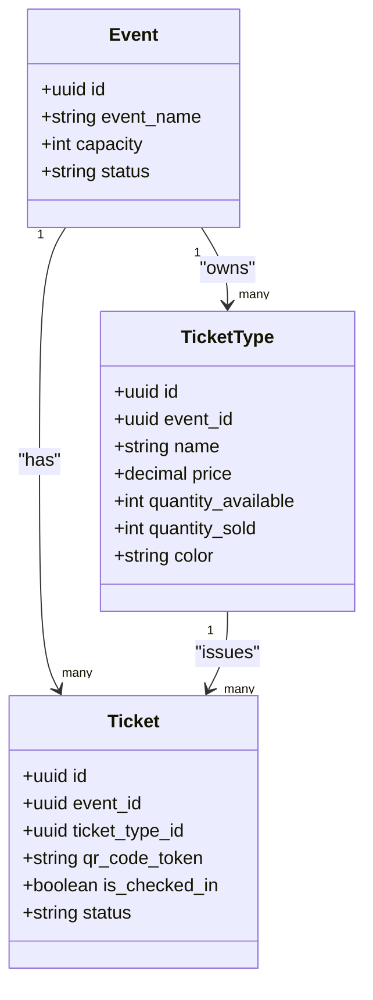

**Diagram sources**
- [schema.sql](file://supabase/schema.sql)
- [ticket-types/index.js](file://pages/api/ticket-types/index.js)
- [tickets/purchase.js](file://pages/api/tickets/purchase.js)
- [admin/events/[id].js](file://pages/admin/events/[id].js)

**Section sources**
- [ticket-types/index.js](file://pages/api/ticket-types/index.js)
- [tickets/purchase.js](file://pages/api/tickets/purchase.js)
- [admin/events/[id].js](file://pages/admin/events/[id].js)
- [schema.sql](file://supabase/schema.sql)

### Capacity Management and Sold-Out Logic
Capacity is stored at the event level. While ticket types track per-tier availability, overall capacity can be used for display and gating logic. The admin UI computes total available across all ticket types and shows sold vs available counts.

Operational notes:
- Total sold is sum of quantity_sold across ticket types
- Available = total quantity_available - total sold
- When total sold reaches total capacity, set status to sold_out
- Public listing only includes published events

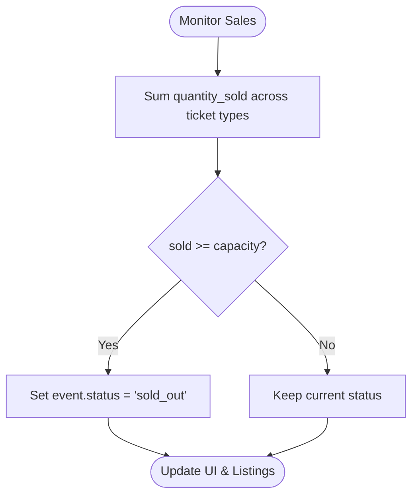

**Diagram sources**
- [admin/events/[id].js](file://pages/admin/events/[id].js)
- [schema.sql](file://supabase/schema.sql)

**Section sources**
- [admin/events/[id].js](file://pages/admin/events/[id].js)
- [schema.sql](file://supabase/schema.sql)

### Pricing Controls and Promotions
Pricing is defined per ticket type. Promo codes can apply percentage discounts during purchase. The purchase flow applies active promo codes if within usage limits and expiration.

Key behaviors:
- Unit price comes from ticket type
- Discount applied as percentage reduction
- Promo code usage incremented atomically
- Payment recorded with final amount

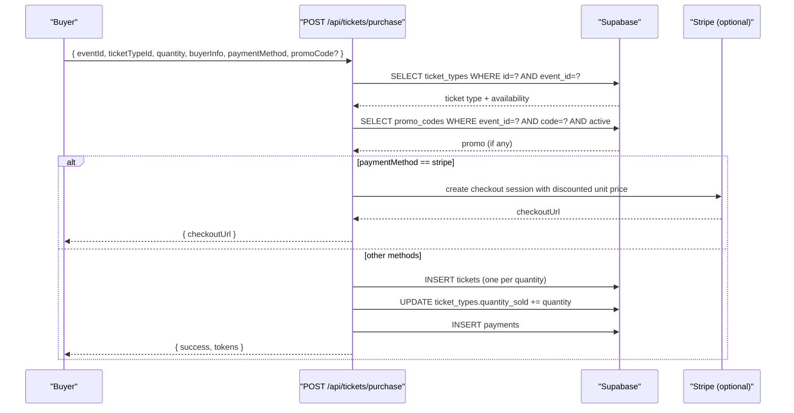

**Diagram sources**
- [tickets/purchase.js](file://pages/api/tickets/purchase.js)
- [schema.sql](file://supabase/schema.sql)

**Section sources**
- [tickets/purchase.js](file://pages/api/tickets/purchase.js)
- [schema.sql](file://supabase/schema.sql)

### Admin Interface Components
- Events List: Displays cards with event name, date, status badge, tickets sold, and checked-in count. Click navigates to detail.
- New Event Wizard: Multi-step form with validation, autosave, and concurrent creation of event and ticket types.
- Event Detail: Tabs for overview, ticket types, and attendees; inline status update; capacity and revenue metrics.

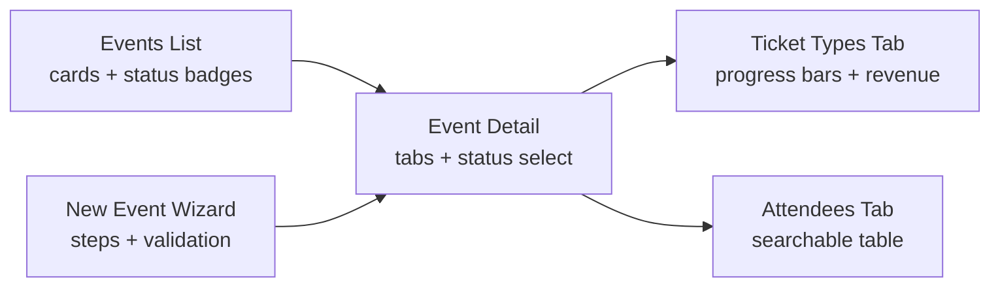

**Diagram sources**
- [admin/events/index.js](file://pages/admin/events/index.js)
- [admin/events/new.js](file://pages/admin/events/new.js)
- [admin/events/[id].js](file://pages/admin/events/[id].js)

**Section sources**
- [admin/events/index.js](file://pages/admin/events/index.js)
- [admin/events/new.js](file://pages/admin/events/new.js)
- [admin/events/[id].js](file://pages/admin/events/[id].js)

### API Endpoints Summary
- GET /api/events: Lists published events with ticket types
- POST /api/events: Creates an event (requires super_admin or organiser)
- GET /api/events/:id: Fetches event with ticket types
- PUT /api/events/:id: Updates event fields including status
- DELETE /api/events/:id: Deletes an event
- POST /api/ticket-types: Creates a ticket type for an event
- PUT /api/ticket-types: Updates a ticket type
- DELETE /api/ticket-types: Deletes a ticket type
- POST /api/tickets/purchase: Purchases tickets, enforces availability, applies promos

All protected endpoints use role-based authorization helpers.

**Section sources**
- [events/index.js](file://pages/api/events/index.js)
- [events/[id].js](file://pages/api/events/[id].js)
- [ticket-types/index.js](file://pages/api/ticket-types/index.js)
- [tickets/purchase.js](file://pages/api/tickets/purchase.js)
- [auth.js](file://lib/auth.js)

### Check-In Flow and Attendance Tracking
The check-in interface supports QR scanning and manual search. Scanning triggers verification against tickets and updates check-in status and logs.

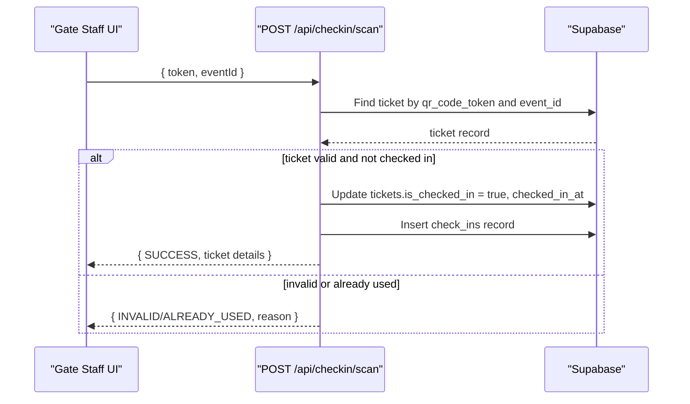

**Diagram sources**
- [checkin/[eventId].js](file://pages/checkin/[eventId].js)
- [schema.sql](file://supabase/schema.sql)

**Section sources**
- [checkin/[eventId].js](file://pages/checkin/[eventId].js)
- [schema.sql](file://supabase/schema.sql)

## Dependency Analysis
- UI components depend on API routes for data and mutations
- API routes depend on Supabase client and auth helpers
- Database schema enforces referential integrity and constraints
- Public read policies allow unauthenticated access to published events and their ticket types

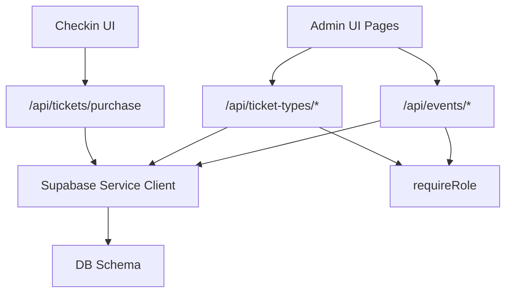

**Diagram sources**
- [admin/events/index.js](file://pages/admin/events/index.js)
- [admin/events/new.js](file://pages/admin/events/new.js)
- [admin/events/[id].js](file://pages/admin/events/[id].js)
- [checkin/[eventId].js](file://pages/checkin/[eventId].js)
- [events/index.js](file://pages/api/events/index.js)
- [events/[id].js](file://pages/api/events/[id].js)
- [ticket-types/index.js](file://pages/api/ticket-types/index.js)
- [tickets/purchase.js](file://pages/api/tickets/purchase.js)
- [supabase.js](file://lib/supabase.js)
- [auth.js](file://lib/auth.js)
- [schema.sql](file://supabase/schema.sql)

**Section sources**
- [supabase.js](file://lib/supabase.js)
- [auth.js](file://lib/auth.js)
- [schema.sql](file://supabase/schema.sql)

## Performance Considerations
- Use batched ticket type creation to reduce round trips during event setup
- Avoid heavy client-side computations; rely on server-side queries for aggregated stats
- Leverage indexes defined in schema for fast lookups (slug, status, qr_code_token, email, event_id)
- For high-volume check-in, consider server-side rate limiting and connection pooling
- Cache static event listings where appropriate to reduce repeated queries

[No sources needed since this section provides general guidance]

## Troubleshooting Guide
Common issues and resolutions:
- Missing required fields on event creation: Ensure event_name, slug, date, and venue are provided
- Insufficient permissions: Verify user role and session cookie presence
- Ticket availability errors: Confirm quantity_available exceeds requested quantity
- Promo code not applied: Check code case, event scoping, active flag, and expiration
- Check-in failures: Validate token exists for the event and ticket is not already used

Relevant files:
- Validation and error handling in event creation and ticket purchases
- Role checks in API routes
- Database constraints and policies

**Section sources**
- [events/index.js](file://pages/api/events/index.js)
- [events/[id].js](file://pages/api/events/[id].js)
- [ticket-types/index.js](file://pages/api/ticket-types/index.js)
- [tickets/purchase.js](file://pages/api/tickets/purchase.js)
- [auth.js](file://lib/auth.js)
- [schema.sql](file://supabase/schema.sql)

## Conclusion
The Event Management System provides a robust foundation for organizing events, configuring ticket types, managing capacity and pricing, and controlling availability throughout the event lifecycle. The admin interface streamlines creation and editing workflows, while APIs enforce security and business rules. The check-in flow ensures accurate attendance tracking. Together, these components deliver a cohesive solution for event organizers and gate staff.

[No sources needed since this section summarizes without analyzing specific files]