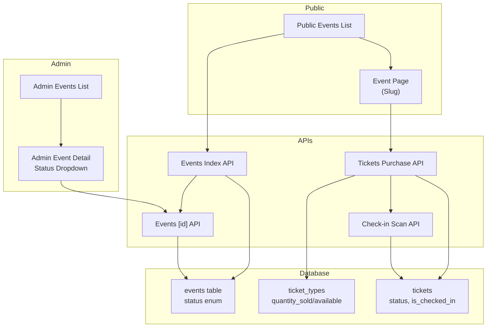
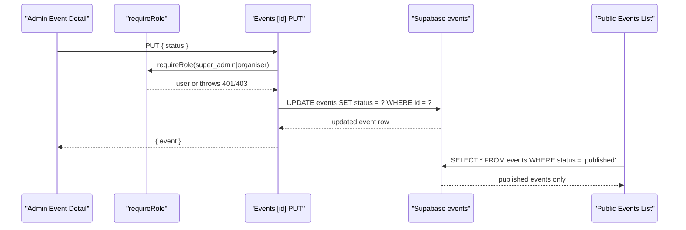
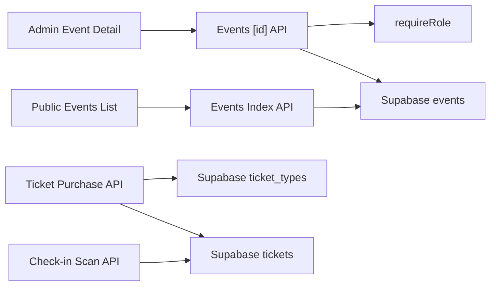

# Event Status Workflow

<cite>
**Referenced Files in This Document**
- [schema.sql](file://supabase/schema.sql)
- [events/index.js](file://pages/api/events/index.js)
- [events/[id].js](file://pages/api/events/[id].js)
- [admin events detail page](file://pages/admin/events/[id].js)
- [admin events list page](file://pages/admin/events/index.js)
- [public event page](file://pages/events/[slug].js)
- [ticket purchase API](file://pages/api/tickets/purchase.js)
- [check-in scan API](file://pages/api/checkin/scan.js)
- [auth helper](file://lib/auth.js)
</cite>

## Table of Contents
1. [Introduction](#introduction)
2. [Project Structure](#project-structure)
3. [Core Components](#core-components)
4. [Architecture Overview](#architecture-overview)
5. [Detailed Component Analysis](#detailed-component-analysis)
6. [Dependency Analysis](#dependency-analysis)
7. [Performance Considerations](#performance-considerations)
8. [Troubleshooting Guide](#troubleshooting-guide)
9. [Conclusion](#conclusion)

## Introduction
This document explains the event status workflow and lifecycle management across TicketFlow. It covers all supported statuses (draft, published, sold_out, completed, cancelled), how administrators update status via the UI, validation rules enforced by the database and APIs, and the impact of status changes on ticket availability, public visibility, and administrative access. It also documents automated behaviors related to ticket sales capacity and check-in processes, and outlines edge cases and error handling for status updates.

## Project Structure
The event status lifecycle spans the database schema, admin UI, public pages, and API endpoints:
- Database schema defines allowed statuses and policies that gate public visibility.
- Admin UI provides a dropdown to change an event’s status.
- Public event listing only shows published events.
- Ticket purchase enforces availability and updates sold counts.
- Check-in marks tickets as used and records attendance.

**Diagram sources**
- [schema.sql:24-40](file://supabase/schema.sql#L24-L40)
- [events/index.js:7-16](file://pages/api/events/index.js#L7-L16)
- [events/[id].js:18-29](file://pages/api/events/[id].js#L18-L29)
- [admin events detail page:34-39](file://pages/admin/events/[id].js#L34-L39)
- [ticket purchase API:14-26](file://pages/api/tickets/purchase.js#L14-L26)
- [check-in scan API:14-33](file://pages/api/checkin/scan.js#L14-L33)

**Section sources**
- [schema.sql:24-40](file://supabase/schema.sql#L24-L40)
- [events/index.js:7-16](file://pages/api/events/index.js#L7-L16)
- [events/[id].js:18-29](file://pages/api/events/[id].js#L18-L29)
- [admin events detail page:34-39](file://pages/admin/events/[id].js#L34-L39)
- [ticket purchase API:14-26](file://pages/api/tickets/purchase.js#L14-L26)
- [check-in scan API:14-33](file://pages/api/checkin/scan.js#L14-L33)

## Core Components
- Event status field and allowed values are enforced at the database level.
- Admin UI exposes a status selector to update events.
- Public listing filters to published events only.
- Ticket purchase validates availability and increments sold counts.
- Check-in marks tickets as used and records entry.

Key implementation points:
- Allowed statuses: draft, published, sold_out, completed, cancelled.
- Default new event status: draft.
- Public read policy restricts visibility to published events.
- Role-based access required for status updates.

**Section sources**
- [schema.sql:24-40](file://supabase/schema.sql#L24-L40)
- [schema.sql:131-139](file://supabase/schema.sql#L131-L139)
- [events/index.js:24-31](file://pages/api/events/index.js#L24-L31)
- [events/[id].js:18-29](file://pages/api/events/[id].js#L18-L29)
- [admin events detail page:34-39](file://pages/admin/events/[id].js#L34-L39)

## Architecture Overview
The status workflow integrates UI actions with server-side validation and database constraints:

**Diagram sources**
- [events/[id].js:18-29](file://pages/api/events/[id].js#L18-L29)
- [auth helper:39-46](file://lib/auth.js#L39-L46)
- [schema.sql:131-139](file://supabase/schema.sql#L131-L139)
- [events/index.js:7-16](file://pages/api/events/index.js#L7-L16)

## Detailed Component Analysis

### Event Status Lifecycle and Transition Rules
- Supported statuses: draft, published, sold_out, completed, cancelled.
- New events default to draft.
- The database CHECK constraint enforces allowed values; invalid transitions are rejected at the storage layer.
- No explicit transition matrix is implemented in code; any value within the allowed set can be set via the admin API.

Recommended business rules (for future enforcement):
- draft → published: when ready for public sale.
- published → sold_out: when total available tickets reach zero.
- published → cancelled: if event is canceled before completion.
- published → completed: after event date passes and operations are finalized.
- Any state → cancelled: immediate cancellation.
- completed: terminal state; no further sales or check-ins should occur.

Note: These rules are not currently enforced programmatically; they represent best practices aligned with the system’s capabilities.

**Section sources**
- [schema.sql:24-40](file://supabase/schema.sql#L24-L40)
- [events/index.js:24-31](file://pages/api/events/index.js#L24-L31)
- [events/[id].js:18-29](file://pages/api/events/[id].js#L18-L29)

### Admin UI: Updating Event Status
- The admin event detail page renders a status dropdown containing all valid statuses.
- On change, it calls the events API with a PUT request to update the status.
- The UI reflects the new status immediately after successful update.

Impact:
- Only authenticated users with appropriate roles can perform updates.
- Invalid or unauthorized requests return errors handled by the API.

**Section sources**
- [admin events detail page:34-39](file://pages/admin/events/[id].js#L34-L39)
- [events/[id].js:18-29](file://pages/api/events/[id].js#L18-L29)
- [auth helper:39-46](file://lib/auth.js#L39-L46)

### Public Visibility and Availability
- Public events list queries only events with status = published.
- The event page displays ticket types and allows purchases only when tickets are available.
- Sold-out indicators are computed from ticket type quantities.

Impact:
- Non-published events are invisible to the public.
- When tickets run out, purchasing is blocked until more capacity is added.

**Section sources**
- [events/index.js:7-16](file://pages/api/events/index.js#L7-L16)
- [public event page:130-135](file://pages/events/[slug].js#L130-L135)
- [ticket purchase API:14-26](file://pages/api/tickets/purchase.js#L14-L26)

### Automated Status Changes Based on Conditions
- Sold-out detection:
  - Ticket purchase checks remaining quantity per ticket type and blocks purchase if insufficient.
  - Sold counts are incremented upon successful purchase.
  - UI computes “sold out” visuals based on quantity_available vs quantity_sold.
- Completed/cancelled automation:
  - Not implemented in current codebase; these states must be set manually by admins.

Recommendation:
- Implement background jobs to auto-transition to sold_out when total sold equals total available.
- Auto-transition to completed after event date plus grace period.

**Section sources**
- [ticket purchase API:14-26](file://pages/api/tickets/purchase.js#L14-L26)
- [ticket purchase API:99-102](file://pages/api/tickets/purchase.js#L99-L102)
- [public event page:130-135](file://pages/events/[slug].js#L130-L135)

### Impact of Status Changes
- Public visibility:
  - Only published events are returned by the public events endpoint.
- Ticket availability:
  - Purchases proceed regardless of event status, but availability depends on ticket type quantities.
  - Best practice: disable purchases when status is not published.
- Administrative access:
  - Status updates require role-based authorization.

Edge cases:
- If an event is marked cancelled while tickets remain, existing tickets may still be valid unless explicitly refunded/cancelled.
- Completed events should prevent further check-ins and sales.

**Section sources**
- [events/index.js:7-16](file://pages/api/events/index.js#L7-L16)
- [events/[id].js:18-29](file://pages/api/events/[id].js#L18-L29)
- [schema.sql:131-139](file://supabase/schema.sql#L131-L139)

### Check-in Behavior and State Implications
- Check-in validates ticket existence, ownership, and prior usage.
- Successful check-in sets ticket status to used and records check-in metadata.
- Cancelled or refunded tickets cannot be checked in.

Implications:
- After event completion, ensure no further check-ins are permitted.
- Use ticket status to enforce entry rules consistently.

**Section sources**
- [check-in scan API:14-33](file://pages/api/checkin/scan.js#L14-L33)

## Dependency Analysis
The following diagram maps key dependencies between components involved in status workflows:

**Diagram sources**
- [admin events detail page:34-39](file://pages/admin/events/[id].js#L34-L39)
- [events/[id].js:18-29](file://pages/api/events/[id].js#L18-L29)
- [auth helper:39-46](file://lib/auth.js#L39-L46)
- [events/index.js:7-16](file://pages/api/events/index.js#L7-L16)
- [ticket purchase API:14-26](file://pages/api/tickets/purchase.js#L14-L26)
- [check-in scan API:14-33](file://pages/api/checkin/scan.js#L14-L33)

**Section sources**
- [admin events detail page:34-39](file://pages/admin/events/[id].js#L34-L39)
- [events/[id].js:18-29](file://pages/api/events/[id].js#L18-L29)
- [events/index.js:7-16](file://pages/api/events/index.js#L7-L16)
- [ticket purchase API:14-26](file://pages/api/tickets/purchase.js#L14-L26)
- [check-in scan API:14-33](file://pages/api/checkin/scan.js#L14-L33)

## Performance Considerations
- Public events list uses a filtered query for published status; ensure indexes exist for status and slug fields.
- Ticket purchase performs availability checks and updates sold counts; batch operations where possible.
- Check-in scans update ticket status and insert check-in records; consider transactional integrity for high-throughput gates.

[No sources needed since this section provides general guidance]

## Troubleshooting Guide
Common issues and resolutions:
- Unauthorized status updates:
  - Ensure the user session has super_admin or organiser role.
  - Verify cookie/session token validity and expiration.
- Invalid status values:
  - Database CHECK constraint rejects non-allowed values; confirm status strings match the enum.
- Public visibility not updating:
  - Confirm event status is set to published; verify RLS policies allow public reads for published events.
- Ticket purchase fails due to availability:
  - Check ticket type quantity_available vs quantity_sold; ensure sufficient remaining tickets.
- Check-in errors:
  - Validate ticket exists for the event, is not already used, and is not cancelled/refunded.

Error handling patterns:
- API routes return JSON errors with HTTP status codes.
- UI components display loading states and handle network errors gracefully.

**Section sources**
- [events/[id].js:18-29](file://pages/api/events/[id].js#L18-L29)
- [auth helper:39-46](file://lib/auth.js#L39-L46)
- [schema.sql:24-40](file://supabase/schema.sql#L24-L40)
- [events/index.js:7-16](file://pages/api/events/index.js#L7-L16)
- [ticket purchase API:14-26](file://pages/api/tickets/purchase.js#L14-L26)
- [check-in scan API:14-33](file://pages/api/checkin/scan.js#L14-L33)

## Conclusion
TicketFlow’s event status workflow is primarily driven by admin actions and enforced by database constraints. While automated transitions like sold_out and completed are not yet implemented, the system supports robust manual control and clear visibility rules. To strengthen consistency, introduce server-side transition validation and scheduled jobs for automated state changes. This will reduce human error and align operational behavior with business expectations.

[No sources needed since this section summarizes without analyzing specific files]