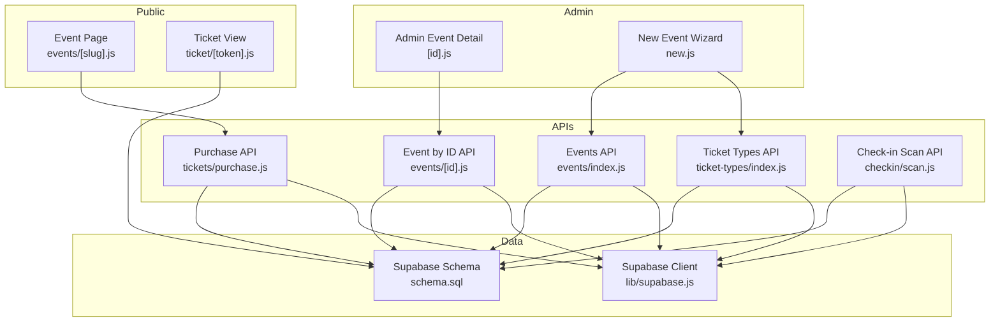
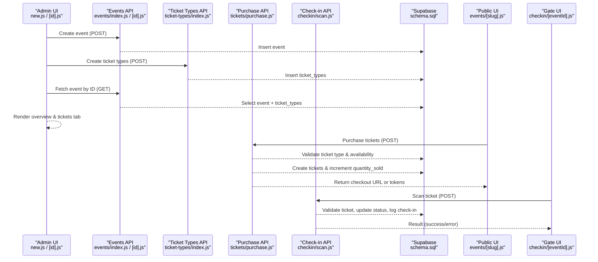
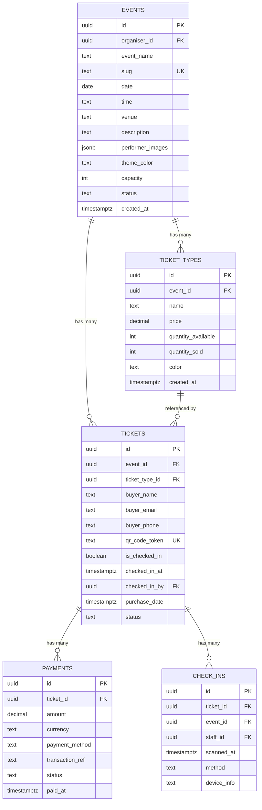
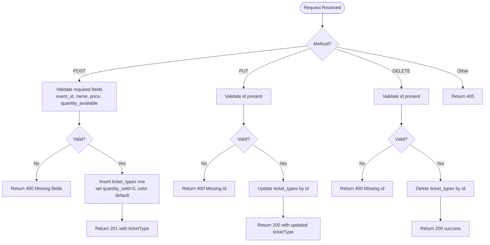
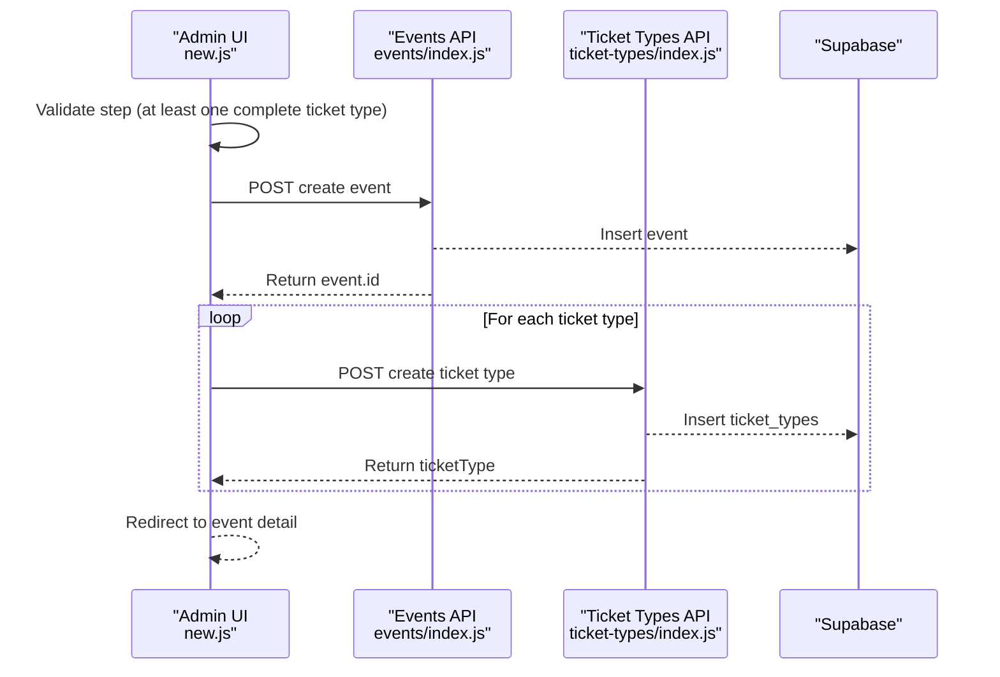
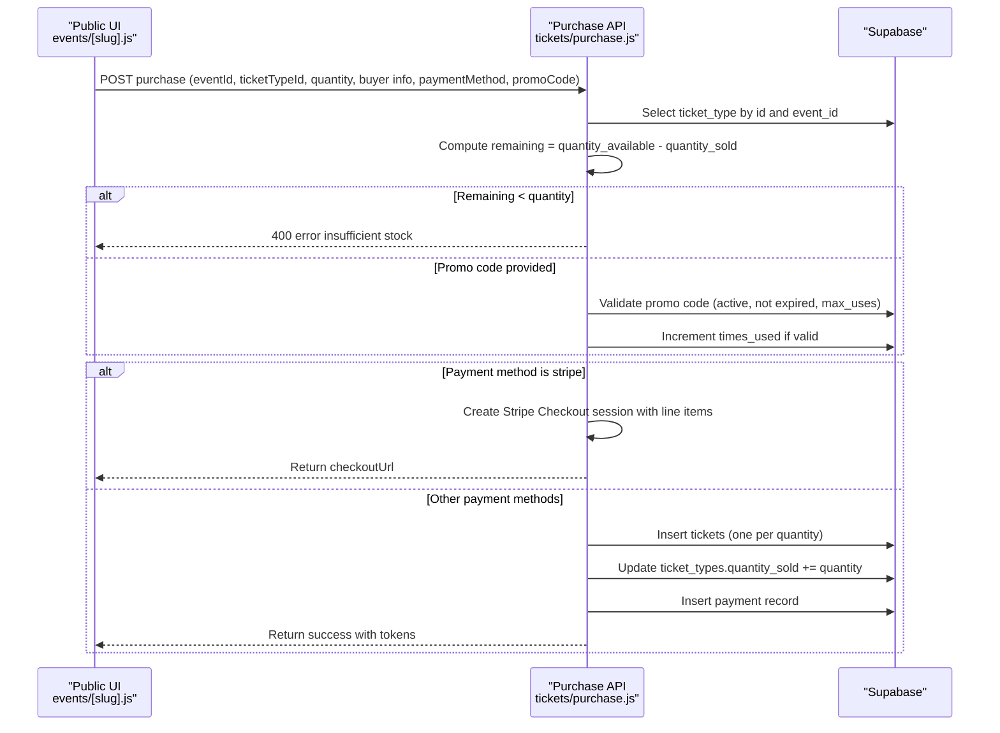
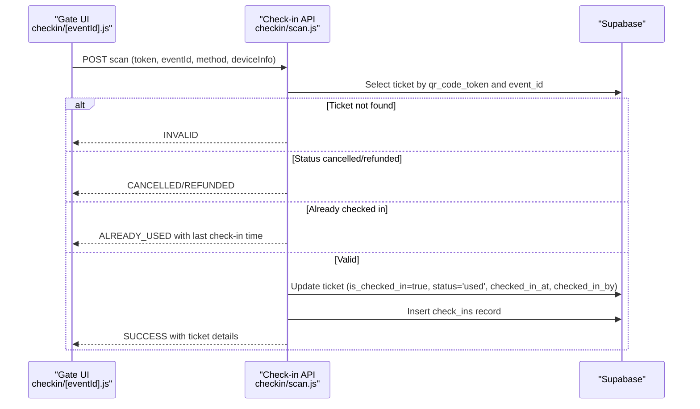
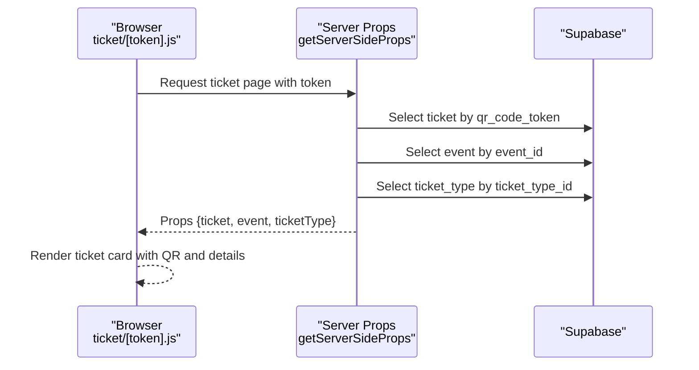
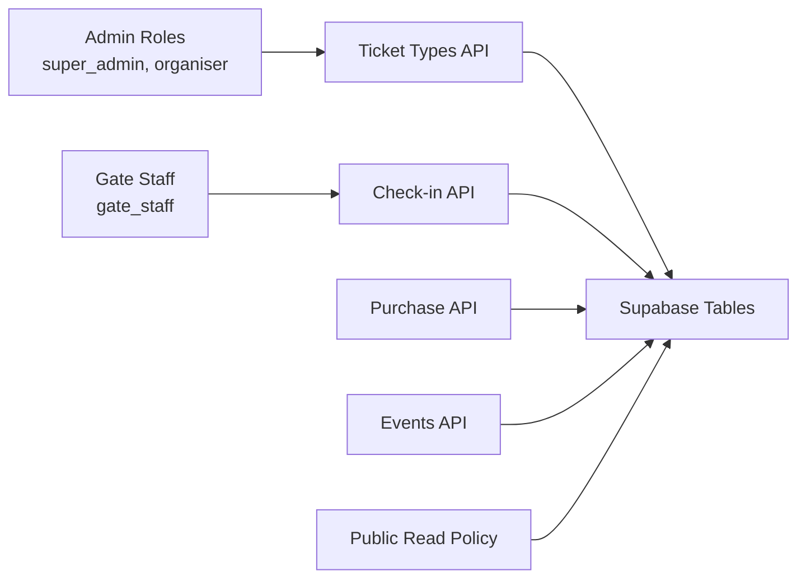

# Ticket Type Management

<cite>
**Referenced Files in This Document**
- [schema.sql](file://supabase/schema.sql)
- [index.js](file://pages/api/ticket-types/index.js)
- [new.js](file://pages/admin/events/new.js)
- [id.js](file://pages/admin/events/[id].js)
- [index.js](file://pages/api/events/index.js)
- [id.js](file://pages/api/events/[id].js)
- [purchase.js](file://pages/api/tickets/purchase.js)
- [scan.js](file://pages/api/checkin/scan.js)
- [token.js](file://pages/ticket/[token].js)
- [slug.js](file://pages/events/[slug].js)
- [supabase.js](file://lib/supabase.js)
</cite>

## Table of Contents
1. [Introduction](#introduction)
2. [Project Structure](#project-structure)
3. [Core Components](#core-components)
4. [Architecture Overview](#architecture-overview)
5. [Detailed Component Analysis](#detailed-component-analysis)
6. [Dependency Analysis](#dependency-analysis)
7. [Performance Considerations](#performance-considerations)
8. [Troubleshooting Guide](#troubleshooting-guide)
9. [Conclusion](#conclusion)
10. [Appendices](#appendices)

## Introduction
This document explains how ticket types are managed within event configuration in the system. It covers the data model for ticket types (pricing, capacity limits, and related fields), the UI flows for adding/editing/removing ticket types, validation rules, pricing calculations, inventory management, and relationships to sales tracking and check-in processes. It also provides guidance for common scenarios such as tiered pricing, limited availability, and configuring sale periods.

## Project Structure
The ticket type feature spans database schema definitions, API routes for CRUD operations, admin UI for creation and editing, public event pages for selection and purchase, and gate check-in flows. The key areas include:
- Database schema defining events, ticket_types, tickets, payments, and check-ins
- Admin APIs for creating/updating/deleting ticket types
- Admin UI wizard for creating events with multiple ticket types
- Public event page for selecting ticket types and purchasing
- Check-in API for validating and marking tickets used

**Diagram sources**
- [new.js](file://pages/admin/events/new.js)
- [id.js](file://pages/admin/events/[id].js)
- [index.js](file://pages/api/ticket-types/index.js)
- [index.js](file://pages/api/events/index.js)
- [id.js](file://pages/api/events/[id].js)
- [purchase.js](file://pages/api/tickets/purchase.js)
- [scan.js](file://pages/api/checkin/scan.js)
- [slug.js](file://pages/events/[slug].js)
- [token.js](file://pages/ticket/[token].js)
- [schema.sql](file://supabase/schema.sql)
- [supabase.js](file://lib/supabase.js)

**Section sources**
- [schema.sql](file://supabase/schema.sql)
- [index.js](file://pages/api/ticket-types/index.js)
- [new.js](file://pages/admin/events/new.js)
- [id.js](file://pages/admin/events/[id].js)
- [index.js](file://pages/api/events/index.js)
- [id.js](file://pages/api/events/[id].js)
- [purchase.js](file://pages/api/tickets/purchase.js)
- [scan.js](file://pages/api/checkin/scan.js)
- [token.js](file://pages/ticket/[token].js)
- [slug.js](file://pages/events/[slug].js)
- [supabase.js](file://lib/supabase.js)

## Core Components
- Data Model:
  - Events table stores event metadata including capacity and status.
  - Ticket Types table defines per-event ticket tiers with price, quantity_available, quantity_sold, and color.
  - Tickets table records individual tickets linked to a ticket type and event, with QR token and check-in state.
  - Payments and check_ins tables record transactions and entry events.
- Admin APIs:
  - Ticket Types API supports POST (create), PUT (update), DELETE (remove) with role checks.
  - Events APIs support listing published events with ticket types and fetching an event by ID with nested ticket types.
- Admin UI:
  - New Event wizard allows adding multiple ticket types with name, price, quantity, and color; validates at least one complete ticket type before submission.
  - Event detail view shows ticket type cards with sold counts, revenue, and progress bars.
- Purchase Flow:
  - Validates ticket type existence and remaining capacity, applies promo discounts, creates Stripe checkout or immediate tickets depending on payment method, and increments quantity_sold.
- Check-in Flow:
  - Validates ticket token, prevents double-check-in, updates ticket status to used, and logs a check-in record.

**Section sources**
- [schema.sql](file://supabase/schema.sql)
- [index.js](file://pages/api/ticket-types/index.js)
- [new.js](file://pages/admin/events/new.js)
- [id.js](file://pages/admin/events/[id].js)
- [index.js](file://pages/api/events/index.js)
- [id.js](file://pages/api/events/[id].js)
- [purchase.js](file://pages/api/tickets/purchase.js)
- [scan.js](file://pages/api/checkin/scan.js)

## Architecture Overview
The ticket type management architecture integrates admin workflows, public purchase flows, and gate operations through serverless API routes backed by Supabase.

**Diagram sources**
- [new.js](file://pages/admin/events/new.js)
- [id.js](file://pages/admin/events/[id].js)
- [index.js](file://pages/api/events/index.js)
- [id.js](file://pages/api/events/[id].js)
- [index.js](file://pages/api/ticket-types/index.js)
- [purchase.js](file://pages/api/tickets/purchase.js)
- [scan.js](file://pages/api/checkin/scan.js)
- [slug.js](file://pages/events/[slug].js)
- [schema.sql](file://supabase/schema.sql)

## Detailed Component Analysis

### Data Model: Ticket Types and Related Entities
- Events:
  - Fields include id, organiser_id, event_name, slug, date, time, venue, description, poster_image, performer_images, theme_color, capacity, status, created_at.
- Ticket Types:
  - Fields include id, event_id (FK to events), name, price, quantity_available, quantity_sold, color, created_at.
- Tickets:
  - Fields include id, event_id (FK to events), ticket_type_id (FK to ticket_types), buyer_name, buyer_email, buyer_phone, qr_code_token (unique), is_checked_in, checked_in_at, checked_in_by, purchase_date, status.
- Payments:
  - Fields include id, ticket_id (FK to tickets), amount, currency, payment_method, transaction_ref, status, paid_at.
- Check-ins:
  - Fields include id, ticket_id (FK to tickets), event_id (FK to events), staff_id (FK to users), scanned_at, method, device_info.

**Diagram sources**
- [schema.sql](file://supabase/schema.sql)

**Section sources**
- [schema.sql](file://supabase/schema.sql)

### Admin API: Ticket Types CRUD
- POST /api/ticket-types:
  - Requires role super_admin or organiser.
  - Validates required fields: event_id, name, price, quantity_available.
  - Inserts ticket_type with default quantity_sold=0 and optional color.
- PUT /api/ticket-types:
  - Requires role super_admin or organiser.
  - Updates ticket_type by id and returns updated record.
- DELETE /api/ticket-types:
  - Requires role super_admin or organiser.
  - Deletes ticket_type by id.

**Diagram sources**
- [index.js](file://pages/api/ticket-types/index.js)

**Section sources**
- [index.js](file://pages/api/ticket-types/index.js)

### Admin UI: Creating and Managing Ticket Types
- New Event Wizard:
  - Step 2 (Tickets) allows adding multiple ticket types with name, price, quantity, and color.
  - Validation ensures at least one complete ticket type (name, price >= 0, quantity > 0).
  - On submit, creates event first, then posts each valid ticket type to /api/ticket-types.
- Event Detail:
  - Displays ticket types with sold counts, revenue, and progress bars.
  - Provides link to edit event where ticket types can be managed.

**Diagram sources**
- [new.js](file://pages/admin/events/new.js)
- [index.js](file://pages/api/events/index.js)
- [index.js](file://pages/api/ticket-types/index.js)

**Section sources**
- [new.js](file://pages/admin/events/new.js)
- [id.js](file://pages/admin/events/[id].js)

### Public Event Page: Selecting and Purchasing Ticket Types
- Event page displays available ticket types with prices and remaining quantities.
- User selects a ticket type, sets quantity, optionally applies promo code, and proceeds to purchase.
- Purchase flow validates availability, calculates discounted price, and either redirects to Stripe checkout or creates tickets immediately for other payment methods.

**Diagram sources**
- [slug.js](file://pages/events/[slug].js)
- [purchase.js](file://pages/api/tickets/purchase.js)

**Section sources**
- [slug.js](file://pages/events/[slug].js)
- [purchase.js](file://pages/api/tickets/purchase.js)

### Check-in Process: Validating and Marking Tickets Used
- Gate UI scans or searches for tickets and calls check-in API.
- Check-in API validates ticket token, ensures it belongs to the event, checks status (not cancelled/refunded), and prevents duplicate check-ins.
- On success, updates ticket status to used, records checked_in_at and staff, and inserts a check-in record.

**Diagram sources**
- [scan.js](file://pages/api/checkin/scan.js)

**Section sources**
- [scan.js](file://pages/api/checkin/scan.js)

### Ticket View: Displaying Ticket Details
- Ticket page loads ticket by token, fetches associated event and ticket type details, and renders QR code, barcode-like lines, and ticket information.
- Shows status (active/used), price, and actions like copy link, print, and share.

**Diagram sources**
- [token.js](file://pages/ticket/[token].js)

**Section sources**
- [token.js](file://pages/ticket/[token].js)

## Dependency Analysis
- Role-based access control:
  - Ticket Types API requires super_admin or organiser roles for mutations.
  - Check-in API requires super_admin, organiser, or gate_staff roles.
- Data integrity:
  - Foreign keys enforce relationships between events, ticket_types, tickets, payments, and check-ins.
  - Unique constraints on qr_code_token prevent duplicate tickets.
- Availability enforcement:
  - Purchase API checks remaining capacity per ticket type before issuing tickets.
- Visibility:
  - Row-level security policies allow public read of published events and their ticket types.

**Diagram sources**
- [index.js](file://pages/api/ticket-types/index.js)
- [scan.js](file://pages/api/checkin/scan.js)
- [purchase.js](file://pages/api/tickets/purchase.js)
- [index.js](file://pages/api/events/index.js)
- [schema.sql](file://supabase/schema.sql)

**Section sources**
- [index.js](file://pages/api/ticket-types/index.js)
- [scan.js](file://pages/api/checkin/scan.js)
- [purchase.js](file://pages/api/tickets/purchase.js)
- [index.js](file://pages/api/events/index.js)
- [schema.sql](file://supabase/schema.sql)

## Performance Considerations
- Use service role client for server-side operations to bypass RLS and ensure consistent writes.
- Batch insert tickets when possible to reduce round trips during purchase.
- Indexes on frequently queried columns (qr_code_token, event_id, buyer_email) improve lookup performance.
- Avoid excessive client-side re-renders in admin dashboards by debouncing search and limiting result sets.

[No sources needed since this section provides general guidance]

## Troubleshooting Guide
- Missing required fields:
  - Ensure event_id, name, price, and quantity_available are provided when creating ticket types.
- Insufficient stock:
  - Verify quantity_available vs quantity_sold; purchase will fail if remaining < requested quantity.
- Duplicate check-in:
  - If a ticket is already marked used, the check-in API returns ALREADY_USED with last check-in time.
- Invalid ticket token:
  - Confirm the token matches a ticket for the specified event; otherwise INVALID is returned.
- Promo code issues:
  - Validate that promo codes are active, not expired, and have remaining uses.

**Section sources**
- [index.js](file://pages/api/ticket-types/index.js)
- [purchase.js](file://pages/api/tickets/purchase.js)
- [scan.js](file://pages/api/checkin/scan.js)

## Conclusion
Ticket type management in this system is built around a clear data model, robust API endpoints with role-based access, and intuitive admin and public interfaces. Availability is enforced at purchase time, sales tracking is maintained via quantity_sold, and check-in processes ensure accurate entry logging. By following the documented flows and validations, organizers can configure tiered pricing, manage limited availability, and operate efficient gate check-ins.

[No sources needed since this section summarizes without analyzing specific files]

## Appendices

### Common Scenarios and Best Practices
- Tiered Pricing:
  - Define multiple ticket types per event (e.g., Early Bird, General Admission, VIP) with distinct prices and colors for visual differentiation.
- Limited Availability:
  - Set quantity_available per ticket type; the system enforces remaining stock during purchase.
- Sale Periods:
  - While explicit sale start/end dates are not modeled in ticket_types, you can control visibility by event status (draft/published/sold_out) and use promo codes to limit discount usage.
- Revenue Tracking:
  - Revenue per ticket type is computed as quantity_sold * price; displayed in admin event detail.
- Check-in Operations:
  - Use the gate UI to scan or search tickets; ensure staff roles are configured for scanning access.

**Section sources**
- [new.js](file://pages/admin/events/new.js)
- [id.js](file://pages/admin/events/[id].js)
- [purchase.js](file://pages/api/tickets/purchase.js)
- [scan.js](file://pages/api/checkin/scan.js)