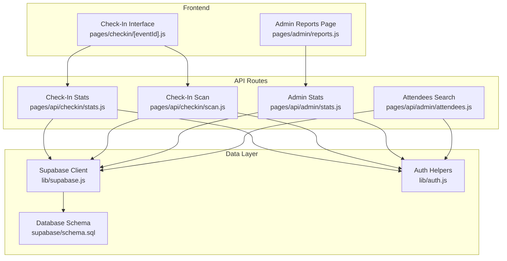
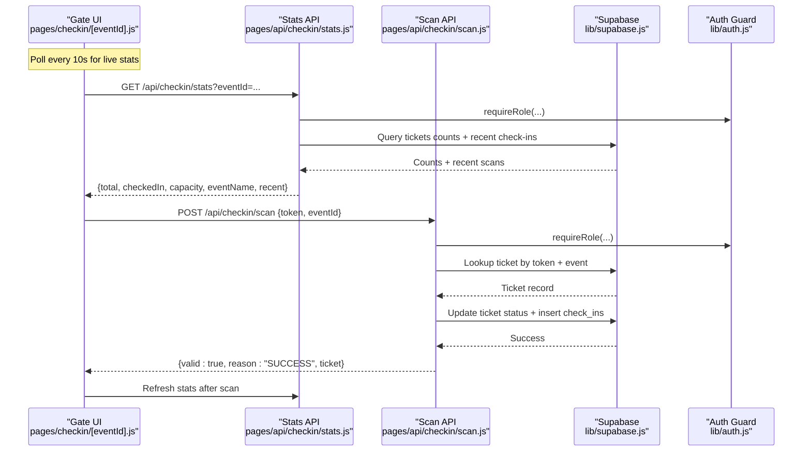
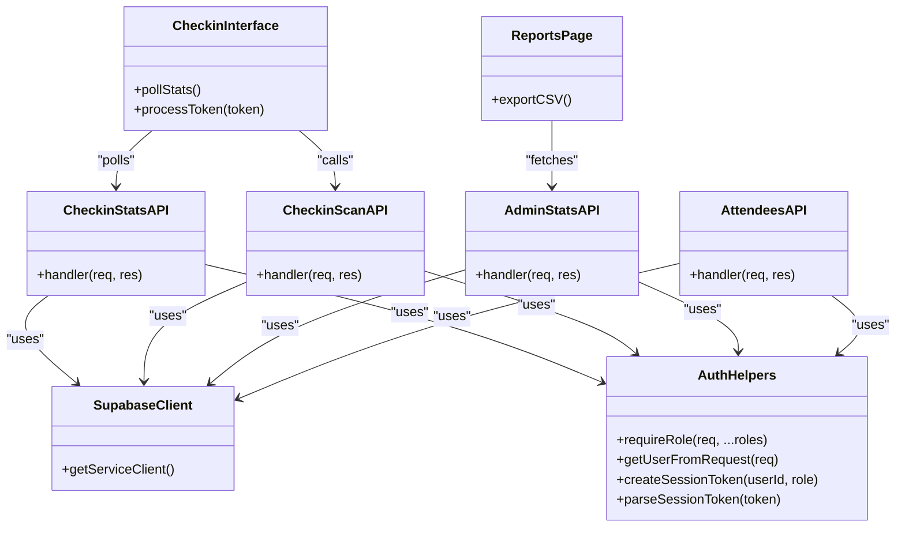
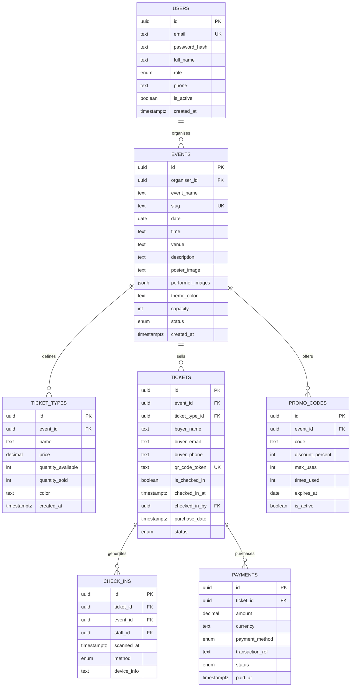

# Attendance Statistics & Reporting

<cite>
**Referenced Files in This Document**
- [pages/api/checkin/stats.js](file://pages/api/checkin/stats.js)
- [pages/api/checkin/scan.js](file://pages/api/checkin/scan.js)
- [pages/api/admin/stats.js](file://pages/api/admin/stats.js)
- [pages/api/admin/attendees.js](file://pages/api/admin/attendees.js)
- [pages/admin/reports.js](file://pages/admin/reports.js)
- [pages/checkin/[eventId].js](file://pages/checkin/[eventId].js)
- [lib/supabase.js](file://lib/supabase.js)
- [lib/auth.js](file://lib/auth.js)
- [supabase/schema.sql](file://supabase/schema.sql)
- [components/ui/Progress.js](file://components/ui/Progress.js)
</cite>

## Table of Contents
1. [Introduction](#introduction)
2. [Project Structure](#project-structure)
3. [Core Components](#core-components)
4. [Architecture Overview](#architecture-overview)
5. [Detailed Component Analysis](#detailed-component-analysis)
6. [Dependency Analysis](#dependency-analysis)
7. [Performance Considerations](#performance-considerations)
8. [Troubleshooting Guide](#troubleshooting-guide)
9. [Conclusion](#conclusion)
10. [Appendices](#appendices)

## Introduction
This document explains the Attendance Statistics & Reporting feature, covering how check-in data is collected, aggregated, and presented across real-time gate operations and administrative dashboards. It details the statistics APIs, data models, aggregation logic, visualization components, export capabilities, and performance strategies for large datasets. It also provides concrete examples of reports, check-in rate calculations, and peak hour analysis, along with troubleshooting guidance for synchronization issues and bottlenecks.

## Project Structure
The feature spans serverless API routes, a Next.js admin dashboard, and a dedicated check-in interface. Data persistence is handled by Supabase tables defined in the schema.

**Diagram sources**
- [pages/admin/reports.js](file://pages/admin/reports.js)
- [pages/checkin/[eventId].js](file://pages/checkin/[eventId].js)
- [pages/api/checkin/stats.js](file://pages/api/checkin/stats.js)
- [pages/api/checkin/scan.js](file://pages/api/checkin/scan.js)
- [pages/api/admin/stats.js](file://pages/api/admin/stats.js)
- [pages/api/admin/attendees.js](file://pages/api/admin/attendees.js)
- [lib/supabase.js](file://lib/supabase.js)
- [lib/auth.js](file://lib/auth.js)
- [supabase/schema.sql](file://supabase/schema.sql)

**Section sources**
- [pages/admin/reports.js](file://pages/admin/reports.js)
- [pages/checkin/[eventId].js](file://pages/checkin/[eventId].js)
- [pages/api/checkin/stats.js](file://pages/api/checkin/stats.js)
- [pages/api/checkin/scan.js](file://pages/api/checkin/scan.js)
- [pages/api/admin/stats.js](file://pages/api/admin/stats.js)
- [pages/api/admin/attendees.js](file://pages/api/admin/attendees.js)
- [lib/supabase.js](file://lib/supabase.js)
- [lib/auth.js](file://lib/auth.js)
- [supabase/schema.sql](file://supabase/schema.sql)

## Core Components
- Check-In Stats API: Aggregates total tickets, checked-in count, capacity, event name, and recent scans for an event. Used by the gate interface to show live metrics.
- Check-In Scan API: Validates ticket tokens, prevents duplicate or invalid checks, updates ticket status, and records a check-in audit entry.
- Admin Stats API: Computes revenue, total tickets sold, per-event breakdown (sold and checked-in), and overall totals for the admin dashboard.
- Attendees Search API: Returns tickets for an event with optional search filters; used by the manual search tab in the check-in UI.
- Admin Reports Page: Visualizes revenue, ticket mix, per-event attendance, and supports CSV export.
- Check-In Interface: Real-time polling for stats, scanning/search workflows, and recent scan history display.

Key responsibilities:
- Authentication and authorization via role-based guards.
- Efficient queries using Supabase service client.
- Real-time updates through periodic polling on the client.
- Export functionality at the frontend layer.

**Section sources**
- [pages/api/checkin/stats.js](file://pages/api/checkin/stats.js)
- [pages/api/checkin/scan.js](file://pages/api/checkin/scan.js)
- [pages/api/admin/stats.js](file://pages/api/admin/stats.js)
- [pages/api/admin/attendees.js](file://pages/api/admin/attendees.js)
- [pages/admin/reports.js](file://pages/admin/reports.js)
- [pages/checkin/[eventId].js](file://pages/checkin/[eventId].js)
- [lib/auth.js](file://lib/auth.js)
- [lib/supabase.js](file://lib/supabase.js)

## Architecture Overview
The system uses a clear separation between UI, API routes, and database. The Supabase service client is used server-side to bypass row-level security policies where appropriate, while auth helpers enforce role-based access.

**Diagram sources**
- [pages/checkin/[eventId].js](file://pages/checkin/[eventId].js)
- [pages/api/checkin/stats.js](file://pages/api/checkin/stats.js)
- [pages/api/checkin/scan.js](file://pages/api/checkin/scan.js)
- [lib/supabase.js](file://lib/supabase.js)
- [lib/auth.js](file://lib/auth.js)

## Detailed Component Analysis

### Check-In Stats API
Responsibilities:
- Enforce role-based access for super_admin, organiser, and gate_staff.
- Compute total active tickets and checked-in count for the specified event.
- Return recent check-ins with buyer and ticket type info.
- Include event metadata like capacity and name.

Aggregation logic:
- Total = active tickets + already checked-in tickets for the event.
- Checked-in = count of tickets marked as checked_in true.
- Recent scans ordered by scanned_at descending, limited to 20.

Real-time usage:
- The gate UI polls this endpoint every 10 seconds to update counters and recent activity.

Error handling:
- Returns 405 for non-GET requests.
- Returns 400 when eventId is missing.
- Propagates errors from Supabase or auth guard.

**Section sources**
- [pages/api/checkin/stats.js](file://pages/api/checkin/stats.js)
- [lib/auth.js](file://lib/auth.js)
- [lib/supabase.js](file://lib/supabase.js)

### Check-In Scan API
Responsibilities:
- Validate staff role and required fields.
- Look up ticket by QR token and event.
- Reject invalid, cancelled, refunded, or already-used tickets.
- On success, mark ticket as used and record a check-in audit entry.

Flow:
- Input validation and authentication.
- Ticket lookup and state checks.
- Atomic updates to ticket and insertion into check_ins table.
- Response includes ticket details and success message.

Edge cases:
- Already used returns time of previous check-in.
- Network or DB errors return appropriate status codes.

**Section sources**
- [pages/api/checkin/scan.js](file://pages/api/checkin/scan.js)
- [lib/auth.js](file://lib/auth.js)
- [lib/supabase.js](file://lib/supabase.js)

### Admin Stats API
Responsibilities:
- Aggregate revenue from completed payments linked to tickets.
- Count total tickets sold excluding cancelled/refunded statuses.
- Provide per-event breakdown including sold and checked-in counts.
- Filter events by user role (organiser sees only their events).

Aggregation logic:
- Payments filtered by status completed and ticket_id belonging to queried events.
- Tickets grouped by event_id to compute sold and checked-in counts.
- Revenue sum computed from payment amounts.

Error handling:
- Returns empty aggregates if no events exist.
- Handles DB errors gracefully.

**Section sources**
- [pages/api/admin/stats.js](file://pages/api/admin/stats.js)
- [lib/auth.js](file://lib/auth.js)
- [lib/supabase.js](file://lib/supabase.js)

### Attendees Search API
Responsibilities:
- Fetch tickets for an event with optional search across buyer_name, email, phone, and qr_code_token.
- Order by purchase_date descending.
- Include ticket type details.

Usage:
- Powers the manual search tab in the check-in interface.

Error handling:
- Returns error messages for DB failures.

**Section sources**
- [pages/api/admin/attendees.js](file://pages/api/admin/attendees.js)
- [lib/auth.js](file://lib/auth.js)
- [lib/supabase.js](file://lib/supabase.js)

### Admin Reports Page
Responsibilities:
- Display high-level KPIs: total revenue, tickets sold, total events, average revenue per event.
- Show revenue by event with horizontal bars.
- Present ticket type mix distribution.
- Render per-event attendance table with sold, checked-in, and attendance percentage.
- Export CSV with event details.

Visualization components:
- Stat cards with gradient accents.
- Progress bars for attendance percentages.
- Bar charts implemented with styled divs.

Export functionality:
- Generates CSV client-side from fetched stats.events array.

Filtering:
- Date range and event selection inputs are present; apply action placeholder exists.

**Section sources**
- [pages/admin/reports.js](file://pages/admin/reports.js)
- [components/ui/Progress.js](file://components/ui/Progress.js)

### Check-In Interface
Responsibilities:
- Poll stats every 10 seconds to reflect live metrics.
- Support QR scanning via camera or USB scanner input.
- Manual attendee search and direct check-in actions.
- Display recent scans timeline and today’s entries count.

Real-time behavior:
- Interval-based polling ensures near-real-time updates without WebSockets.
- Result feedback with color-coded states and auto-clear timeout.

Battery-friendly mode:
- Reduces visual effects and animations to conserve power.

**Section sources**
- [pages/checkin/[eventId].js](file://pages/checkin/[eventId].js)
- [pages/api/checkin/stats.js](file://pages/api/checkin/stats.js)
- [pages/api/checkin/scan.js](file://pages/api/checkin/scan.js)

## Dependency Analysis
The feature relies on Supabase for data persistence and authentication middleware for role enforcement. The following diagram shows core dependencies and relationships.

**Diagram sources**
- [lib/supabase.js](file://lib/supabase.js)
- [lib/auth.js](file://lib/auth.js)
- [pages/api/checkin/stats.js](file://pages/api/checkin/stats.js)
- [pages/api/checkin/scan.js](file://pages/api/checkin/scan.js)
- [pages/api/admin/stats.js](file://pages/api/admin/stats.js)
- [pages/api/admin/attendees.js](file://pages/api/admin/attendees.js)
- [pages/admin/reports.js](file://pages/admin/reports.js)
- [pages/checkin/[eventId].js](file://pages/checkin/[eventId].js)

**Section sources**
- [lib/supabase.js](file://lib/supabase.js)
- [lib/auth.js](file://lib/auth.js)
- [pages/api/checkin/stats.js](file://pages/api/checkin/stats.js)
- [pages/api/checkin/scan.js](file://pages/api/checkin/scan.js)
- [pages/api/admin/stats.js](file://pages/api/admin/stats.js)
- [pages/api/admin/attendees.js](file://pages/api/admin/attendees.js)
- [pages/admin/reports.js](file://pages/admin/reports.js)
- [pages/checkin/[eventId].js](file://pages/checkin/[eventId].js)

## Performance Considerations
- Database indexing: Ensure indexes on frequently queried columns such as event_id, qr_code_token, buyer_email, and check_ins.event_id. These are defined in the schema to optimize lookups and aggregations.
- Query efficiency: Use head queries for counts and limit recent results to reduce payload size.
- Polling interval: The check-in interface polls every 10 seconds; adjust based on expected traffic and device constraints.
- Serverless cold starts: Minimize heavy initialization in API handlers; rely on Supabase client reuse patterns.
- Frontend rendering: Avoid unnecessary re-renders by memoizing derived values and limiting DOM updates during rapid polling.
- Large dataset strategies:
  - Implement pagination or cursor-based fetching for attendees search beyond small result sets.
  - Consider materialized views or summary tables for heavy aggregations (e.g., daily check-in counts, peak hours).
  - Cache frequent read-only aggregates at the edge or within the API layer if supported by your hosting environment.

[No sources needed since this section provides general guidance]

## Troubleshooting Guide
Common issues and resolutions:
- Authentication failures:
  - Symptom: 401 or 403 responses from API routes.
  - Cause: Missing or expired session cookie, insufficient role.
  - Resolution: Verify cookie presence and expiration; ensure user has required role (super_admin, organiser, gate_staff).

- Invalid or duplicate check-ins:
  - Symptom: Scan returns INVALID, CANCELLED, REFUNDED, or ALREADY_USED.
  - Cause: Token mismatch, ticket state changes, or prior check-in.
  - Resolution: Confirm token and event association; review ticket status; handle ALREADY_USED by informing staff of previous check-in time.

- Empty or stale statistics:
  - Symptom: Zero counts or outdated numbers in gate UI.
  - Cause: No active tickets, network issues, or slow polling.
  - Resolution: Verify event has active tickets; check network connectivity; increase polling frequency if necessary.

- Slow attendee search:
  - Symptom: Delayed search results for large events.
  - Cause: Lack of indexes or unoptimized queries.
  - Resolution: Add indexes on searchable fields; implement pagination; consider full-text search extensions.

- Revenue discrepancies:
  - Symptom: Reported revenue does not match expectations.
  - Cause: Pending or failed payments included/excluded incorrectly.
  - Resolution: Ensure only completed payments are summed; verify payment status filtering.

- Data synchronization issues:
  - Symptom: Inconsistent counts between check-in UI and admin dashboard.
  - Cause: Eventual consistency due to polling intervals.
  - Resolution: Increase polling frequency; add explicit refresh triggers after critical actions; consider WebSocket or server-sent events for real-time sync.

**Section sources**
- [lib/auth.js](file://lib/auth.js)
- [pages/api/checkin/scan.js](file://pages/api/checkin/scan.js)
- [pages/api/checkin/stats.js](file://pages/api/checkin/stats.js)
- [pages/api/admin/stats.js](file://pages/api/admin/stats.js)
- [pages/api/admin/attendees.js](file://pages/api/admin/attendees.js)
- [supabase/schema.sql](file://supabase/schema.sql)

## Conclusion
The Attendance Statistics & Reporting feature provides robust mechanisms for collecting check-in data, computing key metrics, and presenting them in both real-time operational interfaces and administrative dashboards. With role-based security, efficient queries, and clear data models, it supports scalable reporting and analytics. Future enhancements can include advanced caching, real-time streaming, and deeper analytical insights such as peak hour analysis and predictive attendance modeling.

[No sources needed since this section summarizes without analyzing specific files]

## Appendices

### Data Model Overview

**Diagram sources**
- [supabase/schema.sql](file://supabase/schema.sql)

### Example Metrics and Calculations
- Check-in rate per event:
  - Formula: (checked_in / sold) * 100
  - Where sold excludes cancelled and refunded tickets.
- Peak hour analysis:
  - Group check_ins.scanned_at by hour for a given event and day; identify the hour with maximum count.
- Today’s entries:
  - Count check_ins where scanned_at falls within the current calendar day.
- Revenue per event:
  - Sum payments.amount where status is completed and ticket belongs to the event.

[No sources needed since this section provides conceptual formulas and examples]

### Export Functionality
- CSV export:
  - Implemented in the admin reports page; constructs rows from stats.events and downloads via Blob URL.
- Customization options:
  - Current implementation exports event name, status, date, sold, and checked-in fields.
  - Extendable to include additional metrics like revenue and check-in rate.

**Section sources**
- [pages/admin/reports.js](file://pages/admin/reports.js)

### Visualization Components
- Progress bar component:
  - Displays value/max with optional label and customizable height/color.
- Charts:
  - Horizontal bar chart for revenue by event.
  - Segmented bar for ticket type mix.

**Section sources**
- [components/ui/Progress.js](file://components/ui/Progress.js)
- [pages/admin/reports.js](file://pages/admin/reports.js)