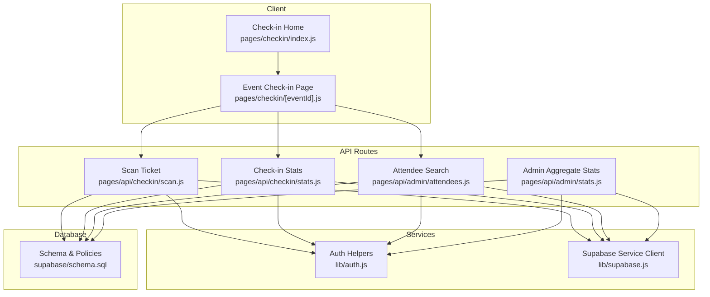
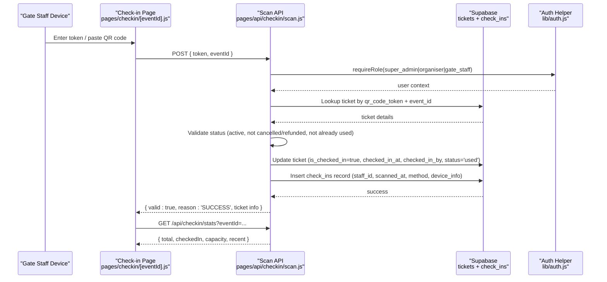
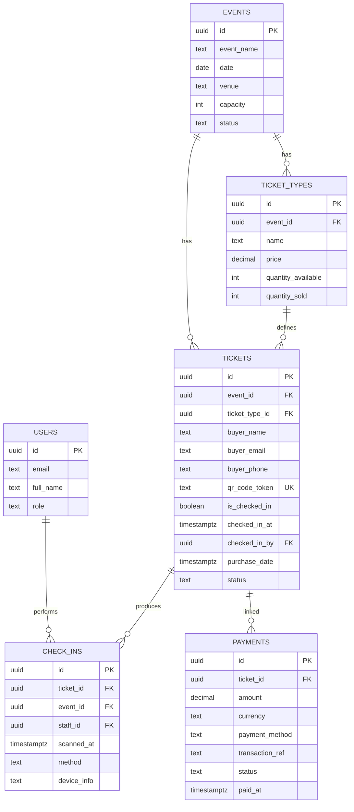
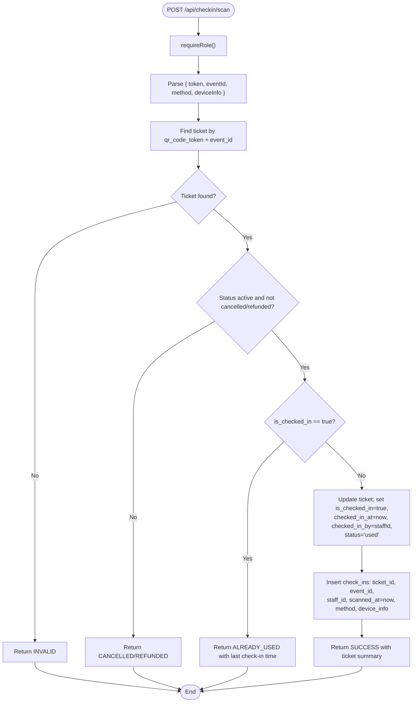
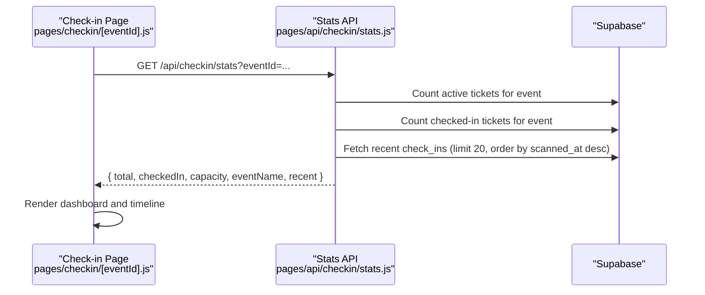
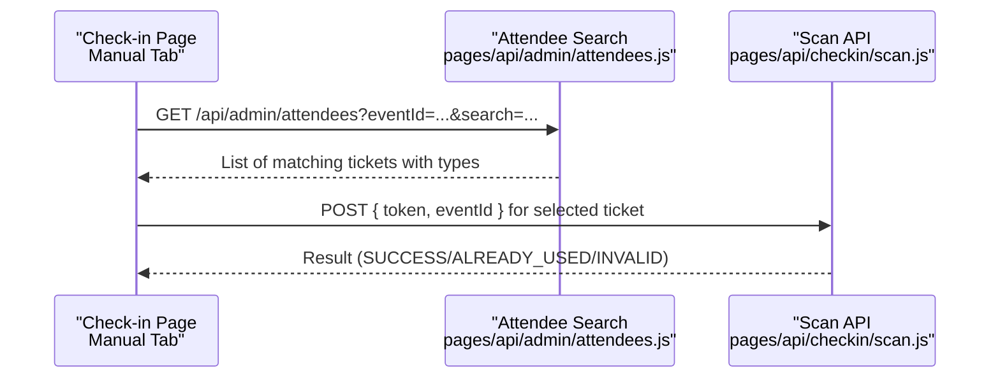
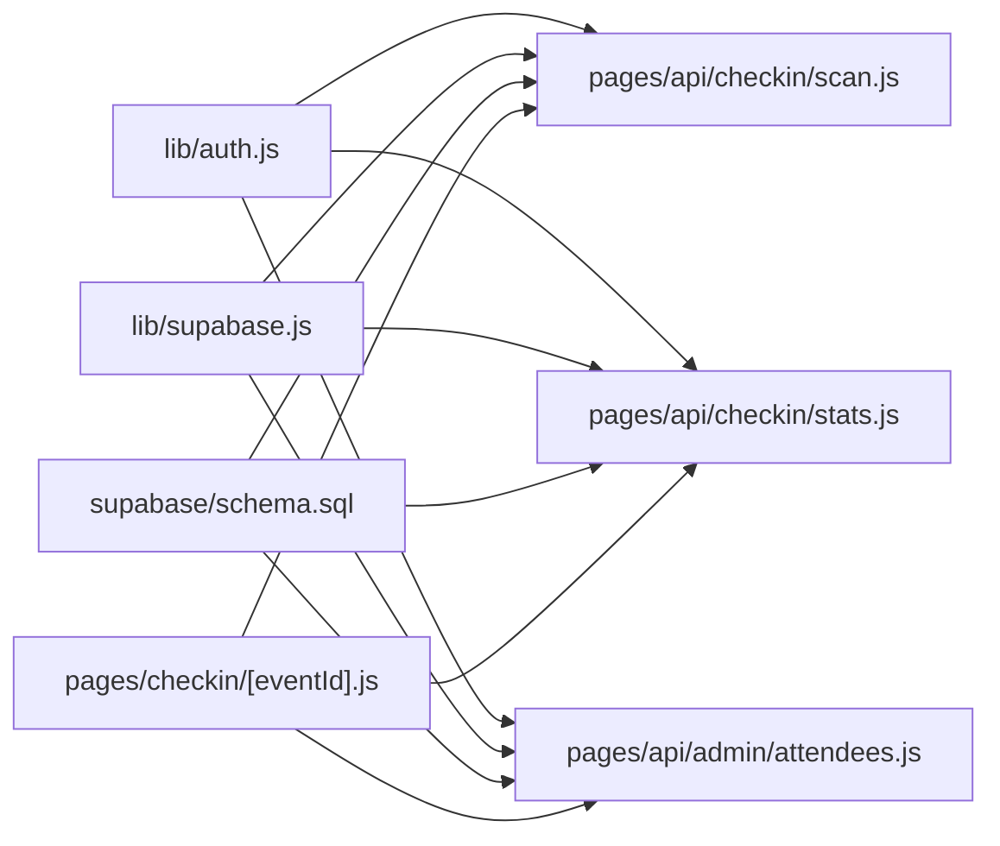

# Check-in Tracking System

<cite>
**Referenced Files in This Document**
- [schema.sql](file://supabase/schema.sql)
- [scan.js](file://pages/api/checkin/scan.js)
- [stats.js](file://pages/api/checkin/stats.js)
- [attendees.js](file://pages/api/admin/attendees.js)
- [eventId.js](file://pages/checkin/[eventId].js)
- [index.js](file://pages/checkin/index.js)
- [auth.js](file://lib/auth.js)
- [supabase.js](file://lib/supabase.js)
- [admin_stats.js](file://pages/api/admin/stats.js)
</cite>

## Table of Contents
1. [Introduction](#introduction)
2. [Project Structure](#project-structure)
3. [Core Components](#core-components)
4. [Architecture Overview](#architecture-overview)
5. [Detailed Component Analysis](#detailed-component-analysis)
6. [Dependency Analysis](#dependency-analysis)
7. [Performance Considerations](#performance-considerations)
8. [Troubleshooting Guide](#troubleshooting-guide)
9. [Conclusion](#conclusion)

## Introduction
This document explains the Check-in Tracking System for TiketFlow, focusing on how check-in records are created and stored, timestamp tracking, staff attribution, device information logging, data model relationships, audit trail functionality, and reporting capabilities. It also covers data consistency, transaction management, concurrent access handling, real-time updates, and performance optimization strategies for high-volume scanning scenarios.

## Project Structure
The check-in feature spans API routes, a Next.js client page, authentication utilities, Supabase client configuration, and the database schema:

- API endpoints:
  - Check-in scan: pages/api/checkin/scan.js
  - Check-in stats: pages/api/checkin/stats.js
  - Admin attendee search: pages/api/admin/attendees.js
  - Admin aggregate stats: pages/api/admin/stats.js
- Client pages:
  - Gate staff event selection: pages/checkin/index.js
  - Event-specific check-in UI with live stats: pages/checkin/[eventId].js
- Utilities:
  - Authentication helpers: lib/auth.js
  - Supabase client (service role): lib/supabase.js
- Database schema: supabase/schema.sql

**Diagram sources**
- [scan.js](file://pages/api/checkin/scan.js)
- [stats.js](file://pages/api/checkin/stats.js)
- [attendees.js](file://pages/api/admin/attendees.js)
- [eventId.js](file://pages/checkin/[eventId].js)
- [index.js](file://pages/checkin/index.js)
- [auth.js](file://lib/auth.js)
- [supabase.js](file://lib/supabase.js)
- [schema.sql](file://supabase/schema.sql)

**Section sources**
- [schema.sql](file://supabase/schema.sql)
- [scan.js](file://pages/api/checkin/scan.js)
- [stats.js](file://pages/api/checkin/stats.js)
- [attendees.js](file://pages/api/admin/attendees.js)
- [eventId.js](file://pages/checkin/[eventId].js)
- [index.js](file://pages/checkin/index.js)
- [auth.js](file://lib/auth.js)
- [supabase.js](file://lib/supabase.js)
- [admin_stats.js](file://pages/api/admin/stats.js)

## Core Components
- Check-in Scan API: Validates ticket ownership, prevents duplicate use, marks tickets as used, and records an audit entry with staff and device info.
- Check-in Stats API: Aggregates total tickets, checked-in count, capacity, and recent scans for real-time dashboards.
- Attendee Search API: Supports searching by name, email, phone, or token to enable manual check-ins.
- Check-in UI: Polls stats every 10 seconds, processes QR/manual input, shows immediate feedback, and displays recent scans.
- Auth: Role-based middleware ensures only authorized staff can perform check-ins and view stats.
- Supabase Client: Uses service role key for server-side operations bypassing RLS policies where appropriate.

**Section sources**
- [scan.js](file://pages/api/checkin/scan.js)
- [stats.js](file://pages/api/checkin/stats.js)
- [attendees.js](file://pages/api/admin/attendees.js)
- [eventId.js](file://pages/checkin/[eventId].js)
- [auth.js](file://lib/auth.js)
- [supabase.js](file://lib/supabase.js)

## Architecture Overview
The system follows a clear separation between client, API, and database layers. The check-in flow is designed for speed and reliability at gate scanners.

**Diagram sources**
- [eventId.js](file://pages/checkin/[eventId].js)
- [scan.js](file://pages/api/checkin/scan.js)
- [stats.js](file://pages/api/checkin/stats.js)
- [auth.js](file://lib/auth.js)
- [schema.sql](file://supabase/schema.sql)

## Detailed Component Analysis

### Data Model and Schema Relationships
The core entities involved in check-ins are events, tickets, users (staff), and check_ins. Payments are related but separate from check-in logic.

**Diagram sources**
- [schema.sql](file://supabase/schema.sql)

Key attributes and constraints:
- tickets.qr_code_token is unique; indexed for fast lookup.
- tickets.is_checked_in and tickets.checked_in_at track usage state and time.
- check_ins.scanned_at captures exact timestamp; method indicates source (qr_scan vs manual_search); device_info logs device metadata when provided.
- Foreign keys enforce referential integrity across events, tickets, users, and payments.

**Section sources**
- [schema.sql](file://supabase/schema.sql)

### Check-in Creation Flow and Audit Trail
The scan endpoint performs validation, updates ticket state, and inserts an audit record.

**Diagram sources**
- [scan.js](file://pages/api/checkin/scan.js)

Operational notes:
- Timestamps: checked_in_at and scanned_at are set to current ISO time.
- Staff attribution: checked_in_by and staff_id capture the operator’s user ID.
- Device info: optional field device_info is persisted if provided by the client.
- Audit trail: each successful check-in creates a row in check_ins, enabling historical tracking and reporting.

**Section sources**
- [scan.js](file://pages/api/checkin/scan.js)

### Real-time Updates and Reporting
The check-in page polls the stats endpoint every 10 seconds to refresh metrics and recent scans.

**Diagram sources**
- [eventId.js](file://pages/checkin/[eventId].js)
- [stats.js](file://pages/api/checkin/stats.js)

Reporting capabilities:
- Total tickets: sum of active tickets plus those already checked in.
- Checked-in count: number of tickets marked used.
- Capacity: event capacity for occupancy calculations.
- Recent scans: last 20 entries with buyer and ticket type details.

**Section sources**
- [eventId.js](file://pages/checkin/[eventId].js)
- [stats.js](file://pages/api/checkin/stats.js)

### Manual Search and Check-in
Staff can search attendees by name, email, phone, or token and trigger check-in directly from results.

**Diagram sources**
- [attendees.js](file://pages/api/admin/attendees.js)
- [eventId.js](file://pages/checkin/[eventId].js)
- [scan.js](file://pages/api/checkin/scan.js)

**Section sources**
- [attendees.js](file://pages/api/admin/attendees.js)
- [eventId.js](file://pages/checkin/[eventId].js)

### Relationship Between Tickets, Check-ins, and Attendance Records
- Tickets represent purchased admission rights with unique tokens and status.
- Check-ins are immutable audit records linking a ticket to an event, staff member, timestamp, and device info.
- Attendance records are effectively derived from tickets.status='used' and corresponding check_ins rows. There is no separate attendance table; attendance is inferred from these two tables.

Data consistency implications:
- A ticket becomes “used” exactly when a check_ins row is inserted.
- Historical analysis uses both tickets.checked_in_at and check_ins.scanned_at for reconciliation.

**Section sources**
- [schema.sql](file://supabase/schema.sql)
- [scan.js](file://pages/api/checkin/scan.js)

### Data Consistency, Transaction Management, and Concurrent Access Handling
Current implementation observations:
- The scan endpoint performs two writes: updating the ticket and inserting a check_ins record. These are executed sequentially without explicit database transactions.
- Duplicate prevention relies on checking tickets.is_checked_in before update. However, under concurrent requests, there is a potential race condition where two requests could read the same ticket state before either sets it to used.
- Supabase Row Level Security is enabled, but the service role client bypasses RLS policies for server-side operations.

Recommendations for robustness:
- Wrap the ticket update and check_ins insert in a single database transaction to ensure atomicity.
- Use a conditional update or optimistic locking pattern (e.g., update only if is_checked_in=false) to prevent double-check-ins under concurrency.
- Add application-level retry and idempotency checks keyed by token+event_id to handle retries safely.
- Consider adding a unique constraint on (ticket_id, scanned_at) or using a queue to serialize check-ins per ticket.

[No sources needed since this section provides general guidance]

### Performance Optimization Strategies for High-Volume Scanning
- Indexes: Ensure indexes exist on tickets(qr_code_token), tickets(event_id), tickets(is_checked_in), and check_ins(event_id). The schema includes several indexes that support fast lookups and aggregations.
- Query minimization: The stats endpoint uses head queries for counts and limits recent scans to reduce payload size.
- Caching: Introduce short-lived caching for event metadata and capacity to reduce repeated reads during peak scanning.
- Concurrency control: Use database transactions and conditional updates to avoid contention and ensure correctness under load.
- Batch operations: For bulk administrative tasks, batch updates instead of row-by-row operations.
- Connection pooling: Ensure Supabase client connection pooling is configured appropriately for serverless environments.

**Section sources**
- [schema.sql](file://supabase/schema.sql)
- [stats.js](file://pages/api/checkin/stats.js)

## Dependency Analysis
The check-in system depends on authentication, Supabase client configuration, and database schema definitions.

**Diagram sources**
- [auth.js](file://lib/auth.js)
- [supabase.js](file://lib/supabase.js)
- [schema.sql](file://supabase/schema.sql)
- [scan.js](file://pages/api/checkin/scan.js)
- [stats.js](file://pages/api/checkin/stats.js)
- [attendees.js](file://pages/api/admin/attendees.js)
- [eventId.js](file://pages/checkin/[eventId].js)

**Section sources**
- [auth.js](file://lib/auth.js)
- [supabase.js](file://lib/supabase.js)
- [schema.sql](file://supabase/schema.sql)
- [scan.js](file://pages/api/checkin/scan.js)
- [stats.js](file://pages/api/checkin/stats.js)
- [attendees.js](file://pages/api/admin/attendees.js)
- [eventId.js](file://pages/checkin/[eventId].js)

## Performance Considerations
- Polling interval: The UI polls stats every 10 seconds, balancing freshness with server load. Adjust based on expected throughput.
- Payload size: Recent scans limited to 20 entries; consider pagination for large events.
- Database load: Use head queries for counts and selective fields to minimize bandwidth.
- Serverless scaling: Ensure environment variables for Supabase service role key are set to avoid placeholder clients.

[No sources needed since this section provides general guidance]

## Troubleshooting Guide
Common issues and resolutions:
- Authentication failures: Ensure session cookies are present and roles include super_admin, organiser, or gate_staff.
- Invalid token or wrong event: Verify token belongs to the specified event; confirm ticket status is active.
- Already used: If a ticket was previously checked in, the response includes last check-in time; re-scan should be prevented.
- Network errors: Handle timeouts and retries gracefully in the UI; show clear error messages.
- Missing environment variables: Configure NEXT_PUBLIC_SUPABASE_URL, NEXT_PUBLIC_SUPABASE_ANON_KEY, and SUPABASE_SERVICE_ROLE_KEY.

**Section sources**
- [auth.js](file://lib/auth.js)
- [supabase.js](file://lib/supabase.js)
- [scan.js](file://pages/api/checkin/scan.js)
- [stats.js](file://pages/api/checkin/stats.js)

## Conclusion
The Check-in Tracking System provides a robust foundation for scanning tickets, recording audit trails, and displaying real-time statistics. While the current implementation lacks explicit transactional guarantees and concurrency controls, adopting database transactions and conditional updates will significantly improve reliability under high-volume conditions. The schema and APIs are well-structured to support further enhancements such as advanced reporting, device fingerprinting, and scalable polling mechanisms.