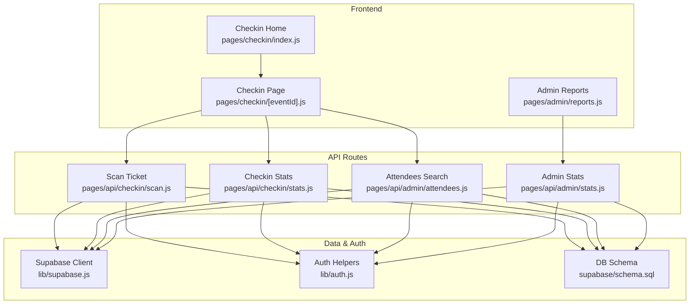
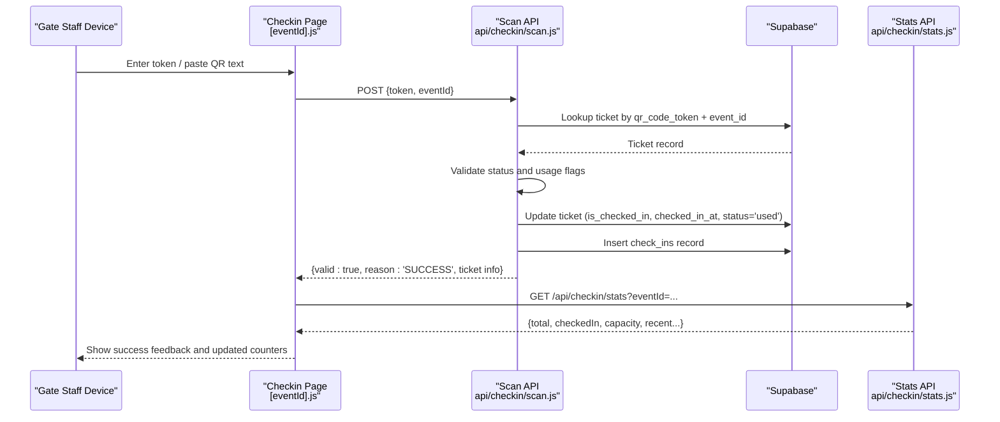
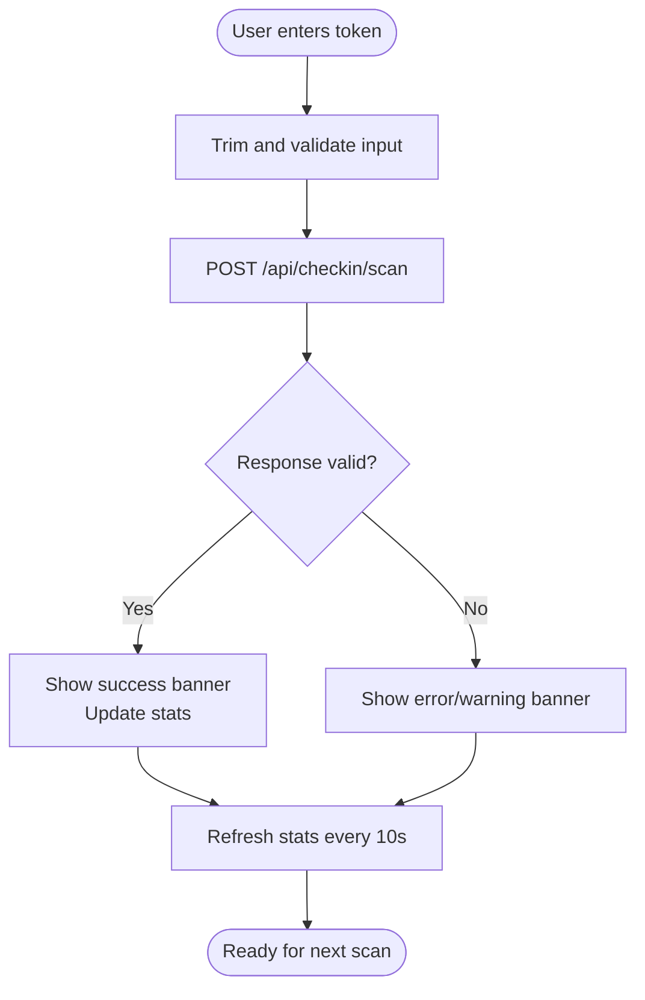
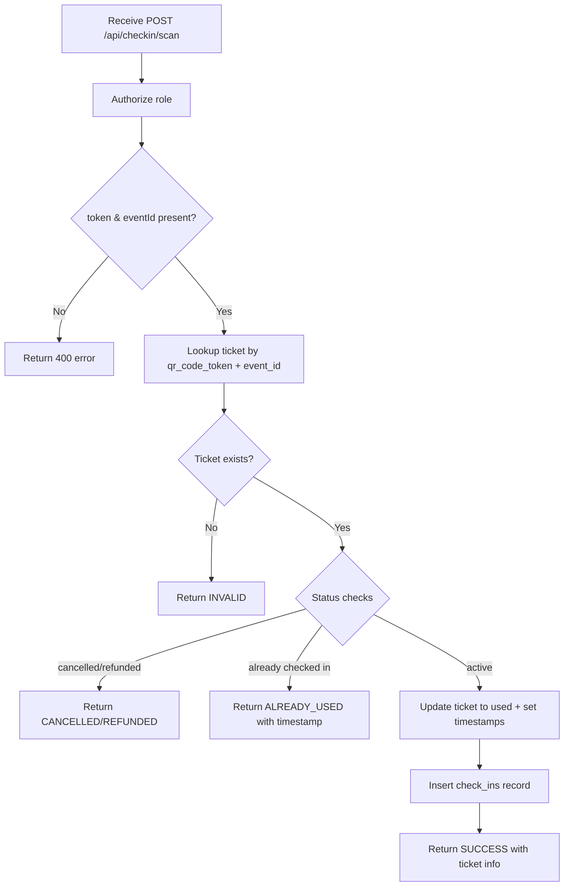
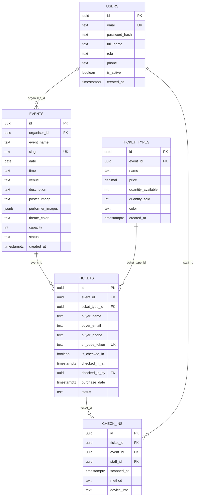
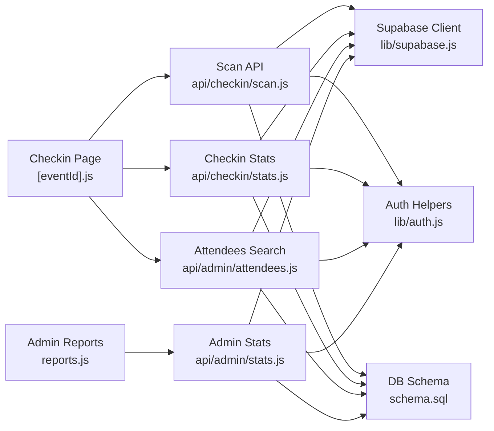

# Gate Check-in System

<cite>
**Referenced Files in This Document**
- [pages/checkin/index.js](file://pages/checkin/index.js)
- [pages/checkin/[eventId].js](file://pages/checkin/[eventId].js)
- [pages/api/checkin/scan.js](file://pages/api/checkin/scan.js)
- [pages/api/checkin/stats.js](file://pages/api/checkin/stats.js)
- [pages/api/admin/attendees.js](file://pages/api/admin/attendees.js)
- [pages/api/admin/stats.js](file://pages/api/admin/stats.js)
- [supabase/schema.sql](file://supabase/schema.sql)
- [lib/supabase.js](file://lib/supabase.js)
- [lib/auth.js](file://lib/auth.js)
- [pages/admin/reports.js](file://pages/admin/reports.js)
</cite>

## Table of Contents
1. [Introduction](#introduction)
2. [Project Structure](#project-structure)
3. [Core Components](#core-components)
4. [Architecture Overview](#architecture-overview)
5. [Detailed Component Analysis](#detailed-component-analysis)
6. [Dependency Analysis](#dependency-analysis)
7. [Performance Considerations](#performance-considerations)
8. [Troubleshooting Guide](#troubleshooting-guide)
9. [Conclusion](#conclusion)
10. [Appendices](#appendices)

## Introduction
This document explains the Gate Check-in System sub-feature, focusing on QR code scanning, real-time ticket validation, and attendance tracking for gate staff. It covers the check-in interface, device compatibility, performance optimizations, offline scenarios, data synchronization, statistics APIs, reporting capabilities, export functionality, and troubleshooting guidance. The system is implemented as a Next.js application with serverless API routes backed by Supabase.

## Project Structure
The Gate Check-in feature spans two primary pages and several API endpoints:
- Gate Staff entry point to select an event
- Event-specific check-in page with scan, manual search, and recent scans tabs
- API endpoints for scanning tickets, fetching stats, searching attendees, and admin reporting
- Database schema defining events, tickets, check-ins, and related entities
- Authentication and Supabase client utilities

**Diagram sources**
- [pages/checkin/index.js:1-65](file://pages/checkin/index.js#L1-L65)
- [pages/checkin/[eventId].js](file://pages/checkin/[eventId].js#L1-L888)
- [pages/api/checkin/scan.js:1-44](file://pages/api/checkin/scan.js#L1-L44)
- [pages/api/checkin/stats.js:1-31](file://pages/api/checkin/stats.js#L1-L31)
- [pages/api/admin/attendees.js:1-29](file://pages/api/admin/attendees.js#L1-L29)
- [pages/api/admin/stats.js:1-41](file://pages/api/admin/stats.js#L1-L41)
- [lib/supabase.js:1-23](file://lib/supabase.js#L1-L23)
- [lib/auth.js:1-47](file://lib/auth.js#L1-L47)
- [supabase/schema.sql:1-166](file://supabase/schema.sql#L1-L166)

**Section sources**
- [pages/checkin/index.js:1-65](file://pages/checkin/index.js#L1-L65)
- [pages/checkin/[eventId].js](file://pages/checkin/[eventId].js#L1-L888)
- [pages/api/checkin/scan.js:1-44](file://pages/api/checkin/scan.js#L1-L44)
- [pages/api/checkin/stats.js:1-31](file://pages/api/checkin/stats.js#L1-L31)
- [pages/api/admin/attendees.js:1-29](file://pages/api/admin/attendees.js#L1-L29)
- [pages/api/admin/stats.js:1-41](file://pages/api/admin/stats.js#L1-L41)
- [lib/supabase.js:1-23](file://lib/supabase.js#L1-L23)
- [lib/auth.js:1-47](file://lib/auth.js#L1-L47)
- [supabase/schema.sql:1-166](file://supabase/schema.sql#L1-L166)

## Core Components
- Gate Staff Entry (Event Selection): Lists published events and navigates to the selected event’s check-in page.
- Check-in Interface: Provides three modes:
  - Scan: Accepts USB scanner input or manual token entry; displays real-time result feedback.
  - Manual Search: Searches attendees by name, email, phone, or token and allows one-click check-in.
  - Recent: Shows last 20 check-ins with timestamps and attendee details.
- Scanning API: Validates tokens, enforces business rules, updates ticket status, records check-ins, and returns structured results.
- Stats API: Aggregates total tickets, checked-in count, capacity, and recent check-ins for live dashboards.
- Admin Reporting: Aggregates revenue, sold tickets, and per-event breakdowns; supports CSV export.

Key responsibilities:
- Real-time polling every 10 seconds for updated stats and recent scans.
- Role-based access control for all API endpoints.
- Atomic update of ticket state and creation of audit entries for each check-in.

**Section sources**
- [pages/checkin/index.js:1-65](file://pages/checkin/index.js#L1-L65)
- [pages/checkin/[eventId].js](file://pages/checkin/[eventId].js#L1-L888)
- [pages/api/checkin/scan.js:1-44](file://pages/api/checkin/scan.js#L1-L44)
- [pages/api/checkin/stats.js:1-31](file://pages/api/checkin/stats.js#L1-L31)
- [pages/api/admin/attendees.js:1-29](file://pages/api/admin/attendees.js#L1-L29)
- [pages/api/admin/stats.js:1-41](file://pages/api/admin/stats.js#L1-L41)

## Architecture Overview
The check-in flow combines frontend interactions with server-side validation and database persistence.

**Diagram sources**
- [pages/checkin/[eventId].js](file://pages/checkin/[eventId].js#L38-L52)
- [pages/api/checkin/scan.js:1-44](file://pages/api/checkin/scan.js#L1-L44)
- [pages/api/checkin/stats.js:1-31](file://pages/api/checkin/stats.js#L1-L31)
- [supabase/schema.sql:59-86](file://supabase/schema.sql#L59-L86)

## Detailed Component Analysis

### Check-in Interface (Event Page)
- Tabs:
  - Scan: Input field optimized for USB barcode scanners; Enter triggers verification.
  - Manual: Search form calling admin attendees endpoint; quick action to check-in from results.
  - Recent: Timeline of last 20 check-ins with time/date stamps.
- Real-time updates: Polls stats endpoint every 10 seconds; auto-refreshes counters and recent list.
- Result feedback: Color-coded banners for SUCCESS, ALREADY_USED, INVALID, CANCELLED, ERROR with message and ticket summary.
- Battery-friendly mode: Reduces visual effects and brightness to conserve power on devices.

**Diagram sources**
- [pages/checkin/[eventId].js](file://pages/checkin/[eventId].js#L38-L52)
- [pages/api/checkin/scan.js:1-44](file://pages/api/checkin/scan.js#L1-L44)

**Section sources**
- [pages/checkin/[eventId].js](file://pages/checkin/[eventId].js#L1-L888)

### Scanning API (Ticket Validation and Check-in)
- Authorization: Requires super_admin, organiser, or gate_staff roles.
- Validation steps:
  - Ensure token and eventId are present.
  - Fetch ticket matching qr_code_token and event_id.
  - Reject if not found, cancelled, refunded, or already checked in.
- On success:
  - Mark ticket as used and set checked_in_at and checked_in_by.
  - Record a check_ins row with method and optional device_info.
  - Return structured success payload including buyer_name and ticket_type.

**Diagram sources**
- [pages/api/checkin/scan.js:1-44](file://pages/api/checkin/scan.js#L1-L44)
- [supabase/schema.sql:59-86](file://supabase/schema.sql#L59-L86)

**Section sources**
- [pages/api/checkin/scan.js:1-44](file://pages/api/checkin/scan.js#L1-L44)

### Check-in Stats API
- Returns:
  - total: active tickets count
  - checkedIn: number of checked-in tickets
  - capacity: event capacity
  - eventName: human-readable name
  - recent: last 20 check-ins with ticket details
- Used by the check-in page to refresh counters and timeline every 10 seconds.

**Section sources**
- [pages/api/checkin/stats.js:1-31](file://pages/api/checkin/stats.js#L1-L31)

### Attendees Search API
- Supports filtering by eventId and optional search string across name, email, phone, and token.
- Returns full ticket details joined with ticket_types for quick identification and manual check-in actions.

**Section sources**
- [pages/api/admin/attendees.js:1-29](file://pages/api/admin/attendees.js#L1-L29)

### Admin Stats API
- Aggregates:
  - totalRevenue from completed payments
  - totalTicketsSold excluding cancelled/refunded
  - totalEvents count
  - Per-event breakdown: sold and checkedIn counts
- Used by the Admin Reports page for analytics and CSV export.

**Section sources**
- [pages/api/admin/stats.js:1-41](file://pages/api/admin/stats.js#L1-L41)

### Database Schema
Key tables and relationships:
- users: Roles include super_admin, organiser, gate_staff.
- events: Includes capacity and status.
- tickets: Unique qr_code_token, is_checked_in flag, checked_in_at, checked_in_by, status.
- check_ins: Audit log linking ticket, event, staff, scanned_at, method, device_info.
- Indexes optimize lookups by token, email, event_id, and event_id on check_ins.

**Diagram sources**
- [supabase/schema.sql:10-86](file://supabase/schema.sql#L10-L86)

**Section sources**
- [supabase/schema.sql:1-166](file://supabase/schema.sql#L1-L166)

### Admin Reports and Export
- Displays aggregated metrics and per-event breakdowns.
- Exports CSV containing event name, status, date, tickets sold, and checked-in counts.
- Uses admin stats API to populate data.

**Section sources**
- [pages/admin/reports.js:1-610](file://pages/admin/reports.js#L1-L610)
- [pages/api/admin/stats.js:1-41](file://pages/api/admin/stats.js#L1-L41)

## Dependency Analysis
- Frontend components depend on API routes for all data operations.
- API routes depend on Supabase service client for privileged database access.
- Authentication middleware enforces role-based access across endpoints.
- Database indexes ensure efficient queries for token lookup and event-scoped aggregations.

**Diagram sources**
- [pages/checkin/[eventId].js](file://pages/checkin/[eventId].js#L1-L888)
- [pages/api/checkin/scan.js:1-44](file://pages/api/checkin/scan.js#L1-L44)
- [pages/api/checkin/stats.js:1-31](file://pages/api/checkin/stats.js#L1-L31)
- [pages/api/admin/attendees.js:1-29](file://pages/api/admin/attendees.js#L1-L29)
- [pages/api/admin/stats.js:1-41](file://pages/api/admin/stats.js#L1-L41)
- [lib/supabase.js:1-23](file://lib/supabase.js#L1-L23)
- [lib/auth.js:1-47](file://lib/auth.js#L1-L47)
- [supabase/schema.sql:1-166](file://supabase/schema.sql#L1-L166)

**Section sources**
- [pages/checkin/[eventId].js](file://pages/checkin/[eventId].js#L1-L888)
- [pages/api/checkin/scan.js:1-44](file://pages/api/checkin/scan.js#L1-L44)
- [pages/api/checkin/stats.js:1-31](file://pages/api/checkin/stats.js#L1-L31)
- [pages/api/admin/attendees.js:1-29](file://pages/api/admin/attendees.js#L1-L29)
- [pages/api/admin/stats.js:1-41](file://pages/api/admin/stats.js#L1-L41)
- [lib/supabase.js:1-23](file://lib/supabase.js#L1-L23)
- [lib/auth.js:1-47](file://lib/auth.js#L1-L47)
- [supabase/schema.sql:1-166](file://supabase/schema.sql#L1-L166)

## Performance Considerations
- Real-time polling interval: 10 seconds balances freshness with network load.
- Debouncing user input: For USB scanners, immediate processing is acceptable; for manual typing, consider debouncing to avoid redundant requests.
- Query optimization:
  - Use exact head counts for totals to avoid loading full datasets.
  - Limit recent check-ins to 20 rows.
  - Leverage existing indexes on qr_code_token, event_id, and check_ins.event_id.
- UI performance:
  - Battery-friendly mode reduces animations and brightness.
  - Avoid heavy re-renders by updating only necessary state fields.
- Network resilience:
  - Handle network errors gracefully and show clear messages.
  - Consider retry logic with exponential backoff for failed requests.

[No sources needed since this section provides general guidance]

## Troubleshooting Guide
Common issues and resolutions:
- QR code not recognized:
  - Ensure token is trimmed and matches exactly.
  - Verify the ticket belongs to the selected event.
  - Confirm the ticket is active and not cancelled/refunded.
- Already checked in:
  - Display the previous check-in timestamp to prevent duplicate entries.
- Network errors:
  - Show a friendly error message and allow retry.
  - Check Supabase environment variables and service role key configuration.
- Slow stats updates:
  - Increase polling frequency cautiously; monitor backend load.
  - Add caching at CDN or edge layer if supported.
- Offline scenarios:
  - Current implementation requires online connectivity for validation.
  - Recommended enhancement: queue local check-ins when offline and sync when connectivity resumes.

**Section sources**
- [pages/api/checkin/scan.js:1-44](file://pages/api/checkin/scan.js#L1-L44)
- [lib/supabase.js:1-23](file://lib/supabase.js#L1-L23)
- [pages/checkin/[eventId].js](file://pages/checkin/[eventId].js#L38-L52)

## Conclusion
The Gate Check-in System provides a robust, role-secured workflow for validating tickets and tracking attendance in real time. It integrates seamlessly with Supabase for data persistence and offers clear interfaces for gate staff, including USB scanner support and manual search. The stats and reporting features enable operational visibility and exportable insights. Future enhancements can include offline-first capabilities, advanced caching, and richer analytics.

[No sources needed since this section summarizes without analyzing specific files]

## Appendices

### Example QR Code Validation Scenarios
- Valid ticket:
  - Input: token for an active ticket belonging to the event.
  - Outcome: SUCCESS with buyer_name and ticket_type; counters increment; recent list updates.
- Already used:
  - Input: same token again.
  - Outcome: ALREADY_USED with timestamp of first check-in.
- Cancelled or refunded:
  - Input: token for a cancelled/refunded ticket.
  - Outcome: CANCELLED or REFUNDED with explanatory message.
- Invalid token or wrong event:
  - Input: token not found or mismatched event_id.
  - Outcome: INVALID with appropriate message.

**Section sources**
- [pages/api/checkin/scan.js:1-44](file://pages/api/checkin/scan.js#L1-L44)

### Relationship Between Check-ins, Attendance Reporting, and Real-time Updates
- Each successful scan creates a check_ins record and updates ticket status to used.
- Check-in stats aggregate these changes into total checked-in counts and recent timelines.
- Admin reports compute per-event sold vs. checked-in metrics using tickets and payments data.

**Section sources**
- [supabase/schema.sql:59-86](file://supabase/schema.sql#L59-L86)
- [pages/api/checkin/stats.js:1-31](file://pages/api/checkin/stats.js#L1-L31)
- [pages/api/admin/stats.js:1-41](file://pages/api/admin/stats.js#L1-L41)

### Check-in Statistics API Definition
- Endpoint: GET /api/checkin/stats
- Query parameters:
  - eventId: required
- Response fields:
  - total: number of active tickets
  - checkedIn: number of checked-in tickets
  - capacity: event capacity
  - eventName: event name
  - recent: array of last 20 check-ins with ticket details

**Section sources**
- [pages/api/checkin/stats.js:1-31](file://pages/api/checkin/stats.js#L1-L31)

### Reporting Capabilities and Export Functionality
- Admin Reports page aggregates revenue, tickets sold, and per-event breakdowns.
- CSV export includes event name, status, date, tickets sold, and checked-in counts.

**Section sources**
- [pages/admin/reports.js:1-610](file://pages/admin/reports.js#L1-L610)
- [pages/api/admin/stats.js:1-41](file://pages/api/admin/stats.js#L1-L41)