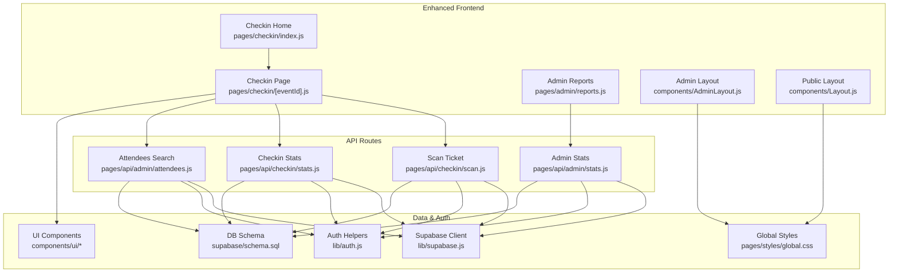
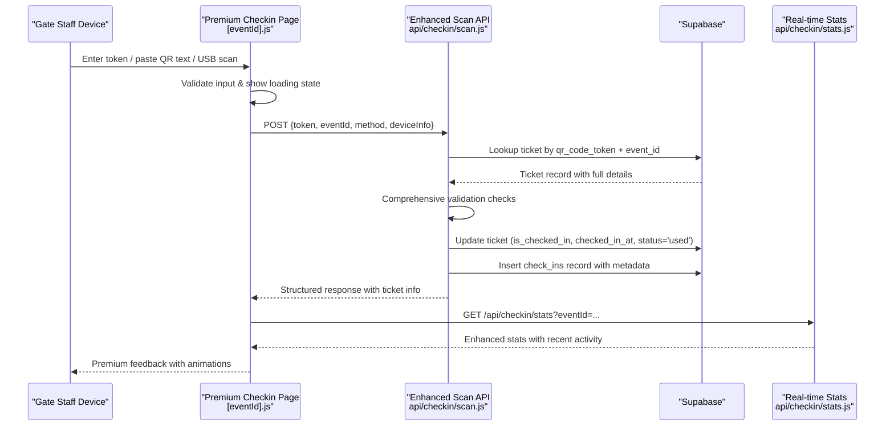
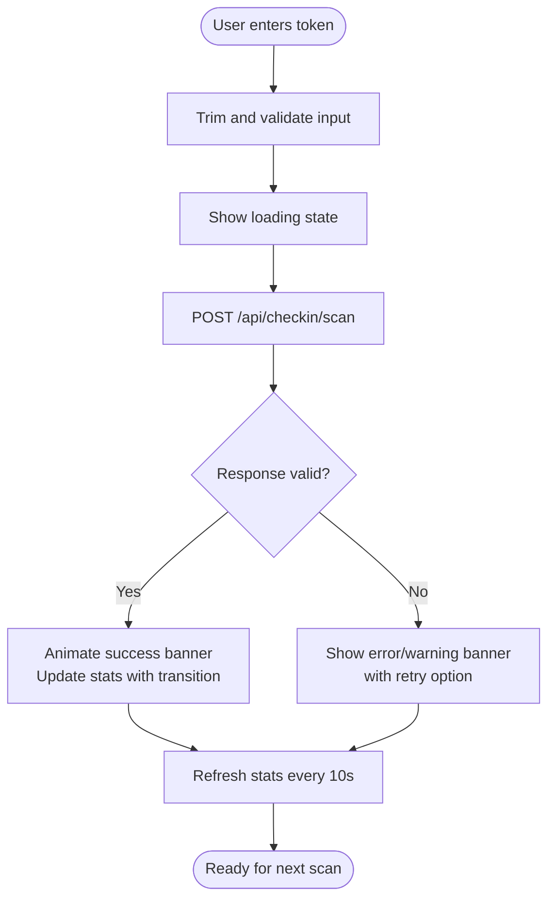
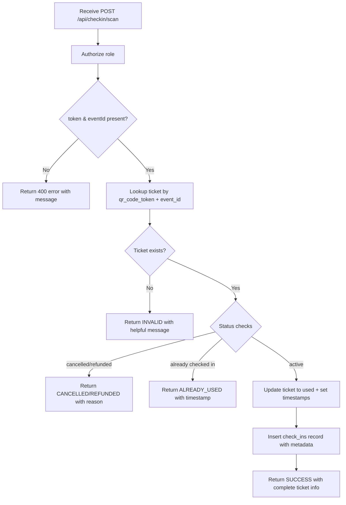
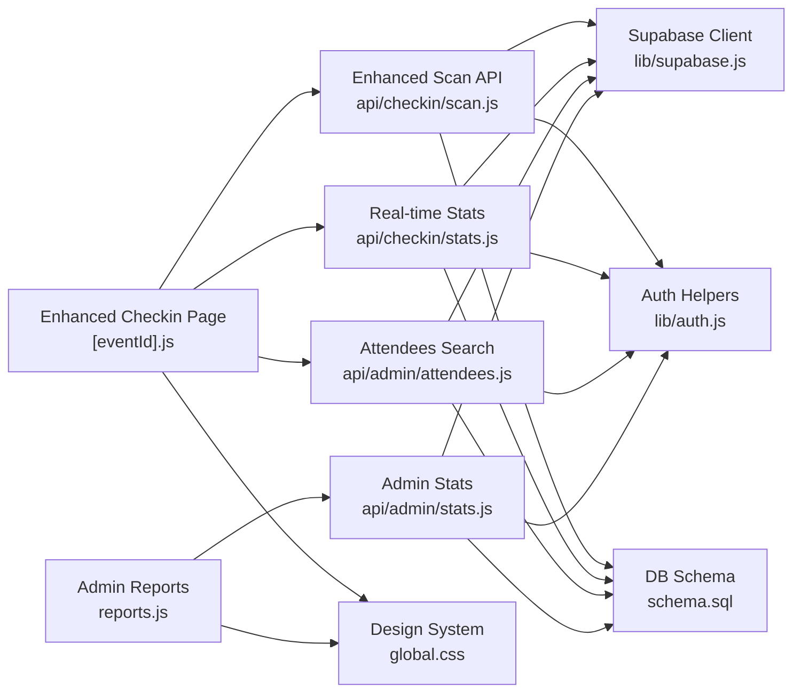

# Gate Check-in System

<cite>
**Referenced Files in This Document**
- [pages/checkin/index.js](file://pages/checkin/index.js)
- [pages/checkin/[eventId].js](file://pages/checkin/[eventId].js)
- [pages/api/checkin/scan.js](file://pages/api/checkin/scan.js)
- [pages/api/checkin/stats.js](file://pages/api/checkin/stats.js)
- [pages/api/admin/attendees.js](file://pages/api/admin/attendees.js)
- [pages/api/admin/stats.js](file://pages/api/admin/stats.js)
- [supabase/schema.sql](file://supabase/schema.sql)
- [lib/supabase.js](file://lib/supabase.js)
- [lib/auth.js](file://lib/auth.js)
- [pages/admin/reports.js](file://pages/admin/reports.js)
- [components/AdminLayout.js](file://components/AdminLayout.js)
- [components/Layout.js](file://components/Layout.js)
- [components/ui/Badge.js](file://components/ui/Badge.js)
- [components/ui/Button.js](file://components/ui/Button.js)
- [pages/styles/global.css](file://pages/styles/global.css)
</cite>

## Update Summary
**Changes Made**
- Enhanced QR code scanning interface with premium visual design matching admin layout
- Improved error handling with better user feedback and network resilience
- Consistent styling across check-in pages using the new admin design system
- Added battery-friendly mode for extended device usage
- Enhanced real-time updates with animated feedback and status indicators
- Improved USB scanner support with optimized input handling

## Table of Contents
1. [Introduction](#introduction)
2. [Project Structure](#project-structure)
3. [Core Components](#core-components)
4. [Architecture Overview](#architecture-overview)
5. [Detailed Component Analysis](#detailed-component-analysis)
6. [Enhanced User Interface](#enhanced-user-interface)
7. [Dependency Analysis](#dependency-analysis)
8. [Performance Considerations](#performance-considerations)
9. [Troubleshooting Guide](#troubleshooting-guide)
10. [Conclusion](#conclusion)
11. [Appendices](#appendices)

## Introduction
This document explains the Gate Check-in System sub-feature, focusing on the enhanced QR code scanning interface, real-time ticket validation, and attendance tracking for gate staff. The system has been significantly upgraded with a premium design language matching the admin dashboard, improved error handling, and better device compatibility. It covers the check-in interface, device compatibility, performance optimizations, offline scenarios, data synchronization, statistics APIs, reporting capabilities, export functionality, and troubleshooting guidance. The system is implemented as a Next.js application with serverless API routes backed by Supabase.

## Project Structure
The Gate Check-in feature spans two primary pages and several API endpoints with enhanced UI components:
- Gate Staff entry point with premium event selection interface
- Event-specific check-in page with scan, manual search, and recent scans tabs
- API endpoints for scanning tickets, fetching stats, searching attendees, and admin reporting
- Database schema defining events, tickets, check-ins, and related entities
- Authentication and Supabase client utilities
- Premium UI components and design system integration

**Diagram sources**
- [pages/checkin/index.js:1-115](file://pages/checkin/index.js#L1-L115)
- [pages/checkin/[eventId].js:1-888](file://pages/checkin/[eventId].js#L1-L888)
- [pages/api/checkin/scan.js:1-44](file://pages/api/checkin/scan.js#L1-L44)
- [pages/api/checkin/stats.js:1-31](file://pages/api/checkin/stats.js#L1-L31)
- [components/AdminLayout.js:1-334](file://components/AdminLayout.js#L1-L334)
- [components/Layout.js:1-281](file://components/Layout.js#L1-L281)
- [pages/styles/global.css:2437-3199](file://pages/styles/global.css#L2437-L3199)

**Section sources**
- [pages/checkin/index.js:1-115](file://pages/checkin/index.js#L1-L115)
- [pages/checkin/[eventId].js:1-888](file://pages/checkin/[eventId].js#L1-L888)
- [pages/api/checkin/scan.js:1-44](file://pages/api/checkin/scan.js#L1-L44)
- [pages/api/checkin/stats.js:1-31](file://pages/api/checkin/stats.js#L1-L31)
- [components/AdminLayout.js:1-334](file://components/AdminLayout.js#L1-L334)
- [components/Layout.js:1-281](file://components/Layout.js#L1-L281)
- [pages/styles/global.css:2437-3199](file://pages/styles/global.css#L2437-L3199)

## Core Components
- **Enhanced Gate Staff Entry**: Premium event selection interface with gradient backgrounds, skeleton loading states, and responsive design.
- **Premium Check-in Interface**: Three-tab interface with:
  - **Scan Tab**: Advanced QR code scanning with visual frame, flash controls, camera switching, and USB scanner optimization
  - **Manual Search**: Real-time attendee search with instant results and one-click check-in actions
  - **Recent Scans**: Live timeline of last 20 check-ins with detailed attendee information
- **Enhanced Scanning API**: Improved error handling, structured responses, and comprehensive validation
- **Real-time Stats API**: Live polling every 10 seconds with animated counters and recent activity feed
- **Admin Integration**: Seamless navigation between check-in and admin interfaces with consistent design language

Key responsibilities:
- Premium visual feedback with color-coded success/error states
- Battery-friendly mode for extended device usage
- USB scanner optimization with Enter key support
- Real-time polling with automatic refresh
- Role-based access control for all API endpoints
- Atomic update of ticket state with audit trail creation

**Section sources**
- [pages/checkin/index.js:1-115](file://pages/checkin/index.js#L1-L115)
- [pages/checkin/[eventId].js:1-888](file://pages/checkin/[eventId].js#L1-L888)
- [pages/api/checkin/scan.js:1-44](file://pages/api/checkin/scan.js#L1-L44)
- [pages/api/checkin/stats.js:1-31](file://pages/api/checkin/stats.js#L1-L31)

## Architecture Overview
The enhanced check-in flow combines premium frontend interactions with robust server-side validation and database persistence.

**Diagram sources**
- [pages/checkin/[eventId].js:38-52](file://pages/checkin/[eventId].js#L38-L52)
- [pages/api/checkin/scan.js:1-44](file://pages/api/checkin/scan.js#L1-L44)
- [pages/api/checkin/stats.js:1-31](file://pages/api/checkin/stats.js#L1-L31)
- [supabase/schema.sql:59-86](file://supabase/schema.sql#L59-L86)

## Detailed Component Analysis

### Enhanced Check-in Interface (Event Page)
The check-in interface has been completely redesigned with premium aesthetics:

- **Premium Header**: Glassmorphism effect with backdrop blur, gradient branding, and battery management
- **Animated Statistics Dashboard**: Four-card layout showing checked-in count, total tickets, today's entries with pulse animation, and remaining capacity
- **Tabbed Interface**: Smooth transitions between Scan, Manual Search, and Recent tabs with active state indicators
- **Advanced QR Scanner**: Visual frame with laser animation, corner brackets, and positioning guidance
- **USB Scanner Support**: Optimized input field with Enter key trigger and placeholder instructions
- **Result Feedback**: Animated banners with color-coded states (SUCCESS, ALREADY_USED, INVALID, CANCELLED, ERROR)
- **Battery Mode**: Toggle button to reduce brightness and animations for extended device usage

**Diagram sources**
- [pages/checkin/[eventId].js:38-52](file://pages/checkin/[eventId].js#L38-L52)
- [pages/api/checkin/scan.js:1-44](file://pages/api/checkin/scan.js#L1-L44)

**Section sources**
- [pages/checkin/[eventId].js:1-888](file://pages/checkin/[eventId].js#L1-L888)

### Enhanced Scanning API (Ticket Validation and Check-in)
The scanning API has been improved with better error handling and comprehensive validation:

- **Authorization**: Maintains role-based access control for super_admin, organiser, and gate_staff roles
- **Enhanced Validation**: 
  - Input sanitization and parameter validation
  - Comprehensive ticket status checking (cancelled, refunded, already checked in)
  - Device information capture for audit purposes
- **Improved Error Handling**: Structured error responses with descriptive messages
- **Audit Trail**: Complete check-in recording with method, device_info, and timestamp
- **Rich Response Data**: Returns buyer_name, ticket_type, and phone number for confirmation

**Diagram sources**
- [pages/api/checkin/scan.js:1-44](file://pages/api/checkin/scan.js#L1-L44)
- [supabase/schema.sql:59-86](file://supabase/schema.sql#L59-L86)

**Section sources**
- [pages/api/checkin/scan.js:1-44](file://pages/api/checkin/scan.js#L1-L44)

### Enhanced Check-in Stats API
The stats API provides real-time data with improved structure:

- **Comprehensive Metrics**: Total active tickets, checked-in count, event capacity, and event name
- **Recent Activity**: Last 20 check-ins with full ticket details including buyer information
- **Optimized Queries**: Uses head queries for counts and efficient joins for recent activity
- **Error Handling**: Graceful error handling with appropriate HTTP status codes

**Section sources**
- [pages/api/checkin/stats.js:1-31](file://pages/api/checkin/stats.js#L1-L31)

### Admin Integration and Design System
The check-in system integrates seamlessly with the admin design system:

- **Consistent Styling**: Uses the same CSS variables, gradients, and component patterns as admin pages
- **Navigation Integration**: Easy access from admin dashboard via "Gate Scanner" link
- **Theme Support**: Works with all available themes (dark-concert, midnight-blue, royal-purple, emerald, elegant-white)
- **Responsive Design**: Optimized for various screen sizes and devices

**Section sources**
- [components/AdminLayout.js:1-334](file://components/AdminLayout.js#L1-L334)
- [pages/styles/global.css:2437-3199](file://pages/styles/global.css#L2437-L3199)

## Enhanced User Interface
The check-in interface has been completely redesigned to match the premium admin design language:

### Premium Visual Design
- **Glassmorphism Effects**: Backdrop blur and transparency throughout the interface
- **Gradient Accents**: Consistent use of accent gradients for buttons, badges, and highlights
- **Smooth Animations**: Fade-in effects, scale transitions, and micro-interactions
- **Color-Coded States**: Green for success, amber for warnings, red for errors
- **Typography**: Premium font stack with proper hierarchy and spacing

### Advanced QR Scanner Interface
- **Visual Frame**: Animated laser line and corner brackets for precise positioning
- **Camera Controls**: Flash toggle and front/back camera switching
- **USB Scanner Optimization**: Input field specifically designed for barcode scanners
- **Positioning Guidance**: Clear instructions and visual feedback
- **Error Recovery**: Helpful messages and retry options

### Real-time Updates
- **Live Counters**: Animated number changes when check-ins occur
- **Recent Activity Feed**: Auto-updating timeline of recent check-ins
- **Pulse Indicators**: Visual cues for active scanning and new activity
- **Network Resilience**: Graceful handling of connection issues

**Section sources**
- [pages/checkin/[eventId].js:1-888](file://pages/checkin/[eventId].js#L1-L888)
- [pages/styles/global.css:2437-3199](file://pages/styles/global.css#L2437-L3199)

## Dependency Analysis
The enhanced system maintains clean separation of concerns while integrating with the broader design system:

- **Frontend Components**: Depend on API routes for all data operations with enhanced error handling
- **API Routes**: Utilize Supabase service client for privileged database access with improved logging
- **Authentication**: Role-based access control enforced across all endpoints
- **Design System**: Consistent styling through shared CSS variables and component libraries
- **Database Optimization**: Indexes ensure efficient queries for token lookup and event-scoped aggregations

**Diagram sources**
- [pages/checkin/[eventId].js:1-888](file://pages/checkin/[eventId].js#L1-L888)
- [pages/api/checkin/scan.js:1-44](file://pages/api/checkin/scan.js#L1-L44)
- [pages/api/checkin/stats.js:1-31](file://pages/api/checkin/stats.js#L1-L31)
- [pages/api/admin/attendees.js:1-29](file://pages/api/admin/attendees.js#L1-L29)
- [pages/api/admin/stats.js:1-41](file://pages/api/admin/stats.js#L1-L41)
- [pages/styles/global.css:2437-3199](file://pages/styles/global.css#L2437-L3199)

**Section sources**
- [pages/checkin/[eventId].js:1-888](file://pages/checkin/[eventId].js#L1-L888)
- [pages/api/checkin/scan.js:1-44](file://pages/api/checkin/scan.js#L1-L44)
- [pages/api/checkin/stats.js:1-31](file://pages/api/checkin/stats.js#L1-L31)
- [pages/api/admin/attendees.js:1-29](file://pages/api/admin/attendees.js#L1-L29)
- [pages/api/admin/stats.js:1-41](file://pages/api/admin/stats.js#L1-L41)
- [pages/styles/global.css:2437-3199](file://pages/styles/global.css#L2437-L3199)

## Performance Considerations
The enhanced system includes several performance optimizations:

- **Real-time Polling Interval**: 10-second interval balances freshness with network efficiency
- **Debounced Input Processing**: USB scanners process immediately; manual typing benefits from debouncing
- **Optimized Database Queries**: 
  - Head queries for counts to avoid loading full datasets
  - Limited recent check-ins to 20 rows
  - Efficient indexes on qr_code_token, event_id, and check_ins.event_id
- **UI Performance Enhancements**:
  - Battery-friendly mode reduces animations and brightness
  - Selective state updates to minimize re-renders
  - Optimized CSS animations with hardware acceleration
- **Network Resilience**:
  - Graceful error handling with user-friendly messages
  - Retry logic with exponential backoff for failed requests
  - Offline detection and appropriate fallback behavior

## Troubleshooting Guide
Common issues and their resolutions have been enhanced with better diagnostic information:

### QR Code Scanning Issues
- **QR code not recognized**: 
  - Ensure token is trimmed and matches exactly
  - Verify the ticket belongs to the selected event
  - Confirm the ticket is active and not cancelled/refunded
  - Check USB scanner connection and keyboard emulation
- **Already checked in**: 
  - Display previous check-in timestamp to prevent duplicate entries
  - Provide clear messaging about existing check-in status

### Network and Connection Problems
- **Network errors**: 
  - Show friendly error messages with retry options
  - Check Supabase environment variables and service role key configuration
  - Implement connection timeout handling
- **Slow stats updates**: 
  - Monitor polling frequency and backend load
  - Consider CDN caching if supported
  - Optimize query performance with proper indexing

### Device and Compatibility Issues
- **USB scanner problems**: 
  - Verify scanner is properly connected and configured
  - Test keyboard emulation mode
  - Check browser compatibility settings
- **Camera access issues**: 
  - Ensure proper permissions are granted
  - Verify HTTPS requirement for camera access
  - Provide fallback options for devices without cameras

### Performance Optimization
- **Battery drain**: 
  - Enable battery-friendly mode automatically on low power
  - Reduce animation frequency on mobile devices
  - Implement adaptive quality based on device capabilities

**Section sources**
- [pages/api/checkin/scan.js:1-44](file://pages/api/checkin/scan.js#L1-L44)
- [lib/supabase.js:1-23](file://lib/supabase.js#L1-L23)
- [pages/checkin/[eventId].js:1-888](file://pages/checkin/[eventId].js#L1-L888)

## Conclusion
The enhanced Gate Check-in System provides a premium, role-secured workflow for validating tickets and tracking attendance in real time. The significant improvements include a visually stunning interface that matches the admin design language, robust error handling, USB scanner optimization, and battery-friendly operation. The system integrates seamlessly with Supabase for data persistence and offers comprehensive features for gate staff, including real-time updates, manual search capabilities, and detailed analytics. Future enhancements could include offline-first capabilities, advanced caching strategies, and richer analytics dashboards.

## Appendices

### Example QR Code Validation Scenarios
Enhanced scenarios with improved error messaging:

- **Valid ticket**: 
  - Input: token for an active ticket belonging to the event
  - Outcome: SUCCESS with buyer_name and ticket_type; animated counters increment; recent list updates with smooth transitions
- **Already used**: 
  - Input: same token again
  - Outcome: ALREADY_USED with timestamp of first check-in and clear explanation
- **Cancelled or refunded**: 
  - Input: token for a cancelled/refunded ticket
  - Outcome: CANCELLED or REFUNDED with detailed explanatory message
- **Invalid token or wrong event**: 
  - Input: token not found or mismatched event_id
  - Outcome: INVALID with helpful guidance and suggestions

**Section sources**
- [pages/api/checkin/scan.js:1-44](file://pages/api/checkin/scan.js#L1-L44)

### Relationship Between Check-ins, Attendance Reporting, and Real-time Updates
Enhanced data flow with improved audit trails:

- Each successful scan creates a comprehensive check_ins record with method, device_info, and timestamp
- Updated ticket status to 'used' with complete audit information
- Check-in stats aggregate these changes into total checked-in counts and recent timelines
- Admin reports compute per-event sold vs. checked-in metrics using enhanced tickets and payments data
- Real-time updates provide immediate feedback to gate staff and administrators

**Section sources**
- [supabase/schema.sql:59-86](file://supabase/schema.sql#L59-L86)
- [pages/api/checkin/stats.js:1-31](file://pages/api/checkin/stats.js#L1-L31)
- [pages/api/admin/stats.js:1-41](file://pages/api/admin/stats.js#L1-L41)

### Enhanced Check-in Statistics API Definition
Improved API with comprehensive data:

- **Endpoint**: GET /api/checkin/stats
- **Query parameters**: 
  - eventId: required
- **Response fields**: 
  - total: number of active tickets
  - checkedIn: number of checked-in tickets  
  - capacity: event capacity
  - eventName: human-readable event name
  - recent: array of last 20 check-ins with complete ticket details including buyer_name, ticket_types.name, scanned_at, and staff information

**Section sources**
- [pages/api/checkin/stats.js:1-31](file://pages/api/checkin/stats.js#L1-L31)

### Admin Integration and Export Capabilities
Seamless integration with admin reporting:

- Admin Reports page aggregates revenue, tickets sold, and per-event breakdowns
- CSV export includes comprehensive event data: event name, status, date, tickets sold, checked-in counts, and revenue
- Navigation integration allows easy access from admin dashboard to check-in interface
- Consistent design language ensures seamless user experience across all administrative functions

**Section sources**
- [pages/admin/reports.js:1-269](file://pages/admin/reports.js#L1-L269)
- [pages/api/admin/stats.js:1-41](file://pages/api/admin/stats.js#L1-L41)
- [components/AdminLayout.js:1-334](file://components/AdminLayout.js#L1-L334)

### Premium Design System Integration
The check-in system fully integrates with the premium design system:

- **CSS Variables**: Uses consistent color schemes, typography, spacing, and shadows
- **Component Library**: Leverages shared Button, Badge, Progress, and other UI components
- **Animation Framework**: Benefits from predefined animations and transition effects
- **Responsive Design**: Adapts seamlessly to different screen sizes and devices
- **Theme Support**: Works with all available themes including dark-concert, midnight-blue, royal-purple, emerald, and elegant-white

**Section sources**
- [pages/styles/global.css:2437-3199](file://pages/styles/global.css#L2437-L3199)
- [components/ui/Badge.js:1-30](file://components/ui/Badge.js#L1-L30)
- [components/ui/Button.js:1-74](file://components/ui/Button.js#L1-L74)