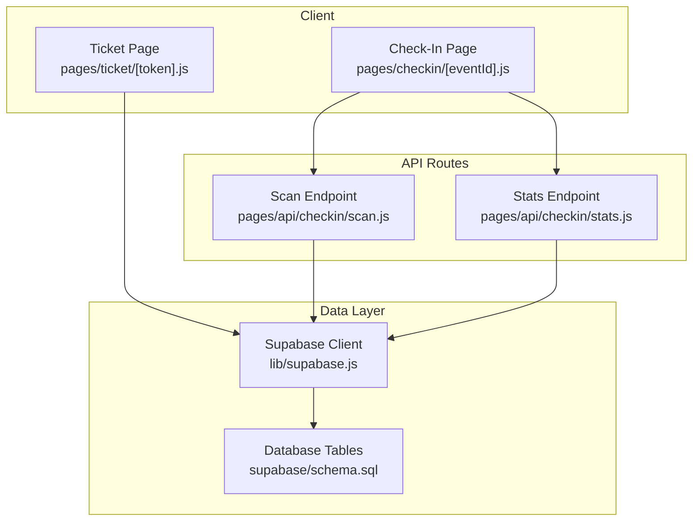
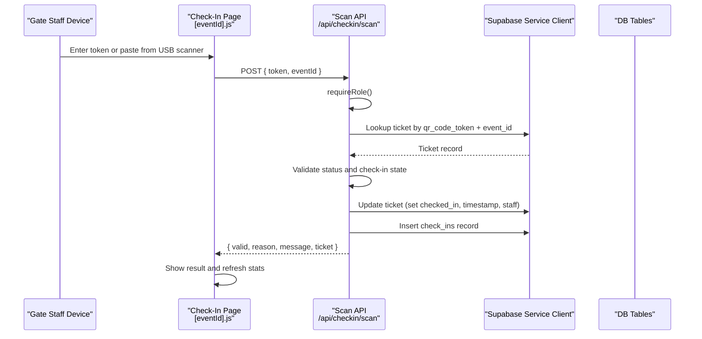
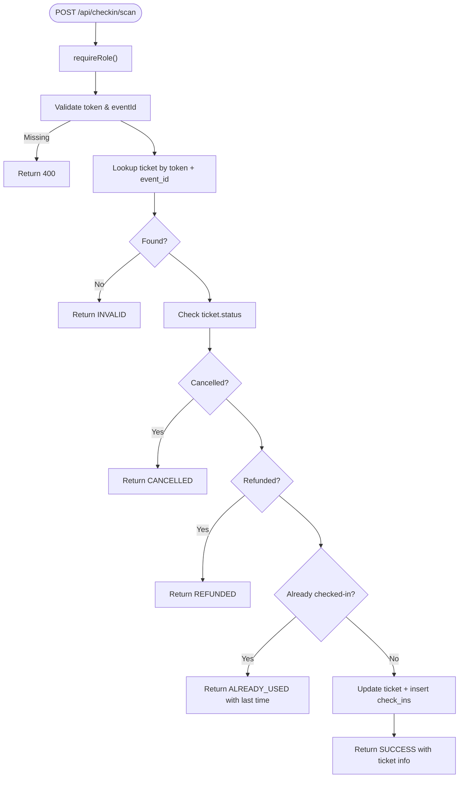
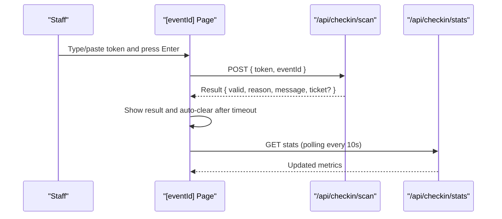
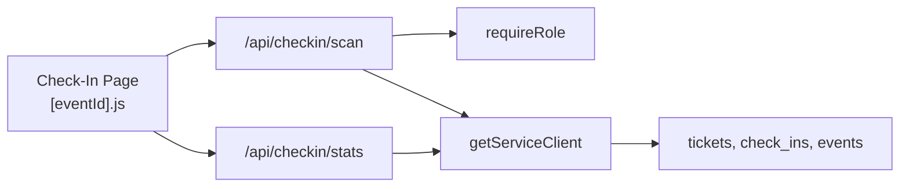

# QR Code Scanning Implementation

<cite>
**Referenced Files in This Document**
- [scan.js](file://pages/api/checkin/scan.js)
- [stats.js](file://pages/api/checkin/stats.js)
- [checkin-event-page.js](file://pages/checkin/[eventId].js)
- [checkin-index.js](file://pages/checkin/index.js)
- [ticket-token-page.js](file://pages/ticket/[token].js)
- [auth.js](file://lib/auth.js)
- [supabase.js](file://lib/supabase.js)
- [schema.sql](file://supabase/schema.sql)
</cite>

## Table of Contents
1. [Introduction](#introduction)
2. [Project Structure](#project-structure)
3. [Core Components](#core-components)
4. [Architecture Overview](#architecture-overview)
5. [Detailed Component Analysis](#detailed-component-analysis)
6. [Dependency Analysis](#dependency-analysis)
7. [Performance Considerations](#performance-considerations)
8. [Troubleshooting Guide](#troubleshooting-guide)
9. [Conclusion](#conclusion)

## Introduction
This document explains the QR code scanning implementation for gate staff check-in. It covers the end-to-end workflow from ticket display to validation, the server-side API that processes scans, and the client interface used by staff on mobile or desktop devices. It also documents error handling for invalid tickets, performance optimizations for real-time scanning, network connectivity considerations, and device compatibility guidance.

## Project Structure
The scanning feature spans a Next.js frontend page for gate staff, a backend API route for validation, and Supabase-backed data operations:
- Gate staff UI: pages/checkin/[eventId].js
- Check-in home: pages/checkin/index.js
- Ticket display (QR generation): pages/ticket/[token].js
- Scan API: pages/api/checkin/scan.js
- Stats API: pages/api/checkin/stats.js
- Authentication helper: lib/auth.js
- Supabase clients: lib/supabase.js
- Database schema: supabase/schema.sql

**Diagram sources**
- [checkin-event-page.js:1-120](file://pages/checkin/[eventId].js#L1-L120)
- [ticket-token-page.js:1-60](file://pages/ticket/[token].js#L1-L60)
- [scan.js:1-44](file://pages/api/checkin/scan.js#L1-L44)
- [stats.js:1-31](file://pages/api/checkin/stats.js#L1-L31)
- [supabase.js:1-23](file://lib/supabase.js#L1-L23)
- [schema.sql:59-86](file://supabase/schema.sql#L59-L86)

**Section sources**
- [checkin-event-page.js:1-120](file://pages/checkin/[eventId].js#L1-L120)
- [checkin-index.js:1-65](file://pages/checkin/index.js#L1-L65)
- [ticket-token-page.js:1-60](file://pages/ticket/[token].js#L1-L60)
- [scan.js:1-44](file://pages/api/checkin/scan.js#L1-L44)
- [stats.js:1-31](file://pages/api/checkin/stats.js#L1-L31)
- [supabase.js:1-23](file://lib/supabase.js#L1-L23)
- [schema.sql:59-86](file://supabase/schema.sql#L59-L86)

## Core Components
- Gate staff check-in page: Provides tabs for scan, manual search, and recent scans; supports USB scanner input and manual token entry; displays real-time stats and result feedback.
- Scan API endpoint: Validates authentication, looks up the ticket by token and event, enforces business rules (status, already checked-in), updates ticket state, records a check-in, and returns a structured response.
- Stats API endpoint: Aggregates total tickets, checked-in count, capacity, and recent scans for the selected event.
- Ticket page: Renders the QR code for attendees using a unique token URL.
- Authentication: Role-based access control via session cookies enforced by requireRole.
- Data layer: Supabase service role client for server-side reads/writes with indexed queries.

**Section sources**
- [checkin-event-page.js:1-120](file://pages/checkin/[eventId].js#L1-L120)
- [scan.js:1-44](file://pages/api/checkin/scan.js#L1-L44)
- [stats.js:1-31](file://pages/api/checkin/stats.js#L1-L31)
- [ticket-token-page.js:1-60](file://pages/ticket/[token].js#L1-L60)
- [auth.js:30-47](file://lib/auth.js#L30-L47)
- [supabase.js:15-23](file://lib/supabase.js#L15-L23)
- [schema.sql:149-153](file://supabase/schema.sql#L149-L153)

## Architecture Overview
The scanning flow is a simple client-server interaction with strong server-side validation and audit logging:

**Diagram sources**
- [checkin-event-page.js:30-52](file://pages/checkin/[eventId].js#L30-L52)
- [scan.js:1-44](file://pages/api/checkin/scan.js#L1-L44)
- [supabase.js:15-23](file://lib/supabase.js#L15-L23)
- [schema.sql:59-86](file://supabase/schema.sql#L59-L86)

## Detailed Component Analysis

### Scan API Endpoint (/api/checkin/scan)
Responsibilities:
- Enforce method and authentication (roles: super_admin, organiser, gate_staff).
- Validate required fields (token, eventId).
- Query tickets by qr_code_token and event_id.
- Apply business rules:
  - Not found or wrong event → INVALID
  - Cancelled → CANCELLED
  - Refunded → REFUNDED
  - Already checked-in → ALREADY_USED with last check-in time
- On success:
  - Mark ticket as checked-in, set timestamp and staff id, update status to used.
  - Record a check-in row with method and optional device info.
  - Return success payload with buyer details.

Error handling:
- Returns HTTP 405 for non-POST requests.
- Returns 400 when required fields are missing.
- Catches exceptions and returns appropriate status codes with messages.

Request/response format:
- Request body: token (string), eventId (string), method (optional string, default 'qr_scan'), deviceInfo (optional string).
- Success response: valid true, reason SUCCESS, message, ticket object with buyer_name, ticket_type, buyer_phone.
- Failure responses: valid false, reason INVALID/CANCELLED/REFUNDED/ALREADY_USED, message, and sometimes ticket context.

**Diagram sources**
- [scan.js:1-44](file://pages/api/checkin/scan.js#L1-L44)

**Section sources**
- [scan.js:1-44](file://pages/api/checkin/scan.js#L1-L44)
- [auth.js:38-47](file://lib/auth.js#L38-L47)
- [schema.sql:59-86](file://supabase/schema.sql#L59-L86)

### Stats API Endpoint (/api/checkin/stats)
Responsibilities:
- Enforce authentication and role requirements.
- Aggregate counts for active tickets and checked-in tickets for an event.
- Fetch recent check-ins with related ticket and type names.
- Retrieve event metadata (capacity, name).

Response includes:
- total, checkedIn, capacity, eventName, recent array.

**Section sources**
- [stats.js:1-31](file://pages/api/checkin/stats.js#L1-L31)
- [schema.sql:59-86](file://supabase/schema.sql#L59-L86)

### Gate Staff Check-In Page ([eventId])
Key features:
- Tabs: Scan, Manual Search, Recent.
- Scan tab:
  - Input field optimized for USB scanners (keyboard-like input) and manual token entry.
  - Supports Enter key submission.
  - Displays animated result card with color-coded reasons.
  - Auto-clears result after timeout.
- Manual Search tab:
  - Searches attendees by name/email/phone and allows direct check-in from results.
- Recent tab:
  - Shows recent scans with timestamps and attendee details.
- Stats dashboard:
  - Polls every 10 seconds for live metrics.
- Battery-friendly mode:
  - Reduces brightness/contrast to conserve power on mobile devices.

Network error handling:
- Catches fetch errors and shows a user-friendly error message.

**Diagram sources**
- [checkin-event-page.js:30-52](file://pages/checkin/[eventId].js#L30-L52)
- [stats.js:1-31](file://pages/api/checkin/stats.js#L1-L31)

**Section sources**
- [checkin-event-page.js:1-120](file://pages/checkin/[eventId].js#L1-L120)

### Ticket Display and QR Generation ([token])
Responsibilities:
- Server-side props fetch ticket by token and associated event and ticket type.
- Renders a QR code pointing to the ticket URL.
- Visual indicators for used tickets.

Note: The QR value encodes a URL containing the token, enabling scanning workflows that resolve to this page or can be parsed by scanners to extract the token.

**Section sources**
- [ticket-token-page.js:1-60](file://pages/ticket/[token].js#L1-L60)
- [ticket-token-page.js:100-126](file://pages/ticket/[token].js#L100-L126)

### Authentication and Authorization
- Session tokens stored in cookies are parsed and validated.
- requireRole ensures only authorized roles can call protected endpoints.
- Errors return 401 (not authenticated) or 403 (insufficient permissions).

**Section sources**
- [auth.js:30-47](file://lib/auth.js#L30-L47)

### Data Layer and Schema
- Supabase service role client used server-side for privileged operations.
- Indexed columns optimize lookups by token, email, event_id, and check-ins by event.
- Check-ins table records method and optional device_info for auditability.

**Section sources**
- [supabase.js:15-23](file://lib/supabase.js#L15-L23)
- [schema.sql:149-153](file://supabase/schema.sql#L149-L153)
- [schema.sql:78-86](file://supabase/schema.sql#L78-L86)

## Dependency Analysis
- Frontend depends on API routes for scanning and stats.
- API routes depend on Supabase service client and auth helpers.
- Database schema defines relationships and constraints ensuring integrity.

**Diagram sources**
- [checkin-event-page.js:1-120](file://pages/checkin/[eventId].js#L1-L120)
- [scan.js:1-44](file://pages/api/checkin/scan.js#L1-L44)
- [stats.js:1-31](file://pages/api/checkin/stats.js#L1-L31)
- [auth.js:38-47](file://lib/auth.js#L38-L47)
- [supabase.js:15-23](file://lib/supabase.js#L15-L23)
- [schema.sql:59-86](file://supabase/schema.sql#L59-L86)

**Section sources**
- [checkin-event-page.js:1-120](file://pages/checkin/[eventId].js#L1-L120)
- [scan.js:1-44](file://pages/api/checkin/scan.js#L1-L44)
- [stats.js:1-31](file://pages/api/checkin/stats.js#L1-L31)
- [auth.js:38-47](file://lib/auth.js#L38-L47)
- [supabase.js:15-23](file://lib/supabase.js#L15-L23)
- [schema.sql:59-86](file://supabase/schema.sql#L59-L86)

## Performance Considerations
- Real-time stats polling every 10 seconds balances freshness and load.
- Indexed queries on qr_code_token, event_id, and check_ins.event_id improve lookup speed.
- Single-row updates and inserts minimize transaction overhead.
- Battery-friendly mode reduces visual effects and brightness to extend battery life on mobile devices.
- Avoid heavy client-side processing; keep logic minimal on the device.

Recommendations:
- Consider debouncing rapid successive scans to prevent duplicate submissions.
- Use exponential backoff for retries on transient network failures.
- Cache static assets and fonts to reduce initial load time on mobile networks.

[No sources needed since this section provides general guidance]

## Troubleshooting Guide

Common issues and resolutions:
- Network connectivity issues:
  - Symptom: Error message indicating network failure during scan.
  - Resolution: Ensure stable internet connection; retry after reconnecting; consider offline fallback UI states.
- Invalid QR code or wrong event:
  - Symptom: INVALID reason returned.
  - Resolution: Verify the token belongs to the selected event; ensure correct event selection in the app.
- Already checked-in ticket:
  - Symptom: ALREADY_USED with last check-in time.
  - Resolution: Confirm if re-entry is allowed per policy; otherwise inform attendee.
- Cancelled or refunded tickets:
  - Symptom: CANCELLED or REFUNDED reason.
  - Resolution: Deny entry and advise contacting support.
- Authentication failures:
  - Symptom: 401 or 403 errors.
  - Resolution: Re-authenticate and ensure the user has one of the required roles (super_admin, organiser, gate_staff).
- Mobile device compatibility:
  - Symptom: Camera not accessible or poor scanning experience.
  - Resolution: Use USB scanner or manual token entry; enable battery-friendly mode; ensure browser permissions for camera if implementing camera scanning.

Operational tips:
- Use the Manual Search tab to locate attendees by name/email/phone when QR is unreadable.
- Monitor the Recent tab to verify successful scans and timestamps.
- Keep the device charged; use battery-friendly mode during long shifts.

**Section sources**
- [checkin-event-page.js:30-52](file://pages/checkin/[eventId].js#L30-L52)
- [scan.js:1-44](file://pages/api/checkin/scan.js#L1-L44)
- [stats.js:1-31](file://pages/api/checkin/stats.js#L1-L31)

## Conclusion
The QR code scanning implementation provides a robust, secure, and efficient check-in process for gate staff. It combines a responsive UI with strict server-side validation, clear error handling, and audit logging. With indexed database queries and thoughtful performance optimizations, it supports high-throughput scanning scenarios while remaining compatible across mobile and desktop devices. For enhanced reliability, consider adding retry mechanisms with backoff and offline-aware UI states.

[No sources needed since this section summarizes without analyzing specific files]