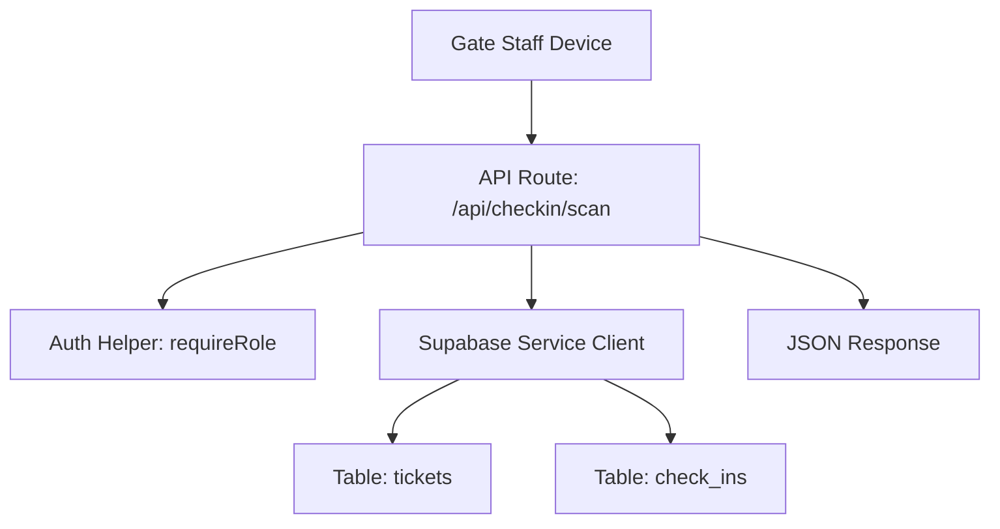
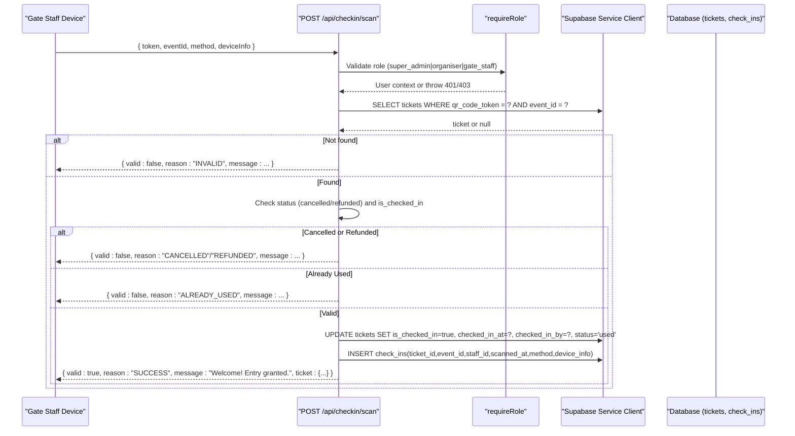
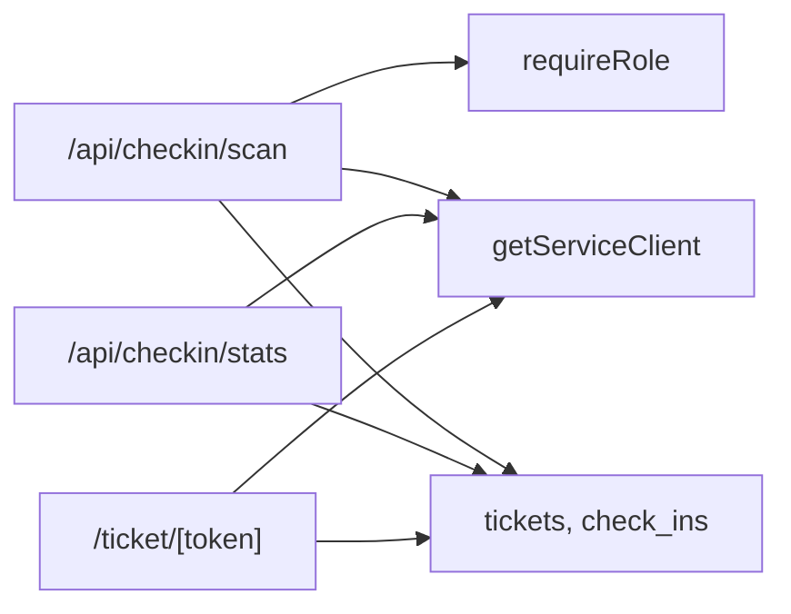
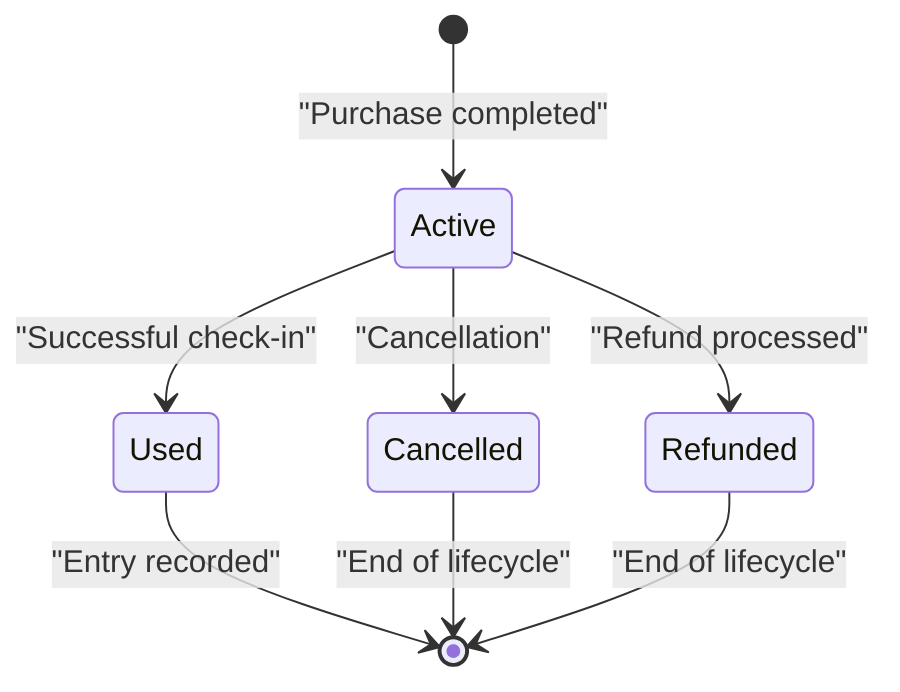

# Ticket Validation Logic

<cite>
**Referenced Files in This Document**
- [scan.js](file://pages/api/checkin/scan.js)
- [schema.sql](file://supabase/schema.sql)
- [auth.js](file://lib/auth.js)
- [supabase.js](file://lib/supabase.js)
- [stats.js](file://pages/api/checkin/stats.js)
- [token page](file://pages/ticket/[token].js)
</cite>

## Table of Contents
1. [Introduction](#introduction)
2. [Project Structure](#project-structure)
3. [Core Components](#core-components)
4. [Architecture Overview](#architecture-overview)
5. [Detailed Component Analysis](#detailed-component-analysis)
6. [Dependency Analysis](#dependency-analysis)
7. [Performance Considerations](#performance-considerations)
8. [Troubleshooting Guide](#troubleshooting-guide)
9. [Conclusion](#conclusion)
10. [Appendices](#appendices)

## Introduction
This document explains the Ticket Validation Logic sub-feature that powers gate check-in. It covers the multi-step validation process, including ticket existence verification, status checks (active, cancelled, refunded), duplicate check-in prevention, and event-specific validation. It also documents validation rules, business constraints, error response formats, database queries for lookup and verification, security considerations (including SQL injection prevention), data integrity checks, and the ticket validation state machine with transition rules.

## Project Structure
The ticket validation logic is implemented as a serverless API route that authenticates staff, validates the ticket against the database, and records the check-in. Supporting files include authentication helpers, Supabase client configuration, schema definitions, and related endpoints for statistics and ticket display.

**Diagram sources**
- [scan.js:1-44](file://pages/api/checkin/scan.js#L1-L44)
- [auth.js:38-46](file://lib/auth.js#L38-L46)
- [supabase.js:15-22](file://lib/supabase.js#L15-L22)
- [schema.sql:59-86](file://supabase/schema.sql#L59-L86)

**Section sources**
- [scan.js:1-44](file://pages/api/checkin/scan.js#L1-L44)
- [schema.sql:59-86](file://supabase/schema.sql#L59-L86)
- [auth.js:38-46](file://lib/auth.js#L38-L46)
- [supabase.js:15-22](file://lib/supabase.js#L15-L22)

## Core Components
- API endpoint: POST /api/checkin/scan
  - Authenticates staff via role-based middleware.
  - Validates request payload (token, eventId).
  - Looks up ticket by qr_code_token and event_id.
  - Enforces status and duplicate-check-in rules.
  - Updates ticket to used and records a check-in audit row.
- Authentication helper: requireRole
  - Parses session cookie, validates expiration, and enforces allowed roles.
- Supabase service client: getServiceClient
  - Provides a privileged client using the service role key for server-side operations.
- Database schema: tickets and check_ins tables
  - Defines statuses, timestamps, foreign keys, and indexes.

Key responsibilities:
- Input validation and authorization enforcement.
- Deterministic validation rules for ticket states.
- Atomic updates and audit logging for check-ins.
- Consistent error responses for clients.

**Section sources**
- [scan.js:1-44](file://pages/api/checkin/scan.js#L1-L44)
- [auth.js:38-46](file://lib/auth.js#L38-L46)
- [supabase.js:15-22](file://lib/supabase.js#L15-L22)
- [schema.sql:59-86](file://supabase/schema.sql#L59-L86)

## Architecture Overview
The validation flow is a sequence of authenticated requests to a single API endpoint that performs database lookups and writes. The endpoint uses a service-role client to bypass Row Level Security policies where necessary and ensures only authorized staff can validate tickets.

**Diagram sources**
- [scan.js:1-44](file://pages/api/checkin/scan.js#L1-L44)
- [auth.js:38-46](file://lib/auth.js#L38-L46)
- [supabase.js:15-22](file://lib/supabase.js#L15-L22)
- [schema.sql:59-86](file://supabase/schema.sql#L59-L86)

## Detailed Component Analysis

### API Endpoint: POST /api/checkin/scan
Responsibilities:
- Enforce HTTP method and parse body fields.
- Authenticate and authorize staff via role check.
- Validate presence of token and eventId.
- Query tickets by qr_code_token and event_id.
- Apply validation rules based on ticket status and is_checked_in flag.
- On success, atomically update ticket and record check-in.
- Return standardized JSON responses for all outcomes.

Validation rules enforced:
- Existence: ticket must exist for the provided token and event.
- Status:
  - If status is 'cancelled', deny entry with reason CANCELLED.
  - If status is 'refunded', deny entry with reason REFUNDED.
- Duplicate prevention:
  - If is_checked_in is true, deny entry with reason ALREADY_USED and include previous check-in time.
- Success path:
  - Set is_checked_in to true, set checked_in_at timestamp, set checked_in_by staff id, and set status to 'used'.
  - Insert a check_ins audit record with scanned_at, method, and optional device_info.

Error handling:
- Missing or invalid input returns 400 with descriptive error.
- Unauthorized or insufficient permissions return 401/403.
- Unexpected errors return 500 with error.message.

Response formats:
- Success:
  - { valid: true, reason: "SUCCESS", message: "Welcome! Entry granted.", ticket: { buyer_name, ticket_type, buyer_phone } }
- Invalid token/event:
  - { valid: false, reason: "INVALID", message: "Ticket not found or not for this event" }
- Cancelled:
  - { valid: false, reason: "CANCELLED", message: "Ticket has been cancelled" }
- Refunded:
  - { valid: false, reason: "REFUNDED", message: "Ticket has been refunded" }
- Already used:
  - { valid: false, reason: "ALREADY_USED", message: "Already checked in at <time>", ticket: { buyer_name, ticket_type, checked_in_at } }
- Server error:
  - { error: "<message>" }

Security considerations:
- Role-based access control via requireRole ensures only authorized staff can call the endpoint.
- Uses Supabase service role client to perform privileged operations server-side.
- Parameterized queries prevent SQL injection.
- Minimal sensitive data exposure; only necessary ticket details are returned.

Data integrity:
- Foreign keys enforce relationships between tickets, events, users, and check_ins.
- CHECK constraints restrict allowed values for status and method fields.
- Indexes optimize lookups by token, email, event_id, and check-in event.

**Section sources**
- [scan.js:1-44](file://pages/api/checkin/scan.js#L1-L44)
- [auth.js:38-46](file://lib/auth.js#L38-L46)
- [supabase.js:15-22](file://lib/supabase.js#L15-L22)
- [schema.sql:59-86](file://supabase/schema.sql#L59-L86)

### Authentication Helper: requireRole
Responsibilities:
- Parse session cookie from request headers.
- Decode and validate session token expiration.
- Ensure user role matches one of the allowed roles.
- Throw structured errors for unauthorized or insufficient permissions.

Behavior:
- Returns user object if authenticated and authorized.
- Throws an error object with status and message when authentication fails or role is insufficient.

**Section sources**
- [auth.js:38-46](file://lib/auth.js#L38-L46)

### Supabase Service Client: getServiceClient
Responsibilities:
- Create a Supabase client configured with the service role key for server-side privileged operations.
- Provide consistent environment variable usage and fallbacks.

Usage:
- Used by API routes to read/write tickets and check_ins without RLS restrictions.

**Section sources**
- [supabase.js:15-22](file://lib/supabase.js#L15-L22)

### Database Schema: tickets and check_ins
Key fields and constraints:
- tickets:
  - id (UUID PK), event_id (FK), ticket_type_id (FK), buyer_name, buyer_email, buyer_phone, qr_code_token (UNIQUE), is_checked_in (BOOLEAN), checked_in_at (TIMESTAMPTZ), checked_in_by (FK), purchase_date, status (CHECK active|used|cancelled|refunded).
- check_ins:
  - id (UUID PK), ticket_id (FK), event_id (FK), staff_id (FK), scanned_at (TIMESTAMPTZ), method (CHECK qr_scan|manual_search), device_info (TEXT).

Indexes:
- idx_tickets_token on qr_code_token for fast lookup.
- idx_tickets_event on event_id for event-scoped queries.
- idx_checkins_event on event_id for recent check-ins.

Row Level Security:
- Tables enabled for RLS; service role client bypasses RLS in server-side routes.

**Section sources**
- [schema.sql:59-86](file://supabase/schema.sql#L59-L86)
- [schema.sql:147-153](file://supabase/schema.sql#L147-L153)

### Related Endpoints and Views
- GET /api/checkin/stats:
  - Aggregates counts of active tickets and checked-in tickets per event.
  - Retrieves recent check-ins with ticket and type details.
  - Requires staff role.
- Ticket display page:
  - Renders ticket details and status (active vs used) for the holder.
  - Uses service role client to fetch ticket by token.

These components complement the validation logic by providing operational visibility and customer-facing views.

**Section sources**
- [stats.js:1-31](file://pages/api/checkin/stats.js#L1-L31)
- [token page:231-254](file://pages/ticket/[token].js#L231-L254)

## Dependency Analysis
The validation logic depends on:
- Authentication helper for role enforcement.
- Supabase service client for privileged database operations.
- Database schema constraints and indexes for data integrity and performance.
- Related endpoints for stats and ticket display.

**Diagram sources**
- [scan.js:1-44](file://pages/api/checkin/scan.js#L1-L44)
- [auth.js:38-46](file://lib/auth.js#L38-L46)
- [supabase.js:15-22](file://lib/supabase.js#L15-L22)
- [stats.js:1-31](file://pages/api/checkin/stats.js#L1-L31)
- [token page:231-254](file://pages/ticket/[token].js#L231-L254)

**Section sources**
- [scan.js:1-44](file://pages/api/checkin/scan.js#L1-L44)
- [stats.js:1-31](file://pages/api/checkin/stats.js#L1-L31)
- [token page:231-254](file://pages/ticket/[token].js#L231-L254)

## Performance Considerations
- Use indexed columns for frequent lookups:
  - qr_code_token index accelerates ticket lookup by token.
  - event_id index supports event-scoped queries.
- Minimize payload size:
  - Select only required fields in queries.
- Avoid unnecessary joins:
  - Fetch related data (event name, ticket type) only when needed.
- Batch operations:
  - Update ticket and insert check-in in separate calls; consider transactions if atomicity is critical across multiple writes.
- Rate limiting and retry logic:
  - Implement at the API layer to protect against abuse and transient failures.

[No sources needed since this section provides general guidance]

## Troubleshooting Guide
Common issues and resolutions:
- 400 Bad Request:
  - Cause: Missing token or eventId.
  - Resolution: Ensure request body includes both fields.
- 401 Unauthorized:
  - Cause: No session or expired session.
  - Resolution: Re-authenticate and refresh session cookie.
- 403 Forbidden:
  - Cause: Insufficient role (not super_admin, organiser, or gate_staff).
  - Resolution: Assign appropriate role to the staff account.
- INVALID reason:
  - Cause: Ticket not found or not for the specified event.
  - Resolution: Verify token and eventId match the intended ticket.
- CANCELLED reason:
  - Cause: Ticket status is cancelled.
  - Resolution: Confirm cancellation decision; reissue if necessary.
- REFUNDED reason:
  - Cause: Ticket status is refunded.
  - Resolution: Review refund policy; do not allow entry.
- ALREADY_USED reason:
  - Cause: Ticket already checked in.
  - Resolution: Inform attendee; verify identity if needed.
- 500 Internal Server Error:
  - Cause: Unexpected exception during processing.
  - Resolution: Inspect logs and ensure environment variables are set correctly.

Operational tips:
- Use /api/checkin/stats to monitor active vs checked-in counts and recent activity.
- Verify indexes exist to avoid slow queries under load.
- Ensure service role key is configured for server-side operations.

**Section sources**
- [scan.js:1-44](file://pages/api/checkin/scan.js#L1-L44)
- [stats.js:1-31](file://pages/api/checkin/stats.js#L1-L31)

## Conclusion
The Ticket Validation Logic implements a robust, secure, and auditable check-in process. It enforces strict validation rules, prevents duplicates, and maintains data integrity through constraints and indexes. The use of role-based authentication and parameterized queries ensures security against common threats like SQL injection. The state machine transitions are clear and deterministic, supporting reliable gate operations and accurate reporting.

[No sources needed since this section summarizes without analyzing specific files]

## Appendices

### Validation State Machine and Transition Rules

**Diagram sources**
- [schema.sql:59-73](file://supabase/schema.sql#L59-L73)
- [scan.js:22-33](file://pages/api/checkin/scan.js#L22-L33)

### Example Scenarios
- Valid ticket:
  - Request: { token: "abc123", eventId: "ev1" }
  - Response: { valid: true, reason: "SUCCESS", message: "Welcome! Entry granted.", ticket: { buyer_name, ticket_type, buyer_phone } }
- Already used ticket:
  - Response: { valid: false, reason: "ALREADY_USED", message: "Already checked in at <time>", ticket: { buyer_name, ticket_type, checked_in_at } }
- Cancelled ticket:
  - Response: { valid: false, reason: "CANCELLED", message: "Ticket has been cancelled" }
- Invalid token:
  - Response: { valid: false, reason: "INVALID", message: "Ticket not found or not for this event" }

**Section sources**
- [scan.js:21-39](file://pages/api/checkin/scan.js#L21-L39)

### Database Queries for Lookup and Verification
- Ticket lookup by token and event:
  - SELECT * FROM tickets WHERE qr_code_token = ? AND event_id = ? LIMIT 1
- Status verification:
  - Read status field and is_checked_in flag from result.
- Update on successful check-in:
  - UPDATE tickets SET is_checked_in = TRUE, checked_in_at = ?, checked_in_by = ?, status = 'used' WHERE id = ?
- Record check-in audit:
  - INSERT INTO check_ins (ticket_id, event_id, staff_id, scanned_at, method, device_info) VALUES (?, ?, ?, ?, ?, ?)

**Section sources**
- [scan.js:14-33](file://pages/api/checkin/scan.js#L14-L33)
- [schema.sql:59-86](file://supabase/schema.sql#L59-L86)

### Security Considerations
- SQL injection prevention:
  - All queries use parameterized bindings via Supabase client.
- Authorization:
  - requireRole enforces session validity and role checks before any database operations.
- Data integrity:
  - CHECK constraints limit allowed values for status and method fields.
  - Foreign keys maintain referential integrity across tables.
- Least privilege:
  - Service role client is used only server-side; public clients remain restricted by RLS policies.

**Section sources**
- [auth.js:38-46](file://lib/auth.js#L38-L46)
- [supabase.js:15-22](file://lib/supabase.js#L15-L22)
- [schema.sql:124-142](file://supabase/schema.sql#L124-L142)