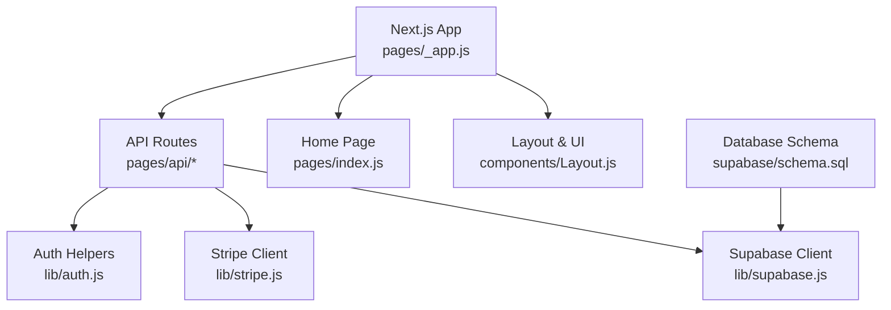
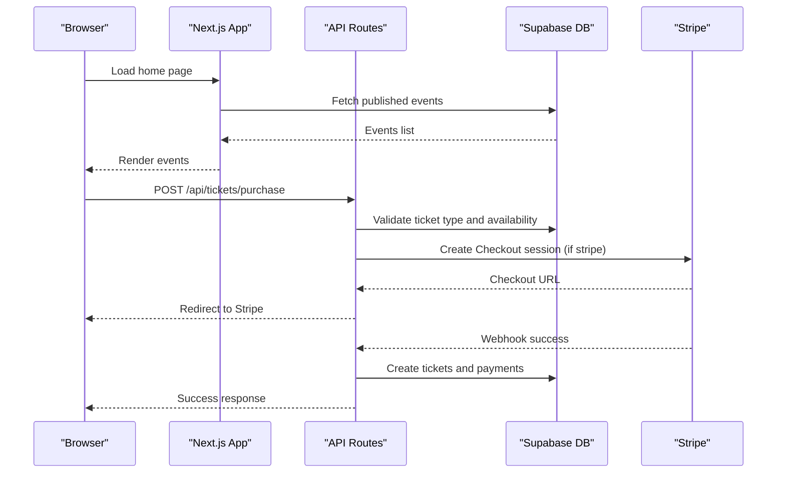
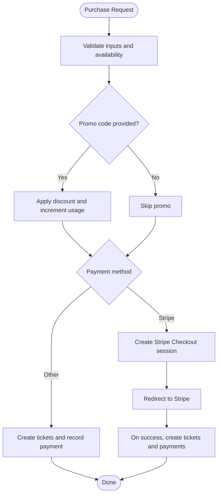
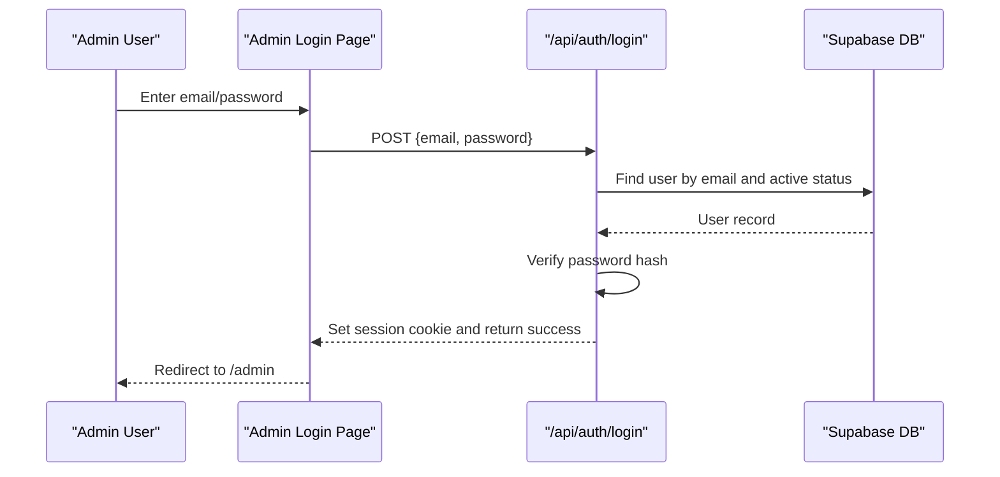

# Getting Started

<cite>
**Referenced Files in This Document**
- [package.json](file://package.json)
- [next.config.js](file://next.config.js)
- [vercel.json](file://vercel.json)
- [.gitignore](file://.gitignore)
- [supabase/schema.sql](file://supabase/schema.sql)
- [lib/supabase.js](file://lib/supabase.js)
- [lib/stripe.js](file://lib/stripe.js)
- [lib/auth.js](file://lib/auth.js)
- [pages/_app.js](file://pages/_app.js)
- [pages/index.js](file://pages/index.js)
- [pages/api/auth/login.js](file://pages/api/auth/login.js)
- [pages/admin/login.js](file://pages/admin/login.js)
- [pages/api/tickets/purchase.js](file://pages/api/tickets/purchase.js)
</cite>

## Table of Contents
1. Introduction
2. Project Structure
3. Core Components
4. Architecture Overview
5. Detailed Component Analysis
6. Dependency Analysis
7. Performance Considerations
8. Troubleshooting Guide
9. Conclusion
10. Appendices

## Introduction
TicketFlow is a Next.js-based ticketing platform that lets you create events, sell tickets with Stripe or other payment methods, and manage check-ins. It uses Supabase for the database and authentication helpers, and Stripe for payments. This guide helps you set up the environment, configure external services, run the app locally, and perform your first actions: creating an event, buying tickets, and accessing the admin dashboard.

## Project Structure
The project follows a standard Next.js layout:
- pages/: App entry points and API routes
- lib/: Shared utilities (Supabase client, Stripe client, auth helpers)
- components/: Reusable UI components and layouts
- supabase/schema.sql: Database schema to initialize your Supabase project
- next.config.js: Next.js configuration (e.g., remote image domains)
- vercel.json: Deployment settings for Vercel
- package.json: Dependencies and scripts



**Diagram sources**
- [pages/_app.js:1-14](file://pages/_app.js#L1-L14)
- [pages/index.js:1-120](file://pages/index.js#L1-L120)
- [lib/supabase.js:1-23](file://lib/supabase.js#L1-L23)
- [lib/stripe.js:1-6](file://lib/stripe.js#L1-L6)
- [lib/auth.js:1-47](file://lib/auth.js#L1-L47)
- [supabase/schema.sql:1-166](file://supabase/schema.sql#L1-L166)

**Section sources**
- [package.json:1-24](file://package.json#L1-L24)
- [next.config.js:1-14](file://next.config.js#L1-L14)
- [vercel.json:1-18](file://vercel.json#L1-L18)
- [.gitignore:1-33](file://.gitignore#L1-L33)

## Core Components
- Supabase client: Initializes public and service-role clients using environment variables.
- Stripe client: Initializes Stripe SDK with secret key.
- Auth helpers: Password hashing/verification and session token creation/validation.
- Pages and API routes: Home page fetches published events; login and purchase endpoints handle authentication and ticket purchases.

Key responsibilities:
- lib/supabase.js: Create Supabase clients and expose getServiceClient() for server-side operations.
- lib/stripe.js: Provide a configured Stripe instance.
- lib/auth.js: Hash/verify passwords and manage simple session tokens.
- pages/index.js: Server-side rendering of published events from Supabase.
- pages/api/auth/login.js: Authenticate users against the users table and set a session cookie.
- pages/api/tickets/purchase.js: Validate availability, apply promo codes, integrate Stripe checkout, and record tickets/payments.

**Section sources**
- [lib/supabase.js:1-23](file://lib/supabase.js#L1-L23)
- [lib/stripe.js:1-6](file://lib/stripe.js#L1-L6)
- [lib/auth.js:1-47](file://lib/auth.js#L1-L47)
- [pages/index.js:726-750](file://pages/index.js#L726-L750)
- [pages/api/auth/login.js:1-31](file://pages/api/auth/login.js#L1-L31)
- [pages/api/tickets/purchase.js:1-123](file://pages/api/tickets/purchase.js#L1-L123)

## Architecture Overview
High-level flow:
- The browser loads the Next.js app and renders pages via pages/_app.js.
- Public pages read data from Supabase (published events).
- Admin and check-in flows use protected API routes.
- Ticket purchases go through an API route that integrates with Stripe and writes to Supabase.



**Diagram sources**
- [pages/index.js:726-750](file://pages/index.js#L726-L750)
- [pages/api/tickets/purchase.js:1-123](file://pages/api/tickets/purchase.js#L1-L123)
- [lib/supabase.js:1-23](file://lib/supabase.js#L1-L23)
- [lib/stripe.js:1-6](file://lib/stripe.js#L1-L6)

## Detailed Component Analysis

### Environment Setup and Prerequisites
- Node.js: Use a recent LTS version compatible with Next.js 15 and React 19.
- Supabase project: Create a project and run the provided schema to initialize tables and policies.
- Stripe account: Obtain your secret key for server-side usage.
- Local environment file: Create .env.local with required variables.

Required environment variables:
- NEXT_PUBLIC_SUPABASE_URL: Your Supabase project URL.
- NEXT_PUBLIC_SUPABASE_ANON_KEY: Public anon key for client-side reads.
- SUPABASE_SERVICE_ROLE_KEY: Service role key for server-side writes.
- STRIPE_SECRET_KEY: Secret key for Stripe integration.
- NEXT_PUBLIC_SITE_URL: Base URL used for Stripe redirect URLs.

Where these are used:
- Supabase client initialization and warnings if missing.
- Stripe client initialization.
- Purchase endpoint redirects and metadata.

**Section sources**
- [lib/supabase.js:1-23](file://lib/supabase.js#L1-L23)
- [lib/stripe.js:1-6](file://lib/stripe.js#L1-L6)
- [pages/api/tickets/purchase.js:47-76](file://pages/api/tickets/purchase.js#L47-L76)
- [.gitignore:11-16](file://.gitignore#L11-L16)

### Installation Steps
1. Install dependencies:
   - Run npm install in the repository root.
2. Initialize Supabase database:
   - Open your Supabase SQL editor and run the contents of supabase/schema.sql.
3. Configure environment variables:
   - Create .env.local and add the variables listed above.
4. Start development server:
   - Run npm run dev.
5. Verify setup:
   - Visit http://localhost:3000 to see the home page with events.
   - Access admin login at /admin/login.

Notes:
- next.config.js allows images from Unsplash and Supabase domains.
- vercel.json defines build and dev commands for deployment.

**Section sources**
- [package.json:5-9](file://package.json#L5-L9)
- [supabase/schema.sql:1-166](file://supabase/schema.sql#L1-L166)
- [next.config.js:4-10](file://next.config.js#L4-L10)
- [vercel.json:2-6](file://vercel.json#L2-L6)

### Initial Database Setup
Run supabase/schema.sql in your Supabase SQL editor. This script:
- Enables UUID extension.
- Creates tables: users, events, ticket_types, tickets, check_ins, payments, promo_codes.
- Enables Row Level Security and adds policies for public reads on published events.
- Adds indexes for performance.
- Seeds a default super admin user.

After running, you can log in with the seeded credentials.

**Section sources**
- [supabase/schema.sql:1-166](file://supabase/schema.sql#L1-L166)

### Creating Your First Event
- Navigate to the admin area and create a new event.
- Ensure the event status is set to published so it appears on the home page.
- Add one or more ticket types with price and quantity.

Verification:
- On the home page, published events will be fetched server-side from Supabase.

**Section sources**
- [pages/index.js:726-750](file://pages/index.js#L726-L750)

### Purchasing Tickets
- From an event page, select a ticket type and quantity.
- Choose a payment method:
  - Stripe: Redirects to Stripe Checkout and returns on success.
  - Other methods: Tickets are created immediately after validation.

Flow highlights:
- Availability check and promo code application.
- Stripe Checkout session creation with metadata containing buyer info and tokens.
- Ticket creation and payment recording.



**Diagram sources**
- [pages/api/tickets/purchase.js:1-123](file://pages/api/tickets/purchase.js#L1-L123)

**Section sources**
- [pages/api/tickets/purchase.js:1-123](file://pages/api/tickets/purchase.js#L1-L123)

### Accessing the Admin Dashboard
- Go to /admin/login and sign in with the seeded super admin credentials.
- After successful login, a session cookie is set and you are redirected to the admin area.

Authentication flow:
- Login form posts to /api/auth/login.
- Server verifies credentials against the users table and sets a session cookie.



**Diagram sources**
- [pages/admin/login.js:1-67](file://pages/admin/login.js#L1-L67)
- [pages/api/auth/login.js:1-31](file://pages/api/auth/login.js#L1-L31)
- [lib/auth.js:1-47](file://lib/auth.js#L1-L47)

**Section sources**
- [pages/admin/login.js:1-67](file://pages/admin/login.js#L1-L67)
- [pages/api/auth/login.js:1-31](file://pages/api/auth/login.js#L1-L31)
- [lib/auth.js:1-47](file://lib/auth.js#L1-L47)

## Dependency Analysis
External dependencies and their roles:
- @supabase/supabase-js: Database client for Supabase.
- stripe and @stripe/*: Payment processing and frontend helpers.
- bcryptjs: Password hashing.
- next, react, react-dom: Core runtime.
- uuid: Unique identifiers for tickets and tokens.
- resend: Email sending (available but not required for basic setup).

Configuration:
- next.config.js allows remote images from Unsplash and Supabase.
- vercel.json configures framework and security headers for API routes.

```mermaid
graph LR
Pkg["package.json"] --> Next["next"]
Pkg --> React["react/react-dom"]
Pkg --> Supabase["@supabase/supabase-js"]
Pkg --> Stripe["@stripe/*", "stripe"]
Pkg --> Bcrypt["bcryptjs"]
Pkg --> UUID["uuid"]
NextCfg["next.config.js"] --> Images["Remote image domains"]
VercelCfg["vercel.json"] --> Headers["Security headers for /api/*"]
```

**Diagram sources**
- [package.json:10-22](file://package.json#L10-L22)
- [next.config.js:4-10](file://next.config.js#L4-L10)
- [vercel.json:7-16](file://vercel.json#L7-L16)

**Section sources**
- [package.json:1-24](file://package.json#L1-L24)
- [next.config.js:1-14](file://next.config.js#L1-L14)
- [vercel.json:1-18](file://vercel.json#L1-L18)

## Performance Considerations
- Database indexing: The schema includes indexes on frequently queried columns (event slug, status, ticket token, email, event_id, checkins event_id, payments ticket_id).
- Server-side rendering: The home page fetches published events server-side to reduce client load.
- Image optimization: Remote image domains are whitelisted in next.config.js for efficient loading.

[No sources needed since this section provides general guidance]

## Troubleshooting Guide
Common issues and resolutions:
- Supabase environment variables not set:
  - Symptom: Console warning about missing Supabase variables.
  - Resolution: Add NEXT_PUBLIC_SUPABASE_URL, NEXT_PUBLIC_SUPABASE_ANON_KEY, and SUPABASE_SERVICE_ROLE_KEY to .env.local.
- Stripe checkout fails:
  - Symptom: Errors when creating a checkout session.
  - Resolution: Ensure STRIPE_SECRET_KEY is correct and NEXT_PUBLIC_SITE_URL is set to your base URL.
- No events appear on the home page:
  - Symptom: Empty events list.
  - Resolution: Ensure events exist with status 'published' and the schema has been run.
- Admin login fails:
  - Symptom: Invalid credentials error.
  - Resolution: Confirm the schema was run and use the seeded super admin credentials. Change the password after first login.

Where to look:
- Supabase client warnings and initialization.
- Purchase endpoint error handling and Stripe integration.
- Login endpoint credential verification and cookie setting.

**Section sources**
- [lib/supabase.js:6-8](file://lib/supabase.js#L6-L8)
- [pages/api/tickets/purchase.js:118-122](file://pages/api/tickets/purchase.js#L118-L122)
- [pages/api/auth/login.js:18-30](file://pages/api/auth/login.js#L18-L30)

## Conclusion
You now have everything needed to set up TicketFlow locally, connect Supabase and Stripe, and perform core tasks like creating events, purchasing tickets, and accessing the admin dashboard. For production, ensure all secrets are securely managed and consider enabling full authentication via Supabase Auth and webhook handling for Stripe.

[No sources needed since this section summarizes without analyzing specific files]

## Appendices

### Quick Start Checklist
- Install dependencies: npm install
- Run schema.sql in Supabase
- Create .env.local with required variables
- Start dev server: npm run dev
- Visit http://localhost:3000
- Log in at /admin/login

### Environment Variables Reference
- NEXT_PUBLIC_SUPABASE_URL
- NEXT_PUBLIC_SUPABASE_ANON_KEY
- SUPABASE_SERVICE_ROLE_KEY
- STRIPE_SECRET_KEY
- NEXT_PUBLIC_SITE_URL

**Section sources**
- [lib/supabase.js:3-8](file://lib/supabase.js#L3-L8)
- [lib/stripe.js:3-5](file://lib/stripe.js#L3-L5)
- [pages/api/tickets/purchase.js:65-73](file://pages/api/tickets/purchase.js#L65-L73)