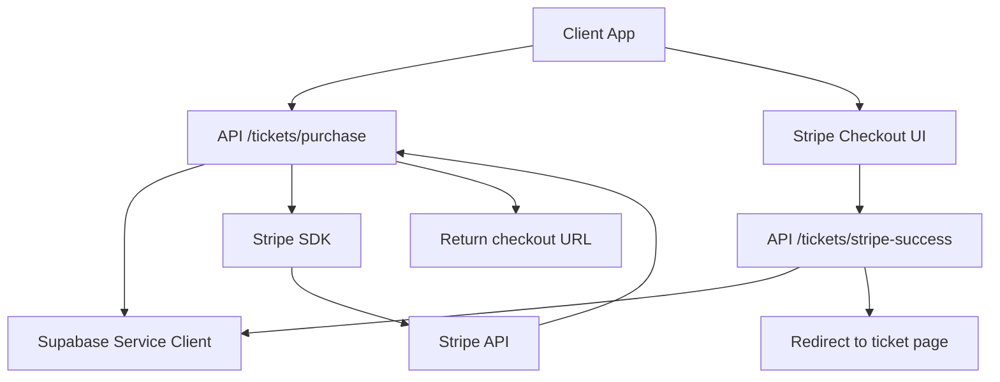
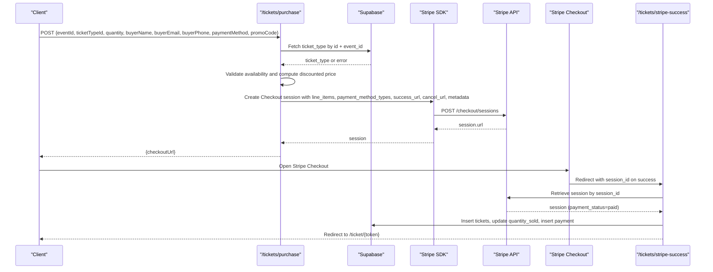
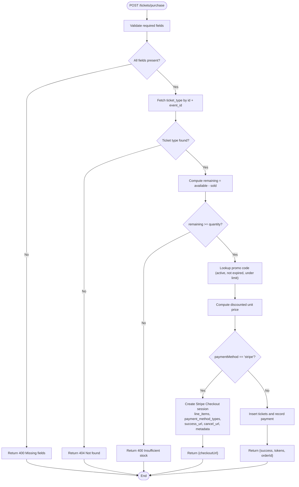
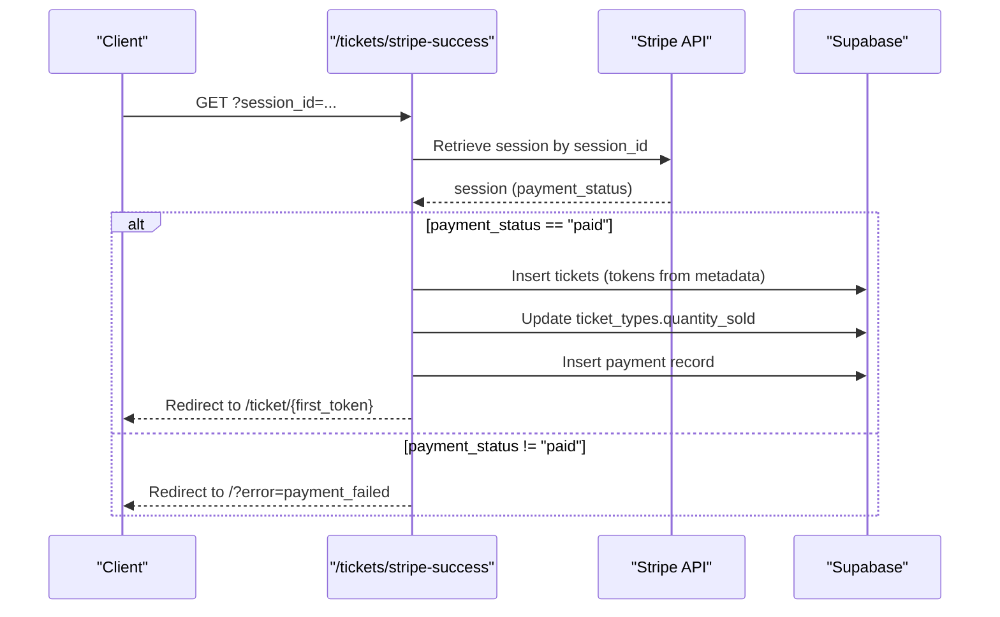
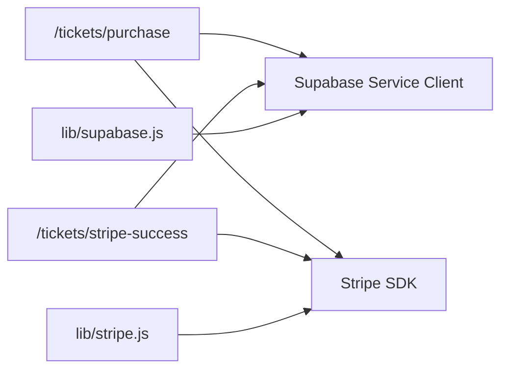

# Checkout Session Creation

<cite>
**Referenced Files in This Document**
- [purchase.js](file://pages/api/tickets/purchase.js)
- [stripe-success.js](file://pages/api/tickets/stripe-success.js)
- [stripe.js](file://lib/stripe.js)
- [supabase.js](file://lib/supabase.js)
- [schema.sql](file://supabase/schema.sql)
- [validate.js](file://pages/api/promo/validate.js)
</cite>

## Table of Contents
1. [Introduction](#introduction)
2. [Project Structure](#project-structure)
3. [Core Components](#core-components)
4. [Architecture Overview](#architecture-overview)
5. [Detailed Component Analysis](#detailed-component-analysis)
6. [Dependency Analysis](#dependency-analysis)
7. [Performance Considerations](#performance-considerations)
8. [Troubleshooting Guide](#troubleshooting-guide)
9. [Conclusion](#conclusion)

## Introduction
This document explains how the TicketFlow application creates Stripe Checkout sessions for ticket purchases. It covers:
- How the purchase endpoint validates ticket availability and applies discounts
- How pricing is calculated with promo codes
- How a Stripe Checkout session is created, including line items, payment methods, success/cancel URLs, and metadata
- What happens after successful payment via the success handler
- Error handling for insufficient stock, invalid ticket types, and Stripe API failures

## Project Structure
The checkout flow spans two serverless endpoints and shared libraries:
- Purchase endpoint: validates inputs, checks availability, applies promo codes, and creates a Stripe Checkout session
- Success endpoint: verifies payment, persists tickets and payments, and redirects to the ticket page
- Shared libraries: Supabase client (service role), Stripe SDK configuration

**Diagram sources**
- [purchase.js:1-123](file://pages/api/tickets/purchase.js#L1-L123)
- [stripe-success.js:1-55](file://pages/api/tickets/stripe-success.js#L1-L55)
- [supabase.js:1-23](file://lib/supabase.js#L1-L23)
- [stripe.js:1-6](file://lib/stripe.js#L1-L6)

**Section sources**
- [purchase.js:1-123](file://pages/api/tickets/purchase.js#L1-L123)
- [stripe-success.js:1-55](file://pages/api/tickets/stripe-success.js#L1-L55)
- [supabase.js:1-23](file://lib/supabase.js#L1-L23)
- [stripe.js:1-6](file://lib/stripe.js#L1-L6)

## Core Components
- Purchase endpoint (/api/tickets/purchase):
  - Validates required fields
  - Verifies ticket type exists and belongs to the event
  - Checks remaining stock against requested quantity
  - Applies promo code discount if valid
  - Creates Stripe Checkout session with line items, payment method types, success/cancel URLs, and metadata
- Success endpoint (/api/tickets/stripe-success):
  - Retrieves the Stripe session by ID
  - Confirms payment status
  - Persists tickets and updates sold counts
  - Records payment details and redirects to the ticket page

Key data models used:
- ticket_types: price, quantity_available, quantity_sold
- tickets: buyer info, unique QR token per ticket
- payments: amount, currency, method, transaction reference, status

**Section sources**
- [purchase.js:1-123](file://pages/api/tickets/purchase.js#L1-L123)
- [stripe-success.js:1-55](file://pages/api/tickets/stripe-success.js#L1-L55)
- [schema.sql:45-102](file://supabase/schema.sql#L45-L102)

## Architecture Overview
The end-to-end flow from purchase request to ticket issuance:

**Diagram sources**
- [purchase.js:1-123](file://pages/api/tickets/purchase.js#L1-L123)
- [stripe-success.js:1-55](file://pages/api/tickets/stripe-success.js#L1-L55)
- [supabase.js:1-23](file://lib/supabase.js#L1-L23)
- [stripe.js:1-6](file://lib/stripe.js#L1-L6)

## Detailed Component Analysis

### Purchase Endpoint: Validation, Pricing, and Session Creation
Responsibilities:
- Input validation: ensures eventId, ticketTypeId, quantity, buyerName, buyerEmail are present
- Ticket verification: fetches ticket_type for the given event; returns 404 if not found
- Availability check: calculates remaining = quantity_available - quantity_sold; rejects if insufficient
- Promo code application:
  - If promoCode provided, looks up active, non-expired code within the event
  - Increments times_used atomically when applied
  - Computes discounted unit price
- Stripe Checkout session creation:
  - payment_method_types: card
  - line_items: single item with product name, currency, unit_amount (cents), and quantity
  - mode: payment
  - success_url: includes session_id placeholder for post-payment processing
  - cancel_url: returns user to event page
  - customer_email: buyer email
  - metadata: eventId, ticketTypeId, quantity, buyerName, buyerEmail, buyerPhone, tokens (comma-separated UUIDs), discount percentage

Important notes:
- Unit amount is rounded to cents before sending to Stripe
- Tokens are pre-generated and embedded in metadata so they can be reused in the success handler
- For non-Stripe payment methods, tickets are created immediately and payment recorded accordingly

Error handling:
- Missing fields: 400 with error message
- Invalid ticket type: 404 with error message
- Insufficient stock: 400 with remaining count
- Database errors: 500 with generic error
- Stripe API errors: caught and returned as 500

**Diagram sources**
- [purchase.js:1-123](file://pages/api/tickets/purchase.js#L1-L123)

**Section sources**
- [purchase.js:1-123](file://pages/api/tickets/purchase.js#L1-L123)

### Success Endpoint: Post-Payment Processing
Responsibilities:
- Retrieve the Stripe session using session_id from query
- Verify payment_status is paid; otherwise redirect with error
- Parse metadata to obtain eventId, ticketTypeId, quantity, buyer info, tokens, and discount
- Persist tickets using pre-generated tokens
- Update ticket_types.quantity_sold
- Record payment with Stripe transaction reference and mark completed
- Redirect to the first ticket’s public page

Error handling:
- Missing session_id: redirect to home
- Payment not paid: redirect with error
- Database errors: catch and redirect with processing_failed

**Diagram sources**
- [stripe-success.js:1-55](file://pages/api/tickets/stripe-success.js#L1-L55)

**Section sources**
- [stripe-success.js:1-55](file://pages/api/tickets/stripe-success.js#L1-L55)

### Stripe Integration Configuration
- A shared Stripe client is defined for reuse across the app
- The purchase endpoint dynamically imports Stripe and constructs a client instance using environment variables
- API version is set explicitly for compatibility

Best practices:
- Use environment variables for secret keys
- Centralize Stripe initialization where possible to avoid duplication

**Section sources**
- [stripe.js:1-6](file://lib/stripe.js#L1-L6)
- [purchase.js:46-76](file://pages/api/tickets/purchase.js#L46-L76)

### Data Models and Constraints
Key tables involved in checkout:
- ticket_types: price, quantity_available, quantity_sold
- tickets: buyer_name, buyer_email, buyer_phone, qr_code_token, status
- payments: amount, currency, payment_method, transaction_ref, status, paid_at
- promo_codes: discount_percent, max_uses, times_used, expires_at, is_active

Constraints relevant to checkout:
- Unique qr_code_token per ticket
- Status enums ensure consistent lifecycle states
- RLS policies allow public read for published events and ticket types

**Section sources**
- [schema.sql:45-117](file://supabase/schema.sql#L45-L117)

### Promo Code Validation
A separate endpoint validates promo codes prior to purchase:
- Ensures code exists, is active, has remaining uses, and is not expired
- Returns discount_percent when valid

Usage in purchase flow:
- If provided, the purchase endpoint applies the discount and increments usage

**Section sources**
- [validate.js:1-27](file://pages/api/promo/validate.js#L1-L27)
- [purchase.js:27-41](file://pages/api/tickets/purchase.js#L27-L41)

## Dependency Analysis
High-level dependencies:
- purchase.js depends on:
  - Supabase service client for reading ticket_types and writing tickets/payments
  - Stripe SDK for creating checkout sessions
- stripe-success.js depends on:
  - Stripe SDK for retrieving sessions
  - Supabase service client for persisting tickets and payments
- supabase.js provides both anonymous and service-role clients
- stripe.js defines a reusable Stripe client instance

**Diagram sources**
- [purchase.js:1-123](file://pages/api/tickets/purchase.js#L1-L123)
- [stripe-success.js:1-55](file://pages/api/tickets/stripe-success.js#L1-L55)
- [supabase.js:1-23](file://lib/supabase.js#L1-L23)
- [stripe.js:1-6](file://lib/stripe.js#L1-L6)

**Section sources**
- [purchase.js:1-123](file://pages/api/tickets/purchase.js#L1-L123)
- [stripe-success.js:1-55](file://pages/api/tickets/stripe-success.js#L1-L55)
- [supabase.js:1-23](file://lib/supabase.js#L1-L23)
- [stripe.js:1-6](file://lib/stripe.js#L1-L6)

## Performance Considerations
- Minimize database round-trips:
  - Fetch ticket_type once and reuse for pricing and availability checks
- Avoid redundant Stripe calls:
  - Reuse a centralized Stripe client instance where possible
- Pre-generate tokens:
  - Reduces latency during success handler by avoiding extra UUID generation
- Idempotency:
  - Ensure success handler is safe to retry; use transaction references to prevent duplicate payments
- Indexes:
  - Existing indexes on tickets(qr_code_token), tickets(event_id), and payments(ticket_id) support fast lookups

[No sources needed since this section provides general guidance]

## Troubleshooting Guide
Common issues and resolutions:
- Missing required fields:
  - Ensure eventId, ticketTypeId, quantity, buyerName, buyerEmail are included in the request body
- Invalid ticket type:
  - Confirm ticketTypeId belongs to the specified eventId and that the event is published
- Insufficient stock:
  - Check quantity_available vs quantity_sold; reduce requested quantity or increase capacity
- Promo code not applied:
  - Verify code is active, not expired, and has remaining uses; confirm it matches the event
- Stripe API failures:
  - Check environment variables for STRIPE_SECRET_KEY; verify network connectivity; inspect logs for Stripe errors
- Payment not marked paid:
  - In success handler, ensure session.payment_status is paid before persisting tickets

Operational tips:
- Log all errors consistently in both endpoints
- Use structured responses for client-side feedback
- Monitor Stripe dashboard for failed payments and webhook issues

**Section sources**
- [purchase.js:1-123](file://pages/api/tickets/purchase.js#L1-L123)
- [stripe-success.js:1-55](file://pages/api/tickets/stripe-success.js#L1-L55)

## Conclusion
The TicketFlow checkout process integrates robust validation, dynamic pricing with promo codes, and secure Stripe Checkout sessions. The purchase endpoint prepares all necessary metadata and line items, while the success endpoint finalizes ticket issuance and payment recording. Proper error handling and clear redirections ensure a smooth user experience even in failure scenarios.

[No sources needed since this section summarizes without analyzing specific files]