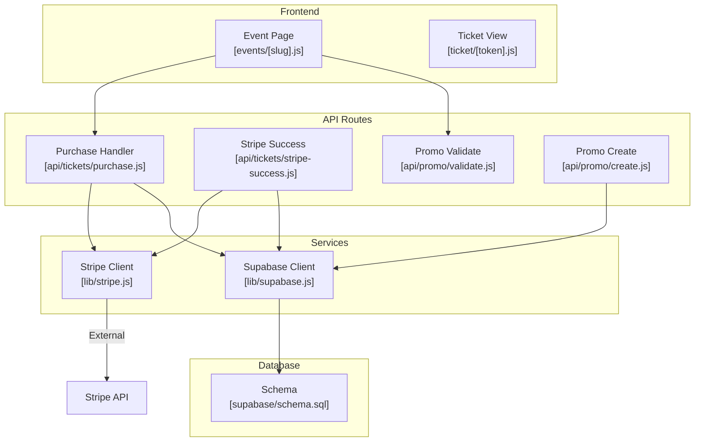
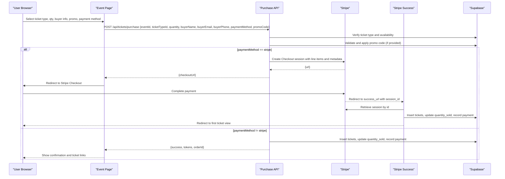
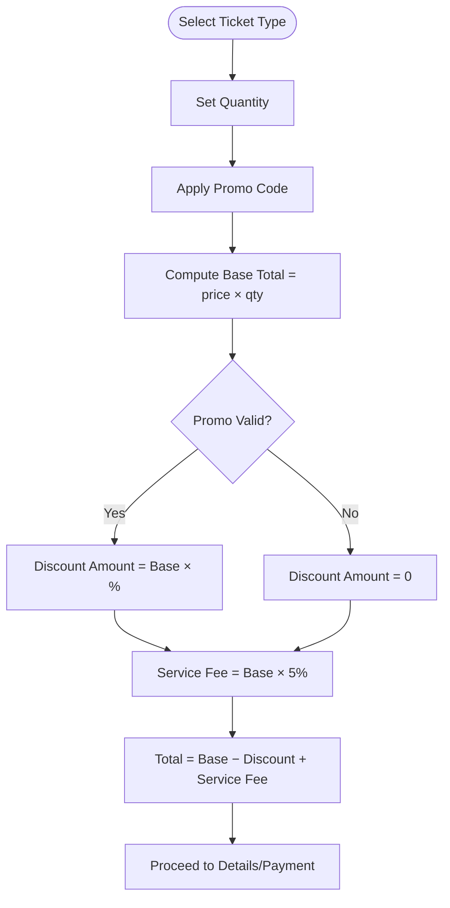
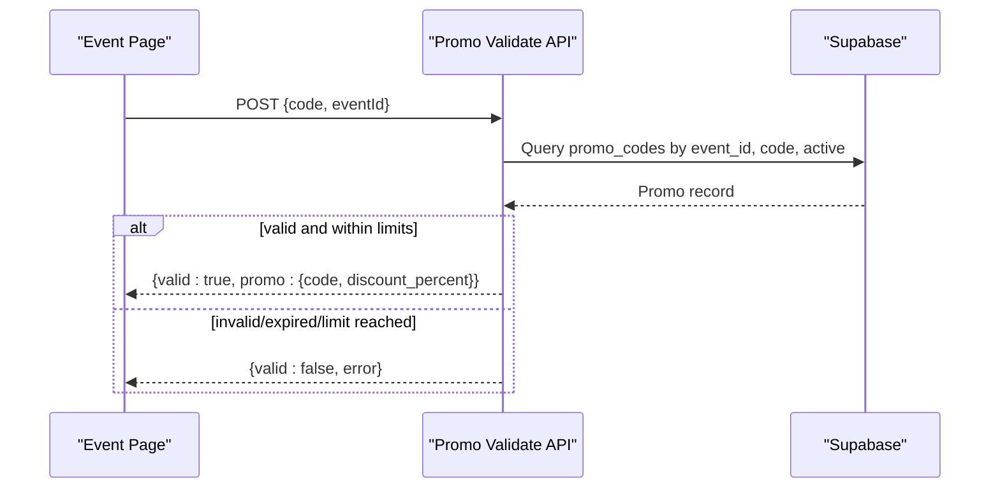
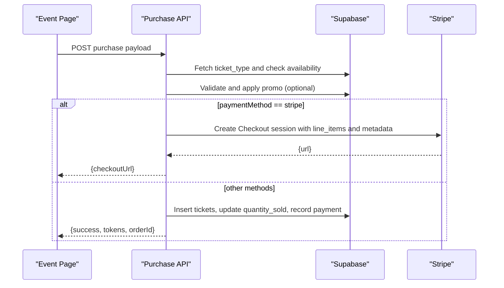
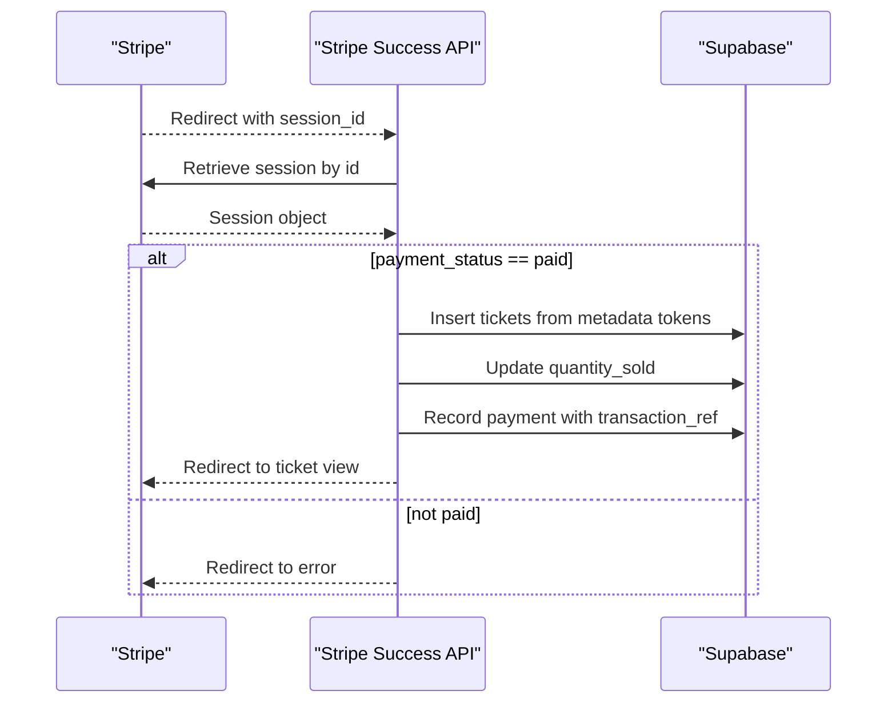
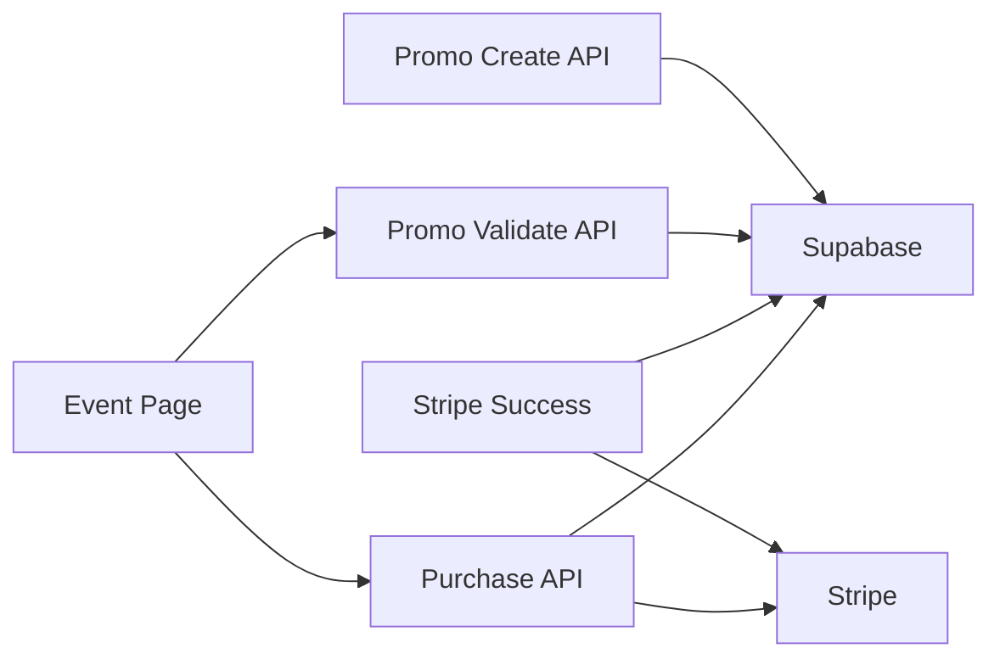

# Checkout Session Management

<cite>
**Referenced Files in This Document**
- [stripe.js](file://lib/stripe.js)
- [supabase.js](file://lib/supabase.js)
- [purchase.js](file://pages/api/tickets/purchase.js)
- [stripe-success.js](file://pages/api/tickets/stripe-success.js)
- [validate.js](file://pages/api/promo/validate.js)
- [create.js](file://pages/api/promo/create.js)
- [schema.sql](file://supabase/schema.sql)
- [events/[slug].js](file://pages/events/[slug].js)
- [ticket/[token].js](file://pages/ticket/[token].js)
</cite>

## Table of Contents
1. [Introduction](#introduction)
2. [Project Structure](#project-structure)
3. [Core Components](#core-components)
4. [Architecture Overview](#architecture-overview)
5. [Detailed Component Analysis](#detailed-component-analysis)
6. [Dependency Analysis](#dependency-analysis)
7. [Performance Considerations](#performance-considerations)
8. [Troubleshooting Guide](#troubleshooting-guide)
9. [Conclusion](#conclusion)
10. [Appendices](#appendices)

## Introduction
This document explains the end-to-end checkout session creation and management process for ticket purchases, from ticket selection to payment completion. It covers:
- Line item setup and pricing calculations
- Promo code validation and discount application
- Tax handling (current state)
- Stripe Checkout session parameters, success/cancel URLs, and metadata
- Customer information handling
- Payment method flows (Stripe card and EcoCash)
- Complex pricing scenarios with multiple ticket types

The system uses a Next.js frontend with serverless API routes, Supabase for data persistence, and Stripe for secure payments.

## Project Structure
Key files involved in checkout sessions:
- Frontend event page orchestrates the multi-step checkout flow and collects buyer details and promo codes
- API route creates Stripe Checkout sessions or issues tickets directly for non-Stripe methods
- Success handler reconciles Stripe payments and persists tickets and payments
- Promo APIs validate and create promo codes
- Database schema defines entities and constraints

**Diagram sources**
- [events/[slug].js](file://pages/events/[slug].js)
- [purchase.js](file://pages/api/tickets/purchase.js)
- [stripe-success.js](file://pages/api/tickets/stripe-success.js)
- [validate.js](file://pages/api/promo/validate.js)
- [create.js](file://pages/api/promo/create.js)
- [stripe.js](file://lib/stripe.js)
- [supabase.js](file://lib/supabase.js)
- [schema.sql](file://supabase/schema.sql)

**Section sources**
- [events/[slug].js](file://pages/events/[slug].js)
- [purchase.js](file://pages/api/tickets/purchase.js)
- [stripe-success.js](file://pages/api/tickets/stripe-success.js)
- [validate.js](file://pages/api/promo/validate.js)
- [create.js](file://pages/api/promo/create.js)
- [stripe.js](file://lib/stripe.js)
- [supabase.js](file://lib/supabase.js)
- [schema.sql](file://supabase/schema.sql)

## Core Components
- Event page: Collects selected ticket type(s), quantity, buyer info, promo code, and payment method; computes invoice summary including platform fee and discounts; triggers purchase flow.
- Purchase API: Validates availability, applies promo discount, creates Stripe Checkout session for card payments, or issues tickets immediately for other methods.
- Stripe success handler: Verifies payment status, creates tickets, updates sold quantities, records payments, and redirects to the first ticket view.
- Promo APIs: Validate promo codes against event scope, usage limits, and expiration; allow admins to create new promo codes.
- Stripe client: Initializes Stripe SDK with environment secret key.
- Supabase client: Provides service-role client for server-side DB operations.

**Section sources**
- [events/[slug].js](file://pages/events/[slug].js)
- [purchase.js](file://pages/api/tickets/purchase.js)
- [stripe-success.js](file://pages/api/tickets/stripe-success.js)
- [validate.js](file://pages/api/promo/validate.js)
- [create.js](file://pages/api/promo/create.js)
- [stripe.js](file://lib/stripe.js)
- [supabase.js](file://lib/supabase.js)

## Architecture Overview
The checkout flow is split into two primary paths:
- Stripe path: The frontend calls the purchase API, which returns a Stripe Checkout URL. After payment, Stripe redirects to the success handler that finalizes the order.
- Non-Stripe path: The purchase API creates tickets immediately and returns tokens for viewing.

**Diagram sources**
- [events/[slug].js](file://pages/events/[slug].js)
- [purchase.js](file://pages/api/tickets/purchase.js)
- [stripe-success.js](file://pages/api/tickets/stripe-success.js)
- [stripe.js](file://lib/stripe.js)
- [supabase.js](file://lib/supabase.js)

## Detailed Component Analysis

### Ticket Selection and Pricing Calculation (Frontend)
- The event page displays available ticket types, enforces availability, and allows selecting one type per purchase.
- Invoice summary includes:
  - Base total = price × quantity
  - Discount amount based on applied promo percentage
  - Platform fee (fixed 5% of base total)
  - Total = base total − discount amount + platform fee
- Promo code validation occurs via an API call before purchase.

**Diagram sources**
- [events/[slug].js](file://pages/events/[slug].js)

**Section sources**
- [events/[slug].js](file://pages/events/[slug].js)

### Promo Code Validation and Creation
- Validation endpoint checks:
  - Code exists for the event
  - Active flag is true
  - Usage limit not exceeded
  - Not expired
- Admin creation endpoint requires role authorization and inserts promo code with defaults.

**Diagram sources**
- [validate.js](file://pages/api/promo/validate.js)
- [schema.sql](file://supabase/schema.sql)

**Section sources**
- [validate.js](file://pages/api/promo/validate.js)
- [create.js](file://pages/api/promo/create.js)
- [schema.sql](file://supabase/schema.sql)

### Purchase API: Stripe Checkout Session Creation
- Validates required fields and ticket availability.
- Applies promo discount if provided.
- For Stripe:
  - Generates unique tokens for each ticket and embeds them in metadata.
  - Creates a Checkout session with:
    - payment_method_types: ["card"]
    - line_items: single item with product name, currency, unit_amount (cents), quantity
    - mode: "payment"
    - success_url: points to stripe-success handler with session_id placeholder
    - cancel_url: returns to event page
    - customer_email: buyer email
    - metadata: eventId, ticketTypeId, quantity, buyerName, buyerEmail, buyerPhone, tokens, discount
  - Returns checkoutUrl to redirect the user.

**Diagram sources**
- [purchase.js](file://pages/api/tickets/purchase.js)
- [stripe.js](file://lib/stripe.js)
- [supabase.js](file://lib/supabase.js)

**Section sources**
- [purchase.js](file://pages/api/tickets/purchase.js)
- [stripe.js](file://lib/stripe.js)
- [supabase.js](file://lib/supabase.js)

### Stripe Success Handler: Reconciliation and Ticket Issuance
- Retrieves the Checkout session using session_id.
- Ensures payment_status is paid.
- Parses metadata to reconstruct ticket creation data and discount.
- Inserts tickets, increments quantity_sold, and records a completed payment with transaction reference.
- Redirects to the first ticket view.

**Diagram sources**
- [stripe-success.js](file://pages/api/tickets/stripe-success.js)
- [supabase.js](file://lib/supabase.js)

**Section sources**
- [stripe-success.js](file://pages/api/tickets/stripe-success.js)
- [supabase.js](file://lib/supabase.js)

### Ticket View
- Displays QR code, token, barcode-like lines, and ticket details.
- Supports sharing and printing.
- Shows status (active, used, cancelled, refunded).

**Section sources**
- [ticket/[token].js](file://pages/ticket/[token].js)

### Data Model and Constraints
- Events, ticket_types, tickets, payments, promo_codes tables define relationships and constraints.
- RLS policies enable public read access for published events and their ticket types.
- Indexes optimize common queries (slugs, tokens, emails, event IDs).

**Section sources**
- [schema.sql](file://supabase/schema.sql)

## Dependency Analysis
- Frontend depends on:
  - Promo validation API for discount application
  - Purchase API for initiating payments or issuing tickets
- Purchase API depends on:
  - Supabase service client for DB operations
  - Stripe SDK for creating Checkout sessions
- Stripe success handler depends on:
  - Stripe SDK to retrieve session
  - Supabase service client to finalize orders
- Promo APIs depend on:
  - Supabase service client and auth middleware for admin-only creation

**Diagram sources**
- [events/[slug].js](file://pages/events/[slug].js)
- [purchase.js](file://pages/api/tickets/purchase.js)
- [stripe-success.js](file://pages/api/tickets/stripe-success.js)
- [validate.js](file://pages/api/promo/validate.js)
- [create.js](file://pages/api/promo/create.js)
- [supabase.js](file://lib/supabase.js)
- [stripe.js](file://lib/stripe.js)

**Section sources**
- [events/[slug].js](file://pages/events/[slug].js)
- [purchase.js](file://pages/api/tickets/purchase.js)
- [stripe-success.js](file://pages/api/tickets/stripe-success.js)
- [validate.js](file://pages/api/promo/validate.js)
- [create.js](file://pages/api/promo/create.js)
- [supabase.js](file://lib/supabase.js)
- [stripe.js](file://lib/stripe.js)

## Performance Considerations
- Avoid redundant DB queries by batching where possible (e.g., fetching event and recommended events together).
- Use indexes defined in schema for frequent lookups (event slug, ticket token, buyer email).
- Keep Stripe Checkout session creation minimal and rely on Stripe’s server-side verification in the success handler.
- Consider caching promo validation results briefly if high traffic is expected.
- Ensure environment variables are correctly set to avoid fallback placeholders during development.

[No sources needed since this section provides general guidance]

## Troubleshooting Guide
Common issues and resolutions:
- Missing required fields in purchase request: Ensure eventId, ticketTypeId, quantity, buyerName, buyerEmail are present.
- Ticket type not found or insufficient availability: Verify event and ticket type exist and have sufficient remaining stock.
- Invalid or expired promo code: Confirm code belongs to the event, is active, within max_uses, and not expired.
- Stripe payment not marked as paid: The success handler will redirect to an error page; verify Stripe webhook/session status.
- Environment variables not configured: Check STRIPE_SECRET_KEY, NEXT_PUBLIC_SUPABASE_URL, NEXT_PUBLIC_SUPABASE_ANON_KEY, SUPABASE_SERVICE_ROLE_KEY, NEXT_PUBLIC_SITE_URL.

**Section sources**
- [purchase.js](file://pages/api/tickets/purchase.js)
- [stripe-success.js](file://pages/api/tickets/stripe-success.js)
- [validate.js](file://pages/api/promo/validate.js)
- [supabase.js](file://lib/supabase.js)

## Conclusion
The checkout session management integrates a robust frontend flow with secure backend processing. Stripe Checkout handles payment securely while the success handler ensures reliable reconciliation and ticket issuance. Promo codes provide flexible discounting, and the database schema supports comprehensive tracking of events, tickets, payments, and promotions. Future enhancements can include tax calculation, additional payment methods, and more advanced inventory controls.

[No sources needed since this section summarizes without analyzing specific files]

## Appendices

### Example Scenarios

- Creating a Stripe Checkout session:
  - Select a ticket type and quantity on the event page
  - Optionally apply a valid promo code
  - Choose “Card” as payment method
  - Submit purchase; redirect to Stripe Checkout; complete payment; get redirected to success handler; receive ticket link

- Handling different payment methods:
  - Card (Stripe): Uses Checkout session; success handler finalizes order
  - EcoCash: Tickets issued immediately after submission; tokens returned for immediate viewing

- Complex pricing with multiple ticket types:
  - Current implementation processes one ticket type per purchase
  - To support multiple types, extend purchase API to accept multiple line items and aggregate totals accordingly

[No sources needed since this section provides conceptual examples]