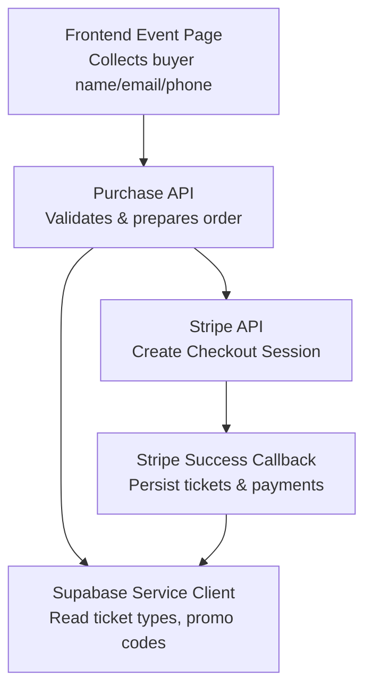
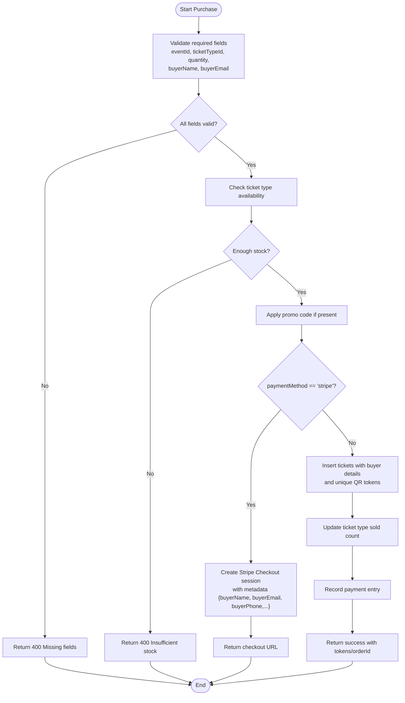
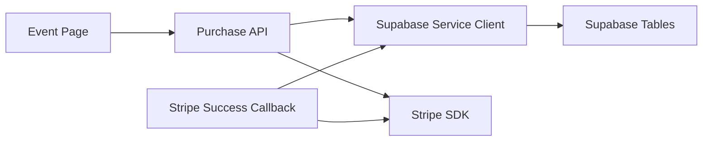

# Customer Data Management

<cite>
**Referenced Files in This Document**
- [pages/events/[slug].js](file://pages/events/[slug].js)
- [pages/api/tickets/purchase.js](file://pages/api/tickets/purchase.js)
- [pages/api/tickets/stripe-success.js](file://pages/api/tickets/stripe-success.js)
- [lib/supabase.js](file://lib/supabase.js)
- [supabase/schema.sql](file://supabase/schema.sql)
</cite>

## Table of Contents
1. [Introduction](#introduction)
2. [Project Structure](#project-structure)
3. [Core Components](#core-components)
4. [Architecture Overview](#architecture-overview)
5. [Detailed Component Analysis](#detailed-component-analysis)
6. [Dependency Analysis](#dependency-analysis)
7. [Performance Considerations](#performance-considerations)
8. [Troubleshooting Guide](#troubleshooting-guide)
9. [Conclusion](#conclusion)

## Introduction
This document explains how customer information is collected, validated, and processed during the checkout flow. It covers buyer details (name, email, phone), data sanitization practices, email format validation, phone number handling, secure transmission to payment processors, embedding customer data in Stripe session metadata, and persistence in the database. It also outlines security considerations for PII protection, GDPR compliance, and data retention policies, with examples of proper formatting and error handling for invalid inputs.

## Project Structure
The checkout flow spans a Next.js frontend page and serverless API routes:
- Frontend event page collects buyer details and orchestrates the purchase flow.
- Server-side API validates inputs, interacts with Supabase, and creates Stripe Checkout sessions when applicable.
- A success callback persists tickets and payments after Stripe confirms payment.



**Diagram sources**
- [pages/events/[slug].js](file://pages/events/[slug].js)
- [pages/api/tickets/purchase.js](file://pages/api/tickets/purchase.js)
- [pages/api/tickets/stripe-success.js](file://pages/api/tickets/stripe-success.js)
- [lib/supabase.js](file://lib/supabase.js)

**Section sources**
- [pages/events/[slug].js](file://pages/events/[slug].js)
- [pages/api/tickets/purchase.js](file://pages/api/tickets/purchase.js)
- [pages/api/tickets/stripe-success.js](file://pages/api/tickets/stripe-success.js)
- [lib/supabase.js](file://lib/supabase.js)

## Core Components
- Buyer details collection UI: The event page includes fields for full name, email, and phone, plus optional attendee details when quantity > 1.
- Purchase API: Validates required fields, checks ticket availability, applies promo discounts, and either creates a Stripe Checkout session or directly issues tickets for non-Stripe methods.
- Stripe success handler: Retrieves the session, verifies payment status, reads metadata, and persists tickets and payments.
- Database schema: Defines tables for tickets and payments, including buyer_name, buyer_email, buyer_phone, and QR token.

Key responsibilities:
- Input validation on both client and server sides.
- Secure transmission via HTTPS to Stripe and Supabase service client.
- Embedding minimal necessary PII into Stripe metadata.
- Persisting only required fields to the database.

**Section sources**
- [pages/events/[slug].js](file://pages/events/[slug].js)
- [pages/api/tickets/purchase.js](file://pages/api/tickets/purchase.js)
- [pages/api/tickets/stripe-success.js](file://pages/api/tickets/stripe-success.js)
- [supabase/schema.sql](file://supabase/schema.sql)

## Architecture Overview
The end-to-end flow for Stripe-based purchases:

```mermaid
sequenceDiagram
participant User as "User"
participant FE as "Event Page (Frontend)"
participant API as "Purchase API"
participant DB as "Supabase"
participant S as "Stripe"
participant CB as "Stripe Success Callback"
User->>FE : Enter name, email, phone; select tickets
FE->>API : POST /api/tickets/purchase {eventId, ticketTypeId, quantity,<br/>buyerName, buyerEmail, buyerPhone, paymentMethod}
API->>DB : Validate ticket type & availability
API->>S : Create Checkout session with metadata {buyerName, buyerEmail, buyerPhone,...}
S-->>API : Return checkout URL
API-->>FE : Redirect to Stripe Checkout
User->>S : Complete payment
S->>CB : Redirect with session_id
CB->>S : Retrieve session
CB->>DB : Insert tickets using metadata
CB->>DB : Record payment
CB-->>User : Redirect to ticket view
```

**Diagram sources**
- [pages/events/[slug].js](file://pages/events/[slug].js)
- [pages/api/tickets/purchase.js](file://pages/api/tickets/purchase.js)
- [pages/api/tickets/stripe-success.js](file://pages/api/tickets/stripe-success.js)
- [lib/supabase.js](file://lib/supabase.js)

## Detailed Component Analysis

### Frontend: Buyer Details Collection and Validation
- Fields: Full Name (required), Email (required), Phone (optional but recommended).
- Attendee passes: When quantity > 1, additional attendee name/email can be entered. These are not persisted in the current backend logic; only buyer details are used for ticket creation.
- Payment method selection: Card (Stripe) or EcoCash. For Stripe, simulated card input is validated (length/format hints). For EcoCash, number must start with “07”.
- Minimal client-side validation: Required fields enforced before proceeding to payment. No strict email regex or phone normalization here; server enforces critical validations.

Data sent to the purchase API:
- eventId, ticketTypeId, quantity
- buyerName, buyerEmail, buyerPhone
- paymentMethod, promoCode (if applied)

Error handling:
- If required fields are missing, user sees an inline error message and cannot proceed.
- Invalid payment inputs trigger specific messages (e.g., card length, EcoCash prefix).

Security notes:
- No sensitive payment data is stored in the app state beyond temporary simulation fields.
- All requests are made over HTTPS to server endpoints.

**Section sources**
- [pages/events/[slug].js](file://pages/events/[slug].js)

### Backend: Purchase API
Responsibilities:
- Validate required fields: eventId, ticketTypeId, quantity, buyerName, buyerEmail.
- Verify ticket type exists and has sufficient remaining stock.
- Apply promo code if provided, updating usage counters atomically.
- For Stripe:
  - Generate per-ticket tokens.
  - Create a Stripe Checkout session with metadata containing eventId, ticketTypeId, quantity, buyerName, buyerEmail, buyerPhone, tokens, discount.
  - Set customer_email to buyerEmail for Stripe’s receipt and confirmation emails.
- For other payment methods:
  - Immediately create tickets in the database with buyer details and unique QR tokens.
  - Update ticket type sold counts.
  - Record a payment entry with appropriate status.

Data sanitization and validation:
- Required field presence checked; missing fields return 400 errors.
- buyerPhone is allowed to be empty; normalized to null when inserting into the database.
- Promo code is uppercased and trimmed before lookup.

Security considerations:
- Uses Supabase service role client for privileged operations.
- Avoids storing unnecessary PII in logs; errors are generic to avoid leaking sensitive info.
- Ensures minimum PII is embedded in Stripe metadata (only what is needed for ticket issuance).

Error handling:
- Returns descriptive JSON errors for missing fields, insufficient stock, and failures to insert tickets.
- Catches unexpected exceptions and returns a safe 500 response.

**Section sources**
- [pages/api/tickets/purchase.js](file://pages/api/tickets/purchase.js)

### Stripe Success Callback
Responsibilities:
- Retrieve the Stripe session by session_id.
- Confirm payment_status is paid; otherwise redirect with an error.
- Read metadata from the session to reconstruct ticket inserts and compute final price using ticket type and discount.
- Insert tickets into the database with buyer details and QR tokens.
- Update ticket type sold count.
- Record a completed payment with transaction reference from Stripe.
- Redirect to the first ticket view.

Data handling:
- Metadata fields: eventId, ticketTypeId, quantity, buyerName, buyerEmail, buyerPhone, tokens, discount.
- buyerPhone may be empty; inserted as null.

Error handling:
- Redirects to root with error query parameters for invalid events or processing failures.
- Logs errors for debugging while avoiding exposing sensitive details to users.

**Section sources**
- [pages/api/tickets/stripe-success.js](file://pages/api/tickets/stripe-success.js)

### Database Schema and Storage
Tables relevant to customer data:
- tickets: Stores buyer_name, buyer_email, buyer_phone, qr_code_token, status, timestamps.
- payments: Records amount, currency, payment_method, transaction_ref, status, paid_at.
- ticket_types: Tracks quantity_available and quantity_sold.

Indexes:
- Optimized lookups on qr_code_token, buyer_email, event_id, and ticket_id.

Row-level security:
- RLS enabled across tables; service role client used by API routes.

Data retention implications:
- Tickets and payments persist indefinitely unless explicitly deleted or updated.
- buyer_email and buyer_phone are retained as part of ticket records.

**Section sources**
- [supabase/schema.sql](file://supabase/schema.sql)

### Data Flow Diagrams

#### Class-like relationships among components
```mermaid
classDiagram
class EventPage {
+state buyerForm { name, email, phone }
+handlePurchase()
}
class PurchaseAPI {
+validateInputs()
+checkAvailability()
+applyPromo()
+createStripeSession()
+issueTicketsDirectly()
}
class StripeSuccessCallback {
+retrieveSession()
+persistTickets()
+recordPayment()
}
class SupabaseServiceClient {
+readTicketTypes()
+insertTickets()
+updateSoldCounts()
+insertPayments()
}
EventPage --> PurchaseAPI : "POST purchase request"
PurchaseAPI --> SupabaseServiceClient : "reads/writes"
PurchaseAPI --> StripeSuccessCallback : "metadata-driven persistence"
StripeSuccessCallback --> SupabaseServiceClient : "writes tickets/payments"
```

**Diagram sources**
- [pages/events/[slug].js](file://pages/events/[slug].js)
- [pages/api/tickets/purchase.js](file://pages/api/tickets/purchase.js)
- [pages/api/tickets/stripe-success.js](file://pages/api/tickets/stripe-success.js)
- [lib/supabase.js](file://lib/supabase.js)

#### Algorithm flow for purchase validation and ticket issuance


**Diagram sources**
- [pages/api/tickets/purchase.js](file://pages/api/tickets/purchase.js)

## Dependency Analysis
- Frontend depends on Next.js routing and React state management for form handling.
- Purchase API depends on Supabase service client for privileged DB access and Stripe SDK for checkout sessions.
- Stripe success callback depends on Stripe SDK to retrieve session and Supabase service client to persist data.
- Database schema defines constraints and indexes that influence performance and integrity.



**Diagram sources**
- [pages/events/[slug].js](file://pages/events/[slug].js)
- [pages/api/tickets/purchase.js](file://pages/api/tickets/purchase.js)
- [pages/api/tickets/stripe-success.js](file://pages/api/tickets/stripe-success.js)
- [lib/supabase.js](file://lib/supabase.js)
- [supabase/schema.sql](file://supabase/schema.sql)

**Section sources**
- [lib/supabase.js](file://lib/supabase.js)
- [supabase/schema.sql](file://supabase/schema.sql)

## Performance Considerations
- Use Supabase indexes on frequently queried columns (qr_code_token, buyer_email, event_id) to speed up lookups and scans.
- Minimize metadata size in Stripe sessions to reduce payload overhead; only include necessary fields for ticket issuance.
- Batch inserts where possible (already implemented for multiple tickets).
- Avoid heavy computations in hot paths; promo validation is lightweight.

[No sources needed since this section provides general guidance]

## Troubleshooting Guide
Common issues and resolutions:
- Missing required fields: Ensure buyerName and buyerEmail are provided; the API returns a 400 error if absent.
- Insufficient stock: Verify ticket type availability; the API returns a 400 error indicating remaining quantity.
- Stripe payment not confirmed: The success callback redirects with an error if payment_status is not paid; verify Stripe dashboard and webhook/session states.
- Invalid promo code: The promo validation endpoint returns a clear error; ensure code is active, within usage limits, and not expired.
- Database insertion failures: Check Supabase logs and service key configuration; ensure RLS policies allow service role writes.

Security and privacy tips:
- Do not log sensitive PII; use generic error messages in responses.
- Ensure environment variables for Stripe secret key and Supabase service key are securely managed.
- Enforce HTTPS everywhere; avoid storing raw payment details in application state.

**Section sources**
- [pages/api/tickets/purchase.js](file://pages/api/tickets/purchase.js)
- [pages/api/tickets/stripe-success.js](file://pages/api/tickets/stripe-success.js)
- [pages/api/promo/validate.js](file://pages/api/promo/validate.js)

## Conclusion
The checkout flow collects buyer details on the frontend, validates them on the server, and securely transmits minimal PII to Stripe via session metadata. After payment confirmation, tickets and payments are persisted in the database with appropriate indexes and constraints. Security measures include using service role clients, avoiding sensitive logging, and leveraging HTTPS. To enhance compliance and data protection, consider adding explicit email format validation, phone normalization, encryption at rest for PII, and defined data retention policies aligned with GDPR requirements.

[No sources needed since this section summarizes without analyzing specific files]