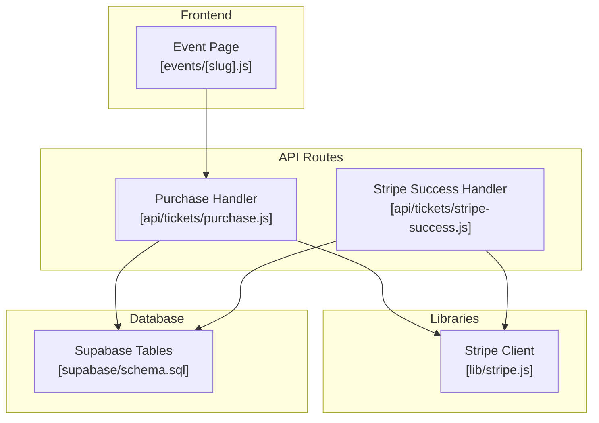
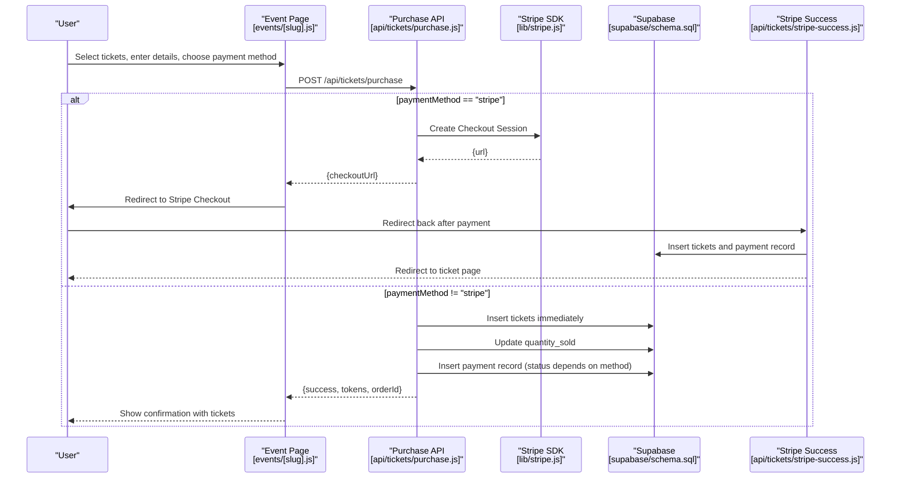
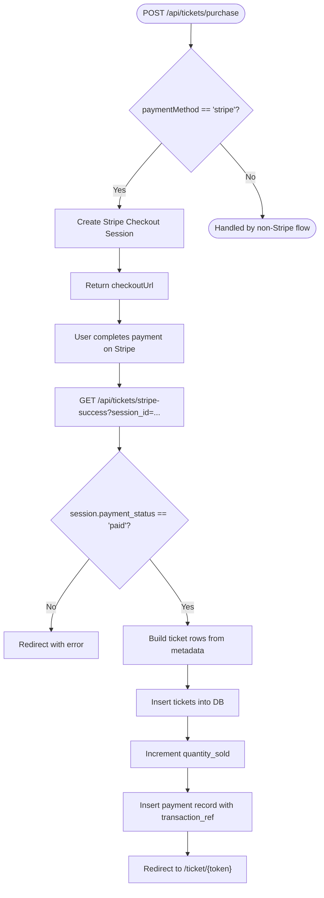
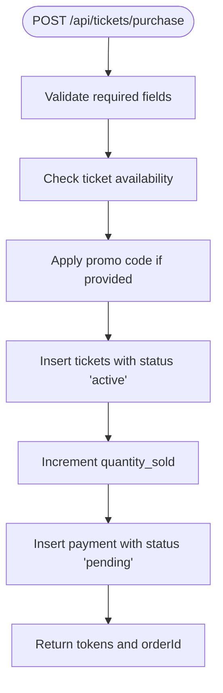
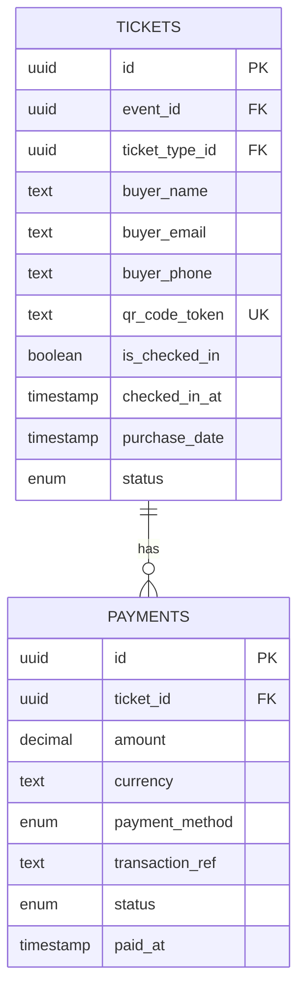
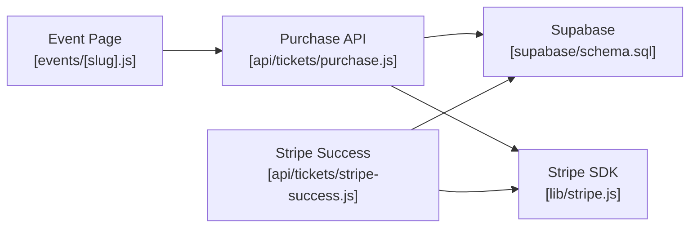

# Payment Method Integration

<cite>
**Referenced Files in This Document**
- [purchase.js](file://pages/api/tickets/purchase.js)
- [stripe-success.js](file://pages/api/tickets/stripe-success.js)
- [stripe.js](file://lib/stripe.js)
- [schema.sql](file://supabase/schema.sql)
- [events/[slug].js](file://pages/events/[slug].js)
- [package.json](file://package.json)
</cite>

## Table of Contents
1. [Introduction](#introduction)
2. [Project Structure](#project-structure)
3. [Core Components](#core-components)
4. [Architecture Overview](#architecture-overview)
5. [Detailed Component Analysis](#detailed-component-analysis)
6. [Dependency Analysis](#dependency-analysis)
7. [Performance Considerations](#performance-considerations)
8. [Troubleshooting Guide](#troubleshooting-guide)
9. [Conclusion](#conclusion)
10. [Appendices](#appendices)

## Introduction
This document explains how the TicketFlow system supports multiple payment methods: Stripe card payments, EcoCash mobile money, and PayPal. It details routing logic for each method, immediate ticket creation for non-Stripe methods versus deferred processing for Stripe checkouts, transaction state management, error handling, and guidance for adding new providers.

## Project Structure
The payment flow spans a Next.js frontend page that collects buyer details and payment method selection, serverless API routes that validate inputs and orchestrate payments, and a Supabase database schema defining tickets, payments, and related entities.

**Diagram sources**
- [events/[slug].js](file://pages/events/[slug].js)
- [purchase.js](file://pages/api/tickets/purchase.js)
- [stripe-success.js](file://pages/api/tickets/stripe-success.js)
- [stripe.js](file://lib/stripe.js)
- [schema.sql](file://supabase/schema.sql)

**Section sources**
- [events/[slug].js](file://pages/events/[slug].js)
- [purchase.js](file://pages/api/tickets/purchase.js)
- [stripe-success.js](file://pages/api/tickets/stripe-success.js)
- [stripe.js](file://lib/stripe.js)
- [schema.sql](file://supabase/schema.sql)

## Core Components
- Event purchase form: Collects buyer info, selects payment method (Stripe, EcoCash, PayPal), validates inputs, and calls the purchase API.
- Purchase API route: Validates request, checks availability, applies promo codes, and branches by payment method.
- Stripe success handler: Verifies payment status via Stripe, creates tickets, records payment, and redirects to the ticket page.
- Database schema: Defines tickets, payments, and constraints for payment_method and status values.

Key responsibilities:
- Routing: Branch on paymentMethod to choose Stripe checkout vs immediate ticket creation.
- State transitions: Set payment status based on method and outcome; track ticket lifecycle.
- Validation: Enforce required fields and method-specific input rules.

**Section sources**
- [events/[slug].js](file://pages/events/[slug].js)
- [purchase.js](file://pages/api/tickets/purchase.js)
- [stripe-success.js](file://pages/api/tickets/stripe-success.js)
- [schema.sql](file://supabase/schema.sql)

## Architecture Overview
The system uses two primary flows:
- Stripe: Deferred processing via Checkout session; tickets created after successful payment confirmation.
- Non-Stripe (EcoCash, PayPal): Immediate ticket creation with payment status set according to method behavior.

**Diagram sources**
- [events/[slug].js](file://pages/events/[slug].js)
- [purchase.js](file://pages/api/tickets/purchase.js)
- [stripe-success.js](file://pages/api/tickets/stripe-success.js)
- [stripe.js](file://lib/stripe.js)
- [schema.sql](file://supabase/schema.sql)

## Detailed Component Analysis

### Stripe Card Payments (Deferred Processing)
- Creation: The purchase route builds a Stripe Checkout session with line items, metadata (event, ticket type, quantities, buyer info, discount), and success/cancel URLs.
- Confirmation: The success handler retrieves the session, verifies paid status, computes final price using metadata and ticket type, inserts tickets, updates sold counts, records payment with transaction reference, and redirects to the first ticket.

**Diagram sources**
- [purchase.js](file://pages/api/tickets/purchase.js)
- [stripe-success.js](file://pages/api/tickets/stripe-success.js)

**Section sources**
- [purchase.js](file://pages/api/tickets/purchase.js)
- [stripe-success.js](file://pages/api/tickets/stripe-success.js)

### EcoCash Mobile Money (Immediate Processing)
- Flow: After validation, the purchase route creates tickets immediately and records a payment with status pending (as implemented).
- Rationale: Pending reflects asynchronous confirmation typical of mobile money workflows where external callbacks may update status later.

**Diagram sources**
- [purchase.js](file://pages/api/tickets/purchase.js)
- [schema.sql](file://supabase/schema.sql)

**Section sources**
- [purchase.js](file://pages/api/tickets/purchase.js)
- [schema.sql](file://supabase/schema.sql)

### PayPal Integration Pattern
- Current implementation: The UI exposes PayPal as an option, but the purchase route treats it like other non-Stripe methods (immediate ticket creation). In production, integrate with PayPal’s API to verify payment before or after ticket issuance depending on your risk model.
- Recommendation: Use PayPal’s capture/authorization flow to ensure payment completion prior to issuing tickets, or mark payments as pending until webhook confirms.

**Section sources**
- [events/[slug].js](file://pages/events/[slug].js)
- [purchase.js](file://pages/api/tickets/purchase.js)

### Transaction States and Data Model
- Tickets: Statuses include active, used, cancelled, refunded.
- Payments: Statuses include pending, completed, failed, refunded; payment_method includes ecocash, visa, mastercard, stripe, paypal.
- Consistency: For Stripe, payment is recorded as completed upon successful redirect; for EcoCash, recorded as pending initially; for PayPal, follow provider confirmation to transition to completed.

**Diagram sources**
- [schema.sql](file://supabase/schema.sql)

**Section sources**
- [schema.sql](file://supabase/schema.sql)

## Dependency Analysis
- Frontend depends on Next.js pages and React components to collect data and render payment forms.
- API routes depend on Supabase client for DB operations and Stripe SDK for checkout sessions.
- Stripe client module centralizes configuration and versioning.

**Diagram sources**
- [events/[slug].js](file://pages/events/[slug].js)
- [purchase.js](file://pages/api/tickets/purchase.js)
- [stripe-success.js](file://pages/api/tickets/stripe-success.js)
- [stripe.js](file://lib/stripe.js)
- [schema.sql](file://supabase/schema.sql)

**Section sources**
- [package.json](file://package.json)
- [stripe.js](file://lib/stripe.js)

## Performance Considerations
- Avoid synchronous blocking operations in API routes; use async/await consistently.
- Batch insert tickets when possible to reduce round-trips.
- Cache frequently accessed ticket type data in memory during a single request if needed.
- Ensure environment variables are loaded efficiently; avoid repeated initialization of clients within hot paths.

[No sources needed since this section provides general guidance]

## Troubleshooting Guide
Common issues and resolutions:
- Missing required fields: Ensure eventId, ticketTypeId, quantity, buyerName, buyerEmail are present.
- Insufficient availability: Check remaining tickets before purchase.
- Invalid promo code: Validate active and not expired codes; handle usage limits.
- Stripe errors: Verify session creation and payment status; handle failures gracefully with user-friendly messages.
- EcoCash/PayPal connectivity: Implement retries and timeouts; log gateway responses; surface actionable errors.
- Database errors: Wrap DB operations in try/catch; return consistent error responses.

Error handling patterns observed:
- Input validation returns 400 with descriptive errors.
- Network or DB exceptions return 500 with generic messages while logging details.
- Stripe success handler redirects with error query parameters when verification fails.

**Section sources**
- [purchase.js](file://pages/api/tickets/purchase.js)
- [stripe-success.js](file://pages/api/tickets/stripe-success.js)

## Conclusion
The system implements a robust multi-payment architecture: Stripe uses deferred processing via Checkout for secure card payments, while EcoCash and PayPal currently create tickets immediately with appropriate status handling. Clear separation of concerns between frontend validation, API routing, and database persistence ensures maintainability. Extending to additional providers follows the established branching pattern and state management conventions.

[No sources needed since this section summarizes without analyzing specific files]

## Appendices

### Adding a New Payment Provider
Steps to add a new provider (e.g., “mobile_money”):
- Define provider identifier and any required fields in the UI.
- Extend validation in the purchase route for the new method.
- Decide on immediate vs deferred processing:
  - Immediate: Create tickets and set payment status to pending or completed based on provider guarantees.
  - Deferred: Create a checkout-like session and confirm via webhook/callback before issuing tickets.
- Record payment with appropriate status and transaction reference.
- Handle provider-specific errors and timeouts; implement retries where applicable.
- Update database constraints if necessary (ensure enum allows new method).

Implementation examples:
- Payment method validation: Add conditional checks similar to existing ones for Stripe and EcoCash.
- Payment status transitions: Map provider outcomes to statuses (pending, completed, failed, refunded).
- Error handling: Log detailed errors, return user-facing messages, and ensure idempotency for retries.

**Section sources**
- [purchase.js](file://pages/api/tickets/purchase.js)
- [schema.sql](file://supabase/schema.sql)

### Payment Method Validation Examples
- Stripe: Validate card number length and format in the UI before initiating checkout.
- EcoCash: Ensure phone number starts with expected prefix and contains digits only.
- PayPal: Validate email format and account readiness; integrate provider SDK for tokenization if needed.

**Section sources**
- [events/[slug].js](file://pages/events/[slug].js)

### Managing Payment Status Transitions
- Pending: Used for methods requiring external confirmation (e.g., EcoCash).
- Completed: Finalized payments (e.g., Stripe success confirmed).
- Failed: Gateway declines or timeouts; allow retry or fallback.
- Refunded: Post-sale adjustments; ensure tickets are marked accordingly.

**Section sources**
- [schema.sql](file://supabase/schema.sql)
- [purchase.js](file://pages/api/tickets/purchase.js)
- [stripe-success.js](file://pages/api/tickets/stripe-success.js)