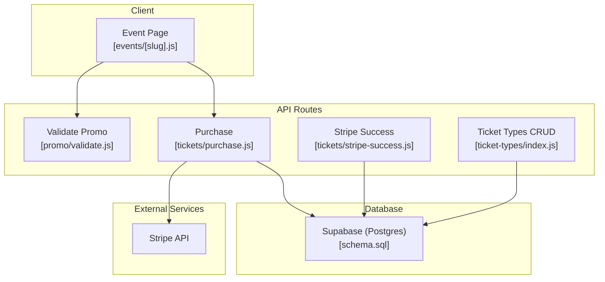
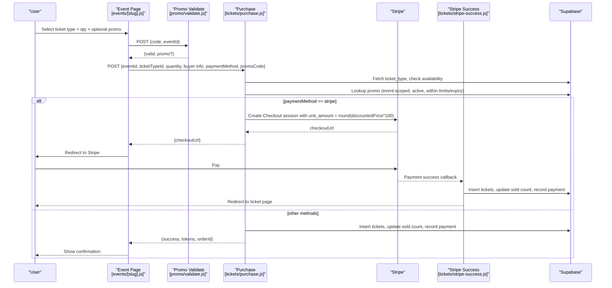
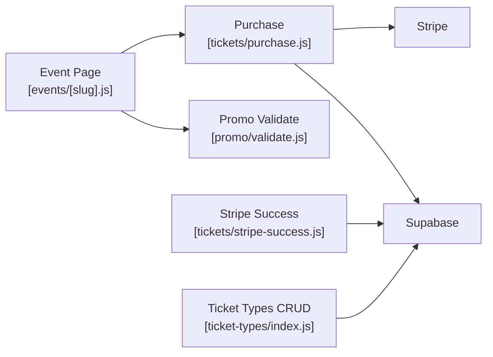
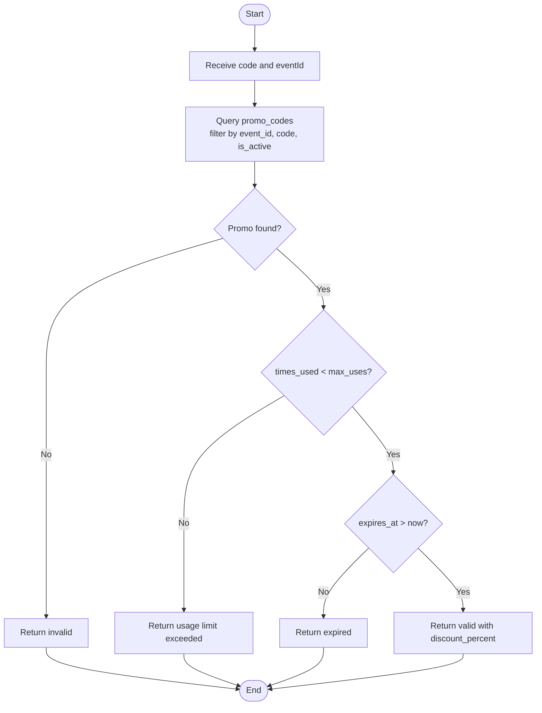
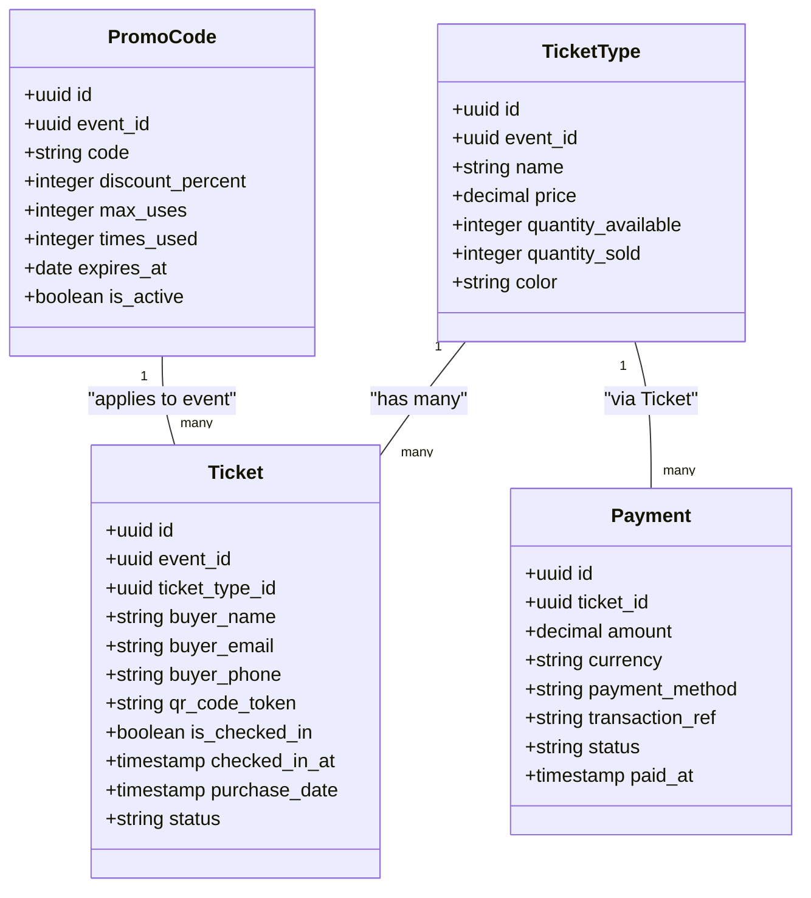

# Pricing & Discount Calculation

<cite>
**Referenced Files in This Document**
- [purchase.js](file://pages/api/tickets/purchase.js)
- [stripe-success.js](file://pages/api/tickets/stripe-success.js)
- [validate.js](file://pages/api/promo/validate.js)
- [index.js (ticket-types)](file://pages/api/ticket-types/index.js)
- [schema.sql](file://supabase/schema.sql)
- [events/[slug].js](file://pages/events/[slug].js)
- [stripe.js](file://lib/stripe.js)
</cite>

## Table of Contents
1. [Introduction](#introduction)
2. [Project Structure](#project-structure)
3. [Core Components](#core-components)
4. [Architecture Overview](#architecture-overview)
5. [Detailed Component Analysis](#detailed-component-analysis)
6. [Dependency Analysis](#dependency-analysis)
7. [Performance Considerations](#performance-considerations)
8. [Troubleshooting Guide](#troubleshooting-guide)
9. [Conclusion](#conclusion)
10. [Appendices](#appendices)

## Introduction
This document explains the pricing calculation engine and discount application system used by the TicketFlow platform. It covers how unit prices are retrieved from ticket types, how promo code discounts are applied using percentage-based calculations, and how final amounts are computed for both Stripe and non-Stripe payment flows. It also documents the discount validation process (expiration checks, usage limits, event-specific restrictions), currency handling, amount rounding for Stripe compatibility, and tax considerations. Examples illustrate bulk discounts, promotional campaigns, and dynamic pricing adjustments.

## Project Structure
The pricing and discount logic spans several API routes and a client-side page:
- Client-side price preview and promo validation trigger on the event page.
- Server-side purchase endpoint validates availability, applies promo codes, computes discounted unit price, and creates either a Stripe Checkout session or tickets directly.
- A separate Stripe success handler finalizes ticket creation and records payments after successful payment.
- A dedicated promo validation endpoint enforces rules before purchase.
- Ticket type management endpoints allow creating/updating ticket prices.
- Database schema defines all relevant tables and constraints.

**Diagram sources**
- [events/[slug].js](file://pages/events/[slug].js)
- [purchase.js](file://pages/api/tickets/purchase.js)
- [validate.js](file://pages/api/promo/validate.js)
- [stripe-success.js](file://pages/api/tickets/stripe-success.js)
- [index.js (ticket-types)](file://pages/api/ticket-types/index.js)
- [schema.sql](file://supabase/schema.sql)

**Section sources**
- [events/[slug].js](file://pages/events/[slug].js)
- [purchase.js](file://pages/api/tickets/purchase.js)
- [validate.js](file://pages/api/promo/validate.js)
- [stripe-success.js](file://pages/api/tickets/stripe-success.js)
- [index.js (ticket-types)](file://pages/api/ticket-types/index.js)
- [schema.sql](file://supabase/schema.sql)

## Core Components
- Event page calculates live totals, shows promo discount, and service fee to the user.
- Promo validation endpoint checks code existence, activity, usage limit, and expiration.
- Purchase endpoint retrieves ticket type, verifies availability, applies promo discount, rounds for Stripe, and persists tickets/payments.
- Stripe success endpoint confirms payment, creates tickets, updates sold counts, and records payment details.
- Ticket types endpoint manages base unit prices and availability.

Key responsibilities:
- Unit price retrieval: ticket_types.price
- Discount application: promo_codes.discount_percent
- Rounding: cents for Stripe; two-decimal formatting for UI
- Currency: USD throughout
- Availability: quantity_available vs quantity_sold

**Section sources**
- [events/[slug].js](file://pages/events/[slug].js)
- [validate.js](file://pages/api/promo/validate.js)
- [purchase.js](file://pages/api/tickets/purchase.js)
- [stripe-success.js](file://pages/api/tickets/stripe-success.js)
- [index.js (ticket-types)](file://pages/api/ticket-types/index.js)

## Architecture Overview
The flow begins with the user selecting a ticket type and optionally entering a promo code. The client validates the promo via an API route, then submits a purchase request. Depending on the payment method, the server either creates a Stripe Checkout session or immediately issues tickets and records payment. After Stripe payment completion, a webhook-like success handler finalizes data persistence.

**Diagram sources**
- [events/[slug].js](file://pages/events/[slug].js)
- [validate.js](file://pages/api/promo/validate.js)
- [purchase.js](file://pages/api/tickets/purchase.js)
- [stripe-success.js](file://pages/api/tickets/stripe-success.js)
- [schema.sql](file://supabase/schema.sql)

## Detailed Component Analysis

### Pricing Engine: Unit Price Retrieval and Base Totals
- Unit price is sourced from the selected ticket type’s price field.
- Base total equals unit price multiplied by quantity.
- The event page displays base total, discount amount, and service fee to the user.

Implementation highlights:
- Ticket type lookup ensures the selected ticket belongs to the event and exists.
- Remaining availability is validated against requested quantity.

**Section sources**
- [purchase.js](file://pages/api/tickets/purchase.js)
- [events/[slug].js](file://pages/events/[slug].js)

### Discount Application: Percentage-Based Promo Codes
- Promo codes apply a percentage discount to the base total.
- Validation includes:
  - Code must belong to the same event_id.
  - Code must be active.
  - Usage must not exceed max_uses (times_used < max_uses).
  - Expiration must not have passed (expires_at > now).
- On successful validation, the discount percent is applied to compute discounted unit price and total.

Validation flow:
- Client calls validate endpoint with code and eventId.
- Server queries promo_codes with filters and returns validity and discount percent if valid.

Usage tracking:
- During purchase, if a promo code is used, times_used is incremented atomically.

**Section sources**
- [validate.js](file://pages/api/promo/validate.js)
- [purchase.js](file://pages/api/tickets/purchase.js)

### Final Amount Computation
- Discounted unit price = unitPrice * (1 - discountPercent / 100).
- For Stripe:
  - unit_amount is set to Math.round(discountedPrice * 100) to ensure integer cents.
  - Quantity is multiplied at Stripe level.
- For non-Stripe:
  - Total recorded in payments = discountedPrice * quantity.
- Service fee:
  - The event page adds a fixed 5% platform fee to the displayed total for UX purposes.
  - The backend payment recording uses the discounted total without adding a platform fee in the payment record.

Rounding behavior:
- Stripe requires integer cents; use Math.round(value * 100).
- UI formatting uses two decimal places for display.

**Section sources**
- [purchase.js](file://pages/api/tickets/purchase.js)
- [stripe-success.js](file://pages/api/tickets/stripe-success.js)
- [events/[slug].js](file://pages/events/[slug].js)

### Currency Handling
- All monetary values are handled in USD.
- Stripe integration uses currency: 'usd' and integer unit_amount in cents.
- Payments table stores currency as text with default 'USD'.

Best practices:
- Always convert to cents before sending to Stripe.
- Keep stored amounts in smallest currency units where possible to avoid floating-point errors.

**Section sources**
- [purchase.js](file://pages/api/tickets/purchase.js)
- [schema.sql](file://supabase/schema.sql)

### Tax Calculation Considerations
- No explicit tax calculation is implemented in the current codebase.
- If taxes are required:
  - Add a tax rate configuration per event or region.
  - Compute tax on discounted subtotal or per line item depending on policy.
  - Ensure tax is included in Stripe line items or calculated server-side and recorded separately.
  - Update payment records to reflect gross, discount, tax, and net amounts.

Recommendation:
- Introduce a tax field in ticket_types or events and apply it consistently across purchase and success handlers.

[No sources needed since this section provides general guidance]

### Stripe Integration and Amount Rounding
- Stripe Checkout session creation sets:
  - currency: 'usd'
  - unit_amount: Math.round(discountedPrice * 100)
  - quantity: number of tickets
- After successful payment, stripe-success handler:
  - Retrieves metadata (eventId, ticketTypeId, quantity, buyer info, tokens, discount).
  - Recalculates unit price using stored discount percent to ensure consistency.
  - Inserts tickets, updates sold counts, and records payment with transaction reference.

Important notes:
- Always recompute unit price on the server after payment to prevent client tampering.
- Use metadata to pass necessary context securely between steps.

**Section sources**
- [purchase.js](file://pages/api/tickets/purchase.js)
- [stripe-success.js](file://pages/api/tickets/stripe-success.js)

### Ticket Type Management
- Admin endpoints allow creating, updating, and deleting ticket types.
- Required fields include event_id, name, price, and quantity_available.
- Prices are stored as decimals to support precise currency values.

Operational implications:
- Changes to ticket type prices affect future purchases but do not retroactively alter existing orders.
- Availability is tracked via quantity_available and quantity_sold.

**Section sources**
- [index.js (ticket-types)](file://pages/api/ticket-types/index.js)
- [schema.sql](file://supabase/schema.sql)

### Data Model and Constraints
- ticket_types: id, event_id, name, price (decimal), quantity_available, quantity_sold, color.
- promo_codes: id, event_id, code, discount_percent (1–100), max_uses, times_used, expires_at, is_active, unique(event_id, code).
- tickets: id, event_id, ticket_type_id, buyer info, qr_code_token, status, timestamps.
- payments: id, ticket_id, amount (decimal), currency, payment_method, transaction_ref, status, paid_at.

Constraints and indexes:
- Unique constraint on promo_codes(event_id, code).
- Indexes on frequently queried columns like qr_code_token, buyer_email, event_id.

**Section sources**
- [schema.sql](file://supabase/schema.sql)

## Dependency Analysis
The pricing and discount system depends on:
- Supabase for persistent storage and row-level security policies.
- Stripe for secure payment processing and checkout sessions.
- Client-side event page for user interactions and real-time price previews.

**Diagram sources**
- [events/[slug].js](file://pages/events/[slug].js)
- [validate.js](file://pages/api/promo/validate.js)
- [purchase.js](file://pages/api/tickets/purchase.js)
- [stripe-success.js](file://pages/api/tickets/stripe-success.js)
- [index.js (ticket-types)](file://pages/api/ticket-types/index.js)
- [schema.sql](file://supabase/schema.sql)

**Section sources**
- [events/[slug].js](file://pages/events/[slug].js)
- [validate.js](file://pages/api/promo/validate.js)
- [purchase.js](file://pages/api/tickets/purchase.js)
- [stripe-success.js](file://pages/api/tickets/stripe-success.js)
- [index.js (ticket-types)](file://pages/api/ticket-types/index.js)
- [schema.sql](file://supabase/schema.sql)

## Performance Considerations
- Database queries:
  - Ensure indexes exist on event_id, qr_code_token, buyer_email, and ticket_type_id for fast lookups.
- Concurrency:
  - When multiple users purchase the same limited tickets, consider database transactions or row-level locks to prevent overselling.
- Stripe latency:
  - Minimize server work before creating the Checkout session; defer heavy operations until after payment success.
- Caching:
  - Cache static event and ticket type data on the client side to reduce repeated fetches.

[No sources needed since this section provides general guidance]

## Troubleshooting Guide
Common issues and resolutions:
- Invalid or expired promo code:
  - Verify code matches event_id, is active, has remaining uses, and is not expired.
  - Check validate endpoint responses for specific error messages.
- Insufficient availability:
  - Ensure quantity does not exceed remaining tickets (quantity_available - quantity_sold).
- Stripe amount mismatch:
  - Confirm unit_amount is rounded to integer cents and matches the discounted price.
  - Recheck discount percent used in both purchase and success handlers.
- Payment record inconsistencies:
  - Ensure payments.amount reflects the actual charged amount and currency is consistent.

**Section sources**
- [validate.js](file://pages/api/promo/validate.js)
- [purchase.js](file://pages/api/tickets/purchase.js)
- [stripe-success.js](file://pages/api/tickets/stripe-success.js)

## Conclusion
The TicketFlow pricing and discount system integrates client-side previews with robust server-side validation and payment processing. Percentage-based promo codes are enforced with event scoping, usage limits, and expiration checks. Currency handling adheres to Stripe requirements by converting to cents, while the UI presents clear breakdowns including base totals, discounts, and platform fees. Future enhancements can introduce tax calculations and more granular fee structures while maintaining consistency across payment flows.

[No sources needed since this section summarizes without analyzing specific files]

## Appendices

### Example Scenarios

- Bulk discounts:
  - User selects 10 General Admission tickets at $15 each.
  - Base total = $150.
  - Apply 10% promo code: discount = $15.
  - Discounted total = $135.
  - Stripe unit_amount = round($13.50 * 100) = 1350 cents per ticket.

- Promotional campaign:
  - Event-specific promo code “SUMMER25” gives 25% off VIP Pass ($50).
  - Discounted unit price = $37.50.
  - For 2 tickets: total = $75.
  - Platform fee (UI only) = 5% of base total ($100) = $5.
  - Displayed total = $75 + $5 = $80.

- Dynamic pricing adjustments:
  - Increase ticket type price from $15 to $18.
  - New purchases reflect updated price; past orders remain unchanged.
  - Availability updates automatically based on sales.

[No sources needed since this section provides conceptual examples]

### Algorithm Flowchart: Discount Validation and Application

**Diagram sources**
- [validate.js](file://pages/api/promo/validate.js)

### Class Diagram: Core Entities

**Diagram sources**
- [schema.sql](file://supabase/schema.sql)