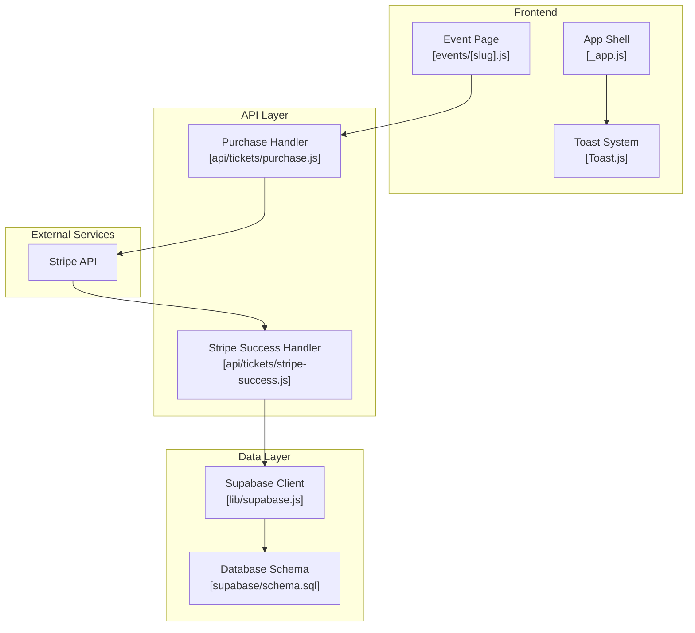
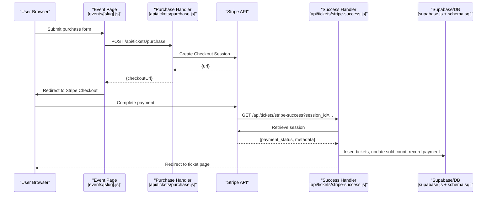
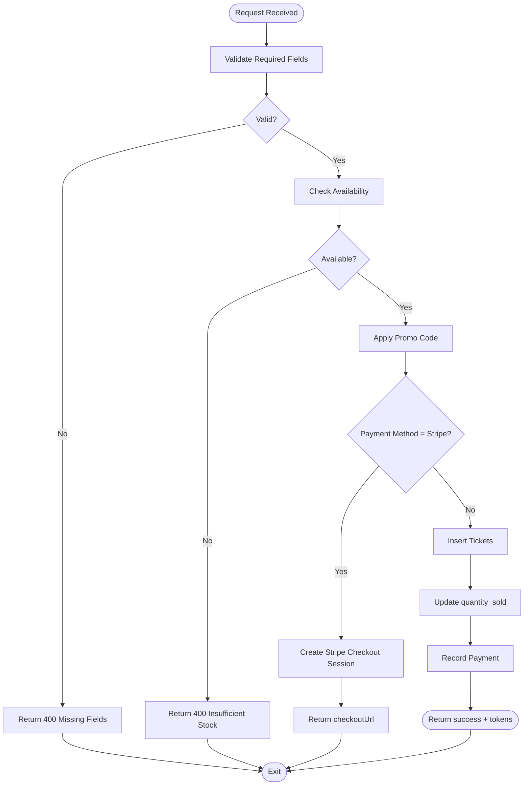
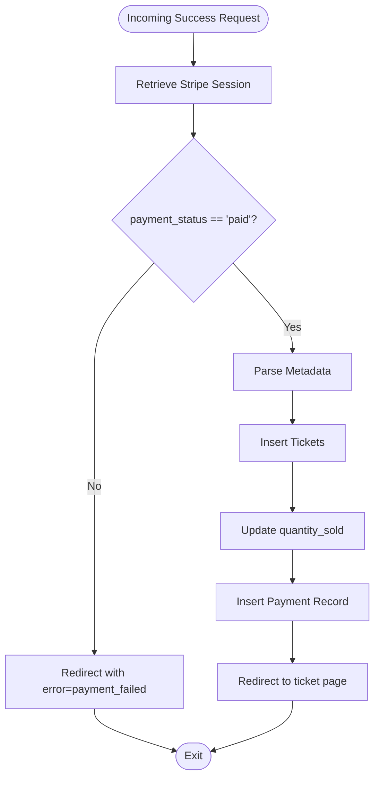
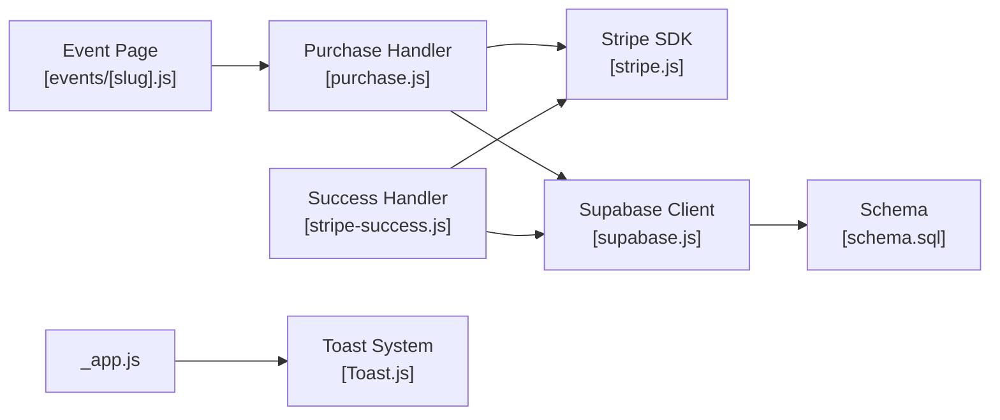

# Error Handling & Transaction Management

<cite>
**Referenced Files in This Document**
- [purchase.js](file://pages/api/tickets/purchase.js)
- [stripe-success.js](file://pages/api/tickets/stripe-success.js)
- [stripe.js](file://lib/stripe.js)
- [supabase.js](file://lib/supabase.js)
- [schema.sql](file://supabase/schema.sql)
- [_app.js](file://pages/_app.js)
- [Toast.js](file://components/ui/Toast.js)
- [events/[slug].js](file://pages/events/[slug].js)
</cite>

## Table of Contents
1. [Introduction](#introduction)
2. [Project Structure](#project-structure)
3. [Core Components](#core-components)
4. [Architecture Overview](#architecture-overview)
5. [Detailed Component Analysis](#detailed-component-analysis)
6. [Dependency Analysis](#dependency-analysis)
7. [Performance Considerations](#performance-considerations)
8. [Troubleshooting Guide](#troubleshooting-guide)
9. [Conclusion](#conclusion)

## Introduction
This document explains error handling and transaction management for payment flows in the TicketFlow application, focusing on Stripe Checkout integration, database consistency, and user-facing error messaging. It covers common Stripe errors (e.g., insufficient funds, card declines, rate limiting), network timeouts, partial failure handling, rollback strategies, data consistency maintenance, debugging techniques, error tracking, and UX considerations for payment failures.

## Project Structure
The payment flow spans a Next.js API route that creates a Stripe Checkout session, a success callback that persists tickets and payments, and UI components that surface errors to users via toasts and inline messages.

**Diagram sources**
- [events/[slug].js](file://pages/events/[slug].js)
- [purchase.js](file://pages/api/tickets/purchase.js)
- [stripe-success.js](file://pages/api/tickets/stripe-success.js)
- [supabase.js](file://lib/supabase.js)
- [schema.sql](file://supabase/schema.sql)
- [_app.js](file://pages/_app.js)
- [Toast.js](file://components/ui/Toast.js)

**Section sources**
- [purchase.js:1-123](file://pages/api/tickets/purchase.js#L1-L123)
- [stripe-success.js:1-55](file://pages/api/tickets/stripe-success.js#L1-L55)
- [supabase.js:1-23](file://lib/supabase.js#L1-L23)
- [schema.sql:1-166](file://supabase/schema.sql#L1-L166)
- [_app.js:1-14](file://pages/_app.js#L1-L14)
- [Toast.js:1-84](file://components/ui/Toast.js#L1-L84)
- [events/[slug].js:185-238](file://pages/events/[slug].js#L185-L238)

## Core Components
- Purchase API handler: Validates inputs, checks ticket availability, applies promo codes, and either creates a Stripe Checkout session or immediately issues tickets for non-Stripe methods.
- Stripe success handler: Verifies payment status, persists tickets, updates sold counts, records payments, and redirects to the ticket page.
- Supabase client: Provides service-role client for server-side writes with environment configuration.
- Stripe client initialization: Centralized Stripe SDK setup with API versioning.
- UI error presentation: Toast system and inline error states for user feedback.

Key responsibilities:
- Input validation and business rule enforcement (availability, promo code validity).
- External payment orchestration (Stripe Checkout).
- Idempotent persistence of tickets and payments.
- Consistent error responses and logging.

**Section sources**
- [purchase.js:1-123](file://pages/api/tickets/purchase.js#L1-L123)
- [stripe-success.js:1-55](file://pages/api/tickets/stripe-success.js#L1-L55)
- [supabase.js:1-23](file://lib/supabase.js#L1-L23)
- [stripe.js:1-6](file://lib/stripe.js#L1-L6)
- [Toast.js:1-84](file://components/ui/Toast.js#L1-L84)
- [events/[slug].js:185-238](file://pages/events/[slug].js#L185-L238)

## Architecture Overview
The payment architecture uses Stripe Checkout to offload sensitive card processing. The purchase endpoint returns a checkout URL; after successful payment, Stripe redirects to the success endpoint which finalizes the transaction by persisting tickets and payments.

**Diagram sources**
- [events/[slug].js:185-238](file://pages/events/[slug].js#L185-L238)
- [purchase.js:46-76](file://pages/api/tickets/purchase.js#L46-L76)
- [stripe-success.js:7-49](file://pages/api/tickets/stripe-success.js#L7-L49)
- [supabase.js:15-23](file://lib/supabase.js#L15-L23)
- [schema.sql:89-102](file://supabase/schema.sql#L89-L102)

## Detailed Component Analysis

### Purchase API Handler
Responsibilities:
- Validate required fields and ticket availability.
- Apply promo codes safely and atomically increment usage.
- For Stripe: create a Checkout session with metadata carrying buyer info, tokens, and discount.
- For other methods: insert tickets, update sold counts, and record payments.
- Error handling: return appropriate HTTP statuses and JSON errors; log unexpected errors.

Transaction and consistency notes:
- Non-Stripe path performs multiple DB writes without explicit transactions; consider wrapping inserts and updates in a single transaction to ensure atomicity.
- Promo code usage is incremented independently; race conditions could lead to overuse under high concurrency.

Error handling patterns:
- Validation errors return 400 with descriptive messages.
- Not found returns 404.
- Database insertion failures return 500 with generic message and server logs.

**Diagram sources**
- [purchase.js:7-26](file://pages/api/tickets/purchase.js#L7-L26)
- [purchase.js:27-45](file://pages/api/tickets/purchase.js#L27-L45)
- [purchase.js:46-76](file://pages/api/tickets/purchase.js#L46-L76)
- [purchase.js:78-117](file://pages/api/tickets/purchase.js#L78-L117)

**Section sources**
- [purchase.js:1-123](file://pages/api/tickets/purchase.js#L1-L123)

### Stripe Success Handler
Responsibilities:
- Retrieve and verify the Checkout session.
- Ensure payment_status is paid before persisting anything.
- Parse metadata to create tickets, update sold counts, and record payments.
- Redirect to the first ticket page.

Consistency and idempotency:
- Uses session.payment_intent as transaction reference.
- No explicit idempotency guard; duplicate callbacks could re-insert tickets if not guarded. Consider using unique constraints or idempotency keys based on session_id or payment_intent.

Error handling:
- If payment is not paid or session invalid, redirect with error query parameters.
- On exceptions, log and redirect to a generic error state.

**Diagram sources**
- [stripe-success.js:7-49](file://pages/api/tickets/stripe-success.js#L7-L49)

**Section sources**
- [stripe-success.js:1-55](file://pages/api/tickets/stripe-success.js#L1-L55)

### Stripe Client Initialization
- Centralized Stripe SDK instance with API version pinning.
- In production, ensure STRIPE_SECRET_KEY is set securely; fallbacks are present for development.

Best practices:
- Use environment variables for secrets.
- Pin API versions to avoid breaking changes.

**Section sources**
- [stripe.js:1-6](file://lib/stripe.js#L1-L6)

### Supabase Client Configuration
- Service-role client used in API routes for privileged writes.
- Environment variables for URL and keys; warnings logged when missing.

Security note:
- Keep service role key server-side only; never expose to the browser.

**Section sources**
- [supabase.js:1-23](file://lib/supabase.js#L1-L23)

### Database Schema and Constraints
- Payments table includes amount, currency, method, transaction_ref, status, and paid_at.
- Tickets include qr_code_token as a unique identifier.
- Indexes support lookups by token, email, event_id, and payments by ticket_id.

Consistency recommendations:
- Enforce uniqueness on qr_code_token to prevent duplicates.
- Add unique constraint on payments.transaction_ref to prevent duplicate payment records.
- Consider adding a transaction boundary around multi-step writes in both handlers.

**Section sources**
- [schema.sql:89-102](file://supabase/schema.sql#L89-L102)
- [schema.sql:59-73](file://supabase/schema.sql#L59-L73)
- [schema.sql:147-154](file://supabase/schema.sql#L147-L154)

### Frontend Error Presentation
- Event page displays inline errors during purchase attempts and handles Stripe redirects.
- App shell wraps pages with ToastProvider for global notifications.
- Toast component supports success, error, warning, and info variants with auto-dismissal.

UX guidance:
- Show clear, actionable messages for validation errors (e.g., invalid card number).
- Provide retry options for transient network errors.
- Avoid exposing internal stack traces to users.

**Section sources**
- [events/[slug].js:185-238](file://pages/events/[slug].js#L185-L238)
- [_app.js:1-14](file://pages/_app.js#L1-L14)
- [Toast.js:1-84](file://components/ui/Toast.js#L1-L84)

## Dependency Analysis

**Diagram sources**
- [events/[slug].js:185-238](file://pages/events/[slug].js#L185-L238)
- [purchase.js:46-76](file://pages/api/tickets/purchase.js#L46-L76)
- [stripe-success.js:7-49](file://pages/api/tickets/stripe-success.js#L7-L49)
- [stripe.js:1-6](file://lib/stripe.js#L1-L6)
- [supabase.js:15-23](file://lib/supabase.js#L15-L23)
- [schema.sql:89-102](file://supabase/schema.sql#L89-L102)
- [_app.js:1-14](file://pages/_app.js#L1-L14)
- [Toast.js:1-84](file://components/ui/Toast.js#L1-L84)

**Section sources**
- [purchase.js:1-123](file://pages/api/tickets/purchase.js#L1-L123)
- [stripe-success.js:1-55](file://pages/api/tickets/stripe-success.js#L1-L55)
- [supabase.js:1-23](file://lib/supabase.js#L1-L23)
- [schema.sql:1-166](file://supabase/schema.sql#L1-L166)
- [_app.js:1-14](file://pages/_app.js#L1-L14)
- [Toast.js:1-84](file://components/ui/Toast.js#L1-L84)
- [events/[slug].js:185-238](file://pages/events/[slug].js#L185-L238)

## Performance Considerations
- Prefer Stripe Checkout to minimize PCI scope and reduce server load.
- Batch operations where possible (e.g., inserting multiple tickets in one call).
- Use indexes defined in the schema to optimize queries on frequently accessed fields.
- Avoid unnecessary retries on idempotent endpoints; rely on Stripe’s idempotency for webhook-driven flows.

[No sources needed since this section provides general guidance]

## Troubleshooting Guide

Common Stripe Errors and Handling Strategies
- Card Declined / Insufficient Funds
  - Symptom: User redirected back with payment not marked as paid.
  - Action: Redirect to a user-friendly error page; suggest trying another card or payment method.
  - Logging: Log session_id and error context without sensitive data.
- Network Timeouts
  - Symptom: Purchase request fails before returning checkoutUrl.
  - Action: Retry once with exponential backoff; inform the user to try again later.
  - Logging: Capture timeout details and request payload summary.
- Rate Limiting
  - Symptom: Stripe API returns 429 Too Many Requests.
  - Action: Implement retry with jitter and respect retry-after headers; throttle incoming requests at the API layer.
  - Logging: Track rate limit events and throttling decisions.

Partial Failure Handling and Rollbacks
- Non-Stripe Path
  - Current behavior: Multiple DB writes without an explicit transaction.
  - Recommendation: Wrap ticket creation, sold count update, and payment recording in a single transaction to ensure all-or-nothing semantics.
  - Rollback strategy: If any step fails, revert previous writes within the same transaction.
- Stripe Path
  - Reliance on Stripe Checkout ensures payment integrity; success handler should be idempotent.
  - Recommendation: Guard against duplicate processing using unique constraints on transaction_ref or session_id.

Data Consistency Maintenance
- Enforce unique constraints on qr_code_token and payments.transaction_ref.
- Use service-role client exclusively for server-side writes.
- Audit logs for critical operations (ticket issuance, payment recording).

Debugging Techniques
- Enable structured logging with correlation IDs (e.g., session_id, request_id).
- Use toast notifications and inline error messages to guide users.
- Monitor Stripe dashboard for failed sessions and refunds.

User Experience Considerations
- Provide clear, actionable error messages (e.g., “Your card was declined. Please check your details or use another payment method.”).
- Offer retry mechanisms and alternative payment methods.
- Avoid technical jargon; keep messages concise and helpful.

**Section sources**
- [purchase.js:118-121](file://pages/api/tickets/purchase.js#L118-L121)
- [stripe-success.js:50-53](file://pages/api/tickets/stripe-success.js#L50-L53)
- [schema.sql:89-102](file://supabase/schema.sql#L89-L102)
- [events/[slug].js:222-236](file://pages/events/[slug].js#L222-L236)
- [Toast.js:1-84](file://components/ui/Toast.js#L1-L84)

## Conclusion
The current implementation separates payment orchestration (Stripe Checkout) from persistence (Supabase), providing a clean separation of concerns. To strengthen reliability and consistency:
- Introduce explicit transactions for multi-step DB writes in the non-Stripe path.
- Add idempotency guards in the success handler to prevent duplicate ticket issuance.
- Enhance error categorization and user-facing messaging for common Stripe scenarios.
- Implement robust logging and monitoring for debugging and observability.

These improvements will ensure resilient payment flows, maintain data integrity, and deliver a smooth user experience even under failure conditions.