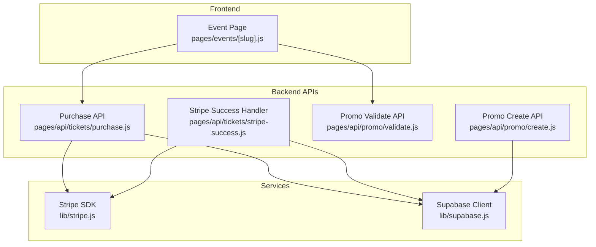
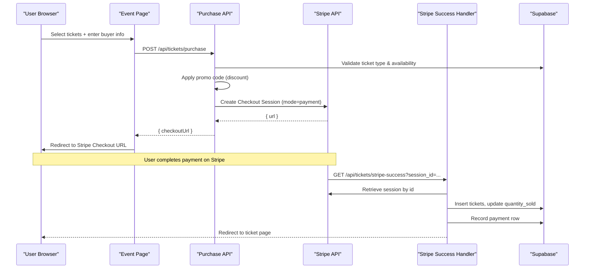
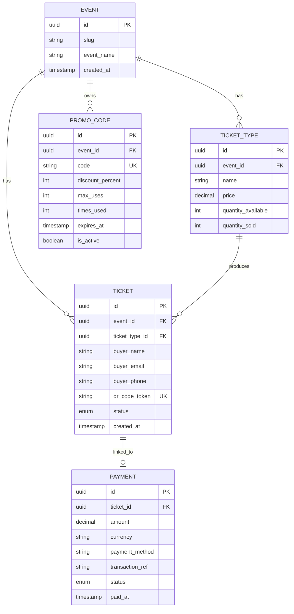
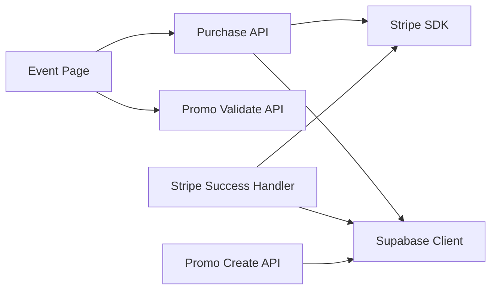

# Payment Integration

<cite>
**Referenced Files in This Document**
- [lib/stripe.js](file://lib/stripe.js)
- [pages/api/tickets/purchase.js](file://pages/api/tickets/purchase.js)
- [pages/api/tickets/stripe-success.js](file://pages/api/tickets/stripe-success.js)
- [pages/events/[slug].js](file://pages/events/[slug].js)
- [pages/api/promo/validate.js](file://pages/api/promo/validate.js)
- [pages/api/promo/create.js](file://pages/api/promo/create.js)
- [lib/supabase.js](file://lib/supabase.js)
- [package.json](file://package.json)
</cite>

## Table of Contents
1. [Introduction](#introduction)
2. [Project Structure](#project-structure)
3. [Core Components](#core-components)
4. [Architecture Overview](#architecture-overview)
5. [Detailed Component Analysis](#detailed-component-analysis)
6. [Dependency Analysis](#dependency-analysis)
7. [Performance Considerations](#performance-considerations)
8. [Troubleshooting Guide](#troubleshooting-guide)
9. [Conclusion](#conclusion)
10. [Appendices](#appendices)

## Introduction
This document explains TicketFlow’s Stripe payment integration end-to-end: from checkout session creation to payment confirmation and webhook readiness. It covers SDK configuration, payment method setup, currency handling, promo code application, error handling, retry strategies, transaction rollback considerations, security and PCI compliance guidance, debugging techniques, testing strategies, and common issues with solutions.

## Project Structure
The payment flow spans a Next.js API route that creates a Stripe Checkout session, a success handler that finalizes ticket issuance, and the event page that orchestrates user input and redirects to Stripe. Promo codes are validated server-side before purchase.

**Diagram sources**
- [pages/events/[slug].js](file://pages/events/[slug].js)
- [pages/api/tickets/purchase.js](file://pages/api/tickets/purchase.js)
- [pages/api/tickets/stripe-success.js](file://pages/api/tickets/stripe-success.js)
- [pages/api/promo/validate.js](file://pages/api/promo/validate.js)
- [pages/api/promo/create.js](file://pages/api/promo/create.js)
- [lib/stripe.js](file://lib/stripe.js)
- [lib/supabase.js](file://lib/supabase.js)

**Section sources**
- [pages/events/[slug].js](file://pages/events/[slug].js)
- [pages/api/tickets/purchase.js](file://pages/api/tickets/purchase.js)
- [pages/api/tickets/stripe-success.js](file://pages/api/tickets/stripe-success.js)
- [pages/api/promo/validate.js](file://pages/api/promo/validate.js)
- [pages/api/promo/create.js](file://pages/api/promo/create.js)
- [lib/stripe.js](file://lib/stripe.js)
- [lib/supabase.js](file://lib/supabase.js)

## Core Components
- Stripe SDK initialization for server-side calls.
- Purchase API: validates inputs, checks availability, applies promo codes, and creates a Stripe Checkout session.
- Stripe Success Handler: verifies payment status, creates tickets, updates inventory, records payments, and redirects to the ticket page.
- Event Page: collects buyer info, validates inputs, optionally validates promo codes, and triggers purchase flow.
- Promo APIs: validate and create promo codes with business rules.

Key responsibilities:
- Server-side price computation and discount application.
- Secure environment-based secret management.
- Idempotent ticket issuance on successful payment.
- Clear error responses and user-friendly redirects.

**Section sources**
- [lib/stripe.js](file://lib/stripe.js)
- [pages/api/tickets/purchase.js](file://pages/api/tickets/purchase.js)
- [pages/api/tickets/stripe-success.js](file://pages/api/tickets/stripe-success.js)
- [pages/events/[slug].js](file://pages/events/[slug].js)
- [pages/api/promo/validate.js](file://pages/api/promo/validate.js)
- [pages/api/promo/create.js](file://pages/api/promo/create.js)

## Architecture Overview
The payment architecture uses Stripe Checkout hosted on Stripe’s domain for PCI safety. The frontend never handles raw card data; it only initiates a server-side checkout session and redirects to Stripe. After payment, Stripe redirects back to a success endpoint that finalizes fulfillment.

**Diagram sources**
- [pages/events/[slug].js](file://pages/events/[slug].js)
- [pages/api/tickets/purchase.js](file://pages/api/tickets/purchase.js)
- [pages/api/tickets/stripe-success.js](file://pages/api/tickets/stripe-success.js)
- [lib/supabase.js](file://lib/supabase.js)

## Detailed Component Analysis

### Stripe SDK Configuration
- A server-side Stripe client is initialized with an API version and secret key sourced from environment variables.
- The same pattern is used within API handlers when needed.

Security notes:
- Never expose secrets to the browser.
- Use service role keys only on the server for privileged operations.

**Section sources**
- [lib/stripe.js](file://lib/stripe.js)
- [lib/supabase.js](file://lib/supabase.js)

### Purchase Flow: Creating a Checkout Session
Responsibilities:
- Validate required fields.
- Verify ticket type exists and has sufficient availability.
- Optionally apply a promo code and increment usage counters.
- Compute discounted unit price and build a line item.
- Generate per-ticket tokens and embed them in metadata.
- Create a Stripe Checkout session in payment mode with success/cancel URLs.

Currency handling:
- Currency is set explicitly in the line item. Ensure this matches your Stripe account settings and pricing model.

Error handling:
- Returns appropriate HTTP status codes and JSON errors for validation failures and database errors.

**Section sources**
- [pages/api/tickets/purchase.js](file://pages/api/tickets/purchase.js)

### Stripe Success Handler: Finalizing Fulfillment
Responsibilities:
- Retrieve the Checkout session using the session ID from the query string.
- Confirm payment_status is paid before proceeding.
- Read metadata to reconstruct ticket inserts and compute final amounts.
- Insert tickets into the database and update sold quantities.
- Record a payment row with transaction reference and timestamps.
- Redirect to the first ticket’s public page.

Idempotency considerations:
- Ensure duplicate redirects do not create duplicate tickets or payments. Deduplicate by checking existing tokens or using idempotency keys where applicable.

**Section sources**
- [pages/api/tickets/stripe-success.js](file://pages/api/tickets/stripe-success.js)

### Frontend Orchestration: Event Page
Responsibilities:
- Collect buyer details and selected ticket type/quantity.
- Validate inputs based on chosen payment method.
- Call the purchase API with all relevant payload fields including promo code if applied.
- On success with Stripe, redirect to the returned checkout URL.
- For non-Stripe methods, display confirmation and tokens.

Promo integration:
- Validates promo codes via a dedicated API before purchase.

**Section sources**
- [pages/events/[slug].js](file://pages/events/[slug].js)

### Promo Code Validation and Creation
Validation:
- Checks code existence, active status, usage limits, and expiration.
- Returns structured response indicating validity and discount percentage.

Creation:
- Requires admin roles.
- Normalizes code and persists promo attributes.

Usage during purchase:
- If valid and within limits, discount is applied to unit price before creating the Stripe line item.

**Section sources**
- [pages/api/promo/validate.js](file://pages/api/promo/validate.js)
- [pages/api/promo/create.js](file://pages/api/promo/create.js)
- [pages/api/tickets/purchase.js](file://pages/api/tickets/purchase.js)

### Data Models and Relationships
Conceptual relationships relevant to payments:
- Events have many ticket types.
- Ticket types track available and sold quantities.
- Tickets belong to a ticket type and event, with unique QR tokens.
- Payments link to a ticket and record amount, currency, method, and status.

[No sources needed since this diagram shows conceptual workflow, not actual code structure]

## Dependency Analysis
External dependencies:
- Stripe SDK for server-side operations.
- Supabase client for database access.
- UUID generation for ticket tokens.

Internal coupling:
- Purchase API depends on Supabase for availability checks and promo validation.
- Success handler depends on Supabase for fulfillment and payment recording.
- Event page depends on both purchase and promo validation APIs.

**Diagram sources**
- [pages/events/[slug].js](file://pages/events/[slug].js)
- [pages/api/tickets/purchase.js](file://pages/api/tickets/purchase.js)
- [pages/api/tickets/stripe-success.js](file://pages/api/tickets/stripe-success.js)
- [pages/api/promo/validate.js](file://pages/api/promo/validate.js)
- [pages/api/promo/create.js](file://pages/api/promo/create.js)
- [lib/stripe.js](file://lib/stripe.js)
- [lib/supabase.js](file://lib/supabase.js)

**Section sources**
- [package.json](file://package.json)

## Performance Considerations
- Prefer server-side price calculations to avoid client tampering.
- Batch database writes where possible (e.g., insert multiple tickets in one call).
- Cache frequently accessed ticket type data if needed.
- Keep Stripe SDK instantiation minimal; reuse instances at module scope.

[No sources needed since this section provides general guidance]

## Troubleshooting Guide
Common issues and resolutions:
- Missing environment variables:
  - Ensure STRIPE_SECRET_KEY and Supabase keys are configured.
- Invalid or expired promo code:
  - Check promo validation logic and expiry dates.
- Availability errors:
  - Verify quantity_available vs quantity_sold and concurrent purchase race conditions.
- Duplicate tickets on success redirect:
  - Implement idempotency checks in the success handler using token uniqueness or payment intent deduplication.
- Incorrect currency:
  - Ensure the currency in the line item matches your Stripe account and expectations.
- Webhook not implemented:
  - Add a webhook endpoint to handle asynchronous events like charge disputes or refunds.

Debugging techniques:
- Log request payloads and responses in API routes (avoid logging sensitive data).
- Use Stripe CLI to forward webhooks locally for testing.
- Inspect network requests in the browser DevTools for frontend errors.

Testing strategies:
- Unit test promo validation logic.
- Mock Stripe and Supabase calls in integration tests for purchase and success flows.
- Use Stripe test cards to simulate success/failure scenarios.

PCI compliance:
- Do not handle raw card data in your app; rely on Stripe Checkout.
- Avoid logging sensitive information.
- Keep dependencies updated and audit regularly.

[No sources needed since this section provides general guidance]

## Conclusion
TicketFlow’s Stripe integration leverages hosted Checkout for secure payments, server-side validation and discounting, and a robust success handler to finalize ticket issuance. To strengthen reliability and security, implement webhook processing, idempotency safeguards, and comprehensive error handling. Follow the troubleshooting and testing recommendations to ensure a smooth production experience.

[No sources needed since this section summarizes without analyzing specific files]

## Appendices

### Endpoints Summary
- POST /api/tickets/purchase
  - Purpose: Create a Stripe Checkout session or process alternative payment methods.
  - Inputs: eventId, ticketTypeId, quantity, buyerName, buyerEmail, buyerPhone, paymentMethod, promoCode.
  - Outputs: checkoutUrl for Stripe or tokens/orderId for other methods.
- GET /api/tickets/stripe-success
  - Purpose: Finalize fulfillment after successful payment.
  - Inputs: session_id query parameter.
  - Outputs: Redirect to ticket page.
- POST /api/promo/validate
  - Purpose: Validate promo code against event and business rules.
  - Inputs: code, eventId.
  - Outputs: valid flag and promo details.
- POST /api/promo/create
  - Purpose: Create a new promo code (admin-only).
  - Inputs: event_id, code, discount_percent, max_uses, expires_at.
  - Outputs: created promo object.

[No sources needed since this section provides general guidance]