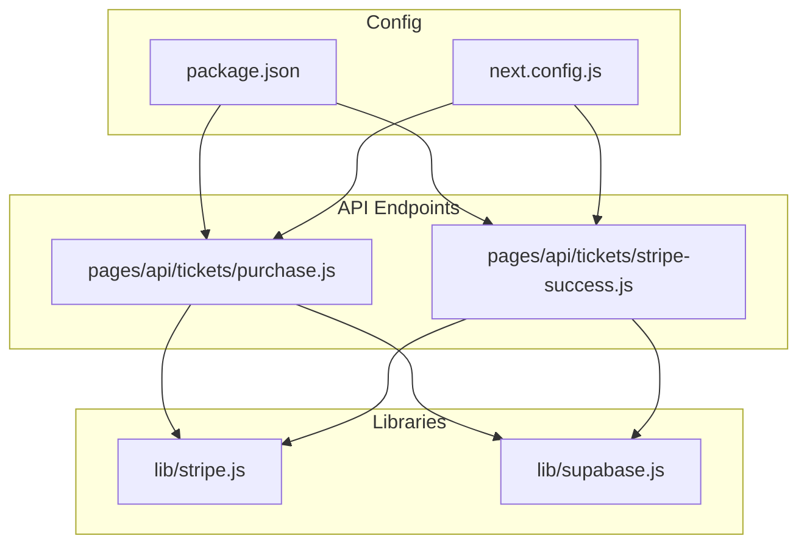
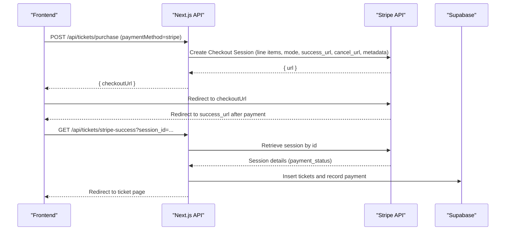
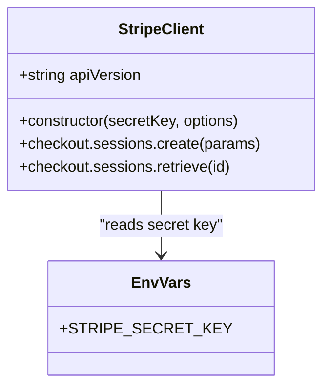
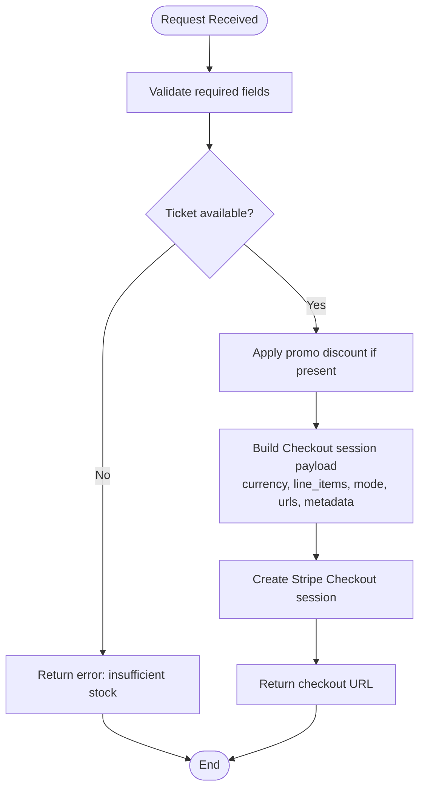
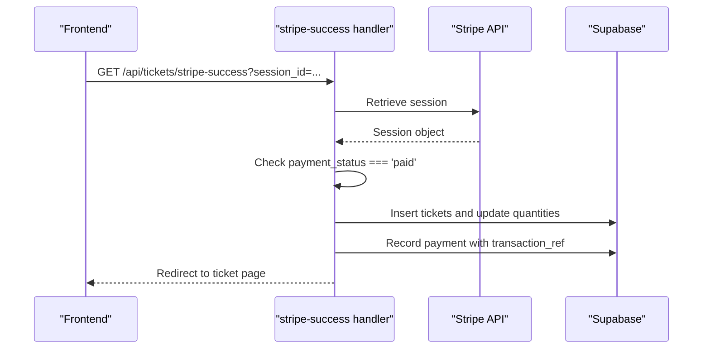
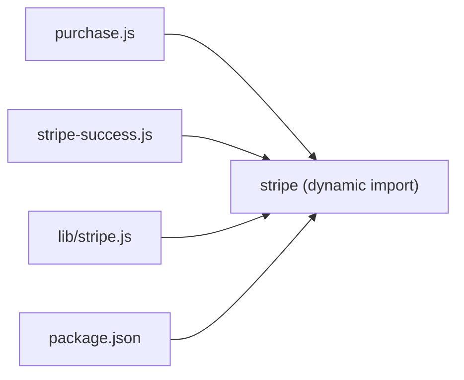

# Stripe Configuration & Setup

<cite>
**Referenced Files in This Document**
- [lib/stripe.js](file://lib/stripe.js)
- [pages/api/tickets/purchase.js](file://pages/api/tickets/purchase.js)
- [pages/api/tickets/stripe-success.js](file://pages/api/tickets/stripe-success.js)
- [package.json](file://package.json)
- [next.config.js](file://next.config.js)
- [lib/supabase.js](file://lib/supabase.js)
</cite>

## Table of Contents
1. [Introduction](#introduction)
2. [Project Structure](#project-structure)
3. [Core Components](#core-components)
4. [Architecture Overview](#architecture-overview)
5. [Detailed Component Analysis](#detailed-component-analysis)
6. [Dependency Analysis](#dependency-analysis)
7. [Performance Considerations](#performance-considerations)
8. [Troubleshooting Guide](#troubleshooting-guide)
9. [Conclusion](#conclusion)
10. [Appendices](#appendices)

## Introduction
This document explains how TicketFlow configures and initializes the Stripe SDK, manages environment variables, and handles payment flows for ticket purchases. It covers client initialization, API version configuration, security best practices for secret keys, test vs production setup, connection options, multi-currency support, webhook guidance, and testing strategies using Stripe’s test cards.

## Project Structure
Stripe-related code is primarily located in:
- A shared library module that exports a configured Stripe client instance.
- Serverless API endpoints that create Checkout sessions and confirm payments.
- Package dependencies that include the Stripe SDK and related libraries.

**Diagram sources**
- [lib/stripe.js:1-6](file://lib/stripe.js#L1-L6)
- [pages/api/tickets/purchase.js:1-123](file://pages/api/tickets/purchase.js#L1-L123)
- [pages/api/tickets/stripe-success.js:1-55](file://pages/api/tickets/stripe-success.js#L1-L55)
- [package.json:1-24](file://package.json#L1-L24)
- [next.config.js:1-14](file://next.config.js#L1-L14)

**Section sources**
- [lib/stripe.js:1-6](file://lib/stripe.js#L1-L6)
- [pages/api/tickets/purchase.js:1-123](file://pages/api/tickets/purchase.js#L1-L123)
- [pages/api/tickets/stripe-success.js:1-55](file://pages/api/tickets/stripe-success.js#L1-L55)
- [package.json:1-24](file://package.json#L1-L24)
- [next.config.js:1-14](file://next.config.js#L1-L14)

## Core Components
- Stripe client initialization and API version are defined in a dedicated module.
- The purchase endpoint dynamically imports Stripe to create Checkout sessions with metadata and success/cancel URLs.
- The success endpoint verifies payment status and persists tickets and payment records.

Key responsibilities:
- Centralized Stripe client configuration (secret key and API version).
- Secure server-side creation and retrieval of Checkout sessions.
- Environment-driven configuration via process.env variables.

**Section sources**
- [lib/stripe.js:1-6](file://lib/stripe.js#L1-L6)
- [pages/api/tickets/purchase.js:47-76](file://pages/api/tickets/purchase.js#L47-L76)
- [pages/api/tickets/stripe-success.js:7-46](file://pages/api/tickets/stripe-success.js#L7-L46)

## Architecture Overview
The payment flow uses Stripe Checkout hosted on Stripe’s domain. The frontend calls a Next.js API route to create a session, then redirects to Stripe. After payment, Stripe redirects back to a success endpoint that finalizes ticket issuance.

**Diagram sources**
- [pages/api/tickets/purchase.js:47-76](file://pages/api/tickets/purchase.js#L47-L76)
- [pages/api/tickets/stripe-success.js:7-46](file://pages/api/tickets/stripe-success.js#L7-L46)

## Detailed Component Analysis

### Stripe Client Initialization and API Version
- A single module exports a Stripe client initialized with the secret key from environment variables and a pinned API version.
- This ensures consistent API behavior across the application.

**Diagram sources**
- [lib/stripe.js:1-6](file://lib/stripe.js#L1-L6)

**Section sources**
- [lib/stripe.js:1-6](file://lib/stripe.js#L1-L6)

### Purchase Endpoint: Creating a Checkout Session
- Validates inputs and checks ticket availability.
- Applies promo codes when provided.
- Dynamically imports Stripe to instantiate a client with the secret key and API version.
- Creates a Checkout session with currency set to USD, line items, mode, success/cancel URLs, and rich metadata.

**Diagram sources**
- [pages/api/tickets/purchase.js:7-26](file://pages/api/tickets/purchase.js#L7-L26)
- [pages/api/tickets/purchase.js:27-41](file://pages/api/tickets/purchase.js#L27-L41)
- [pages/api/tickets/purchase.js:47-76](file://pages/api/tickets/purchase.js#L47-L76)

**Section sources**
- [pages/api/tickets/purchase.js:7-26](file://pages/api/tickets/purchase.js#L7-L26)
- [pages/api/tickets/purchase.js:27-41](file://pages/api/tickets/purchase.js#L27-L41)
- [pages/api/tickets/purchase.js:47-76](file://pages/api/tickets/purchase.js#L47-L76)

### Success Endpoint: Verifying Payment and Issuing Tickets
- Retrieves the Checkout session by ID.
- Confirms payment status before issuing tickets.
- Parses metadata to create tickets and record payment details.
- Redirects to the first ticket page.

**Diagram sources**
- [pages/api/tickets/stripe-success.js:7-46](file://pages/api/tickets/stripe-success.js#L7-L46)

**Section sources**
- [pages/api/tickets/stripe-success.js:7-46](file://pages/api/tickets/stripe-success.js#L7-L46)

### Environment Variables and Configuration
- Secret key is read from an environment variable and passed to the Stripe client.
- API version is explicitly set to ensure compatibility.
- Public site URL is used to build success and cancel URLs.

Recommended environment variables:
- STRIPE_SECRET_KEY: Your Stripe secret key (never commit to source control).
- NEXT_PUBLIC_SITE_URL: Base URL for success/cancel redirects.

Notes:
- The project demonstrates environment-based configuration similar to other services (e.g., Supabase clients), reinforcing the pattern of reading secrets from process.env.

**Section sources**
- [lib/stripe.js:1-6](file://lib/stripe.js#L1-L6)
- [pages/api/tickets/purchase.js:65-66](file://pages/api/tickets/purchase.js#L65-L66)
- [lib/supabase.js:3-8](file://lib/supabase.js#L3-L8)

### Dependencies and Versions
- The Stripe SDK is included as a dependency.
- Frontend packages for Stripe are also listed, indicating potential future use of Stripe.js components on the client side.

**Section sources**
- [package.json:10-22](file://package.json#L10-L22)

## Dependency Analysis
Stripe is used in two primary places:
- A centralized client export for reuse.
- Dynamic imports within serverless handlers to avoid bundling server-only code into the client bundle.

**Diagram sources**
- [pages/api/tickets/purchase.js:48-49](file://pages/api/tickets/purchase.js#L48-L49)
- [pages/api/tickets/stripe-success.js:8-9](file://pages/api/tickets/stripe-success.js#L8-L9)
- [lib/stripe.js:1-2](file://lib/stripe.js#L1-L2)
- [package.json:20](file://package.json#L20)

**Section sources**
- [pages/api/tickets/purchase.js:48-49](file://pages/api/tickets/purchase.js#L48-L49)
- [pages/api/tickets/stripe-success.js:8-9](file://pages/api/tickets/stripe-success.js#L8-L9)
- [lib/stripe.js:1-2](file://lib/stripe.js#L1-L2)
- [package.json:20](file://package.json#L20)

## Performance Considerations
- Dynamic imports of Stripe in API routes reduce client bundle size and ensure server-only usage.
- Reusing a single Stripe client instance (as exported by the library module) can improve connection pooling and reduce overhead.
- Keep API version pinned to minimize unexpected breaking changes.

[No sources needed since this section provides general guidance]

## Troubleshooting Guide
Common issues and resolutions:
- Missing or invalid STRIPE_SECRET_KEY: Ensure the environment variable is set in your deployment environment and local .env.local during development.
- Incorrect API version: Confirm the pinned API version matches your Stripe dashboard expectations.
- Redirect failures: Verify NEXT_PUBLIC_SITE_URL is correct so success/cancel URLs resolve properly.
- Payment not marked paid: The success endpoint checks payment_status; ensure the redirect occurs only after successful payment.
- Logging: Review console logs in API handlers for errors during session creation or retrieval.

Debugging steps:
- Test locally with a valid test secret key.
- Use Stripe CLI to forward webhooks if you implement them later.
- Inspect network requests and responses in browser dev tools for checkout redirects.

**Section sources**
- [pages/api/tickets/purchase.js:118-121](file://pages/api/tickets/purchase.js#L118-L121)
- [pages/api/tickets/stripe-success.js:50-53](file://pages/api/tickets/stripe-success.js#L50-L53)
- [lib/supabase.js:6-8](file://lib/supabase.js#L6-L8)

## Conclusion
TicketFlow integrates Stripe through a clear separation of concerns: a centralized client configuration, server-side Checkout session creation, and a robust success handler that validates payment and issues tickets. Environment variables drive configuration, and dynamic imports keep the client bundle lean. For production, ensure secure secret management, pin API versions, and consider implementing webhooks for resilient event handling.

[No sources needed since this section summarizes without analyzing specific files]

## Appendices

### Security Best Practices
- Store STRIPE_SECRET_KEY in environment variables; never hardcode or commit it.
- Use server-only Stripe SDK calls; do not expose secret keys to the client.
- Validate all inputs and enforce business rules before creating sessions.
- Pin the Stripe API version to maintain stable behavior.

**Section sources**
- [lib/stripe.js:1-6](file://lib/stripe.js#L1-L6)
- [pages/api/tickets/purchase.js:48-49](file://pages/api/tickets/purchase.js#L48-L49)

### Test Mode vs Production Mode
- Switch between test and production by changing the secret key value in the environment variable.
- Use Stripe test cards to simulate various payment outcomes.
- Ensure NEXT_PUBLIC_SITE_URL points to the correct environment (development or production).

**Section sources**
- [lib/stripe.js:1-6](file://lib/stripe.js#L1-L6)
- [pages/api/tickets/purchase.js:65-66](file://pages/api/tickets/purchase.js#L65-L66)

### Multi-Currency Support
- Currency is currently hardcoded to USD in the Checkout session creation.
- To support multiple currencies, parameterize the currency field based on event or buyer preferences and ensure pricing aligns with Stripe-supported amounts.

**Section sources**
- [pages/api/tickets/purchase.js:57-62](file://pages/api/tickets/purchase.js#L57-L62)

### Webhook Endpoint Configuration
- While not implemented here, webhooks provide reliable payment confirmation independent of user redirects.
- Recommended approach: create a serverless endpoint that verifies Stripe signatures, updates order state, and handles edge cases like retries and disputes.

[No sources needed since this section provides general guidance]

### Testing Strategies with Stripe Test Cards
- Use Stripe’s test card numbers to simulate successful payments, declines, and authentication flows.
- Validate success_url redirection and ticket issuance logic end-to-end.
- Monitor logs in API handlers to catch errors during session creation and retrieval.

[No sources needed since this section provides general guidance]