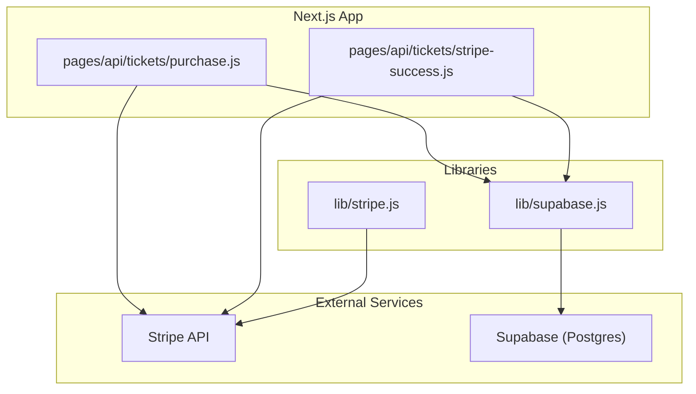
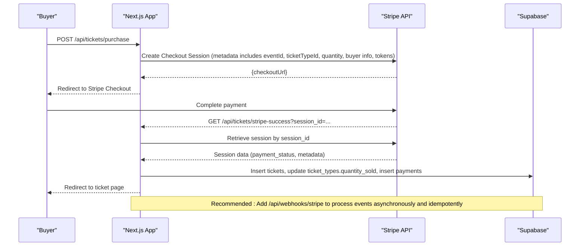
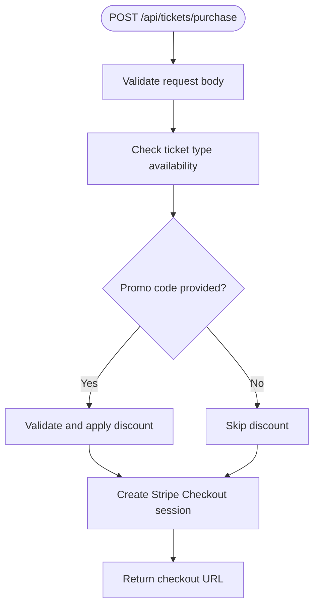
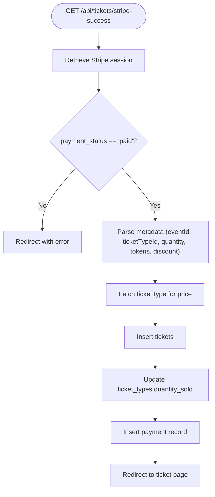
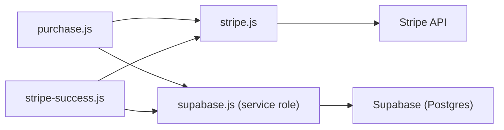

# Webhook Processing & Event Handling

<cite>
**Referenced Files in This Document**
- [stripe.js](file://lib/stripe.js)
- [supabase.js](file://lib/supabase.js)
- [purchase.js](file://pages/api/tickets/purchase.js)
- [stripe-success.js](file://pages/api/tickets/stripe-success.js)
- [schema.sql](file://supabase/schema.sql)
- [package.json](file://package.json)
- [vercel.json](file://vercel.json)
</cite>

## Table of Contents
1. [Introduction](#introduction)
2. [Project Structure](#project-structure)
3. [Core Components](#core-components)
4. [Architecture Overview](#architecture-overview)
5. [Detailed Component Analysis](#detailed-component-analysis)
6. [Dependency Analysis](#dependency-analysis)
7. [Performance Considerations](#performance-considerations)
8. [Troubleshooting Guide](#troubleshooting-guide)
9. [Conclusion](#conclusion)
10. [Appendices](#appendices)

## Introduction
This document explains how Stripe payments are integrated into the TicketFlow application and provides guidance for implementing robust webhook processing and event handling. The current codebase uses Stripe Checkout to create payment sessions and relies on a success redirect handler to finalize ticket issuance and record payments. A dedicated Stripe webhook endpoint is not present yet; this guide outlines how to add one, verify signatures, filter events, ensure idempotency, handle failures, and monitor delivery status.

## Project Structure
The relevant parts of the project for payment and ticketing are:
- API routes for initiating purchases and handling Stripe Checkout success
- Stripe client configuration
- Supabase client for database operations
- Database schema defining tickets, payments, and related entities
- Deployment configuration for Next.js on Vercel

**Diagram sources**
- [purchase.js](file://pages/api/tickets/purchase.js)
- [stripe-success.js](file://pages/api/tickets/stripe-success.js)
- [stripe.js](file://lib/stripe.js)
- [supabase.js](file://lib/supabase.js)

**Section sources**
- [purchase.js](file://pages/api/tickets/purchase.js)
- [stripe-success.js](file://pages/api/tickets/stripe-success.js)
- [stripe.js](file://lib/stripe.js)
- [supabase.js](file://lib/supabase.js)

## Core Components
- Stripe client initialization: centralizes API version and secret key usage.
- Purchase flow: validates inputs, checks availability, applies promo codes, creates a Stripe Checkout session with metadata containing ticket details and pre-generated tokens.
- Success handler: retrieves the Stripe session, verifies payment status, creates tickets, updates sold counts, records payments, and redirects to the ticket page.
- Supabase clients: anonymous client for public reads and service-role client for server-side writes.

Key responsibilities:
- purchase.js orchestrates checkout creation and non-Stripe payment paths.
- stripe-success.js finalizes the transaction after successful payment.
- stripe.js configures the Stripe SDK.
- supabase.js provides DB access via Supabase.

**Section sources**
- [stripe.js](file://lib/stripe.js)
- [purchase.js](file://pages/api/tickets/purchase.js)
- [stripe-success.js](file://pages/api/tickets/stripe-success.js)
- [supabase.js](file://lib/supabase.js)

## Architecture Overview
The current implementation uses Stripe Checkout with a success URL callback. There is no webhook endpoint implemented yet. To make the system resilient, you should implement a webhook endpoint that:
- Verifies the Stripe signature
- Filters relevant events (e.g., payment_intent.succeeded, chargeback.created)
- Performs idempotent updates to the database
- Records audit logs and metrics

**Diagram sources**
- [purchase.js](file://pages/api/tickets/purchase.js)
- [stripe-success.js](file://pages/api/tickets/stripe-success.js)

## Detailed Component Analysis

### Purchase Flow (Stripe Checkout)
- Validates required fields and availability
- Applies promo codes when provided
- Creates a Stripe Checkout session with:
  - Line item price derived from ticket type and discount
  - Mode set to payment
  - Success and cancel URLs
  - Metadata carrying eventId, ticketTypeId, quantity, buyerName, buyerEmail, buyerPhone, tokens, discount
- Returns the checkout URL to the client

**Diagram sources**
- [purchase.js](file://pages/api/tickets/purchase.js)

**Section sources**
- [purchase.js](file://pages/api/tickets/purchase.js)

### Success Handler (Ticket Issuance)
- Retrieves the Stripe session using session_id
- Ensures payment_status is 'paid'
- Parses metadata to get eventId, ticketTypeId, quantity, buyer info, tokens, discount
- Inserts tickets into the database with active status
- Updates ticket_types.quantity_sold
- Records a payment entry linked to the first ticket
- Redirects to the ticket page

**Diagram sources**
- [stripe-success.js](file://pages/api/tickets/stripe-success.js)

**Section sources**
- [stripe-success.js](file://pages/api/tickets/stripe-success.js)

### Stripe Client Configuration
- Initializes Stripe SDK with API version and secret key
- Used across API routes for creating sessions and retrieving data

**Section sources**
- [stripe.js](file://lib/stripe.js)

### Supabase Clients
- Anonymous client for general reads
- Service-role client for secure server-side writes in API routes

**Section sources**
- [supabase.js](file://lib/supabase.js)

### Database Schema
- tickets: stores per-ticket records including qr_code_token and status
- payments: records payment details and links to tickets
- ticket_types: tracks pricing and sales counts
- events: defines events referenced by tickets and ticket types

**Section sources**
- [schema.sql](file://supabase/schema.sql)

## Dependency Analysis
- purchase.js depends on Stripe SDK and Supabase service client
- stripe-success.js depends on Stripe SDK and Supabase service client
- lib/stripe.js initializes Stripe SDK
- lib/supabase.js initializes Supabase clients
- vercel.json configures Next.js deployment and security headers
- package.json lists dependencies including Stripe SDK and Supabase JS

**Diagram sources**
- [purchase.js](file://pages/api/tickets/purchase.js)
- [stripe-success.js](file://pages/api/tickets/stripe-success.js)
- [stripe.js](file://lib/stripe.js)
- [supabase.js](file://lib/supabase.js)

**Section sources**
- [package.json](file://package.json)
- [vercel.json](file://vercel.json)

## Performance Considerations
- Prefer asynchronous, idempotent webhook processing to avoid blocking user flows
- Batch database operations where possible (e.g., insert multiple tickets in a single call)
- Use indexes defined in the schema (tickets.qr_code_token, payments.ticket_id, tickets.event_id) for fast lookups
- Avoid heavy computations in success handlers; offload to webhooks if needed
- Cache frequently accessed ticket type data at the edge or within short-lived caches to reduce DB load

[No sources needed since this section provides general guidance]

## Troubleshooting Guide
Common issues and resolutions:
- Missing session_id in success handler: Ensure success_url includes {CHECKOUT_SESSION_ID} placeholder and environment variables are set correctly.
- Payment not marked paid: Verify Stripe session retrieval and payment_status check logic.
- Invalid event or ticket type: Confirm metadata fields match expected values and ticket types exist.
- Database write failures: Inspect Supabase service role key and RLS policies; ensure service-role client is used in server-side routes.
- Redirect loops or errors: Log errors and return explicit error redirects with descriptive query parameters.

Recommended improvements:
- Implement a dedicated webhook endpoint (/api/webhooks/stripe) to handle events reliably and idempotently.
- Add structured logging and metrics for payment lifecycle events.
- Introduce retry mechanisms for transient failures and dead-letter queues for failed events.

**Section sources**
- [stripe-success.js](file://pages/api/tickets/stripe-success.js)
- [supabase.js](file://lib/supabase.js)

## Conclusion
The current implementation successfully initiates Stripe Checkout and finalizes ticket issuance via a success redirect handler. To achieve production-grade reliability, implement a Stripe webhook endpoint with signature verification, event filtering, idempotency, and robust error handling. This will decouple critical state changes from user-facing flows and provide resilience against network failures and retries.

[No sources needed since this section summarizes without analyzing specific files]

## Appendices

### Webhook Endpoint Design (Recommended)
- Endpoint path: /api/webhooks/stripe
- Signature verification: Verify Stripe signature using the raw request body and webhook secret
- Event filtering: Handle payment_intent.succeeded, payment_intent.payment_failed, chargeback.created/refunded
- Idempotency: Use Stripe event.id or payment_intent.id to prevent duplicate processing
- Database updates:
  - On payment_intent.succeeded: mark payments completed, ensure tickets exist, update quantities
  - On payment_intent.payment_failed: mark payments failed, notify users
  - On chargeback events: update payment status to refunded/failed, adjust inventory if necessary
- Error recovery: Retry on transient errors, log failures, alert on persistent issues
- Monitoring: Emit metrics for webhook receipt, processing time, success/failure rates

[No sources needed since this section provides conceptual guidance]

### Security and Headers
- Enforce HTTPS and restrict API routes to internal services where appropriate
- Set security headers via vercel.json for API routes
- Store secrets securely (Stripe secret key, Supabase service role key) and never expose them in client-side code

**Section sources**
- [vercel.json](file://vercel.json)

### Data Model Reference
- tickets: unique qr_code_token per ticket, status transitions (active, used, cancelled, refunded)
- payments: linked to tickets, records amount, currency, method, transaction_ref, status, paid_at
- ticket_types: tracks price and quantity_sold for reporting and availability

**Section sources**
- [schema.sql](file://supabase/schema.sql)