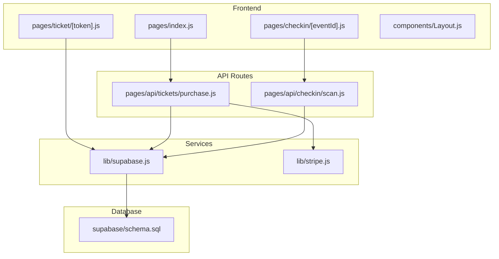
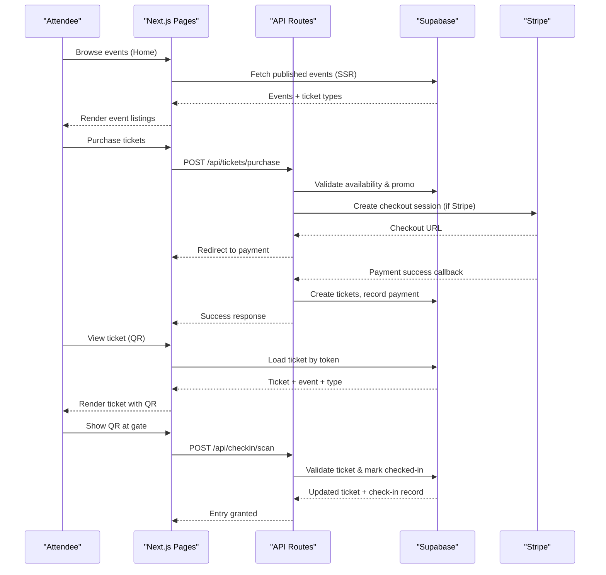
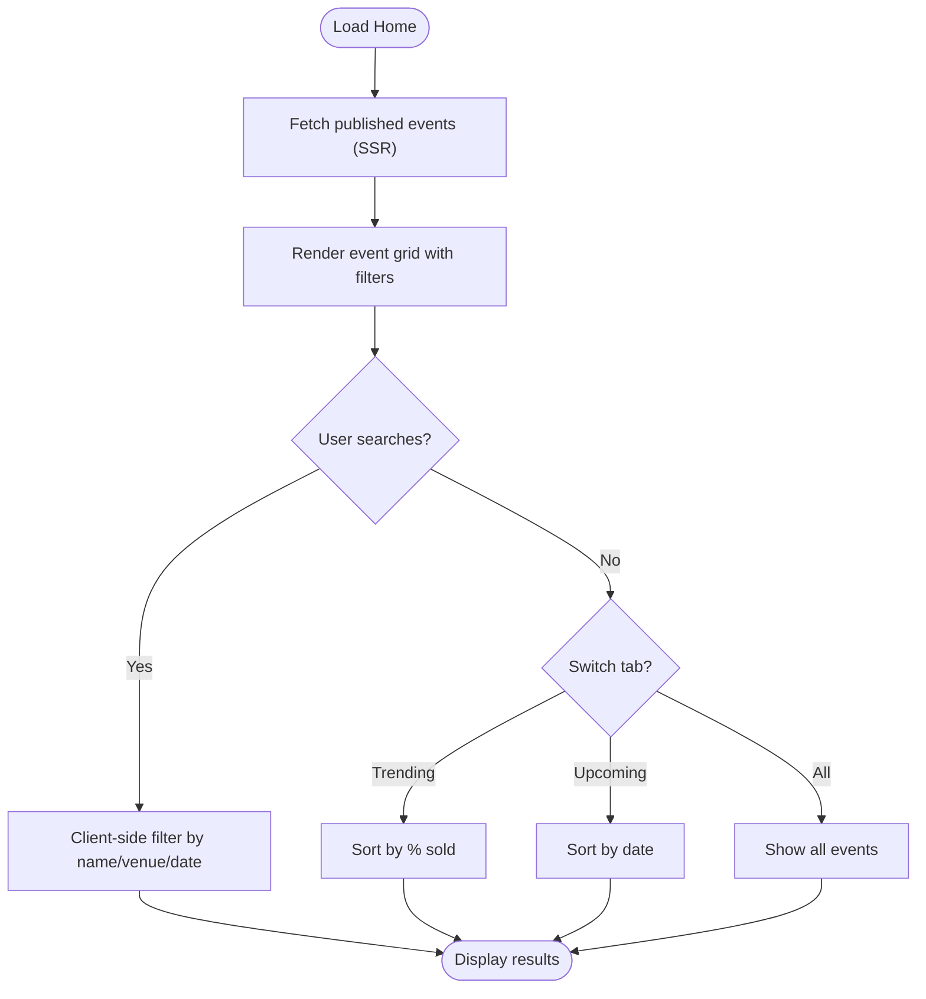
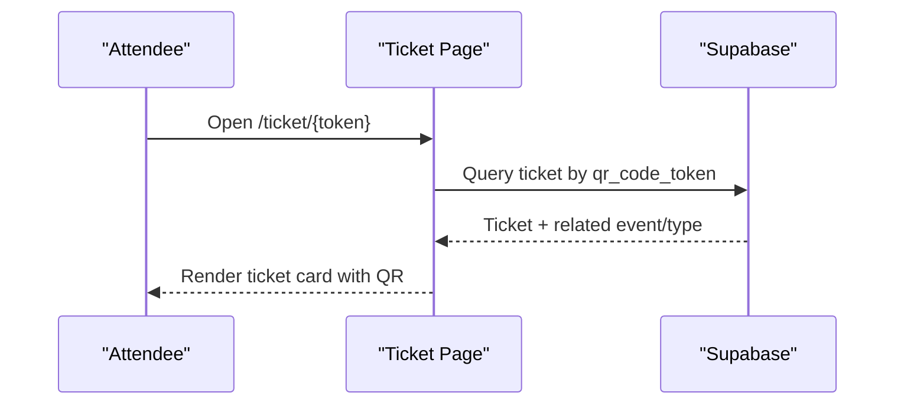
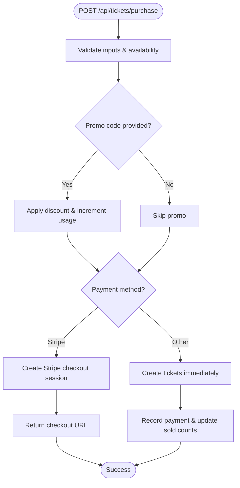
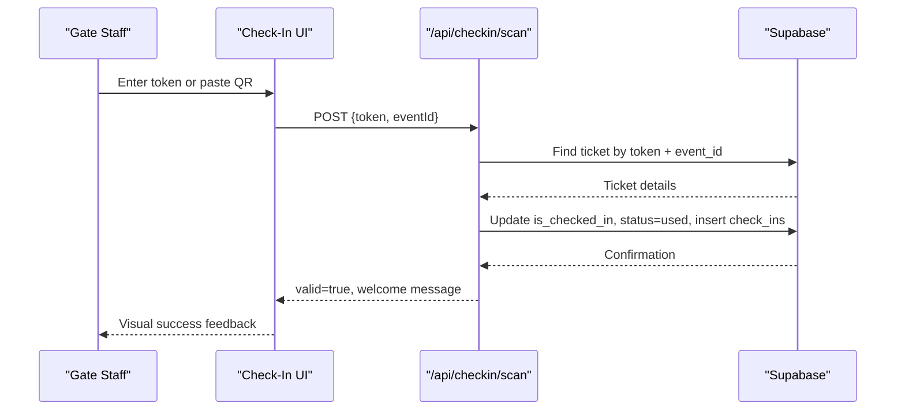
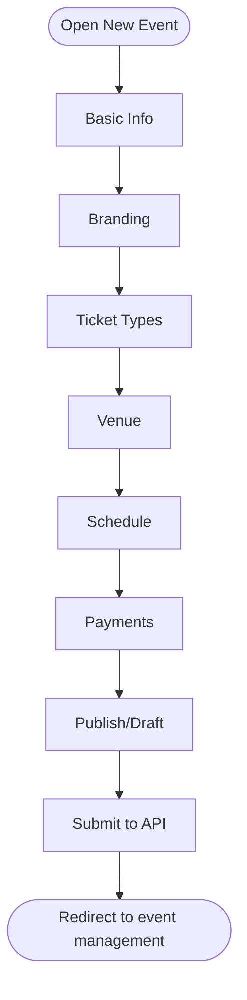
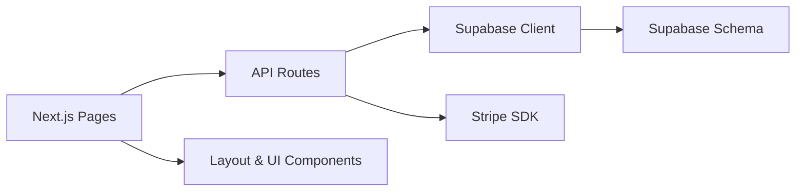

# Project Overview

<cite>
**Referenced Files in This Document**
- [package.json](file://package.json)
- [next.config.js](file://next.config.js)
- [pages/_app.js](file://pages/_app.js)
- [components/Layout.js](file://components/Layout.js)
- [lib/supabase.js](file://lib/supabase.js)
- [lib/stripe.js](file://lib/stripe.js)
- [supabase/schema.sql](file://supabase/schema.sql)
- [vercel.json](file://vercel.json)
- [pages/index.js](file://pages/index.js)
- [pages/ticket/[token].js](file://pages/ticket/[token].js)
- [pages/api/tickets/purchase.js](file://pages/api/tickets/purchase.js)
- [pages/api/checkin/scan.js](file://pages/api/checkin/scan.js)
- [pages/admin/events/new.js](file://pages/admin/events/new.js)
- [pages/checkin/[eventId].js](file://pages/checkin/[eventId].js)
</cite>

## Table of Contents
1. [Introduction](#introduction)
2. [Project Structure](#project-structure)
3. [Core Components](#core-components)
4. [Architecture Overview](#architecture-overview)
5. [Detailed Component Analysis](#detailed-component-analysis)
6. [Dependency Analysis](#dependency-analysis)
7. [Performance Considerations](#performance-considerations)
8. [Troubleshooting Guide](#troubleshooting-guide)
9. [Conclusion](#conclusion)

## Introduction
TicketFlow is a modern digital ticketing platform built with Next.js and React, designed to help event organizers create and manage events, sell tickets securely, generate QR-based tickets, and support real-time check-in at the venue. The system integrates Supabase for data persistence and authentication utilities, and Stripe for secure payments. It targets:
- Event organizers who need an intuitive dashboard to publish events, configure ticket tiers, and monitor sales and attendance.
- Attendees who can discover events, purchase tickets, and receive a scannable QR code ticket.
- Gate staff who can scan or manually verify tickets quickly and reliably during high-volume entry.

The platform emphasizes speed, reliability, and a polished user experience across desktop and mobile devices.

**Section sources**
- [package.json:10-22](file://package.json#L10-L22)
- [pages/index.js:227-334](file://pages/index.js#L227-L334)
- [pages/ticket/[token].js:31-98](file://pages/ticket/[token].js#L31-L98)
- [pages/checkin/[eventId].js:100-233](file://pages/checkin/[eventId].js#L100-L233)

## Project Structure
TicketFlow follows a feature-oriented layout within Next.js:
- pages/: Application routes including public pages (home, event detail, ticket view), admin interfaces, API endpoints, and gate check-in flows.
- components/: Reusable UI components and shared layouts.
- lib/: Shared libraries for Supabase client configuration and Stripe initialization.
- supabase/: Database schema and policies.
- Configuration files for Next.js runtime and Vercel deployment.

**Diagram sources**
- [pages/index.js:726-750](file://pages/index.js#L726-L750)
- [pages/ticket/[token].js:100-123](file://pages/ticket/[token].js#L100-L123)
- [pages/checkin/[eventId].js:30-52](file://pages/checkin/[eventId].js#L30-L52)
- [pages/api/tickets/purchase.js:1-123](file://pages/api/tickets/purchase.js#L1-L123)
- [pages/api/checkin/scan.js:1-44](file://pages/api/checkin/scan.js#L1-L44)
- [lib/supabase.js:1-23](file://lib/supabase.js#L1-L23)
- [lib/stripe.js:1-6](file://lib/stripe.js#L1-L6)
- [supabase/schema.sql:1-166](file://supabase/schema.sql#L1-L166)

**Section sources**
- [next.config.js:1-14](file://next.config.js#L1-L14)
- [vercel.json:1-18](file://vercel.json#L1-L18)
- [pages/_app.js:1-14](file://pages/_app.js#L1-L14)

## Core Components
- Layout and global UI: The root app wraps all pages with a toast provider and a consistent layout that includes navigation, theme switching, and footer.
- Public home page: Displays featured events, categories, trending/upcoming tabs, search, and calls to action for browsing and creating events.
- Ticket view: Renders a beautiful ticket card with a QR code, event details, and status indicators; supports printing and sharing.
- Admin event creation: A multi-step wizard to define event basics, branding, ticket types, venue, schedule, payments, and publishing.
- Check-in interface: Provides scanning, manual search, and recent scans with live stats for gate staff.

Key technology stack:
- Next.js 15.0.0 with React 19.0.0
- Supabase for database and service clients
- Stripe for payment processing
- QR code generation via qrcode.react

**Section sources**
- [pages/_app.js:1-14](file://pages/_app.js#L1-L14)
- [components/Layout.js:13-115](file://components/Layout.js#L13-L115)
- [pages/index.js:172-334](file://pages/index.js#L172-L334)
- [pages/ticket/[token].js:31-98](file://pages/ticket/[token].js#L31-L98)
- [pages/admin/events/new.js:28-186](file://pages/admin/events/new.js#L28-L186)
- [pages/checkin/[eventId].js:6-52](file://pages/checkin/[eventId].js#L6-L52)
- [package.json:10-22](file://package.json#L10-L22)

## Architecture Overview
TicketFlow uses a hybrid rendering approach:
- Server-side data fetching for performance-critical pages (e.g., listing published events, loading ticket details).
- Client-side interactions for dynamic features like search, filtering, and real-time updates.
- API routes handle business logic such as purchases and check-ins, integrating with Supabase and Stripe.

**Diagram sources**
- [pages/index.js:726-750](file://pages/index.js#L726-L750)
- [pages/api/tickets/purchase.js:14-76](file://pages/api/tickets/purchase.js#L14-L76)
- [pages/api/tickets/purchase.js:78-117](file://pages/api/tickets/purchase.js#L78-L117)
- [pages/ticket/[token].js:100-123](file://pages/ticket/[token].js#L100-L123)
- [pages/api/checkin/scan.js:14-39](file://pages/api/checkin/scan.js#L14-L39)

## Detailed Component Analysis

### Home Page (Event Discovery)
- Presents categorized and searchable events with trending/upcoming views.
- Uses server-side props to fetch published events from Supabase for fast initial load.
- Includes interactive elements like favorites, share links, and newsletter subscription.

**Diagram sources**
- [pages/index.js:726-750](file://pages/index.js#L726-L750)
- [pages/index.js:210-225](file://pages/index.js#L210-L225)

**Section sources**
- [pages/index.js:172-334](file://pages/index.js#L172-L334)
- [pages/index.js:726-750](file://pages/index.js#L726-L750)

### Ticket View (QR Code Display)
- Loads ticket details server-side using a unique token.
- Generates a QR code linking back to the ticket page for verification.
- Shows event info, ticket type, buyer details, and status (active/used/cancelled/refunded).

**Diagram sources**
- [pages/ticket/[token].js:100-123](file://pages/ticket/[token].js#L100-L123)
- [pages/ticket/[token].js:31-98](file://pages/ticket/[token].js#L31-L98)

**Section sources**
- [pages/ticket/[token].js:31-98](file://pages/ticket/[token].js#L31-L98)
- [pages/ticket/[token].js:100-123](file://pages/ticket/[token].js#L100-L123)

### Purchase Flow (Payments and Ticket Creation)
- Validates ticket type availability and applies promo codes when provided.
- For Stripe payments, creates a checkout session and redirects the user.
- On success, generates unique tokens, inserts tickets, updates sold quantities, and records payments.

**Diagram sources**
- [pages/api/tickets/purchase.js:14-41](file://pages/api/tickets/purchase.js#L14-L41)
- [pages/api/tickets/purchase.js:47-76](file://pages/api/tickets/purchase.js#L47-L76)
- [pages/api/tickets/purchase.js:78-117](file://pages/api/tickets/purchase.js#L78-L117)

**Section sources**
- [pages/api/tickets/purchase.js:14-117](file://pages/api/tickets/purchase.js#L14-L117)

### Check-In Flow (Real-Time Verification)
- Requires authorized staff roles to access.
- Validates ticket existence, event match, and status (not cancelled/refunded/already used).
- Marks ticket as checked-in, records check-in metadata, and returns immediate feedback.

**Diagram sources**
- [pages/api/checkin/scan.js:14-39](file://pages/api/checkin/scan.js#L14-L39)
- [pages/checkin/[eventId].js:38-52](file://pages/checkin/[eventId].js#L38-L52)

**Section sources**
- [pages/api/checkin/scan.js:14-39](file://pages/api/checkin/scan.js#L14-L39)
- [pages/checkin/[eventId].js:30-52](file://pages/checkin/[eventId].js#L30-L52)

### Admin Event Creation (Wizard)
- Multi-step form collects event details, branding, ticket types, venue, schedule, and payment settings.
- Autosaves draft state locally to prevent data loss.
- Submits event and ticket types via API endpoints.

**Diagram sources**
- [pages/admin/events/new.js:28-186](file://pages/admin/events/new.js#L28-L186)

**Section sources**
- [pages/admin/events/new.js:28-186](file://pages/admin/events/new.js#L28-L186)

## Dependency Analysis
TicketFlow’s dependencies are centered around Next.js, React, Supabase, and Stripe:
- Frontend components rely on shared UI primitives and layouts.
- API routes use Supabase service clients for privileged operations and Stripe SDK for payments.
- Database schema defines core entities: users, events, ticket_types, tickets, check_ins, payments, promo_codes, with row-level security policies and indexes.

**Diagram sources**
- [package.json:10-22](file://package.json#L10-L22)
- [lib/supabase.js:1-23](file://lib/supabase.js#L1-L23)
- [lib/stripe.js:1-6](file://lib/stripe.js#L1-L6)
- [supabase/schema.sql:10-118](file://supabase/schema.sql#L10-L118)

**Section sources**
- [package.json:10-22](file://package.json#L10-L22)
- [lib/supabase.js:1-23](file://lib/supabase.js#L1-L23)
- [lib/stripe.js:1-6](file://lib/stripe.js#L1-L6)
- [supabase/schema.sql:10-118](file://supabase/schema.sql#L10-L118)

## Performance Considerations
- Use server-side rendering for critical pages to reduce initial load time and improve SEO.
- Leverage Supabase indexes defined in the schema for faster queries on frequently accessed fields (e.g., slug, qr_code_token, event_id).
- Optimize images via Next.js image configuration and allow-listed remote patterns.
- Minimize client-side heavy computations; prefer precomputed values where possible (e.g., percentage sold).
- Implement efficient polling intervals for real-time dashboards (e.g., check-in stats every 10 seconds).

[No sources needed since this section provides general guidance]

## Troubleshooting Guide
Common issues and resolutions:
- Missing environment variables: Ensure NEXT_PUBLIC_SUPABASE_URL, NEXT_PUBLIC_SUPABASE_ANON_KEY, SUPABASE_SERVICE_ROLE_KEY, and STRIPE_SECRET_KEY are set.
- Supabase connectivity warnings: The client logs a warning if environment variables are not configured; verify .env.local.
- Payment failures: Confirm Stripe secret key and network connectivity; review error responses from the purchase endpoint.
- Check-in errors: Verify token and event_id correctness; ensure the ticket belongs to the specified event and is not already used or cancelled.

**Section sources**
- [lib/supabase.js:6-8](file://lib/supabase.js#L6-L8)
- [pages/api/tickets/purchase.js:118-122](file://pages/api/tickets/purchase.js#L118-L122)
- [pages/api/checkin/scan.js:40-43](file://pages/api/checkin/scan.js#L40-L43)

## Conclusion
TicketFlow delivers a robust, modern ticketing solution combining Next.js and React for a responsive frontend, Supabase for scalable data management, and Stripe for secure payments. Its architecture supports event discovery, streamlined purchasing, QR-based ticketing, and real-time check-in workflows tailored for organizers, attendees, and gate staff. With clear deployment configurations and a well-defined schema, the platform is ready for production use and future enhancements.

[No sources needed since this section summarizes without analyzing specific files]