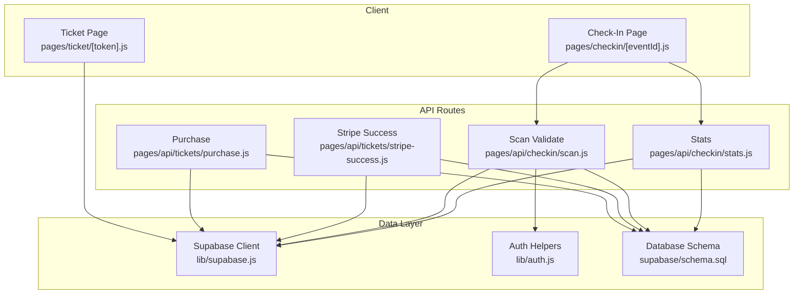
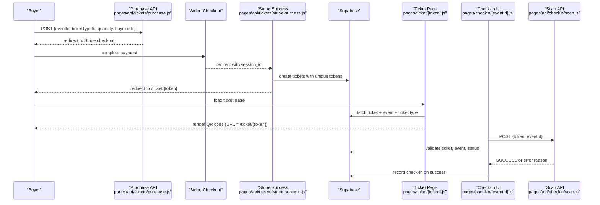
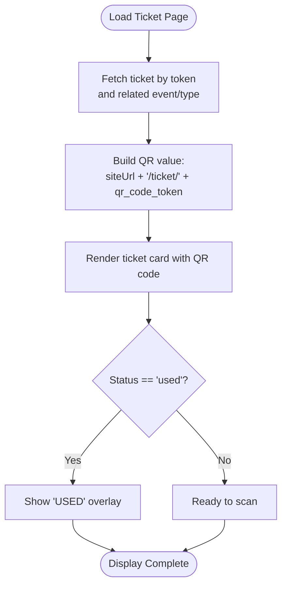
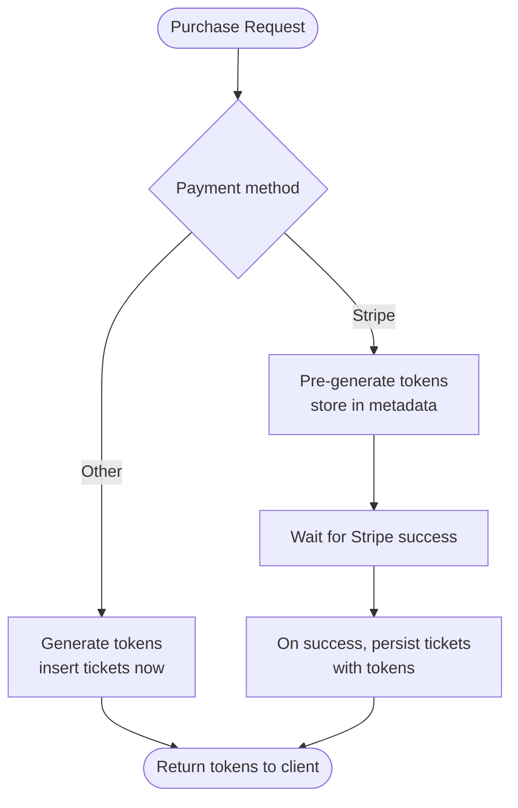
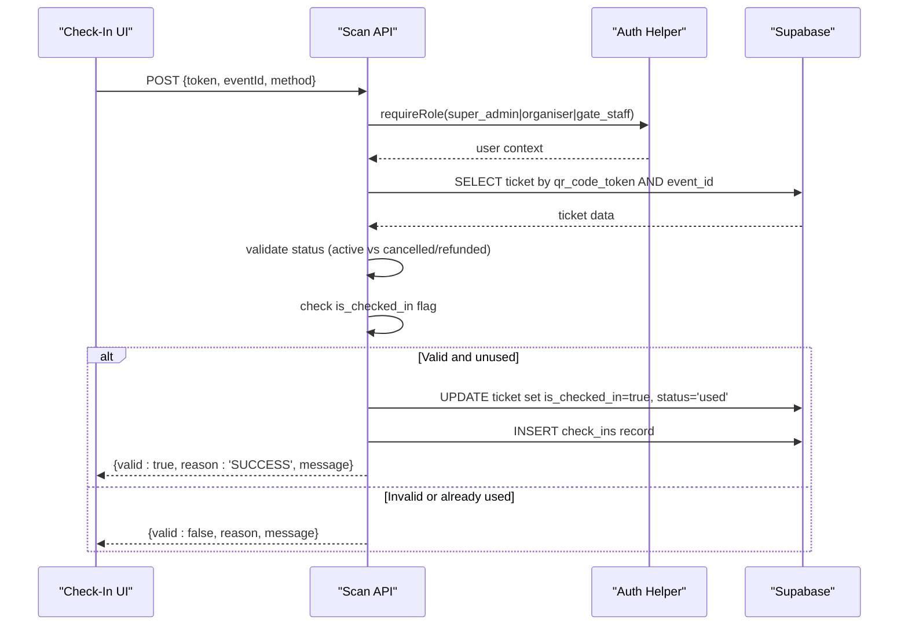
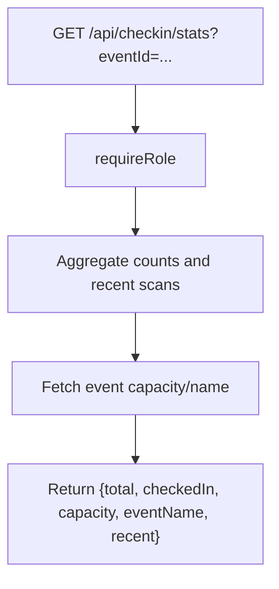
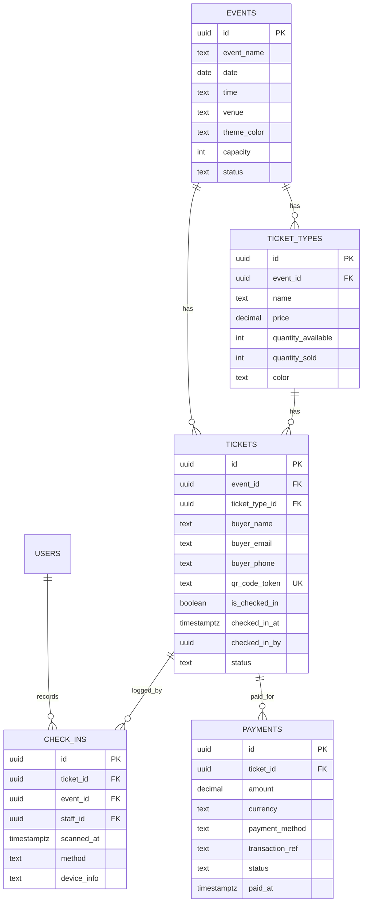
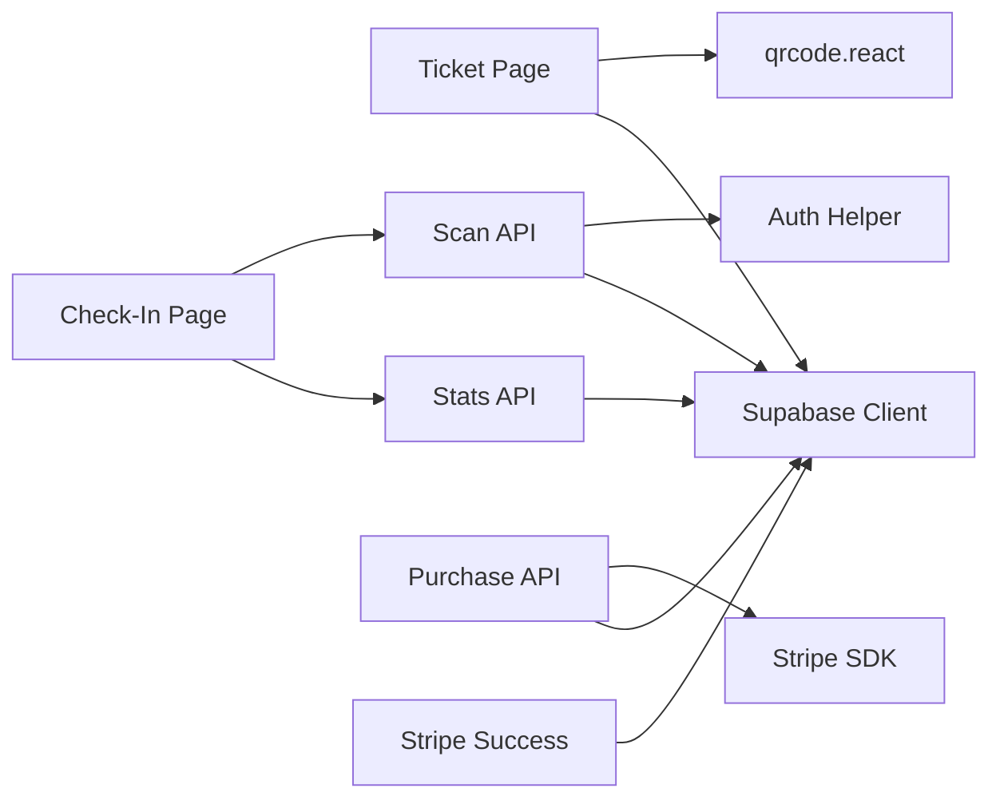

# QR Code & Ticket System

<cite>
**Referenced Files in This Document**
- [pages/ticket/[token].js](file://pages/ticket/[token].js)
- [pages/checkin/[eventId].js](file://pages/checkin/[eventId].js)
- [pages/api/checkin/scan.js](file://pages/api/checkin/scan.js)
- [pages/api/checkin/stats.js](file://pages/api/checkin/stats.js)
- [pages/api/tickets/purchase.js](file://pages/api/tickets/purchase.js)
- [pages/api/tickets/stripe-success.js](file://pages/api/tickets/stripe-success.js)
- [lib/supabase.js](file://lib/supabase.js)
- [lib/auth.js](file://lib/auth.js)
- [supabase/schema.sql](file://supabase/schema.sql)
</cite>

## Table of Contents
1. [Introduction](#introduction)
2. [Project Structure](#project-structure)
3. [Core Components](#core-components)
4. [Architecture Overview](#architecture-overview)
5. [Detailed Component Analysis](#detailed-component-analysis)
6. [Dependency Analysis](#dependency-analysis)
7. [Performance Considerations](#performance-considerations)
8. [Troubleshooting Guide](#troubleshooting-guide)
9. [Conclusion](#conclusion)

## Introduction
This document explains the QR Code & Ticket System sub-feature end-to-end: how unique ticket tokens are created, how QR codes are generated and displayed, how tickets are validated at check-in, and how attendance is tracked. It also covers customization and branding options, mobile responsiveness, security measures, and troubleshooting for scanning and display issues.

## Project Structure
The QR & Ticket feature spans a few key pages and API routes:
- Ticket display page renders the digital ticket with an embedded QR code and print functionality.
- Check-in interface supports camera-based scanning (UI), manual token entry, and USB scanner input.
- APIs handle ticket purchase, Stripe success callback, QR validation, and stats aggregation.
- Database schema defines entities for events, ticket types, tickets, check-ins, payments, and promo codes.

**Diagram sources**
- [pages/ticket/[token].js](file://pages/ticket/[token].js)
- [pages/checkin/[eventId].js](file://pages/checkin/[eventId].js)
- [pages/api/tickets/purchase.js](file://pages/api/tickets/purchase.js)
- [pages/api/tickets/stripe-success.js](file://pages/api/tickets/stripe-success.js)
- [pages/api/checkin/scan.js](file://pages/api/checkin/scan.js)
- [pages/api/checkin/stats.js](file://pages/api/checkin/stats.js)
- [lib/supabase.js](file://lib/supabase.js)
- [lib/auth.js](file://lib/auth.js)
- [supabase/schema.sql](file://supabase/schema.sql)

**Section sources**
- [pages/ticket/[token].js](file://pages/ticket/[token].js)
- [pages/checkin/[eventId].js](file://pages/checkin/[eventId].js)
- [pages/api/checkin/scan.js](file://pages/api/checkin/scan.js)
- [pages/api/checkin/stats.js](file://pages/api/checkin/stats.js)
- [pages/api/tickets/purchase.js](file://pages/api/tickets/purchase.js)
- [pages/api/tickets/stripe-success.js](file://pages/api/tickets/stripe-success.js)
- [lib/supabase.js](file://lib/supabase.js)
- [lib/auth.js](file://lib/auth.js)
- [supabase/schema.sql](file://supabase/schema.sql)

## Core Components
- Unique Token Creation: UUIDs are generated per ticket during purchase flows to ensure uniqueness and collision resistance.
- QR Code Generation: The ticket page renders a QR code that encodes a public URL pointing to the ticket view using the unique token.
- Ticket Display Interface: A responsive card shows event details, ticket type, status, and a large scannable QR code. Print support is built-in.
- Check-In Validation: Gate staff scan or paste tokens; the system validates ownership, event match, and usage state before marking as checked in.
- Attendance Tracking: Each successful check-in records a timestamp, method, and staff member for analytics and reporting.

**Section sources**
- [pages/api/tickets/purchase.js](file://pages/api/tickets/purchase.js)
- [pages/api/tickets/stripe-success.js](file://pages/api/tickets/stripe-success.js)
- [pages/ticket/[token].js](file://pages/ticket/[token].js)
- [pages/checkin/[eventId].js](file://pages/checkin/[eventId].js)
- [pages/api/checkin/scan.js](file://pages/api/checkin/scan.js)
- [pages/api/checkin/stats.js](file://pages/api/checkin/stats.js)
- [supabase/schema.sql](file://supabase/schema.sql)

## Architecture Overview
The flow from purchase to check-in involves several coordinated steps:
- Purchase creates one or more tickets with unique tokens and persists them.
- On payment success, tickets are created and the user is redirected to the first ticket’s URL.
- The ticket page generates a QR code encoding the ticket URL.
- At the gate, the check-in UI scans or accepts tokens, calls the validation API, and updates attendance.

**Diagram sources**
- [pages/api/tickets/purchase.js](file://pages/api/tickets/purchase.js)
- [pages/api/tickets/stripe-success.js](file://pages/api/tickets/stripe-success.js)
- [pages/ticket/[token].js](file://pages/ticket/[token].js)
- [pages/checkin/[eventId].js](file://pages/checkin/[eventId].js)
- [pages/api/checkin/scan.js](file://pages/api/checkin/scan.js)
- [supabase/schema.sql](file://supabase/schema.sql)

## Detailed Component Analysis

### QR Code Generation and Ticket Display
- The ticket page constructs a QR value by concatenating the site base URL with the path /ticket/{qr_code_token}.
- It uses a QR code SVG component to render a high-resolution code suitable for mobile scanning and printing.
- The page displays event name, ticket type, date/time, venue, and current status. If used, a visual overlay indicates “USED”.
- Print functionality is provided via a simple browser print call.

**Diagram sources**
- [pages/ticket/[token].js](file://pages/ticket/[token].js)

**Section sources**
- [pages/ticket/[token].js](file://pages/ticket/[token].js)

### Unique Token Creation
- For non-Stripe purchases, tokens are generated immediately and inserted into the database.
- For Stripe purchases, tokens are pre-generated and stored in metadata, then persisted upon successful payment.
- Tokens are UUIDs, providing strong uniqueness and low collision probability.

**Diagram sources**
- [pages/api/tickets/purchase.js](file://pages/api/tickets/purchase.js)
- [pages/api/tickets/stripe-success.js](file://pages/api/tickets/stripe-success.js)

**Section sources**
- [pages/api/tickets/purchase.js](file://pages/api/tickets/purchase.js)
- [pages/api/tickets/stripe-success.js](file://pages/api/tickets/stripe-success.js)

### Ticket Verification and Check-In Flow
- The check-in UI supports three modes: camera scanning (visual frame), manual token entry, and USB barcode scanners.
- The verification API enforces role-based access, validates the token belongs to the specified event, checks status, and prevents reuse.
- On success, it marks the ticket as used, records the check-in timestamp, and logs the staff member and method.

**Diagram sources**
- [pages/checkin/[eventId].js](file://pages/checkin/[eventId].js)
- [pages/api/checkin/scan.js](file://pages/api/checkin/scan.js)
- [lib/auth.js](file://lib/auth.js)
- [supabase/schema.sql](file://supabase/schema.sql)

**Section sources**
- [pages/checkin/[eventId].js](file://pages/checkin/[eventId].js)
- [pages/api/checkin/scan.js](file://pages/api/checkin/scan.js)
- [lib/auth.js](file://lib/auth.js)
- [supabase/schema.sql](file://supabase/schema.sql)

### Attendance Tracking and Stats
- The stats endpoint aggregates total tickets, checked-in count, capacity, and recent check-ins for the event.
- Recent entries include attendee names and ticket types, enabling real-time monitoring at the gate.

**Diagram sources**
- [pages/api/checkin/stats.js](file://pages/api/checkin/stats.js)
- [lib/auth.js](file://lib/auth.js)
- [supabase/schema.sql](file://supabase/schema.sql)

**Section sources**
- [pages/api/checkin/stats.js](file://pages/api/checkin/stats.js)
- [supabase/schema.sql](file://supabase/schema.sql)

### Data Model Relationships
The database schema underpins the entire QR & Ticket system:
- Events link to ticket types and tickets.
- Tickets reference buyers, event, ticket type, and store the unique QR token and check-in state.
- Check-ins log each successful scan with method and device info.
- Payments record transaction details tied to tickets.

**Diagram sources**
- [supabase/schema.sql](file://supabase/schema.sql)

**Section sources**
- [supabase/schema.sql](file://supabase/schema.sql)

## Dependency Analysis
Key dependencies and their roles:
- Supabase client provides both anonymous and service-role clients for secure server-side operations.
- Auth helpers enforce role-based access for check-in endpoints.
- QR rendering relies on a React QR code library to generate SVGs.
- Stripe integration handles payment sessions and redirects to finalize ticket creation.

**Diagram sources**
- [pages/ticket/[token].js](file://pages/ticket/[token].js)
- [pages/checkin/[eventId].js](file://pages/checkin/[eventId].js)
- [pages/api/checkin/scan.js](file://pages/api/checkin/scan.js)
- [pages/api/checkin/stats.js](file://pages/api/checkin/stats.js)
- [pages/api/tickets/purchase.js](file://pages/api/tickets/purchase.js)
- [pages/api/tickets/stripe-success.js](file://pages/api/tickets/stripe-success.js)
- [lib/supabase.js](file://lib/supabase.js)
- [lib/auth.js](file://lib/auth.js)

**Section sources**
- [lib/supabase.js](file://lib/supabase.js)
- [lib/auth.js](file://lib/auth.js)
- [pages/ticket/[token].js](file://pages/ticket/[token].js)
- [pages/checkin/[eventId].js](file://pages/checkin/[eventId].js)
- [pages/api/checkin/scan.js](file://pages/api/checkin/scan.js)
- [pages/api/checkin/stats.js](file://pages/api/checkin/stats.js)
- [pages/api/tickets/purchase.js](file://pages/api/tickets/purchase.js)
- [pages/api/tickets/stripe-success.js](file://pages/api/tickets/stripe-success.js)

## Performance Considerations
- QR Rendering: SVG-based QR codes scale well and avoid heavy image assets; keep size reasonable for fast rendering on mobile.
- Server-Side Data Fetching: Ticket page fetches only necessary fields and joins minimal relations to reduce payload.
- Check-In Throughput: Use batched queries where possible; the stats endpoint aggregates counts efficiently with head queries.
- Network Resilience: The check-in UI retries and clears stale results after short timeouts to maintain smooth scanning cadence.

[No sources needed since this section provides general guidance]

## Troubleshooting Guide

### QR Code Scanning Issues
- Symptom: Scanner does not recognize the QR code.
  - Ensure the ticket page is fully loaded and the QR code is visible without overlays.
  - Verify lighting conditions and distance; use the flash toggle in the check-in UI if available.
  - Try manual token entry or USB scanner mode when camera scanning fails.
- Symptom: “Already Used” response.
  - The ticket has been checked in previously; verify the correct ticket was presented.
  - Review the recent check-ins list to confirm the timestamp and staff who processed it.
- Symptom: “Invalid” or “Not found”.
  - Confirm the token matches the ticket shown on screen.
  - Ensure the event ID in the request matches the ticket’s event.

**Section sources**
- [pages/checkin/[eventId].js](file://pages/checkin/[eventId].js)
- [pages/api/checkin/scan.js](file://pages/api/checkin/scan.js)

### Ticket Display Problems
- Symptom: “Ticket Not Found” page.
  - The token may be incorrect or the ticket may have been cancelled/refunded.
  - Re-check the URL and ensure the environment base URL is configured correctly.
- Symptom: QR code not visible or too small.
  - Confirm the device viewport is adequate; the ticket card is optimized for mobile screens.
  - Avoid zooming out excessively; use the print function to produce a physical copy if needed.

**Section sources**
- [pages/ticket/[token].js](file://pages/ticket/[token].js)

### Check-In Stats Not Updating
- Symptom: Stats do not reflect recent scans.
  - The stats endpoint polls every 10 seconds; wait briefly or refresh the page.
  - Ensure the user has sufficient role permissions to access stats.

**Section sources**
- [pages/checkin/[eventId].js](file://pages/checkin/[eventId].js)
- [pages/api/checkin/stats.js](file://pages/api/checkin/stats.js)

### Security and Access Control
- Symptom: 401/403 errors on check-in endpoints.
  - Verify the staff session cookie and role are valid.
  - Ensure the service role key is configured for server-side operations.

**Section sources**
- [lib/auth.js](file://lib/auth.js)
- [lib/supabase.js](file://lib/supabase.js)

## Conclusion
The QR Code & Ticket System integrates robust token generation, clear ticket display, and reliable check-in validation. It leverages UUIDs for uniqueness, a simple yet effective QR encoding strategy, and strict role-based access control for gate operations. With comprehensive tracking and responsive design, it supports efficient event entry while offering customization and branding through event themes and ticket type colors.

[No sources needed since this section summarizes without analyzing specific files]