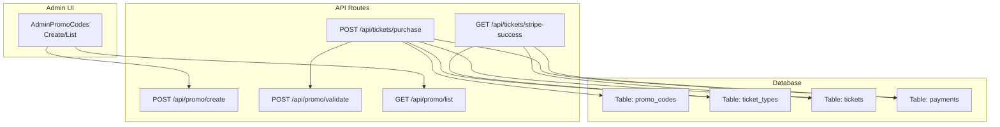
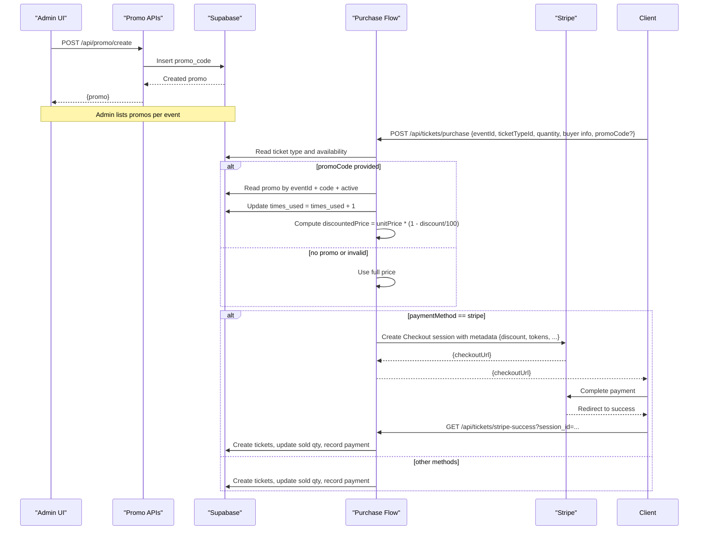
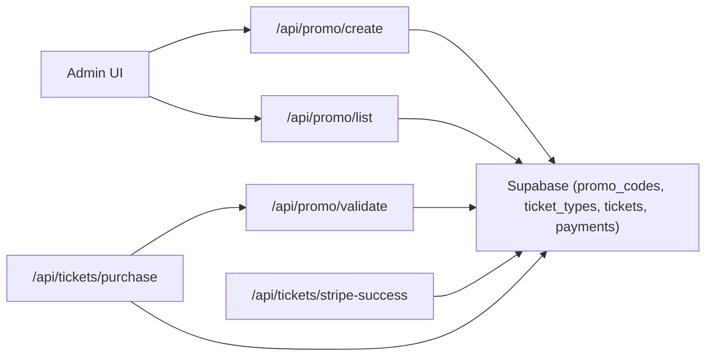

# Promo Code System

<cite>
**Referenced Files in This Document**
- [schema.sql](file://supabase/schema.sql)
- [create.js](file://pages/api/promo/create.js)
- [validate.js](file://pages/api/promo/validate.js)
- [list.js](file://pages/api/promo/list.js)
- [purchase.js](file://pages/api/tickets/purchase.js)
- [stripe-success.js](file://pages/api/tickets/stripe-success.js)
- [promo-codes.js](file://pages/admin/promo-codes.js)
- [supabase.js](file://lib/supabase.js)
- [auth.js](file://lib/auth.js)
</cite>

## Table of Contents
1. [Introduction](#introduction)
2. [Project Structure](#project-structure)
3. [Core Components](#core-components)
4. [Architecture Overview](#architecture-overview)
5. [Detailed Component Analysis](#detailed-component-analysis)
6. [Dependency Analysis](#dependency-analysis)
7. [Performance Considerations](#performance-considerations)
8. [Troubleshooting Guide](#troubleshooting-guide)
9. [Conclusion](#conclusion)
10. [Appendices](#appendices)

## Introduction
This document explains the promo code system implemented in TicketFlow. It covers how promo codes are created, validated, and applied during ticket purchases; how discount calculations are performed; and how usage is tracked to prevent overuse. It also documents the database schema for promo codes, outlines security considerations, and provides testing strategies to ensure correctness and robustness under concurrent access.

## Project Structure
The promo code feature spans a small set of API routes, an admin UI page, and the database schema:
- Admin UI: Create and list promo codes per event
- API routes: Create, validate, and list promo codes
- Purchase flow: Apply promo code and increment usage atomically
- Database schema: Define promo code fields and constraints

**Diagram sources**
- [create.js:1-23](file://pages/api/promo/create.js#L1-L23)
- [validate.js:1-27](file://pages/api/promo/validate.js#L1-L27)
- [list.js:1-15](file://pages/api/promo/list.js#L1-L15)
- [purchase.js:1-123](file://pages/api/tickets/purchase.js#L1-L123)
- [stripe-success.js:1-55](file://pages/api/tickets/stripe-success.js#L1-L55)
- [schema.sql:105-117](file://supabase/schema.sql#L105-L117)

**Section sources**
- [create.js:1-23](file://pages/api/promo/create.js#L1-L23)
- [validate.js:1-27](file://pages/api/promo/validate.js#L1-L27)
- [list.js:1-15](file://pages/api/promo/list.js#L1-L15)
- [purchase.js:1-123](file://pages/api/tickets/purchase.js#L1-L123)
- [stripe-success.js:1-55](file://pages/api/tickets/stripe-success.js#L1-L55)
- [schema.sql:105-117](file://supabase/schema.sql#L105-L117)

## Core Components
- Database schema for promo codes with validation constraints and indexes
- Admin endpoints to create and list promo codes (role-gated)
- Validation endpoint to check code validity, limits, and expiration
- Purchase endpoint that applies discounts and increments usage
- Stripe success handler that finalizes purchase using stored metadata

Key responsibilities:
- Create: Enforce role-based access and persist promo codes
- Validate: Ensure code exists, is active, within limit, and not expired
- List: Return all promo codes for a given event (admin only)
- Purchase: Compute discounted price, apply discount, and increment usage
- Stripe success: Finalize tickets and payment records after successful payment

**Section sources**
- [schema.sql:105-117](file://supabase/schema.sql#L105-L117)
- [create.js:1-23](file://pages/api/promo/create.js#L1-L23)
- [validate.js:1-27](file://pages/api/promo/validate.js#L1-L27)
- [list.js:1-15](file://pages/api/promo/list.js#L1-L15)
- [purchase.js:1-123](file://pages/api/tickets/purchase.js#L1-L123)
- [stripe-success.js:1-55](file://pages/api/tickets/stripe-success.js#L1-L55)

## Architecture Overview
The promo code workflow integrates into the purchase flow:
- Admin creates promo codes via the admin UI and the create endpoint
- During checkout, the client can optionally provide a promo code
- The purchase endpoint validates the promo code inline and applies the discount
- Usage count is incremented at purchase time
- For Stripe payments, discount information is passed through metadata and used when creating tickets and recording payments

**Diagram sources**
- [create.js:1-23](file://pages/api/promo/create.js#L1-L23)
- [purchase.js:1-123](file://pages/api/tickets/purchase.js#L1-L123)
- [stripe-success.js:1-55](file://pages/api/tickets/stripe-success.js#L1-L55)
- [schema.sql:105-117](file://supabase/schema.sql#L105-L117)

## Detailed Component Analysis

### Database Schema: promo_codes
Fields and constraints:
- id: UUID primary key
- event_id: FK to events
- code: unique per event
- discount_percent: integer between 1 and 100
- max_uses: integer, default 100
- times_used: integer, default 0
- expires_at: date, nullable
- is_active: boolean, default true
- Unique constraint on (event_id, code)

Indexes:
- No explicit index on promo_codes in the schema snippet; consider adding indexes for frequently queried columns such as event_id and code if needed.

Security:
- Row-level security enabled for promo_codes table. Policies should be configured to restrict access appropriately.

Recommendations:
- Add indexes on event_id and code for faster lookups
- Consider adding a partial index for active codes to optimize validation queries
- Enforce business rules via database triggers or policies where possible

**Section sources**
- [schema.sql:105-117](file://supabase/schema.sql#L105-L117)

### Admin UI: Create and List Promo Codes
- Presents a form to select an event, enter a code, set discount percentage, max uses, and optional expiration date
- Normalizes code to uppercase before submission
- Displays existing promo codes with usage counts, expiration, and active status

Validation and UX:
- Required fields enforced in the UI
- Error and success messages displayed to the user
- Fetches events and promo lists from API endpoints

**Section sources**
- [promo-codes.js:1-106](file://pages/admin/promo-codes.js#L1-L106)

### API: Create Promo Code
- Requires role-based authorization (super_admin or organiser)
- Validates required fields (event_id, code, discount_percent)
- Inserts a new promo code with normalized code, numeric discount, default times_used, optional expires_at, and is_active true
- Returns created promo object

Error handling:
- Returns 405 for non-POST requests
- Returns 400 for missing fields or Supabase errors
- Returns 500 for unexpected exceptions

**Section sources**
- [create.js:1-23](file://pages/api/promo/create.js#L1-L23)
- [auth.js:38-46](file://lib/auth.js#L38-L46)

### API: Validate Promo Code
- Accepts code and eventId
- Looks up promo by event_id, normalized code, and active status
- Checks usage limit and expiration
- Returns valid flag and discount details if valid

Error handling:
- Returns 405 for non-POST requests
- Returns 400 for missing parameters
- Returns JSON with valid=false and error message for invalid cases
- Returns 500 for server errors

Note:
- This endpoint does not increment usage; it is read-only validation.

**Section sources**
- [validate.js:1-27](file://pages/api/promo/validate.js#L1-L27)

### API: List Promo Codes
- Requires role-based authorization (super_admin or organiser)
- Filters promo codes by event_id and returns them ordered by creation time
- Returns empty array if none found

Error handling:
- Returns 405 for non-GET requests
- Returns 400 for missing eventId
- Returns 500 for unexpected exceptions

**Section sources**
- [list.js:1-15](file://pages/api/promo/list.js#L1-L15)
- [auth.js:38-46](file://lib/auth.js#L38-L46)

### Purchase Flow: Apply Discount and Increment Usage
- Validates required purchase fields
- Reads ticket type and checks availability
- If promo code provided:
  - Reads promo by event_id, normalized code, and active status
  - Checks times_used < max_uses and expiration
  - Applies discount percent to compute discounted price
  - Increments times_used by 1 immediately
- Computes discounted price and proceeds with payment method logic
- For Stripe:
  - Creates a checkout session with metadata including discount and pre-generated tokens
  - On success, creates tickets, updates sold quantities, and records payment using metadata
- For other payment methods:
  - Creates tickets immediately, updates sold quantities, and records payment

Concurrency and atomicity:
- The current implementation reads promo, checks conditions, and then updates times_used in separate calls. This introduces a race condition risk under high concurrency. See recommendations below.

Error handling:
- Returns appropriate HTTP status codes and error messages for failures
- Logs errors and returns generic messages to clients

**Section sources**
- [purchase.js:1-123](file://pages/api/tickets/purchase.js#L1-L123)
- [stripe-success.js:1-55](file://pages/api/tickets/stripe-success.js#L1-L55)

### Stripe Success Handler
- Retrieves Stripe session and verifies payment status
- Extracts metadata (eventId, ticketTypeId, quantity, buyer info, tokens, discount)
- Creates tickets, updates ticket type sold quantity, and records payment
- Redirects to first ticket page

Error handling:
- Redirects with error query parameters on failure
- Logs errors

**Section sources**
- [stripe-success.js:1-55](file://pages/api/tickets/stripe-success.js#L1-L55)

## Dependency Analysis
- Admin UI depends on promo create and list endpoints
- Purchase flow depends on promo validation logic and database tables
- Stripe success handler depends on metadata passed from purchase flow
- All server-side operations use the service role client for privileged access
- Role-based authorization is enforced via auth utilities

**Diagram sources**
- [create.js:1-23](file://pages/api/promo/create.js#L1-L23)
- [validate.js:1-27](file://pages/api/promo/validate.js#L1-L27)
- [list.js:1-15](file://pages/api/promo/list.js#L1-L15)
- [purchase.js:1-123](file://pages/api/tickets/purchase.js#L1-L123)
- [stripe-success.js:1-55](file://pages/api/tickets/stripe-success.js#L1-L55)
- [supabase.js:1-23](file://lib/supabase.js#L1-L23)

**Section sources**
- [supabase.js:1-23](file://lib/supabase.js#L1-L23)
- [auth.js:1-47](file://lib/auth.js#L1-L47)

## Performance Considerations
- Query optimization:
  - Add indexes on promo_codes.event_id and promo_codes.code to speed up validation and listing
  - Consider a partial index on active promo codes to reduce scan size
- Concurrency:
  - Replace read-check-update pattern with an atomic increment operation to avoid race conditions
  - Use database transactions or row-level locking to ensure consistent state
- Caching:
  - Cache promo code validation results briefly for hot codes to reduce DB load
  - Invalidate cache on promo updates

[No sources needed since this section provides general guidance]

## Troubleshooting Guide
Common issues and resolutions:
- Invalid promo code:
  - Ensure code matches exactly (case-insensitive normalization is applied)
  - Verify the promo is associated with the correct event_id
  - Check is_active flag and expiration date
- Usage limit reached:
  - Confirm max_uses and times_used values
  - Investigate concurrent purchases that may have exhausted the limit
- Expiration errors:
  - Verify expires_at is set correctly and timezone considerations
- Authorization errors:
  - Ensure admin roles are properly authenticated for create/list endpoints
- Payment discrepancies:
  - For Stripe, verify metadata includes correct discount and tokens
  - Confirm payment status before creating tickets

**Section sources**
- [validate.js:1-27](file://pages/api/promo/validate.js#L1-L27)
- [purchase.js:1-123](file://pages/api/tickets/purchase.js#L1-L123)
- [stripe-success.js:1-55](file://pages/api/tickets/stripe-success.js#L1-L55)
- [auth.js:38-46](file://lib/auth.js#L38-L46)

## Conclusion
The promo code system provides a straightforward mechanism for applying percentage discounts to ticket purchases with basic usage tracking and expiration controls. While functional, the current implementation has room for improvement in concurrency safety and performance. Adopting atomic operations and indexing will enhance reliability and scalability. Security measures like role-based access control and service role usage are in place, but additional hardening (e.g., rate limiting, input sanitization, RLS policies) is recommended.

[No sources needed since this section summarizes without analyzing specific files]

## Appendices

### Example Scenarios

- Applying a promo code during purchase:
  - Client sends purchase request with promoCode
  - Server finds matching active promo for the event
  - Server checks usage limit and expiration
  - Server computes discounted price and increments usage
  - Server proceeds with payment method flow

- Validation rules:
  - Code must exist for the specified event
  - Code must be active
  - times_used must be less than max_uses
  - expires_at must be in the future if set

- Error handling examples:
  - Missing fields return 400
  - Invalid code returns valid=false with error message
  - Overuse returns valid=false with error message
  - Expired code returns valid=false with error message
  - Server errors return 500

**Section sources**
- [purchase.js:1-123](file://pages/api/tickets/purchase.js#L1-L123)
- [validate.js:1-27](file://pages/api/promo/validate.js#L1-L27)

### Atomic Operations and Preventing Overuse
Current behavior:
- Separate read and update calls introduce race conditions

Recommended approach:
- Use a single SQL statement to atomically increment times_used while checking constraints
- Implement a database function or trigger to enforce max_uses and expiration
- Wrap purchase steps in a transaction to ensure consistency

[No sources needed since this section provides general guidance]

### Security Considerations and Fraud Prevention
- Role-based access control for admin endpoints
- Service role client for privileged database operations
- Input validation and normalization
- Rate limiting on validation and purchase endpoints
- Audit logging for promo code usage
- Monitor anomalies (e.g., rapid usage spikes)

[No sources needed since this section provides general guidance]

### Testing Strategies
- Unit tests:
  - Validate discount calculation formulas
  - Test promo code normalization and field validation
- Integration tests:
  - End-to-end purchase flow with promo codes
  - Concurrent purchase scenarios to verify atomicity
- Edge cases:
  - Expired codes, inactive codes, max_uses reached
  - Mixed payment methods and Stripe metadata handling
- Load testing:
  - Simulate high concurrency to identify race conditions

[No sources needed since this section provides general guidance]