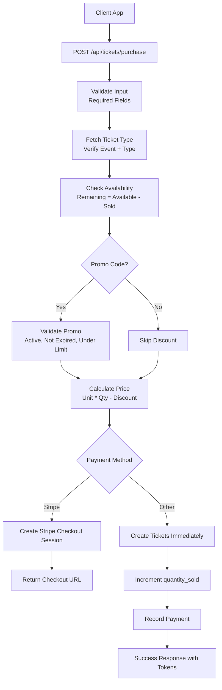
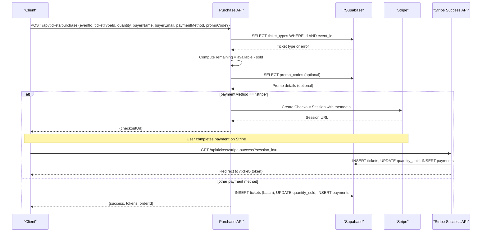
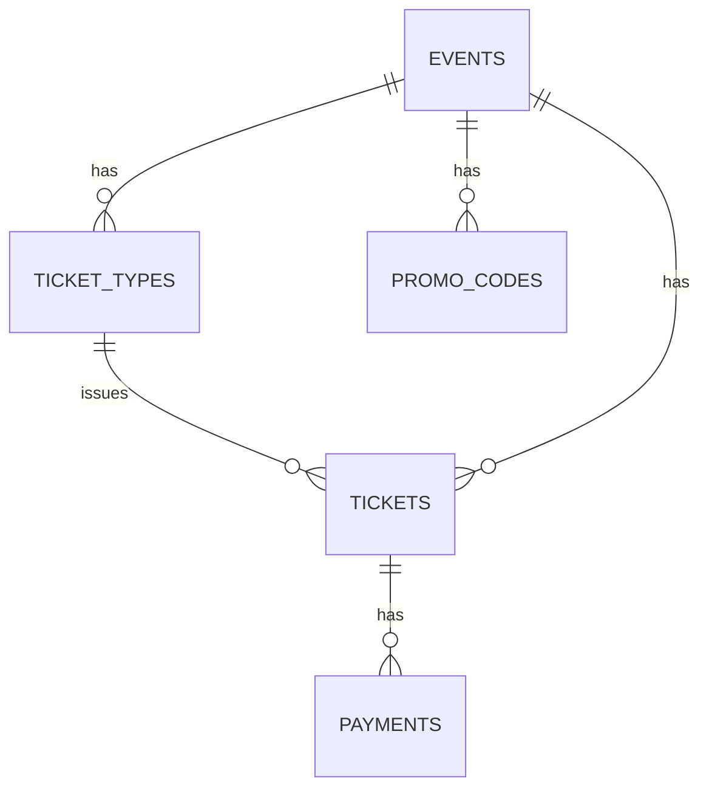
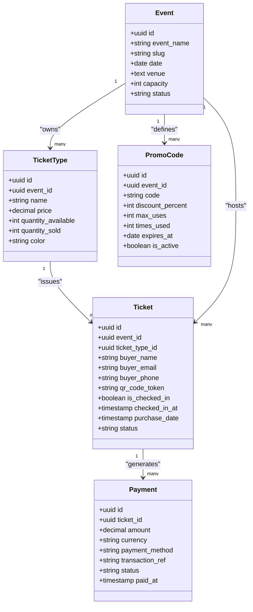
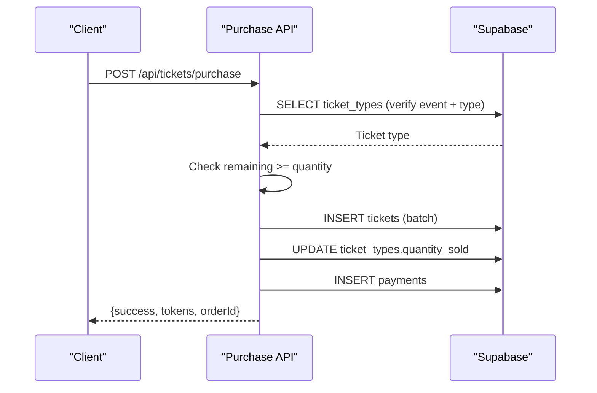
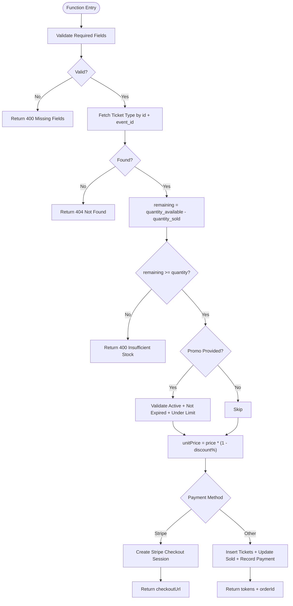
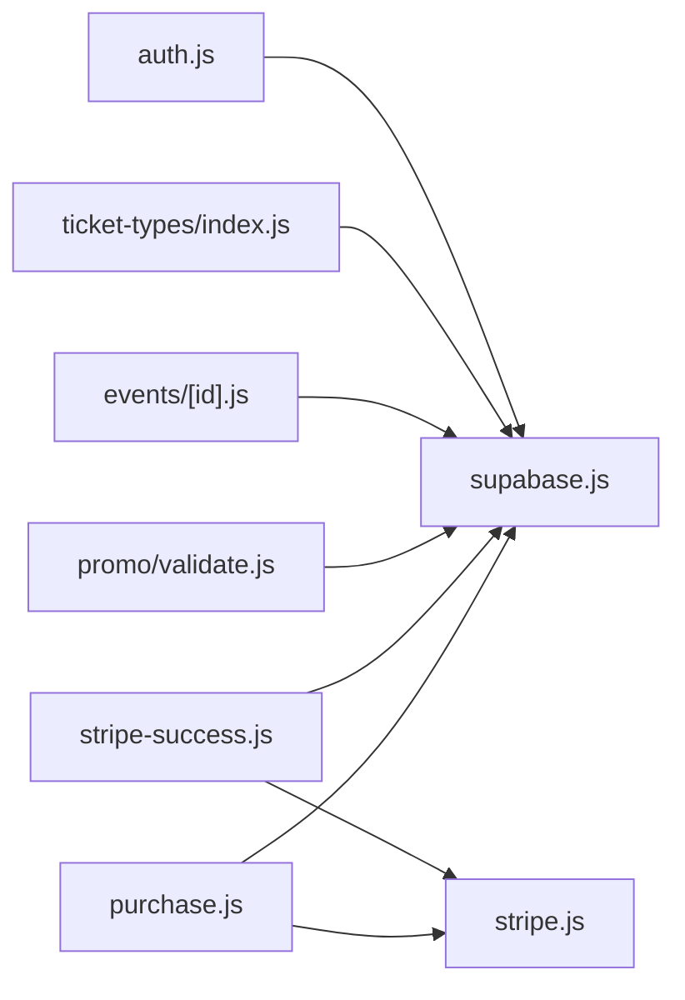

# Purchase Workflow & Validation

<cite>
**Referenced Files in This Document**
- [purchase.js](file://pages/api/tickets/purchase.js)
- [stripe-success.js](file://pages/api/tickets/stripe-success.js)
- [schema.sql](file://supabase/schema.sql)
- [supabase.js](file://lib/supabase.js)
- [stripe.js](file://lib/stripe.js)
- [validate.js](file://pages/api/promo/validate.js)
- [events-id.js](file://pages/api/events/[id].js)
- [ticket-types-index.js](file://pages/api/ticket-types/index.js)
- [auth.js](file://lib/auth.js)
</cite>

## Table of Contents
1. [Introduction](#introduction)
2. [Project Structure](#project-structure)
3. [Core Components](#core-components)
4. [Architecture Overview](#architecture-overview)
5. [Detailed Component Analysis](#detailed-component-analysis)
6. [Dependency Analysis](#dependency-analysis)
7. [Performance Considerations](#performance-considerations)
8. [Troubleshooting Guide](#troubleshooting-guide)
9. [Conclusion](#conclusion)

## Introduction
This document explains the complete ticket purchase workflow and validation system, from request validation through inventory checks to payment processing. It covers input validation rules, required fields, error handling patterns, ticket type verification, availability logic, remaining ticket calculations, promo code application, and the relationship between events, ticket types, tickets, payments, and promo codes. It also addresses concurrent purchase handling and race condition prevention mechanisms present in the current implementation.

## Project Structure
The purchase flow is implemented as a set of Next.js API routes backed by Supabase for data persistence and Stripe for checkout. The key files involved are:
- Ticket purchase endpoint: pages/api/tickets/purchase.js
- Stripe success callback: pages/api/tickets/stripe-success.js
- Database schema: supabase/schema.sql
- Supabase client utilities: lib/supabase.js
- Stripe client utility: lib/stripe.js
- Promo code validation: pages/api/promo/validate.js
- Event and ticket-type endpoints (for context): pages/api/events/[id].js, pages/api/ticket-types/index.js
- Authentication helpers (for context): lib/auth.js

**Diagram sources**
- [purchase.js:1-123](file://pages/api/tickets/purchase.js#L1-L123)
- [stripe-success.js:1-55](file://pages/api/tickets/stripe-success.js#L1-L55)
- [schema.sql:45-102](file://supabase/schema.sql#L45-L102)

**Section sources**
- [purchase.js:1-123](file://pages/api/tickets/purchase.js#L1-L123)
- [stripe-success.js:1-55](file://pages/api/tickets/stripe-success.js#L1-L55)
- [schema.sql:45-102](file://supabase/schema.sql#L45-L102)

## Core Components
- Request validation and required fields: Ensures eventId, ticketTypeId, quantity, buyerName, buyerEmail are present; returns 400 if missing.
- Ticket type verification: Confirms the ticket type exists and belongs to the specified event; returns 404 if not found.
- Availability check: Computes remaining tickets as quantity_available - quantity_sold; rejects requests exceeding available stock.
- Promo code application: Validates active, non-expired promo codes within usage limits; applies discount percentage to unit price.
- Payment processing:
  - Stripe: Creates a checkout session with metadata containing purchase details and pre-generated tokens; returns a checkout URL.
  - Other methods: Creates tickets immediately, increments quantity_sold, records payment, and returns tokens.
- Post-payment confirmation (Stripe): On success, creates tickets, updates inventory, records payment with transaction reference, and redirects to the first ticket page.

**Section sources**
- [purchase.js:7-26](file://pages/api/tickets/purchase.js#L7-L26)
- [purchase.js:27-45](file://pages/api/tickets/purchase.js#L27-L45)
- [purchase.js:46-76](file://pages/api/tickets/purchase.js#L46-L76)
- [purchase.js:78-117](file://pages/api/tickets/purchase.js#L78-L117)
- [stripe-success.js:14-49](file://pages/api/tickets/stripe-success.js#L14-L49)

## Architecture Overview
The purchase architecture follows a clear sequence:
- Client sends a POST request to the purchase endpoint with required fields and optional promo code.
- Server validates inputs, verifies ticket type against event, checks availability, and optionally applies promo discounts.
- For Stripe, server creates a checkout session and returns a URL; after payment, Stripe calls the success endpoint to finalize ticket creation and payment recording.
- For other payment methods, server creates tickets immediately, updates inventory, records payment, and returns tokens.

**Diagram sources**
- [purchase.js:7-117](file://pages/api/tickets/purchase.js#L7-L117)
- [stripe-success.js:14-49](file://pages/api/tickets/stripe-success.js#L14-L49)

## Detailed Component Analysis

### Input Validation and Required Fields
- Required fields: eventId, ticketTypeId, quantity, buyerName, buyerEmail. Missing any results in a 400 response with an error message.
- Optional fields: buyerPhone, paymentMethod, promoCode.
- Error pattern: JSON responses with an "error" field and appropriate HTTP status codes.

**Section sources**
- [purchase.js:7-9](file://pages/api/tickets/purchase.js#L7-L9)

### Ticket Type Verification and Availability Logic
- Ticket type must exist and belong to the specified event; otherwise returns 404.
- Remaining tickets calculated as quantity_available - quantity_sold; request rejected if insufficient stock.
- Returns specific error indicating remaining count when insufficient.

**Section sources**
- [purchase.js:15-25](file://pages/api/tickets/purchase.js#L15-L25)

### Promo Code Application
- Promo code validation endpoint ensures code is active, not expired, and under max_uses.
- Purchase endpoint applies discount percentage to unit price; increments times_used atomically during purchase.

**Section sources**
- [validate.js:8-22](file://pages/api/promo/validate.js#L8-L22)
- [purchase.js:27-41](file://pages/api/tickets/purchase.js#L27-L41)

### Payment Processing Paths
- Stripe path:
  - Pre-generates unique tokens per ticket and embeds them in Stripe session metadata.
  - Creates a checkout session with line items reflecting discounted unit price and quantity.
  - Returns checkout URL; finalization occurs via stripe-success endpoint.
- Other payment methods:
  - Generates tokens and inserts tickets in batch.
  - Increments quantity_sold and records payment with status depending on method.

**Section sources**
- [purchase.js:46-76](file://pages/api/tickets/purchase.js#L46-L76)
- [purchase.js:78-117](file://pages/api/tickets/purchase.js#L78-L117)

### Stripe Success Callback
- Retrieves Stripe session and verifies payment_status is paid.
- Parses metadata to reconstruct purchase details and tokens.
- Inserts tickets, updates quantity_sold, records payment with transaction reference, and redirects to the first ticket page.

**Section sources**
- [stripe-success.js:14-49](file://pages/api/tickets/stripe-success.js#L14-L49)

### Data Model Relationships
- Events have many ticket types.
- Ticket types track quantity_available and quantity_sold.
- Tickets link to events and ticket types, store buyer info and unique QR token, and maintain status.
- Payments link to tickets and record amount, currency, method, status, and timestamps.
- Promo codes are scoped to events and enforce usage limits and expiration.

**Diagram sources**
- [schema.sql:24-117](file://supabase/schema.sql#L24-L117)

### Class Diagram of Key Entities

**Diagram sources**
- [schema.sql:24-117](file://supabase/schema.sql#L24-L117)

### Sequence Diagram: Non-Stripe Purchase Flow

**Diagram sources**
- [purchase.js:78-117](file://pages/api/tickets/purchase.js#L78-L117)

### Flowchart: Availability Calculation and Decision

**Diagram sources**
- [purchase.js:7-117](file://pages/api/tickets/purchase.js#L7-L117)

## Dependency Analysis
- API routes depend on Supabase service client for database operations.
- Stripe integration uses environment variables for secret keys; both purchase and success endpoints create Stripe clients dynamically.
- Auth helpers provide role-based access control for admin endpoints but are not used in public purchase flows.
- Schema defines relationships and constraints that ensure referential integrity and consistent state across entities.

**Diagram sources**
- [purchase.js:1-123](file://pages/api/tickets/purchase.js#L1-L123)
- [stripe-success.js:1-55](file://pages/api/tickets/stripe-success.js#L1-L55)
- [validate.js:1-27](file://pages/api/promo/validate.js#L1-L27)
- [supabase.js:1-23](file://lib/supabase.js#L1-L23)
- [stripe.js:1-6](file://lib/stripe.js#L1-L6)
- [events-id.js:1-42](file://pages/api/events/[id].js#L1-L42)
- [ticket-types-index.js:1-49](file://pages/api/ticket-types/index.js#L1-L49)
- [auth.js:1-47](file://lib/auth.js#L1-L47)

**Section sources**
- [supabase.js:1-23](file://lib/supabase.js#L1-L23)
- [stripe.js:1-6](file://lib/stripe.js#L1-L6)
- [auth.js:1-47](file://lib/auth.js#L1-L47)

## Performance Considerations
- Batch insert of tickets reduces round-trips compared to individual inserts.
- Incrementing quantity_sold is a simple update; consider using atomic increments or transactions for high concurrency scenarios.
- Stripe checkout offloads payment processing to Stripe, reducing server load during payment steps.
- Indexes on frequently queried columns (e.g., qr_code_token, event_id) improve lookup performance.

[No sources needed since this section provides general guidance]

## Troubleshooting Guide
Common errors and their causes:
- Missing required fields: Ensure all mandatory fields are provided in the purchase request.
- Ticket type not found: Verify the ticketTypeId corresponds to the specified eventId.
- Insufficient stock: Check remaining tickets; adjust quantity or restock.
- Invalid promo code: Confirm the code is active, not expired, and has remaining uses.
- Stripe payment failure: Verify payment_status is paid before finalizing; handle redirect errors gracefully.
- Database insertion failures: Review Supabase logs and constraints; ensure unique constraints (e.g., qr_code_token) are respected.

Error handling patterns:
- Consistent JSON error responses with descriptive messages.
- Appropriate HTTP status codes (400, 404, 500).
- Logging errors for debugging while returning user-friendly messages.

**Section sources**
- [purchase.js:7-9](file://pages/api/tickets/purchase.js#L7-L9)
- [purchase.js:15-25](file://pages/api/tickets/purchase.js#L15-L25)
- [purchase.js:27-41](file://pages/api/tickets/purchase.js#L27-L41)
- [stripe-success.js:14-49](file://pages/api/tickets/stripe-success.js#L14-L49)

## Conclusion
The purchase workflow integrates robust input validation, ticket type verification, availability checks, promo code application, and flexible payment processing. While the current implementation handles typical flows effectively, it lacks explicit transactional guarantees and locking mechanisms for concurrent purchases. To prevent race conditions at scale, consider implementing database-level transactions or row-level locks around inventory updates and ticket creation.

[No sources needed since this section summarizes without analyzing specific files]