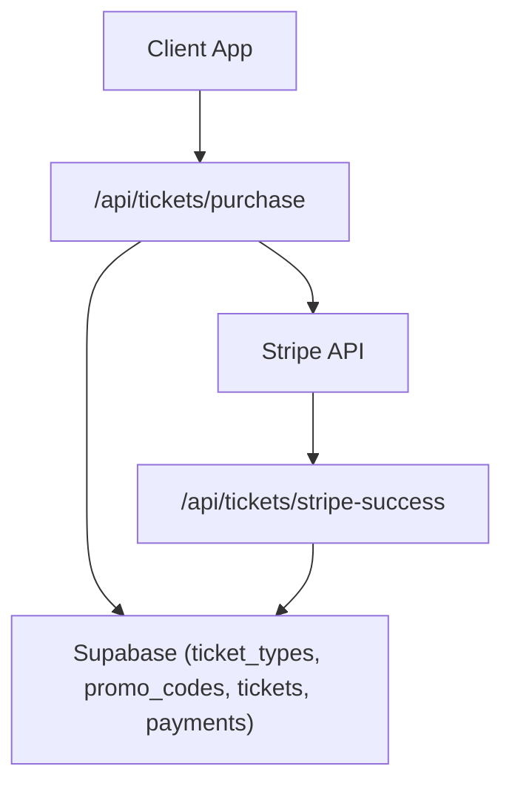
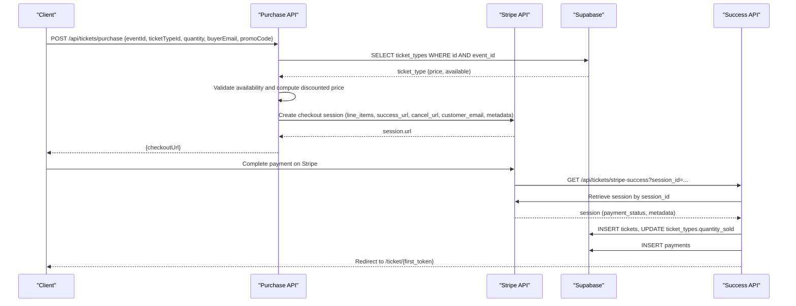
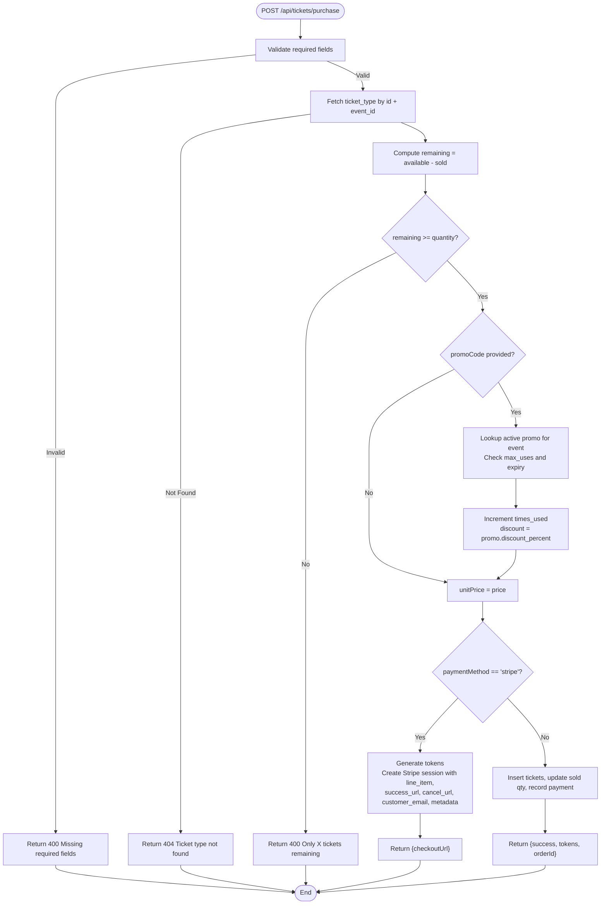
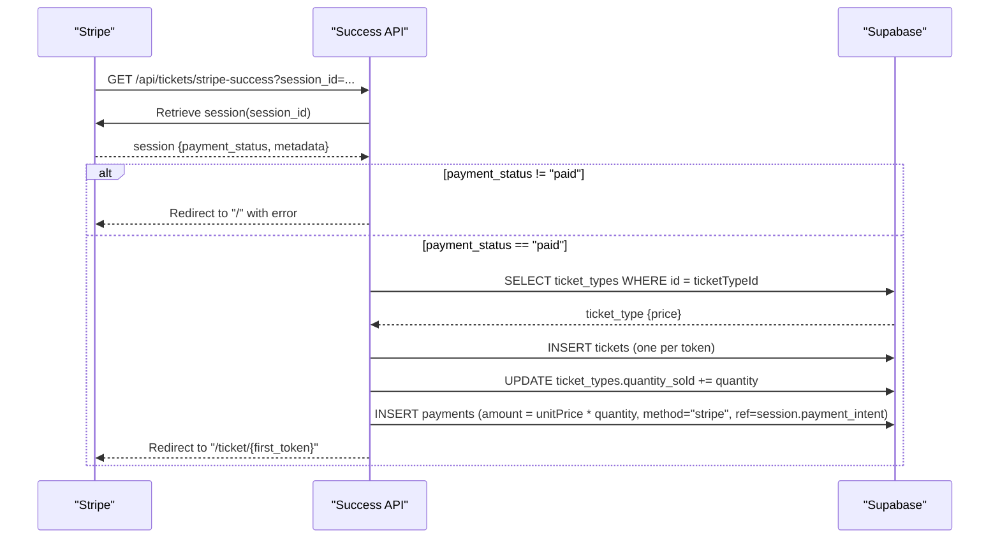
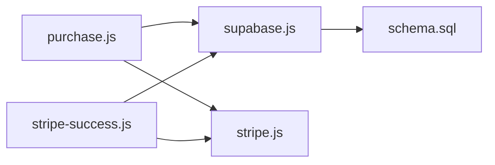

# Stripe Checkout Session Creation

<cite>
**Referenced Files in This Document**
- [purchase.js](file://pages/api/tickets/purchase.js)
- [stripe-success.js](file://pages/api/tickets/stripe-success.js)
- [stripe.js](file://lib/stripe.js)
- [supabase.js](file://lib/supabase.js)
- [schema.sql](file://supabase/schema.sql)
- [validate.js](file://pages/api/promo/validate.js)
</cite>

## Table of Contents
1. [Introduction](#introduction)
2. [Project Structure](#project-structure)
3. [Core Components](#core-components)
4. [Architecture Overview](#architecture-overview)
5. [Detailed Component Analysis](#detailed-component-analysis)
6. [Dependency Analysis](#dependency-analysis)
7. [Performance Considerations](#performance-considerations)
8. [Troubleshooting Guide](#troubleshooting-guide)
9. [Conclusion](#conclusion)

## Introduction
This document explains how the purchase API endpoint validates ticket availability, applies promo code discounts, and creates a Stripe checkout session with embedded metadata. It also covers the success handler that persists tickets and payments after payment confirmation, including currency handling, line items setup, success/cancel URLs, customer email integration, dynamic pricing, quantity handling, token generation, error handling scenarios, validation failures, and retry mechanisms. Finally, it clarifies the relationship between database operations and Stripe session creation.

## Project Structure
The relevant parts of the project for Stripe checkout session creation are:
- API route to create checkout sessions and persist non-Stripe purchases
- Success handler to finalize Stripe payments and persist data
- Stripe client configuration
- Supabase client utilities for database access
- Database schema defining entities involved in the flow
- Promo code validation endpoint used by the purchase flow

**Diagram sources**
- [purchase.js:1-123](file://pages/api/tickets/purchase.js#L1-L123)
- [stripe-success.js:1-55](file://pages/api/tickets/stripe-success.js#L1-L55)
- [supabase.js:1-23](file://lib/supabase.js#L1-L23)
- [schema.sql:45-117](file://supabase/schema.sql#L45-L117)

**Section sources**
- [purchase.js:1-123](file://pages/api/tickets/purchase.js#L1-L123)
- [stripe-success.js:1-55](file://pages/api/tickets/stripe-success.js#L1-L55)
- [supabase.js:1-23](file://lib/supabase.js#L1-L23)
- [schema.sql:45-117](file://supabase/schema.sql#L45-L117)

## Core Components
- Purchase API (/api/tickets/purchase): Validates inputs, checks ticket availability, applies promo codes, and either creates a Stripe checkout session or directly issues tickets for other payment methods.
- Stripe Success Handler (/api/tickets/stripe-success): Retrieves the Stripe session, verifies payment status, persists tickets and payments, updates inventory, and redirects to the first ticket page.
- Stripe Client Configuration: Initializes the Stripe SDK with the secret key and API version.
- Supabase Client Utilities: Provides service-role client for server-side database writes.
- Database Schema: Defines events, ticket types, tickets, payments, and promo codes.

**Section sources**
- [purchase.js:1-123](file://pages/api/tickets/purchase.js#L1-L123)
- [stripe-success.js:1-55](file://pages/api/tickets/stripe-success.js#L1-L55)
- [stripe.js:1-6](file://lib/stripe.js#L1-L6)
- [supabase.js:1-23](file://lib/supabase.js#L1-L23)
- [schema.sql:45-117](file://supabase/schema.sql#L45-L117)

## Architecture Overview
The end-to-end flow for Stripe-based purchases:
- The client calls /api/tickets/purchase with event, ticket type, quantity, buyer details, and optional promo code.
- The server validates required fields, fetches the ticket type, computes remaining capacity, and applies promo discount if valid.
- For Stripe, the server generates unique tokens per ticket, constructs a checkout session with line items, success/cancel URLs, customer email, and metadata containing all necessary context.
- After successful payment, Stripe redirects to /api/tickets/stripe-success with the session ID.
- The success handler retrieves the session, confirms payment status, inserts tickets, updates inventory, records payment, and redirects to the first ticket page.

**Diagram sources**
- [purchase.js:14-76](file://pages/api/tickets/purchase.js#L14-L76)
- [stripe-success.js:7-49](file://pages/api/tickets/stripe-success.js#L7-L49)
- [schema.sql:45-117](file://supabase/schema.sql#L45-L117)

## Detailed Component Analysis

### Purchase API: Validation, Availability, Promo Codes, and Stripe Session Creation
Key responsibilities:
- Input validation: Ensures eventId, ticketTypeId, quantity, buyerName, and buyerEmail are present.
- Ticket availability check: Fetches ticket type by id and event_id; calculates remaining = quantity_available - quantity_sold; rejects if insufficient stock.
- Promo code application: If provided, looks up an active promo code for the event, checks usage limits and expiration, increments times_used atomically, and computes discounted unit price.
- Stripe checkout session creation: Generates one UUID per ticket, builds line item with currency USD, product name derived from ticket type, unit amount in cents using discounted price, sets mode to payment, success and cancel URLs, customer email, and metadata embedding eventId, ticketTypeId, quantity, buyer info, tokens, and discount.
- Non-Stripe paths: For other payment methods, immediately inserts tickets, updates sold quantity, and records payment.

Important implementation notes:
- Currency is hardcoded to USD in the line item.
- Discount is applied before creating the Stripe line item.
- Metadata includes comma-separated tokens for later persistence.
- Error responses include appropriate HTTP status codes for missing fields, not found, insufficient stock, and general failures.

**Diagram sources**
- [purchase.js:4-76](file://pages/api/tickets/purchase.js#L4-L76)

**Section sources**
- [purchase.js:4-76](file://pages/api/tickets/purchase.js#L4-L76)

### Stripe Success Handler: Finalizing Payments and Persisting Data
Responsibilities:
- Retrieve the Stripe session by session_id from query parameters.
- Verify payment_status is paid; otherwise redirect with error.
- Parse metadata to obtain eventId, ticketTypeId, quantity, buyer info, tokens, and discount.
- Fetch ticket type to compute final unit price with discount.
- Insert tickets using pre-generated tokens, update ticket_types.quantity_sold, and record a payment entry with transaction reference from Stripe.
- Redirect to the first ticket’s public page.

Error handling:
- Missing session_id leads to redirect to home.
- Payment not paid leads to redirect with error.
- Invalid event or processing errors lead to redirect with error messages.

**Diagram sources**
- [stripe-success.js:3-49](file://pages/api/tickets/stripe-success.js#L3-L49)

**Section sources**
- [stripe-success.js:3-49](file://pages/api/tickets/stripe-success.js#L3-L49)

### Stripe Client Configuration
- A dedicated module initializes the Stripe SDK with the secret key and API version.
- The purchase and success handlers instantiate Stripe clients inline using environment variables; this duplication can be consolidated into the shared stripe module for consistency.

**Section sources**
- [stripe.js:1-6](file://lib/stripe.js#L1-L6)
- [purchase.js:47-76](file://pages/api/tickets/purchase.js#L47-L76)
- [stripe-success.js:8-10](file://pages/api/tickets/stripe-success.js#L8-L10)

### Supabase Client Utilities
- Provides both anonymous and service-role clients.
- The purchase and success handlers use the service-role client to perform writes and reads without RLS constraints.

**Section sources**
- [supabase.js:10-22](file://lib/supabase.js#L10-L22)
- [purchase.js:11](file://pages/api/tickets/purchase.js#L11)
- [stripe-success.js:16](file://pages/api/tickets/stripe-success.js#L16)

### Database Schema Entities Involved
- ticket_types: Holds price, quantity_available, quantity_sold, and links to events.
- tickets: Stores individual ticket records with unique qr_code_token and buyer details.
- payments: Records payment transactions linked to tickets, including amount, currency, method, and status.
- promo_codes: Tracks discount percent, usage limits, expiration, and activity flags.

**Section sources**
- [schema.sql:45-117](file://supabase/schema.sql#L45-L117)

### Promo Code Validation Endpoint
- Validates promo codes independently, checking activity, usage limits, and expiration.
- The purchase flow uses similar logic inline to apply discounts and increment usage atomically.

**Section sources**
- [validate.js:3-26](file://pages/api/promo/validate.js#L3-L26)
- [purchase.js:27-41](file://pages/api/tickets/purchase.js#L27-L41)

## Dependency Analysis
- purchase.js depends on:
  - Supabase service client for reading ticket_types and promo_codes, writing tickets and payments, and updating inventory.
  - Stripe SDK for creating checkout sessions.
  - uuid library for generating unique tokens.
- stripe-success.js depends on:
  - Stripe SDK for retrieving sessions.
  - Supabase service client for inserting tickets and payments and updating inventory.
- stripe.js provides a reusable Stripe client instance.
- supabase.js provides Supabase clients for server-side operations.
- schema.sql defines relational constraints and indexes used across these components.

**Diagram sources**
- [purchase.js:1-123](file://pages/api/tickets/purchase.js#L1-L123)
- [stripe-success.js:1-55](file://pages/api/tickets/stripe-success.js#L1-L55)
- [supabase.js:1-23](file://lib/supabase.js#L1-L23)
- [stripe.js:1-6](file://lib/stripe.js#L1-L6)
- [schema.sql:45-117](file://supabase/schema.sql#L45-L117)

**Section sources**
- [purchase.js:1-123](file://pages/api/tickets/purchase.js#L1-L123)
- [stripe-success.js:1-55](file://pages/api/tickets/stripe-success.js#L1-L55)
- [supabase.js:1-23](file://lib/supabase.js#L1-L23)
- [stripe.js:1-6](file://lib/stripe.js#L1-L6)
- [schema.sql:45-117](file://supabase/schema.sql#L45-L117)

## Performance Considerations
- Avoid redundant Stripe client instantiation by centralizing initialization in stripe.js and importing it where needed.
- Batch database operations where possible; currently, ticket inserts are performed row-by-row within loops, which may be optimized via bulk insert APIs.
- Ensure proper indexing on frequently queried columns (already defined in schema.sql).
- Use atomic transactions for critical sequences (e.g., reserving tickets and recording payments) to prevent race conditions under high concurrency.
- Cache frequently accessed ticket type data at the edge or within the API process to reduce database load.

[No sources needed since this section provides general guidance]

## Troubleshooting Guide
Common error scenarios and their handling:
- Missing required fields in purchase request: Returns 400 with error message.
- Ticket type not found: Returns 404 with error message.
- Insufficient ticket availability: Returns 400 indicating remaining count.
- Invalid or expired promo code: Inline validation prevents discount application; separate validate endpoint returns detailed reasons.
- Stripe session creation failure: Caught by try/catch and returns 500 with generic error message.
- Stripe success handler failures: Missing session_id or unpaid status results in redirects with error indicators; processing errors redirect to home with error.

Retry mechanisms:
- No explicit retry logic is implemented in the current codebase. For robustness, consider implementing exponential backoff for transient network errors when calling Stripe or Supabase.
- Idempotency: Ensure that duplicate requests do not create duplicate tickets or payments. For Stripe, leverage idempotency keys when creating sessions or charges.

Validation failures:
- Enforce input validation on the client and server sides.
- Add rate limiting to prevent abuse of promo code validation and purchase endpoints.

Database vs Stripe session creation relationship:
- Tickets and payments are persisted only after successful payment confirmation in the success handler.
- Inventory updates (quantity_sold) occur after successful payment to avoid premature reservation.
- For non-Stripe payments, tickets are issued immediately; ensure external payment verification before issuing tickets in production.

**Section sources**
- [purchase.js:4-122](file://pages/api/tickets/purchase.js#L4-L122)
- [stripe-success.js:3-54](file://pages/api/tickets/stripe-success.js#L3-L54)
- [validate.js:3-26](file://pages/api/promo/validate.js#L3-L26)

## Conclusion
The Stripe checkout session creation process integrates tightly with Supabase to validate availability, apply discounts, and persist tickets and payments upon successful payment. The purchase endpoint constructs a Stripe session with precise line items, currency, success/cancel URLs, customer email, and rich metadata. The success handler finalizes the transaction by creating tickets, updating inventory, and recording payments. While the current implementation handles core functionality well, improvements such as centralized Stripe client usage, atomic transactions, and retry/idempotency strategies would enhance reliability and performance.

[No sources needed since this section summarizes without analyzing specific files]