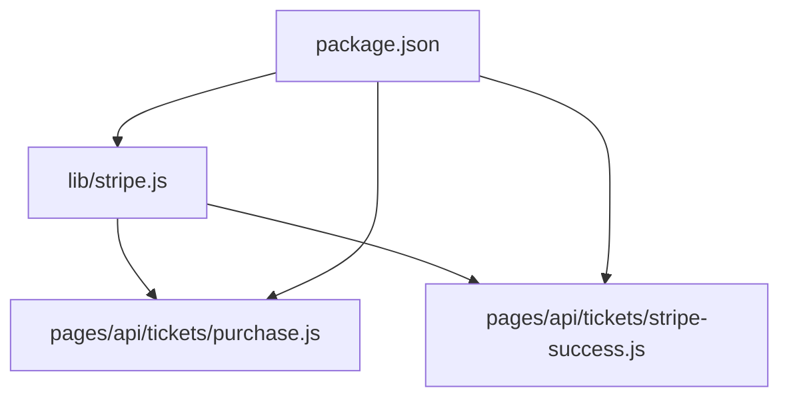
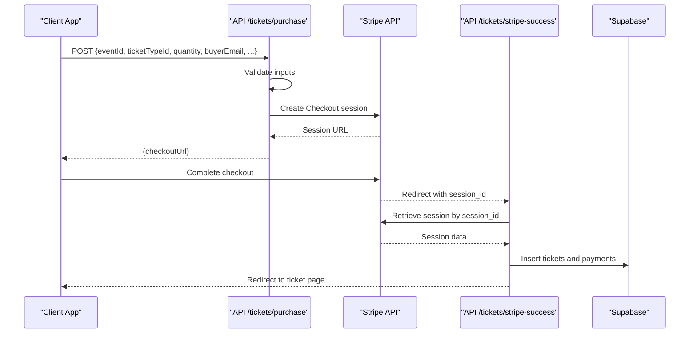
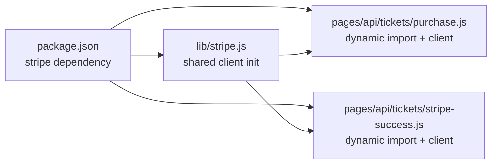

# Stripe Client Setup & Configuration

<cite>
**Referenced Files in This Document**
- [lib/stripe.js](file://lib/stripe.js)
- [pages/api/tickets/purchase.js](file://pages/api/tickets/purchase.js)
- [pages/api/tickets/stripe-success.js](file://pages/api/tickets/stripe-success.js)
- [package.json](file://package.json)
</cite>

## Table of Contents
1. [Introduction](#introduction)
2. [Project Structure](#project-structure)
3. [Core Components](#core-components)
4. [Architecture Overview](#architecture-overview)
5. [Detailed Component Analysis](#detailed-component-analysis)
6. [Dependency Analysis](#dependency-analysis)
7. [Performance Considerations](#performance-considerations)
8. [Troubleshooting Guide](#troubleshooting-guide)
9. [Conclusion](#conclusion)
10. [Appendices](#appendices)

## Introduction
This document explains how the application initializes and configures the Stripe SDK, manages secret keys, and integrates with environment variables across development, staging, and production. It also covers best practices for security (key rotation, access control, monitoring), version compatibility, error handling patterns, connection management, and how client configuration relates to API routes that create and verify payment sessions.

## Project Structure
Stripe-related code is centralized in a shared module and used by server-side API routes during ticket purchases and post-payment verification. The project uses Next.js API routes for server-side operations and imports the Stripe SDK where needed.

**Diagram sources**
- [lib/stripe.js:1-6](file://lib/stripe.js#L1-L6)
- [pages/api/tickets/purchase.js:1-123](file://pages/api/tickets/purchase.js#L1-L123)
- [pages/api/tickets/stripe-success.js:1-55](file://pages/api/tickets/stripe-success.js#L1-L55)
- [package.json:1-24](file://package.json#L1-L24)

**Section sources**
- [lib/stripe.js:1-6](file://lib/stripe.js#L1-L6)
- [pages/api/tickets/purchase.js:1-123](file://pages/api/tickets/purchase.js#L1-L123)
- [pages/api/tickets/stripe-success.js:1-55](file://pages/api/tickets/stripe-success.js#L1-L55)
- [package.json:1-24](file://package.json#L1-L24)

## Core Components
- Shared Stripe client initialization:
  - A singleton-style Stripe instance is created using an environment variable for the secret key and a pinned API version.
- Server-side usage in API routes:
  - Dynamic import of the Stripe SDK within route handlers to instantiate clients per request when needed.
  - Creation of Checkout sessions and retrieval of session details after payment completion.

Key responsibilities:
- Centralized configuration for consistent API versioning and key sourcing.
- Per-request instantiation in API routes to avoid sharing state across requests.
- Environment-driven behavior via process.env variables.

**Section sources**
- [lib/stripe.js:1-6](file://lib/stripe.js#L1-L6)
- [pages/api/tickets/purchase.js:47-76](file://pages/api/tickets/purchase.js#L47-L76)
- [pages/api/tickets/stripe-success.js:7-11](file://pages/api/tickets/stripe-success.js#L7-L11)

## Architecture Overview
The payment flow involves two primary API endpoints:
- Purchase endpoint creates a Stripe Checkout session and returns a URL to redirect the buyer.
- Success endpoint verifies the payment status and persists tickets and payment records.

**Diagram sources**
- [pages/api/tickets/purchase.js:47-76](file://pages/api/tickets/purchase.js#L47-L76)
- [pages/api/tickets/stripe-success.js:7-11](file://pages/api/tickets/stripe-success.js#L7-L11)

## Detailed Component Analysis

### Shared Stripe Client Initialization
- Purpose: Provide a configured Stripe client with a pinned API version and secret key sourced from environment variables.
- Behavior:
  - Reads secret key from an environment variable; falls back to a placeholder value if not set.
  - Sets a specific API version string for deterministic behavior.

Best practices observed:
- Pinning the API version ensures predictable behavior across SDK updates.
- Using environment variables avoids hardcoding secrets.

Security considerations:
- Ensure the secret key is never committed to source control.
- Use separate keys per environment (test vs live).

Operational notes:
- The shared instance can be reused across modules that import it.
- For serverless environments, consider per-request instantiation to avoid cold-start caching issues.

**Section sources**
- [lib/stripe.js:1-6](file://lib/stripe.js#L1-L6)

### Ticket Purchase API Route
- Purpose: Create a Stripe Checkout session for ticket purchases.
- Flow:
  - Validates required fields.
  - Checks ticket availability and applies promo codes.
  - Dynamically imports Stripe SDK and instantiates a client with the secret key and API version.
  - Creates a Checkout session with line items, success/cancel URLs, and metadata containing purchase context.
  - Returns the checkout URL to the client.

Error handling:
- Input validation returns appropriate HTTP status codes.
- Errors are caught and logged; generic failure messages are returned to clients.

Connection management:
- Uses dynamic import to load the Stripe SDK only when needed.
- Instantiates a new client per request to ensure isolation.

Environment variables used:
- Secret key for authentication.
- Public site URL for redirect URLs.

**Section sources**
- [pages/api/tickets/purchase.js:1-123](file://pages/api/tickets/purchase.js#L1-L123)

### Stripe Success Callback API Route
- Purpose: Verify payment completion and persist tickets and payment records.
- Flow:
  - Retrieves the session by ID.
  - Confirms payment status is paid.
  - Extracts metadata to create tickets and record payments.
  - Updates ticket type sold counts.
  - Redirects to the first ticket page.

Error handling:
- Missing session ID leads to a redirect.
- Non-paid sessions redirect with an error indicator.
- Database errors or missing ticket types result in redirects with error indicators.

Connection management:
- Dynamically imports Stripe SDK and creates a per-request client.

**Section sources**
- [pages/api/tickets/stripe-success.js:1-55](file://pages/api/tickets/stripe-success.js#L1-L55)

### Version Compatibility and Dependencies
- The project depends on the Stripe Node SDK and related frontend libraries.
- The SDK version is specified in the package manifest.
- The API version string is explicitly set in client configuration.

Recommendations:
- Keep the SDK version updated to receive security patches and new features.
- Align the pinned API version with supported versions for your SDK release.

**Section sources**
- [package.json:10-22](file://package.json#L10-L22)
- [lib/stripe.js:3-5](file://lib/stripe.js#L3-L5)
- [pages/api/tickets/purchase.js:49](file://pages/api/tickets/purchase.js#L49-L49)
- [pages/api/tickets/stripe-success.js:9](file://pages/api/tickets/stripe-success.js#L9-L9)

## Dependency Analysis
The following diagram shows how the Stripe client is initialized and used across the application.

**Diagram sources**
- [package.json:10-22](file://package.json#L10-L22)
- [lib/stripe.js:1-6](file://lib/stripe.js#L1-L6)
- [pages/api/tickets/purchase.js:47-76](file://pages/api/tickets/purchase.js#L47-L76)
- [pages/api/tickets/stripe-success.js:7-11](file://pages/api/tickets/stripe-success.js#L7-L11)

**Section sources**
- [package.json:10-22](file://package.json#L10-L22)
- [lib/stripe.js:1-6](file://lib/stripe.js#L1-L6)
- [pages/api/tickets/purchase.js:47-76](file://pages/api/tickets/purchase.js#L47-L76)
- [pages/api/tickets/stripe-success.js:7-11](file://pages/api/tickets/stripe-success.js#L7-L11)

## Performance Considerations
- Prefer reusing a single Stripe client instance in long-running servers to reduce overhead.
- In serverless functions, per-request instantiation is acceptable but may incur cold-start costs; consider keeping the client outside the handler if supported by your runtime.
- Avoid unnecessary network calls by validating inputs early and minimizing retries.
- Cache non-sensitive configuration values at module load time.

[No sources needed since this section provides general guidance]

## Troubleshooting Guide
Common issues and resolutions:
- Missing secret key:
  - Symptom: API calls fail due to invalid credentials.
  - Resolution: Ensure the secret key environment variable is set in the deployment environment.
- Incorrect API version:
  - Symptom: Unexpected behavior or API errors.
  - Resolution: Align the pinned API version with the SDK version you are using.
- Redirect failures:
  - Symptom: Buyers cannot complete checkout or see success pages.
  - Resolution: Verify public site URL environment variable and ensure success/cancel URLs are correctly formed.
- Payment not recorded:
  - Symptom: Tickets not created after successful payment.
  - Resolution: Check logs in the success endpoint and confirm database writes succeed.

Operational tips:
- Log errors centrally and include contextual identifiers like session IDs.
- Monitor Stripe dashboard for failed checks and webhook delivery issues.
- Implement idempotency for critical operations to handle retries safely.

**Section sources**
- [pages/api/tickets/purchase.js:118-121](file://pages/api/tickets/purchase.js#L118-L121)
- [pages/api/tickets/stripe-success.js:50-53](file://pages/api/tickets/stripe-success.js#L50-L53)

## Conclusion
The application initializes the Stripe SDK with a pinned API version and environment-based secret key management. Server-side routes dynamically import and instantiate clients per request to support secure, isolated operations. Adhering to the recommended practices for environment configuration, error handling, and version alignment will improve reliability and security. Future enhancements should include webhook handling for robust payment reconciliation and centralized logging/monitoring.

[No sources needed since this section summarizes without analyzing specific files]

## Appendices

### Environment Variables Reference
- STRIPE_SECRET_KEY: Secret key for authenticating Stripe API calls. Must be kept confidential and rotated regularly.
- NEXT_PUBLIC_SITE_URL: Public base URL used for redirect URLs in Checkout sessions.

[No sources needed since this section provides general guidance]

### Security Best Practices
- Key Management:
  - Store secret keys in secure environment variables managed by your hosting platform.
  - Rotate keys periodically and maintain separate test and live keys.
- Access Control:
  - Restrict access to secret keys to minimal necessary services and users.
  - Use least-privilege principles for service accounts.
- Monitoring:
  - Enable Stripe alerts and monitor failed transactions and webhook deliveries.
  - Integrate centralized logging and metrics for observability.
- Webhooks:
  - Implement webhook endpoints to reconcile payments reliably.
  - Verify webhook signatures and handle idempotency.

[No sources needed since this section provides general guidance]