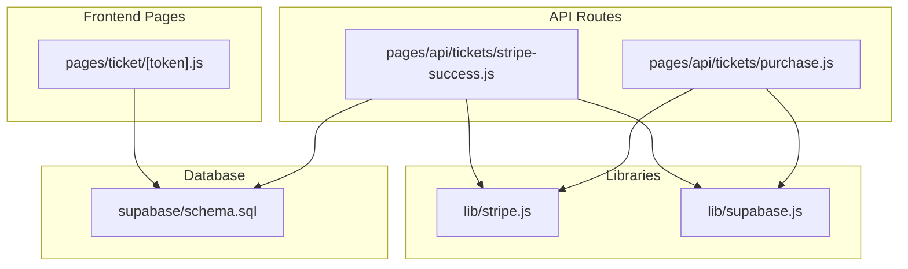
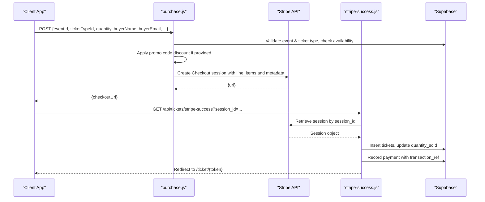
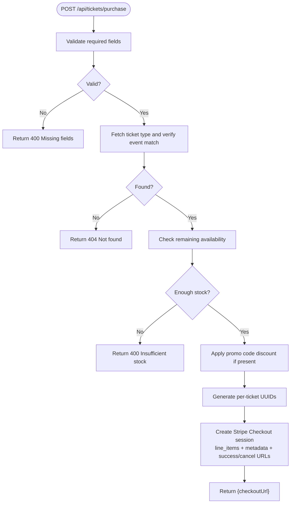
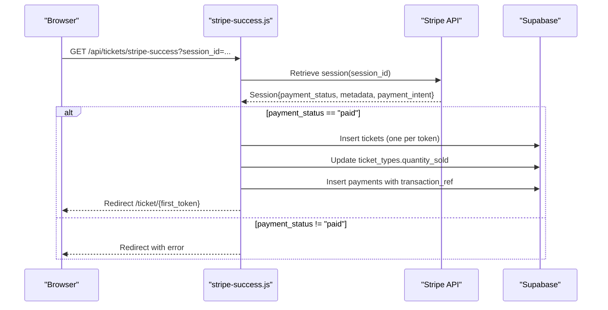
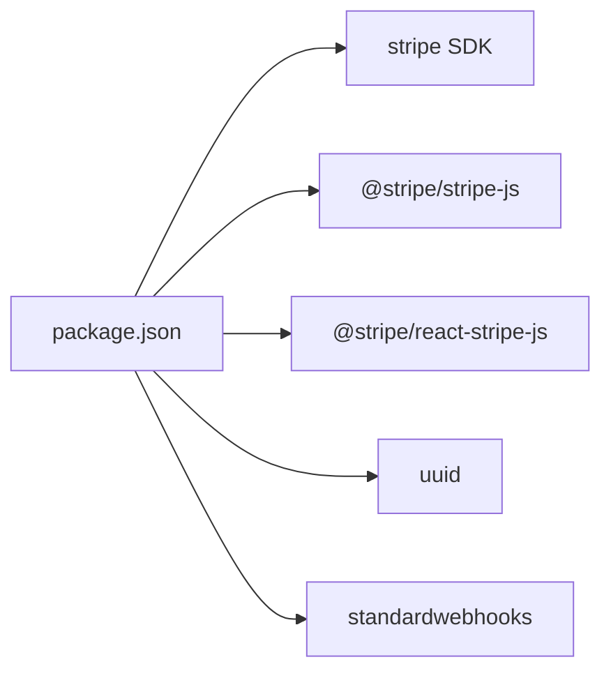

# Stripe Payment Integration

<cite>
**Referenced Files in This Document**
- [lib/stripe.js](file://lib/stripe.js)
- [pages/api/tickets/purchase.js](file://pages/api/tickets/purchase.js)
- [pages/api/tickets/stripe-success.js](file://pages/api/tickets/stripe-success.js)
- [lib/supabase.js](file://lib/supabase.js)
- [supabase/schema.sql](file://supabase/schema.sql)
- [package.json](file://package.json)
- [pages/ticket/[token].js](file://pages/ticket/[token].js)
</cite>

## Table of Contents
1. [Introduction](#introduction)
2. [Project Structure](#project-structure)
3. [Core Components](#core-components)
4. [Architecture Overview](#architecture-overview)
5. [Detailed Component Analysis](#detailed-component-analysis)
6. [Dependency Analysis](#dependency-analysis)
7. [Performance Considerations](#performance-considerations)
8. [Troubleshooting Guide](#troubleshooting-guide)
9. [Conclusion](#conclusion)

## Introduction
This document explains the Stripe payment integration for the TicketFlow application. It covers how checkout sessions are created, how payment method configuration is handled, and how success flows create tickets and record payments. It also documents environment-based secret key management, security best practices, error handling patterns, and the relationship between Stripe sessions, payments, and ticket generation.

## Project Structure
The Stripe integration spans a few focused files:
- A shared Stripe client setup
- An API route to create a Stripe Checkout session with line items and metadata
- A success handler that verifies payment and creates tickets and payment records
- Database schema defining tickets, payments, and related entities
- Environment configuration for service clients

**Diagram sources**
- [pages/api/tickets/purchase.js](file://pages/api/tickets/purchase.js)
- [pages/api/tickets/stripe-success.js](file://pages/api/tickets/stripe-success.js)
- [lib/stripe.js](file://lib/stripe.js)
- [lib/supabase.js](file://lib/supabase.js)
- [supabase/schema.sql](file://supabase/schema.sql)
- [pages/ticket/[token].js](file://pages/ticket/[token].js)

**Section sources**
- [lib/stripe.js](file://lib/stripe.js)
- [pages/api/tickets/purchase.js](file://pages/api/tickets/purchase.js)
- [pages/api/tickets/stripe-success.js](file://pages/api/tickets/stripe-success.js)
- [lib/supabase.js](file://lib/supabase.js)
- [supabase/schema.sql](file://supabase/schema.sql)
- [pages/ticket/[token].js](file://pages/ticket/[token].js)

## Core Components
- Stripe client initialization with API versioning and secret key from environment variables
- Checkout session creation endpoint with validation, promo code discounting, and metadata embedding
- Success handler that retrieves the session, validates payment status, creates tickets, updates inventory, and records payments
- Supabase service client for server-side database operations
- Ticket display page rendering QR codes and ticket details

Key responsibilities:
- Securely initialize Stripe using server-side secrets
- Validate inputs and availability before creating a session
- Embed necessary context in Stripe session metadata (event, buyer info, tokens, discount)
- On success, persist tickets and payments atomically where possible
- Redirect users to their ticket page after successful payment

**Section sources**
- [lib/stripe.js](file://lib/stripe.js)
- [pages/api/tickets/purchase.js](file://pages/api/tickets/purchase.js)
- [pages/api/tickets/stripe-success.js](file://pages/api/tickets/stripe-success.js)
- [lib/supabase.js](file://lib/supabase.js)
- [supabase/schema.sql](file://supabase/schema.sql)
- [pages/ticket/[token].js](file://pages/ticket/[token].js)

## Architecture Overview
The flow uses Stripe Checkout hosted pages. The server creates a session, returns a URL, and the user completes payment on Stripe’s secure page. On success, the user is redirected back to the application’s success handler, which finalizes ticket issuance and payment recording.

**Diagram sources**
- [pages/api/tickets/purchase.js](file://pages/api/tickets/purchase.js)
- [pages/api/tickets/stripe-success.js](file://pages/api/tickets/stripe-success.js)
- [lib/supabase.js](file://lib/supabase.js)

## Detailed Component Analysis

### Stripe Client Setup and Secret Key Management
- A dedicated module initializes the Stripe SDK with an API version and reads the secret key from environment variables.
- In API routes, the SDK is dynamically imported and instantiated per request using the same environment variable pattern.
- Best practice: keep secret keys out of source control; use runtime environment variables only on the server.

Security considerations:
- Never expose STRIPE_SECRET_KEY to the browser; it must remain server-only.
- Pin the Stripe API version to ensure consistent behavior across deployments.
- Avoid logging sensitive values like session IDs or tokens.

**Section sources**
- [lib/stripe.js](file://lib/stripe.js)
- [pages/api/tickets/purchase.js](file://pages/api/tickets/purchase.js)
- [pages/api/tickets/stripe-success.js](file://pages/api/tickets/stripe-success.js)

### Checkout Session Creation (purchase.js)
Responsibilities:
- Validate required fields (eventId, ticketTypeId, quantity, buyerName, buyerEmail).
- Verify ticket type exists and belongs to the event; enforce remaining availability.
- Optionally apply a promo code discount and increment usage counters.
- Generate unique tokens for each ticket and embed them into Stripe session metadata.
- Build a single line item representing the discounted total price multiplied by quantity.
- Configure success and cancel URLs; success URL includes the session ID placeholder.
- Return the hosted checkout URL to the client.

Data flow:
- Input validation → availability check → promo discount → token generation → Stripe session creation → redirect URL response.

Error handling:
- Returns appropriate HTTP status codes for missing fields, not found, insufficient stock, and server errors.

**Diagram sources**
- [pages/api/tickets/purchase.js](file://pages/api/tickets/purchase.js)

**Section sources**
- [pages/api/tickets/purchase.js](file://pages/api/tickets/purchase.js)

### Payment Success Flow (stripe-success.js)
Responsibilities:
- Retrieve the Stripe session using the session_id query parameter.
- Confirm payment_status is paid; otherwise redirect with an error.
- Extract metadata (event, ticket type, quantity, buyer info, tokens, discount).
- Compute unit price based on ticket type and discount percentage.
- Insert one ticket per token with active status.
- Update ticket_types.quantity_sold accordingly.
- Record a payment row linked to the first ticket with Stripe’s payment_intent as transaction reference.
- Redirect to the first ticket’s page.

Idempotency and reliability:
- The handler should be idempotent when called multiple times for the same session; consider deduplicating inserts by token or checking existing tickets before insert.

**Diagram sources**
- [pages/api/tickets/stripe-success.js](file://pages/api/tickets/stripe-success.js)

**Section sources**
- [pages/api/tickets/stripe-success.js](file://pages/api/tickets/stripe-success.js)

### Ticket Display Page
After successful payment, users are redirected to a page that renders the ticket details and QR code. The page fetches ticket data via server-side props using the service role key and displays event and ticket type information.

Key points:
- Uses the qr_code_token to look up the ticket and related data.
- Renders a QR code value pointing to the public ticket URL.
- Supports sharing and printing actions.

**Section sources**
- [pages/ticket/[token].js](file://pages/ticket/[token].js)

### Database Schema and Relationships
The schema defines core entities involved in payments and ticketing:
- events, ticket_types, tickets, payments, promo_codes
- Indexes on frequently queried columns (tokens, emails, event ids)
- Row-level security policies and service role access for API routes

Relationships:
- One event has many ticket types; one ticket type has many tickets.
- Each ticket links to one payment record.
- Promo codes are scoped to events and track usage.

**Section sources**
- [supabase/schema.sql](file://supabase/schema.sql)

## Dependency Analysis
External dependencies relevant to Stripe and payments:
- stripe SDK used for server-side operations
- @stripe/stripe-js and @stripe/react-stripe-js available for frontend integrations
- uuid used for generating per-ticket tokens
- standardwebhooks dependency present in lock file but no webhook endpoint implemented yet

**Diagram sources**
- [package.json](file://package.json)

**Section sources**
- [package.json](file://package.json)

## Performance Considerations
- Minimize round-trips by batching ticket inserts and updating inventory in a single transaction where supported by the database layer.
- Cache ticket type queries when processing high-volume purchases to reduce repeated DB calls.
- Use Stripe’s idempotency keys for critical operations to prevent duplicate charges or ticket issuances.
- Keep success handlers lightweight; avoid heavy computations or external calls beyond necessary DB writes.

[No sources needed since this section provides general guidance]

## Troubleshooting Guide
Common issues and resolutions:
- Missing environment variables: Ensure STRIPE_SECRET_KEY, NEXT_PUBLIC_SUPABASE_URL, NEXT_PUBLIC_SUPABASE_ANON_KEY, SUPABASE_SERVICE_ROLE_KEY, and NEXT_PUBLIC_SITE_URL are set.
- Invalid or expired session_id: Validate the presence of session_id and handle redirects gracefully.
- Payment not completed: Verify session.payment_status before issuing tickets; do not rely solely on client-side redirects.
- Duplicate tickets: Implement idempotency checks using tokens or session_id to prevent re-insertion.
- Inventory mismatch: Wrap ticket insertion and quantity updates in a transaction to maintain consistency.
- Webhook reliability: If implementing webhooks later, validate signatures and implement retry logic with exponential backoff.

Error handling patterns observed:
- Validation errors return 400/404 appropriately.
- Server errors log details and return generic messages to clients.
- Success path handles non-paid sessions by redirecting with error parameters.

**Section sources**
- [pages/api/tickets/purchase.js](file://pages/api/tickets/purchase.js)
- [pages/api/tickets/stripe-success.js](file://pages/api/tickets/stripe-success.js)
- [lib/supabase.js](file://lib/supabase.js)

## Conclusion
The integration leverages Stripe Checkout to securely collect payments and delegates ticket issuance to a server-side success handler. Metadata embedded in the session carries all necessary context to create tickets and record payments reliably. Security is maintained through server-only secret keys and explicit API version pinning. For production readiness, add idempotency, robust error handling, and optional webhook support to reconcile payments asynchronously.

[No sources needed since this section summarizes without analyzing specific files]