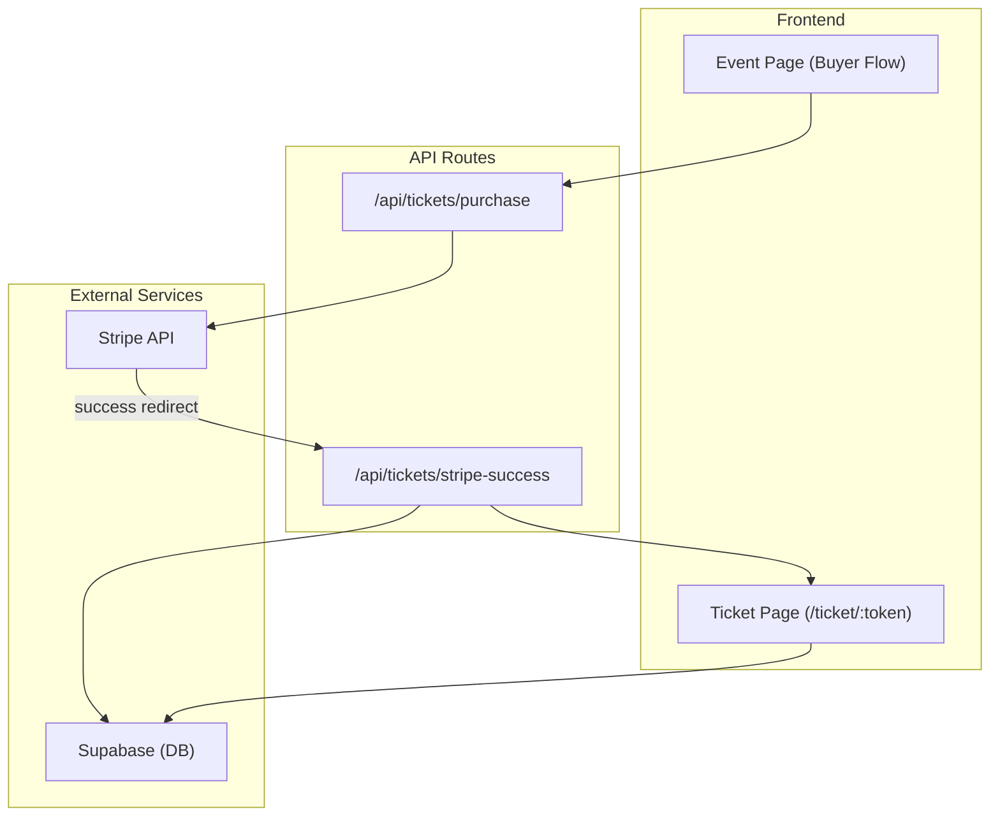
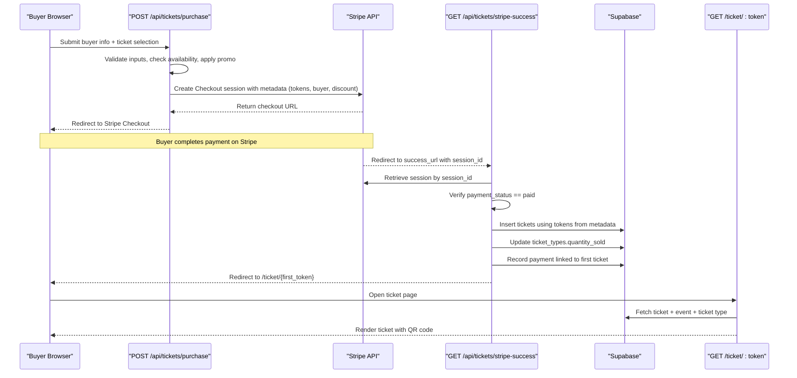
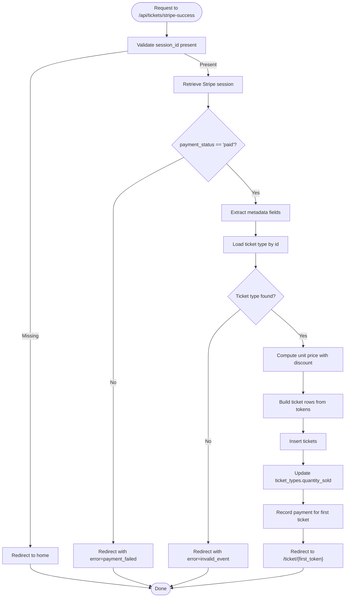
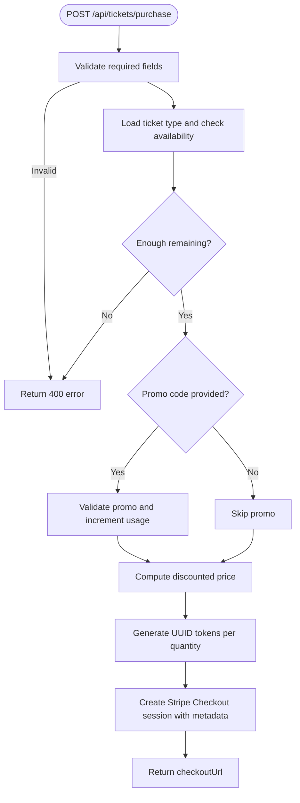
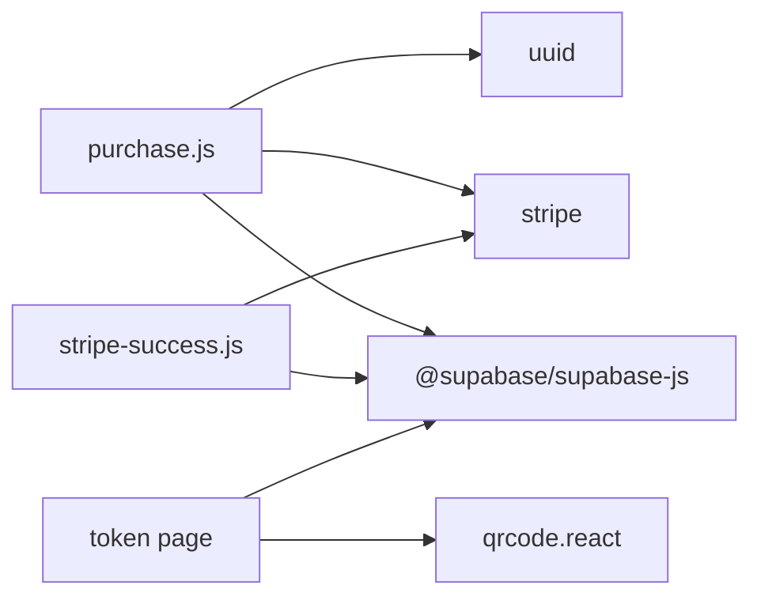
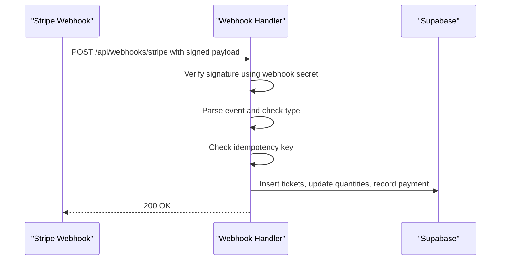

# Stripe Webhook & Payment Confirmation

<cite>
**Referenced Files in This Document**
- [stripe-success.js](file://pages/api/tickets/stripe-success.js)
- [purchase.js](file://pages/api/tickets/purchase.js)
- [supabase.js](file://lib/supabase.js)
- [schema.sql](file://supabase/schema.sql)
- [package.json](file://package.json)
- [token page](file://pages/ticket/[token].js)
</cite>

## Table of Contents
1. [Introduction](#introduction)
2. [Project Structure](#project-structure)
3. [Core Components](#core-components)
4. [Architecture Overview](#architecture-overview)
5. [Detailed Component Analysis](#detailed-component-analysis)
6. [Dependency Analysis](#dependency-analysis)
7. [Performance Considerations](#performance-considerations)
8. [Troubleshooting Guide](#troubleshooting-guide)
9. [Conclusion](#conclusion)
10. [Appendices](#appendices)

## Introduction
This document explains the Stripe-powered payment confirmation flow and ticket issuance in TicketFlow. It focuses on how the stripe-success endpoint processes successful payments, validates Stripe sessions, extracts metadata, generates QR code tokens, inserts tickets into the database, records payments, and redirects users to their tickets. It also covers security considerations for webhook signature verification, idempotency and duplicate payment handling, transaction rollback strategies, and error recovery. Finally, it outlines where email notifications would fit into the end-to-end flow.

## Project Structure
The relevant parts of the application are organized as follows:
- API routes handle purchase creation and success processing
- Supabase client utilities provide secure server-side database access
- Database schema defines entities like events, ticket types, tickets, and payments
- Frontend ticket rendering displays QR codes and ticket details

**Diagram sources**
- [purchase.js](file://pages/api/tickets/purchase.js)
- [stripe-success.js](file://pages/api/tickets/stripe-success.js)
- [token page](file://pages/ticket/[token].js)

**Section sources**
- [purchase.js](file://pages/api/tickets/purchase.js)
- [stripe-success.js](file://pages/api/tickets/stripe-success.js)
- [supabase.js](file://lib/supabase.js)
- [schema.sql](file://supabase/schema.sql)

## Core Components
- Purchase API route: Validates inputs, checks availability, applies promo discounts, creates a Stripe Checkout session with pre-generated QR tokens embedded in metadata, and returns the checkout URL.
- Stripe Success API route: Retrieves the Stripe session, verifies payment status, reads metadata, computes unit price, inserts tickets, updates sold counts, records a payment, and redirects to the first ticket.
- Supabase client: Provides an admin service-role client for server-only operations.
- Ticket page: Renders the ticket with a QR code generated from the token.

Key responsibilities:
- Input validation and business rule enforcement occur before creating the Stripe session.
- The success endpoint is the authoritative source of truth for issuing tickets after payment confirmation.
- QR tokens are generated once during purchase and persisted via Stripe metadata to ensure consistency.

**Section sources**
- [purchase.js](file://pages/api/tickets/purchase.js)
- [stripe-success.js](file://pages/api/tickets/stripe-success.js)
- [supabase.js](file://lib/supabase.js)
- [token page](file://pages/ticket/[token].js)

## Architecture Overview
End-to-end flow from purchase to ticket display:

**Diagram sources**
- [purchase.js](file://pages/api/tickets/purchase.js)
- [stripe-success.js](file://pages/api/tickets/stripe-success.js)
- [token page](file://pages/ticket/[token].js)

## Detailed Component Analysis

### Stripe Success Endpoint: stripe-success.js
Responsibilities:
- Accepts a session_id query parameter
- Dynamically imports Stripe SDK and retrieves the session
- Ensures payment_status is 'paid'
- Extracts metadata fields: eventId, ticketTypeId, quantity, buyerName, buyerEmail, buyerPhone, tokens (comma-separated), discount
- Computes unit price based on ticket type and discount percentage
- Inserts one ticket per token with active status
- Increments ticket_types.quantity_sold
- Records a payment row tied to the first ticket’s ID
- Redirects to the first ticket’s page

Error handling:
- Missing session_id leads to redirect to home
- Non-paid sessions redirect with an error flag
- Invalid ticket type results in redirect with error flag
- Any exception logs and redirects with a generic failure message

Idempotency and duplicates:
- Currently no explicit idempotency guard against multiple calls with the same session_id or tokens. To prevent duplicates, consider:
  - Checking if any token already exists before insert
  - Using a unique constraint on qr_code_token (already present in schema)
  - Recording a completed flag keyed by session_id or payment_intent in a dedicated table or JSONB field

Transaction safety:
- Multiple DB writes occur without a single transaction wrapper. If any insert fails midway, partial state may remain. Recommended approach:
  - Use Supabase transactions (via RPC or RLS policies) to atomically insert tickets, update quantities, and record payments
  - Roll back all changes on error

Security considerations:
- Relies on Stripe’s server-side retrieval to confirm payment status; this is safe when called from the backend
- For webhook-based flows (see next section), verify signatures using Stripe’s secret and payload

**Diagram sources**
- [stripe-success.js](file://pages/api/tickets/stripe-success.js)

**Section sources**
- [stripe-success.js](file://pages/api/tickets/stripe-success.js)

### Purchase API Route: purchase.js
Responsibilities:
- Validates required fields
- Verifies ticket type existence and availability
- Applies promo code if provided and increments usage
- Generates UUID tokens for each ticket quantity
- Creates a Stripe Checkout session with:
  - Line item price derived from discounted unit price
  - Mode set to payment
  - success_url pointing to /api/tickets/stripe-success with session_id placeholder
  - metadata containing eventId, ticketTypeId, quantity, buyer info, tokens, and discount
- Returns the checkout URL to the client

Important notes:
- Tokens are generated server-side and embedded in metadata to avoid race conditions
- Discount calculation uses integer math for Stripe amounts (cents)
- For non-Stripe methods, tickets are created immediately (outside scope of this document)

**Diagram sources**
- [purchase.js](file://pages/api/tickets/purchase.js)

**Section sources**
- [purchase.js](file://pages/api/tickets/purchase.js)

### Supabase Client: supabase.js
- Exposes a public client for general use
- Exposes getServiceClient() which uses the service role key for privileged server-side operations used by API routes

Best practices:
- Always use getServiceClient() in API routes to bypass RLS and ensure reliable writes
- Ensure SUPABASE_SERVICE_ROLE_KEY is securely configured in environment variables

**Section sources**
- [supabase.js](file://lib/supabase.js)

### Database Schema: schema.sql
Relevant tables:
- events: Event metadata and status
- ticket_types: Pricing, availability, and sales counters
- tickets: Unique qr_code_token, buyer info, status
- payments: Payment records linked to tickets

Constraints and indexes:
- qr_code_token is UNIQUE, preventing duplicate tickets
- Indexes on frequently queried columns improve performance

Implications:
- Duplicate prevention is enforced at the database level for tickets
- Payments can be duplicated unless guarded by application logic or additional constraints

**Section sources**
- [schema.sql](file://supabase/schema.sql)

### Ticket Page: token page
- Fetches ticket by qr_code_token along with related event and ticket type
- Renders QR code using qrcode.react
- Displays buyer info, event details, and status

Note:
- Email sending is not implemented here; it should be integrated in the success flow or via a separate notification service

**Section sources**
- [token page](file://pages/ticket/[token].js)

## Dependency Analysis
- External libraries:
  - stripe: Used to create and retrieve sessions
  - @supabase/supabase-js: Used to interact with the database
  - uuid: Used to generate unique tokens
  - qrcode.react: Used to render QR codes on the frontend
  - resend: Available in dependencies for email sending (not currently used in the analyzed files)

**Diagram sources**
- [purchase.js](file://pages/api/tickets/purchase.js)
- [stripe-success.js](file://pages/api/tickets/stripe-success.js)
- [token page](file://pages/ticket/[token].js)
- [package.json](file://package.json)

**Section sources**
- [package.json](file://package.json)

## Performance Considerations
- Avoid unnecessary re-fetching: The success endpoint performs minimal queries; ensure network latency is acceptable.
- Batch operations: Consider batching ticket inserts if quantity is large.
- Index usage: Queries rely on indexed columns (e.g., qr_code_token, event_id).
- Idempotency: Prevent duplicate work by checking existing tokens before insert.

[No sources needed since this section provides general guidance]

## Troubleshooting Guide
Common issues and resolutions:
- Missing session_id: The endpoint redirects to home. Ensure success_url includes {CHECKOUT_SESSION_ID}.
- Payment not confirmed: Redirect with error=payment_failed. Verify Stripe session status.
- Invalid ticket type: Redirect with error=invalid_event. Confirm ticketTypeId matches an existing type.
- Duplicate tickets: Database enforces uniqueness on qr_code_token. If duplicates still occur, add idempotency checks in the success endpoint.
- Partial writes: Wrap DB operations in a transaction to ensure atomicity across inserts and updates.
- Webhook signature verification: When implementing webhooks, validate the signature using Stripe’s secret and payload to prevent spoofing.

Recommended improvements:
- Add idempotency keys based on session_id or payment_intent to avoid duplicate ticket creation.
- Implement a transactional block around ticket insertion, quantity updates, and payment recording.
- Integrate email notifications using Resend after successful ticket creation.

**Section sources**
- [stripe-success.js](file://pages/api/tickets/stripe-success.js)
- [purchase.js](file://pages/api/tickets/purchase.js)
- [schema.sql](file://supabase/schema.sql)

## Conclusion
The current implementation successfully bridges Stripe Checkout with ticket issuance through a clear sequence: purchase creation with metadata, Stripe-hosted payment, and a success handler that confirms payment and persists tickets and payments. Security relies on server-side session retrieval and database constraints. To harden the system, add idempotency guards, transactional integrity, and email notifications. For webhook-based flows, implement signature verification and payload validation to ensure authenticity and reliability.

[No sources needed since this section summarizes without analyzing specific files]

## Appendices

### Webhook Security Verification and Payload Processing
When moving from redirect-based confirmation to webhook-based processing:
- Endpoint receives POST requests from Stripe with signed payloads
- Verify signature using Stripe’s webhook secret and request headers
- Parse the JSON payload and handle events such as checkout.session.completed
- Use idempotency keys (e.g., session.id or payment_intent.id) to avoid duplicate processing
- Perform the same steps as the success endpoint: extract metadata, compute prices, insert tickets, update quantities, record payments

Example workflow outline:

[No sources needed since this diagram shows conceptual webhook flow]

### Metadata Extraction Examples
- From Stripe session metadata:
  - eventId: UUID of the event
  - ticketTypeId: UUID of the ticket type
  - quantity: Number of tickets purchased
  - buyerName, buyerEmail, buyerPhone: Buyer contact information
  - tokens: Comma-separated list of UUIDs representing QR tokens
  - discount: Percentage discount applied

These values are used to construct ticket records and compute final pricing.

**Section sources**
- [purchase.js](file://pages/api/tickets/purchase.js)
- [stripe-success.js](file://pages/api/tickets/stripe-success.js)

### QR Code Token Generation
- Tokens are generated using uuidv4 for each ticket quantity during purchase
- They are embedded in Stripe session metadata and later used to create tickets
- The ticket page renders a QR code from the token value

**Section sources**
- [purchase.js](file://pages/api/tickets/purchase.js)
- [token page](file://pages/ticket/[token].js)

### Transaction Rollback Scenarios
- Current implementation performs multiple independent DB writes
- Risk: Partial state if any write fails
- Recommendation: Use a transaction to wrap ticket insertion, quantity updates, and payment recording
- On failure, roll back all changes to maintain data consistency

[No sources needed since this section provides general guidance]

### Duplicate Payment Handling
- Database enforces unique qr_code_token, preventing duplicate tickets
- Application-level idempotency should guard against repeated processing of the same session or payment intent
- Consider adding a payments table constraint or index on transaction_ref to prevent duplicate payment records

**Section sources**
- [schema.sql](file://supabase/schema.sql)

### Error Recovery Mechanisms
- Redirect-based errors in success endpoint guide users to appropriate pages
- Logging errors helps diagnose issues
- For robustness, implement retry logic for transient failures and alerting for critical errors

**Section sources**
- [stripe-success.js](file://pages/api/tickets/stripe-success.js)