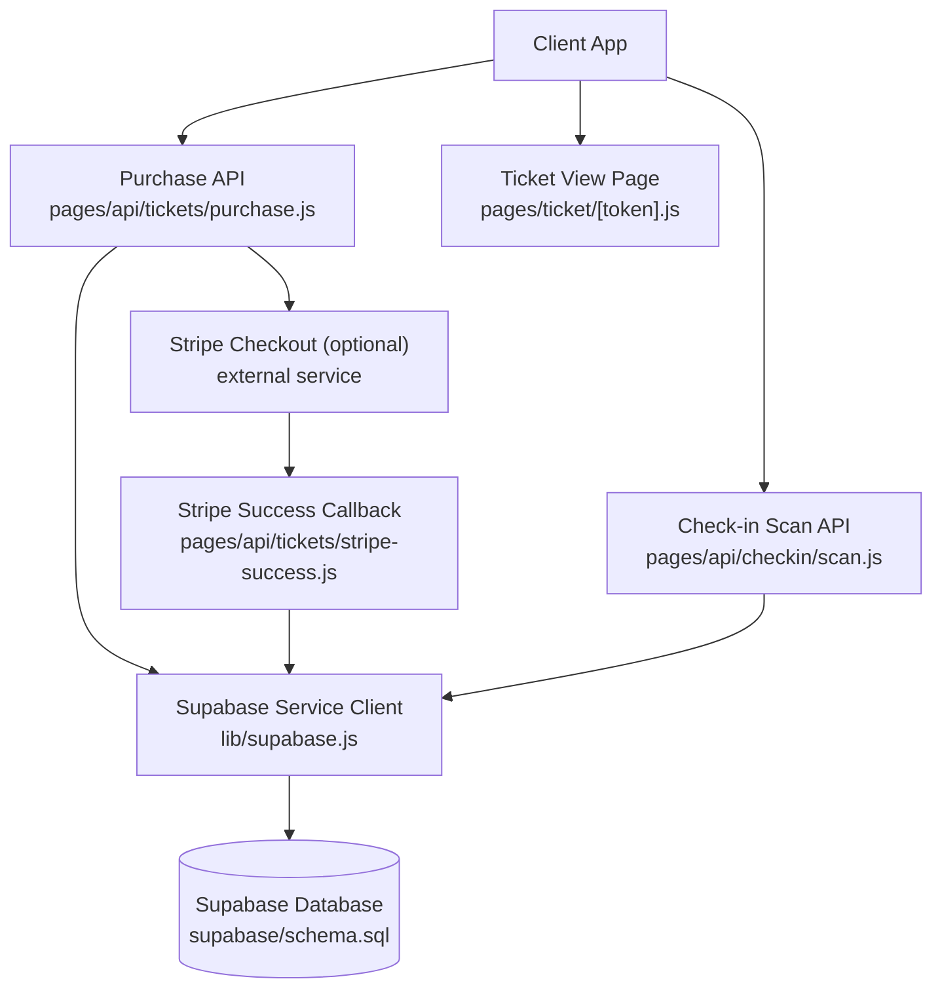
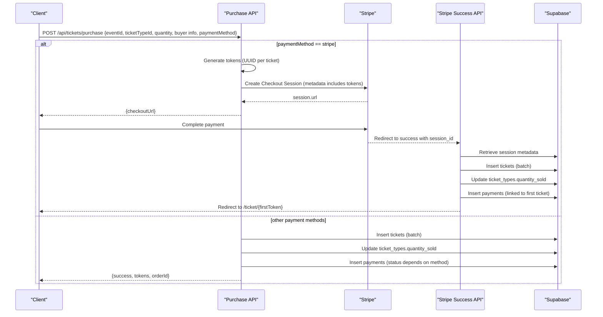
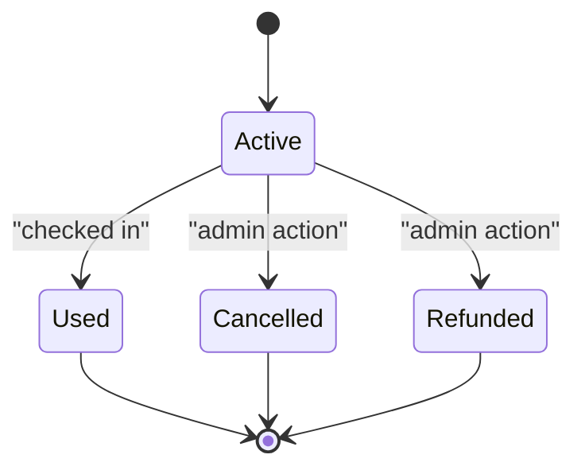
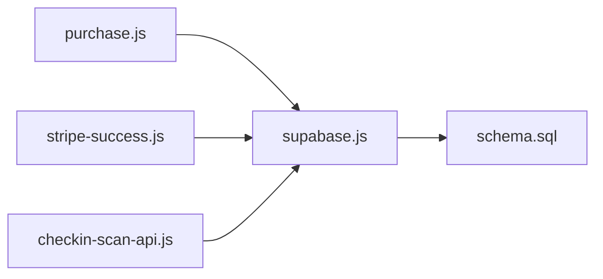

# Ticket Generation & Management

<cite>
**Referenced Files in This Document**
- [purchase.js](file://pages/api/tickets/purchase.js)
- [stripe-success.js](file://pages/api/tickets/stripe-success.js)
- [schema.sql](file://supabase/schema.sql)
- [supabase.js](file://lib/supabase.js)
- [token-ticket-page.js](file://pages/ticket/[token].js)
- [checkin-scan-api.js](file://pages/api/checkin/scan.js)
</cite>

## Table of Contents
1. [Introduction](#introduction)
2. [Project Structure](#project-structure)
3. [Core Components](#core-components)
4. [Architecture Overview](#architecture-overview)
5. [Detailed Component Analysis](#detailed-component-analysis)
6. [Dependency Analysis](#dependency-analysis)
7. [Performance Considerations](#performance-considerations)
8. [Troubleshooting Guide](#troubleshooting-guide)
9. [Conclusion](#conclusion)

## Introduction
This document explains the ticket generation and management system, focusing on how UUID-based tokens are created, how tickets are recorded in the database, and how purchase transactions relate to generated tokens and ticket records. It also covers inventory updates, batch creation patterns, error handling, rollback considerations, lifecycle management, status transitions, and data integrity constraints.

## Project Structure
The ticketing flow spans API routes for purchases and Stripe callbacks, a Supabase client for server-side access, and the database schema that enforces relationships and constraints. The ticket view page renders a QR code based on the token, while the check-in API validates and marks tickets as used.

**Diagram sources**
- [purchase.js:1-123](file://pages/api/tickets/purchase.js#L1-L123)
- [stripe-success.js:1-55](file://pages/api/tickets/stripe-success.js#L1-L55)
- [supabase.js:1-23](file://lib/supabase.js#L1-L23)
- [schema.sql:1-166](file://supabase/schema.sql#L1-L166)
- [token-ticket-page.js:1-257](file://pages/ticket/[token].js#L1-L257)
- [checkin-scan-api.js:1-44](file://pages/api/checkin/scan.js#L1-L44)

**Section sources**
- [purchase.js:1-123](file://pages/api/tickets/purchase.js#L1-L123)
- [stripe-success.js:1-55](file://pages/api/tickets/stripe-success.js#L1-L55)
- [supabase.js:1-23](file://lib/supabase.js#L1-L23)
- [schema.sql:1-166](file://supabase/schema.sql#L1-L166)
- [token-ticket-page.js:1-257](file://pages/ticket/[token].js#L1-L257)
- [checkin-scan-api.js:1-44](file://pages/api/checkin/scan.js#L1-L44)

## Core Components
- Token generation: UUIDs are generated per ticket using a standard UUID library.
- Batch creation: Tickets are inserted in bulk for a given quantity.
- Inventory update: The ticket type’s sold count is incremented after successful insertion.
- Payment recording: A payment record is created linked to the first ticket of the order.
- Stripe integration: Tokens are embedded in Stripe metadata; tickets are created upon success callback.
- Ticket view: A page renders the ticket details and QR code from the token.
- Check-in: A secure API validates and marks tickets as used, recording check-in events.

**Section sources**
- [purchase.js:1-123](file://pages/api/tickets/purchase.js#L1-L123)
- [stripe-success.js:1-55](file://pages/api/tickets/stripe-success.js#L1-L55)
- [schema.sql:1-166](file://supabase/schema.sql#L1-L166)
- [token-ticket-page.js:1-257](file://pages/ticket/[token].js#L1-L257)
- [checkin-scan-api.js:1-44](file://pages/api/checkin/scan.js#L1-L44)

## Architecture Overview
The end-to-end flow involves two primary paths:
- Direct payment methods: Generate tokens, insert tickets, update inventory, record payment, return tokens.
- Stripe checkout: Pre-generate tokens, create a checkout session with metadata, then on success, create tickets, update inventory, record payment, and redirect to the first ticket.

**Diagram sources**
- [purchase.js:1-123](file://pages/api/tickets/purchase.js#L1-L123)
- [stripe-success.js:1-55](file://pages/api/tickets/stripe-success.js#L1-L55)
- [supabase.js:1-23](file://lib/supabase.js#L1-L23)

## Detailed Component Analysis

### UUID-Based Token Generation
- Tokens are generated per ticket using a UUID v4 generator.
- For Stripe flows, tokens are pre-generated and stored in the checkout session metadata.
- For direct payment methods, tokens are generated immediately before inserting tickets.

Key behaviors:
- One token per ticket ensures uniqueness and serves as the QR code value.
- Tokens are included in responses or metadata to support downstream operations.

**Section sources**
- [purchase.js:1-123](file://pages/api/tickets/purchase.js#L1-L123)
- [stripe-success.js:1-55](file://pages/api/tickets/stripe-success.js#L1-L55)

### Ticket Record Creation and Database Insertion Patterns
- Tickets are inserted in batches using an array of objects containing event_id, ticket_type_id, buyer info, qr_code_token, and initial status.
- After insertion, the ticket type’s quantity_sold is incremented by the purchased quantity.
- A payment record is created linked to the first ticket of the order.

Data model highlights:
- tickets table enforces unique qr_code_token and foreign keys to events and ticket_types.
- Status defaults to active; checked_in flags and timestamps track usage.
- payments table stores amount, currency, method, transaction reference, and status.

**Section sources**
- [purchase.js:1-123](file://pages/api/tickets/purchase.js#L1-L123)
- [stripe-success.js:1-55](file://pages/api/tickets/stripe-success.js#L1-L55)
- [schema.sql:1-166](file://supabase/schema.sql#L1-L166)

### Relationship Between Purchase Transactions, Generated Tokens, and Ticket Records
- Each purchase request results in one or more tokens, each corresponding to a ticket record.
- For Stripe, tokens are embedded in metadata and later used to create tickets upon successful payment.
- Payments are recorded once per order, linked to the first ticket’s id.

Operational implications:
- The orderId returned corresponds to the first token, enabling order tracking.
- Consistency between tokens, tickets, and payments is maintained via explicit inserts and updates.

**Section sources**
- [purchase.js:1-123](file://pages/api/tickets/purchase.js#L1-L123)
- [stripe-success.js:1-55](file://pages/api/tickets/stripe-success.js#L1-L55)

### Ticket Data Structure and Status Management
- Ticket fields include identifiers, buyer information, token, check-in state, timestamps, and status.
- Status values are constrained to a defined set, ensuring valid lifecycle states.
- Checked-in state is tracked via boolean flag and timestamp, plus staff who performed the check-in.

Constraints and integrity:
- Unique qr_code_token prevents duplicates.
- Foreign key constraints ensure referential integrity with events and ticket_types.
- Status checks prevent invalid transitions at the application layer.

**Section sources**
- [schema.sql:1-166](file://supabase/schema.sql#L1-L166)
- [token-ticket-page.js:1-257](file://pages/ticket/[token].js#L1-L257)

### Inventory Updates
- After successful ticket creation, the ticket type’s quantity_sold is incremented by the number of tickets purchased.
- Availability is validated prior to purchase by comparing requested quantity against remaining stock.

Operational notes:
- Increment occurs post-insertion to avoid partial updates if insertion fails.
- Availability checks prevent overselling.

**Section sources**
- [purchase.js:1-123](file://pages/api/tickets/purchase.js#L1-L123)
- [stripe-success.js:1-55](file://pages/api/tickets/stripe-success.js#L1-L55)

### Batch Ticket Creation Process
- Tickets are created in a single insert operation using an array of ticket objects.
- This reduces round-trips and improves performance for multi-ticket orders.

Error handling:
- If insertion fails, the API returns an error response without updating inventory or creating payments.

**Section sources**
- [purchase.js:1-123](file://pages/api/tickets/purchase.js#L1-L123)
- [stripe-success.js:1-55](file://pages/api/tickets/stripe-success.js#L1-L55)

### Error Handling for Failed Insertions and Rollback Mechanisms
- Insert failures result in immediate error responses; no subsequent steps (inventory update, payment recording) are executed.
- There is no explicit transactional rollback across multiple database writes; consistency relies on ordering and early failure detection.

Recommendations:
- Wrap related writes in a database transaction to ensure atomicity.
- Implement retry logic for transient errors and idempotency keys for duplicate prevention.

**Section sources**
- [purchase.js:1-123](file://pages/api/tickets/purchase.js#L1-L123)
- [stripe-success.js:1-55](file://pages/api/tickets/stripe-success.js#L1-L55)

### Ticket Lifecycle Management and Status Transitions
- Initial status is active upon creation.
- Upon successful check-in, status transitions to used, and check-in metadata is recorded.
- Cancelled and refunded statuses exist in the schema but are not updated by the current APIs; they can be managed externally or via additional endpoints.

State diagram:

**Diagram sources**
- [schema.sql:1-166](file://supabase/schema.sql#L1-L166)
- [checkin-scan-api.js:1-44](file://pages/api/checkin/scan.js#L1-L44)

### Check-In Flow and Validation
- The check-in API validates the token against the specified event and checks status constraints.
- On success, it updates the ticket’s check-in state and records a check-in event.

Validation rules:
- Invalid token or mismatched event returns an error.
- Already used tickets return a specific reason with details.
- Cancelled or refunded tickets are rejected.

**Section sources**
- [checkin-scan-api.js:1-44](file://pages/api/checkin/scan.js#L1-L44)

### Ticket View Page
- The ticket page fetches ticket details by token and displays event and ticket type information.
- It generates a QR code linking back to the ticket URL for scanning.

User experience:
- Displays buyer name, event details, price, and status.
- Provides sharing options and print functionality.

**Section sources**
- [token-ticket-page.js:1-257](file://pages/ticket/[token].js#L1-L257)

## Dependency Analysis
The ticketing system depends on:
- Supabase client for server-side database access.
- Stripe SDK for checkout sessions and retrieval.
- Database schema enforcing constraints and relationships.

**Diagram sources**
- [purchase.js:1-123](file://pages/api/tickets/purchase.js#L1-L123)
- [stripe-success.js:1-55](file://pages/api/tickets/stripe-success.js#L1-L55)
- [checkin-scan-api.js:1-44](file://pages/api/checkin/scan.js#L1-L44)
- [supabase.js:1-23](file://lib/supabase.js#L1-L23)
- [schema.sql:1-166](file://supabase/schema.sql#L1-L166)

**Section sources**
- [purchase.js:1-123](file://pages/api/tickets/purchase.js#L1-L123)
- [stripe-success.js:1-55](file://pages/api/tickets/stripe-success.js#L1-L55)
- [checkin-scan-api.js:1-44](file://pages/api/checkin/scan.js#L1-L44)
- [supabase.js:1-23](file://lib/supabase.js#L1-L23)
- [schema.sql:1-166](file://supabase/schema.sql#L1-L166)

## Performance Considerations
- Batch inserts reduce database round-trips for multi-ticket orders.
- Pre-generating tokens avoids repeated UUID calls during payment processing.
- Indexes on frequently queried columns (e.g., qr_code_token, event_id) improve lookup performance.
- Avoid unnecessary updates; increment inventory only after successful insertion.

[No sources needed since this section provides general guidance]

## Troubleshooting Guide
Common issues and resolutions:
- Missing required fields in purchase requests: Ensure eventId, ticketTypeId, quantity, buyerName, and buyerEmail are provided.
- Ticket type not found: Verify the ticketTypeId exists and belongs to the specified event.
- Insufficient availability: Check remaining quantity against requested quantity.
- Insert failures: Review database constraints and network connectivity; consider implementing retries.
- Stripe success callback errors: Validate session_id and metadata parsing; handle missing or malformed data gracefully.
- Check-in validation failures: Confirm token matches the event and ticket is not already used or cancelled.

Operational tips:
- Log errors with context (event id, ticket type id, quantity, buyer email).
- Use service role client for server-side operations to bypass RLS policies where appropriate.
- Monitor payment statuses and reconcile discrepancies between tickets and payments.

**Section sources**
- [purchase.js:1-123](file://pages/api/tickets/purchase.js#L1-L123)
- [stripe-success.js:1-55](file://pages/api/tickets/stripe-success.js#L1-L55)
- [checkin-scan-api.js:1-44](file://pages/api/checkin/scan.js#L1-L44)

## Conclusion
The ticket generation and management system implements robust UUID-based token creation, batch ticket insertion, inventory updates, and payment recording. While the current implementation lacks explicit transactional rollbacks, careful ordering and validation maintain data integrity. The check-in process enforces lifecycle constraints, ensuring tickets transition correctly to used status. Future enhancements should introduce database transactions, idempotency mechanisms, and comprehensive error recovery to strengthen reliability and scalability.

[No sources needed since this section summarizes without analyzing specific files]