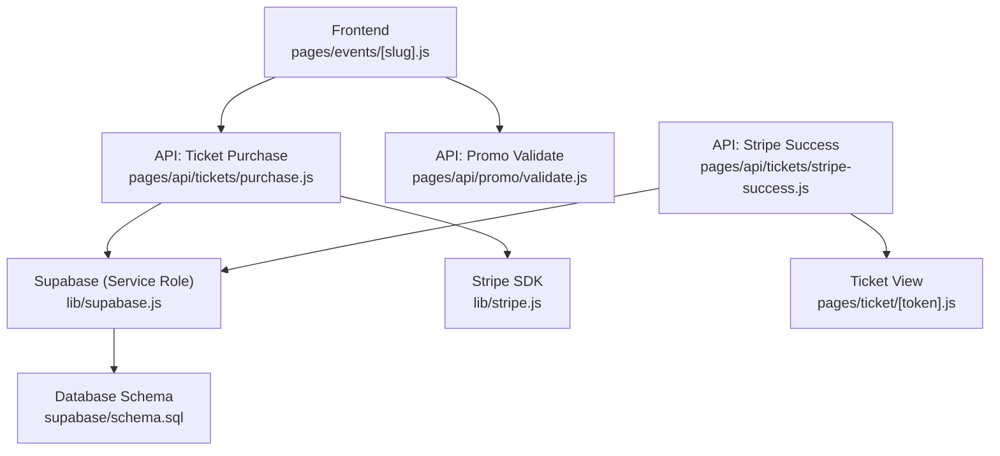
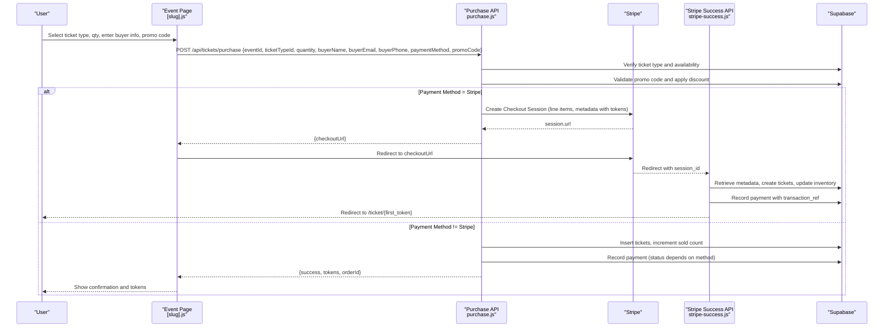
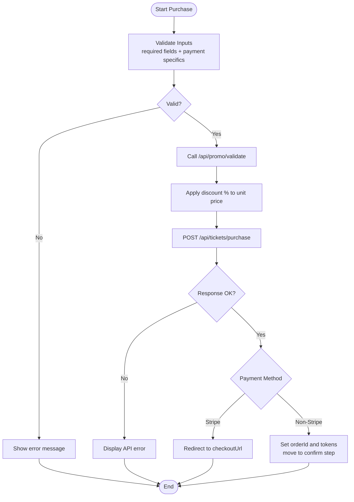
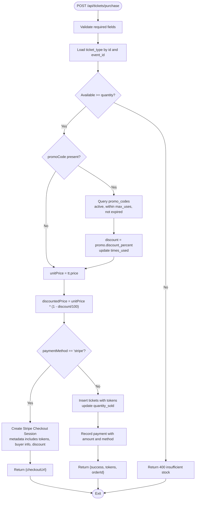
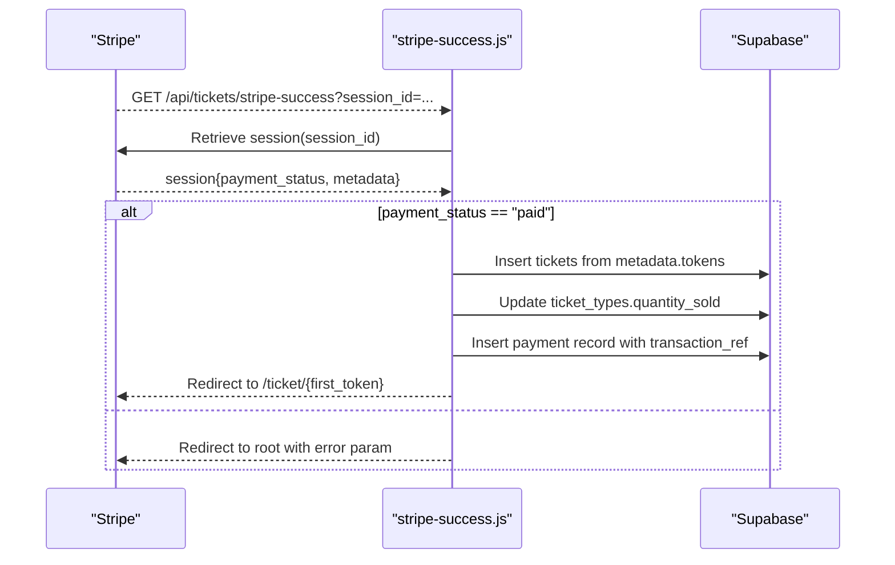
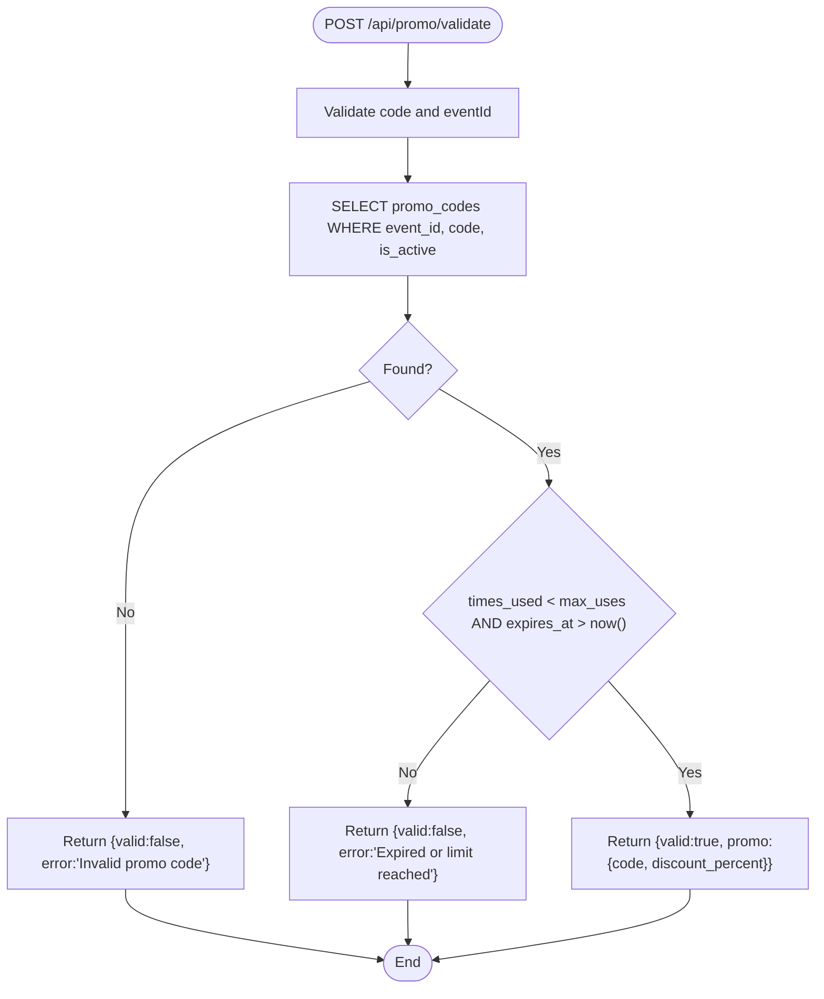
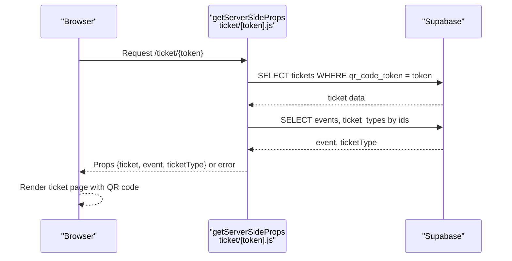
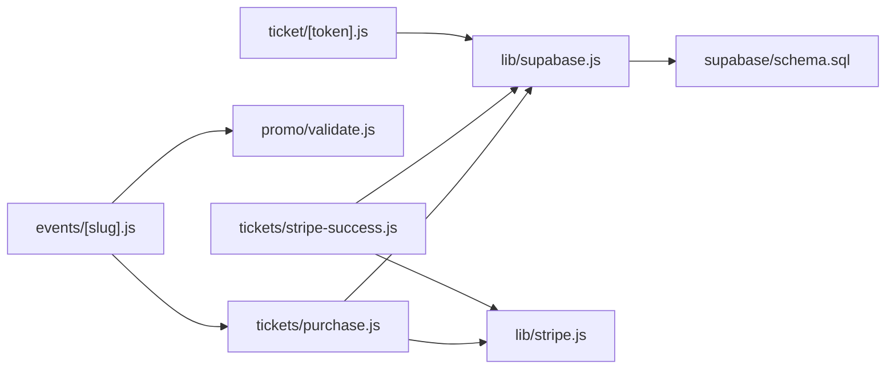

# Ticket Sales & Purchase Flow

<cite>
**Referenced Files in This Document**
- [purchase.js](file://pages/api/tickets/purchase.js)
- [stripe-success.js](file://pages/api/tickets/stripe-success.js)
- [validate.js](file://pages/api/promo/validate.js)
- [schema.sql](file://supabase/schema.sql)
- [supabase.js](file://lib/supabase.js)
- [stripe.js](file://lib/stripe.js)
- [events/[slug].js](file://pages/events/[slug].js)
- [ticket/[token].js](file://pages/ticket/[token].js)
</cite>

## Table of Contents
1. [Introduction](#introduction)
2. [Project Structure](#project-structure)
3. [Core Components](#core-components)
4. [Architecture Overview](#architecture-overview)
5. [Detailed Component Analysis](#detailed-component-analysis)
6. [Dependency Analysis](#dependency-analysis)
7. [Performance Considerations](#performance-considerations)
8. [Troubleshooting Guide](#troubleshooting-guide)
9. [Conclusion](#conclusion)

## Introduction
This document explains the end-to-end ticket purchasing workflow in the TicketFlow application, focusing on:
- Event selection and ticket quantity management
- Promo code validation and discount application
- Stripe Checkout session creation and payment success handling
- Inventory updates and ticket generation
- Error handling, retry strategies, and transaction rollback considerations
- Debugging tips for common payment issues

The flow spans the frontend event page, serverless API routes, Supabase database, and Stripe integration.

## Project Structure
Key files involved in the purchase flow:
- Frontend event page orchestrates user interactions and calls APIs
- Serverless API routes handle purchase logic, promo validation, and Stripe checkout
- Database schema defines entities for events, ticket types, tickets, payments, and promo codes
- Supabase client utilities provide service-role access for server-side operations
- Stripe utility initializes the Stripe SDK

**Diagram sources**
- [events/[slug].js](file://pages/events/[slug].js)
- [purchase.js](file://pages/api/tickets/purchase.js)
- [validate.js](file://pages/api/promo/validate.js)
- [stripe-success.js](file://pages/api/tickets/stripe-success.js)
- [supabase.js](file://lib/supabase.js)
- [stripe.js](file://lib/stripe.js)
- [schema.sql](file://supabase/schema.sql)
- [ticket/[token].js](file://pages/ticket/[token].js)

**Section sources**
- [events/[slug].js](file://pages/events/[slug].js)
- [purchase.js](file://pages/api/tickets/purchase.js)
- [validate.js](file://pages/api/promo/validate.js)
- [stripe-success.js](file://pages/api/tickets/stripe-success.js)
- [supabase.js](file://lib/supabase.js)
- [stripe.js](file://lib/stripe.js)
- [schema.sql](file://supabase/schema.sql)
- [ticket/[token].js](file://pages/ticket/[token].js)

## Core Components
- Event Page (frontend): Collects buyer info, selected ticket type, quantity, promo code, and payment method; validates inputs; calls purchase API; handles Stripe redirect or immediate confirmation.
- Purchase API: Validates request, checks availability, applies promo code, creates Stripe Checkout session or generates tickets immediately for non-Stripe methods, records payment, and returns tokens.
- Stripe Success API: Verifies payment status, creates tickets, updates inventory, records payment with Stripe metadata, and redirects to the first ticket view.
- Promo Validation API: Validates promo code existence, activity, usage limits, and expiration.
- Supabase Client: Provides service-role client for secure server-side DB operations.
- Stripe Utility: Initializes Stripe SDK instance.
- Ticket View: Displays QR code and ticket details based on token.

**Section sources**
- [events/[slug].js](file://pages/events/[slug].js)
- [purchase.js](file://pages/api/tickets/purchase.js)
- [stripe-success.js](file://pages/api/tickets/stripe-success.js)
- [validate.js](file://pages/api/promo/validate.js)
- [supabase.js](file://lib/supabase.js)
- [stripe.js](file://lib/stripe.js)
- [ticket/[token].js](file://pages/ticket/[token].js)

## Architecture Overview
The purchase flow is a multi-step process involving UI, API, external payment provider, and database.

**Diagram sources**
- [events/[slug].js](file://pages/events/[slug].js)
- [purchase.js](file://pages/api/tickets/purchase.js)
- [stripe-success.js](file://pages/api/tickets/stripe-success.js)
- [schema.sql](file://supabase/schema.sql)

**Section sources**
- [events/[slug].js](file://pages/events/[slug].js)
- [purchase.js](file://pages/api/tickets/purchase.js)
- [stripe-success.js](file://pages/api/tickets/stripe-success.js)

## Detailed Component Analysis

### Event Page Purchase Workflow
- Inputs: eventId, ticketTypeId, quantity, buyerName, buyerEmail, buyerPhone, paymentMethod, promoCode
- Validation: Ensures required fields and payment-specific input rules (e.g., card number length, phone prefix)
- Promo Application: Calls /api/promo/validate to get discount percentage if valid
- Purchase Call: POST /api/tickets/purchase with payload including attendees list
- Response Handling:
  - Stripe: Redirect to checkoutUrl
  - Non-Stripe: Display tokens and move to confirmation step

**Diagram sources**
- [events/[slug].js](file://pages/events/[slug].js)
- [validate.js](file://pages/api/promo/validate.js)
- [purchase.js](file://pages/api/tickets/purchase.js)

**Section sources**
- [events/[slug].js](file://pages/events/[slug].js)
- [validate.js](file://pages/api/promo/validate.js)

### Purchase API Logic
Responsibilities:
- Validate request body and required fields
- Verify ticket type exists and belongs to the event
- Check remaining availability (quantity_available - quantity_sold)
- Apply promo code if provided: validate active, within max_uses, not expired
- Compute discounted unit price
- For Stripe:
  - Generate unique tokens per ticket
  - Create Stripe Checkout session with line item and metadata containing all necessary context
  - Return checkoutUrl
- For non-Stripe:
  - Insert tickets into DB with generated tokens
  - Update ticket_types.quantity_sold
  - Record payment with appropriate status
  - Return tokens and orderId

**Diagram sources**
- [purchase.js](file://pages/api/tickets/purchase.js)
- [schema.sql](file://supabase/schema.sql)

**Section sources**
- [purchase.js](file://pages/api/tickets/purchase.js)

### Stripe Success Handler
Responsibilities:
- Retrieve Stripe Checkout session by session_id
- Confirm payment_status is paid
- Extract metadata (eventId, ticketTypeId, quantity, buyer info, tokens, discount)
- Create tickets using tokens from metadata
- Update ticket_types.quantity_sold
- Record payment with transaction_ref from Stripe
- Redirect to first ticket URL

**Diagram sources**
- [stripe-success.js](file://pages/api/tickets/stripe-success.js)
- [schema.sql](file://supabase/schema.sql)

**Section sources**
- [stripe-success.js](file://pages/api/tickets/stripe-success.js)

### Promo Code Validation
Responsibilities:
- Accept code and eventId
- Normalize code (trim, uppercase)
- Query promo_codes for matching event, active status
- Enforce usage limit and expiration
- Return validity and discount percentage

**Diagram sources**
- [validate.js](file://pages/api/promo/validate.js)
- [schema.sql](file://supabase/schema.sql)

**Section sources**
- [validate.js](file://pages/api/promo/validate.js)

### Ticket View
Responsibilities:
- Fetch ticket by qr_code_token via Supabase service role
- Load associated event and ticket type details
- Render QR code and ticket information
- Handle errors gracefully (not found, server error)

**Diagram sources**
- [ticket/[token].js](file://pages/ticket/[token].js)
- [schema.sql](file://supabase/schema.sql)

**Section sources**
- [ticket/[token].js](file://pages/ticket/[token].js)

## Dependency Analysis
- Frontend depends on:
  - /api/promo/validate for promo validation
  - /api/tickets/purchase for purchase initiation
  - /api/tickets/stripe-success for post-payment processing
- Purchase API depends on:
  - Supabase service client for DB operations
  - Stripe SDK for checkout session creation
- Stripe Success API depends on:
  - Stripe SDK to retrieve session
  - Supabase service client to persist tickets and payments
- Ticket View depends on:
  - Supabase service client to fetch ticket and related data

**Diagram sources**
- [events/[slug].js](file://pages/events/[slug].js)
- [purchase.js](file://pages/api/tickets/purchase.js)
- [validate.js](file://pages/api/promo/validate.js)
- [stripe-success.js](file://pages/api/tickets/stripe-success.js)
- [supabase.js](file://lib/supabase.js)
- [stripe.js](file://lib/stripe.js)
- [schema.sql](file://supabase/schema.sql)
- [ticket/[token].js](file://pages/ticket/[token].js)

**Section sources**
- [events/[slug].js](file://pages/events/[slug].js)
- [purchase.js](file://pages/api/tickets/purchase.js)
- [validate.js](file://pages/api/promo/validate.js)
- [stripe-success.js](file://pages/api/tickets/stripe-success.js)
- [supabase.js](file://lib/supabase.js)
- [stripe.js](file://lib/stripe.js)
- [schema.sql](file://supabase/schema.sql)
- [ticket/[token].js](file://pages/ticket/[token].js)

## Performance Considerations
- Avoid redundant DB queries by batching where possible (e.g., fetching event and ticket type details together).
- Use indexes defined in schema for fast lookups (qr_code_token, event_id, buyer_email).
- Minimize network calls by validating promo codes once and caching results in frontend state during a single purchase session.
- Stripe Checkout offloads payment processing to reduce server load and improve reliability.
- Ensure environment variables are set to avoid placeholder clients that could degrade performance or cause failures.

[No sources needed since this section provides general guidance]

## Troubleshooting Guide
Common issues and solutions:
- Missing required fields in purchase request:
  - Ensure eventId, ticketTypeId, quantity, buyerName, buyerEmail are included.
  - Validate payment-specific inputs (card number length, phone prefix).
- Insufficient stock:
  - Check ticket_types.quantity_available vs quantity_sold; prevent overbooking at the API level.
- Promo code invalid/expired:
  - Verify promo_codes.is_active, times_used < max_uses, and expires_at > current time.
- Stripe session creation fails:
  - Confirm STRIPE_SECRET_KEY is set and valid; ensure NEXT_PUBLIC_SITE_URL is correct for success_url.
- Payment not marked as paid:
  - stripe-success handler checks payment_status; ensure Stripe webhook or redirect flows are configured correctly.
- Tickets not created for non-Stripe payments:
  - Verify DB insert succeeds and quantity_sold increments; check payment status mapping for method.
- Ticket view shows not found:
  - Ensure qr_code_token is unique and persisted; verify Supabase service role key is configured.

Debugging tips:
- Log API responses and errors in browser console and server logs.
- Inspect Stripe session metadata to confirm tokens and buyer info are passed through.
- Use Supabase dashboard to inspect tables for inserted tickets and payments.
- Validate environment variables in .env.local for Supabase and Stripe keys.

**Section sources**
- [purchase.js](file://pages/api/tickets/purchase.js)
- [stripe-success.js](file://pages/api/tickets/stripe-success.js)
- [validate.js](file://pages/api/promo/validate.js)
- [supabase.js](file://lib/supabase.js)
- [schema.sql](file://supabase/schema.sql)

## Conclusion
The TicketFlow purchase flow integrates frontend validation, server-side business logic, Stripe Checkout, and Supabase persistence to deliver a robust ticketing experience. Key strengths include clear separation of concerns, explicit inventory checks, promo code support, and reliable payment verification. To enhance resilience, consider implementing database transactions for atomicity, adding retries for transient failures, and strengthening error messages for better user feedback.

[No sources needed since this section summarizes without analyzing specific files]